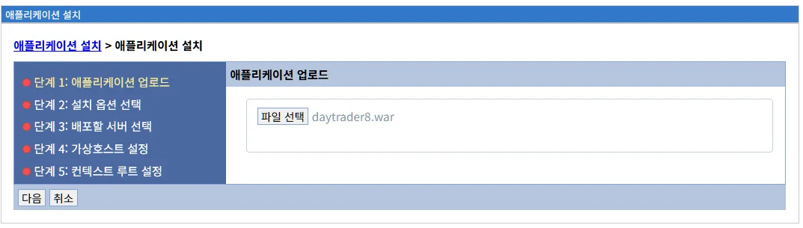
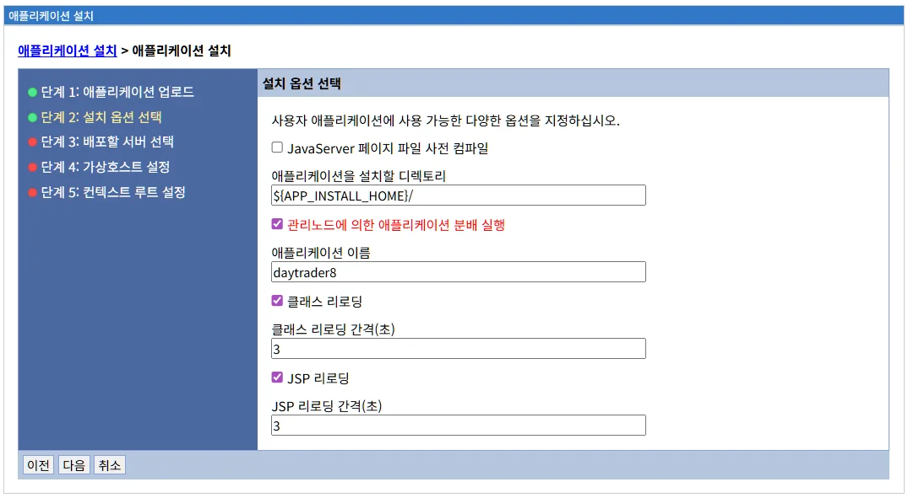
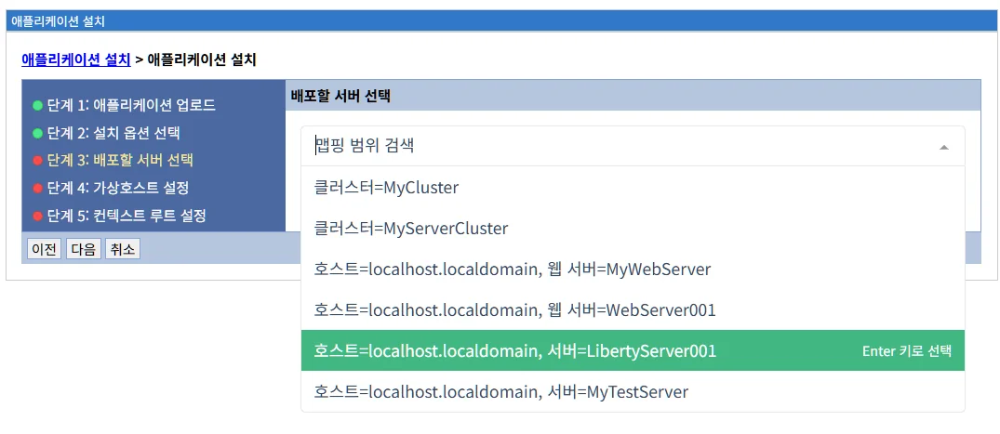
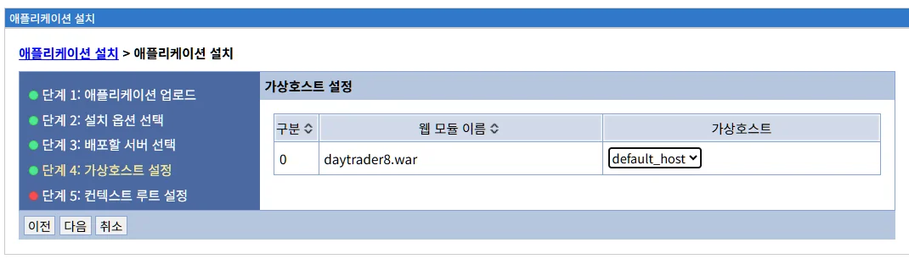
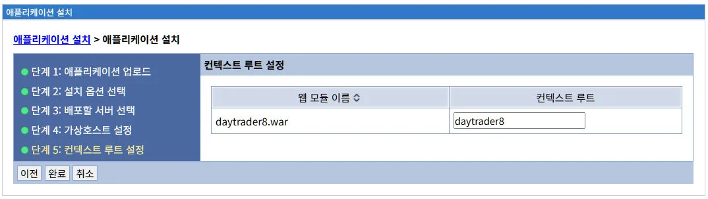

# 애플리케이션 설치

애플리케이션 설치 메뉴는 LibriX 관리콘솔에서 엔터프라이즈 애플리케이션(WAR, EAR 파일)을 Open Liberty 서버에 배포하는 기능을 제공합니다. 파일 업로드와 몇 가지 설정만으로 복잡한 배포 과정을 간소화하는 방법을 설명합니다.

## 목차

- [개요](#개요)
- [애플리케이션 설치 프로세스](#애플리케이션-설치-프로세스)
- [단계 1: 애플리케이션 업로드](#단계-1-애플리케이션-업로드)
- [단계 2: 설치 옵션 선택](#단계-2-설치-옵션-선택)
- [단계 3: 배포할 서버 선택](#단계-3-배포할-서버-선택)
- [단계 4: 가상호스트 설정](#단계-4-가상호스트-설정)
- [단계 5: 컨텍스트 루트 설정](#단계-5-컨텍스트-루트-설정)
- [애플리케이션 설치 모범 사례](#애플리케이션-설치-모범-사례)
- [애플리케이션 관리](#애플리케이션-관리)
- [문제 해결](#문제-해결)
- [다음 단계](#다음-단계)

---
## 개요

애플리케이션 설치 메뉴는 LibriX 관리콘솔에서 엔터프라이즈 애플리케이션(WAR, EAR 파일)을 Open Liberty 서버에 배포하는 기능을 제공합니다. LibriX는 복잡한 배포 과정을 웹 UI로 간소화하여, 파일 업로드와 몇 가지 설정만으로 애플리케이션을 배포할 수 있습니다.

### 지원되는 애플리케이션 유형

LibriX는 다음과 같은 엔터프라이즈 애플리케이션 형식을 지원합니다:

**WAR (Web Application Archive)**

Java 웹 애플리케이션을 패키징한 파일로, 다음을 포함합니다:
- Servlet, JSP 파일
- HTML, CSS, JavaScript 등 정적 리소스
- WEB-INF/web.xml (배포 기술자)
- WEB-INF/lib (라이브러리 JAR 파일)
- WEB-INF/classes (컴파일된 클래스 파일)

**EAR (Enterprise Application Archive)**

여러 모듈을 포함하는 엔터프라이즈 애플리케이션으로, 다음을 포함할 수 있습니다:
- WAR 파일 (웹 모듈)
- JAR 파일 (EJB 모듈)
- RAR 파일 (리소스 어댑터)
- META-INF/application.xml (애플리케이션 기술자)
- 공유 라이브러리

### Liberty의 전통적인 애플리케이션 배포 방식

Open Liberty에서 애플리케이션을 배포하는 전통적인 방법:

**1. Dropins 디렉토리 사용**

가장 간단한 방법으로, 애플리케이션 파일을 dropins 디렉토리에 복사하면 자동 배포됩니다:

```bash
# WAR 파일 복사
cp myapp.war $WLP_HOME/usr/servers/myServer/dropins/

# 자동으로 배포됨 (server.xml 수정 불필요)
```

**장점:**
- 매우 간단하고 빠름
- server.xml 수정 불필요
- 자동 모니터링 및 재배포

**단점:**
- 고급 구성 옵션 제한적
- Context Root, 클래스로더 정책 등 커스터마이징 어려움
- 보안 역할 매핑 등 추가 설정 불가

**2. server.xml 구성 파일 편집**

더 많은 제어가 필요한 경우 server.xml에 애플리케이션을 정의합니다:

```xml
<server>
  <featureManager>
    <feature>servlet-4.0</feature>
    <feature>jaxrs-2.1</feature>
  </featureManager>
  
  <!-- WAR 파일 배포 -->
  <webApplication 
    id="myapp" 
    name="myapp" 
    location="${server.config.dir}/apps/myapp.war"
    context-root="/myapp">
    
    <!-- 클래스로더 정책 -->
    <classloader delegation="parentLast"/>
    
    <!-- 보안 역할 매핑 -->
    <application-bnd>
      <security-role name="admin">
        <user name="adminUser"/>
      </security-role>
    </application-bnd>
  </webApplication>
  
  <!-- EAR 파일 배포 -->
  <enterpriseApplication 
    id="myenterpriseapp" 
    name="myenterpriseapp" 
    location="${server.config.dir}/apps/myenterpriseapp.ear">
    
    <!-- 공유 라이브러리 참조 -->
    <classloader commonLibraryRef="mySharedLib"/>
  </enterpriseApplication>
  
  <!-- 공유 라이브러리 정의 -->
  <library id="mySharedLib">
    <fileset dir="${shared.resource.dir}/lib" includes="*.jar"/>
  </library>
</server>
```

**수동 배포 과정:**

1. 애플리케이션 파일을 서버에 복사
   ```bash
   scp myapp.war user@server:/opt/liberty/usr/servers/myServer/apps/
   ```

2. server.xml 파일 편집
   ```bash
   vi /opt/liberty/usr/servers/myServer/server.xml
   ```

3. 애플리케이션 구성 추가 (위의 XML 예시)

4. 필요한 Liberty 기능(feature) 확인 및 추가
   - servlet-4.0, jaxrs-2.1, ejb-3.2 등

5. 서버 재시작 (또는 동적 업데이트 대기)
   ```bash
   /opt/liberty/bin/server stop myServer
   /opt/liberty/bin/server start myServer
   ```

6. 로그 확인
   ```bash
   tail -f /opt/liberty/usr/servers/myServer/logs/messages.log
   ```

**장점:**
- 세밀한 제어 가능
- 고급 구성 옵션 사용
- 보안, 클래스로더, 리소스 참조 등 커스터마이징

**단점:**
- XML 구문 이해 필요
- 수동 파일 복사 및 편집
- 오류 발생 시 디버깅 어려움
- 여러 서버에 배포 시 반복 작업

### LibriX의 접근 방식

LibriX는 애플리케이션 배포 과정을 다단계 마법사로 간소화합니다:

**LibriX의 장점:**

- **파일 업로드**: 로컬 PC에서 직접 애플리케이션 파일 업로드
- **자동 구성 생성**: 입력된 정보를 바탕으로 server.xml 자동 생성
- **배포 대상 선택**: 여러 서버나 클러스터에 동시 배포 가능
- **사전 검증**: 애플리케이션 유효성 검사 및 오류 사전 방지
- **일괄 배포**: 동일한 애플리케이션을 여러 서버에 일관되게 배포
- **롤백 지원**: 배포 실패 시 이전 상태로 복구
- **중앙 관리**: 배포된 애플리케이션을 한 곳에서 관리

**비교:**

| 기능 | Liberty 수동 배포 | LibriX |
|------|------------------|--------|
| **파일 전송** | SCP, FTP 등 | 웹 UI 업로드 |
| **구성 편집** | server.xml 수동 편집 | 웹 폼 입력 |
| **배포 대상** | 서버별 개별 작업 | 여러 서버 일괄 선택 |
| **검증** | 배포 후 로그 확인 | 사전 검증 |
| **롤백** | 수동 복구 | 자동 롤백 |
| **모니터링** | 로그 파일 확인 | 웹 UI 대시보드 |

## 애플리케이션 설치 프로세스

애플리케이션 설치는 5단계로 구성되어 있습니다:

1. **단계 1: 애플리케이션 업로드** - 배포할 파일 선택
2. **단계 2: 설치 옵션 선택** - Context Root, 이름 등 기본 설정
3. **단계 3: 배포할 서버 선택** - 배포 대상 서버 또는 클러스터 선택
4. **단계 4: 가상호스트 설정** - 가상 호스트 매핑 구성
5. **단계 5: 컨텍스트 루트 설정** - 최종 설정 확인 및 배포

### 단계 1: 애플리케이션 업로드

첫 번째 단계에서는 배포할 애플리케이션 파일을 LibriX 관리콘솔에 업로드합니다.



#### 애플리케이션 업로드 섹션

**파일 선택**

"파일 선택" 버튼을 클릭하여 로컬 컴퓨터에서 배포할 애플리케이션 파일을 선택합니다.

지원되는 파일 형식:
- `.war` - Web Application Archive
- `.ear` - Enterprise Application Archive

**선택된 파일 표시**

파일을 선택하면 파일명이 표시됩니다 (예: daytrader8.war).

이 화면에서 파일명, 크기, 유형 등을 확인할 수 있습니다.

#### 파일 업로드 고려사항

**파일 크기 제한**

LibriX는 대용량 애플리케이션 파일도 지원하지만, 네트워크 속도와 타임아웃 설정에 따라 업로드 시간이 달라질 수 있습니다.

- 소형 애플리케이션 (<10MB): 일반적으로 수 초 내 업로드
- 중형 애플리케이션 (10-100MB): 수 초에서 수 분
- 대형 애플리케이션 (>100MB): 수 분 이상 소요 가능

네트워크가 불안정하거나 파일이 매우 큰 경우, 서버에 직접 파일을 복사한 후 파일 경로를 지정하는 방법도 고려할 수 있습니다.

**파일 유효성 검증**

파일을 업로드하면 LibriX는 다음 사항을 자동으로 검증합니다:

- 파일 형식이 올바른지 (.war, .ear)
- 파일이 손상되지 않았는지
- 필수 매니페스트 파일이 포함되어 있는지
- 애플리케이션 기술자(deployment descriptor)가 유효한지

검증 오류가 발생하면 상세한 오류 메시지가 표시되며, 배포를 진행할 수 없습니다.

**보안 고려사항**

업로드된 파일은 LibriX 서버의 임시 디렉토리에 저장되며, 배포가 완료되면 대상 서버로 전송됩니다. 파일 전송은 암호화된 연결을 통해 이루어지므로 보안이 유지됩니다.

#### WebSphere ND와의 비교

**WebSphere ND 애플리케이션 설치:**

1. Deployment Manager 콘솔에 로그인
2. Applications → New Application → New Enterprise Application 선택
3. 로컬 파일 시스템 또는 원격 서버에서 파일 선택
4. 파일 업로드 (대용량 파일의 경우 시간 소요)
5. 애플리케이션 유형 자동 감지 (WAR, EAR 등)

**LibriX 애플리케이션 업로드:**

1. 애플리케이션 설치 메뉴 선택
2. 파일 선택 버튼 클릭
3. 로컬 파일 선택
4. 자동 업로드 및 검증

LibriX는 WebSphere ND와 유사한 파일 선택 인터페이스를 제공하지만, 더 직관적이고 빠른 검증 프로세스를 제공합니다.

#### 다음 단계로 이동

파일을 성공적으로 업로드한 후:

- **다음**: 2단계로 이동하여 설치 옵션을 선택합니다
- **취소**: 애플리케이션 설치 프로세스를 취소하고 메인 화면으로 돌아갑니다

### 단계 2: 설치 옵션 선택

두 번째 단계에서는 애플리케이션의 기본 설정을 구성합니다.



#### 설치 옵션 선택 안내

화면 상단에는 "사용자 애플리케이션에 사용 가능한 다양한 옵션을 지정하십시오."라는 안내 메시지가 표시됩니다.

이 단계에서는 애플리케이션의 배포 디렉토리, 이름, 클래스 리로딩, JSP 리로딩 등의 옵션을 설정할 수 있습니다.

#### JavaServer 페이지 파일 사전 컴파일

**JavaServer 페이지 파일 사전 컴파일** (체크박스)

JSP 파일을 애플리케이션 배포 시점에 미리 컴파일할지 여부를 선택합니다.

**JSP 컴파일 프로세스 이해하기**

JavaServer Pages (JSP)는 동적 웹 페이지를 생성하기 위한 Java 기반 기술입니다. JSP 파일은 HTML과 Java 코드가 혼합된 형태로 작성되며, 실제 실행되기 전에 Java 서블릿 클래스로 변환(컴파일)되어야 합니다.

JSP 파일이 서블릿으로 변환되는 과정:
1. **변환 (Translation)**: JSP 파일이 Java 소스 코드(.java)로 변환됩니다
2. **컴파일 (Compilation)**: Java 소스 코드가 바이트코드(.class)로 컴파일됩니다
3. **로딩 (Loading)**: 컴파일된 클래스가 JVM에 로드됩니다
4. **실행 (Execution)**: 요청이 들어오면 로드된 서블릿이 실행됩니다

**선택하지 않은 경우 (On-Demand 컴파일, 기본값):**

JSP 파일은 처음 요청될 때 컴파일됩니다. 이 방식을 "지연 컴파일" 또는 "Just-In-Time 컴파일"이라고도 합니다.

동작 방식:
- 사용자가 처음 JSP 페이지를 요청하면 Liberty가 JSP를 서블릿으로 변환하고 컴파일합니다
- 컴파일된 서블릿은 캐시에 저장되어 이후 요청에 재사용됩니다
- JSP 파일이 수정되면 다음 요청 시 자동으로 재컴파일됩니다

장점:
- 배포 시간이 빠릅니다 (컴파일 단계를 건너뜀)
- 개발 중 JSP 파일을 수정하고 즉시 테스트할 수 있습니다
- 사용하지 않는 JSP는 컴파일되지 않아 리소스를 절약합니다
- JSP 리로딩 기능과 함께 사용하면 개발 생산성이 높아집니다

단점:
- 첫 번째 사용자가 각 JSP를 처음 요청할 때 응답 시간이 느립니다
- 프로덕션 환경에서 사용자가 컴파일 지연을 경험할 수 있습니다
- JSP에 문법 오류가 있어도 해당 페이지가 요청되기 전까지 발견되지 않습니다

권장 사용 환경:
- 개발 환경: JSP를 자주 수정하는 경우
- 테스트 환경: 기능 테스트 중

**선택한 경우 (사전 컴파일, Precompilation):**

모든 JSP 파일이 애플리케이션 배포 시점에 서블릿으로 미리 컴파일됩니다.

동작 방식:
- 애플리케이션을 배포할 때 Liberty가 모든 JSP 파일을 찾아서 컴파일합니다
- 컴파일된 서블릿 클래스가 애플리케이션 아카이브에 포함됩니다
- 사용자가 JSP를 요청하면 이미 컴파일된 서블릿이 즉시 실행됩니다
- 배포 후에는 JSP 소스 파일이 변경되어도 반영되지 않습니다 (재배포 필요)

장점:
- 첫 번째 요청부터 빠른 응답 시간을 제공합니다
- 모든 사용자에게 일관된 성능을 보장합니다
- JSP 문법 오류를 배포 시점에 발견할 수 있습니다 (조기 오류 감지)
- 프로덕션 환경에서 JSP 소스 코드 노출 위험이 없습니다
- 서버 시작 시간이 단축됩니다 (런타임 컴파일 불필요)

단점:
- 배포 시간이 증가합니다 (모든 JSP를 컴파일해야 함)
- 대규모 애플리케이션의 경우 배포 시간이 크게 늘어날 수 있습니다
- 개발 중 JSP 수정 후 즉시 확인할 수 없습니다 (재배포 필요)
- 사용하지 않는 JSP도 컴파일되어 리소스가 소비됩니다

권장 사용 환경:
- 프로덕션 환경: 성능과 보안이 중요한 경우
- 스테이징 환경: 프로덕션과 유사한 환경에서 테스트
- 배포 후 JSP 수정이 없는 안정적인 애플리케이션

**환경별 권장 설정:**

| 환경 | JSP 사전 컴파일 | 이유 |
|------|----------------|------|
| **개발** | ❌ 선택 안 함 | JSP 수정 후 즉시 테스트 가능 |
| **테스트** | ❌ 선택 안 함 | 기능 테스트 중 빠른 반복 |
| **스테이징** | ✅ 선택 | 프로덕션 환경 시뮬레이션 |
| **프로덕션** | ✅ 선택 | 최적 성능 및 보안 |

**성능 고려사항**

사전 컴파일 시 배포 시간 예측:
- 소규모 애플리케이션 (10-50개 JSP): 10-30초 추가
- 중규모 애플리케이션 (50-200개 JSP): 30초-2분 추가
- 대규모 애플리케이션 (200개+ JSP): 2-5분 이상 추가

첫 요청 응답 시간 차이:
- On-Demand: 첫 요청 시 2-5초 지연 (복잡한 JSP의 경우)
- 사전 컴파일: 첫 요청도 밀리초 단위 응답

**WebSphere ND와의 비교:**

WebSphere Application Server Network Deployment에서도 유사한 JSP 컴파일 옵션을 제공합니다. 애플리케이션 설치 마법사의 "JSP Compilation" 단계에서 다음 옵션을 선택할 수 있습니다:

- **Precompile JavaServer Pages files**: JSP 사전 컴파일 활성화
- **Compile mode**: Full (모든 JSP) 또는 Partial (일부 JSP만)
- **Number of compilation threads**: 병렬 컴파일 스레드 수

Liberty는 WebSphere ND와 동일한 개념을 사용하지만, 더 간결한 설정 방식을 제공합니다.

**모범 사례**

1. **개발 단계**: 사전 컴파일을 비활성화하고 JSP 리로딩을 활성화하여 빠른 개발 주기 유지

2. **CI/CD 파이프라인**: 스테이징 환경에서 사전 컴파일을 활성화하여 JSP 오류 조기 감지

3. **프로덕션 배포**: 항상 사전 컴파일을 활성화하여 최적의 사용자 경험 제공

4. **대규모 애플리케이션**: 배포 시간이 문제가 되는 경우, Blue-Green 배포 전략을 사용하여 컴파일 시간을 사용자에게 영향을 주지 않도록 처리

5. **하이브리드 접근**: 자주 사용되는 주요 JSP만 사전 컴파일하고 나머지는 On-Demand로 처리하는 것도 고려 (custom 스크립트 필요)

#### 애플리케이션을 설치할 디렉토리

**애플리케이션을 설치할 디렉토리** (텍스트 필드)

애플리케이션 파일이 저장될 서버의 디렉토리 경로를 지정합니다.

**기본값:** `${APP_INSTALL_HOME}/`

이는 Librix 변수( 메뉴 > 환경 > Liberty 변수 )에 기본 정의된 경로이며, 일반적으로 기본값은 아래와 같습니다.
- [Librix 설치 홈디렉토리]/apps

**사용자 정의 경로:**

필요한 경우 다른 디렉토리를 지정할 수 있습니다:
- `/opt/applications/` (절대 경로)
- `${shared.app.dir}/` (공유 애플리케이션 디렉토리)
- `${server.config.dir}/myapps/` (커스텀 디렉토리)

**고려사항:**

- 지정한 디렉토리가 존재하지 않으면 자동으로 생성됩니다
- 서버 프로세스가 해당 디렉토리에 대한 읽기/쓰기 권한을 가져야 합니다
- 여러 서버에 동일한 애플리케이션을 배포하는 경우, 각 서버마다 별도의 디렉토리를 사용하는 것이 좋습니다
- 공유 스토리지를 사용하는 경우 주의가 필요합니다

**WebSphere ND와의 비교:**

WebSphere ND에서는 애플리케이션 설치 시 "Directory to install application" 옵션에서 동일한 설정을 제공합니다. 기본적으로 `${WAS_INSTALL_ROOT}/installedApps/${CELL}/` 디렉토리를 사용합니다.

#### 관리노드에 의한 애플리케이션 분배 설정

**관리노드에 의한 애플리케이션 분배 설정** (체크박스, 선택됨)

이 옵션은 LibriX Agent를 통해 애플리케이션을 배포 대상 서버에 자동으로 전송할지 여부를 결정합니다.

**선택한 경우 (권장):**
- LibriX 관리콘솔에서 Agent를 통해 애플리케이션 파일을 자동으로 배포합니다
- 중앙 집중식 배포 관리가 가능합니다
- 여러 서버에 동시 배포가 간편합니다
- 파일 전송 및 배포 상태를 실시간으로 모니터링할 수 있습니다

**선택하지 않은 경우:**
- 애플리케이션 파일을 수동으로 각 서버에 복사해야 합니다
- 분산 환경에서 관리가 복잡해집니다
- 일관성 유지가 어려울 수 있습니다

**WebSphere ND와의 비교:**

이는 WebSphere ND의 "Distribute application" 옵션과 유사합니다. WebSphere ND에서는 Deployment Manager가 NodeAgent를 통해 애플리케이션을 각 노드에 배포합니다. LibriX는 동일한 개념을 LibriX Agent를 통해 구현합니다.

#### 애플리케이션 이름

**애플리케이션 이름** (텍스트 필드)

애플리케이션의 논리적 이름을 지정합니다.

**기본값:** WAR 파일 이름에서 확장자를 제외한 이름 (예: daytrader8.war → daytrader8)

이 이름은 다음 용도로 사용됩니다:
- 서버 구성 파일(server.xml)에서 애플리케이션 식별
- 관리콘솔에서 애플리케이션 관리 시 표시 이름
- 로그 메시지에서 애플리케이션 참조
- JMX MBean 이름의 일부

**명명 규칙 권장사항:**

- 의미 있고 설명적인 이름 사용
- 영문자, 숫자, 하이픈(-), 언더스코어(_) 사용
- 공백 사용 자제
- 특수문자 사용 자제
- 환경별로 구분이 필요한 경우 접두사 또는 접미사 사용 (예: prod-daytrader8, daytrader8-test)

**좋은 예시:**
- `customer-portal`
- `order_service`
- `hr_app_v2`

**나쁜 예시:**
- `app1` (의미 불명확)
- `My Application!` (공백 및 특수문자)

**WebSphere ND와의 비교:**

WebSphere ND에서는 "Application name" 필드에서 동일한 설정을 제공합니다. 이 이름은 애플리케이션의 고유 식별자로 사용되며, 동일한 이름의 애플리케이션을 중복 설치할 수 없습니다.

Liberty의 server.xml에서는 다음과 같이 표현됩니다:

```xml
<webApplication id="daytrader8" name="daytrader8" 
  location="${server.config.dir}/apps/daytrader8.war" 
  context-root="/daytrader8"/>
```

#### 클래스 리로딩

**클래스 리로딩** (체크박스, 선택됨)

애플리케이션의 클래스 파일이 변경되었을 때 자동으로 다시 로드할지 여부를 선택합니다.

**선택한 경우:**
- 애플리케이션의 클래스 파일(`.class`)이 변경되면 자동으로 감지합니다
- 지정된 간격마다 파일 시스템을 스캔하여 변경 사항을 확인합니다
- 변경이 감지되면 애플리케이션을 자동으로 재시작합니다
- 개발 환경에서 매우 유용합니다 (코드 수정 후 서버 재시작 불필요)

**선택하지 않은 경우:**
- 클래스 파일이 변경되어도 자동으로 반영되지 않습니다
- 서버를 재시작해야 변경 사항이 적용됩니다
- 프로덕션 환경에서는 성능상 이점이 있을 수 있습니다

**클래스 리로딩 간격(초)** (숫자 필드, 기본값: 3)

파일 시스템을 스캔하는 주기를 초 단위로 지정합니다.

**값의 의미:**
- `0`: 리로딩 비활성화 (클래스 리로딩 체크박스가 선택되어도 효과 없음)
- `1-10`: 빠른 리로딩, 높은 파일 시스템 부하
- `3` (권장): 개발 환경에서 적절한 균형
- `5-30`: 보통 속도, 보통 부하
- `30+`: 느린 리로딩, 낮은 부하

**환경별 권장 설정:**

| 환경 | 클래스 리로딩 | 간격(초) |
|------|--------------|---------|
| **개발** | 활성화 | 3 |
| **테스트** | 활성화 | 5-10 |
| **스테이징** | 비활성화 | 0 |
| **프로덕션** | 비활성화 | 0 |

**주의사항:**

- 클래스 리로딩은 애플리케이션 전체를 재시작하므로 세션 데이터가 손실될 수 있습니다
- 대규모 애플리케이션의 경우 리로딩에 시간이 소요될 수 있습니다
- 프로덕션 환경에서는 성능 영향을 고려하여 비활성화하는 것이 권장됩니다
- 파일 시스템 I/O가 증가하므로 간격을 너무 짧게 설정하지 않는 것이 좋습니다

**WebSphere ND와의 비교:**

WebSphere ND에서는 "Class loading and update detection" 설정에서 동일한 기능을 제공합니다:
- "Reload classes when application files are updated" 옵션
- "Polling interval for updated files" (초)
- IBM은 개발 환경에서 3초를 권장합니다

#### JSP 리로딩

**JSP 리로딩** (체크박스, 선택됨)

JSP 파일이 변경되었을 때 자동으로 다시 컴파일하고 로드할지 여부를 선택합니다.

**선택한 경우:**
- JSP 소스 파일(`.jsp`, `.jspx`)이 변경되면 자동으로 감지합니다
- 변경된 JSP를 자동으로 재컴파일하고 로드합니다
- 브라우저를 새로고침하면 즉시 변경 사항을 확인할 수 있습니다
- 개발 환경에서 매우 유용합니다
- 클래스 리로딩과 달리 애플리케이션 전체를 재시작하지 않습니다

**선택하지 않은 경우:**
- JSP 파일이 변경되어도 자동으로 반영되지 않습니다
- 서버를 재시작하거나 애플리케이션을 재배포해야 변경 사항이 적용됩니다
- 프로덕션 환경에서 권장됩니다

**JSP 리로딩 간격(초)** (숫자 필드, 기본값: 3)

JSP 파일의 변경 사항을 확인하는 주기를 초 단위로 지정합니다.

**값의 의미:**
- `0`: 리로딩 비활성화
- `1-5`: 빠른 리로딩, 즉각적인 반영 (개발 환경)
- `5` (기본값): WebSphere 전통적 기본값
- `10-30`: 보통 속도 (테스트 환경)
- `30+` 또는 `1800` (30분): 프로덕션 환경에서 드물게 사용

**환경별 권장 설정:**

| 환경 | JSP 리로딩 | 간격(초) |
|------|-----------|---------|
| **개발** | 활성화 | 3 |
| **테스트** | 활성화 | 5-10 |
| **스테이징** | 활성화 | 1800 (30분) |
| **프로덕션** | 비활성화 | 0 |

**JSP 리로딩의 장점:**

- 애플리케이션 재시작 불필요
- 클래스 리로딩보다 빠름 (JSP만 재컴파일)
- 세션 데이터 유지
- 다른 사용자에게 영향 없음

**주의사항:**

- JSP에서 사용하는 자바 클래스가 변경된 경우 클래스 리로딩이나 서버 재시작이 필요합니다
- 포함된 JSP 파일(`<%@ include %>`)이 변경된 경우 포함하는 JSP도 변경되어야 반영됩니다
- 프로덕션 환경에서는 보안상 비활성화하는 것이 권장됩니다 (소스 코드 노출 방지)
- 파일 시스템 모니터링으로 인한 약간의 성능 오버헤드가 있습니다

**WebSphere ND와의 비교:**

WebSphere ND에서는 "JSP and JSF options" 설정에서 동일한 기능을 제공합니다:
- "Enable reloading" 옵션
- "Reload interval" (초)
- 기본 간격은 5초입니다

Liberty에서도 ND와 동일하게 ibm-web-ext.xml 파일에서 다음과 같이 표현됩니다:

```xml
<jsp-attributes>
  <jsp-attribute name="reloadingEnabled" value="true"/>
  <jsp-attribute name="reloadInterval" value="3"/>
</jsp-attributes>
```

#### 클래스 리로딩 vs JSP 리로딩 비교

| 특성 | 클래스 리로딩 | JSP 리로딩 |
|------|--------------|-----------|
| **대상** | .class 파일 | .jsp, .jspx 파일 |
| **재시작** | 애플리케이션 재시작 | JSP만 재컴파일 |
| **속도** | 느림 (수 초~수십 초) | 빠름 (수 초) |
| **세션** | 손실 가능 | 유지됨 |
| **영향 범위** | 전체 애플리케이션 | 해당 JSP만 |
| **프로덕션** | 비활성화 권장 | 비활성화 권장 |
| **개발** | 활성화 권장 | 활성화 권장 |

#### 다음 단계로 이동

설치 옵션을 모두 구성한 후:

- **이전**: 1단계로 돌아가서 애플리케이션 파일을 변경할 수 있습니다
- **다음**: 3단계로 이동하여 배포 대상 서버를 선택합니다
- **취소**: 애플리케이션 설치 프로세스를 취소하고 메인 화면으로 돌아갑니다

### 단계 3: 배포할 서버 선택

세 번째 단계에서는 애플리케이션을 배포할 대상 서버 또는 클러스터를 선택합니다.



#### 배포할 서버 선택 개요

이 단계는 애플리케이션 배포에서 가장 중요한 단계 중 하나입니다. 여기서 선택한 서버나 클러스터에 애플리케이션이 실제로 배포되고 실행됩니다.

LibriX는 다음 배포 대상을 지원합니다:
- **개별 애플리케이션 서버**: 특정 Liberty 서버에 배포
- **클러스터**: 클러스터의 모든 멤버 서버에 일괄 배포
- **웹서버**: 웹서버와 연계된 애플리케이션 서버에 배포

#### 맵핑 범위 검색

**맵핑 범위 검색** (확장 가능한 섹션)

배포 대상을 선택하기 위한 검색 및 필터링 기능을 제공합니다.

화면에는 다음과 같은 배포 대상 목록이 표시됩니다:

**클러스터 대상**

클러스터를 선택하면 클러스터에 속한 모든 멤버 서버에 애플리케이션이 자동으로 배포됩니다.

예시:
- `클러스터=MyCluster`
- `클러스터=MyServerCluster`

클러스터 배포의 장점:
- 모든 멤버에 동일한 애플리케이션 버전이 배포됩니다
- 고가용성이 보장됩니다 (한 서버 장애 시 다른 서버가 처리)
- 로드 밸런싱이 자동으로 구성됩니다
- 중앙 관리가 용이합니다

클러스터 배포 시 고려사항:
- 클러스터의 모든 멤버는 동일한 환경을 가져야 합니다
- 배포 시간이 멤버 수에 비례하여 증가합니다
- 세션 복제가 구성되어 있어야 세션 데이터가 유지됩니다

**웹서버 대상**

웹서버와 연계된 애플리케이션 서버에 배포합니다.

예시:
- `호스트=localhost.localdomain, 웹 서버=MyWebServer`
- `호스트=localhost.localdomain, 웹 서버=WebServer001`

웹서버 배포의 특징:
- 애플리케이션이 백엔드 애플리케이션 서버에 배포됩니다
- 웹서버의 플러그인 구성시 해당 애플리케이션 정보와 배포된 애플리케이션 서버의 정보를 반영합니다.
- 웹서버를 통한 HTTP 요청이 애플리케이션 서버로 라우팅됩니다

**애플리케이션 서버 대상**

개별 Liberty 서버에 직접 배포합니다.

예시:
- `호스트=localhost.localdomain, 서버=LibertyServer001` (선택된 상태, 녹색 배경)
- `호스트=localhost.localdomain, 서버=MyTestServer`

개별 서버 배포의 특징:
- 특정 서버에만 애플리케이션을 배포합니다
- 개발 및 테스트 환경에 적합합니다
- 빠른 배포가 가능합니다
- 다른 서버에는 영향을 주지 않습니다

#### 배포 대상 선택

목록에서 배포 대상을 선택하는 방법:

**단일 선택**

배포할 서버나 클러스터를 클릭하여 선택합니다. 선택된 항목은 녹색 배경으로 강조 표시됩니다.

예시 화면에서는 `호스트=localhost.localdomain, 서버=LibertyServer001`이 선택된 상태입니다.

**여러 대상 선택**

LibriX는 여러 배포 대상을 동시에 선택할 수 있습니다 (일반적으로 체크박스 또는 Ctrl+클릭 사용):

- 여러 개별 서버에 동시 배포
- 여러 클러스터에 동시 배포
- 클러스터와 개별 서버를 혼합하여 선택

이 기능은 다음 시나리오에 유용합니다:
- 개발, 테스트, 스테이징 서버에 동시 배포
- 지역별 클러스터에 동시 배포
- 동일한 애플리케이션을 실행하는 모든 서버 업데이트

**Enter 키로 선택**

목록에서 원하는 항목으로 이동한 후 Enter 키를 눌러 선택할 수 있습니다. 화면에는 "Enter 키로 선택" 안내가 표시됩니다.

#### 배포 대상별 배포 동작

**클러스터 선택 시:**

1. LibriX는 클러스터에 속한 모든 멤버 서버를 식별합니다
2. 각 멤버 서버의 LibriX Agent에 배포 명령을 전송합니다
3. 각 Agent는 애플리케이션 파일을 받아 서버에 배포합니다
4. 모든 멤버의 server.xml이 동일하게 업데이트됩니다
5. 웹서버 플러그인이 자동으로 재생성됩니다 (클러스터 정보 포함)

**개별 서버 선택 시:**

1. LibriX는 선택된 서버의 LibriX Agent에 연결합니다
2. Agent가 애플리케이션 파일을 받아 서버의 apps 디렉토리에 저장합니다
3. Agent가 server.xml에 애플리케이션 구성을 추가합니다
4. 서버가 동적으로 구성을 갱신하고 애플리케이션을 로드합니다

**웹서버 선택 시:**

1. 연결된 애플리케이션 서버에 애플리케이션이 배포됩니다
2. 웹서버 플러그인 구성(plugin-cfg.xml)이 업데이트됩니다
3. 웹서버가 새 플러그인 구성을 로드합니다
4. 웹서버를 통한 요청이 새 애플리케이션으로 라우팅됩니다

#### 배포 대상 선택 시 고려사항

**리소스 용량**

배포할 서버가 애플리케이션을 실행하기에 충분한 리소스를 가지고 있는지 확인합니다:

- **메모리**: 애플리케이션이 필요로 하는 힙 메모리
- **CPU**: 애플리케이션 부하에 따른 CPU 요구사항
- **디스크**: 애플리케이션 파일 크기 및 로그 공간

리소스가 부족한 서버에 배포하면 다음 문제가 발생할 수 있습니다:
- OutOfMemoryError
- 느린 응답 시간
- 서버 불안정

**네트워크 연결**

LibriX 관리콘솔과 대상 서버 간의 네트워크 연결을 확인합니다:

- LibriX Agent가 실행 중이어야 합니다
- 방화벽이 필요한 포트를 차단하지 않아야 합니다
- 네트워크 지연이 클 경우 배포 시간이 증가합니다

**종속성**

애플리케이션이 필요로 하는 종속성이 대상 서버에 구성되어 있는지 확인합니다:

- 데이터소스 (JDBC 연결)
- JMS 리소스 (큐, 토픽)
- 공유 라이브러리
- 환경 변수 및 시스템 속성
- Liberty 기능 (features)

종속성이 누락된 경우 애플리케이션 시작이 실패합니다.

**서버 상태**

배포 대상 서버의 현재 상태를 고려합니다:

- **실행 중 (Running)**: 동적 배포 가능 (서버 재시작 불필요)
- **중지됨 (Stopped)**: 배포 후 서버를 시작해야 애플리케이션이 실행됨
- **알 수 없음 (Unknown)**: Agent 연결 문제, 배포 전 확인 필요

**기존 애플리케이션**

동일한 이름의 애플리케이션이 이미 배포되어 있는지 확인합니다:

- 동일 이름의 애플리케이션이 있으면 업데이트로 처리됩니다
- Context Root가 충돌하지 않도록 주의합니다
- 기존 애플리케이션 백업을 권장합니다

#### 클러스터 vs 개별 서버 배포 비교

| 특성 | 클러스터 배포 | 개별 서버 배포 |
|------|-------------|---------------|
| **배포 대상** | 모든 멤버 서버 | 선택한 서버만 |
| **고가용성** | ✅ 자동 보장 | ❌ 단일 장애점 |
| **로드 밸런싱** | ✅ 자동 구성 | ❌ 수동 구성 필요 |
| **배포 시간** | 멤버 수만큼 증가 | 빠름 |
| **관리 복잡도** | 낮음 (중앙 관리) | 높음 (개별 관리) |
| **적용 환경** | 프로덕션, 스테이징 | 개발, 테스트 |
| **롤링 업데이트** | ✅ 가능 | ❌ 불가능 |
| **일관성** | ✅ 모든 멤버 동일 | ❌ 서버마다 다를 수 있음 |

#### 배포 전략

**단계적 배포 (Phased Deployment)**

대규모 프로덕션 환경에서는 한 번에 모든 서버에 배포하지 않고 단계적으로 배포합니다:

1. **파일럿 그룹**: 1-2개 서버에 먼저 배포하여 테스트
2. **검증**: 파일럿 서버에서 정상 작동 확인
3. **점진적 확대**: 나머지 서버에 순차적으로 배포
4. **모니터링**: 각 단계에서 오류 및 성능 모니터링

**Blue-Green 배포**

무중단 배포를 위한 전략:

1. **Green 환경**: 현재 운영 중인 환경 (예: ClusterA)
2. **Blue 환경**: 새 버전을 배포할 준비된 환경 (예: ClusterB)
3. Blue 환경에 새 버전 배포 및 테스트
4. 로드 밸런서를 Blue 환경으로 전환
5. Green 환경은 대기 상태로 유지 (롤백 용도)

**Canary 배포**

일부 사용자에게만 새 버전을 제공하여 점진적으로 롤아웃:

1. 클러스터의 일부 멤버에만 새 버전 배포 (예: 10%)
2. 트래픽의 일부만 새 버전으로 라우팅
3. 오류율 및 성능 모니터링
4. 문제가 없으면 더 많은 멤버로 확대
5. 최종적으로 모든 멤버가 새 버전 실행

#### WebSphere ND와의 비교

**WebSphere ND 배포 대상 선택:**

WebSphere ND에서는 애플리케이션 설치 마법사의 "Map modules to servers" 단계에서 배포 대상을 선택합니다:

1. **클러스터 선택**: 클러스터와 클러스터 멤버 목록 표시
2. **서버 선택**: 특정 서버 선택 (노드별로 그룹화)
3. **가상 호스트 매핑**: 각 모듈에 대한 가상 호스트 선택

WebSphere ND는 Cell, Node, Server의 계층 구조를 사용합니다:
- Cell → Node → Server
- 클러스터는 여러 노드의 서버를 포함할 수 있음

**LibriX 배포 대상 선택:**

LibriX는 더 간소화된 구조를 제공합니다:
- 서버 또는 클러스터
- 평면적인 목록 형태로 표시
- 직관적인 선택 인터페이스

LibriX의 장점:
- 복잡한 계층 구조 불필요
- 빠른 배포 대상 선택
- 명확한 시각적 피드백 (녹색 강조)

#### 다음 단계로 이동

배포 대상을 선택한 후:

- **이전**: 2단계로 돌아가서 설치 옵션을 수정할 수 있습니다
- **다음**: 4단계로 이동하여 가상 호스트를 설정합니다
- **취소**: 애플리케이션 설치 프로세스를 취소하고 메인 화면으로 돌아갑니다

선택한 배포 대상은 다음 단계들에서 계속 유지되며, 최종 확인 단계에서 확인할 수 있습니다.

### 단계 4: 가상호스트 설정

네 번째 단계에서는 애플리케이션에 가상 호스트를 매핑합니다.



#### 가상호스트 설정 개요

가상 호스트(Virtual Host)는 하나의 물리적 서버에서 여러 도메인 이름과 포트 조합을 호스팅할 수 있게 해주는 논리적인 구성입니다. 가상 호스트를 사용하면 동일한 서버에서 실행되는 애플리케이션들을 서로 격리하고, 각각 다른 호스트명과 포트로 접근하도록 구성할 수 있습니다.

**가상 호스트의 주요 목적:**

1. **애플리케이션 격리**: 동일한 서버에서 실행되는 여러 애플리케이션을 논리적으로 분리
2. **보안 강화**: 각 애플리케이션에 서로 다른 네트워크 경로 제공
3. **다중 도메인 지원**: 하나의 서버에서 여러 도메인 이름 처리 (예: www.customer.com, www.employee.com)
4. **포트 분리**: 애플리케이션별로 다른 포트 사용
5. **관리 트래픽 격리**: 애플리케이션 트래픽과 JMX, 모니터링 등의 관리 트래픽 분리

#### 가상호스트 매핑 테이블

화면에는 애플리케이션 모듈과 가상 호스트를 매핑하는 테이블이 표시됩니다.

**테이블 컬럼:**

| 컬럼 | 설명 |
|------|------|
| **구분** | 모듈의 순번 또는 구분 번호 (예: 0) |
| **웹 모듈 이름** | 애플리케이션 파일 이름 (예: daytrader8.war) |
| **가상호스트** | 매핑할 가상 호스트 선택 드롭다운 (예: default_host) |

**예시:**

화면의 예시에서는 `daytrader8.war` 애플리케이션이 `default_host` 가상 호스트에 매핑되어 있습니다.

#### default_host 가상 호스트

**default_host**는 Liberty가 제공하는 기본 가상 호스트입니다.

**default_host의 특징:**

- Liberty 서버가 처음 시작될 때 자동으로 생성됩니다
- 별도로 가상 호스트를 지정하지 않은 모든 애플리케이션은 자동으로 default_host를 사용합니다
- 일반적인 HTTP/HTTPS 포트로 접근 가능합니다 (예: 9080, 9443)
- 단순한 구성에서는 default_host만으로 충분합니다

**default_host의 기본 설정:**

default_host는 자동으로 생성되는 가상호스트이기 때문에 수정이 불가능 하며, server.xml 파일내 httpEndpoint로 정의된 포트들과 자동 맵핑 됩니다.
이 설정은 모든 호스트명(`*`)에서 포트 9080(HTTP)과 9443(HTTPS)으로 들어오는 요청을 처리합니다.

**default_host 사용 시 접근 방법:**

애플리케이션이 default_host에 매핑되면 다음과 같은 URL로 접근할 수 있습니다:
- `http://localhost:9080/daytrader8`
- `http://서버IP:9080/daytrader8`
- `http://서버도메인:9080/daytrader8`
- `https://localhost:9443/daytrader8` (HTTPS)

#### 가상호스트 선택

**가상호스트 드롭다운**

각 웹 모듈에 대해 드롭다운 메뉴에서 매핑할 가상 호스트를 선택할 수 있습니다.

드롭다운에 표시되는 가상 호스트는 LibriX 관리콘솔의 **환경** 카테고리에 있는 **가상호스트** 메뉴에서 미리 생성된 가상 호스트 목록입니다.

**가상호스트 생성:**

사용 가능한 가상 호스트 목록에 없는 새로운 가상 호스트가 필요한 경우:

1. LibriX 관리콘솔의 메인 메뉴로 이동
2. **환경** 카테고리 선택
3. **가상호스트** 메뉴 선택
4. 새 가상 호스트 생성 및 구성
5. 애플리케이션 설치 프로세스로 돌아와서 생성된 가상 호스트 선택

가상 호스트 생성 및 구성에 대한 자세한 내용은 별도의 가상호스트 관리 문서를 참조하십시오.

#### 가상 호스트 매핑 시나리오

**시나리오 1: 기본 구성 (단일 애플리케이션)**

가장 간단한 경우로, 하나의 애플리케이션만 실행하는 경우 default_host를 사용합니다.

```
daytrader8.war → default_host (port 9080, 9443)
```

**시나리오 2: 다중 애플리케이션 격리**

동일한 서버에서 고객용 애플리케이션과 직원용 애플리케이션을 분리하려는 경우:

```
customer.war → customer_host (port 8080)
employee.war → employee_host (port 8081)
```

이렇게 하면:
- 고객 애플리케이션: `http://customer.example.com:8080/customer`
- 직원 애플리케이션: `http://employee.example.com:8081/employee`

각 애플리케이션은 서로 다른 포트로 접근되며, 완전히 격리됩니다.

**시나리오 3: 보안 강화 (관리 트래픽 분리)**

프로덕션 환경에서 보안을 강화하기 위해 애플리케이션 트래픽과 관리 트래픽을 분리:

```
myapp.war → app_host (port 9080 - 외부 접근 허용)
관리 기능 → default_host (port 9443 - 내부 네트워크만 허용)
```

이렇게 하면 JMX, 메트릭스 등의 관리 기능은 default_host를 통해 내부 네트워크에서만 접근 가능하고, 애플리케이션은 app_host를 통해 외부에서 접근할 수 있습니다.

**시나리오 4: 다중 도메인 지원**

하나의 애플리케이션을 여러 도메인으로 접근하려는 경우:

```xml
<virtualHost id="multi_domain_host">
  <hostAlias>www.example.com:80</hostAlias>
  <hostAlias>www.example.net:80</hostAlias>
  <hostAlias>www.example.org:80</hostAlias>
</virtualHost>
```

```
myapp.war → multi_domain_host
```

이렇게 하면 동일한 애플리케이션에 여러 도메인으로 접근할 수 있습니다.

#### EAR 파일과 가상 호스트

EAR (Enterprise Application Archive) 파일을 배포하는 경우, 하나의 EAR에 여러 WAR 모듈이 포함될 수 있습니다.

예시:
```
myapp.ear
  ├── customer.war
  ├── admin.war
  └── api.war
```

이 경우 가상호스트 설정 화면에서 각 WAR 모듈에 대해 개별적으로 가상 호스트를 매핑할 수 있습니다:

| 구분 | 웹 모듈 이름 | 가상호스트 |
|------|-------------|-----------|
| 0 | customer.war | public_host |
| 1 | admin.war | admin_host |
| 2 | api.war | api_host |

이렇게 하면 동일한 EAR 내의 각 모듈이 서로 다른 가상 호스트를 사용할 수 있습니다.

#### 가상 호스트 별칭 (Host Alias)

가상 호스트는 하나 이상의 호스트 별칭으로 구성됩니다. 호스트 별칭은 "호스트명:포트" 형식입니다.

**별칭 형식:**

- `*:9080` - 모든 호스트명, 포트 9080
- `localhost:9080` - localhost만, 포트 9080
- `www.example.com:80` - 특정 도메인, 포트 80
- `192.168.1.100:8080` - 특정 IP, 포트 8080

**와일드카드 사용:**

와일드카드(`*`)를 사용하면 모든 호스트명을 허용합니다:

```xml
<virtualHost id="my_host">
  <hostAlias>*:9080</hostAlias>  <!-- 모든 호스트명 허용 -->
</virtualHost>
```

**보안 주의사항:**

프로덕션 환경에서는 보안상의 이유로 와일드카드 대신 구체적인 호스트명을 사용하는 것이 권장됩니다:

```xml
<virtualHost id="secure_host">
  <hostAlias>www.example.com:443</hostAlias>
  <hostAlias>api.example.com:443</hostAlias>
</virtualHost>
```

#### 가상 호스트 매핑 오류

**일반적인 오류:**

가상 호스트 매핑이 잘못되면 다음과 같은 오류가 발생할 수 있습니다:

```
SRVE0255E: A WebGroup/Virtual Host to handle /myapp has not been defined.
SRVE0255E: A WebGroup/Virtual Host to handle localhost:8080 has not been defined.
```

**오류 원인:**

1. 애플리케이션이 매핑된 가상 호스트에 요청한 호스트명:포트 조합이 정의되지 않음
2. 가상 호스트가 존재하지 않음
3. 가상 호스트 별칭이 잘못 구성됨

**해결 방법:**

1. 가상 호스트 구성 확인:
   ```xml
   <virtualHost id="my_host">
     <hostAlias>localhost:8080</hostAlias>  <!-- 누락된 별칭 추가 -->
   </virtualHost>
   ```

2. 애플리케이션을 올바른 가상 호스트에 매핑

3. 서버 재시작 또는 구성 동적 갱신 대기

#### 가상 호스트 구성 예시

**기본 구성 (server.xml):**

```xml
<server>
  <httpEndpoint id="defaultHttpEndpoint"
                host="*"
                httpPort="9080"
                httpsPort="9443"/>

  <virtualHost id="default_host">
    <hostAlias>*:9080</hostAlias>
    <hostAlias>*:9443</hostAlias>
  </virtualHost>

  <webApplication id="daytrader8"
                  location="daytrader8.war"
                  context-root="/daytrader8">
    <virtualHost ref="default_host"/>
  </webApplication>
</server>
```

**다중 가상 호스트 구성:**

```xml
<server>
  <!-- 고객용 HTTP 엔드포인트 -->
  <httpEndpoint id="customerEndpoint"
                host="*"
                httpPort="8080"
                httpsPort="8443"/>

  <!-- 직원용 HTTP 엔드포인트 -->
  <httpEndpoint id="employeeEndpoint"
                host="*"
                httpPort="9080"
                httpsPort="9443"/>

  <!-- 고객용 가상 호스트 -->
  <virtualHost id="customer_host">
    <hostAlias>customer.example.com:8080</hostAlias>
    <hostAlias>customer.example.com:8443</hostAlias>
  </virtualHost>

  <!-- 직원용 가상 호스트 -->
  <virtualHost id="employee_host">
    <hostAlias>employee.example.com:9080</hostAlias>
    <hostAlias>employee.example.com:9443</hostAlias>
  </virtualHost>

  <!-- 고객 애플리케이션 -->
  <webApplication id="customerApp"
                  location="customer.war"
                  context-root="/customer">
    <virtualHost ref="customer_host"/>
  </webApplication>

  <!-- 직원 애플리케이션 -->
  <webApplication id="employeeApp"
                  location="employee.war"
                  context-root="/employee">
    <virtualHost ref="employee_host"/>
  </webApplication>
</server>
```

#### WebSphere ND와의 비교

**WebSphere ND 가상 호스트 매핑:**

WebSphere Application Server Network Deployment에서도 애플리케이션 설치 시 가상 호스트를 매핑하는 단계가 있습니다:

1. 애플리케이션 설치 마법사의 "Map virtual hosts for web modules" 단계
2. 각 웹 모듈에 대해 가상 호스트 선택
3. 사전 정의된 가상 호스트 목록에서 선택:
   - `default_host`: 기본 가상 호스트
   - `admin_host`: 관리 콘솔용
   - 커스텀 가상 호스트

**LibriX 가상 호스트 매핑:**

LibriX는 WebSphere ND와 유사한 접근 방식을 사용하지만 더 간소화되었습니다:
- 동일한 가상 호스트 개념 사용
- 더 직관적인 UI
- Liberty의 간결한 구성 방식 반영

#### 다음 단계로 이동

가상 호스트 매핑을 완료한 후:

- **이전**: 3단계로 돌아가서 배포 대상 서버를 변경할 수 있습니다
- **다음**: 5단계로 이동하여 컨텍스트 루트를 설정합니다
- **취소**: 애플리케이션 설치 프로세스를 취소하고 메인 화면으로 돌아갑니다

대부분의 경우 default_host를 사용하는 것으로 충분하며, 특별한 요구사항이 없다면 이 단계에서 변경 없이 다음 단계로 진행할 수 있습니다.

### 단계 5: 컨텍스트 루트 설정

다섯 번째이자 마지막 단계에서는 애플리케이션의 컨텍스트 루트를 설정하고 배포를 완료합니다.



#### 컨텍스트 루트 설정 개요

컨텍스트 루트(Context Root)는 웹 애플리케이션이 URL 경로의 어느 위치에서 접근 가능한지를 정의하는 중요한 설정입니다. 컨텍스트 루트는 애플리케이션의 "주소"라고 생각할 수 있으며, 사용자가 애플리케이션에 접근할 때 사용하는 URL 경로를 결정합니다.

**컨텍스트 루트의 역할:**

1. **애플리케이션 식별**: 동일한 서버에서 실행되는 여러 애플리케이션을 구분
2. **URL 매핑**: HTTP 요청을 올바른 애플리케이션으로 라우팅
3. **리소스 격리**: 각 애플리케이션의 리소스가 서로 충돌하지 않도록 보장
4. **의미 있는 URL**: 사용자 친화적인 URL 구조 제공

#### 컨텍스트 루트 설정 테이블

화면에는 각 웹 모듈에 대한 컨텍스트 루트를 설정하는 테이블이 표시됩니다.

**테이블 컬럼:**

| 컬럼 | 설명 |
|------|------|
| **웹 모듈 이름** | 배포할 WAR 파일 이름 (예: daytrader8.war) |
| **컨텍스트 루트** | 애플리케이션이 접근 가능한 URL 경로 (예: daytrader8) |

**예시:**

화면의 예시에서는 `daytrader8.war` 애플리케이션의 컨텍스트 루트가 `daytrader8`로 설정되어 있습니다. 이는 애플리케이션이 다음과 같은 URL로 접근 가능함을 의미합니다:

```
http://서버주소:포트/daytrader8
```

예를 들어:
- `http://localhost:9080/daytrader8`
- `http://myserver.example.com:9080/daytrader8`

#### 컨텍스트 루트 결정 규칙

Liberty에서 컨텍스트 루트는 다음 우선순위에 따라 결정됩니다:

**1. server.xml의 contextRoot 속성 (최우선)**

```xml
<webApplication id="myapp" 
                location="myapp.war" 
                contextRoot="/mycontext"/>
```

LibriX를 통해 설정하는 컨텍스트 루트가 바로 이 방식입니다.

**2. EAR의 application.xml (EAR 애플리케이션의 경우)**

```xml
<application>
  <module>
    <web>
      <web-uri>mymodule.war</web-uri>
      <context-root>/mymodule</context-root>
    </web>
  </module>
</application>
```

**3. WAR의 ibm-web-ext.xml (WAR 애플리케이션의 경우)**

```xml
<web-ext>
  <context-root uri="/mycontext"/>
</web-ext>
```

**4. server.xml의 name 속성**

contextRoot가 지정되지 않은 경우, `name` 속성 값이 컨텍스트 루트로 사용됩니다:

```xml
<webApplication location="myapp.war" name="myapp"/>
<!-- 컨텍스트 루트는 /myapp가 됨 -->
```

**5. WAB의 Web-ContextPath 매니페스트 헤더 (OSGi 번들의 경우)**

**6. 파일 이름 또는 디렉토리 이름 (기본값)**

아무것도 지정하지 않은 경우, WAR 파일 이름에서 `.war` 확장자를 제외한 이름이 컨텍스트 루트로 사용됩니다:

```
myapp.war → /myapp
customer-portal.war → /customer-portal
```

#### 기본 컨텍스트 루트

LibriX는 기본적으로 WAR 파일 이름을 기반으로 컨텍스트 루트를 제안합니다.

**예시:**

- `daytrader8.war` → 기본 컨텍스트 루트: `daytrader8`
- `customer.war` → 기본 컨텍스트 루트: `customer`
- `my-app.war` → 기본 컨텍스트 루트: `my-app`

이 기본값은 필요에 따라 수정할 수 있습니다.

#### 컨텍스트 루트 명명 규칙

**권장 사항:**

1. **슬래시로 시작**: 컨텍스트 루트는 `/`로 시작해야 합니다 (LibriX가 자동으로 추가할 수도 있음)
   - 권장: `/myapp` 또는 `myapp`
   - LibriX에서는 일반적으로 `/` 없이 입력해도 자동으로 추가됩니다

2. **소문자 사용**: URL의 일관성을 위해 소문자 사용 권장
   - 좋은 예: `customer-portal`, `my-app`
   - 나쁜 예: `CustomerPortal`, `MyAPP`

3. **의미 있는 이름**: 애플리케이션의 용도를 명확히 표현
   - 좋은 예: `customer-portal`, `admin-console`, `api`
   - 나쁜 예: `app1`, `test`, `webapp`

4. **하이픈 사용**: 여러 단어는 하이픈(-)으로 구분
   - 권장: `customer-portal`, `order-management`
   - 비권장: `customerportal`, `customer_portal`, `customerPortal`

5. **특수문자 제한**: 알파벳, 숫자, 하이픈만 사용
   - 사용 가능: `a-z`, `0-9`, `-`
   - 사용 불가: 공백, `!`, `@`, `#`, `$`, `%` 등

6. **짧고 간결하게**: 가능한 한 짧고 기억하기 쉽게
   - 좋은 예: `shop`, `api`, `admin`
   - 나쁜 예: `my-very-long-application-name-for-customers`

**좋은 컨텍스트 루트 예시:**

```
/shop
/admin
/api
/customer-portal
/employee-dashboard
/mobile-app
```

**나쁜 컨텍스트 루트 예시:**

```
/MyApp!
/test 123
/application_v2.0
/CUSTOMER_PORTAL
/very_very_long_application_name
```

#### 루트 컨텍스트 (/)

특별한 경우로, 컨텍스트 루트를 `/`로 설정하면 애플리케이션이 루트 경로에서 직접 접근 가능합니다.

**설정:**

```
컨텍스트 루트: /
```

**접근 방법:**

```
http://localhost:9080/
```

컨텍스트 루트 없이 바로 서버 루트에서 애플리케이션이 시작됩니다.

**사용 시나리오:**

- 서버에 단 하나의 주요 애플리케이션만 실행되는 경우
- 메인 웹사이트나 포털
- 단일 페이지 애플리케이션 (SPA)

**주의사항:**

- 한 서버에 여러 애플리케이션이 있는 경우 하나만 루트 컨텍스트를 사용해야 합니다
- 루트 컨텍스트를 사용하면 다른 애플리케이션과 URL이 충돌할 수 있습니다

#### 컨텍스트 루트 수정

**수정 방법:**

1. 컨텍스트 루트 텍스트 필드에 새 값을 입력합니다
2. 기존 값을 삭제하고 원하는 값을 입력합니다
3. 여러 웹 모듈이 있는 경우 각각 개별적으로 설정할 수 있습니다

**예시:**

| 웹 모듈 이름 | 기본 컨텍스트 루트 | 수정된 컨텍스트 루트 |
|-------------|------------------|-------------------|
| daytrader8.war | daytrader8 | /trading |
| customer.war | customer | /shop |
| admin.war | admin | /console |

#### EAR 파일과 컨텍스트 루트

EAR (Enterprise Application Archive) 파일에 여러 WAR 모듈이 포함된 경우, 각 모듈에 대해 개별적으로 컨텍스트 루트를 설정할 수 있습니다.

**예시:**

```
myapp.ear
  ├── frontend.war
  ├── backend.war
  └── admin.war
```

**컨텍스트 루트 설정:**

| 웹 모듈 이름 | 컨텍스트 루트 | 접근 URL |
|-------------|--------------|---------|
| frontend.war | /app | http://서버:9080/app |
| backend.war | /api | http://서버:9080/api |
| admin.war | /admin | http://서버:9080/admin |

이렇게 하면 하나의 EAR 내의 각 모듈이 서로 다른 URL 경로로 접근 가능합니다.

#### 컨텍스트 루트 충돌

동일한 서버에서 두 개 이상의 애플리케이션이 같은 컨텍스트 루트를 사용하려고 하면 충돌이 발생합니다.

**오류 증상:**

- 애플리케이션 시작 실패
- 로그에 오류 메시지:
  ```
  CWWKZ0013E: It is not possible to start two applications called myapp
  ```

**해결 방법:**

1. 각 애플리케이션에 고유한 컨텍스트 루트 할당
2. 기존 애플리케이션의 컨텍스트 루트를 변경하거나 제거
3. 애플리케이션을 서로 다른 서버에 배포

**예시:**

충돌하는 구성:
```
app1.war → /myapp
app2.war → /myapp  (충돌!)
```

해결된 구성:
```
app1.war → /myapp
app2.war → /myapp-v2
```

#### 컨텍스트 루트와 리소스 접근

컨텍스트 루트는 애플리케이션 내의 모든 리소스에 대한 기본 경로가 됩니다.

**예시:**

컨텍스트 루트가 `/myapp`인 경우:

| 리소스 | 실제 경로 | 접근 URL |
|--------|---------|---------|
| index.html | /index.html | http://서버:9080/myapp/index.html |
| 서블릿 | /servlet/MyServlet | http://서버:9080/myapp/servlet/MyServlet |
| JSP | /pages/home.jsp | http://서버:9080/myapp/pages/home.jsp |
| 정적 파일 | /images/logo.png | http://서버:9080/myapp/images/logo.png |
| REST API | /api/users | http://서버:9080/myapp/api/users |

#### Liberty에서의 컨텍스트 루트 구성

LibriX를 통해 설정한 컨텍스트 루트는 `server.xml` 파일에 다음과 같이 저장됩니다:

**WAR 애플리케이션:**

```xml
<server>
  <webApplication id="daytrader8"
                  name="daytrader8"
                  location="${server.config.dir}/apps/daytrader8.war"
                  contextRoot="/daytrader8"/>
</server>
```

**EAR 애플리케이션:**

```xml
<server>
  <enterpriseApplication id="myapp"
                         name="myapp"
                         location="${server.config.dir}/apps/myapp.ear">
    <web-ext moduleName="frontend.war" context-root="/app"/>
    <web-ext moduleName="backend.war" context-root="/api"/>
    <web-ext moduleName="admin.war" context-root="/admin"/>
  </enterpriseApplication>
</server>
```

#### 컨텍스트 루트 변경 시 영향

애플리케이션의 컨텍스트 루트를 변경하면 다음 사항에 영향을 줍니다:

**1. 사용자 접근**

기존 북마크나 링크가 작동하지 않게 됩니다. 사용자에게 새 URL을 안내해야 합니다.

**2. 웹서버 플러그인**

웹서버를 사용하는 경우 플러그인 구성(`plugin-cfg.xml`)이 업데이트되어야 합니다. LibriX는 이를 자동으로 처리합니다.

**3. 애플리케이션 내부 링크**

애플리케이션 코드에 하드코딩된 URL이 있다면 수정이 필요합니다. 상대 경로를 사용하는 것이 권장됩니다.

**4. 외부 시스템 통합**

API 클라이언트나 다른 시스템이 애플리케이션을 호출하는 경우 URL 업데이트가 필요합니다.

#### 애플리케이션 설치 완료

컨텍스트 루트 설정을 완료한 후 화면 하단의 버튼을 사용하여 배포를 완료합니다:

**이전**

4단계로 돌아가서 가상 호스트 설정을 변경할 수 있습니다. 입력한 모든 값은 유지됩니다.

**완료**

모든 단계의 설정을 완료하고 애플리케이션 배포를 시작합니다. 완료 버튼을 클릭하면:

1. LibriX가 입력된 모든 설정을 검증합니다
2. 변경사항 확인 메시지가 표시됩니다
3. 변경사항 검토 또는 즉시 저장 옵션을 선택할 수 있습니다

**취소**

애플리케이션 설치 프로세스를 취소하고 메인 화면으로 돌아갑니다. 입력한 모든 설정은 저장되지 않습니다.

#### 변경사항 확인 및 저장

완료 버튼을 클릭하면 다른 LibriX 문서에서 설명한 것과 동일한 방식으로 변경사항 확인 프로세스가 진행됩니다:

**1. 변경사항 확인 메시지**

화면 상단에 다음과 같은 메시지가 표시됩니다:

```
로컬 구성에 변경 사항이 적용되었습니다. 다음을 수행할 수 있습니다.
```

**2. 옵션 선택**

- **저장**: 변경사항을 즉시 모든 관련 서버에 적용합니다
- **저장하거나 버리기 전 변경사항 검토**: 변경된 내용을 먼저 검토한 후 저장 또는 취소를 결정합니다

**3. 변경사항 검토 (선택 시)**

검토를 선택하면 다음 정보를 확인할 수 있습니다:

- 생성된 파일: `${server.config.dir}/apps/daytrader8.war`
- 수정된 파일: `${server.config.dir}/server.xml`
- 변경 내용: 애플리케이션 구성 추가

**4. 최종 저장 또는 버리기**

- **저장**: 모든 변경사항을 확정하고 배포를 완료합니다
- **버리기**: 변경사항을 취소하고 이전 상태로 되돌립니다
- **이전**: 변경사항 검토를 종료하고 이전 화면으로 돌아갑니다

#### 배포 완료 후 확인

애플리케이션 배포가 완료되면 다음 사항을 확인합니다:

**1. 애플리케이션 상태 확인**

LibriX 관리콘솔의 애플리케이션 서버 상세 화면에서:
- "설치된 애플리케이션" 섹션으로 이동
- 배포한 애플리케이션이 목록에 표시되는지 확인
- 애플리케이션 상태가 "실행 중"인지 확인

**2. 서버 로그 확인**

서버 로그(`messages.log`)에서 다음 메시지를 확인:

```
CWWKZ0001I: Application daytrader8 started in X.XXX seconds.
CWWKT0016I: Web application available (default_host): http://localhost:9080/daytrader8/
```

**3. 애플리케이션 접근 테스트**

웹 브라우저에서 애플리케이션에 접근:

```
http://서버주소:포트/컨텍스트루트
```

예시:
```
http://localhost:9080/daytrader8
```

정상적으로 애플리케이션 화면이 표시되면 배포가 성공적으로 완료된 것입니다.

**4. 오류 확인**

배포가 실패하거나 애플리케이션이 시작되지 않는 경우:
- 서버 로그에서 오류 메시지 확인
- 필요한 Liberty 기능(features)이 활성화되어 있는지 확인
- 데이터소스 등 종속성이 올바르게 구성되어 있는지 확인
- 포트 충돌이나 리소스 부족 문제 확인

#### WebSphere ND와의 비교

**WebSphere ND 애플리케이션 설치 완료:**

WebSphere ND에서는 애플리케이션 설치 마법사의 "Map context roots for web modules" 또는 "Summary" 단계에서 컨텍스트 루트를 설정하고 배포를 완료합니다:

1. 각 웹 모듈에 대한 컨텍스트 루트 입력
2. 설치 요약 정보 확인
3. "Finish" 버튼 클릭
4. 변경사항 저장
5. 동기화 (클러스터 환경)
6. 애플리케이션 시작

**LibriX 애플리케이션 설치 완료:**

LibriX는 더 간소화된 프로세스를 제공합니다:

1. 5단계 마법사를 통한 직관적인 설정
2. 변경사항 검토 옵션
3. 자동 배포 및 구성 동기화
4. 즉각적인 피드백 및 상태 확인

LibriX의 장점:
- 더 적은 단계
- 자동화된 검증
- 실시간 상태 업데이트
- 롤백 지원

## 애플리케이션 설치 모범 사례

### 배포 전 준비

**애플리케이션 테스트**

프로덕션 환경에 배포하기 전에 개발 또는 테스트 환경에서 애플리케이션을 충분히 테스트합니다:
- 기능 테스트
- 성능 테스트
- 보안 테스트
- 통합 테스트

**필요한 리소스 확인**

애플리케이션이 필요로 하는 리소스를 사전에 확인하고 준비합니다:
- 데이터소스 (데이터베이스 연결)
- JMS 큐 및 토픽
- 공유 라이브러리
- 환경 변수

**Liberty 기능(Feature) 확인**

애플리케이션이 필요로 하는 Liberty 기능이 서버에 활성화되어 있는지 확인합니다:
- Java EE 스펙: servlet-4.0, jsp-2.3, jaxrs-2.1, ejb-3.2 등
- 데이터베이스: jdbc-4.2, jpa-2.2
- 보안: appSecurity-3.0
- 메시징: jms-2.0

### 배포 중 주의사항

**서버 상태 확인**

배포 전에 대상 서버가 정상적으로 실행 중인지 확인합니다. 서버가 중지된 상태에서는 배포가 실패할 수 있습니다.

**백업**

기존 애플리케이션을 업데이트하는 경우, 이전 버전을 백업합니다. 배포 실패 시 빠르게 롤백할 수 있습니다.

**점진적 배포**

여러 서버나 클러스터에 배포하는 경우, 모든 서버에 동시 배포하지 말고 일부 서버에 먼저 배포하여 테스트합니다 (Canary Deployment, Blue-Green Deployment).

**모니터링**

배포 중 서버 로그를 모니터링하여 오류나 경고 메시지를 확인합니다.

### 배포 후 확인

**애플리케이션 시작 확인**

배포 후 애플리케이션이 정상적으로 시작되었는지 확인합니다:
- LibriX 관리콘솔의 애플리케이션 목록 확인
- 애플리케이션 상태가 "실행 중"으로 표시되는지 확인

**접근 테스트**

웹 브라우저에서 애플리케이션에 접근하여 정상 작동을 확인합니다:
```
http://server-hostname:9080/context-root
```

**로그 확인**

서버 로그에서 오류나 경고 메시지가 없는지 확인합니다:
- messages.log: 일반 메시지 및 오류
- console.log: 콘솔 출력
- trace.log: 상세 추적 정보 (활성화된 경우)

**성능 모니터링**

초기 부하 상황에서 애플리케이션 성능을 모니터링합니다:
- 응답 시간
- 메모리 사용량
- CPU 사용률
- 데이터베이스 연결 풀 상태

## 애플리케이션 관리

### 애플리케이션 업데이트

기존 애플리케이션을 새 버전으로 업데이트하는 방법:

**무중단 업데이트 (Rolling Update)**

클러스터 환경에서 애플리케이션을 무중단으로 업데이트:

1. 클러스터의 일부 멤버만 선택하여 새 버전 배포
2. 배포된 멤버 테스트
3. 문제가 없으면 나머지 멤버에도 배포
4. 모든 멤버가 새 버전을 실행할 때까지 반복

**중단 업데이트**

단일 서버 또는 짧은 다운타임이 허용되는 경우:

1. 애플리케이션 중지
2. 기존 버전 제거 또는 새 버전으로 교체
3. 새 버전 배포
4. 애플리케이션 시작

### 애플리케이션 제거

더 이상 필요 없는 애플리케이션을 제거하는 방법:

1. 애플리케이션 중지
2. 애플리케이션 목록에서 선택
3. "제거" 또는 "삭제" 기능 사용
4. 관련 리소스(데이터소스, 큐 등) 정리

**주의:** 애플리케이션을 제거해도 애플리케이션 파일 자체는 서버 남아있습니다. 필요한 경우 수동으로 삭제합니다.

## 문제 해결

### 애플리케이션이 시작되지 않음

**증상**

배포는 성공했지만 애플리케이션이 "중지" 상태로 남아있습니다.

**원인**

- 필요한 Liberty 기능이 활성화되지 않음
- 데이터소스 또는 기타 리소스를 찾을 수 없음
- 애플리케이션 코드의 초기화 오류
- 포트 충돌
- 메모리 부족

**해결방법**

1. 서버 로그(messages.log) 확인
   ```
   CWWKZ0002E: An exception occurred while starting the application [appName]
   ```

2. 누락된 기능 확인 및 추가
   ```xml
   <featureManager>
     <feature>servlet-4.0</feature>
     <feature>jdbc-4.2</feature>
   </featureManager>
   ```

3. 리소스 참조 확인 (데이터소스, JNDI 등)

4. JVM 힙 크기 증가 (필요한 경우)
   ```xml
   <jvm>
     <maxHeap>2048m</maxHeap>
   </jvm>
   ```

### 배포 중 타임아웃 발생

**증상**

대용량 애플리케이션 배포 시 타임아웃 오류가 발생합니다.

**원인**

- 파일 크기가 매우 큼 (수백 MB 이상)
- 네트워크 속도 느림
- 서버 리소스 부족

**해결방법**

1. 애플리케이션을 서버에 직접 복사
   ```bash
   scp large-app.ear user@server:/tmp/
   ```

2. 파일 경로를 지정하여 배포 (로컬 업로드 대신)

3. 네트워크 대역폭 확인 및 개선

4. 애플리케이션 크기 최적화 (불필요한 라이브러리 제거)

### Context Root 충돌

**증상**

애플리케이션 배포는 성공했지만 접근 시 다른 애플리케이션이 표시됩니다.

**원인**

- 동일한 Context Root를 가진 다른 애플리케이션이 이미 배포됨
- Context Root 설정 오류

**해결방법**

1. 배포된 모든 애플리케이션의 Context Root 확인

2. 고유한 Context Root 사용
   - `/app1`, `/app2` 등

3. 필요한 경우 기존 애플리케이션의 Context Root 변경 또는 제거

### 클래스로더 충돌

**증상**

애플리케이션 시작 시 ClassNotFoundException 또는 NoClassDefFoundError 발생.

**원인**

- 애플리케이션과 서버가 다른 버전의 라이브러리 사용
- 클래스로더 정책 문제

**해결방법**

1. 클래스로더 정책을 `parentLast`로 변경
   ```xml
   <webApplication id="myapp" ...>
     <classloader delegation="parentLast"/>
   </webApplication>
   ```

2. 공유 라이브러리 사용
   ```xml
   <library id="sharedLib">
     <fileset dir="${shared.resource.dir}/lib" includes="*.jar"/>
   </library>
   
   <webApplication id="myapp" ...>
     <classloader commonLibraryRef="sharedLib"/>
   </webApplication>
   ```

3. 라이브러리 버전 충돌 해결 (애플리케이션 또는 서버의 라이브러리 버전 조정)

## 다음 단계

- 배포된 애플리케이션을 관리하려면 [엔터프라이즈 애플리케이션 관리](enterprise-application.md) 문서를 참조하십시오.
  - 애플리케이션 시작/중지
  - 애플리케이션 업데이트 (Blue-Green, 롤링 업데이트)
  - 애플리케이션 설치제거
  - 애플리케이션 내보내기 (백업)
  - 상세 설정 (컨텍스트 루트, 가상호스트, 공유 라이브러리, 모듈 맵핑)
- 클러스터에 애플리케이션을 배포하려면 [클러스터 관리](../server/cluster.md) 문서를 참조하십시오.
