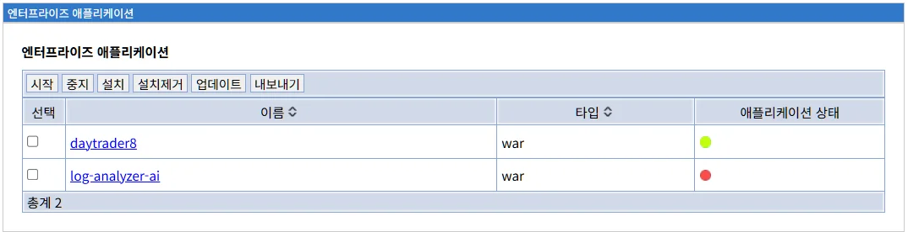
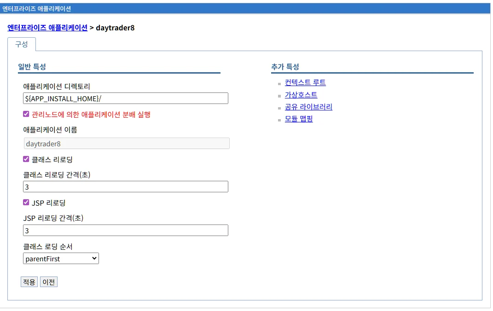
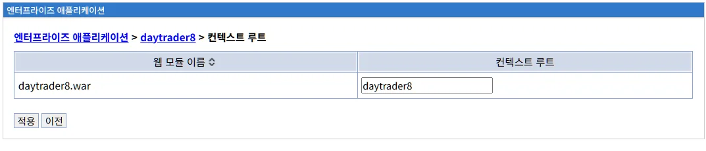
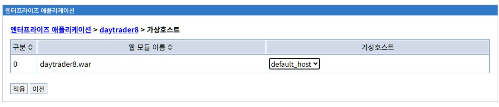
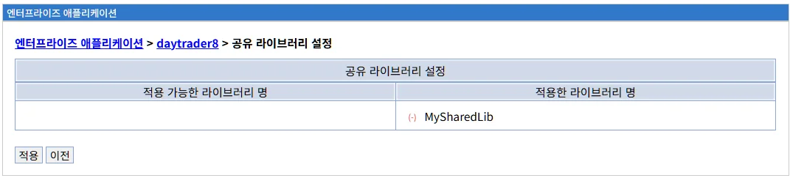
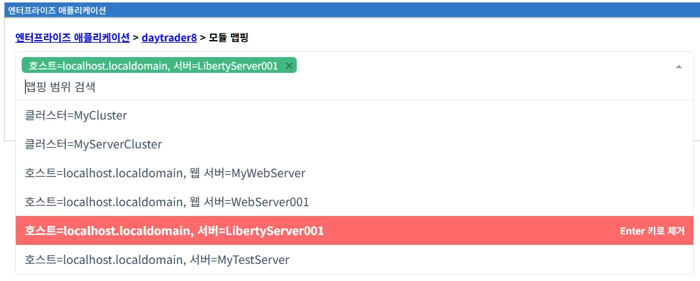

# 엔터프라이즈 애플리케이션 관리

## 목차

1. [개요](#개요)
2. [엔터프라이즈 애플리케이션 메인 화면](#엔터프라이즈-애플리케이션-메인-화면)
3. [애플리케이션 목록](#애플리케이션-목록)
4. [시작 기능](#시작-기능)
5. [중지 기능](#중지-기능)
6. [설치 기능](#설치-기능)
7. [설치제거 기능](#설치제거-기능)
8. [업데이트 기능](#업데이트-기능)
9. [내보내기 기능](#내보내기-기능)
10. [애플리케이션 모범 사례](#애플리케이션-모범-사례)

## 개요

**엔터프라이즈 애플리케이션** 메뉴는 Liberty 서버에 배포된 모든 웹 애플리케이션(WAR, EAR)을 중앙에서 관리할 수 있는 인터페이스를 제공합니다. 이 메뉴를 통해 애플리케이션의 전체 생명주기를 관리할 수 있습니다.

### 주요 기능

- **애플리케이션 목록 조회**: 배포된 모든 애플리케이션의 현재 상태 확인
- **시작/중지**: 애플리케이션의 실행 상태 제어
- **설치**: 새로운 애플리케이션 배포
- **설치제거**: 기존 애플리케이션 제거
- **업데이트**: 배포된 애플리케이션의 새 버전으로 교체
- **내보내기**: 애플리케이션 구성 정보 내보내기

### 애플리케이션 생명주기

LibriX를 통한 애플리케이션 생명주기는 다음과 같습니다:

```
설치 → 시작 → 실행 중 → 중지 → 업데이트/설치제거
  ↑                              ↓
  └──────────── 재시작 ───────────┘
```

1. **설치**: 애플리케이션을 서버에 배포
2. **시작**: 배포된 애플리케이션을 활성화
3. **실행 중**: 사용자 요청 처리
4. **중지**: 애플리케이션 비활성화
5. **업데이트**: 새 버전으로 교체
6. **설치제거**: 서버에서 완전히 제거

## 엔터프라이즈 애플리케이션 메인 화면



### 화면 구성

엔터프라이즈 애플리케이션 메인 화면은 다음과 같이 구성됩니다:

**1. 제목 표시줄**

- "엔터프라이즈 애플리케이션" 제목 표시
- 현재 메뉴 위치 표시

**2. 작업 버튼 탭**

화면 상단에는 다양한 작업을 수행할 수 있는 버튼 탭이 있습니다:

| 버튼 | 기능 | 설명 |
|------|------|------|
| **시작** | 애플리케이션 시작 | 중지된 애플리케이션을 시작합니다 |
| **중지** | 애플리케이션 중지 | 실행 중인 애플리케이션을 중지합니다 |
| **설치** | 새 애플리케이션 설치 | 새로운 애플리케이션을 배포합니다 |
| **설치제거** | 애플리케이션 제거 | 배포된 애플리케이션을 제거합니다 |
| **업데이트** | 애플리케이션 업데이트 | 기존 애플리케이션을 새 버전으로 교체합니다 |
| **내보내기** | 구성 내보내기 | 애플리케이션 구성 정보를 파일로 내보냅니다 |

**3. 애플리케이션 목록 테이블**

배포된 애플리케이션의 목록을 표 형식으로 표시합니다:

| 컬럼 | 설명 |
|------|------|
| **선택** | 체크박스 - 작업할 애플리케이션 선택 |
| **이름** | 애플리케이션 이름 (링크 - 클릭 시 상세 정보로 이동) |
| **타입** | 애플리케이션 타입 (war, ear) |
| **애플리케이션 상태** | 현재 실행 상태 (녹색 원: 실행 중, 빨간 원: 중지됨) |

**4. 요약 정보**

테이블 하단에 전체 애플리케이션 개수 표시:
- "총계 2" - 현재 2개의 애플리케이션이 배포됨

### 화면 예시 분석

예시 화면에는 2개의 애플리케이션이 표시되어 있습니다:

**1. daytrader8**
- **타입**: war
- **상태**: 🟢 실행 중 (녹색 원)
- **이름 링크**: 클릭 시 상세 정보 화면으로 이동

**2. log-analyzer-ai**
- **타입**: war
- **상태**: 🔴 중지됨 (빨간 원)
- **이름 링크**: 클릭 시 상세 정보 화면으로 이동

## 애플리케이션 상세 설정

### 상세 설정 화면 접근

애플리케이션 목록에서 애플리케이션 이름(링크)을 클릭하면 해당 애플리케이션의 상세 설정 화면으로 이동합니다.



### 화면 구성

상세 설정 화면은 다음과 같이 구성됩니다:

**1. 네비게이션 경로**

화면 상단에 현재 위치가 표시됩니다:
```
엔터프라이즈 애플리케이션 > daytrader8
```

**2. 구성 탭**

"구성" 탭에서 애플리케이션의 각종 설정을 확인하고 수정할 수 있습니다.

**3. 설정 영역**

화면은 두 개의 주요 영역으로 구분됩니다:
- **일반 특성** (왼쪽): 애플리케이션의 기본 설정
- **추가 특성** (오른쪽): 고급 설정 링크

### 일반 특성

#### 애플리케이션 디렉토리

**애플리케이션 디렉토리** (텍스트 필드)

애플리케이션 파일이 저장된 서버의 디렉토리 경로를 표시합니다.

**표시 값:**
```
${APP_INSTALL_HOME}/
```

이는 Liberty의 변수를 사용한 경로 표현이며, 일반적으로 다음과 같이 해석됩니다:
- `${server.config.dir}/apps/`

**설명:**

이 경로는 애플리케이션 설치 시 2단계에서 지정한 "애플리케이션을 설치할 디렉토리"와 동일합니다. 애플리케이션의 실제 WAR 또는 EAR 파일이 이 위치에 저장됩니다.

**변경:**

필요한 경우 이 경로를 변경하여 애플리케이션 파일을 다른 위치로 이동할 수 있습니다. 다만 파일을 실제로 이동시켜야 하며, 경로만 변경하면 애플리케이션 시작에 실패합니다.

**Liberty server.xml 표현:**

```xml
<webApplication location="${server.config.dir}/apps/daytrader8.war" />
```

#### 관리노드에 의한 애플리케이션 분배 설정

**관리노드에 의한 애플리케이션 분배 설정** (체크박스, 선택됨)

LibriX Agent를 통해 애플리케이션을 자동으로 배포 대상 서버에 전송할지 여부를 제어합니다.

**선택됨 (✓):**
- LibriX 관리콘솔이 자동으로 애플리케이션 파일을 배포 대상 서버의 Agent에게 전송합니다
- 중앙 집중식 배포 관리가 가능합니다
- 여러 서버에 동시 배포 시 편리합니다

**선택 안 됨:**
- 애플리케이션 파일을 수동으로 각 서버에 복사해야 합니다
- 분산 환경에서 관리가 복잡해집니다

이 설정은 애플리케이션 설치 시 2단계에서 설정한 옵션과 동일합니다.

#### 애플리케이션 이름

**애플리케이션 이름** (텍스트 필드)

애플리케이션의 논리적 이름을 표시합니다.

**표시 값:**
```
daytrader8
```

**설명:**

이 이름은 다음 용도로 사용됩니다:
- Liberty server.xml에서 애플리케이션 식별
- 관리콘솔에서 애플리케이션 표시
- 로그 메시지에서 애플리케이션 참조
- JMX MBean 이름의 일부

**변경 시 주의사항:**

애플리케이션 이름을 변경하면 다음에 영향을 줄 수 있습니다:
- 모니터링 도구의 참조
- 스크립트나 자동화 도구
- 로그 분석 도구

**Liberty server.xml 표현:**

```xml
<webApplication id="daytrader8" name="daytrader8" ... />
```

#### 클래스 리로딩

**클래스 리로딩** (체크박스, 선택됨)

애플리케이션의 클래스 파일이 변경되었을 때 자동으로 다시 로드할지 여부를 제어합니다.

**선택됨 (✓):**
- 클래스 파일(`.class`)이 변경되면 자동으로 감지합니다
- 지정된 간격마다 파일 시스템을 스캔합니다
- 변경이 감지되면 애플리케이션을 자동으로 재시작합니다
- 개발 환경에서 매우 유용합니다

**선택 안 됨:**
- 클래스 파일 변경이 자동으로 반영되지 않습니다
- 서버를 재시작해야 변경 사항이 적용됩니다

**클래스 리로딩 간격(초)**

파일 시스템을 스캔하는 주기를 초 단위로 지정합니다.

**표시 값:**
```
3
```

이는 3초마다 클래스 파일의 변경 여부를 확인한다는 의미입니다.

**환경별 권장 설정:**

| 환경 | 클래스 리로딩 | 간격(초) |
|------|--------------|---------|
| 개발 | ✓ 활성화 | 3 |
| 테스트 | ✓ 활성화 | 5-10 |
| 프로덕션 | ✗ 비활성화 | 0 |

자세한 내용은 애플리케이션 설치 문서의 "2단계: 설치 옵션 선택"을 참조하십시오.

#### JSP 리로딩

**JSP 리로딩** (체크박스, 선택됨)

JSP 파일이 변경되었을 때 자동으로 다시 컴파일하고 로드할지 여부를 제어합니다.

**선택됨 (✓):**
- JSP 소스 파일이 변경되면 자동으로 감지합니다
- 변경된 JSP를 자동으로 재컴파일하고 로드합니다
- 클래스 리로딩과 달리 애플리케이션 전체를 재시작하지 않습니다

**선택 안 됨:**
- JSP 파일 변경이 자동으로 반영되지 않습니다
- 서버 재시작이 필요합니다

**JSP 리로딩 간격(초)**

JSP 파일의 변경 여부를 확인하는 주기를 초 단위로 지정합니다.

**표시 값:**
```
3
```

이는 3초마다 JSP 파일의 변경 여부를 확인한다는 의미입니다.

**환경별 권장 설정:**

| 환경 | JSP 리로딩 | 간격(초) |
|------|-----------|---------|
| 개발 | ✓ 활성화 | 3 |
| 테스트 | ✓ 활성화 | 5-10 |
| 프로덕션 | ✗ 비활성화 | 0 |

자세한 내용은 애플리케이션 설치 문서의 "2단계: 설치 옵션 선택"을 참조하십시오.

#### 클래스 로딩 순서

**클래스 로딩 순서** (드롭다운)

애플리케이션의 클래스로더가 클래스를 검색하는 순서를 지정합니다.

**표시 값:**
```
parentFirst
```

**클래스로더 위임 모델 이해**

Java의 클래스로더는 계층 구조로 되어 있으며, 클래스를 로드할 때 부모 클래스로더에게 먼저 위임할지, 자신의 클래스패스를 먼저 검색할지를 결정할 수 있습니다.

**클래스로더 계층 구조:**

```
부트스트랩 클래스로더 (Bootstrap ClassLoader)
    ↓
시스템 클래스로더 (System ClassLoader)
    ↓
Liberty 런타임 클래스로더 (Liberty Runtime ClassLoader)
    ↓
애플리케이션 클래스로더 (Application ClassLoader)
    ↓
웹 애플리케이션 클래스로더 (Web Application ClassLoader)
```

**parentFirst (부모 우선, 기본값)**

클래스를 로드할 때 먼저 부모 클래스로더에게 위임하고, 부모에서 찾지 못한 경우에만 자신의 클래스패스를 검색합니다.

**검색 순서:**
1. 부모 클래스로더 (Liberty 런타임 및 시스템 클래스)
2. 애플리케이션 클래스패스 (WEB-INF/classes, WEB-INF/lib)

**장점:**
- Java의 표준 위임 모델을 따릅니다
- 시스템 클래스의 일관성이 보장됩니다
- 예측 가능한 동작을 합니다

**단점:**
- 애플리케이션이 포함한 라이브러리를 서버의 라이브러리가 오버라이드할 수 있습니다
- 라이브러리 버전 충돌이 발생할 수 있습니다

**사용 시나리오:**
- 대부분의 표준 Java EE 애플리케이션
- 서버의 라이브러리와 충돌이 없는 경우
- Liberty의 기본 동작을 사용하는 경우

**Liberty server.xml 표현:**

```xml
<webApplication id="daytrader8" ...>
  <classloader delegation="parentFirst"/>
</webApplication>
```

**parentLast (애플리케이션 우선)**

클래스를 로드할 때 먼저 자신의 클래스패스를 검색하고, 찾지 못한 경우에만 부모 클래스로더에게 위임합니다.

**검색 순서:**
1. 애플리케이션 클래스패스 (WEB-INF/classes, WEB-INF/lib)
2. 부모 클래스로더 (Liberty 런타임 및 시스템 클래스)

**장점:**
- 애플리케이션이 자신의 라이브러리 버전을 우선적으로 사용할 수 있습니다
- 라이브러리 버전 충돌을 해결할 수 있습니다
- 레거시 WebSphere 애플리케이션 마이그레이션에 유용합니다

**단점:**
- Java의 표준 위임 모델을 위반합니다
- 예상치 못한 동작이 발생할 수 있습니다
- 디버깅이 더 복잡해질 수 있습니다

**사용 시나리오:**
- 특정 버전의 라이브러리를 사용해야 하는 경우
- 서버의 라이브러리와 충돌이 발생하는 경우
- 전통적인 WebSphere에서 parentLast를 사용하던 애플리케이션 마이그레이션

**Liberty server.xml 표현:**

```xml
<webApplication id="myapp" ...>
  <classloader delegation="parentLast"/>
</webApplication>
```

**클래스 로딩 순서 선택 가이드**

**parentFirst를 사용하는 경우 (권장):**

Liberty는 클래스 충돌을 최소화하도록 설계되었으므로, 대부분의 경우 parentFirst가 적합합니다.

- 새로운 애플리케이션 개발
- Liberty의 기본 동작을 따르는 경우
- 라이브러리 충돌이 없는 경우

**parentLast를 사용하는 경우:**

특정 상황에서만 parentLast를 사용해야 합니다:

- 애플리케이션이 Liberty가 제공하는 것과 다른 버전의 라이브러리를 사용해야 하는 경우
- 전통적인 WebSphere에서 parentLast를 사용하던 레거시 애플리케이션
- 라이브러리 충돌이 발생하여 해결이 필요한 경우

**예시: Jackson 라이브러리 충돌**

Liberty가 Jackson 2.9를 제공하지만, 애플리케이션이 Jackson 2.12를 필요로 하는 경우:

```xml
<webApplication id="myapp" location="myapp.war">
  <classloader delegation="parentLast"/>
</webApplication>
```

이렇게 설정하면 애플리케이션의 WEB-INF/lib에 포함된 Jackson 2.12가 먼저 로드됩니다.

**Liberty의 클래스 격리**

Liberty는 클래스 충돌을 방지하기 위해 특별히 설계되었습니다:

- Liberty 런타임 클래스를 애플리케이션으로부터 격리
- 공개 API만 노출
- 내부 구현은 숨김

이러한 이유로 전통적인 WebSphere에서 parentLast를 사용했던 많은 애플리케이션이 Liberty에서는 parentFirst로 실행할 수 있습니다.

### 추가 특성

화면 오른쪽에는 고급 설정으로 이동할 수 있는 링크가 표시됩니다:

#### 컨텍스트 루트

**컨텍스트 루트** (링크)

애플리케이션의 컨텍스트 루트 설정 화면으로 이동합니다.

컨텍스트 루트는 애플리케이션이 접근 가능한 URL 경로를 정의합니다. 예를 들어 컨텍스트 루트가 `/daytrader8`이면 애플리케이션은 `http://서버:포트/daytrader8`로 접근할 수 있습니다.

자세한 내용은 애플리케이션 설치 문서의 "5단계: 컨텍스트 루트 설정"을 참조하십시오.

#### 컨텍스트 루트

**컨텍스트 루트** (링크)

애플리케이션의 컨텍스트 루트 설정 화면으로 이동합니다.

컨텍스트 루트는 애플리케이션이 접근 가능한 URL 경로를 정의합니다. 예를 들어 컨텍스트 루트가 `/daytrader8`이면 애플리케이션은 `http://서버:포트/daytrader8`로 접근할 수 있습니다.

자세한 내용은 애플리케이션 설치 문서의 "5단계: 컨텍스트 루트 설정"을 참조하십시오.

##### 컨텍스트 루트 설정 화면



**네비게이션 경로:**

```
엔터프라이즈 애플리케이션 > daytrader8 > 컨텍스트 루트
```

**화면 구성:**

컨텍스트 루트 설정 화면은 웹 모듈별로 컨텍스트 루트를 설정할 수 있는 테이블로 구성됩니다.

| 컬럼 | 설명 |
|------|------|
| **웹 모듈 이름** | WAR 파일 이름 (예: daytrader8.war) |
| **컨텍스트 루트** | 애플리케이션 접근 URL 경로 (편집 가능) |

**예시:**

화면의 예시에서는:
- **웹 모듈 이름**: `daytrader8.war`
- **컨텍스트 루트**: `daytrader8` (텍스트 필드에서 수정 가능)

이 설정으로 애플리케이션은 다음 URL로 접근할 수 있습니다:
```
http://localhost:9080/daytrader8
http://서버주소:9080/daytrader8
```

**컨텍스트 루트 변경:**

텍스트 필드에서 컨텍스트 루트를 직접 수정할 수 있습니다.

예를 들어 `trading`으로 변경하면:
- 기존 URL: `http://localhost:9080/daytrader8`
- 새 URL: `http://localhost:9080/trading`

**버튼:**

- **적용**: 변경 사항을 저장합니다
- **취소**: 변경 사항을 취소하고 이전 화면으로 돌아갑니다

**적용 후 프로세스:**

"적용" 버튼을 클릭하면 이전 문서들에서 설명한 것과 동일한 변경사항 확인 프로세스가 진행됩니다:

1. **변경사항 확인 메시지**: 로컬 구성에 변경 사항이 적용되었다는 메시지 표시
2. **옵션 선택**:
   - **저장**: 변경사항을 즉시 적용
   - **저장하거나 버리기 전 변경사항 검토**: 변경 내용을 먼저 검토
3. **변경사항 검토** (선택 시):
   - 수정된 파일: `${server.config.dir}/server.xml`
   - 변경 내용: 컨텍스트 루트 업데이트
4. **최종 확정**:
   - **저장**: 변경사항 확정
   - **버리기**: 변경사항 취소
   - **이전**: 검토 화면 종료

**Liberty server.xml 반영:**

컨텍스트 루트 변경은 `server.xml`에 다음과 같이 반영됩니다:

```xml
<webApplication id="daytrader8"
                name="daytrader8"
                location="${server.config.dir}/apps/daytrader8.war"
                contextRoot="/daytrader8"/>
```

컨텍스트 루트를 `trading`으로 변경한 경우:

```xml
<webApplication id="daytrader8"
                name="daytrader8"
                location="${server.config.dir}/apps/daytrader8.war"
                contextRoot="/trading"/>
```

**EAR 애플리케이션의 경우:**

EAR 파일에 여러 WAR 모듈이 포함된 경우, 테이블에 각 모듈이 별도의 행으로 표시되며 개별적으로 컨텍스트 루트를 설정할 수 있습니다:

| 웹 모듈 이름 | 컨텍스트 루트 |
|-------------|--------------|
| frontend.war | /app |
| backend.war | /api |
| admin.war | /admin |

**컨텍스트 루트 변경 시 주의사항:**

1. **사용자 접근**: 기존 URL이 변경되므로 사용자에게 새 URL을 안내해야 합니다
2. **북마크 및 링크**: 기존 북마크와 외부 링크가 작동하지 않게 됩니다
3. **애플리케이션 재시작**: Liberty는 동적으로 컨텍스트 루트를 변경하지만, 경우에 따라 애플리케이션 재시작이 필요할 수 있습니다
4. **웹서버 플러그인**: 웹서버를 사용하는 경우 플러그인 구성이 자동으로 업데이트됩니다
5. **충돌 방지**: 다른 애플리케이션과 컨텍스트 루트가 중복되지 않도록 주의합니다

컨텍스트 루트에 대한 더 자세한 내용은 애플리케이션 설치 문서의 "5단계: 컨텍스트 루트 설정"을 참조하십시오.

#### 가상호스트

**가상호스트** (링크)

애플리케이션의 가상 호스트 매핑 설정 화면으로 이동합니다.

가상 호스트는 하나의 서버에서 여러 도메인 이름과 포트 조합을 호스팅할 수 있게 해주는 논리적인 구성입니다. 애플리케이션을 특정 가상 호스트에 매핑하면 해당 호스트의 포트와 도메인으로만 접근할 수 있습니다.

자세한 내용은 애플리케이션 설치 문서의 "4단계: 가상호스트 설정"을 참조하십시오.

#### 가상호스트

**가상호스트** (링크)

애플리케이션의 가상 호스트 매핑 설정 화면으로 이동합니다.

가상 호스트는 하나의 서버에서 여러 도메인 이름과 포트 조합을 호스팅할 수 있게 해주는 논리적인 구성입니다. 애플리케이션을 특정 가상 호스트에 매핑하면 해당 호스트의 포트와 도메인으로만 접근할 수 있습니다.

자세한 내용은 애플리케이션 설치 문서의 "4단계: 가상호스트 설정"을 참조하십시오.

##### 가상호스트 설정 화면



**네비게이션 경로:**

```
엔터프라이즈 애플리케이션 > daytrader8 > 가상호스트
```

**화면 구성:**

가상호스트 설정 화면은 웹 모듈별로 가상 호스트를 매핑할 수 있는 테이블로 구성됩니다.

| 컬럼 | 설명 |
|------|------|
| **구분** | 모듈 순번 (예: 0) |
| **웹 모듈 이름** | WAR 파일 이름 (예: daytrader8.war) |
| **가상호스트** | 매핑할 가상 호스트 선택 (드롭다운) |

**예시:**

화면의 예시에서는:
- **구분**: `0`
- **웹 모듈 이름**: `daytrader8.war`
- **가상호스트**: `default_host` (드롭다운에서 선택됨)

**default_host 가상 호스트:**

`default_host`는 Liberty가 제공하는 기본 가상 호스트입니다.

**기본 설정:**
```xml
<virtualHost id="default_host">
  <hostAlias>*:9080</hostAlias>
  <hostAlias>*:9443</hostAlias>
</virtualHost>
```

이는 모든 호스트명(`*`)에서 포트 9080(HTTP)과 9443(HTTPS)으로 들어오는 요청을 처리한다는 의미입니다.

**접근 가능한 URL:**
- `http://localhost:9080/daytrader8`
- `http://서버IP:9080/daytrader8`
- `http://서버도메인:9080/daytrader8`
- `https://localhost:9443/daytrader8`

**가상호스트 선택:**

드롭다운 메뉴에서 다른 가상 호스트를 선택할 수 있습니다. 드롭다운에 표시되는 가상 호스트는 LibriX의 **환경 > 가상호스트** 메뉴에서 미리 생성된 목록입니다.

**사용 가능한 가상 호스트 예시:**
- `default_host` (기본)
- `admin_host` (관리용)
- `customer_host` (고객용)
- `internal_host` (내부망용)
- 커스텀 가상 호스트

**가상호스트 변경:**

드롭다운에서 다른 가상 호스트를 선택하여 애플리케이션의 네트워크 격리를 변경할 수 있습니다.

**예시: admin_host로 변경**

만약 `admin_host`가 다음과 같이 정의되어 있다면:

```xml
<virtualHost id="admin_host">
  <hostAlias>admin.example.com:8443</hostAlias>
</virtualHost>
```

애플리케이션을 `admin_host`로 변경하면:
- **접근 가능**: `https://admin.example.com:8443/daytrader8`
- **접근 불가**: `http://localhost:9080/daytrader8` (default_host 포트)

이렇게 하면 애플리케이션은 관리자 전용 도메인과 포트로만 접근할 수 있어 보안이 강화됩니다.

**EAR 애플리케이션의 경우:**

EAR 파일에 여러 WAR 모듈이 포함된 경우, 각 모듈을 서로 다른 가상 호스트에 매핑할 수 있습니다:

| 구분 | 웹 모듈 이름 | 가상호스트 |
|------|-------------|-----------|
| 0 | frontend.war | public_host |
| 1 | admin.war | admin_host |
| 2 | api.war | api_host |

**버튼:**

- **적용**: 변경 사항을 저장합니다
- **취소**: 변경 사항을 취소하고 이전 화면으로 돌아갑니다

**적용 후 프로세스:**

"적용" 버튼을 클릭하면 변경사항 확인 프로세스가 진행됩니다:

1. **변경사항 확인 메시지**: 로컬 구성에 변경 사항이 적용됨
2. **저장 또는 검토 선택**
3. **최종 확정**

**Liberty server.xml 반영:**

가상호스트 매핑은 `server.xml`에 다음과 같이 반영됩니다:

**기본 설정 (default_host):**
```xml
<webApplication id="daytrader8"
                name="daytrader8"
                location="${server.config.dir}/apps/daytrader8.war"
                contextRoot="/daytrader8">
  <virtualHost ref="default_host"/>
</webApplication>
```

**커스텀 가상호스트로 변경:**
```xml
<webApplication id="daytrader8"
                name="daytrader8"
                location="${server.config.dir}/apps/daytrader8.war"
                contextRoot="/daytrader8">
  <virtualHost ref="admin_host"/>
</webApplication>
```

**가상호스트 매핑 시나리오:**

**시나리오 1: 고객용과 직원용 애플리케이션 분리**

```xml
<!-- 고객용 가상 호스트 -->
<virtualHost id="customer_host">
  <hostAlias>customer.example.com:443</hostAlias>
</virtualHost>

<!-- 직원용 가상 호스트 -->
<virtualHost id="employee_host">
  <hostAlias>employee.example.com:443</hostAlias>
</virtualHost>

<!-- 애플리케이션 매핑 -->
<webApplication id="customer_app" location="customer.war">
  <virtualHost ref="customer_host"/>
</webApplication>

<webApplication id="employee_app" location="employee.war">
  <virtualHost ref="employee_host"/>
</webApplication>
```

**시나리오 2: 관리 트래픽 격리**

```xml
<!-- 애플리케이션용 가상 호스트 (외부 접근) -->
<virtualHost id="app_host">
  <hostAlias>*:9080</hostAlias>
  <hostAlias>*:9443</hostAlias>
</virtualHost>

<!-- 관리용 가상 호스트 (내부망만) -->
<virtualHost id="admin_host">
  <hostAlias>10.0.0.1:9443</hostAlias>
</virtualHost>

<webApplication id="myapp" location="myapp.war">
  <virtualHost ref="app_host"/>
</webApplication>

<!-- JMX, 메트릭스 등은 default_host (내부망) 사용 -->
```

**가상호스트 변경 시 주의사항:**

1. **접근 URL 변경**: 가상 호스트를 변경하면 애플리케이션 접근 URL이 변경됩니다
   - 기존: `http://localhost:9080/myapp`
   - 변경 후: `https://specific.domain:8443/myapp`

2. **네트워크 구성**: 새 가상 호스트의 포트가 방화벽에서 허용되어야 합니다

3. **DNS 설정**: 도메인 이름을 사용하는 경우 DNS가 올바르게 구성되어야 합니다

4. **웹서버 플러그인**: 웹서버를 사용하는 경우 플러그인 구성이 자동으로 업데이트됩니다

5. **SSL 인증서**: HTTPS를 사용하는 경우 적절한 SSL 인증서가 구성되어야 합니다

6. **테스트**: 가상 호스트 변경 후 반드시 애플리케이션 접근을 테스트해야 합니다

**가상호스트 매핑 오류:**

가상 호스트 매핑이 잘못되면 다음과 같은 오류가 발생할 수 있습니다:

```
SRVE0255E: A WebGroup/Virtual Host to handle /myapp has not been defined.
SRVE0255E: A WebGroup/Virtual Host to handle localhost:8080 has not been defined.
```

**해결 방법:**

1. 가상 호스트에 필요한 호스트 별칭이 정의되어 있는지 확인
2. 애플리케이션이 올바른 가상 호스트에 매핑되어 있는지 확인
3. 서버를 재시작하여 구성을 다시 로드

**새로운 가상호스트 생성:**

드롭다운에 원하는 가상 호스트가 없는 경우:

1. LibriX 관리콘솔 메인 메뉴로 이동
2. **환경** 카테고리 선택
3. **가상호스트** 메뉴 선택
4. 새 가상 호스트 생성 및 구성
5. 애플리케이션 설정 화면으로 돌아와서 새로 생성된 가상 호스트 선택

가상호스트에 대한 더 자세한 내용은 애플리케이션 설치 문서의 "4단계: 가상호스트 설정"을 참조하십시오.

#### 공유 라이브러리

**공유 라이브러리** (링크)

애플리케이션이 사용하는 공유 라이브러리 설정 화면으로 이동합니다.

공유 라이브러리는 여러 애플리케이션이 공통으로 사용할 수 있는 JAR 파일 모음입니다. 라이브러리를 각 애플리케이션에 포함시키는 대신 서버 레벨에서 정의하고 공유할 수 있습니다.

**공유 라이브러리의 장점:**

- **메모리 절약**: 라이브러리 클래스가 한 번만 로드됩니다
- **관리 용이**: 라이브러리 업데이트 시 한 곳만 수정
- **일관성**: 모든 애플리케이션이 동일한 버전 사용

**Liberty server.xml 예시:**

```xml
<library id="mySharedLib">
  <fileset dir="${server.config.dir}/lib" includes="*.jar"/>
</library>

<webApplication id="app1" location="app1.war">
  <classloader commonLibraryRef="mySharedLib"/>
</webApplication>

<webApplication id="app2" location="app2.war">
  <classloader commonLibraryRef="mySharedLib"/>
</webApplication>
```

#### 공유 라이브러리

**공유 라이브러리** (링크)

애플리케이션이 사용하는 공유 라이브러리 설정 화면으로 이동합니다.

공유 라이브러리는 여러 애플리케이션이 공통으로 사용할 수 있는 JAR 파일 모음입니다. 라이브러리를 각 애플리케이션에 포함시키는 대신 서버 레벨에서 정의하고 공유할 수 있습니다.

**공유 라이브러리의 장점:**

- **메모리 절약**: 라이브러리 클래스가 한 번만 로드됩니다
- **관리 용이**: 라이브러리 업데이트 시 한 곳만 수정
- **일관성**: 모든 애플리케이션이 동일한 버전 사용

**Liberty server.xml 예시:**

```xml
<library id="mySharedLib">
  <fileset dir="${server.config.dir}/lib" includes="*.jar"/>
</library>

<webApplication id="app1" location="app1.war">
  <classloader commonLibraryRef="mySharedLib"/>
</webApplication>

<webApplication id="app2" location="app2.war">
  <classloader commonLibraryRef="mySharedLib"/>
</webApplication>
```

##### 공유 라이브러리 설정 화면



**네비게이션 경로:**

```
엔터프라이즈 애플리케이션 > daytrader8 > 공유 라이브러리 설정
```

**화면 구성:**

공유 라이브러리 설정 화면은 애플리케이션이 사용할 공유 라이브러리를 선택하는 인터페이스로 구성됩니다.

**공유 라이브러리 설정 섹션:**

| 영역 | 설명 |
|------|------|
| **적용 가능한 라이브러리 명** | 사용 가능한 공유 라이브러리 목록 (왼쪽) |
| **적용한 라이브러리 명** | 현재 애플리케이션에 적용된 공유 라이브러리 목록 (오른쪽) |

**예시:**

화면의 예시에서는:
- **적용 가능한 라이브러리 명**: (빈 목록 - 환경 메뉴에서 생성된 공유 라이브러리가 표시됨)
- **적용한 라이브러리 명**: `MySharedLib` (현재 이 애플리케이션에 적용됨)

이는 `daytrader8` 애플리케이션이 현재 `MySharedLib`라는 공유 라이브러리를 사용하고 있음을 의미합니다.

**공유 라이브러리 적용 방법:**

공유 라이브러리를 애플리케이션에 적용하는 과정은 다음과 같습니다:

1. **왼쪽 목록 (적용 가능한 라이브러리 명)**에 환경 메뉴에서 미리 생성된 공유 라이브러리들이 표시됩니다
2. 적용하려는 라이브러리를 **클릭**하면 자동으로 **오른쪽 목록 (적용한 라이브러리 명)**으로 이동합니다
3. **적용** 버튼을 클릭하여 변경사항을 저장합니다

**공유 라이브러리 제거 방법:**

현재 적용된 라이브러리를 제거하는 과정은 다음과 같습니다:

1. **오른쪽 목록 (적용한 라이브러리 명)**에서 제거할 라이브러리를 선택합니다
2. 해당 라이브러리를 **클릭**하면 자동으로 **왼쪽 목록 (적용 가능한 라이브러리 명)**으로 이동합니다
3. **적용** 버튼을 클릭하여 변경사항을 저장합니다

**여러 라이브러리 적용:**

애플리케이션은 여러 공유 라이브러리를 동시에 사용할 수 있습니다:

1. 왼쪽 목록에서 첫 번째 라이브러리를 클릭하여 오른쪽으로 이동
2. 왼쪽 목록에서 두 번째 라이브러리를 클릭하여 오른쪽으로 이동
3. 필요한 모든 라이브러리를 오른쪽으로 이동한 후 **적용** 클릭

**예시 시나리오:**

환경 메뉴에서 다음 공유 라이브러리들이 생성되어 있다고 가정:
- `DB2Drivers` - IBM DB2 JDBC 드라이버
- `LoggingLib` - 로깅 프레임워크
- `UtilityLib` - 공통 유틸리티
- `MySharedLib` - 커스텀 공유 라이브러리

**초기 상태:**
```
[적용 가능한 라이브러리 명]      [적용한 라이브러리 명]
- DB2Drivers                   (빈 목록)
- LoggingLib
- UtilityLib
- MySharedLib
```

**DB2Drivers 클릭 후:**
```
[적용 가능한 라이브러리 명]      [적용한 라이브러리 명]
- LoggingLib                   - DB2Drivers
- UtilityLib
- MySharedLib
```

**MySharedLib도 클릭 후:**
```
[적용 가능한 라이브러리 명]      [적용한 라이브러리 명]
- LoggingLib                   - DB2Drivers
- UtilityLib                   - MySharedLib
```

**버튼:**

- **적용**: 변경 사항을 저장합니다
- **취소**: 변경 사항을 취소하고 이전 화면으로 돌아갑니다

**적용 후 프로세스:**

"적용" 버튼을 클릭하면 이전 문서들에서 설명한 것과 동일한 변경사항 확인 프로세스가 진행됩니다:

1. **변경사항 확인 메시지**: 로컬 구성에 변경 사항이 적용되었다는 메시지 표시
2. **옵션 선택**:
   - **저장**: 변경사항을 즉시 적용
   - **저장하거나 버리기 전 변경사항 검토**: 변경 내용을 먼저 검토
3. **변경사항 검토** (선택 시):
   - 수정된 파일: `${server.config.dir}/server.xml`
   - 변경 내용: 공유 라이브러리 참조 추가/제거
4. **최종 확정**:
   - **저장**: 변경사항 확정
   - **버리기**: 변경사항 취소
   - **이전**: 검토 화면 종료

**공유 라이브러리의 종류:**

Liberty에서는 두 가지 유형의 공유 라이브러리를 지원합니다:

**1. 공통 라이브러리 (Common Library)**

여러 애플리케이션 간에 클래스 인스턴스가 공유됩니다.

```xml
<library id="myCommonLib">
  <fileset dir="${server.config.dir}/lib/common" includes="*.jar"/>
</library>

<webApplication id="app1" location="app1.war">
  <classloader commonLibraryRef="myCommonLib"/>
</webApplication>
```

**특징:**
- 라이브러리가 자체 클래스로더를 가집니다
- 클래스 인스턴스가 여러 애플리케이션 간에 공유됩니다
- 싱글톤 패턴이 여러 애플리케이션에 걸쳐 작동합니다

**사용 예시:**
- 공통 유틸리티 라이브러리
- 데이터베이스 드라이버
- 로깅 프레임워크

**2. 전용 라이브러리 (Private Library)**

애플리케이션마다 독립적인 클래스 인스턴스를 가집니다.

```xml
<library id="myPrivateLib">
  <fileset dir="${server.config.dir}/lib/private" includes="*.jar"/>
</library>

<webApplication id="app1" location="app1.war">
  <classloader privateLibraryRef="myPrivateLib"/>
</webApplication>
```

**특징:**
- 라이브러리 클래스가 애플리케이션 클래스로더에 직접 추가됩니다
- 각 애플리케이션이 독립적인 클래스 인스턴스를 가집니다
- 애플리케이션 간에 클래스가 격리됩니다

**사용 예시:**
- 애플리케이션별 특정 버전 라이브러리
- 상태를 유지하는 라이브러리

**공통 라이브러리와 전용 라이브러리 비교:**

| 특성 | 공통 라이브러리 | 전용 라이브러리 |
|------|----------------|----------------|
| **클래스로더** | 별도의 공유 클래스로더 | 애플리케이션 클래스로더 |
| **인스턴스 공유** | ✓ 공유됨 | ✗ 독립적 |
| **메모리 사용** | 낮음 (1회 로드) | 높음 (앱마다 로드) |
| **싱글톤** | 모든 앱에 걸쳐 싱글톤 | 앱별 싱글톤 |
| **격리** | 낮음 | 높음 |
| **사용 시나리오** | 공통 유틸리티, 드라이버 | 앱별 특정 버전 |

**Liberty server.xml 반영:**

공유 라이브러리 설정은 `server.xml`에 다음과 같이 반영됩니다:

**공통 라이브러리 사용:**

```xml
<library id="MySharedLib">
  <fileset dir="${server.config.dir}/lib/shared" includes="*.jar"/>
</library>

<webApplication id="daytrader8"
                name="daytrader8"
                location="${server.config.dir}/apps/daytrader8.war"
                contextRoot="/daytrader8">
  <classloader commonLibraryRef="MySharedLib"/>
</webApplication>
```

**여러 라이브러리 사용:**

```xml
<library id="lib1">
  <fileset dir="${server.config.dir}/lib/lib1" includes="*.jar"/>
</library>

<library id="lib2">
  <fileset dir="${server.config.dir}/lib/lib2" includes="*.jar"/>
</library>

<webApplication id="myapp" location="myapp.war">
  <classloader commonLibraryRef="lib1,lib2"/>
</webApplication>
```

**공통 라이브러리와 전용 라이브러리 함께 사용:**

```xml
<library id="commonLib">
  <fileset dir="${server.config.dir}/lib/common" includes="*.jar"/>
</library>

<library id="privateLib">
  <fileset dir="${server.config.dir}/lib/private" includes="*.jar"/>
</library>

<webApplication id="myapp" location="myapp.war">
  <classloader commonLibraryRef="commonLib" privateLibraryRef="privateLib"/>
</webApplication>
```

**공유 라이브러리 정의 예시:**

**기본 정의:**

```xml
<library id="MySharedLib">
  <fileset dir="/path/to/lib" includes="*.jar"/>
</library>
```

**특정 파일 지정:**

```xml
<library id="MySharedLib">
  <file name="/path/to/lib/library1.jar"/>
  <file name="/path/to/lib/library2.jar"/>
</library>
```

**패턴 기반 포함/제외:**

```xml
<library id="MySharedLib">
  <fileset dir="${server.config.dir}/lib" 
           includes="*.jar" 
           excludes="test-*.jar"/>
</library>
```

**폴더 추가:**

```xml
<library id="MySharedLib">
  <folder dir="/path/to/classes"/>
  <fileset dir="/path/to/jars" includes="*.jar"/>
</library>
```

**공유 라이브러리 사용 시나리오:**

**시나리오 1: JDBC 드라이버 공유**

여러 애플리케이션이 동일한 데이터베이스를 사용하는 경우:

```xml
<library id="db2Drivers">
  <fileset dir="${server.config.dir}/lib/db2" includes="*.jar"/>
</library>

<webApplication id="app1" location="app1.war">
  <classloader commonLibraryRef="db2Drivers"/>
</webApplication>

<webApplication id="app2" location="app2.war">
  <classloader commonLibraryRef="db2Drivers"/>
</webApplication>
```

**시나리오 2: 로깅 프레임워크 공유**

```xml
<library id="loggingLib">
  <fileset dir="${server.config.dir}/lib/logging" includes="*.jar"/>
</library>

<webApplication id="app1" location="app1.war">
  <classloader commonLibraryRef="loggingLib"/>
</webApplication>
```

**시나리오 3: 유틸리티 라이브러리**

```xml
<library id="utilityLib">
  <fileset dir="${server.config.dir}/lib/utils" includes="*.jar"/>
</library>

<webApplication id="app1" location="app1.war">
  <classloader commonLibraryRef="utilityLib"/>
</webApplication>
```

**새로운 공유 라이브러리 생성:**

화면의 왼쪽 목록에 원하는 라이브러리가 없는 경우:

1. LibriX 관리콘솔 메인 메뉴로 이동
2. **환경** 카테고리 선택
3. **공유 라이브러리** 메뉴 선택
4. 새 공유 라이브러리 생성 및 구성:
   - 라이브러리 ID 지정
   - JAR 파일 경로 설정
   - 포함/제외 패턴 설정
5. 애플리케이션 설정 화면으로 돌아와서 새로 생성된 라이브러리 선택

**공유 라이브러리 사용 시 주의사항:**

1. **버전 충돌**: 여러 애플리케이션이 서로 다른 버전의 라이브러리를 필요로 하는 경우 전용 라이브러리를 사용하거나 별도의 서버에 배포

2. **클래스로더 순서**: 공유 라이브러리와 애플리케이션 내부 라이브러리 간의 클래스로더 순서에 주의
   - `parentFirst`: 공유 라이브러리가 우선
   - `parentLast`: 애플리케이션 라이브러리가 우선

3. **메모리 영향**: 공통 라이브러리는 메모리를 절약하지만, 사용하지 않는 애플리케이션도 메모리에 로드됩니다

4. **업데이트 영향**: 공유 라이브러리를 업데이트하면 모든 연결된 애플리케이션에 영향을 줍니다

5. **재시작 필요**: 공유 라이브러리를 변경하거나 추가하면 애플리케이션 재시작이 필요할 수 있습니다

**적용 후 프로세스:**

"적용" 버튼을 클릭하면 변경사항 확인 프로세스가 진행됩니다:

1. **변경사항 확인 메시지**: 로컬 구성에 변경 사항이 적용됨
2. **저장 또는 검토 선택**
3. **최종 확정**

**공유 라이브러리 설정 검증:**

공유 라이브러리 적용 후 다음을 확인합니다:

1. **애플리케이션 시작**: 애플리케이션이 정상적으로 시작되는지 확인
2. **로그 확인**: 클래스로더 관련 오류가 없는지 확인
3. **기능 테스트**: 라이브러리를 사용하는 기능이 정상 작동하는지 확인
4. **메모리 사용량**: 메모리 사용량이 예상 범위 내인지 확인

#### 보통 맵핑

**보통 맵핑** (링크)

애플리케이션의 모듈 맵핑 설정 화면으로 이동합니다.

EAR 애플리케이션의 경우 여러 모듈(WAR, EJB JAR 등)이 포함될 수 있으며, 각 모듈을 어떻게 배포할지 설정할 수 있습니다.

#### 보통 맵핑

**보통 맵핑** (링크)

애플리케이션의 모듈 맵핑 설정 화면으로 이동합니다.

EAR 애플리케이션의 경우 여러 모듈(WAR, EJB JAR 등)이 포함될 수 있으며, 각 모듈을 어떻게 배포할지 설정할 수 있습니다.

##### 모듈 맵핑 설정 화면



**네비게이션 경로:**

```
엔터프라이즈 애플리케이션 > daytrader8 > 모듈 맵핑
```

**화면 구성:**

모듈 맵핑 설정 화면은 애플리케이션 모듈을 배포 대상 서버 또는 클러스터에 매핑하는 인터페이스로 구성됩니다.

**주요 요소:**

1. **선택된 배포 대상 표시** (상단 녹색 태그)
   - 현재 선택된 배포 대상: `호스트=localhost.localdomain, 서버=LibertyServer001`
   - X 버튼으로 선택 해제 가능

2. **맵핑 범위 검색** (검색 필드)
   - 배포 대상을 검색할 수 있는 텍스트 필드
   - 서버명, 호스트명, 클러스터명으로 검색 가능

3. **배포 대상 목록**
   - 사용 가능한 모든 배포 대상이 계층적으로 표시됩니다
   - 클러스터, 개별 서버, 웹서버 등

**배포 대상 목록 예시:**

화면에 표시된 배포 대상들:

| 배포 대상 | 유형 | 설명 |
|----------|------|------|
| **클러스터=MyCluster** | 클러스터 | 클러스터 전체에 배포 |
| **클러스터=MyServerCluster** | 클러스터 | 다른 클러스터 |
| **호스트=localhost.localdomain, 웹 서버=MyWebServer** | 웹서버 | 웹서버에 배포 |
| **호스트=localhost.localdomain, 웹 서버=WebServer001** | 웹서버 | 다른 웹서버 |
| **호스트=localhost.localdomain, 서버=LibertyServer001** | 개별 서버 | 특정 Liberty 서버 (현재 선택됨 - 빨간색 강조) |
| **호스트=localhost.localdomain, 서버=MyTestServer** | 개별 서버 | 테스트 서버 |

**배포 대상 선택:**

1. **단일 선택**: 목록에서 원하는 배포 대상을 클릭하면 빨간색으로 강조 표시됩니다
2. **선택 확인**: 선택된 대상이 화면 상단에 녹색 태그로 표시됩니다
3. **선택 변경**: 다른 대상을 클릭하면 이전 선택이 해제되고 새 대상이 선택됩니다
4. **선택 해제**: 상단 녹색 태그의 X 버튼을 클릭하여 선택을 해제할 수 있습니다

**Enter 키로 제거:**

화면 오른쪽에 "Enter 키로 제거" 표시가 있습니다. 이는:
- 배포 대상을 선택한 후 Enter 키를 누르면 선택이 확정됩니다
- 또는 선택을 제거할 수 있습니다

**배포 대상 유형별 특징:**

**1. 클러스터 배포**

```
클러스터=MyCluster
```

**특징:**
- 클러스터의 모든 멤버 서버에 동시 배포
- 고가용성 및 로드 밸런싱 지원
- 모든 멤버가 동일한 애플리케이션 버전 실행
- 자동 동기화

**사용 시나리오:**
- 프로덕션 환경
- 고가용성이 필요한 애플리케이션
- 부하 분산이 필요한 경우

**2. 개별 서버 배포**

```
호스트=localhost.localdomain, 서버=LibertyServer001
```

**특징:**
- 특정 서버에만 배포
- 빠른 배포 가능
- 다른 서버에 영향 없음
- 개별 관리

**사용 시나리오:**
- 개발 환경
- 테스트 환경
- 단계적 배포 (Canary deployment)
- 서버별 특화된 애플리케이션

**3. 웹서버 배포**

```
호스트=localhost.localdomain, 웹 서버=MyWebServer
```

**특징:**
- 웹서버를 통한 요청 라우팅
- 정적 컨텐츠 처리 최적화
- 백엔드 Liberty 서버와 연동
- 플러그인 자동 업데이트

**사용 시나리오:**
- 프로덕션 환경
- IHS(IBM HTTP Server) 또는 Apache 사용
- SSL 터미네이션이 필요한 경우
- 정적/동적 컨텐츠 분리

**배포 대상 변경 시나리오:**

**시나리오 1: 개발에서 테스트로 이동**

개발 완료 후 테스트 서버로 애플리케이션 이동:

**현재 배포:** `호스트=localhost.localdomain, 서버=DevServer`
**변경 후:** `호스트=localhost.localdomain, 서버=TestServer`

1. 목록에서 `TestServer` 클릭
2. 상단에 `호스트=localhost.localdomain, 서버=TestServer` 표시 확인
3. **적용** 클릭

**시나리오 2: 테스트에서 프로덕션으로 승격**

테스트 완료 후 프로덕션 클러스터로 배포:

**현재 배포:** `호스트=localhost.localdomain, 서버=TestServer`
**변경 후:** `클러스터=ProductionCluster`

1. 목록에서 `클러스터=ProductionCluster` 클릭
2. 상단에 `클러스터=ProductionCluster` 표시 확인
3. **적용** 클릭

**시나리오 3: 웹서버 연동 추가**

기존 서버 배포에 웹서버 연동 추가:

1. 목록에서 `웹 서버=MyWebServer` 클릭
2. 상단에 웹서버 표시 확인
3. **적용** 클릭
4. 웹서버 플러그인이 자동으로 업데이트되어 요청을 백엔드 서버로 라우팅

**버튼:**

화면 하단에는 다음 버튼들이 있습니다 (일부 숨겨져 있을 수 있음):

- **적용**: 변경 사항을 저장합니다
- **이전**: 변경 사항을 취소하고 이전 화면으로 돌아갑니다

**적용 후 프로세스:**

"적용" 버튼을 클릭하면 이전 문서들에서 설명한 것과 동일한 변경사항 확인 프로세스가 진행됩니다:

1. **변경사항 확인 메시지**: 로컬 구성에 변경 사항이 적용되었다는 메시지 표시
2. **옵션 선택**:
   - **저장**: 변경사항을 즉시 적용
   - **저장하거나 버리기 전 변경사항 검토**: 변경 내용을 먼저 검토
3. **변경사항 검토** (선택 시):
   - 수정된 파일: `${server.config.dir}/server.xml` 및 관련 구성 파일
   - 변경 내용: 배포 대상 업데이트
4. **최종 확정**:
   - **저장**: 변경사항 확정 및 배포 시작
   - **버리기**: 변경사항 취소
   - **이전**: 검토 화면 종료

**Liberty server.xml 반영:**

배포 대상 변경은 LibriX Agent 구성 및 서버 관리 메타데이터에 반영됩니다. Liberty의 `server.xml`은 애플리케이션 자체 구성을 포함하지만, 배포 대상 정보는 LibriX의 중앙 관리 데이터베이스에서 관리됩니다.

**배포 프로세스:**

배포 대상을 변경하고 저장하면 다음 프로세스가 진행됩니다:

**1. 기존 배포 대상에서 제거** (옵션)

기존 서버에서 애플리케이션을 중지하고 제거할 수 있습니다.

**2. 새 배포 대상으로 전송**

LibriX Agent가 애플리케이션 파일을 새 대상 서버로 전송합니다.

**3. 서버 구성 업데이트**

대상 서버의 `server.xml`에 애플리케이션 구성이 추가됩니다.

**4. 애플리케이션 시작**

새 서버에서 애플리케이션이 시작됩니다.

**5. 웹서버 플러그인 업데이트** (웹서버 포함 시)

`plugin-cfg.xml`이 업데이트되어 요청을 새 서버로 라우팅합니다.

**배포 대상 변경 시 주의사항:**

1. **서비스 중단**: 기존 배포 대상에서 제거하면 일시적으로 서비스가 중단될 수 있습니다

2. **리소스 확인**: 새 배포 대상에 충분한 리소스(메모리, CPU, 디스크)가 있는지 확인

3. **종속성 확인**: 데이터소스, JMS 등 애플리케이션 종속성이 새 서버에 구성되어 있는지 확인

4. **네트워크 구성**: 방화벽 규칙 및 네트워크 연결이 올바른지 확인

5. **세션 데이터**: 세션 데이터가 손실될 수 있으므로 세션 복제 또는 영속화 고려

6. **로드 밸런서 업데이트**: 외부 로드 밸런서가 있는 경우 수동 업데이트가 필요할 수 있습니다

**무중단 배포 전략:**

서비스 중단 없이 배포 대상을 변경하려면:

**방법 1: 점진적 배포**

1. 새 서버에 애플리케이션 추가 (기존 서버는 유지)
2. 웹서버/로드 밸런서에서 새 서버로 트래픽 일부 전환
3. 새 서버 정상 작동 확인
4. 점진적으로 트래픽 비율 증가
5. 기존 서버에서 애플리케이션 제거

**방법 2: Blue-Green 배포**

1. 새 서버(Green)에 애플리케이션 배포
2. Green 서버 철저히 테스트
3. 로드 밸런서를 Green 서버로 전환
4. 기존 서버(Blue)는 롤백용으로 대기

**WAR 애플리케이션 vs EAR 애플리케이션:**

**WAR 애플리케이션:**

단일 웹 모듈만 포함하므로 배포 대상 선택이 간단합니다.

**EAR 애플리케이션:**

여러 모듈(WAR, EJB JAR 등)을 포함할 수 있으며, 모든 모듈이 동일한 배포 대상에 배포됩니다. 개별 모듈을 다른 서버에 배포할 수는 없습니다.

**배포 대상 선택 검증:**

배포 대상 변경 후 다음을 확인합니다:

1. **서버 상태**: 대상 서버가 실행 중인지 확인
2. **애플리케이션 시작**: 애플리케이션이 정상적으로 시작되었는지 확인
3. **로그 확인**: 서버 로그에서 오류가 없는지 확인
4. **접근 테스트**: 브라우저에서 애플리케이션에 접근하여 정상 작동 확인
5. **기능 테스트**: 주요 기능이 정상 작동하는지 확인

**WebSphere ND와의 비교:**

**WebSphere ND:**

"Map modules to servers" 단계에서 Cell > Node > Server 계층 구조로 배포 대상 선택

**LibriX:**

평면 구조로 클러스터, 서버, 웹서버를 직관적으로 선택. 더 간단하고 빠른 배포 대상 변경이 가능합니다.

### 설정 저장

**적용** 버튼

화면 하단의 "적용" 버튼을 클릭하면 변경된 설정이 저장됩니다.

**취소** 버튼

변경 사항을 취소하고 이전 화면으로 돌아갑니다.

### Liberty server.xml에 반영

애플리케이션 상세 설정에서 변경한 내용은 Liberty의 `server.xml` 파일에 다음과 같이 반영됩니다:

```xml
<server>
  <applicationMonitor updateTrigger="polled" pollingRate="3s"/>

  <webContainer>
    <jspEngine reloadingEnabled="true" reloadInterval="3"/>
  </webContainer>

  <webApplication id="daytrader8"
                  name="daytrader8"
                  location="${server.config.dir}/apps/daytrader8.war"
                  contextRoot="/daytrader8">
    <classloader delegation="parentFirst"/>
  </webApplication>
</server>
```

### 설정 변경 시 주의사항

**1. 프로덕션 환경**

프로덕션 환경에서는 다음 설정을 권장합니다:
- 클래스 리로딩: 비활성화
- JSP 리로딩: 비활성화
- 클래스 로딩 순서: parentFirst (대부분의 경우)

**2. 개발 환경**

개발 환경에서는 다음 설정을 권장합니다:
- 클래스 리로딩: 활성화 (간격 3초)
- JSP 리로딩: 활성화 (간격 3초)
- 클래스 로딩 순서: parentFirst (충돌이 없는 한)

**3. 설정 변경 후 테스트**

중요한 설정(특히 클래스 로딩 순서)을 변경한 후에는 반드시 애플리케이션을 재시작하고 기능 테스트를 수행해야 합니다.

**4. 백업**

설정을 변경하기 전에 현재 구성을 백업하는 것이 좋습니다. LibriX는 변경 이력을 관리하지만, 중요한 변경 전에는 수동 백업도 권장됩니다.

## 애플리케이션 목록

### 애플리케이션 상태 표시

애플리케이션의 현재 상태는 색상으로 구분되는 원형 아이콘으로 표시됩니다:

**상태 아이콘:**

| 아이콘 | 상태 | 설명 |
|--------|------|------|
| 🟢 녹색 원 | 실행 중 (Started) | 애플리케이션이 정상적으로 실행되고 있으며 요청을 처리할 수 있습니다 |
| 🔴 빨간 원 | 중지됨 (Stopped) | 애플리케이션이 중지되었으며 요청을 처리할 수 없습니다 |
| 🟡 노란 원 | 시작 중 (Starting) | 애플리케이션이 시작되는 중입니다 (일시적 상태) |
| 🟠 주황 원 | 경고 (Warning) | 애플리케이션이 실행 중이지만 일부 문제가 있습니다 |

### 애플리케이션 선택

**단일 선택:**

테이블의 각 행 앞에 있는 체크박스를 클릭하여 개별 애플리케이션을 선택할 수 있습니다.

선택된 애플리케이션에 대해 작업(시작, 중지, 설치제거 등)을 수행할 수 있습니다.

**여러 선택:**

여러 체크박스를 선택하여 동시에 여러 애플리케이션에 대해 작업을 수행할 수 있습니다.

예시:
- 여러 애플리케이션을 동시에 시작
- 여러 애플리케이션을 동시에 중지
- 여러 애플리케이션을 동시에 제거

**전체 선택:**

테이블 헤더의 체크박스를 클릭하면 모든 애플리케이션을 한 번에 선택할 수 있습니다.

### 애플리케이션 타입

**WAR (Web Application Archive)**

웹 애플리케이션 아카이브로, 다음을 포함합니다:
- 서블릿 및 JSP
- HTML, CSS, JavaScript 등 정적 리소스
- WEB-INF 디렉토리 (web.xml, 클래스 파일, 라이브러리)

**EAR (Enterprise Application Archive)**

엔터프라이즈 애플리케이션 아카이브로, 다음을 포함할 수 있습니다:
- 하나 이상의 WAR 모듈
- EJB JAR 모듈
- 리소스 어댑터 (RAR)
- application.xml 배포 서술자

### 애플리케이션 이름 링크

테이블의 애플리케이션 이름은 링크로 표시됩니다. 이름을 클릭하면 해당 애플리케이션의 상세 정보 화면으로 이동합니다.

**상세 정보 화면에서 확인할 수 있는 정보:**

- 애플리케이션 구성 상세 정보
- 배포 정보 (서버, 클러스터)
- 가상 호스트 매핑
- 컨텍스트 루트
- 클래스로더 설정
- 세션 관리 설정
- 보안 설정
- 성능 통계 (요청 수, 응답 시간 등)

## 시작 기능

(이 섹션은 "시작" 버튼 클릭 시 화면 캡처가 제공되면 상세 내용이 추가될 예정입니다.)

### 시작 기능 개요

"시작" 버튼은 중지된 애플리케이션을 활성화하여 사용자 요청을 처리할 수 있도록 합니다.

### 시작 프로세스

애플리케이션을 시작하면 다음 과정이 진행됩니다:

1. **선택 확인**: 선택된 애플리케이션 확인
2. **상태 검증**: 애플리케이션이 중지 상태인지 확인
3. **리소스 로드**: 애플리케이션 클래스 및 리소스 로딩
4. **초기화**: 서블릿 및 필터 초기화
5. **서비스 준비**: 요청 처리 준비 완료
6. **상태 업데이트**: 상태를 "실행 중"으로 변경

## 시작 기능

### 시작 기능 개요

"시작" 버튼은 중지된 애플리케이션을 활성화하여 사용자 요청을 처리할 수 있도록 합니다.

**주요 특징:**

- 선택한 애플리케이션을 실행 상태로 전환합니다
- HTTP 요청을 처리할 수 있게 활성화됩니다
- 서버가 이미 실행 중인 상태에서 애플리케이션만 개별적으로 시작 가능합니다
- 서버 전체를 재시작할 필요가 없습니다

**사용 조건:**

- 애플리케이션이 중지(🔴 빨간 원) 상태여야 합니다
- 대상 서버가 실행 중이어야 합니다
- 애플리케이션 파일이 서버에 존재해야 합니다

### 시작 사용 방법

**1. 애플리케이션 선택**

엔터프라이즈 애플리케이션 목록에서 시작하려는 애플리케이션의 체크박스를 선택합니다.

**단일 애플리케이션:**
```
☑ log-analyzer-ai    war    🔴 중지됨
```

**여러 애플리케이션:**
```
☑ log-analyzer-ai    war    🔴 중지됨
☑ another-app        war    🔴 중지됨
```

**2. 시작 버튼 클릭**

화면 상단의 "시작" 탭 버튼을 클릭합니다.

**3. 시작 프로세스 진행**

시작 버튼을 클릭하면 다음 프로세스가 자동으로 진행됩니다:

1. **선택 확인**: 선택된 애플리케이션 확인
2. **상태 검증**: 애플리케이션이 중지 상태인지 확인
3. **서버 연결**: 대상 서버의 LibriX Agent와 통신
4. **리소스 로드**: 애플리케이션 클래스 및 리소스 로딩
5. **초기화**: 서블릿, 필터, 리스너 초기화
6. **서비스 준비**: 요청 처리 준비 완료
7. **상태 업데이트**: 애플리케이션 상태를 "실행 중(🟢 녹색 원)"으로 변경

**4. 시작 완료 확인**

애플리케이션 목록에서 상태 아이콘이 녹색 원(🟢)으로 변경되면 시작이 완료된 것입니다.

```
☐ log-analyzer-ai    war    🟢 실행 중
```

### 시작 프로세스 상세

**Liberty의 애플리케이션 시작 단계:**

**1. 애플리케이션 로드**

```
[서버 로그]
CWWKZ0018I: Starting application log-analyzer-ai.
```

- 애플리케이션 파일(`log-analyzer-ai.war`)을 읽습니다
- 배포 서술자(`web.xml`, `application.xml` 등) 파싱
- 필요한 Liberty 기능(features) 확인

**2. 클래스 로드**

- 클래스로더 생성 및 초기화
- 애플리케이션 클래스패스 구성
- WEB-INF/classes 및 WEB-INF/lib 로드

**3. 컨텍스트 초기화**

- 서블릿 컨텍스트 생성
- 컨텍스트 초기화 파라미터 설정
- ServletContextListener 실행

**4. 필터 및 서블릿 초기화**

- 필터 인스턴스 생성 및 `init()` 메서드 호출
- 서블릿 인스턴스 생성 (load-on-startup 지정된 경우)
- 서블릿 `init()` 메서드 호출

**5. 서비스 준비**

```
[서버 로그]
CWWKT0016I: Web application available (default_host): http://localhost:9080/log-analyzer-ai/
CWWKZ0001I: Application log-analyzer-ai started in 2.345 seconds.
```

- HTTP 엔드포인트와 컨텍스트 루트 바인딩
- 요청 처리 준비 완료

### 시작 시 발생 가능한 문제

**1. 시작 실패 - 필수 리소스 부족**

**증상:**
```
CWWKZ0002E: An exception occurred while starting the application log-analyzer-ai.
The exception message was: java.lang.OutOfMemoryError: Java heap space
```

**원인:**
- JVM 힙 메모리 부족
- 애플리케이션이 너무 많은 메모리 요구

**해결:**
- JVM 힙 크기 증가: `-Xmx` 옵션 조정
- 불필요한 애플리케이션 중지
- 서버 리소스 증설

**2. 시작 실패 - 포트 충돌**

**증상:**
```
CWWKO0221E: TCP Channel defaultHttpEndpoint initialization failed.
The socket bind did not succeed for host * and port 9080.
```

**원인:**
- 다른 프로세스가 포트 사용 중
- 가상 호스트 설정 오류

**해결:**
- 포트 사용 프로세스 확인 및 종료
- Liberty 포트 변경
- 가상 호스트 구성 확인

**3. 시작 실패 - 종속성 누락**

**증상:**
```
CWWKZ0002E: An exception occurred while starting the application myapp.
The exception message was: javax.naming.NameNotFoundException: jdbc/myDataSource
```

**원인:**
- 필요한 데이터소스, JMS, 라이브러리 등이 구성되지 않음

**해결:**
- 필요한 리소스를 server.xml에 정의
- 공유 라이브러리 구성
- JNDI 이름 확인

**4. 시작 실패 - Liberty 기능 누락**

**증상:**
```
CWWKZ0002E: An exception occurred while starting the application myapp.
The exception message was: java.lang.ClassNotFoundException: javax.servlet.jsp.JspPage
```

**원인:**
- 필요한 Liberty 기능이 활성화되지 않음

**해결:**
- `server.xml`의 `<featureManager>`에 필요한 기능 추가
- 예: `<feature>jsp-2.3</feature>`

### 시작 vs 서버 재시작

**애플리케이션 시작 (개별):**

- 특정 애플리케이션만 시작
- 서버는 계속 실행 중
- 다른 애플리케이션에 영향 없음
- 빠른 시작 (수 초 이내)

**서버 재시작 (전체):**

- 서버 전체를 다시 시작
- 모든 애플리케이션이 재시작됨
- 서비스 중단 발생
- 상대적으로 느림 (수십 초 이상)

**권장 사용:**

- 애플리케이션 변경: 애플리케이션 시작/중지 사용
- 서버 구성 변경: 대부분 동적 갱신, 재시작 불필요
- Liberty 기능 변경: 일부 경우 서버 재시작 필요

### 클러스터 환경에서의 시작

**클러스터에 배포된 애플리케이션:**

클러스터에 배포된 애플리케이션을 시작하면:

1. 클러스터의 모든 멤버 서버에서 동시에 시작
2. 각 서버의 LibriX Agent가 개별적으로 시작 명령 수행
3. 모든 멤버의 시작 완료를 확인
4. 웹서버 플러그인이 자동으로 업데이트되어 트래픽 라우팅 시작

**롤링 시작 (선택적):**

무중단 업데이트를 위해 서버를 순차적으로 시작할 수도 있습니다:

1. 클러스터의 일부 멤버만 먼저 시작
2. 정상 작동 확인
3. 나머지 멤버 순차적으로 시작

### 시작 후 확인 사항

**1. 애플리케이션 상태 확인**

- 관리콘솔에서 상태 아이콘이 녹색(🟢)인지 확인
- 애플리케이션 이름을 클릭하여 상세 정보 확인

**2. 서버 로그 확인**

Liberty 서버의 `messages.log` 파일 확인:

```
CWWKZ0001I: Application log-analyzer-ai started in 2.345 seconds.
CWWKT0016I: Web application available (default_host): http://localhost:9080/log-analyzer-ai/
```

**3. 접근 테스트**

웹 브라우저에서 애플리케이션에 접근:

```
http://서버주소:포트/컨텍스트루트
```

예시:
```
http://localhost:9080/log-analyzer-ai/
```

**4. 기능 테스트**

- 로그인 기능 테스트
- 주요 페이지 접근 확인
- API 엔드포인트 호출 테스트

**5. 성능 모니터링**

- 응답 시간 확인
- 메모리 사용량 확인
- 에러 로그 모니터링

## 중지 기능

### 중지 기능 개요

"중지" 버튼은 실행 중인 애플리케이션을 비활성화하여 새로운 요청을 받지 않도록 합니다.

**주요 특징:**

- 선택한 애플리케이션을 실행 중지합니다
- 더 이상 HTTP 요청을 처리하지 않게 됩니다
- Graceful shutdown 방식으로 진행됩니다
- 진행 중인 요청들은 완료한 후 정지합니다
- 서버는 계속 실행 중이며 다른 애플리케이션에 영향 없습니다

**사용 조건:**

- 애플리케이션이 실행 중(🟢 녹색 원) 상태여야 합니다
- 대상 서버가 실행 중이어야 합니다

### 중지 사용 방법

**1. 애플리케이션 선택**

엔터프라이즈 애플리케이션 목록에서 중지하려는 애플리케이션의 체크박스를 선택합니다.

**단일 애플리케이션:**
```
☑ daytrader8    war    🟢 실행 중
```

**여러 애플리케이션:**
```
☑ daytrader8       war    🟢 실행 중
☑ another-app      war    🟢 실행 중
```

**2. 중지 버튼 클릭**

화면 상단의 "중지" 탭 버튼을 클릭합니다.

**3. 중지 프로세스 진행**

중지 버튼을 클릭하면 다음 프로세스가 자동으로 진행됩니다:

1. **선택 확인**: 선택된 애플리케이션 확인
2. **상태 검증**: 애플리케이션이 실행 중인지 확인
3. **서버 연결**: 대상 서버의 LibriX Agent와 통신
4. **새 요청 거부**: 새로운 HTTP 요청 거부 시작
5. **기존 요청 완료 대기**: 처리 중인 요청이 완료될 때까지 대기 (Graceful Shutdown)
6. **리소스 해제**: 서블릿, 필터 destroy, 연결 정리
7. **상태 업데이트**: 애플리케이션 상태를 "중지됨(🔴 빨간 원)"으로 변경

**4. 중지 완료 확인**

애플리케이션 목록에서 상태 아이콘이 빨간 원(🔴)으로 변경되면 중지가 완료된 것입니다.

```
☐ daytrader8    war    🔴 중지됨
```

### Graceful Shutdown (우아한 종료)

Liberty는 애플리케이션을 중지할 때 Graceful Shutdown을 수행합니다.

**프로세스:**

**1. 새 요청 거부**

- 새로운 HTTP 요청을 받지 않습니다
- 이미 수락된 요청은 계속 처리합니다

**2. 진행 중인 요청 완료 대기**

```
[서버 로그]
CWWKZ0009I: The application daytrader8 has stopped successfully.
```

- 타임아웃까지 진행 중인 요청이 완료되기를 기다립니다
- 기본 타임아웃: 30초

**3. 리소스 정리**

- ServletContextListener의 `contextDestroyed()` 메서드 호출
- 서블릿의 `destroy()` 메서드 호출
- 필터의 `destroy()` 메서드 호출
- 데이터베이스 연결 해제
- 스레드 풀 정리

**4. 메모리 해제**

- 애플리케이션 클래스 언로드
- 세션 데이터 정리 (영속화되지 않은 경우)

### 중지 프로세스 상세

**Liberty의 애플리케이션 중지 단계:**

**1. 중지 시작**

```
[서버 로그]
CWWKZ0009I: The application daytrader8 has stopped successfully.
```

**2. HTTP 엔드포인트 해제**

- 컨텍스트 루트와 HTTP 엔드포인트 바인딩 해제
- 새 요청은 404 Not Found 응답

**3. 리스너 및 서블릿 정리**

```java
// ServletContextListener 예시
@Override
public void contextDestroyed(ServletContextEvent sce) {
    // 정리 작업 수행
    logger.info("Application is shutting down");
    // 스레드 풀 종료
    executorService.shutdown();
    // 캐시 클리어
    cache.clear();
}
```

**4. 클래스로더 정리**

- 애플리케이션 클래스 언로드
- 메모리 해제

### 중지 시 발생 가능한 문제

**1. 타임아웃 - 요청 처리 지연**

**증상:**

```
CWWKE0036W: The server is stopping but there are still 5 requests being processed.
```

**원인:**

- 장시간 실행되는 요청이 완료되지 않음
- 무한 루프나 데드락 발생

**해결:**

- 타임아웃 시간 증가
- 문제가 되는 요청 식별 및 수정
- 필요시 강제 종료

**2. 리소스 누수**

**증상:**

- 메모리 사용량이 계속 증가
- 데이터베이스 연결이 해제되지 않음

**원인:**

- `destroy()` 메서드에서 리소스 해제 누락
- 스레드가 종료되지 않음

**해결:**

```java
@Override
public void destroy() {
    // 모든 리소스 명시적으로 해제
    if (connection != null) {
        try {
            connection.close();
        } catch (SQLException e) {
            logger.error("Failed to close connection", e);
        }
    }
    if (executorService != null) {
        executorService.shutdownNow();
    }
}
```

**3. 세션 데이터 손실**

**증상:**

- 사용자 세션이 갑자기 종료됨
- 로그인 상태가 사라짐

**원인:**

- 애플리케이션 중지 시 메모리 세션 손실

**해결:**

- 세션 영속화 구성 (데이터베이스, Redis 등)
- 세션 복제 활성화 (클러스터 환경)

### 중지 vs 서버 종료

**애플리케이션 중지 (개별):**

- 특정 애플리케이션만 중지
- 서버는 계속 실행 중
- 다른 애플리케이션에 영향 없음
- 빠른 중지 (수 초 이내)

**서버 종료 (전체):**

- 서버 전체를 종료
- 모든 애플리케이션이 중지됨
- 모든 서비스 중단
- Liberty 프로세스 종료

### 클러스터 환경에서의 중지

**클러스터에 배포된 애플리케이션:**

클러스터에 배포된 애플리케이션을 중지하면:

1. 클러스터의 모든 멤버 서버에서 동시에 중지
2. 각 서버의 LibriX Agent가 개별적으로 중지 명령 수행
3. 웹서버 플러그인이 자동으로 업데이트되어 트래픽 라우팅 중지

**롤링 중지 (선택적):**

무중단 유지보수를 위해 서버를 순차적으로 중지할 수 있습니다:

1. 클러스터의 일부 멤버만 먼저 중지
2. 나머지 멤버가 트래픽 처리
3. 유지보수 완료 후 시작
4. 다음 멤버 순차적으로 중지

### 중지 후 확인 사항

**1. 애플리케이션 상태 확인**

- 관리콘솔에서 상태 아이콘이 빨간색(🔴)인지 확인

**2. 서버 로그 확인**

```
CWWKZ0009I: The application daytrader8 has stopped successfully.
```

**3. 접근 불가 확인**

웹 브라우저에서 애플리케이션에 접근 시도:

```
http://localhost:9080/daytrader8/
```

예상 결과:
```
404 Not Found
또는
SRVE0255E: A WebGroup/Virtual Host to handle /daytrader8 has not been defined.
```

**4. 리소스 해제 확인**

- 메모리 사용량 감소 확인
- 데이터베이스 연결 해제 확인
- 스레드 종료 확인

## 설치 기능

### 설치 기능 개요

"설치" 버튼을 클릭하면 새로운 애플리케이션을 배포하는 마법사가 시작됩니다.

**주요 특징:**

- EAR 또는 WAR 파일을 업로드하여 애플리케이션을 서버에 배포합니다
- 단계별 마법사를 통해 배포 설정을 구성합니다
- 여러 서버 또는 클러스터에 동시 배포 가능합니다
- 배포 후 자동으로 애플리케이션이 시작됩니다

### 설치 마법사 단계

"설치" 버튼을 클릭하면 다음과 같은 단계별 마법사가 시작됩니다:

**1단계: 애플리케이션 업로드**

로컬 파일 시스템에서 EAR 또는 WAR 파일을 선택하여 업로드합니다.

**작업:**
- "찾아보기" 버튼을 클릭하여 파일 선택 대화상자 열기
- EAR 파일 (`.ear`) 또는 WAR 파일 (`.war`) 선택
- 파일 업로드 진행

**검증:**
- 파일 형식 확인 (EAR 또는 WAR)
- 파일 크기 확인
- 아카이브 무결성 검증

**2단계: 설치 옵션 선택**

애플리케이션 설치 옵션을 구성합니다.

**설정 항목:**
- JavaServer 페이지 파일 사전 컴파일
- 애플리케이션을 설치할 디렉토리
- 관리노드에 의한 애플리케이션 분배 설정
- 애플리케이션 이름
- 클래스 리로딩 활성화 및 간격
- JSP 리로딩 활성화 및 간격
- 클래스 로딩 순서 (parentFirst/parentLast)

**3단계: 배포할 서버 선택**

애플리케이션을 배포할 대상 서버 또는 클러스터를 선택합니다.

**배포 대상 옵션:**
- 클러스터: 클러스터의 모든 멤버 서버에 배포
- 개별 서버: 특정 Liberty 서버에만 배포
- 웹서버: 웹서버를 통한 접근 구성

**선택 방법:**
- 맵핑 범위 검색 필드로 서버 검색
- 목록에서 배포 대상 클릭하여 선택
- 여러 대상 선택 가능 (체크박스 또는 Ctrl+클릭)

**4단계: 가상호스트 설정**

각 웹 모듈을 가상 호스트에 매핑합니다.

**설정:**
- 기본값: `default_host`
- 드롭다운에서 다른 가상 호스트 선택 가능
- EAR의 경우 각 WAR 모듈별로 개별 설정

**5단계: 컨텍스트 루트 설정**

각 웹 모듈의 컨텍스트 루트를 지정합니다.

**설정:**
- 기본값: WAR 파일 이름 (확장자 제외)
- 텍스트 필드에서 직접 수정 가능
- 예: `daytrader8.war` → 컨텍스트 루트: `daytrader8`

**6단계: 맵핑 설정 (선택적)**

고급 설정을 구성합니다 (필요한 경우).

**설정 항목:**
- JDBC 데이터소스 맵핑
- 보안 역할 맵핑
- EJB 참조 맵핑
- 리소스 참조 맵핑

**7단계: 설치 완료**

모든 설정을 검토하고 설치를 완료합니다.

**작업:**
- "완료" 버튼 클릭
- 변경사항 검토 또는 즉시 저장 선택
- 배포 프로세스 시작

### 설치 프로세스

"완료" 버튼을 클릭한 후 다음 프로세스가 진행됩니다:

**1. 파일 업로드**

- 선택한 EAR/WAR 파일을 LibriX 서버로 업로드
- 업로드 진행률 표시

**2. 파일 배포**

- LibriX Agent를 통해 대상 서버로 파일 전송
- 지정된 디렉토리에 파일 복사
- 클러스터의 경우 모든 멤버 서버로 동시 전송

**3. 서버 구성 업데이트**

- 대상 서버의 `server.xml` 파일 업데이트
- 애플리케이션 구성 추가:
  - 위치 (location)
  - 컨텍스트 루트 (contextRoot)
  - 가상 호스트 매핑
  - 클래스로더 설정

**4. 애플리케이션 시작**

- Liberty가 새 애플리케이션을 자동으로 감지
- 동적으로 애플리케이션 로드 및 시작
- 초기화 완료

**5. 웹서버 플러그인 업데이트** (웹서버 포함 시)

- `plugin-cfg.xml` 자동 업데이트
- 웹서버가 새 애플리케이션으로 요청 라우팅

**6. 상태 업데이트**

- 관리콘솔의 애플리케이션 목록 갱신
- 상태가 "실행 중(🟢 녹색 원)"으로 표시

### 설치 vs 업데이트

**설치 (Install):**

- 새로운 애플리케이션을 배포
- 서버에 이전에 없던 애플리케이션 추가
- 모든 설정을 새로 구성

**업데이트 (Update):**

- 기존 애플리케이션을 새 버전으로 교체
- 대부분의 설정 유지
- 파일만 교체

### 상세 설치 문서 참조

애플리케이션 설치의 각 단계에 대한 더 자세한 내용은 별도의 "애플리케이션 설치" 문서를 참조하십시오.

해당 문서에는 다음 내용이 포함되어 있습니다:

- 각 단계별 상세 설명
- 설정 옵션의 의미 및 권장 값
- Liberty 및 WebSphere ND와의 비교
- 배포 전략 (단계적 배포, Blue-Green, Canary)
- 문제 해결 가이드
- 모범 사례

## 설치제거 기능

### 설치제거 기능 개요

"설치제거" 버튼은 배포된 애플리케이션을 서버에서 완전히 제거합니다.

**주요 특징:**

- 서버에서 애플리케이션을 완전히 제거합니다
- EAR/WAR 파일뿐만 아니라 관련 메타데이터도 삭제합니다
- 캐시 및 임시 파일도 함께 정리합니다
- 서버 구성(server.xml)에서 애플리케이션 항목 제거
- 되돌릴 수 없는 작업이므로 신중하게 사용해야 합니다

**사용 조건:**

- 애플리케이션이 배포되어 있어야 합니다 (실행 중 또는 중지됨 모두 가능)
- 적절한 권한이 있어야 합니다

### 설치제거 사용 방법

**1. 애플리케이션 선택**

엔터프라이즈 애플리케이션 목록에서 제거하려는 애플리케이션의 체크박스를 선택합니다.

**단일 애플리케이션:**
```
☑ log-analyzer-ai    war    🔴 중지됨
```

**여러 애플리케이션:**
```
☑ log-analyzer-ai    war    🔴 중지됨
☑ old-app            war    🔴 중지됨
```

**2. 설치제거 버튼 클릭**

화면 상단의 "설치제거" 탭 버튼을 클릭합니다.

**3. 확인 대화상자**

설치제거는 되돌릴 수 없는 작업이므로 확인 대화상자가 표시됩니다.

```
선택한 애플리케이션을 제거하시겠습니까?
이 작업은 되돌릴 수 없습니다.

애플리케이션:
- log-analyzer-ai

[확인]  [취소]
```

**4. 설치제거 프로세스 진행**

"확인"을 클릭하면 다음 프로세스가 자동으로 진행됩니다:

1. **선택 확인**: 제거할 애플리케이션 확인
2. **애플리케이션 중지**: 실행 중인 경우 먼저 중지
3. **서버 연결**: 대상 서버의 LibriX Agent와 통신
4. **구성 제거**: server.xml에서 애플리케이션 구성 제거
5. **파일 제거**: 애플리케이션 파일 삭제
6. **메타데이터 제거**: 관련 메타데이터 삭제
7. **캐시 정리**: 임시 파일 및 캐시 정리
8. **웹서버 플러그인 업데이트**: 플러그인에서 애플리케이션 제거
9. **목록 갱신**: 관리콘솔에서 애플리케이션 제거

**5. 설치제거 완료 확인**

애플리케이션이 목록에서 사라지면 설치제거가 완료된 것입니다.

### 설치제거 프로세스 상세

**제거되는 항목:**

**1. 애플리케이션 파일**

```
${server.config.dir}/apps/log-analyzer-ai.war
```

- 메인 WAR 또는 EAR 파일 삭제
- 확장된 디렉토리 삭제 (있는 경우)

**2. 서버 구성**

`server.xml`에서 애플리케이션 구성 제거:

```xml
<!-- 제거 전 -->
<webApplication id="log-analyzer-ai"
                name="log-analyzer-ai"
                location="${server.config.dir}/apps/log-analyzer-ai.war"
                contextRoot="/log-analyzer-ai">
  <classloader delegation="parentFirst"/>
</webApplication>

<!-- 제거 후 -->
(해당 항목 완전히 삭제)
```

**3. 캐시 및 임시 파일**

```
${server.output.dir}/workarea/
${server.output.dir}/.classCache/
```

- 컴파일된 JSP 파일
- 클래스 캐시
- 임시 작업 디렉토리

**4. 메타데이터**

- LibriX 관리 데이터베이스의 애플리케이션 정보
- 배포 이력
- 설정 정보

**5. 웹서버 플러그인 구성**

`plugin-cfg.xml`에서 애플리케이션 URI 제거:

```xml
<!-- 제거 전 -->
<Uri Name="/log-analyzer-ai/*"/>

<!-- 제거 후 -->
(해당 URI 삭제)
```

### 설치제거 vs 중지

**설치제거:**

- 애플리케이션을 완전히 제거
- 파일, 구성, 메타데이터 모두 삭제
- 되돌릴 수 없음
- 애플리케이션 목록에서 사라짐

**중지:**

- 애플리케이션을 일시적으로 비활성화
- 파일과 구성은 유지
- 언제든지 다시 시작 가능
- 애플리케이션 목록에 계속 표시됨

### 설치제거 시 주의사항

**1. 데이터 백업**

설치제거 전에 다음을 백업하십시오:

- 애플리케이션 파일 (WAR/EAR)
- 애플리케이션 데이터 (데이터베이스)
- 구성 정보 (server.xml의 해당 부분)

**내보내기 기능 사용:**

설치제거 전에 "내보내기" 기능을 사용하여 애플리케이션을 백업할 수 있습니다. ( 내보내기 기능은 EAR 또는 WAR로 배포했을때 사용된 파일이 다운로드 됩니다. 최초 배포 이후 변경된 내용이 있다면 디렉토리 백업을 해야 합니다. )

**2. 종속성 확인**

다른 애플리케이션이 제거할 애플리케이션에 종속되어 있는지 확인:

- EJB 참조
- 공유 라이브러리
- 리소스 참조

**3. 사용자 영향**

- 실행 중인 애플리케이션을 제거하면 사용자 세션이 즉시 종료됩니다
- 사용자에게 사전 공지가 필요할 수 있습니다

**4. 클러스터 환경**

클러스터에 배포된 애플리케이션을 제거하면:
- 모든 클러스터 멤버에서 동시에 제거됩니다
- 일시적으로 서비스가 중단될 수 있습니다

**5. 롤백 불가**

설치제거는 되돌릴 수 없습니다. 실수로 제거한 경우:
- 백업에서 복원해야 합니다
- 또는 애플리케이션을 다시 설치해야 합니다

### 설치제거 실패 시 문제 해결

**1. 파일 삭제 실패**

**증상:**
```
파일을 삭제할 수 없습니다: Permission denied
```

**원인:**
- 파일이 사용 중
- 권한 부족
- 파일 시스템 오류

**해결:**
- 애플리케이션이 완전히 중지되었는지 확인
- 파일 권한 확인
- 서버를 재시작한 후 다시 시도

**2. 구성 업데이트 실패**

**증상:**
```
server.xml을 업데이트할 수 없습니다
```

**원인:**
- server.xml이 읽기 전용
- 다른 프로세스가 파일 사용 중

**해결:**
- 파일 권한 확인
- 다른 관리자가 구성을 편집 중인지 확인

**3. Agent 연결 실패**

**증상:**
```
대상 서버에 연결할 수 없습니다
```

**원인:**
- LibriX Agent가 중지됨
- 네트워크 문제

**해결:**
- Agent 상태 확인 및 재시작
- 네트워크 연결 확인

### 설치제거 후 확인 사항

**1. 애플리케이션 목록 확인**

- 제거된 애플리케이션이 목록에서 사라졌는지 확인

**2. 파일 삭제 확인**

서버에 접속하여 파일이 삭제되었는지 확인:

```bash
ls -la ${server.config.dir}/apps/
# log-analyzer-ai.war가 없어야 함
```

**3. 서버 로그 확인**

```
CWWKZ0009I: The application log-analyzer-ai has stopped successfully.
CWWKZ0106I: The application log-analyzer-ai was uninstalled successfully.
```

**4. 접근 불가 확인**

웹 브라우저에서 애플리케이션에 접근 시도:

```
http://localhost:9080/log-analyzer-ai/
```

예상 결과:
```
404 Not Found
```

**5. 리소스 해제 확인**

- 메모리 사용량 감소 확인
- 디스크 공간 증가 확인

### 클러스터 환경에서의 설치제거

**동시 제거:**

클러스터에 배포된 애플리케이션을 제거하면:

1. 클러스터의 모든 멤버 서버에서 동시에 제거
2. 각 서버의 LibriX Agent가 개별적으로 제거 명령 수행
3. 모든 멤버의 제거 완료를 확인
4. 웹서버 플러그인이 자동으로 업데이트

**부분 제거 (특정 서버만):**

특정 서버에서만 애플리케이션을 제거하려면:

1. 모듈 맵핑 화면에서 배포 대상 변경
2. 제거할 서버를 배포 대상에서 제외
3. 해당 서버에서만 애플리케이션이 제거됨

## 업데이트 기능

### 업데이트 기능 개요

"업데이트" 버튼은 기존 애플리케이션을 새 버전으로 교체합니다.

**주요 특징:**

- 기존 애플리케이션을 새 버전으로 교체 배포합니다
- 대부분의 구성 설정을 유지합니다
- 애플리케이션 파일만 교체합니다
- 자동으로 백업을 생성할 수 있습니다 (옵션)
- 설치보다 빠르고 간편합니다

**사용 시나리오:**

- 버그 수정 버전 배포
- 새로운 기능 추가
- 성능 개선 버전 적용
- 보안 패치 적용

### 업데이트 사용 방법

**1. 애플리케이션 선택**

엔터프라이즈 애플리케이션 목록에서 업데이트하려는 애플리케이션의 체크박스를 선택합니다.

**단일 애플리케이션:**
```
☑ daytrader8    war    🟢 실행 중
```

**주의:** 여러 애플리케이션을 동시에 업데이트할 수 없습니다. 한 번에 하나씩만 가능합니다.

**2. 업데이트 버튼 클릭**

화면 상단의 "업데이트" 탭 버튼을 클릭합니다.

**3. 파일 선택**

파일 업로드 대화상자가 나타납니다.

**작업:**
- "찾아보기" 버튼 클릭
- 새 버전의 WAR 또는 EAR 파일 선택
- 파일 업로드

**검증:**
- 파일 형식이 기존과 동일한지 확인 (WAR→WAR, EAR→EAR)
- 파일 크기 확인
- 아카이브 무결성 검증

**4. 업데이트 옵션 설정 (선택적)**

업데이트 관련 옵션을 설정합니다:

**옵션:**
- **기존 파일 백업**: 자동으로 백업 생성 (권장)
- **즉시 시작**: 업데이트 후 자동으로 애플리케이션 시작
- **설정 유지**: 기존 구성 설정 유지

**5. 업데이트 프로세스 진행**

"확인" 또는 "업데이트"를 클릭하면 다음 프로세스가 자동으로 진행됩니다:

1. **선택 확인**: 업데이트할 애플리케이션 확인
2. **새 파일 업로드**: 새 버전의 WAR/EAR 파일 업로드
3. **백업 생성**: 기존 파일 백업 (옵션)
4. **애플리케이션 중지**: 기존 버전 중지 및 언로드
5. **파일 교체**: 새 파일로 교체
6. **구성 유지**: 기존 server.xml 설정 유지
7. **애플리케이션 시작**: 새 버전 로드 및 시작
8. **검증**: 새 버전 정상 작동 확인
9. **상태 업데이트**: 관리콘솔 상태 갱신

**6. 업데이트 완료 확인**

애플리케이션 상태가 "실행 중(🟢 녹색 원)"으로 표시되면 업데이트가 완료된 것입니다.

### 업데이트 프로세스 상세

**업데이트되는 항목:**

**1. 애플리케이션 파일**

```
기존: ${server.config.dir}/apps/daytrader8.war (v1.0)
새 파일: ${server.config.dir}/apps/daytrader8.war (v2.0)
```

- 기존 파일이 새 파일로 교체됩니다
- 파일 이름은 동일하게 유지됩니다

**2. 백업 생성 (옵션)**

```
백업: ${server.config.dir}/apps/backup/daytrader8.war.backup_20260109_123456
```

- 기존 파일을 백업 디렉토리로 이동
- 타임스탬프가 포함된 파일명으로 저장
- 롤백 시 사용 가능

**유지되는 항목:**

**1. 서버 구성**

`server.xml`의 애플리케이션 구성은 그대로 유지됩니다:

```xml
<webApplication id="daytrader8"
                name="daytrader8"
                location="${server.config.dir}/apps/daytrader8.war"
                contextRoot="/daytrader8">
  <classloader delegation="parentFirst"/>
  <virtualHost ref="default_host"/>
</webApplication>
```

- 컨텍스트 루트
- 가상 호스트 매핑
- 클래스로더 설정
- 공유 라이브러리 참조

**2. 배포 대상**

- 클러스터 또는 서버 매핑 유지
- 모든 대상 서버에서 동일하게 업데이트

**3. 리소스 바인딩**

- 데이터소스 참조
- JMS 연결
- 보안 역할 매핑

### 업데이트 vs 설치제거 후 재설치

**업데이트 (권장):**

- 한 번의 작업으로 완료
- 구성 설정 자동 유지
- 빠른 배포 (1-2분)
- 자동 백업 옵션
- 다운타임 최소화

**설치제거 후 재설치:**

- 두 번의 작업 필요
- 모든 설정을 다시 구성해야 함
- 느린 배포 (5-10분)
- 수동 백업 필요
- 다운타임 증가

### 업데이트 전략

**1. 일반 업데이트 (단일 서버)**

```
1. 애플리케이션 선택
2. 업데이트 클릭
3. 새 파일 업로드
4. 백업 활성화
5. 업데이트 실행
6. 검증
```

**다운타임:** 수 초 ~ 수 분

**2. 무중단 업데이트 (클러스터)**

**Blue-Green 배포:**

```
1. Green 클러스터에 신규 버전 배포
2. 테스트 및 검증
3. 로드 밸런서를 Green으로 전환
4. Blue 클러스터 대기 (롤백용)
5. 안정 확인 후 Blue 업데이트
```

**다운타임:** 없음

**롤링 업데이트:**

```
1. 클러스터 멤버 1 업데이트
2. 정상 작동 확인
3. 클러스터 멤버 2 업데이트
4. 순차적으로 모든 멤버 업데이트
```

**다운타임:** 없음 (부분 용량으로 서비스)

**3. 핫픽스 배포 (긴급)**

```
1. 백업 생성
2. 즉시 업데이트
3. 빠른 검증
4. 문제 발생 시 즉시 롤백
```

**다운타임:** 최소화

### 업데이트 시 주의사항

**1. 호환성 확인**

- 데이터베이스 스키마 변경 여부
- API 변경 사항
- 종속 라이브러리 버전
- Liberty 기능 요구사항

**2. 테스트 환경 검증**

프로덕션 업데이트 전에 테스트 환경에서 먼저 검증:

```
개발 → 테스트 → 스테이징 → 프로덕션
```

**3. 백업**

업데이트 전 항상 백업:

- 애플리케이션 파일
- 데이터베이스
- 구성 파일

**4. 롤백 계획**

업데이트 실패 시 롤백 계획 준비:

- 백업 파일 위치 확인
- 롤백 절차 문서화
- 롤백 테스트

**5. 모니터링**

업데이트 후 집중 모니터링:

- 에러 로그
- 성능 지표
- 사용자 피드백

### 업데이트 실패 시 롤백

**자동 롤백:**

심각한 오류 발생 시 Liberty가 자동으로 이전 버전 유지:

```
CWWKZ0002E: An exception occurred while starting the application daytrader8.
The previous version will remain active.
```

**수동 롤백:**

**방법 1: 백업 파일 복원**

```bash
# 1. 애플리케이션 중지
# 2. 백업 파일 복원
cp ${server.config.dir}/apps/backup/daytrader8.war.backup_20260109_123456 \
   ${server.config.dir}/apps/daytrader8.war
# 3. 애플리케이션 시작
```

**방법 2: 관리콘솔에서 재업데이트**

1. 백업 파일을 로컬에 다운로드
2. 업데이트 기능 사용
3. 백업 파일 업로드

### 업데이트 후 확인 사항

**1. 애플리케이션 시작 확인**

- 상태가 "실행 중(🟢)"인지 확인

**2. 버전 확인**

애플리케이션 로그나 버전 정보 페이지에서 버전 확인:

```
Application: daytrader8
Version: 2.0.0
Build: 2026-01-09
```

**3. 기능 테스트**

주요 기능이 정상 작동하는지 확인:

- 로그인
- 주요 페이지 접근
- 데이터 조회/수정
- API 호출

**4. 성능 확인**

- 응답 시간
- 메모리 사용량
- CPU 사용률

**5. 로그 확인**

```
CWWKZ0001I: Application daytrader8 started in 2.456 seconds.
[애플리케이션 로그] Application version: 2.0.0
[애플리케이션 로그] All services initialized successfully
```

## 내보내기 기능

### 내보내기 기능 개요

"내보내기" 버튼은 설치된 애플리케이션의 EAR 파일을 다운로드합니다.

**주요 특징:**

- 설치된 애플리케이션을 EAR 파일로 내보냅니다
- 현재 상태와 설정 정보가 포함된 EAR를 생성합니다
- 원본 업로드 파일과 다를 수 있습니다 (구성이 추가됨)
- 백업, 이관, 문서화 용도로 사용됩니다

**사용 목적:**

1. **백업**: 현재 애플리케이션 상태 백업
2. **이관**: 다른 서버로 애플리케이션 이관
3. **문서화**: 배포된 애플리케이션 보관
4. **분석**: 애플리케이션 구조 및 설정 분석
5. **복제**: 동일한 구성으로 여러 환경에 배포

### 내보내기 사용 방법

**1. 애플리케이션 선택**

엔터프라이즈 애플리케이션 목록에서 내보내려는 애플리케이션의 체크박스를 선택합니다.

**단일 애플리케이션:**
```
☑ daytrader8    war    🟢 실행 중
```

**여러 애플리케이션:**
```
☑ daytrader8       war    🟢 실행 중
☑ log-analyzer-ai  war    🟢 실행 중
```

**2. 내보내기 버튼 클릭**

화면 상단의 "내보내기" 탭 버튼을 클릭합니다.

**3. 내보내기 옵션 설정 (선택적)**

내보내기 관련 옵션을 설정합니다:

**옵션:**
- **구성 포함**: Liberty 바인딩 구성 포함 (ibm-web-bnd.xml, ibm-web-ext.xml 등)
- **원본 파일**: 원본 업로드 파일 그대로 내보내기
- **확장 파일**: 확장된 디렉토리 전체 내보내기

**4. 내보내기 프로세스 진행**

"확인" 또는 "내보내기"를 클릭하면 다음 프로세스가 진행됩니다:

1. **선택 확인**: 내보낼 애플리케이션 확인
2. **서버 연결**: 대상 서버의 LibriX Agent와 통신
3. **파일 수집**: 애플리케이션 파일 및 구성 수집
4. **EAR 생성**: 구성이 포함된 EAR 파일 생성
5. **압축**: 파일 압축
6. **다운로드**: 브라우저로 파일 다운로드

**5. 파일 저장**

브라우저의 다운로드 대화상자가 나타납니다.

**파일명 예시:**
```
daytrader8_export_20260109_123456.ear
log-analyzer-ai_export_20260109_123456.war
```

- 애플리케이션 이름
- `_export` 접미사
- 타임스탬프

**6. 다운로드 완료 확인**

다운로드가 완료되면 파일을 확인합니다.

### 내보낸 파일의 특징

**원본 업로드 파일과의 차이:**

**원본 WAR 파일:**
```
myapp.war
├── WEB-INF/
│   ├── web.xml
│   ├── classes/
│   └── lib/
├── index.html
└── ...
```

**내보낸 EAR 파일:**
```
myapp_export_20260109.ear
├── META-INF/
│   ├── application.xml
│   └── ibm-application-bnd.xml   (추가됨)
├── myapp.war                      (원본 WAR)
├── ibm-web-bnd.xml                (추가됨 - Liberty 바인딩)
└── ibm-web-ext.xml                (추가됨 - Liberty 확장)
```

**추가된 구성 파일:**

**1. ibm-application-bnd.xml**

애플리케이션 레벨 바인딩:

```xml
<application-bnd>
  <security-role name="admin">
    <group name="Administrators"/>
  </security-role>
</application-bnd>
```

**2. ibm-web-bnd.xml**

웹 모듈 바인딩:

```xml
<web-bnd>
  <virtual-host name="default_host"/>
  <resource-ref name="jdbc/myDB" binding-name="jdbc/MyDataSource"/>
</web-bnd>
```

**3. ibm-web-ext.xml**

웹 모듈 확장:

```xml
<web-ext>
  <context-root uri="/daytrader8"/>
  <default-error-page uri="/error.html"/>
</web-ext>
```

### 내보내기 사용 시나리오

**시나리오 1: 프로덕션 백업**

프로덕션 환경의 애플리케이션을 정기적으로 백업:

```
1. 월별 백업 스케줄 설정
2. 프로덕션 애플리케이션 선택
3. 내보내기 실행
4. 파일을 백업 스토리지에 저장
```

**파일명 예시:**
```
daytrader8_prod_backup_202601.ear
daytrader8_prod_backup_202602.ear
daytrader8_prod_backup_202603.ear
```

**시나리오 2: 개발→테스트→프로덕션 이관**

개발 환경에서 테스트한 애플리케이션을 프로덕션으로 이관:

```
1. 개발 환경에서 내보내기
2. 테스트 환경에 설치
3. 검증 후 테스트 환경에서 내보내기
4. 프로덕션 환경에 설치
```

**장점:**
- 동일한 구성 보장
- 수동 설정 오류 방지

**시나리오 3: 재해 복구**

재해 발생 시 빠른 복구:

```
1. 정기 백업 (내보내기)
2. 재해 발생
3. 새 서버 준비
4. 백업 파일 설치
5. 서비스 복구
```

**시나리오 4: 다중 환경 배포**

여러 고객 또는 지역에 동일한 애플리케이션 배포:

```
1. 마스터 환경에서 구성 완료
2. 내보내기
3. 각 고객/지역 환경에 배포
   - 고객A 서버
   - 고객B 서버
   - 지역1 서버
   - 지역2 서버
```

**시나리오 5: 버전 관리**

애플리케이션 버전별 아카이브:

```
daytrader8_v1.0_20260101.ear
daytrader8_v1.1_20260201.ear
daytrader8_v2.0_20260301.ear
```

- 버전별 구성 보관
- 필요 시 이전 버전으로 롤백

### 내보낸 파일 사용 방법

**1. 백업 저장**

안전한 위치에 저장:

```
/backup/applications/daytrader8/
├── daytrader8_202601.ear
├── daytrader8_202602.ear
└── daytrader8_202603.ear
```

**2. 다른 서버에 설치**

LibriX 관리콘솔에서 설치:

```
1. 대상 서버 관리콘솔 접속
2. 엔터프라이즈 애플리케이션 > 설치
3. 내보낸 EAR 파일 업로드
4. 설치 마법사 진행
5. 배포 완료
```

**주의:** 일부 환경별 설정(데이터소스 JNDI 이름 등)은 조정이 필요할 수 있습니다.

**3. 파일 분석**

내보낸 EAR를 압축 해제하여 구성 확인:

```bash
unzip daytrader8_export_20260109.ear -d daytrader8_export/
cd daytrader8_export/
cat ibm-web-bnd.xml
cat ibm-web-ext.xml
```

### 내보내기 vs 원본 파일 백업

**내보내기 (권장):**

- Liberty 구성 포함
- 현재 상태 반영
- 즉시 배포 가능
- 완전한 복원

**원본 파일 백업:**

- 구성 미포함
- 초기 상태만
- 재설정 필요
- 부분 복원

### 내보내기 시 주의사항

**1. 민감 정보**

내보낸 파일에 다음 정보가 포함될 수 있습니다:

- 데이터베이스 연결 정보
- 보안 역할 매핑
- JNDI 이름

**보안 조치:**
- 안전한 위치에 저장
- 암호화 적용
- 접근 권한 제한

**2. 환경별 차이**

내보낸 파일을 다른 환경에 배포 시 조정 필요:

- 데이터소스 JNDI 이름
- 파일 경로
- 포트 번호
- 호스트명

**3. 파일 크기**

대용량 애플리케이션의 경우:

- 다운로드 시간 고려
- 네트워크 대역폭 확인
- 저장 공간 확보

**4. 버전 호환성**

- 내보낸 Liberty 버전과 대상 Liberty 버전 확인
- 기능(feature) 호환성 확인

### 내보내기 실패 시 문제 해결

**1. 파일 접근 오류**

**증상:**
```
애플리케이션 파일에 접근할 수 없습니다
```

**해결:**
- 애플리케이션이 실행 중인지 확인
- 파일 권한 확인

**2. 디스크 공간 부족**

**증상:**
```
임시 파일을 생성할 수 없습니다
```

**해결:**
- 서버 디스크 공간 확인
- 임시 디렉토리 정리

**3. Agent 연결 실패**

**증상:**
```
대상 서버에 연결할 수 없습니다
```

**해결:**
- LibriX Agent 상태 확인
- 네트워크 연결 확인

### WebSphere ND와의 비교

**WebSphere ND:**

"Export" 기능으로 애플리케이션 내보내기:
- EAR 파일 생성
- 바인딩 및 확장 포함
- wsadmin 스크립트로도 가능

**LibriX:**

- 유사한 내보내기 기능 제공
- 더 직관적인 UI
- 빠른 다운로드

**공통점:**
- 바인딩 구성 포함
- 재배포 가능한 EAR 생성
- 백업 및 이관 용도
