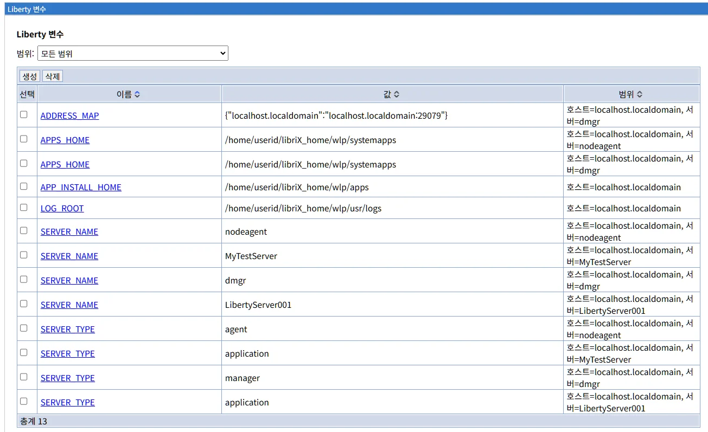
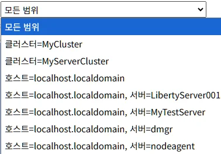
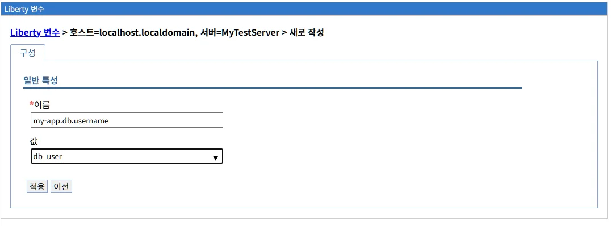

# Liberty 변수 관리
Liberty 변수(Liberty Variables)는 Liberty 서버 구성에서 재사용 가능한 값을 정의하고 관리하는 메커니즘입니다. 구성 파일에서 반복되는 값을 변수로 추상화하고, 환경별로 다른 값을 쉽게 관리하며, 구성의 이식성(Portability)을 향상시키는 방법을 설명합니다.

## 목차

- [개요](#개요)
- [Liberty 변수 메인 화면](#liberty-변수-메인-화면)
- [Liberty 변수 유형](#liberty-변수-유형)
- [Liberty 변수 사용](#liberty-변수-사용)
- [Liberty 변수 생성](#liberty-변수-생성)
- [변경사항 저장 및 검토](#변경사항-저장-및-검토)
- [Liberty 변수 수정 및 삭제](#liberty-변수-수정-및-삭제)
- [Liberty server.xml 구성](#liberty-serverxml-구성)
- [문제 해결](#문제-해결)
- [모범 사례](#모범-사례)
- [WebSphere ND와의 비교](#websphere-nd와의-비교)
- [다음 단계](#다음-단계)
- [참고 자료](#참고-자료)
- [요약](#요약)

---
## 개요

Liberty 변수(Liberty Variables)는 Liberty 서버 구성에서 재사용 가능한 값을 정의하고 관리하는 메커니즘입니다.

**주요 역할:**
- 구성 파일에서 반복되는 값을 변수로 추상화
- 환경별로 다른 값을 쉽게 관리
- 구성의 이식성(Portability) 향상
- 민감한 정보를 변수로 분리하여 보안 강화

**Liberty 구현:**
LibriX의 Liberty 변수 관리는 Open Liberty의 `<variable>` 요소를 기반으로 구현되며, WebSphere Application Server의 변수 관리와 유사한 UI를 제공하면서도 Liberty의 간결한 구조를 활용합니다.

---

## Liberty 변수 메인 화면

### 화면 구성



Liberty 변수 메인 화면은 다음과 같이 구성됩니다:

#### 상단 영역

**범위 선택 드롭다운**

```
범위: [모든 범위 ▼]
```



Liberty 변수의 범위를 선택하여 필터링합니다.

**범위 옵션:**
- **모든 범위**: 모든 클러스터/호스트/서버의 변수 표시
- **클러스터 범위**: `클러스터=MyCluster`
- **클러스터 + 서버 범위**: `클러스터=MyServerCluster`
- **호스트 범위**: `호스트=localhost.localdomain`
- **서버 범위**: `호스트=localhost.localdomain, 서버=LibertyServer001`

**범위 계층:**
```
모든 범위
├── 클러스터=MyCluster
├── 클러스터=MyServerCluster
├── 호스트=localhost.localdomain
│   ├── 서버=LibertyServer001
│   ├── 서버=MyTestServer
│   ├── 서버=dmgr
│   └── 서버=nodeagent
```

#### 관리 탭

화면 상단에 두 개의 탭이 있습니다:

**1. 생성 탭**
- 새로운 Liberty 변수를 생성합니다
- 클릭 시 변수 생성 화면으로 이동합니다

**2. 삭제 탭**
- 선택한 Liberty 변수를 삭제합니다
- 하나 이상의 변수를 선택한 후 사용 가능합니다
- 삭제 전 확인 대화상자가 표시됩니다

**주의사항:**
- 시스템 변수(내장 변수)는 삭제할 수 없습니다
- 다른 구성에서 참조 중인 변수를 삭제하면 오류가 발생할 수 있습니다

#### Liberty 변수 목록 테이블

목록 테이블은 다음 컬럼으로 구성됩니다:

| 컬럼 | 설명 |
|------|------|
| **선택** | 체크박스를 통해 변수 선택 |
| **이름** | 변수의 고유 이름 (클릭 시 상세 화면으로 이동) |
| **값** | 변수에 저장된 값 |
| **범위** | 변수가 정의된 범위 (클러스터, 호스트, 서버) |

**목록 예시:**

현재 화면에는 다음 Liberty 변수들이 표시되어 있습니다:

```
총계 13

☐  ADDRESS_MAP
   값: {"localhost.localdomain":"localhost.localdomain:29079"}
   범위: 호스트=localhost.localdomain, 서버=dmgr

☐  APPS_HOME
   값: /home/userid/libriX_home/wlp/systemapps
   범위: 호스트=localhost.localdomain, 서버=nodeagent

☐  APPS_HOME
   값: /home/userid/libriX_home/wlp/systemapps
   범위: 호스트=localhost.localdomain, 서버=dmgr

☐  APP_INSTALL_HOME
   값: /home/userid/libriX_home/wlp/apps
   범위: 호스트=localhost.localdomain

☐  LOG_ROOT
   값: /home/userid/libriX_home/wlp/usr/logs
   범위: 호스트=localhost.localdomain

☐  SERVER_NAME
   값: nodeagent
   범위: 호스트=localhost.localdomain, 서버=nodeagent

☐  SERVER_NAME
   값: MyTestServer
   범위: 호스트=localhost.localdomain, 서버=MyTestServer

☐  SERVER_NAME
   값: dmgr
   범위: 호스트=localhost.localdomain, 서버=dmgr

☐  SERVER_NAME
   값: LibertyServer001
   범위: 호스트=localhost.localdomain, 서버=LibertyServer001

☐  SERVER_TYPE
   값: agent
   범위: 호스트=localhost.localdomain, 서버=nodeagent

☐  SERVER_TYPE
   값: application
   범위: 호스트=localhost.localdomain, 서버=MyTestServer

☐  SERVER_TYPE
   값: manager
   범위: 호스트=localhost.localdomain, 서버=dmgr

☐  SERVER_TYPE
   값: application
   범위: 호스트=localhost.localdomain, 서버=LibertyServer001
```

**컬럼 정렬:**
- 각 컬럼 헤더를 클릭하면 오름차순/내림차순으로 정렬됩니다
- 이름, 값, 범위 순으로 정렬 가능

**목록 하단:**
```
총계 13
```

등록된 Liberty 변수의 총 개수를 표시합니다.

### 이름 컬럼 상세

**이름 (Name):**
- 변수의 고유 식별자
- 대소문자 구분
- 영문, 숫자, 언더스코어(_) 사용 가능
- 클릭 시 변수 상세 화면으로 이동

**명명 규칙 권장:**
```
패턴: UPPERCASE_WITH_UNDERSCORE

좋은 예:
- SERVER_NAME
- APP_INSTALL_HOME
- LOG_ROOT
- DATABASE_URL
- HTTP_PORT

나쁜 예:
- serverName (대소문자 혼용)
- app-install-home (하이픈 사용)
- log root (공백 사용)
```

**LibriX 시스템 변수:**

LibriX는 다음과 같은 시스템 변수를 자동으로 생성하고 관리합니다:

**1. ADDRESS_MAP**
```
값: {"localhost.localdomain":"localhost.localdomain:29079"}
설명: 호스트와 포트 매핑 정보 (JSON 형식)
범위: 서버별
용도: 서버 간 통신 주소 관리
```

**2. APPS_HOME**
```
값: /home/userid/libriX_home/wlp/systemapps
설명: 시스템 애플리케이션 디렉토리
범위: 서버별
용도: LibriX 내부 애플리케이션 위치
```

**3. APP_INSTALL_HOME**
```
값: /home/userid/libriX_home/wlp/apps
설명: 사용자 애플리케이션 설치 디렉토리
범위: 호스트
용도: EAR/WAR 파일 배포 위치
```

**4. LOG_ROOT**
```
값: /home/userid/libriX_home/wlp/usr/logs
설명: 로그 파일 루트 디렉토리
범위: 호스트
용도: 서버 로그 저장 위치
```

**5. SERVER_NAME**
```
값: LibertyServer001 (서버별로 다름)
설명: 서버의 고유 이름
범위: 서버별
용도: 서버 식별 및 구성
```

**6. SERVER_TYPE**
```
값: application / agent / manager
설명: 서버의 유형
범위: 서버별
용도: 서버 역할 식별

유형:
- application: 애플리케이션 서버
- agent: 노드 에이전트
- manager: 관리 서버 (dmgr)
```

### 값 컬럼 상세

**값 (Value):**
- 변수에 저장된 실제 값
- 문자열, 숫자, 경로, JSON 등 다양한 형식 지원
- 특수문자 포함 가능

**값 유형 예시:**

**경로 (Path):**
```
/home/userid/libriX_home/wlp/apps
/opt/ibm/wlp/usr/shared/resources
${wlp.install.dir}/usr/servers/${server.name}
```

**포트 번호:**
```
9080
9443
29079
```

**URL:**
```
jdbc:mysql://localhost:3306/mydb
http://localhost:9080/myapp
https://api.example.com
```

**JSON:**
```
{"localhost.localdomain":"localhost.localdomain:29079"}
{"host":"localhost","port":9080}
```

**불린 값:**
```
true
false
```

**환경 이름:**
```
development
test
production
```

### 범위 컬럼 상세

**범위 (Scope):**
- 변수가 정의되고 사용 가능한 범위
- 계층 구조를 가짐

**범위 유형:**

**1. 클러스터 범위**
```
범위 표시: 클러스터=MyCluster
적용 대상: 클러스터의 모든 멤버 서버
사용 예: 클러스터 공통 설정
```

**2. 호스트 범위**
```
범위 표시: 호스트=localhost.localdomain
적용 대상: 호스트의 모든 서버
사용 예: 호스트별 경로, 공통 리소스
```

**3. 서버 범위**
```
범위 표시: 호스트=localhost.localdomain, 서버=LibertyServer001
적용 대상: 특정 서버만
사용 예: 서버별 고유 설정 (포트, 이름 등)
```

**범위 계층 및 우선순위:**

Liberty 변수는 다음과 같은 계층 구조를 가지며, 좁은 범위가 넓은 범위보다 우선합니다:

```
우선순위 (높음 → 낮음):
1. 서버 범위 (가장 구체적)
2. 호스트 범위
3. 클러스터 범위 (가장 일반적)
```

**예시:**

같은 이름의 변수가 여러 범위에 정의된 경우:

```
변수명: HTTP_PORT

클러스터 범위:
- 값: 9080

호스트 범위:
- 값: 9081

서버 범위 (LibertyServer001):
- 값: 9082

→ LibertyServer001에서 ${HTTP_PORT} 참조 시: 9082 사용
```

**범위 선택 가이드:**

| 범위 | 사용 시기 | 예시 |
|------|----------|------|
| **클러스터** | 클러스터 멤버가 공유하는 값 | 클러스터 이름, 공유 리소스 |
| **호스트** | 호스트의 모든 서버가 공유 | 공통 디렉토리, 호스트명 |
| **서버** | 서버마다 다른 값 | 서버 이름, 포트 번호 |

---

## Liberty 변수 유형

Liberty 변수는 크게 두 가지 유형으로 나뉩니다:

### 1. 시스템 변수 (System Variables)

LibriX 또는 Liberty가 자동으로 생성하고 관리하는 변수입니다.

**특징:**
- 자동 생성 및 관리
- LibriX가 값을 설정
- 삭제 불가 (일부는 수정 가능)
- 시스템 동작에 필수

**LibriX 시스템 변수:**

```
ADDRESS_MAP        → 서버 통신 주소 맵
APPS_HOME          → 시스템 앱 디렉토리
APP_INSTALL_HOME   → 사용자 앱 디렉토리
LOG_ROOT           → 로그 루트 디렉토리
SERVER_NAME        → 서버 이름
SERVER_TYPE        → 서버 유형
```

**Liberty 내장 변수:**

Liberty는 다음과 같은 내장 변수를 제공합니다:

```
${wlp.install.dir}       → Liberty 설치 디렉토리
${wlp.user.dir}          → 사용자 디렉토리 (usr/)
${server.config.dir}     → 서버 구성 디렉토리
${server.output.dir}     → 서버 출력 디렉토리
${shared.app.dir}        → 공유 앱 디렉토리
${shared.config.dir}     → 공유 구성 디렉토리
${shared.resource.dir}   → 공유 리소스 디렉토리
${server.name}           → 현재 서버 이름
```

**Liberty 내장 변수 사용 예시:**

```xml
<variable name="LOG_DIR" value="${server.output.dir}/logs"/>
<variable name="JDBC_DRIVER_PATH" value="${shared.resource.dir}/jdbc"/>
<variable name="APP_CONFIG" value="${server.config.dir}/app-config.properties"/>
```

### 2. 사용자 정의 변수 (Custom Variables)

사용자가 직접 생성하고 관리하는 변수입니다.

**특징:**
- 사용자가 생성
- 자유로운 이름과 값 설정
- 수정 및 삭제 가능
- 애플리케이션 구성에 활용

**사용자 정의 변수 예시:**

**환경별 변수:**
```
ENVIRONMENT        → development / test / production
DB_HOST            → mysql-dev-01.company.com
DB_PORT            → 3306
DB_NAME            → myapp_dev
```

**경로 변수:**
```
CONFIG_DIR         → /opt/myapp/config
DATA_DIR           → /data/myapp
BACKUP_DIR         → /backup/myapp
```

**애플리케이션 변수:**
```
APP_VERSION        → 1.2.3
APP_CONTEXT_ROOT   → /myapp
MAX_POOL_SIZE      → 50
SESSION_TIMEOUT    → 30
```

**외부 서비스 변수:**
```
API_BASE_URL       → https://api.example.com
API_KEY            → ********** (암호화 권장)
SMTP_HOST          → smtp.company.com
SMTP_PORT          → 587
```

---

## Liberty 변수 사용

### server.xml에서 변수 참조

Liberty 변수는 `${변수명}` 형식으로 참조합니다.

**변수 참조 예시:**

```xml
<server>
    <!-- 변수 정의 -->
    <variable name="HTTP_PORT" value="9080"/>
    <variable name="HTTPS_PORT" value="9443"/>
    <variable name="DB_HOST" value="mysql-prod-01.company.com"/>
    <variable name="DB_PORT" value="3306"/>
    <variable name="DB_NAME" value="myapp"/>
    
    <!-- HTTP 엔드포인트에서 변수 사용 -->
    <httpEndpoint id="defaultHttpEndpoint"
                  httpPort="${HTTP_PORT}"
                  httpsPort="${HTTPS_PORT}"/>
    
    <!-- 데이터소스에서 변수 사용 -->
    <dataSource id="MyDataSource" jndiName="jdbc/myapp">
        <properties serverName="${DB_HOST}"
                    portNumber="${DB_PORT}"
                    databaseName="${DB_NAME}"/>
    </dataSource>
    
    <!-- 경로에서 변수 사용 -->
    <application location="${APP_INSTALL_HOME}/myapp.war"/>
    
    <!-- 조합 사용 -->
    <variable name="JDBC_URL" 
              value="jdbc:mysql://${DB_HOST}:${DB_PORT}/${DB_NAME}"/>
</server>
```

**변수 조합:**

변수는 다른 변수를 참조하여 조합할 수 있습니다:

```xml
<variable name="BASE_DIR" value="/opt/myapp"/>
<variable name="CONFIG_DIR" value="${BASE_DIR}/config"/>
<variable name="DATA_DIR" value="${BASE_DIR}/data"/>
<variable name="LOG_DIR" value="${BASE_DIR}/logs"/>

<variable name="DB_JDBC_URL" 
          value="jdbc:mysql://${DB_HOST}:${DB_PORT}/${DB_NAME}"/>
```

**기본값 설정:**

변수가 정의되지 않은 경우 사용할 기본값을 지정할 수 있습니다:

```xml
<!-- 변수명:기본값 형식 -->
<httpEndpoint httpPort="${HTTP_PORT:9080}"/>
<dataSource>
    <properties serverName="${DB_HOST:localhost}"/>
</dataSource>
```

### 변수 참조 범위

변수는 정의된 범위와 하위 범위에서 참조 가능합니다:

```
클러스터 변수
  ↓ 참조 가능
클러스터 멤버 서버

호스트 변수
  ↓ 참조 가능
호스트의 모든 서버

서버 변수
  ↓ 참조 가능
해당 서버만
```

---

## Liberty 변수 생성

### 변수 생성 화면



"생성" 탭을 클릭하면 새로운 Liberty 변수를 생성하는 화면이 나타납니다.

**화면 경로:**
```
Liberty 변수 > 호스트=localhost.localdomain, 서버=MyTestServer > 새로 작성
```

**화면 구성:**

```
일반 특성

*이름
[my-app.db.username                    ]

값
[db_user                                ▼]

[적용]  [이전]
```

### 입력 필드

변수 생성 화면은 두 개의 필드로 구성됩니다:

#### 1. 이름 *필수

```
*이름
[my-app.db.username]
```

변수의 고유 식별자를 입력합니다.

**입력 규칙:**
- 필수 입력 항목
- 영문자, 숫자, 언더스코어(_), 하이픈(-), 마침표(.) 사용 가능
- 대소문자 구분
- 같은 범위 내에서 고유해야 함
- 공백 및 특수문자 사용 불가

**명명 규칙:**

**패턴 1: UPPERCASE_WITH_UNDERSCORE (권장)**
```
좋은 예:
- HTTP_PORT
- DATABASE_URL
- APP_INSTALL_HOME
- MAX_POOL_SIZE
- SESSION_TIMEOUT
```

**패턴 2: 도메인 스타일 (계층 구조)**
```
좋은 예:
- my-app.db.username
- my-app.db.password
- my-app.db.url
- system.logging.level
- app.feature.enabled
```

**패턴 3: 환경별 접두사**
```
좋은 예:
- DEV_DB_HOST
- TEST_DB_HOST
- PROD_DB_HOST
- DEV_API_URL
- PROD_API_URL
```

**나쁜 예:**
```
✗ my app name          (공백 사용)
✗ db@host              (특수문자 사용)
✗ 123_PORT             (숫자로 시작)
✗ my variable          (공백 사용)
```

**명명 규칙 가이드:**

| 용도 | 명명 패턴 | 예시 |
|------|----------|------|
| **시스템 경로** | UPPERCASE_DIR | `APP_INSTALL_HOME`, `LOG_ROOT` |
| **포트** | UPPERCASE_PORT | `HTTP_PORT`, `HTTPS_PORT` |
| **데이터베이스** | DB_* | `DB_HOST`, `DB_PORT`, `DB_NAME` |
| **애플리케이션** | app.* | `app.version`, `app.context.root` |
| **환경** | ENV_* | `ENVIRONMENT`, `ENV_TYPE` |
| **외부 서비스** | service.* | `api.base.url`, `smtp.host` |

#### 2. 값 (선택사항)

```
값
[db_user                                ▼]
```

변수에 저장할 값을 입력합니다.

**입력 방법:**
- 텍스트 입력 필드
- 드롭다운 버튼(▼)을 클릭하면 이전에 사용한 값 목록 표시 (자동완성)
- 값은 선택사항이지만 일반적으로 입력 권장

**값 유형:**

**1. 문자열**
```
단순 텍스트:
- db_user
- myapp
- production

경로:
- /opt/myapp/config
- /home/userid/libriX_home/wlp/apps
- ${server.config.dir}/resources
```

**2. 숫자**
```
포트 번호:
- 9080
- 9443
- 3306

크기 및 개수:
- 50 (풀 크기)
- 30 (타임아웃)
- 1024 (버퍼 크기)
```

**3. URL**
```
데이터베이스 URL:
- jdbc:mysql://localhost:3306/mydb
- jdbc:oracle:thin:@//oracle-host:1521/ORCL

API URL:
- https://api.example.com
- http://localhost:8080/api
```

**4. JSON**
```
구조화된 데이터:
- {"host":"localhost","port":9080}
- {"localhost.localdomain":"localhost.localdomain:29079"}
```

**5. 불린**
```
참/거짓 값:
- true
- false
```

**6. 변수 참조**
```
다른 변수 참조:
- ${BASE_DIR}/config
- ${DB_HOST}:${DB_PORT}
- jdbc:mysql://${DB_HOST}:${DB_PORT}/${DB_NAME}
```

**값 입력 예시:**

**데이터베이스 연결 정보:**
```
이름: DB_HOST
값: mysql-prod-01.company.com

이름: DB_PORT
값: 3306

이름: DB_NAME
값: myapp

이름: DB_JDBC_URL
값: jdbc:mysql://${DB_HOST}:${DB_PORT}/${DB_NAME}
```

**애플리케이션 설정:**
```
이름: APP_CONTEXT_ROOT
값: /myapp

이름: MAX_POOL_SIZE
값: 50

이름: SESSION_TIMEOUT
값: 30
```

**경로 설정:**
```
이름: CONFIG_DIR
값: ${server.config.dir}/myapp

이름: LOG_DIR
값: ${server.output.dir}/logs/myapp

이름: DATA_DIR
값: /data/myapp
```

**환경 설정:**
```
이름: ENVIRONMENT
값: production

이름: DEBUG_ENABLED
값: false

이름: LOG_LEVEL
값: INFO
```

### 하단 버튼

```
[적용]  [이전]
```

**적용 버튼:**
- 입력한 정보를 저장하고 변수를 생성합니다
- 필수 필드 검증 수행
- 성공 시 변수 목록 화면으로 이동

**이전 버튼:**
- 입력한 내용을 버리고 변수 목록 화면으로 돌아갑니다
- 입력한 데이터는 저장되지 않습니다

### 생성 프로세스

"적용" 버튼을 클릭하면 다음 프로세스가 실행됩니다:

#### 1. 입력 검증

**필수 필드 검증:**
```
이름 필드가 비어있는 경우:
→ 오류: 이름을 입력하십시오.
```

**이름 형식 검증:**
```
잘못된 문자 사용:
→ 오류: 변수 이름에 잘못된 문자가 포함되어 있습니다.

허용된 문자: 영문자, 숫자, 언더스코어(_), 하이픈(-), 마침표(.)
```

**중복 검증:**
```
같은 범위에 동일한 이름의 변수가 이미 존재:
→ 오류: 같은 이름의 변수가 이미 존재합니다.
```

#### 2. Liberty server.xml 업데이트

변수가 생성되면 Liberty의 server.xml 파일이 자동으로 업데이트됩니다.

**생성된 구성 예시:**

```xml
<server>
    <!-- 기존 변수들 -->
    <variable name="SERVER_NAME" value="MyTestServer"/>
    <variable name="SERVER_TYPE" value="application"/>
    
    <!-- 새로 생성된 변수 -->
    <variable name="my-app.db.username" value="db_user"/>
</server>
```

**범위별 구성 위치:**

**서버 범위:**
```
파일: ${wlp.user.dir}/servers/MyTestServer/server.xml
위치: <server> 요소 내부
```

**호스트 범위:**
```
파일: LibriX 중앙 구성 파일
적용: 호스트의 모든 서버에 자동 배포
```

**클러스터 범위:**
```
파일: 클러스터 구성 파일
적용: 클러스터 멤버 서버에 자동 배포
```

#### 3. 서버 자동 갱신

Liberty는 server.xml 변경을 자동으로 감지하고 갱신합니다.

**Liberty 로그:**
```
[2026-01-15 12:30:45.123] CWWKG0016I: Starting server configuration update.
[2026-01-15 12:30:45.234] CWWKG0017I: The server configuration was successfully updated in 0.111 seconds.
```

**재시작 불필요:**
- Liberty의 동적 구성 기능
- 서버 재시작 없이 즉시 적용
- 실행 중인 애플리케이션에 영향 없음

#### 4. 변수 등록

생성된 변수가 LibriX 관리 데이터베이스에 등록됩니다.

**등록 정보:**
- 변수 ID
- 이름
- 값
- 범위 정보
- 생성 일시
- 생성자

#### 5. 목록 화면 이동

변수 생성이 완료되면 변수 목록 화면으로 자동 이동합니다.

**성공 메시지:**
```
Liberty 변수가 성공적으로 생성되었습니다.

이름: my-app.db.username
값: db_user
범위: 호스트=localhost.localdomain, 서버=MyTestServer
```

**목록에 추가된 변수:**
```
Liberty 변수 목록

☐  my-app.db.username
   값: db_user
   범위: 호스트=localhost.localdomain, 서버=MyTestServer
```

### 생성 후 확인 사항

변수 생성 후 다음을 확인하세요:

#### 1. 목록에서 확인

```
✓ 변수가 목록에 표시되는가?
✓ 이름과 값이 정확한가?
✓ 범위가 올바른가?
```

#### 2. Liberty 로그 확인

```bash
tail -f ${server.output.dir}/logs/messages.log
```

**예상 로그:**
```
CWWKG0017I: The server configuration was successfully updated
```

#### 3. server.xml 확인

```bash
cat ${server.config.dir}/server.xml | grep -A 1 "my-app.db.username"
```

**예상 출력:**
```xml
<variable name="my-app.db.username" value="db_user"/>
```

#### 4. 변수 사용 테스트

생성한 변수를 server.xml의 다른 구성 요소에서 참조하여 테스트:

```xml
<dataSource id="MyDataSource">
    <properties user="${my-app.db.username}"/>
</dataSource>
```

서버 재시작 후 로그에서 변수 값이 올바르게 치환되었는지 확인합니다.

### 생성 시 주의사항

**1. 이름 충돌 방지**

같은 범위에 동일한 이름의 변수를 생성할 수 없습니다:

```
오류 시나리오:
- 서버 범위에 "DB_HOST" 변수가 이미 존재
- 같은 서버 범위에 "DB_HOST" 변수를 다시 생성 시도

→ 오류: 같은 이름의 변수가 이미 존재합니다.

해결 방법:
- 다른 이름 사용
- 또는 기존 변수 수정
```

**2. 범위 선택**

변수를 생성하기 전에 적절한 범위를 선택해야 합니다:

```
잘못된 예:
- 모든 서버에서 사용할 변수를 서버 범위로 생성
→ 각 서버마다 개별 생성 필요 (비효율)

올바른 예:
- 모든 서버에서 사용할 변수는 호스트 또는 클러스터 범위로 생성
→ 한 번 생성으로 모든 서버에 적용
```

**3. 변수 의존성**

변수가 다른 변수를 참조하는 경우 순서에 주의:

```
올바른 순서:
1. DB_HOST 생성: mysql-prod-01.company.com
2. DB_PORT 생성: 3306
3. DB_NAME 생성: myapp
4. DB_JDBC_URL 생성: jdbc:mysql://${DB_HOST}:${DB_PORT}/${DB_NAME}

잘못된 순서:
1. DB_JDBC_URL 생성: jdbc:mysql://${DB_HOST}:${DB_PORT}/${DB_NAME}
   → DB_HOST, DB_PORT, DB_NAME이 아직 정의되지 않음
   → 변수 참조 오류 발생 가능
```

**4. 값 입력 권장**

값은 선택사항이지만 입력하는 것을 권장합니다:

```
값 없이 생성:
<variable name="DB_HOST"/>
→ 사용 시 ${DB_HOST:기본값} 형식으로 기본값 지정 필요

값과 함께 생성 (권장):
<variable name="DB_HOST" value="mysql-prod-01.company.com"/>
→ ${DB_HOST} 직접 사용 가능
```

**5. 민감한 정보 보호**

비밀번호 등 민감한 정보는 암호화 사용을 고려:

```
일반 변수 (비권장):
<variable name="DB_PASSWORD" value="mypassword"/>
→ server.xml에 평문으로 저장

암호화된 변수 (권장):
<variable name="DB_PASSWORD" value="{xor}Lz4sLChvLTs="/>
→ securityUtility encode 명령으로 암호화

또는 외부 파일 참조:
<variable name="DB_PASSWORD" value="${env.DB_PASSWORD}"/>
→ 환경 변수 또는 외부 설정 파일 사용
```

### 생성 예시

#### 예시 1: 데이터베이스 연결 변수

**시나리오:**
MySQL 프로덕션 데이터베이스 연결 정보를 변수로 관리

**생성 순서:**

**1단계: DB_HOST 생성**
```
범위: 호스트=localhost.localdomain
이름: DB_HOST
값: mysql-prod-01.company.com
```

**2단계: DB_PORT 생성**
```
범위: 호스트=localhost.localdomain
이름: DB_PORT
값: 3306
```

**3단계: DB_NAME 생성**
```
범위: 호스트=localhost.localdomain
이름: DB_NAME
값: myapp
```

**4단계: DB_JDBC_URL 생성**
```
범위: 호스트=localhost.localdomain
이름: DB_JDBC_URL
값: jdbc:mysql://${DB_HOST}:${DB_PORT}/${DB_NAME}
```

**결과 (server.xml):**
```xml
<variable name="DB_HOST" value="mysql-prod-01.company.com"/>
<variable name="DB_PORT" value="3306"/>
<variable name="DB_NAME" value="myapp"/>
<variable name="DB_JDBC_URL" 
          value="jdbc:mysql://${DB_HOST}:${DB_PORT}/${DB_NAME}"/>

<dataSource id="MyDataSource" jndiName="jdbc/myapp">
    <properties URL="${DB_JDBC_URL}"/>
</dataSource>
```

#### 예시 2: 환경별 설정 변수

**시나리오:**
개발/테스트/프로덕션 환경별로 다른 설정 적용

**개발 서버 (DevServer):**
```
범위: 호스트=localhost.localdomain, 서버=DevServer
이름: ENVIRONMENT
값: development

이름: LOG_LEVEL
값: DEBUG

이름: DB_HOST
값: mysql-dev-01.company.com
```

**테스트 서버 (TestServer):**
```
범위: 호스트=localhost.localdomain, 서버=TestServer
이름: ENVIRONMENT
값: test

이름: LOG_LEVEL
값: INFO

이름: DB_HOST
값: mysql-test-01.company.com
```

**프로덕션 서버 (ProdServer):**
```
범위: 호스트=localhost.localdomain, 서버=ProdServer
이름: ENVIRONMENT
값: production

이름: LOG_LEVEL
값: WARN

이름: DB_HOST
값: mysql-prod-01.company.com
```

**결과:**
각 서버는 같은 변수 이름을 사용하지만 서버별로 다른 값을 가집니다.

#### 예시 3: 공통 경로 변수

**시나리오:**
호스트의 모든 서버가 공유하는 공통 경로 설정

**생성:**
```
범위: 호스트=localhost.localdomain (호스트 범위)

이름: BASE_DIR
값: /opt/myapp

이름: CONFIG_DIR
값: ${BASE_DIR}/config

이름: DATA_DIR
값: ${BASE_DIR}/data

이름: LOG_DIR
값: ${BASE_DIR}/logs
```

**결과:**
호스트의 모든 서버에서 이 변수들을 사용할 수 있습니다.

---

## 다음 단계

- Liberty 변수를 생성하려면 "생성" 탭을 클릭하여 변수 생성 화면으로 이동하세요.
- Liberty 변수 상세 설정은 목록에서 변수 이름을 클릭하세요.

---

## 참고 자료

### Liberty 문서
- [Liberty Variables](https://openliberty.io/docs/latest/reference/config/variable.html)
- [Server Configuration](https://openliberty.io/docs/latest/reference/config/server-configuration-overview.html)
- [Directory Locations](https://openliberty.io/docs/latest/reference/config/server-configuration-overview.html#directory-locations)

### WebSphere ND 문서
- [Variables](https://www.ibm.com/docs/en/was-nd/9.0.5?topic=variables)

---

## 변경사항 저장 및 검토

### 저장 프로세스

Liberty 변수를 생성하거나 수정한 후 "적용" 버튼을 클릭하면 저장 및 검토 프로세스가 시작됩니다.

#### 1. 변경사항 검토 화면

"적용" 버튼 클릭 시 변경사항을 검토하는 화면이 나타납니다.

**검토 화면 구성:**

```
변경사항 검토

다음 변경사항이 서버에 적용됩니다:

━━━━━━━━━━━━━━━━━━━━━━━━━━━━━━━━━━━━━━━━
추가될 변수:
━━━━━━━━━━━━━━━━━━━━━━━━━━━━━━━━━━━━━━━━

변수: my-app.db.username
값: db_user
범위: 호스트=localhost.localdomain, 서버=MyTestServer
파일: /home/userid/libriX_home/wlp/usr/servers/MyTestServer/server.xml

━━━━━━━━━━━━━━━━━━━━━━━━━━━━━━━━━━━━━━━━
영향받는 서버:
━━━━━━━━━━━━━━━━━━━━━━━━━━━━━━━━━━━━━━━━

• MyTestServer (자동 재로드)

━━━━━━━━━━━━━━━━━━━━━━━━━━━━━━━━━━━━━━━━

[ ] 변경사항을 즉시 적용
[✓] 변경사항을 저장하고 나중에 동기화

[저장 및 적용]  [취소]
```

저장 및 검토 프로세스는 이전 문서들(JDBC 제공자, 데이터소스)과 동일한 패턴을 따릅니다.

---

## Liberty 변수 수정 및 삭제

### 변수 수정

목록에서 변수 이름을 클릭하면 변수 상세/수정 화면으로 이동합니다.

**수정 가능 항목:**
- 값 (Value) - 언제든지 수정 가능
- 이름 (Name) - 읽기 전용 (변경 불가)

### 변수 삭제

1. 목록에서 삭제할 변수의 체크박스 선택
2. "삭제" 탭 클릭
3. 삭제 확인 후 적용

**주의사항:**
- 시스템 변수는 삭제 불가
- 참조 중인 변수 삭제 시 오류 발생 가능
- 삭제된 변수는 복구 불가

---

## Liberty server.xml 구성

Liberty 변수는 server.xml 파일의 `<variable>` 요소로 정의됩니다.

### 기본 구문

```xml
<variable name="변수명" value="값"/>
```

### 구성 예시

#### 단순 변수

```xml
<server>
    <!-- 포트 -->
    <variable name="HTTP_PORT" value="9080"/>
    <variable name="HTTPS_PORT" value="9443"/>
    
    <!-- 경로 -->
    <variable name="APP_DIR" value="/opt/myapp"/>
    <variable name="LOG_DIR" value="/var/log/myapp"/>
    
    <!-- 문자열 -->
    <variable name="ENVIRONMENT" value="production"/>
    <variable name="APP_VERSION" value="1.0.0"/>
</server>
```

#### 변수 참조

```xml
<server>
    <!-- 기본 변수 -->
    <variable name="DB_HOST" value="mysql-prod-01.company.com"/>
    <variable name="DB_PORT" value="3306"/>
    <variable name="DB_NAME" value="myapp"/>
    
    <!-- 다른 변수 참조 -->
    <variable name="DB_JDBC_URL" 
              value="jdbc:mysql://${DB_HOST}:${DB_PORT}/${DB_NAME}"/>
    
    <!-- HTTP 엔드포인트에서 변수 사용 -->
    <httpEndpoint id="defaultHttpEndpoint"
                  httpPort="${HTTP_PORT}"
                  httpsPort="${HTTPS_PORT}"/>
    
    <!-- 데이터소스에서 변수 사용 -->
    <dataSource id="MyDataSource" jndiName="jdbc/myapp">
        <jdbcDriver libraryRef="MySQLLib"/>
        <properties serverName="${DB_HOST}"
                    portNumber="${DB_PORT}"
                    databaseName="${DB_NAME}"/>
    </dataSource>
</server>
```

#### Liberty 내장 변수 활용

```xml
<server>
    <!-- Liberty 내장 변수 사용 -->
    <variable name="JDBC_DRIVER_DIR" 
              value="${shared.resource.dir}/jdbc"/>
    
    <variable name="APP_CONFIG_FILE" 
              value="${server.config.dir}/app-config.properties"/>
    
    <variable name="LOG_FILE" 
              value="${server.output.dir}/logs/myapp.log"/>
    
    <!-- 라이브러리 경로 -->
    <library id="MySQLLib">
        <fileset dir="${JDBC_DRIVER_DIR}" 
                 includes="mysql-connector-java-*.jar"/>
    </library>
    
    <!-- 애플리케이션 위치 -->
    <application location="${shared.app.dir}/myapp.war"/>
</server>
```

---

## 문제 해결

### 일반적인 문제

#### 문제 1: 변수 값이 적용되지 않음

**증상:** 변수를 생성했지만 ${변수명} 참조 시 값이 치환되지 않음

**원인:**
1. 변수 이름 오타
2. 변수가 정의되지 않음
3. 범위가 잘못됨
4. Liberty 재로드 실패

**해결 방법:**

```bash
# 변수 존재 확인
grep "name=\"DB_HOST\"" ${server.config.dir}/server.xml

# Liberty 로그 확인
tail -f ${server.output.dir}/logs/messages.log
```

#### 문제 2: 변수 참조 순환

**잘못된 예:**
```xml
<variable name="VAR_A" value="${VAR_B}"/>
<variable name="VAR_B" value="${VAR_A}"/>
<!-- 순환 참조 발생 -->
```

**올바른 예:**
```xml
<variable name="BASE_URL" value="http://localhost:9080"/>
<variable name="API_URL" value="${BASE_URL}/api"/>
<variable name="ADMIN_URL" value="${BASE_URL}/admin"/>
<!-- 계층적 참조 -->
```

---

## 모범 사례

### 1. 명명 규칙 일관성

```xml
<!-- 좋은 예 -->
<variable name="DB_HOST" value="mysql-prod-01.company.com"/>
<variable name="DB_PORT" value="3306"/>
<variable name="DB_NAME" value="myapp"/>
<variable name="HTTP_PORT" value="9080"/>
<variable name="HTTPS_PORT" value="9443"/>

<!-- 나쁜 예 -->
<variable name="dbHost" value="mysql-prod-01.company.com"/>
<variable name="database-port" value="3306"/>
<variable name="DBName" value="myapp"/>
```

### 2. 범위 선택 전략

**클러스터 범위:** 클러스터 멤버가 공유하는 값  
**호스트 범위:** 호스트의 모든 서버가 공유  
**서버 범위:** 서버별로 다른 값

### 3. 민감한 정보 보호

```bash
# 비밀번호 암호화
${wlp.install.dir}/bin/securityUtility encode mypassword
```

```xml
<variable name="DB_PASSWORD" value="{xor}Lz4sLChvLTs="/>
```

---

## WebSphere ND와의 비교

### 아키텍처 차이

**WebSphere ND:**
- 중앙 집중식 관리 (Deployment Manager)
- variables.xml 별도 관리
- 범위: Cell > Node > Server > Cluster

**Liberty (LibriX):**
- 분산 관리 (각 서버의 server.xml)
- `<variable>` 요소로 관리
- 범위: Cluster > Host > Server

---

## 참고 자료

### Liberty 공식 문서
- [Liberty Variables](https://openliberty.io/docs/latest/reference/config/variable.html)
- [Server Configuration](https://openliberty.io/docs/latest/reference/config/server-configuration-overview.html)
- [Directory Locations](https://openliberty.io/docs/latest/reference/config/server-configuration-overview.html#directory-locations)

### 관련 LibriX 문서
- [애플리케이션 서버 관리](../server/application-server.md)
- [데이터소스 관리](../resource/datasource.md)
- [공유 라이브러리 관리](../environment/shared-library.md)

---

## 요약

Liberty 변수는 Liberty 서버 구성을 유연하고 이식성 있게 만드는 핵심 기능입니다.

**주요 특징:**
- 재사용 가능한 값 정의
- 범위별 변수 관리 (클러스터, 호스트, 서버)
- server.xml에서 `${변수명}` 형식으로 참조
- 다른 변수 참조 및 조합 가능
- Liberty 내장 변수 활용

**모범 사례:**
- 일관된 명명 규칙 사용
- 적절한 범위 선택
- 변수 조합 활용
- 환경별 변수 체계적 관리
- 민감한 정보 보호

Liberty 변수를 효과적으로 활용하여 구성 관리를 단순화하고 환경 간 이식성을 향상시키세요!
