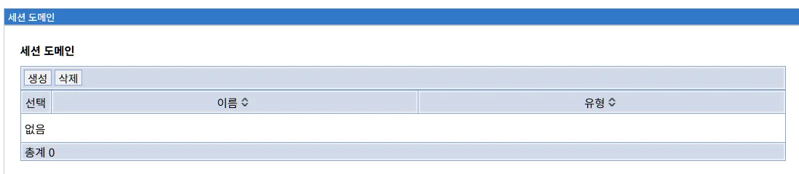
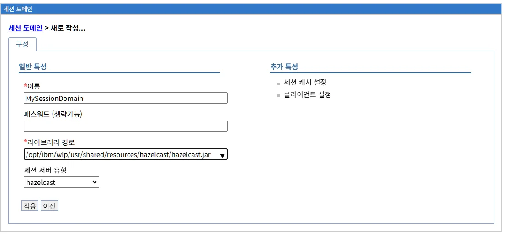
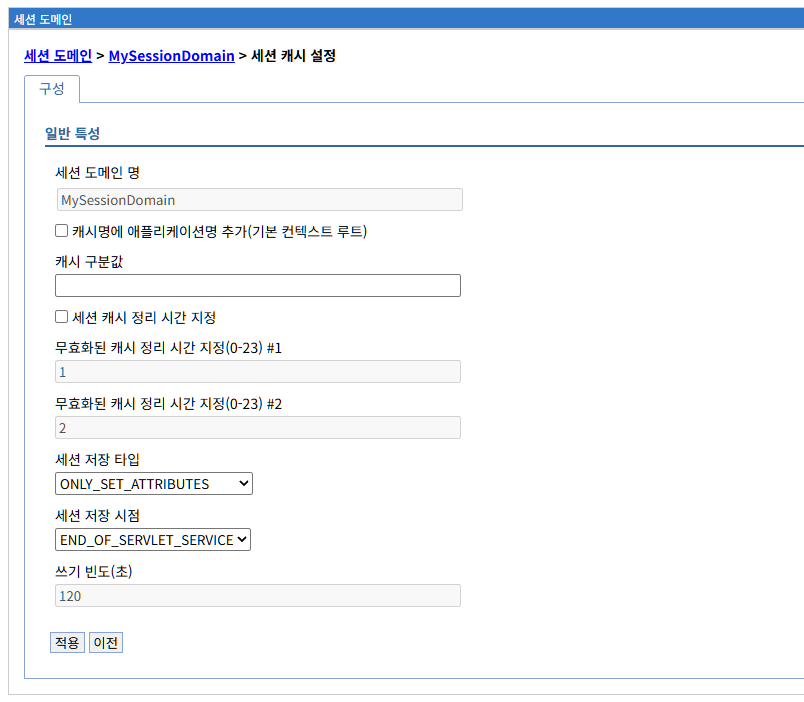
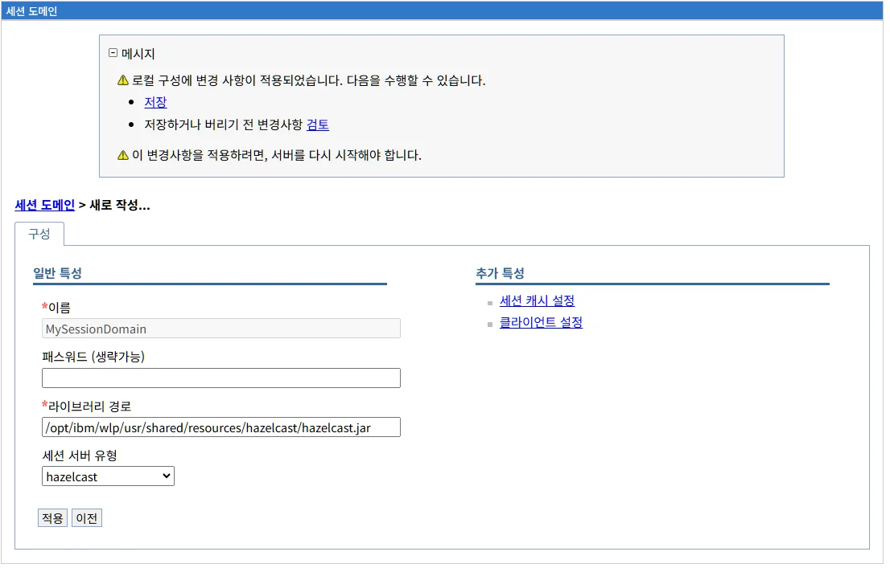

# 세션 도메인 관리

## 개요

세션 도메인은 HTTP 세션 데이터를 공유하는 서버 그룹을 정의하는 논리적 단위입니다. LibriX 관리콘솔에서 세션 도메인을 생성하고 관리할 수 있으며, 세션 서버와 애플리케이션 서버는 동일한 세션 도메인에 속해야만 세션 데이터를 공유할 수 있습니다.

### LibriX와 Open Liberty/WebSphere Liberty

LibriX는 Open Liberty 및 WebSphere Liberty의 JCache Session Persistence 기능을 기반으로 합니다. Liberty에서 세션 도메인을 구성하려면 각 서버의 `server.xml` 파일을 직접 편집하고, JCache 구현체의 구성 파일(예: `hazelcast.xml`)을 작성해야 합니다.

**Liberty의 전통적인 구성 방식:**

각 서버마다 다음과 같은 작업이 필요합니다:

1. `server.xml`에 sessionCache 기능 추가
2. JCache 라이브러리 경로 설정
3. CacheManager 구성
4. JCache 구현체별 구성 파일 작성 (hazelcast.xml, redisson-config.yaml 등)
5. 클러스터 멤버 정보 수동 관리

```xml
<!-- 각 서버의 server.xml을 개별적으로 편집 -->
<server>
  <featureManager>
    <feature>sessionCache-1.0</feature>
  </featureManager>
  
  <library id="JCacheLib">
    <fileset dir="/opt/hazelcast/lib" includes="*.jar"/>
  </library>
  
  <httpSessionCache cacheManagerRef="CacheManager"/>
  
  <cacheManager id="CacheManager" uri="file:/config/hazelcast.xml">
    <cachingProvider jCacheLibraryRef="JCacheLib"/>
    <properties 
      hazelcast.group.name="MyDomain"
      hazelcast.group.password="password"/>
  </cacheManager>
</server>
```

```xml
<!-- hazelcast.xml 파일도 별도로 작성 -->
<hazelcast>
  <group>
    <name>MyDomain</name>
    <password>password</password>
  </group>
  <network>
    <port>5701</port>
    <join>
      <multicast enabled="true"/>
    </join>
  </network>
</hazelcast>
```

**LibriX의 개선된 접근 방식:**

LibriX는 이러한 복잡한 XML 편집 작업을 웹 UI로 간소화합니다:

- **중앙 집중식 관리**: 하나의 인터페이스에서 모든 서버의 세션 도메인 관리
- **자동 구성 생성**: 입력된 정보를 바탕으로 필요한 XML 파일 자동 생성
- **일관성 보장**: 동일한 세션 도메인을 사용하는 모든 서버에 일관된 설정 적용
- **검증 기능**: 설정 오류 사전 방지 및 유효성 검사
- **가시성**: 세션 도메인에 속한 서버 목록 및 상태 확인

### 세션 도메인의 역할

세션 도메인은 다음과 같은 기능을 제공합니다:

**세션 데이터 공유 범위 정의**

세션 도메인은 어떤 서버들이 세션 데이터를 공유할 수 있는지를 결정합니다. 동일한 세션 도메인에 속한 서버들만 세션 정보를 주고받을 수 있습니다.

**보안 경계 설정**

서로 다른 애플리케이션이나 보안 수준이 다른 환경을 세션 도메인으로 분리하여 세션 데이터의 격리를 보장할 수 있습니다.

**클러스터 구성 단순화**

세션 도메인을 사용하면 복잡한 클러스터 환경에서도 어떤 서버들이 함께 작동하는지를 명확하게 정의할 수 있습니다.

**세션 복제 정책 적용**

세션 도메인 단위로 세션 복제 정책, 타임아웃 설정 등을 관리할 수 있습니다.

### Liberty JCache와 세션 도메인

Liberty의 JCache Session Persistence에서 세션 도메인은 다음과 같이 작동합니다:

**JCache 클러스터 그룹**

세션 도메인은 JCache 구현체(Hazelcast, Infinispan 등)의 클러스터 그룹에 매핑됩니다. Hazelcast의 경우 Group Name으로, Redis의 경우 클러스터 구성으로 표현됩니다.

**자동 멤버 검색**

동일한 세션 도메인(그룹 이름)과 패스워드를 사용하는 서버들은 자동으로 서로를 발견하고 클러스터를 형성합니다.

**데이터 격리**

서로 다른 세션 도메인에 속한 서버들은 독립적인 세션 캐시를 유지하며, 세션 데이터가 섞이지 않습니다.

## 세션 도메인 목록

환경 메뉴의 "세션 도메인" 링크를 선택하면 현재 LibriX에 정의된 모든 세션 도메인의 목록이 표시됩니다.



### 세션 도메인 목록 화면 구성

세션 도메인 목록 화면은 다음과 같은 정보를 테이블 형태로 제공합니다:

- **선택**: 체크박스를 사용하여 작업을 수행할 세션 도메인을 선택할 수 있습니다.
- **이름**: 세션 도메인의 고유한 이름입니다. 클릭하면 해당 세션 도메인의 상세 정보 페이지로 이동합니다.
- **유형**: 세션 도메인의 유형을 나타냅니다. 일반적으로 JCache 기반 세션 관리를 위한 도메인이 표시됩니다.

화면 상단에는 "생성"과 "삭제" 탭이 제공되며, 화면 하단에는 현재 등록된 세션 도메인의 총 개수가 표시됩니다.

### 세션 도메인 관리 기능

화면 상단의 탭을 사용하여 세션 도메인을 관리할 수 있습니다:

#### 생성

새로운 세션 도메인을 생성합니다. 세션 도메인은 세션 서버나 애플리케이션 서버를 구성하기 전에 먼저 생성되어야 합니다.

세션 도메인을 생성하려면:

1. "생성" 탭을 클릭합니다.
2. 세션 도메인 생성 화면이 표시됩니다.
3. 필요한 정보를 입력하여 세션 도메인을 생성합니다.

#### 삭제

선택한 세션 도메인을 LibriX에서 제거합니다.

삭제 작업을 수행하려면:

1. 목록에서 삭제할 세션 도메인의 체크박스를 선택합니다.
2. "삭제" 탭을 클릭합니다.
3. 확인 대화상자가 나타나면 삭제를 확인합니다.

**주의**: 세션 도메인을 삭제하기 전에 다음 사항을 확인해야 합니다:
- 해당 세션 도메인을 사용 중인 세션 서버가 없는지 확인
- 해당 세션 도메인을 참조하는 애플리케이션 서버가 없는지 확인
- 사용 중인 세션 도메인을 삭제하면 세션 복제가 중단되고 세션 데이터가 손실될 수 있습니다

## 세션 도메인 생성

"생성" 탭을 클릭하면 새로운 세션 도메인을 생성하는 화면이 표시됩니다.



### 일반 특성

세션 도메인의 기본 정보를 입력합니다.

#### 이름 (필수)

세션 도메인의 고유한 이름을 입력합니다.

세션 도메인 이름은 LibriX 시스템 내에서 유일해야 하며, 세션 서버와 애플리케이션 서버에서 이 도메인을 참조할 때 사용됩니다.

**명명 규칙 권장사항:**
- 애플리케이션이나 용도를 나타내는 명확한 이름 사용
- 환경(프로덕션, 개발, 테스트)을 포함
- 특수문자나 공백 사용 자제

예시: `ECommerceProdDomain`, `CustomerPortal-Dev`, `PaymentService-Test`

#### 패스워드 (생략가능)

세션 도메인에 접근하기 위한 패스워드를 설정합니다 (선택 사항).

JCache 클러스터에 보안이 설정된 경우, 클러스터에 조인하기 위한 인증 정보로 사용됩니다. 특히 Hazelcast의 경우 그룹 패스워드로 사용되어 동일한 패스워드를 가진 멤버만 클러스터에 참여할 수 있습니다.

**보안 고려사항:**
- 프로덕션 환경에서는 강력한 패스워드 사용 권장
- 패스워드는 암호화되어 저장됩니다
- 동일한 세션 도메인을 사용하는 모든 서버는 같은 패스워드를 사용해야 합니다

#### 라이브러리 경로 (필수)

JCache 구현체 라이브러리가 위치한 디렉토리의 전체 경로를 입력합니다.

이 경로는 세션 서버와 애플리케이션 서버가 JCache 구현체(Hazelcast, Redis 클라이언트 등)의 JAR 파일을 찾는 데 사용됩니다. Liberty 서버는 이 경로를 참조하여 `<library>` 요소를 구성합니다.

**경로 예시:**

Hazelcast의 경우:
```
/opt/hazelcast/lib
/usr/local/jcache/hazelcast
${shared.resource.dir}/hazelcast
```

Redis (Redisson)의 경우:
```
/opt/redisson/lib
/usr/local/jcache/redisson
${shared.resource.dir}/redisson
```

**디렉토리 구조:**
```
/opt/hazelcast/lib/
├── hazelcast.jar           # Hazelcast 코어 라이브러리
├── hazelcast-client.jar    # 클라이언트 모드용 (선택)
└── ...                     # 기타 의존성
```

또는

```
/opt/redisson/lib/
├── redisson.jar            # Redisson 라이브러리
├── redisson-all.jar        # 모든 의존성 포함
└── ...
```

#### 세션 서버 유형

드롭다운 메뉴에서 사용할 JCache 구현체를 선택합니다.

현재 지원되는 세션 서버 유형:

**hazelcast**

오픈소스 인메모리 데이터 그리드로, 가장 널리 사용되는 JCache 구현체입니다.

**특징:**
- 완전한 JCache (JSR 107) 지원
- 자동 멤버 검색 및 클러스터링
- Peer-to-Peer 및 Client-Server 모드 지원
- 동기/비동기 백업 옵션
- 파티셔닝 및 레플리케이션
- 멀티캐스트 또는 TCP/IP 검색
- Kubernetes, AWS, Azure 등 클라우드 환경 지원

**사용 시나리오:**
- 중소규모부터 대규모 클러스터까지
- 빠른 설정과 간편한 구성이 필요한 경우
- 오픈소스 솔루션을 선호하는 경우

**redis**

Redis를 JCache 제공자로 사용하는 옵션입니다. 일반적으로 Redisson 라이브러리를 통해 구현됩니다.

**특징:**
- Redis의 높은 성능과 안정성 활용
- 영속성 옵션 (RDB, AOF)
- Redis Cluster, Sentinel 지원
- 다양한 데이터 구조 지원
- Pub/Sub 메시징
- 원격 캐시 서버로의 연결 (Client-Server 모드)

**사용 시나리오:**
- 기존에 Redis 인프라가 구축되어 있는 경우
- 세션 데이터의 영속성이 중요한 경우
- 매우 큰 규모의 세션 데이터 처리
- 독립적인 캐시 서버 클러스터를 운영하는 경우

### 추가 특성

세션 도메인의 세부 동작을 제어하는 추가 구성 옵션을 제공합니다.

#### 세션 캐시 설정

세션 캐시의 상세 설정을 구성합니다. 이 설정은 세션 데이터가 언제, 어떻게 캐시에 저장되는지를 제어합니다.



**캐시명에 애플리케이션명 추가(기본 컨텍스트 루트)**

체크박스를 선택하면 JCache의 캐시 이름에 애플리케이션 컨텍스트 루트를 포함시킵니다.

이 옵션을 활성화하면 서로 다른 애플리케이션의 세션 데이터가 별도의 캐시에 저장되어 격리됩니다. 동일한 세션 도메인을 여러 애플리케이션이 공유하는 경우 유용합니다.

**예시:**
- 체크 안함: 캐시 이름 = `liberty.session.cache`
- 체크함: 캐시 이름 = `liberty.session.cache.myapp` (컨텍스트 루트가 `/myapp`인 경우)

**캐시 구분값**

JCache 캐시의 고유 식별자로 사용할 사용자 정의 문자열을 입력합니다 (선택 사항).

기본값 대신 사용자 지정 캐시 이름을 사용하려는 경우 이 필드에 값을 입력합니다. 여러 세션 도메인이 동일한 JCache 인스턴스를 공유하는 경우 각 도메인을 구분하는 데 사용됩니다.

**세션 캐시 정리 시간 지정**

체크박스를 선택하면 무효화된 캐시 정리 시간 간격을 수동으로 지정할 수 있습니다.

JCache는 만료된 세션 데이터를 주기적으로 정리합니다. 이 옵션을 활성화하면 정리 주기를 직접 제어할 수 있습니다.

**무효화된 캐시 정리 시간 지정(0-23) #1**

첫 번째 정리 작업을 수행할 시간(시)을 입력합니다 (0-23 범위).

예시: `1`을 입력하면 매일 오전 1시에 정리 작업이 실행됩니다.

**무효화된 캐시 정리 시간 지정(0-23) #2**

두 번째 정리 작업을 수행할 시간(시)을 입력합니다 (0-23 범위).

예시: `2`를 입력하면 매일 오전 2시에 두 번째 정리 작업이 실행됩니다.

하루에 여러 번 정리 작업을 실행하여 메모리를 효율적으로 관리할 수 있습니다. 트래픽이 적은 시간대에 정리 작업을 예약하는 것이 좋습니다.

**세션 저장 타입**

세션 데이터를 캐시에 저장할 때 어떤 속성을 저장할지 결정합니다.

드롭다운 메뉴에서 다음 옵션 중 하나를 선택합니다:

**ONLY_SET_ATTRIBUTES (기본값)**

`setAttribute()` 메서드를 통해 명시적으로 설정된 속성만 캐시에 저장합니다.

이 모드는 가장 효율적이며, 필요한 데이터만 복제하므로 네트워크 트래픽과 메모리 사용량을 최소화합니다.

**사용 시나리오:**
- 대부분의 일반적인 웹 애플리케이션
- 세션에 저장되는 데이터가 명확하게 정의된 경우
- 성능 최적화가 중요한 경우

**server.xml 구성:**
```xml
<httpSessionCache 
  writeContents="ONLY_SET_ATTRIBUTES"
  cacheManagerRef="CacheManager"/>
```

**ALL_SESSION_ATTRIBUTES**

세션의 모든 속성을 캐시에 저장합니다. `setAttribute()`로 설정하지 않은 내부 속성도 포함됩니다.

이 모드는 세션 객체의 모든 상태를 완전히 복제하므로, 복잡한 세션 관리가 필요한 경우 유용합니다.

**사용 시나리오:**
- 레거시 애플리케이션 마이그레이션
- 세션 객체의 모든 상태가 필요한 경우
- 세션 속성이 동적으로 변경되는 복잡한 애플리케이션

**주의사항:**
- 불필요한 데이터까지 복제되어 오버헤드 증가
- 네트워크 대역폭과 메모리 사용량 증가

**server.xml 구성:**
```xml
<httpSessionCache 
  writeContents="ALL_SESSION_ATTRIBUTES"
  cacheManagerRef="CacheManager"/>
```

**GET_AND_SET_ATTRIBUTES**

`getAttribute()`와 `setAttribute()` 모두 호출된 속성을 캐시에 저장합니다.

읽기 작업도 추적하여 실제로 사용되는 속성만 복제합니다. `ONLY_SET_ATTRIBUTES`보다 더 정밀한 제어를 제공하지만, 약간의 오버헤드가 있습니다.

**사용 시나리오:**
- 세션 속성 중 일부만 실제로 사용되는 경우
- 읽기 전용 속성과 쓰기 속성을 구분해야 하는 경우

**server.xml 구성:**
```xml
<httpSessionCache 
  writeContents="GET_AND_SET_ATTRIBUTES"
  cacheManagerRef="CacheManager"/>
```

**세션 저장 시점**

세션 데이터를 캐시에 쓰는 시점을 결정합니다.

드롭다운 메뉴에서 다음 옵션 중 하나를 선택합니다:

**END_OF_SERVLET_SERVICE (기본값)**

서블릿 서비스 메서드가 완료된 직후 세션 데이터를 캐시에 저장합니다.

각 요청이 완료될 때마다 자동으로 세션이 저장되므로, 별도의 코드 작성이 필요 없습니다. 가장 일반적으로 사용되는 옵션입니다.

**작동 방식:**
```
사용자 요청 → 서블릿 처리 → 세션 수정
                           ↓
                  서블릿 서비스 종료
                           ↓
                 세션 데이터 캐시에 저장
                           ↓
                    응답 반환
```

**장점:**
- 자동 저장으로 편리함
- 코드 변경 불필요
- 세션 데이터 손실 가능성 최소화

**단점:**
- 요청마다 저장 오버헤드 발생
- 세션이 변경되지 않아도 저장 시도

**사용 시나리오:**
- 대부분의 웹 애플리케이션
- 세션 데이터 무결성이 중요한 경우
- 개발 편의성을 우선하는 경우

**server.xml 구성:**
```xml
<httpSessionCache 
  writeFrequency="END_OF_SERVLET_SERVICE"
  cacheManagerRef="CacheManager"/>
```

**MANUAL_UPDATE**

애플리케이션 코드에서 명시적으로 세션 저장을 트리거할 때만 캐시에 저장합니다.

개발자가 `IBMSession.sync()` 메서드를 호출하여 세션 저장 시점을 직접 제어합니다. 최적의 성능을 위해 필요한 경우에만 저장할 수 있습니다.

**코드 예시:**
```java
import com.ibm.websphere.servlet.session.IBMSession;

@WebServlet("/updateProfile")
public class ProfileServlet extends HttpServlet {
    
    protected void doPost(HttpServletRequest request, 
                         HttpServletResponse response) {
        HttpSession session = request.getSession();
        
        // 세션 속성 수정
        session.setAttribute("username", request.getParameter("username"));
        session.setAttribute("email", request.getParameter("email"));
        
        // 명시적으로 세션 저장
        if (session instanceof IBMSession) {
            ((IBMSession) session).sync();
        }
    }
}
```

**장점:**
- 최적의 성능 (필요할 때만 저장)
- 세션 저장 시점에 대한 완전한 제어
- 불필요한 저장 작업 제거

**단점:**
- 코드 수정 필요
- sync() 호출을 잊으면 세션 데이터 손실 가능
- 개발자가 저장 로직을 관리해야 함

**사용 시나리오:**
- 고성능이 요구되는 애플리케이션
- 세션 변경이 드문 경우
- 대용량 세션 데이터를 다루는 경우
- 세션 저장 시점을 최적화하려는 경우

**주의사항:**
- 중요한 세션 변경 후 반드시 `sync()` 호출
- 예외 처리 시에도 `sync()` 호출 확인
- 트랜잭션과 함께 사용 시 커밋 전에 `sync()` 호출

**server.xml 구성:**
```xml
<httpSessionCache 
  writeFrequency="MANUAL_UPDATE"
  cacheManagerRef="CacheManager"/>
```

**TIME_BASED_WRITE**

지정된 시간 간격마다 세션 데이터를 캐시에 저장합니다.

주기적인 저장으로 `END_OF_SERVLET_SERVICE`의 빈번한 저장과 `MANUAL_UPDATE`의 복잡성 사이의 균형을 제공합니다.

**작동 방식:**
```
세션 생성/수정
     ↓
설정된 간격(예: 10초) 경과
     ↓
세션 데이터 캐시에 저장
     ↓
다음 간격까지 대기
```

**장점:**
- 저장 빈도 조절 가능
- 코드 수정 불필요
- 성능과 안정성의 균형

**단점:**
- 마지막 저장 이후 변경사항은 서버 장애 시 손실 가능
- 최적의 간격 설정이 필요

**사용 시나리오:**
- 세션 변경이 빈번한 애플리케이션
- 일정 수준의 데이터 손실을 허용할 수 있는 경우
- 성능과 안정성의 균형이 필요한 경우

**server.xml 구성:**
```xml
<httpSessionCache 
  writeFrequency="TIME_BASED_WRITE"
  writeInterval="10s"
  cacheManagerRef="CacheManager"/>
```

**비교표:**

| 저장 시점 | 저장 빈도 | 성능 | 데이터 안정성 | 코드 변경 | 사용 사례 |
|---------|---------|------|------------|---------|---------|
| END_OF_SERVLET_SERVICE | 요청마다 | 낮음 | 높음 | 불필요 | 일반 웹앱 |
| MANUAL_UPDATE | 필요시만 | 높음 | 중간 | 필요 | 고성능 앱 |
| TIME_BASED_WRITE | 주기적 | 중간 | 중간 | 불필요 | 균형 필요 |

**쓰기 빈도(초)**

`TIME_BASED_WRITE` 모드를 선택한 경우, 세션 저장 간격(초)을 입력합니다.

기본값: `120`초 (2분)

권장 설정:
- 빈번한 세션 변경: 30-60초
- 일반적인 경우: 120-300초 (2-5분)
- 세션 변경이 드문 경우: 300-600초 (5-10분)

**주의사항:**
- 너무 짧은 간격: 저장 오버헤드 증가
- 너무 긴 간격: 서버 장애 시 데이터 손실 위험

**예시:**
```xml
<httpSessionCache 
  writeFrequency="TIME_BASED_WRITE"
  writeInterval="120s"
  cacheManagerRef="CacheManager"/>
```


#### 클라이언트 설정

JCache 클라이언트 모드를 사용하는 경우, 원격 캐시 서버에 연결하기 위한 설정을 구성합니다.


**클라이언트 서버**

JCache 클라이언트가 연결할 원격 캐시 서버 목록을 지정합니다.

화면은 두 개의 영역으로 구성됩니다:

**제가 (왼쪽 영역)**

선택 가능한 세션 서버 목록이 표시됩니다. 이 목록은 동일한 세션 도메인에 속하도록 미리 구성된 세션 서버들입니다.

- 체크박스를 사용하여 연결할 서버를 선택합니다
- 검색 기능을 사용하여 특정 서버를 찾을 수 있습니다
- 선택한 서버는 오른쪽 화살표 버튼을 클릭하여 "선택" 영역으로 이동합니다

**선택 (오른쪽 영역)**

클라이언트가 실제로 연결할 세션 서버 목록입니다.

- 여러 서버를 선택하여 고가용성을 확보할 수 있습니다
- 제거하려는 서버는 체크 후 왼쪽 화살표 버튼을 클릭합니다
- "No data"로 표시되면 아직 서버가 선택되지 않은 상태입니다

**클라이언트-서버 모드 개요**

JCache 클라이언트-서버 모드에서는 애플리케이션 서버(클라이언트)와 전용 세션 서버(서버)가 분리되어 동작합니다.

**아키텍처:**
```
애플리케이션 서버 (JCache 클라이언트)
         ↓ 네트워크 연결
세션 서버 1, 세션 서버 2, 세션 서버 3
    (JCache 서버 클러스터)
```

**장점:**
- 세션 서버와 애플리케이션 서버의 독립적인 확장
- 세션 서버 전용 리소스 할당 가능
- 애플리케이션 서버 재시작 시에도 세션 유지
- 중앙 집중식 세션 관리

**단점:**
- 네트워크 지연 발생
- 추가 인프라 필요
- 네트워크 장애 시 세션 접근 불가

**Hazelcast 클라이언트 구성 예시:**

```xml
<server>
  <featureManager>
    <feature>sessionCache-1.0</feature>
  </featureManager>

  <library id="HazelcastClientLib">
    <fileset dir="/opt/hazelcast-client/lib" includes="*.jar"/>
  </library>

  <httpSessionCache cacheManagerRef="CacheManager"/>

  <cacheManager id="CacheManager" 
                uri="file:/config/hazelcast-client.xml">
    <cachingProvider jCacheLibraryRef="HazelcastClientLib"/>
  </cacheManager>
</server>
```

**hazelcast-client.xml 구성:**
```xml
<hazelcast-client>
  <group>
    <name>MySessionDomain</name>
    <password>your-password</password>
  </group>
  
  <network>
    <cluster-members>
      <address>session-server-1:5701</address>
      <address>session-server-2:5701</address>
      <address>session-server-3:5701</address>
    </cluster-members>
    
    <smart-routing>true</smart-routing>
    <redo-operation>true</redo-operation>
    
    <connection-timeout>5000</connection-timeout>
    <connection-attempt-limit>3</connection-attempt-limit>
    <connection-attempt-period>3000</connection-attempt-period>
  </network>
  
  <connection-strategy async-start="false" reconnect-mode="ON">
    <connection-retry>
      <initial-backoff-millis>1000</initial-backoff-millis>
      <max-backoff-millis>30000</max-backoff-millis>
      <multiplier>1.5</multiplier>
      <cluster-connect-timeout-millis>-1</cluster-connect-timeout-millis>
    </connection-retry>
  </connection-strategy>
</hazelcast-client>
```

**Redis 클라이언트 구성 예시:**

```yaml
# redisson-client-config.yaml
clusterServersConfig:
  scanInterval: 2000
  nodeAddresses:
    - "redis://session-server-1:6379"
    - "redis://session-server-2:6379"
    - "redis://session-server-3:6379"
  password: "your-redis-password"
  masterConnectionPoolSize: 64
  slaveConnectionPoolSize: 64
  retryAttempts: 3
  retryInterval: 1500
  timeout: 3000
  connectTimeout: 10000
  
codec: !<org.redisson.codec.MarshallingCodec> {}
```

**클라이언트 연결 모범 사례:**

**1. 여러 서버 구성**

고가용성을 위해 최소 2개 이상의 세션 서버를 클라이언트에 지정하세요.

```xml
<!-- 권장: 3개 이상의 서버 -->
<cluster-members>
  <address>session-server-1:5701</address>
  <address>session-server-2:5701</address>
  <address>session-server-3:5701</address>
</cluster-members>
```

**2. 연결 타임아웃 설정**

적절한 타임아웃을 설정하여 네트워크 문제 시 빠르게 대응할 수 있도록 합니다.

- `connection-timeout`: 5000ms (5초) 권장
- `connection-attempt-limit`: 3회 권장
- `connection-attempt-period`: 3000ms (3초) 권장

**3. 재연결 정책**

세션 서버 장애 시 자동으로 재연결하도록 구성합니다.

```xml
<connection-strategy async-start="false" reconnect-mode="ON">
  <connection-retry>
    <initial-backoff-millis>1000</initial-backoff-millis>
    <max-backoff-millis>30000</max-backoff-millis>
    <multiplier>1.5</multiplier>
  </connection-retry>
</connection-strategy>
```

**4. 스마트 라우팅**

Hazelcast의 스마트 라우팅을 활성화하여 클라이언트가 데이터 소유자인 서버로 직접 연결하도록 합니다.

```xml
<smart-routing>true</smart-routing>
```

**5. 로드 밸런싱**

여러 세션 서버에 클라이언트 연결을 분산하여 부하를 균등하게 배분합니다.

**클라이언트 설정 저장**

클라이언트 서버 지정을 완료한 후:

- **적용**: 선택한 서버 목록을 저장하고 세션 도메인 구성에 반영합니다.
- **이전**: 변경사항을 저장하지 않고 이전 화면으로 돌아갑니다.

**주의사항:**
- 클라이언트 설정 변경 후 애플리케이션 서버를 재시작해야 합니다.
- 선택한 모든 세션 서버가 실행 중이고 네트워크로 접근 가능한지 확인하세요.
- 방화벽에서 세션 서버의 포트(Hazelcast: 5701, Redis: 6379 등)가 개방되어 있어야 합니다.


### JCache 구현체별 상세 정보

#### Hazelcast 구성

Hazelcast를 세션 서버 유형으로 선택한 경우, Liberty는 다음과 같은 구성을 사용합니다:

**Server.xml 구성 예시:**
```xml
<server>
  <featureManager>
    <feature>sessionCache-1.0</feature>
    <feature>servlet-4.0</feature>
  </featureManager>

  <!-- Hazelcast 라이브러리 참조 -->
  <library id="HazelcastLib">
    <fileset dir="/opt/hazelcast/lib" includes="*.jar"/>
  </library>

  <!-- HTTP 세션 캐시 구성 -->
  <httpSessionCache cacheManagerRef="CacheManager"/>

  <cacheManager id="CacheManager">
    <cachingProvider jCacheLibraryRef="HazelcastLib"/>
    <properties 
      hazelcast.group.name="ECommerceProdDomain"
      hazelcast.group.password="your-password"/>
  </cacheManager>
</server>
```

**Hazelcast 구성 파일 (hazelcast.xml):**

선택적으로 Hazelcast의 상세 설정을 위해 `hazelcast.xml` 파일을 제공할 수 있습니다:

```xml
<hazelcast>
  <group>
    <name>ECommerceProdDomain</name>
    <password>your-password</password>
  </group>
  
  <network>
    <port auto-increment="true">5701</port>
    <join>
      <multicast enabled="true">
        <multicast-group>224.2.2.3</multicast-group>
        <multicast-port>54327</multicast-port>
      </multicast>
      <tcp-ip enabled="false">
        <member>192.168.1.10</member>
        <member>192.168.1.11</member>
      </tcp-ip>
    </join>
  </network>
  
  <map name="sessions">
    <backup-count>1</backup-count>
    <async-backup-count>0</async-backup-count>
    <time-to-live-seconds>1800</time-to-live-seconds>
  </map>
</hazelcast>
```

#### Redis (Redisson) 구성

Redis를 세션 서버 유형으로 선택한 경우의 구성:

**Server.xml 구성 예시:**
```xml
<server>
  <featureManager>
    <feature>sessionCache-1.0</feature>
    <feature>servlet-4.0</feature>
  </featureManager>

  <!-- Redisson 라이브러리 참조 -->
  <library id="RedissonLib">
    <fileset dir="/opt/redisson/lib" includes="*.jar"/>
  </library>

  <!-- HTTP 세션 캐시 구성 -->
  <httpSessionCache cacheManagerRef="CacheManager"/>

  <cacheManager id="CacheManager" 
                uri="file:/config/redisson-config.yaml">
    <cachingProvider jCacheLibraryRef="RedissonLib"/>
  </cacheManager>
</server>
```

**Redisson 구성 파일 (redisson-config.yaml):**

```yaml
clusterServersConfig:
  scanInterval: 2000
  nodeAddresses:
    - "redis://redis-node-1:6379"
    - "redis://redis-node-2:6379"
    - "redis://redis-node-3:6379"
  password: "your-redis-password"
  
codec: !<org.redisson.codec.MarshallingCodec> {}

threads: 16
nettyThreads: 32
transportMode: "NIO"
```

또는 단일 Redis 서버의 경우:

```yaml
singleServerConfig:
  address: "redis://redis-server:6379"
  password: "your-redis-password"
  database: 0
  connectionPoolSize: 64
  connectionMinimumIdleSize: 24
```

### 세션 도메인 생성 완료

모든 필수 필드를 입력한 후:

- **적용**: 입력한 정보로 세션 도메인을 생성합니다. 생성 후 변경사항 확인 메시지가 표시됩니다.
- **이전**: 세션 도메인 목록으로 돌아가며, 입력한 정보는 저장되지 않습니다.

#### 세션 도메인 작성 완료 후 변경사항 확인

세션 도메인 작성이 완료되면 화면 상단에 다음과 같은 메시지 박스가 표시됩니다:



**메시지**

"로컬 구성에 변경 사항이 적용되었습니다. 다음을 수행할 수 있습니다."

이 메시지는 세션 도메인 구성이 로컬에 저장되었으며, 아직 서버에 반영되지 않았음을 나타냅니다. 다음 두 가지 옵션을 선택할 수 있습니다:

- **저장**: 변경사항을 즉시 서버에 적용합니다.
- **저장하거나 버리기 전 변경사항 검토**: 변경된 내용을 먼저 검토한 후 저장 또는 취소를 결정합니다.

**중요**: "이 변경사항을 적용하려면, 서버를 다시 시작해야 합니다."라는 안내 메시지가 함께 표시될 수 있습니다.

#### 변경사항 검토

"저장하거나 버리기 전 변경사항 검토" 링크를 클릭하면 변경사항 검토 화면이 표시됩니다.

검토 화면에서는 세션 도메인 작성으로 인해 추가되거나 수정된 파일 목록을 확인할 수 있습니다. 화면 상단에는 다음과 같은 안내 메시지가 표시됩니다:

"변경사항을 실제 서버에 적용하려면 저장을 클릭하십시오. 변경사항을 추가하려면 계속을, 변경사항을 버리고 다시 구성하려면 버리기를 클릭하십시오."

변경된 파일들이 테이블 형식으로 표시되며, 각 파일의 상태(추가됨/수정됨)를 확인할 수 있습니다.

다음 버튼을 사용하여 변경사항을 처리할 수 있습니다:

- **저장**: 변경사항을 서버에 적용하고 저장합니다.
- **버리기**: 변경사항을 취소하고 이전 상태로 되돌립니다. 새로 작성된 세션 도메인이 삭제됩니다.
- **이전**: 세션 도메인 목록 화면으로 돌아갑니다. 변경사항은 저장되지 않은 상태로 유지됩니다.

#### 세션 도메인 생성 후 다음 단계

세션 도메인이 성공적으로 생성되면 다음 단계를 진행할 수 있습니다:

1. **세션 서버 생성**: 세션 서버 생성 시 이 세션 도메인을 선택합니다.
2. **애플리케이션 서버 구성**: 애플리케이션 서버의 세션 관리 설정에서 이 세션 도메인을 지정합니다.
3. **클러스터 형성**: 동일한 세션 도메인을 사용하는 서버들이 자동으로 클러스터를 형성하고 세션 데이터를 공유합니다.

새로 생성된 세션 도메인은 세션 도메인 목록에 추가되며, 세션 서버와 애플리케이션 서버의 구성에서 선택할 수 있게 됩니다.

## 세션 도메인 상세 정보

세션 도메인 목록에서 세션 도메인 이름을 클릭하면 해당 세션 도메인의 상세 정보 페이지로 이동합니다. 상세 페이지에서는 세션 도메인의 구성 정보를 조회하고 수정할 수 있습니다. (세션 도메인 상세 화면이 제공되면 이 섹션이 추가될 예정입니다.)

## 세션 도메인 설계 고려사항

세션 도메인을 계획하고 생성할 때 다음 사항을 고려해야 합니다:

### 애플리케이션별 분리

**동일 애플리케이션 그룹화**

동일한 애플리케이션을 실행하는 서버들은 같은 세션 도메인에 속해야 합니다. 예를 들어, 쇼핑몰 애플리케이션을 실행하는 모든 서버는 "ShoppingDomain"과 같은 세션 도메인을 공유해야 합니다.

**서로 다른 애플리케이션 분리**

보안상 또는 관리상의 이유로 서로 다른 애플리케이션은 별도의 세션 도메인을 사용하는 것이 좋습니다. 예를 들어:
- 프로덕션 환경: `ProductionSessionDomain`
- 개발 환경: `DevelopmentSessionDomain`
- 테스트 환경: `TestSessionDomain`

### 네트워크 토폴로지

**지리적 위치**

물리적으로 멀리 떨어진 데이터센터의 서버들을 동일한 세션 도메인에 포함시키면 네트워크 지연으로 인해 성능이 저하될 수 있습니다. 가능한 경우 동일한 데이터센터나 가까운 위치의 서버들로 세션 도메인을 구성하는 것이 좋습니다.

**네트워크 세그먼트**

방화벽이나 네트워크 세그먼트로 분리된 서버들을 하나의 세션 도메인에 포함시키려면 필요한 포트가 개방되어 있어야 합니다. JCache 구현체(예: Hazelcast)가 사용하는 포트 범위를 확인하고 방화벽 규칙을 구성해야 합니다.

### 보안 요구사항

**데이터 격리**

민감한 데이터를 처리하는 애플리케이션은 별도의 세션 도메인을 사용하여 다른 애플리케이션과 세션 데이터가 공유되지 않도록 해야 합니다.

**암호화**

세션 데이터에 민감한 정보가 포함된 경우, JCache 구현체의 암호화 기능을 활성화하는 것을 고려해야 합니다. 이는 세션 도메인 구성의 일부로 설정할 수 있습니다.

### 성능과 확장성

**세션 도메인 크기**

너무 많은 서버를 하나의 세션 도메인에 포함시키면 세션 복제 오버헤드가 증가할 수 있습니다. 일반적으로 10-20개 서버 정도가 적절하지만, 애플리케이션의 특성과 JCache 구현체에 따라 달라질 수 있습니다.

**로드 밸런싱**

세션 도메인 내의 서버들은 로드 밸런서를 통해 균등하게 트래픽을 분산받아야 합니다. 세션 어피니티(Session Affinity)를 로드 밸런서에서 설정하여 동일 사용자의 요청이 가능한 같은 서버로 라우팅되도록 구성하는 것이 좋습니다.

## 세션 도메인과 JCache 클러스터

### JCache 클러스터 구성

세션 도메인은 JCache 클러스터의 논리적 표현입니다. 실제 클러스터 구성은 선택한 JCache 구현체에 따라 다릅니다.

**Hazelcast 클러스터**

Hazelcast를 사용하는 경우, 세션 도메인의 모든 서버는 Hazelcast 클러스터의 멤버가 됩니다. Hazelcast는 자동 멤버 검색(Auto Discovery)을 지원하며, 다음 방법으로 클러스터를 구성할 수 있습니다:

- **멀티캐스트**: 동일 네트워크 세그먼트 내에서 자동으로 멤버를 검색합니다.
- **TCP/IP**: 정적으로 클러스터 멤버의 IP 주소를 지정합니다.
- **클라우드 환경**: AWS, Azure, Kubernetes 등의 클라우드 환경에서 제공하는 검색 메커니즘을 사용합니다.

**Infinispan 클러스터**

Infinispan을 사용하는 경우, JGroups를 통해 클러스터를 구성합니다. JGroups는 다양한 전송 프로토콜과 검색 메커니즘을 지원합니다.

### 세션 도메인 명명 규칙

세션 도메인 이름은 다음과 같은 규칙을 따르는 것이 좋습니다:

**명확하고 설명적인 이름**

세션 도메인의 목적이나 용도를 나타내는 이름을 사용합니다.
- 좋은 예: `ECommerceProdDomain`, `CustomerPortalDomain`, `InternalAppsDomain`
- 나쁜 예: `Domain1`, `Test`, `Temp`

**환경 표시**

환경(프로덕션, 개발, 테스트)을 이름에 포함시킵니다.
- 예: `ShoppingCart-Production`, `UserService-Dev`, `API-Test`

**버전 관리**

필요한 경우 버전을 이름에 포함시켜 점진적 마이그레이션을 지원합니다.
- 예: `PaymentService-v2`, `AuthDomain-v3`

## 세션 도메인 모니터링

세션 도메인의 상태와 성능을 모니터링하는 것이 중요합니다:

### 클러스터 멤버 상태

- 세션 도메인에 속한 모든 서버가 정상적으로 클러스터에 연결되어 있는지 확인합니다.
- 네트워크 파티션(Network Partition)으로 인한 분할이 발생하지 않았는지 점검합니다.

### 세션 데이터 분산

- 세션 데이터가 클러스터 멤버들에게 균등하게 분산되어 있는지 확인합니다.
- 특정 서버에 세션 데이터가 집중되어 있지 않은지 점검합니다.

### 복제 지연

- 세션 데이터가 다른 서버로 복제되는 데 걸리는 시간을 모니터링합니다.
- 네트워크 지연이나 서버 부하로 인한 복제 지연이 발생하지 않는지 확인합니다.

### 메모리 사용량

- JCache 구현체가 사용하는 메모리 양을 추적합니다.
- 세션 데이터 증가로 인한 메모리 부족 상황을 사전에 감지합니다.

## 세션 도메인 문제 해결

### 클러스터 멤버가 서로 찾지 못하는 경우

**증상**
- 서버가 시작되지만 클러스터에 조인되지 않음
- 세션 데이터가 다른 서버로 복제되지 않음

**원인**
- 네트워크 방화벽이 JCache 포트를 차단
- 잘못된 클러스터 구성 (멀티캐스트 비활성화, 잘못된 IP 주소)
- 서로 다른 세션 도메인 이름 사용

**해결방법**
- 방화벽에서 JCache 포트 범위 개방 (Hazelcast: 5701-5801)
- 클러스터 구성 확인 및 수정
- 모든 서버가 동일한 세션 도메인을 참조하는지 확인

### 세션 데이터 불일치

**증상**
- 사용자가 로그인 상태를 잃거나 일부 서버에서만 세션 데이터가 보임
- 동일한 세션 ID로 서로 다른 데이터가 조회됨

**원인**
- 네트워크 파티션으로 인한 클러스터 분할
- 세션 복제 실패
- 동기화 문제

**해결방법**
- 클러스터 상태 점검 및 네트워크 연결 확인
- JCache 구현체 로그에서 복제 오류 확인
- 필요한 경우 영향받은 서버 재시작

### 성능 저하

**증상**
- 애플리케이션 응답 시간 증가
- 세션 생성 및 업데이트가 느림

**원인**
- 너무 많은 서버가 하나의 세션 도메인에 포함됨
- 대용량 세션 데이터
- 네트워크 대역폭 부족

**해결방법**
- 세션 도메인을 여러 개로 분할
- 세션에 저장되는 데이터 최소화
- 네트워크 인프라 업그레이드
- 세션 복제 정책 조정 (동기/비동기)

## 세션 도메인 마이그레이션

기존 세션 도메인을 변경하거나 새로운 도메인으로 마이그레이션할 때의 고려사항:

### 점진적 마이그레이션

1. 새로운 세션 도메인 생성
2. 일부 서버를 새 도메인으로 이동
3. 트래픽을 점진적으로 새 도메인의 서버로 전환
4. 모니터링 및 검증
5. 나머지 서버 마이그레이션
6. 기존 도메인 제거

### 다운타임 최소화

- Blue-Green 배포 전략 사용
- 로드 밸런서를 통한 트래픽 제어
- 세션 드레이닝(Session Draining) 구현

### 데이터 무결성

- 마이그레이션 중 세션 데이터 손실 방지
- 롤백 계획 수립
- 충분한 테스트

## 모범 사례

### 세션 도메인 구성

1. **명확한 명명 규칙** 사용
2. **환경별 분리** (프로덕션, 개발, 테스트)
3. **애플리케이션별 격리**
4. **적절한 크기** 유지 (서버 10-20개)
5. **문서화** 유지

### 운영 관리

1. **정기적인 모니터링**
2. **알림 설정** (클러스터 멤버 이탈, 메모리 부족)
3. **로그 수집 및 분석**
4. **정기적인 헬스 체크**
5. **재해 복구 계획** 수립

### 보안

1. **네트워크 격리**
2. **암호화 활성화** (필요시)
3. **접근 제어**
4. **감사 로깅**

## 다음 단계

- 새로운 세션 도메인을 생성하려면 "생성" 탭을 클릭하십시오.
- 세션 도메인 생성 후 세션 서버를 구성하여 실제 세션 복제 환경을 구축하십시오.
- 애플리케이션 서버의 세션 관리 설정에서 생성한 세션 도메인을 지정하십시오.
