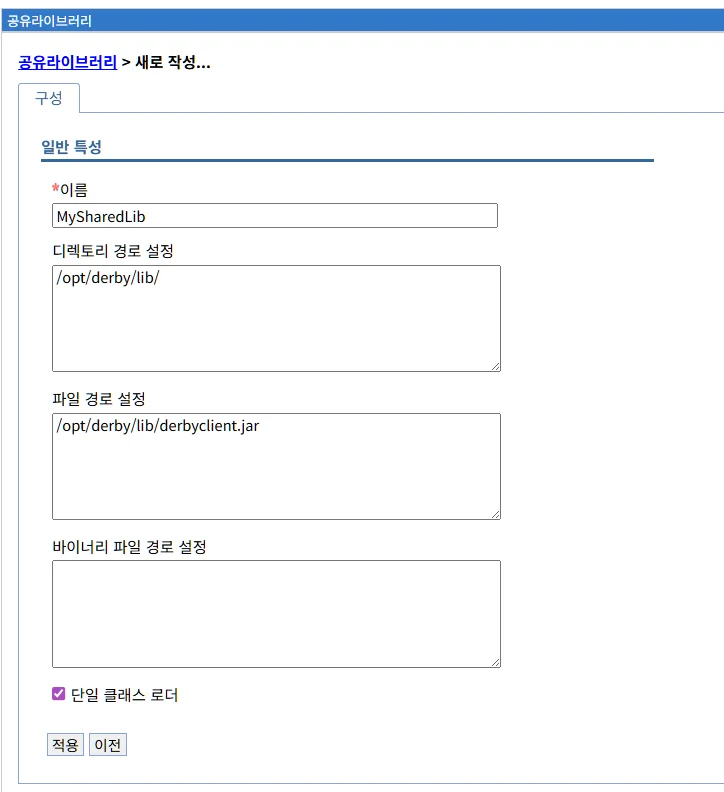

# 공유 라이브러리 관리

## 개요

공유 라이브러리(Shared Library)는 여러 애플리케이션이 공통으로 사용하는 JAR 파일, 클래스, 리소스를 관리하는 메커니즘입니다.

**주요 역할:**
- 공통 라이브러리 중앙 관리
- 애플리케이션 간 코드 재사용
- 라이브러리 버전 통합 관리
- 애플리케이션 크기 감소
- 메모리 사용 최적화

**Liberty 구현:**
LibriX의 공유 라이브러리 관리는 Open Liberty의 `<library>` 요소를 기반으로 구현되며, WebSphere Application Server의 공유 라이브러리와 유사한 개념이지만 더 간결하고 유연한 구조를 제공합니다.

**공유 라이브러리의 필요성:**

**시나리오 1: 공통 유틸리티**
```
상황:
- 10개의 애플리케이션이 모두 Apache Commons 라이브러리 사용
- 각 WAR 파일에 포함 시 중복

해결:
- 공유 라이브러리로 한 번만 배포
- 모든 애플리케이션이 참조
- 디스크 공간 및 메모리 절약
```

**시나리오 2: 데이터베이스 드라이버**
```
상황:
- 여러 애플리케이션이 같은 MySQL 드라이버 필요
- 드라이버 버전 업데이트 시 모든 애플리케이션 재배포 필요

해결:
- MySQL 드라이버를 공유 라이브러리로 관리
- 버전 업데이트 시 공유 라이브러리만 변경
- 애플리케이션 재배포 불필요 (서버 재시작만)
```

**시나리오 3: 사내 공통 모듈**
```
상황:
- 회사의 공통 인증, 로깅, 유틸리티 모듈
- 여러 프로젝트에서 사용

해결:
- 사내 공통 모듈을 공유 라이브러리로 배포
- 일관된 버전 관리
- 중앙 집중식 업데이트
```

---

## 공유 라이브러리 메인 화면

### 화면 구성


공유 라이브러리 메인 화면은 다음과 같이 구성됩니다:

#### 상단 영역

**페이지 제목:**
```
공유라이브러리
```

#### 관리 탭

화면 상단에 두 개의 탭이 있습니다:

**1. 생성 탭**
- 새로운 공유 라이브러리를 생성합니다
- 클릭 시 공유 라이브러리 생성 화면으로 이동합니다

**2. 삭제 탭**
- 선택한 공유 라이브러리를 삭제합니다
- 하나 이상의 공유 라이브러리를 선택한 후 사용 가능합니다
- 삭제 전 확인 대화상자가 표시됩니다

**주의사항:**
- 애플리케이션이 참조 중인 공유 라이브러리를 삭제하면 오류 발생
- 데이터소스나 기능 설정에서 사용 중인 라이브러리 삭제 시 문제 발생

#### 공유 라이브러리 목록 테이블

목록 테이블은 다음 컬럼으로 구성됩니다:

| 컬럼 | 설명 |
|------|------|
| **선택** | 체크박스를 통해 공유 라이브러리 선택 |
| **이름** | 공유 라이브러리의 고유 이름 (클릭 시 상세 화면으로 이동) |

**현재 화면 상태:**

```
총계 0

[선택]  [이름 ↕]

없음

총계 0
```

현재 화면에는 등록된 공유 라이브러리가 없습니다. (총계 0)

#### 목록 정렬

**이름 컬럼 정렬:**
- 이름 컬럼 헤더의 화살표(↕)를 클릭하면 정렬됩니다
- 오름차순/내림차순 토글

#### 목록 하단

```
총계 0
```

등록된 공유 라이브러리의 총 개수를 표시합니다.

---

## 공유 라이브러리 개념

### 공유 라이브러리란?

공유 라이브러리는 하나 이상의 애플리케이션이 공통으로 사용할 수 있는 JAR 파일, 클래스, 리소스의 모음입니다.

**구성 요소:**

```
공유 라이브러리
├── JAR 파일
│   ├── commons-lang3-3.12.0.jar
│   ├── commons-io-2.11.0.jar
│   └── log4j-api-2.17.1.jar
├── 클래스 파일
│   └── com/company/utils/*.class
└── 리소스 파일
    ├── config.properties
    └── messages.properties
```

**참조 구조:**

```
Liberty 서버
├── 공유 라이브러리 1 (MySQL 드라이버)
│   └── mysql-connector-java-8.0.28.jar
├── 공유 라이브러리 2 (Apache Commons)
│   ├── commons-lang3-3.12.0.jar
│   └── commons-io-2.11.0.jar
└── 애플리케이션들
    ├── App1 → 공유 라이브러리 1, 2 참조
    ├── App2 → 공유 라이브러리 1 참조
    └── App3 → 공유 라이브러리 2 참조
```

### 공유 라이브러리 vs 애플리케이션 내장

**애플리케이션 내장 (전통적 방식):**

```
myapp1.war
├── WEB-INF/
│   └── lib/
│       ├── mysql-connector-java-8.0.28.jar (10MB)
│       ├── commons-lang3-3.12.0.jar (500KB)
│       └── log4j-api-2.17.1.jar (300KB)

myapp2.war
├── WEB-INF/
│   └── lib/
│       ├── mysql-connector-java-8.0.28.jar (10MB) ← 중복
│       ├── commons-lang3-3.12.0.jar (500KB) ← 중복
│       └── log4j-api-2.17.1.jar (300KB) ← 중복

총 크기: 21.6MB (중복 포함)
메모리: 각 애플리케이션이 별도로 로드
```

**공유 라이브러리 사용:**

```
공유 라이브러리 (한 번만 배포)
└── lib/
    ├── mysql-connector-java-8.0.28.jar (10MB)
    ├── commons-lang3-3.12.0.jar (500KB)
    └── log4j-api-2.17.1.jar (300KB)

myapp1.war (라이브러리 참조만)
└── WEB-INF/lib/ (비어있음 또는 앱 전용 라이브러리만)

myapp2.war (라이브러리 참조만)
└── WEB-INF/lib/ (비어있음 또는 앱 전용 라이브러리만)

총 크기: 10.8MB (중복 제거)
메모리: 공유 라이브러리 한 번만 로드
```

**비교:**

| 항목 | 애플리케이션 내장 | 공유 라이브러리 |
|------|-----------------|----------------|
| **배포 크기** | 큼 (중복) | 작음 (공유) |
| **메모리 사용** | 많음 (각각 로드) | 적음 (한 번만 로드) |
| **업데이트** | 모든 앱 재배포 | 라이브러리만 업데이트 |
| **버전 관리** | 앱마다 다를 수 있음 | 통일된 버전 |
| **격리** | 높음 (독립) | 낮음 (공유) |

### 클래스로더 계층

Liberty의 클래스로더 계층 구조:

```
Bootstrap ClassLoader (JDK 클래스)
    ↓
System ClassLoader (Liberty 런타임)
    ↓
Common ClassLoader (공유 라이브러리)
    ↓
Application ClassLoader (애플리케이션 클래스)
```

**클래스 로딩 순서:**

```
1. 애플리케이션이 클래스 요청
   예: com.mysql.cj.jdbc.Driver

2. 애플리케이션 클래스로더 확인
   → 없음

3. 공유 라이브러리 클래스로더 확인
   → mysql-connector-java-8.0.28.jar에서 발견!

4. 클래스 로드 및 반환
```

**클래스로더 설정:**

Liberty는 두 가지 클래스로더 모드를 지원합니다:

**1. Parent First (부모 우선) - 기본값**
```
클래스 검색 순서:
1. 공유 라이브러리
2. 애플리케이션

장점: 일관된 라이브러리 버전
단점: 애플리케이션의 라이브러리 재정의 불가
```

**2. Parent Last (부모 나중)**
```
클래스 검색 순서:
1. 애플리케이션
2. 공유 라이브러리

장점: 애플리케이션이 라이브러리 버전 제어 가능
단점: 버전 충돌 가능성
```

---

## 공유 라이브러리 사용 사례

### 사례 1: 데이터베이스 드라이버

**시나리오:**
여러 애플리케이션이 MySQL 데이터베이스 사용

**공유 라이브러리 생성:**
```
이름: MySQLDriverLib
파일: 
- mysql-connector-java-8.0.28.jar
```

**server.xml 구성:**
```xml
<server>
    <!-- 공유 라이브러리 정의 -->
    <library id="MySQLDriverLib">
        <fileset dir="${shared.resource.dir}/jdbc/mysql" 
                 includes="*.jar"/>
    </library>
    
    <!-- JDBC 드라이버에서 참조 -->
    <jdbcDriver id="MySQLDriver" 
                libraryRef="MySQLDriverLib"/>
    
    <!-- 데이터소스에서 사용 -->
    <dataSource id="MyDataSource" 
                jndiName="jdbc/mydb"
                jdbcDriverRef="MySQLDriver">
        <properties serverName="mysql.company.com"
                    portNumber="3306"
                    databaseName="mydb"/>
    </dataSource>
</server>
```

**결과:**
- 모든 애플리케이션이 같은 MySQL 드라이버 사용
- 드라이버 업데이트 시 라이브러리만 변경

### 사례 2: Apache Commons 라이브러리

**시나리오:**
대부분의 애플리케이션이 Apache Commons 유틸리티 사용

**공유 라이브러리 생성:**
```
이름: ApacheCommonsLib
파일:
- commons-lang3-3.12.0.jar
- commons-io-2.11.0.jar
- commons-collections4-4.4.jar
- commons-codec-1.15.jar
```

**server.xml 구성:**
```xml
<server>
    <library id="ApacheCommonsLib">
        <fileset dir="${shared.resource.dir}/commons" 
                 includes="*.jar"/>
    </library>
    
    <!-- 애플리케이션에서 참조 -->
    <application location="myapp1.war">
        <classloader commonLibraryRef="ApacheCommonsLib"/>
    </application>
    
    <application location="myapp2.war">
        <classloader commonLibraryRef="ApacheCommonsLib"/>
    </application>
</server>
```

**결과:**
- 모든 애플리케이션이 같은 Commons 버전 사용
- 메모리 효율 향상

### 사례 3: 사내 공통 모듈

**시나리오:**
회사의 공통 인증, 로깅, 유틸리티 모듈

**공유 라이브러리 생성:**
```
이름: CompanyCommonLib
파일:
- company-auth-1.0.0.jar (인증 모듈)
- company-logging-1.0.0.jar (로깅 모듈)
- company-utils-1.0.0.jar (유틸리티)
```

**server.xml 구성:**
```xml
<server>
    <library id="CompanyCommonLib">
        <fileset dir="${shared.resource.dir}/company" 
                 includes="company-*.jar"/>
    </library>
    
    <application location="hr-app.war">
        <classloader commonLibraryRef="CompanyCommonLib"/>
    </application>
    
    <application location="erp-app.war">
        <classloader commonLibraryRef="CompanyCommonLib"/>
    </application>
</server>
```

**결과:**
- 일관된 인증 및 로깅
- 중앙 집중식 모듈 관리

### 사례 4: 로깅 프레임워크

**시나리오:**
모든 애플리케이션이 Log4j2 사용

**공유 라이브러리 생성:**
```
이름: Log4j2Lib
파일:
- log4j-api-2.17.1.jar
- log4j-core-2.17.1.jar
- log4j-slf4j-impl-2.17.1.jar
```

**server.xml 구성:**
```xml
<server>
    <library id="Log4j2Lib">
        <fileset dir="${shared.resource.dir}/logging" 
                 includes="log4j-*.jar"/>
    </library>
    
    <!-- 모든 애플리케이션에 적용 -->
    <application location="*.war">
        <classloader commonLibraryRef="Log4j2Lib"/>
    </application>
</server>
```

**결과:**
- 통일된 로깅 프레임워크
- 로그 설정 중앙 관리

### 사례 5: REST API 라이브러리

**시나리오:**
여러 애플리케이션이 REST API 클라이언트 라이브러리 사용

**공유 라이브러리 생성:**
```
이름: RestClientLib
파일:
- jackson-databind-2.13.0.jar
- jackson-core-2.13.0.jar
- jackson-annotations-2.13.0.jar
- httpclient-4.5.13.jar
```

**server.xml 구성:**
```xml
<server>
    <library id="RestClientLib">
        <fileset dir="${shared.resource.dir}/rest" 
                 includes="*.jar"/>
    </library>
    
    <application location="api-consumer-1.war">
        <classloader commonLibraryRef="RestClientLib"/>
    </application>
    
    <application location="api-consumer-2.war">
        <classloader commonLibraryRef="RestClientLib"/>
    </application>
</server>
```

**결과:**
- 일관된 REST 클라이언트 구현
- JSON 직렬화/역직렬화 통일

---

## 공유 라이브러리 생성

### 공유 라이브러리 생성 화면



"생성" 탭을 클릭하면 새로운 공유 라이브러리를 생성하는 화면이 나타납니다.

**화면 경로:**
```
공유라이브러리 > 새로 작성...
```

**화면 구성:**

```
일반 특성

*이름
[MySharedLib                    ]

디렉토리 경로 설정
[/opt/derby/lib/                ]

파일 경로 설정
[/opt/derby/lib/derbyclient.jar ]

바이너리 파일 경로 설정
[                               ]

☑ 단일 클래스 로더

[적용]  [이전]
```

### 입력 필드

공유 라이브러리 생성 화면은 여러 입력 필드로 구성됩니다:

#### 1. 이름 *필수

```
*이름
[MySharedLib]
```

공유 라이브러리의 고유 식별자를 입력합니다.

**입력 규칙:**
- 필수 입력 항목
- 영문자, 숫자, 언더스코어(_), 하이픈(-) 사용 가능
- 대소문자 구분
- 서버 내에서 고유해야 함
- 공백 및 특수문자 사용 불가

**명명 규칙:**

**패턴 1: 라이브러리 이름 기반 (권장)**
```
좋은 예:
- MySQLDriverLib
- ApacheCommonsLib
- Log4j2Lib
- JacksonLib
- CompanyCommonLib
```

**패턴 2: 용도 기반**
```
좋은 예:
- DatabaseLib
- UtilityLib
- LoggingLib
- RestClientLib
- SecurityLib
```

**패턴 3: 프로젝트/모듈 기반**
```
좋은 예:
- HRSystemLib
- ERPCommonLib
- PayrollUtilsLib
- OrderServiceLib
```

**나쁜 예:**
```
✗ my library           (공백 사용)
✗ lib@common           (특수문자 사용)
✗ 123Lib               (숫자로 시작)
✗ sharedlib            (너무 일반적)
```

**명명 가이드:**

| 용도 | 명명 패턴 | 예시 |
|------|----------|------|
| **데이터베이스** | DB명DriverLib | `MySQLDriverLib`, `OracleDriverLib` |
| **프레임워크** | 프레임워크명Lib | `SpringLib`, `HibernateLib` |
| **유틸리티** | 기능Lib | `CommonsLib`, `GuavaLib` |
| **로깅** | Logging관련Lib | `Log4j2Lib`, `LogbackLib` |
| **JSON/XML** | 포맷Lib | `JacksonLib`, `GsonLib` |
| **사내 모듈** | Company기능Lib | `CompanyAuthLib`, `CompanyUtilsLib` |

#### 2. 디렉토리 경로 설정

```
디렉토리 경로 설정
[/opt/derby/lib/]
```

JAR 파일이 있는 디렉토리 경로를 지정합니다.

**입력 형식:**

**절대 경로:**
```
/opt/derby/lib/
/usr/local/mysql/lib/
/home/userid/libs/
```

**Liberty 변수 사용:**
```
${shared.resource.dir}/jdbc/mysql
${server.config.dir}/libs
${wlp.user.dir}/shared/libs
/opt/myapp/${ENVIRONMENT}/libs
```

**와일드카드 사용:**
```
지원하지 않음 - 정확한 디렉토리 경로만 입력
```

**사용 시나리오:**

**시나리오 1: 디렉토리의 모든 JAR 파일 포함**
```
경로: /opt/mysql/lib/

디렉토리 내용:
- mysql-connector-java-8.0.28.jar
- protobuf-java-3.19.4.jar

→ 두 파일 모두 공유 라이브러리에 포함
```

**시나리오 2: 여러 디렉토리 지정**
```
디렉토리 1: /opt/commons/
디렉토리 2: /opt/logging/

→ 두 디렉토리의 모든 JAR 파일 포함
```

**주의사항:**
- 디렉토리가 존재하지 않으면 경고 발생
- 디렉토리에 JAR 파일이 없으면 빈 라이브러리
- 재귀적 탐색 안 됨 (하위 디렉토리 미포함)

**server.xml 생성 예시:**
```xml
<library id="MySharedLib">
    <fileset dir="/opt/derby/lib/" includes="*.jar"/>
</library>
```

#### 3. 파일 경로 설정

```
파일 경로 설정
[/opt/derby/lib/derbyclient.jar]
```

특정 JAR 파일의 경로를 직접 지정합니다.

**입력 형식:**

**절대 경로:**
```
/opt/derby/lib/derbyclient.jar
/usr/share/java/mysql-connector-java.jar
/home/userid/libs/mylib-1.0.0.jar
```

**Liberty 변수 사용:**
```
${shared.resource.dir}/jdbc/mysql/mysql-connector-java-8.0.28.jar
${server.config.dir}/libs/custom-auth-1.0.0.jar
```

**여러 파일 지정:**
```
파일 1: /opt/derby/lib/derbyclient.jar
파일 2: /opt/derby/lib/derbytools.jar
파일 3: /opt/derby/lib/derby.jar

→ 세 파일 모두 공유 라이브러리에 포함
```

**사용 시나리오:**

**시나리오 1: 단일 JAR 파일**
```
파일: /opt/mysql/mysql-connector-java-8.0.28.jar

→ 해당 파일만 포함
```

**시나리오 2: 특정 파일만 선택**
```
디렉토리에 10개 JAR 파일이 있지만
필요한 파일만 선택:
- commons-lang3-3.12.0.jar
- commons-io-2.11.0.jar

→ 나머지 8개는 제외
```

**디렉토리 vs 파일 경로:**

| 항목 | 디렉토리 경로 | 파일 경로 |
|------|--------------|----------|
| **포함 범위** | 디렉토리의 모든 JAR | 지정한 파일만 |
| **패턴 매칭** | includes/excludes 사용 | 정확한 파일명 |
| **유연성** | 높음 (파일 추가 시 자동) | 낮음 (명시적 지정) |
| **제어** | 낮음 (모든 파일) | 높음 (선택적) |
| **사용 예** | 버전 업그레이드 자동화 | 정확한 파일 제어 |

**server.xml 생성 예시:**
```xml
<library id="MySharedLib">
    <file name="/opt/derby/lib/derbyclient.jar"/>
</library>
```

**디렉토리 + 파일 조합:**
```xml
<library id="MySharedLib">
    <!-- 디렉토리의 모든 JAR -->
    <fileset dir="/opt/commons/" includes="*.jar"/>
    
    <!-- 추가로 특정 파일 포함 -->
    <file name="/opt/custom/mylib-1.0.0.jar"/>
    <file name="/opt/custom/yourlib-2.0.0.jar"/>
</library>
```

#### 4. 바이너리 파일 경로 설정

```
바이너리 파일 경로 설정
[                               ]
```

네이티브 라이브러리(.so, .dll, .dylib)가 있는 디렉토리 경로를 지정합니다.

**입력 형식:**

**절대 경로:**
```
/opt/oracle/instantclient_19_8
/usr/local/lib
/home/userid/native-libs
```

**Liberty 변수 사용:**
```
${shared.resource.dir}/native
${server.config.dir}/native-libs
```

**사용 시나리오:**

**시나리오 1: Oracle JDBC 드라이버**
```
JAR 파일: ojdbc8.jar
네이티브 라이브러리: libocijdbc19.so

바이너리 경로: /opt/oracle/instantclient_19_8
→ Oracle Instant Client의 네이티브 라이브러리 위치
```

**시나리오 2: JNI 라이브러리**
```
JAR 파일: custom-jni-1.0.0.jar
네이티브 라이브러리: libcustomjni.so

바이너리 경로: /usr/local/lib/customjni
→ JNI 네이티브 라이브러리 위치
```

**네이티브 라이브러리 예시:**

| 플랫폼 | 파일 확장자 | 예시 |
|--------|------------|------|
| **Linux** | .so | `libmysql.so`, `liboracle.so` |
| **Windows** | .dll | `mysql.dll`, `oracle.dll` |
| **macOS** | .dylib | `libmysql.dylib` |

**주의사항:**
- 대부분의 순수 Java 라이브러리는 이 설정 불필요
- 네이티브 코드를 사용하는 라이브러리만 필요
- 플랫폼별로 다른 경로 필요할 수 있음

**server.xml 생성 예시:**
```xml
<library id="OracleDriverLib">
    <fileset dir="${shared.resource.dir}/jdbc/oracle" 
             includes="*.jar"/>
    <nativeLibrary dir="/opt/oracle/instantclient_19_8"/>
</library>
```

**네이티브 라이브러리가 필요한 경우:**

```
필요함:
- Oracle JDBC 드라이버 (OCI 모드)
- IBM DB2 드라이버 (네이티브 모드)
- 사용자 정의 JNI 라이브러리
- 하드웨어 가속 라이브러리

불필요함:
- 순수 Java JDBC 드라이버 (MySQL, PostgreSQL 등)
- Apache Commons, Jackson 등 유틸리티
- Spring, Hibernate 등 프레임워크
```

#### 5. 단일 클래스 로더

```
☑ 단일 클래스 로더
```

공유 라이브러리를 단일 클래스로더로 로드할지 여부를 설정합니다.

**옵션 설명:**

**체크됨 (true) - 권장**
```
단일 클래스로더 사용:
- 공유 라이브러리의 모든 JAR을 하나의 클래스로더로 로드
- 라이브러리 간 클래스 공유 가능
- 클래스 충돌 최소화
```

**체크 해제 (false)**
```
개별 클래스로더 사용:
- 각 JAR 파일마다 별도의 클래스로더 생성
- 라이브러리 간 격리
- 클래스로더 오버헤드 증가
```

**단일 클래스로더의 장점:**

**1. 라이브러리 간 의존성 해결**
```
공유 라이브러리 구성:
- commons-lang3-3.12.0.jar
- commons-io-2.11.0.jar (commons-lang에 의존)

단일 클래스로더 = true:
→ commons-io가 commons-lang의 클래스를 찾을 수 있음

단일 클래스로더 = false:
→ commons-io가 commons-lang의 클래스를 못 찾음 (오류)
```

**2. 메모리 효율성**
```
10개의 JAR 파일:

단일 클래스로더:
- 클래스로더 1개
- 메모리 사용: 낮음

개별 클래스로더:
- 클래스로더 10개
- 메모리 사용: 높음
```

**3. 클래스 가시성**
```
라이브러리 A: util.StringUtils
라이브러리 B: util.DateUtils (StringUtils 사용)

단일 클래스로더:
→ B가 A의 클래스를 볼 수 있음

개별 클래스로더:
→ B가 A의 클래스를 볼 수 없음
```

**언제 체크 해제할까?**

```
드문 경우에만:
1. 라이브러리 간 격리가 필수인 경우
2. 같은 클래스명이 다른 JAR에 있는 경우
3. 보안상 격리가 필요한 경우

일반적으로: 항상 체크 (권장)
```

**server.xml 생성 예시:**

**단일 클래스로더 = true (기본값, 권장):**
```xml
<library id="MySharedLib">
    <fileset dir="/opt/commons/" includes="*.jar"/>
</library>
```

**단일 클래스로더 = false:**
```xml
<library id="MySharedLib" useCommonClassLoader="false">
    <fileset dir="/opt/commons/" includes="*.jar"/>
</library>
```

**클래스로더 계층 비교:**

**단일 클래스로더 (true):**
```
애플리케이션 클래스로더
    ↓
공유 라이브러리 클래스로더 (하나)
    ├── commons-lang3-3.12.0.jar
    ├── commons-io-2.11.0.jar
    └── commons-collections4-4.4.jar
```

**개별 클래스로더 (false):**
```
애플리케이션 클래스로더
    ↓
공유 라이브러리 클래스로더들 (각각)
    ├── 클래스로더 1
    │   └── commons-lang3-3.12.0.jar
    ├── 클래스로더 2
    │   └── commons-io-2.11.0.jar
    └── 클래스로더 3
        └── commons-collections4-4.4.jar
```

### 경로 설정 전략

#### 전략 1: 디렉토리 기반 (권장)

**사용 시기:**
- 관련된 여러 JAR 파일을 함께 관리
- 라이브러리 업데이트가 빈번한 경우
- 버전 관리가 자동화된 경우

**예시:**
```
디렉토리 경로: ${shared.resource.dir}/jdbc/mysql

디렉토리 구조:
${shared.resource.dir}/jdbc/mysql/
├── mysql-connector-java-8.0.28.jar
└── protobuf-java-3.19.4.jar

장점:
- JAR 추가/제거 시 설정 변경 불필요
- 버전 업그레이드 간편

server.xml:
<library id="MySQLDriverLib">
    <fileset dir="${shared.resource.dir}/jdbc/mysql" 
             includes="*.jar"/>
</library>
```

#### 전략 2: 파일 기반

**사용 시기:**
- 특정 파일만 정확히 제어
- 버전을 고정해야 하는 경우
- 디렉토리에 불필요한 JAR이 있는 경우

**예시:**
```
파일 경로: 
- ${shared.resource.dir}/commons/commons-lang3-3.12.0.jar
- ${shared.resource.dir}/commons/commons-io-2.11.0.jar

장점:
- 정확한 파일 제어
- 의도하지 않은 파일 포함 방지

server.xml:
<library id="CommonsLib">
    <file name="${shared.resource.dir}/commons/commons-lang3-3.12.0.jar"/>
    <file name="${shared.resource.dir}/commons/commons-io-2.11.0.jar"/>
</library>
```

#### 전략 3: 혼합 방식

**사용 시기:**
- 디렉토리 + 개별 파일 조합
- 복잡한 의존성 구조

**예시:**
```
디렉토리: ${shared.resource.dir}/spring (Spring 프레임워크)
파일: ${shared.resource.dir}/custom/company-utils-1.0.0.jar

server.xml:
<library id="AppFrameworkLib">
    <fileset dir="${shared.resource.dir}/spring" includes="*.jar"/>
    <file name="${shared.resource.dir}/custom/company-utils-1.0.0.jar"/>
</library>
```

### 생성 예시

#### 예시 1: MySQL 드라이버 라이브러리

**시나리오:**
MySQL 데이터베이스 연결용 JDBC 드라이버

**입력:**
```
이름: MySQLDriverLib
디렉토리 경로: ${shared.resource.dir}/jdbc/mysql
파일 경로: (비움)
바이너리 경로: (비움)
☑ 단일 클래스 로더
```

**디렉토리 구조:**
```
${wlp.user.dir}/shared/resources/jdbc/mysql/
├── mysql-connector-java-8.0.28.jar
└── protobuf-java-3.19.4.jar
```

**결과 (server.xml):**
```xml
<library id="MySQLDriverLib">
    <fileset dir="${shared.resource.dir}/jdbc/mysql" 
             includes="*.jar"/>
</library>

<!-- JDBC 드라이버에서 사용 -->
<jdbcDriver id="MySQLDriver" 
            libraryRef="MySQLDriverLib"/>
```

#### 예시 2: Apache Commons 유틸리티

**시나리오:**
여러 애플리케이션에서 사용하는 Apache Commons 라이브러리

**입력:**
```
이름: ApacheCommonsLib
디렉토리 경로: ${shared.resource.dir}/commons
파일 경로: (비움)
바이너리 경로: (비움)
☑ 단일 클래스 로더
```

**디렉토리 구조:**
```
${wlp.user.dir}/shared/resources/commons/
├── commons-lang3-3.12.0.jar
├── commons-io-2.11.0.jar
├── commons-collections4-4.4.jar
└── commons-codec-1.15.jar
```

**결과 (server.xml):**
```xml
<library id="ApacheCommonsLib">
    <fileset dir="${shared.resource.dir}/commons" 
             includes="*.jar"/>
</library>

<!-- 애플리케이션에서 사용 -->
<application location="myapp.war">
    <classloader commonLibraryRef="ApacheCommonsLib"/>
</application>
```

#### 예시 3: 특정 버전의 Jackson 라이브러리

**시나리오:**
정확한 버전 제어가 필요한 JSON 라이브러리

**입력:**
```
이름: JacksonLib
디렉토리 경로: (비움)
파일 경로:
- ${shared.resource.dir}/json/jackson-databind-2.13.0.jar
- ${shared.resource.dir}/json/jackson-core-2.13.0.jar
- ${shared.resource.dir}/json/jackson-annotations-2.13.0.jar
바이너리 경로: (비움)
☑ 단일 클래스 로더
```

**결과 (server.xml):**
```xml
<library id="JacksonLib">
    <file name="${shared.resource.dir}/json/jackson-databind-2.13.0.jar"/>
    <file name="${shared.resource.dir}/json/jackson-core-2.13.0.jar"/>
    <file name="${shared.resource.dir}/json/jackson-annotations-2.13.0.jar"/>
</library>
```

#### 예시 4: Oracle 드라이버 (네이티브 포함)

**시나리오:**
Oracle JDBC 드라이버와 Instant Client

**입력:**
```
이름: OracleDriverLib
디렉토리 경로: ${shared.resource.dir}/jdbc/oracle
파일 경로: (비움)
바이너리 경로: /opt/oracle/instantclient_19_8
☑ 단일 클래스 로더
```

**디렉토리 구조:**
```
${wlp.user.dir}/shared/resources/jdbc/oracle/
└── ojdbc8.jar

/opt/oracle/instantclient_19_8/
├── libocijdbc19.so
├── libclntsh.so.19.1
└── libnnz19.so
```

**결과 (server.xml):**
```xml
<library id="OracleDriverLib">
    <fileset dir="${shared.resource.dir}/jdbc/oracle" 
             includes="*.jar"/>
    <nativeLibrary dir="/opt/oracle/instantclient_19_8"/>
</library>

<jdbcDriver id="OracleDriver" 
            libraryRef="OracleDriverLib"/>
```

#### 예시 5: 사내 공통 모듈

**시나리오:**
회사의 여러 공통 모듈을 포함

**입력:**
```
이름: CompanyCommonLib
디렉토리 경로: ${shared.resource.dir}/company
파일 경로: (비움)
바이너리 경로: (비움)
☑ 단일 클래스 로더
```

**디렉토리 구조:**
```
${wlp.user.dir}/shared/resources/company/
├── company-auth-1.0.0.jar
├── company-logging-1.0.0.jar
├── company-utils-1.0.0.jar
└── company-security-1.0.0.jar
```

**결과 (server.xml):**
```xml
<library id="CompanyCommonLib">
    <fileset dir="${shared.resource.dir}/company" 
             includes="company-*.jar"/>
</library>

<!-- 모든 애플리케이션에 적용 -->
<application location="*.war">
    <classloader commonLibraryRef="CompanyCommonLib"/>
</application>
```

### 생성 시 주의사항

**1. 경로 존재 확인**

파일이나 디렉토리가 존재하는지 확인:

```bash
# 디렉토리 확인
ls -la ${wlp.user.dir}/shared/resources/jdbc/mysql/

# 파일 확인
ls -la ${wlp.user.dir}/shared/resources/jdbc/mysql/mysql-connector-java-8.0.28.jar
```

**경로가 없으면:**
```
경고: 지정한 경로를 찾을 수 없습니다.
공유 라이브러리가 빈 상태로 생성됩니다.
```

**2. 권한 확인**

Liberty 프로세스가 파일을 읽을 수 있는지 확인:

```bash
# 소유자 확인
ls -l ${wlp.user.dir}/shared/resources/jdbc/mysql/

# 필요 시 권한 변경
chmod 644 ${wlp.user.dir}/shared/resources/jdbc/mysql/*.jar
chown liberty:liberty ${wlp.user.dir}/shared/resources/jdbc/mysql/*.jar
```

**3. JAR 파일 검증**

JAR 파일이 손상되지 않았는지 확인:

```bash
# JAR 파일 내용 확인
jar -tf mysql-connector-java-8.0.28.jar | head

# 매니페스트 확인
unzip -p mysql-connector-java-8.0.28.jar META-INF/MANIFEST.MF
```

**4. 의존성 확인**

라이브러리 간 의존성 파악:

```
예시: Jackson
- jackson-databind는 jackson-core에 의존
- jackson-databind는 jackson-annotations에 의존

→ 세 JAR 모두 포함해야 함
```

**5. 버전 충돌 방지**

같은 라이브러리의 여러 버전이 있는지 확인:

```
문제:
${shared.resource.dir}/commons/
├── commons-lang3-3.12.0.jar
└── commons-lang3-3.9.jar ← 충돌!

해결:
- 하나의 버전만 유지
- 필요 시 파일 경로로 정확히 지정
```

---

## 다음 단계

- 공유 라이브러리를 생성하려면 "생성" 탭을 클릭하여 생성 화면으로 이동하세요.
- 공유 라이브러리 상세 설정은 목록에서 이름을 클릭하세요.
- 애플리케이션에 공유 라이브러리를 매핑하려면 애플리케이션 설정 화면에서 지정하세요.

---

## 참고 자료

### Liberty 공식 문서
- [Library Configuration](https://openliberty.io/docs/latest/reference/config/library.html)
- [Fileset Configuration](https://openliberty.io/docs/latest/reference/config/fileset.html)
- [Classloader Configuration](https://openliberty.io/docs/latest/reference/config/classloader.html)
- [Application Configuration](https://openliberty.io/docs/latest/reference/config/application.html)

### WebSphere ND 문서
- [Shared Libraries](https://www.ibm.com/docs/en/was-nd/9.0.5?topic=libraries-shared)
- [Class Loader](https://www.ibm.com/docs/en/was-nd/9.0.5?topic=applications-class-loaders)

### 관련 LibriX 문서
- [JDBC 제공자 관리](../resource/jdbc-provider.md)
- [데이터소스 관리](../resource/datasource.md)
- [애플리케이션 설치](../application/application-install.md)
- [엔터프라이즈 애플리케이션 관리](../application/enterprise-application.md)

---

## 변경사항 저장 및 검토

공유 라이브러리를 생성하거나 수정한 후 "적용" 버튼을 클릭하면 저장 및 검토 프로세스가 시작됩니다.

저장/검토 프로세스는 이전 문서들(Liberty 변수, 가상호스트, JDBC 제공자, 데이터소스)과 동일한 패턴을 따릅니다.

### 저장 옵션

**옵션 1: 변경사항을 즉시 적용**
- 변경사항이 즉시 server.xml에 반영
- Liberty가 자동으로 구성을 재로드
- 공유 라이브러리를 즉시 사용 가능

**옵션 2: 변경사항을 저장하고 나중에 동기화**
- 변경사항이 LibriX 데이터베이스에 저장
- 나중에 수동으로 동기화하여 적용

---

## 공유 라이브러리 수정 및 삭제

### 공유 라이브러리 수정

목록에서 공유 라이브러리 이름을 클릭하면 상세/수정 화면으로 이동합니다.

**수정 가능 항목:**
- 디렉토리 경로
- 파일 경로
- 바이너리 파일 경로
- 단일 클래스 로더 옵션

**수정 불가 항목:**
- 이름 (생성 후 변경 불가)

### 공유 라이브러리 삭제

1. 목록에서 삭제할 공유 라이브러리 선택
2. "삭제" 탭 클릭
3. 삭제 확인 후 적용

**주의사항:**
- 애플리케이션이 참조 중인 라이브러리 삭제 시 오류
- 데이터소스나 기능에서 사용 중인 라이브러리 삭제 시 문제 발생
- 삭제된 라이브러리는 복구 불가

---

## Liberty server.xml 구성

공유 라이브러리는 server.xml 파일의 `<library>` 요소로 정의됩니다.

### 기본 구문

```xml
<library id="라이브러리ID">
    <fileset dir="디렉토리경로" includes="*.jar"/>
    <!-- 또는 -->
    <file name="파일경로"/>
    <!-- 네이티브 라이브러리 (선택) -->
    <nativeLibrary dir="네이티브경로"/>
</library>
```

### 구성 예시

#### 단순 공유 라이브러리

```xml
<server>
    <!-- MySQL 드라이버 -->
    <library id="MySQLDriverLib">
        <fileset dir="${shared.resource.dir}/jdbc/mysql" 
                 includes="*.jar"/>
    </library>
    
    <!-- JDBC 드라이버에서 사용 -->
    <jdbcDriver id="MySQLDriver" 
                libraryRef="MySQLDriverLib"/>
    
    <!-- 데이터소스에서 사용 -->
    <dataSource id="MyDataSource" 
                jdbcDriverRef="MySQLDriver">
        <properties serverName="mysql.company.com"
                    databaseName="mydb"/>
    </dataSource>
</server>
```

#### 여러 디렉토리 포함

```xml
<server>
    <library id="CommonsLib">
        <!-- 여러 디렉토리 -->
        <fileset dir="${shared.resource.dir}/commons" 
                 includes="*.jar"/>
        <fileset dir="${shared.resource.dir}/logging" 
                 includes="log4j-*.jar"/>
        
        <!-- 개별 파일 추가 -->
        <file name="${shared.resource.dir}/custom/mylib-1.0.0.jar"/>
    </library>
</server>
```

#### 패턴 매칭

```xml
<server>
    <library id="SpringLib">
        <!-- spring으로 시작하는 JAR만 -->
        <fileset dir="${shared.resource.dir}/spring" 
                 includes="spring-*.jar"/>
        
        <!-- commons로 시작하는 JAR 제외 -->
        <fileset dir="${shared.resource.dir}/libs" 
                 includes="*.jar"
                 excludes="commons-*.jar"/>
    </library>
</server>
```

#### 네이티브 라이브러리 포함

```xml
<server>
    <library id="OracleDriverLib">
        <fileset dir="${shared.resource.dir}/jdbc/oracle" 
                 includes="*.jar"/>
        <nativeLibrary dir="/opt/oracle/instantclient_19_8"/>
    </library>
</server>
```

#### 개별 클래스로더 사용

```xml
<server>
    <!-- 단일 클래스로더 = false -->
    <library id="IsolatedLib" useCommonClassLoader="false">
        <fileset dir="${shared.resource.dir}/isolated" 
                 includes="*.jar"/>
    </library>
</server>
```

### 애플리케이션에 공유 라이브러리 매핑

#### 방법 1: 개별 애플리케이션 매핑

```xml
<server>
    <library id="CommonsLib">
        <fileset dir="${shared.resource.dir}/commons" 
                 includes="*.jar"/>
    </library>
    
    <!-- 특정 애플리케이션만 -->
    <application location="myapp.war">
        <classloader commonLibraryRef="CommonsLib"/>
    </application>
</server>
```

#### 방법 2: 여러 라이브러리 매핑

```xml
<server>
    <library id="CommonsLib">
        <fileset dir="${shared.resource.dir}/commons" 
                 includes="*.jar"/>
    </library>
    
    <library id="LoggingLib">
        <fileset dir="${shared.resource.dir}/logging" 
                 includes="*.jar"/>
    </library>
    
    <application location="myapp.war">
        <classloader commonLibraryRef="CommonsLib,LoggingLib"/>
    </application>
</server>
```

#### 방법 3: 모든 애플리케이션에 적용

```xml
<server>
    <library id="GlobalLib">
        <fileset dir="${shared.resource.dir}/global" 
                 includes="*.jar"/>
    </library>
    
    <!-- 와일드카드로 모든 WAR -->
    <application location="*.war">
        <classloader commonLibraryRef="GlobalLib"/>
    </application>
</server>
```

#### 방법 4: 클래스로더 위임 설정

```xml
<server>
    <library id="CustomLib">
        <fileset dir="${shared.resource.dir}/custom" 
                 includes="*.jar"/>
    </library>
    
    <application location="myapp.war">
        <!-- Parent Last: 애플리케이션 우선 -->
        <classloader delegation="parentLast"
                     commonLibraryRef="CustomLib"/>
    </application>
</server>
```

---

## 문제 해결

### 일반적인 문제

#### 문제 1: ClassNotFoundException

**증상:**
```
java.lang.ClassNotFoundException: com.mysql.cj.jdbc.Driver
```

**원인:**
1. 공유 라이브러리가 애플리케이션에 매핑되지 않음
2. JAR 파일이 경로에 없음
3. JAR 파일이 손상됨

**해결 방법:**

**1. 매핑 확인:**
```xml
<application location="myapp.war">
    <classloader commonLibraryRef="MySQLDriverLib"/>
</application>
```

**2. 파일 존재 확인:**
```bash
ls -la ${wlp.user.dir}/shared/resources/jdbc/mysql/
```

**3. JAR 파일 검증:**
```bash
jar -tf mysql-connector-java-8.0.28.jar | grep "com/mysql/cj/jdbc/Driver"
```

#### 문제 2: NoClassDefFoundError

**증상:**
```
java.lang.NoClassDefFoundError: org/apache/commons/lang3/StringUtils
```

**원인:**
의존하는 다른 클래스가 없음

**해결 방법:**

의존 라이브러리 추가:
```xml
<library id="CommonsLib">
    <fileset dir="${shared.resource.dir}/commons" 
             includes="*.jar"/>
    <!-- commons-lang3도 포함되어 있는지 확인 -->
</library>
```

#### 문제 3: 버전 충돌

**증상:**
```
java.lang.LinkageError: loader constraint violation
```

**원인:**
같은 클래스의 여러 버전이 로드됨

**해결 방법:**

**1. 중복 확인:**
```bash
find ${wlp.user.dir} -name "commons-lang*.jar"
```

**2. 버전 통일:**
```
공유 라이브러리: commons-lang3-3.12.0.jar (최신)
애플리케이션: commons-lang3-3.9.jar 제거
```

**3. 클래스로더 설정:**
```xml
<!-- Parent First로 공유 라이브러리 우선 -->
<application location="myapp.war">
    <classloader delegation="parentFirst"
                 commonLibraryRef="CommonsLib"/>
</application>
```

#### 문제 4: 네이티브 라이브러리 로드 실패

**증상:**
```
java.lang.UnsatisfiedLinkError: no ocijdbc19 in java.library.path
```

**원인:**
네이티브 라이브러리 경로가 잘못됨

**해결 방법:**

**1. 경로 확인:**
```bash
ls -la /opt/oracle/instantclient_19_8/
```

**2. server.xml 설정:**
```xml
<library id="OracleDriverLib">
    <fileset dir="${shared.resource.dir}/jdbc/oracle" 
             includes="*.jar"/>
    <nativeLibrary dir="/opt/oracle/instantclient_19_8"/>
</library>
```

**3. LD_LIBRARY_PATH 설정 (Linux):**
```bash
export LD_LIBRARY_PATH=/opt/oracle/instantclient_19_8:$LD_LIBRARY_PATH
```

---

## 모범 사례

### 1. 디렉토리 구조 표준화

```
${wlp.user.dir}/shared/resources/
├── jdbc/
│   ├── mysql/
│   │   └── mysql-connector-java-8.0.28.jar
│   ├── oracle/
│   │   └── ojdbc8.jar
│   └── postgresql/
│       └── postgresql-42.3.1.jar
├── commons/
│   ├── commons-lang3-3.12.0.jar
│   ├── commons-io-2.11.0.jar
│   └── commons-collections4-4.4.jar
├── logging/
│   ├── log4j-api-2.17.1.jar
│   └── log4j-core-2.17.1.jar
└── company/
    ├── company-auth-1.0.0.jar
    └── company-utils-1.0.0.jar
```

### 2. 명명 규칙 일관성

```
좋은 예:
- MySQLDriverLib
- ApacheCommonsLib
- Log4j2Lib

나쁜 예:
- lib1
- mylib
- sharedLib
```

### 3. 버전 관리

```
디렉토리 이름에 버전 포함 (선택):
${shared.resource.dir}/jackson/2.13.0/
├── jackson-databind-2.13.0.jar
├── jackson-core-2.13.0.jar
└── jackson-annotations-2.13.0.jar

또는 파일명으로 버전 관리:
${shared.resource.dir}/jackson/
├── jackson-databind-2.13.0.jar
├── jackson-core-2.13.0.jar
└── jackson-annotations-2.13.0.jar
```

### 4. 의존성 문서화

```markdown
# CommonsLib 의존성

## 포함 라이브러리
- commons-lang3-3.12.0.jar
- commons-io-2.11.0.jar
- commons-collections4-4.4.jar

## 의존성
- commons-io는 commons-lang3에 의존
- 모두 함께 배포 필요

## 사용 애플리케이션
- HR 시스템
- ERP 시스템
- 급여 시스템
```

### 5. 단일 클래스로더 사용

```xml
<!-- 권장: 단일 클래스로더 (기본값) -->
<library id="CommonsLib">
    <fileset dir="${shared.resource.dir}/commons" 
             includes="*.jar"/>
</library>

<!-- 특수한 경우만: 개별 클래스로더 -->
<library id="IsolatedLib" useCommonClassLoader="false">
    <fileset dir="${shared.resource.dir}/isolated" 
             includes="*.jar"/>
</library>
```

### 6. Liberty 변수 활용

```xml
<!-- 환경별 경로 -->
<variable name="LIB_ROOT" value="/opt/libs/${ENVIRONMENT}"/>

<library id="EnvLib">
    <fileset dir="${LIB_ROOT}/commons" includes="*.jar"/>
</library>
```

### 7. 정기적 검토

```
분기별 검토:
☐ 사용하지 않는 라이브러리 제거
☐ 라이브러리 버전 업데이트 확인
☐ 보안 취약점 점검
☐ 의존성 문서 업데이트
```

---

## WebSphere ND와의 비교

### 아키텍처 차이

**WebSphere ND:**
```
공유 라이브러리 관리:
- Deployment Manager에서 중앙 관리
- Cell/Node/Server 레벨에서 정의
- 복잡한 클래스로더 정책

위치:
환경 > 공유 라이브러리
```

**Liberty (LibriX):**
```
공유 라이브러리 관리:
- 각 서버의 server.xml에서 정의
- LibriX가 중앙에서 조율
- 간단한 클래스로더 설정

위치:
환경 > 공유라이브러리
```

### 구성 비교

**WebSphere ND:**
```
공유 라이브러리 구성:
- 이름
- 클래스 경로 (여러 경로)
- 네이티브 라이브러리 경로
- 격리된 클래스로더 정책
- 연관 모듈

클래스로더 정책:
- PARENT_FIRST (부모 우선)
- PARENT_LAST (부모 나중)
- 복잡한 위임 정책
```

**Liberty (LibriX):**
```
공유 라이브러리 구성:
- ID
- fileset (디렉토리)
- file (개별 파일)
- nativeLibrary (네이티브)
- useCommonClassLoader

클래스로더 설정:
- delegation: parentFirst (기본)
- delegation: parentLast
- 단순하고 명확한 정책
```

### 마이그레이션 가이드

**1단계: WAS 공유 라이브러리 목록 추출**

WebSphere Admin Console:
```
환경 > 공유 라이브러리
→ 각 라이브러리의 클래스 경로 확인
```

**2단계: Liberty 디렉토리 구조 생성**

```bash
mkdir -p ${wlp.user.dir}/shared/resources/jdbc
mkdir -p ${wlp.user.dir}/shared/resources/commons
mkdir -p ${wlp.user.dir}/shared/resources/company
```

**3단계: JAR 파일 복사**

```bash
# WAS에서 Liberty로
cp /opt/IBM/WebSphere/AppServer/lib/mysql-connector-java.jar \
   ${wlp.user.dir}/shared/resources/jdbc/mysql/
```

**4단계: Liberty 공유 라이브러리 생성**

```xml
<!-- WAS 공유 라이브러리 -->
이름: MySQLDriver
클래스 경로: /opt/IBM/WebSphere/AppServer/lib/mysql-connector-java.jar

<!-- Liberty 변환 -->
<library id="MySQLDriverLib">
    <file name="${shared.resource.dir}/jdbc/mysql/mysql-connector-java.jar"/>
</library>
```

**5단계: 애플리케이션 매핑 변환**

```xml
<!-- WAS: 애플리케이션 클래스로더 설정 -->
공유 라이브러리 참조: MySQLDriver

<!-- Liberty 변환 -->
<application location="myapp.war">
    <classloader commonLibraryRef="MySQLDriverLib"/>
</application>
```

---

## 참고 자료

### Liberty 공식 문서
- [Library Configuration](https://openliberty.io/docs/latest/reference/config/library.html)
- [Fileset Configuration](https://openliberty.io/docs/latest/reference/config/fileset.html)
- [Classloader Configuration](https://openliberty.io/docs/latest/reference/config/classloader.html)
- [Application Configuration](https://openliberty.io/docs/latest/reference/config/application.html)

### 관련 LibriX 문서
- [JDBC 제공자 관리](../resource/jdbc-provider.md)
- [데이터소스 관리](../resource/datasource.md)
- [애플리케이션 설치](../application/application-install.md)
- [Liberty 변수 관리](../environment/liberty-variables.md)

---

## 요약

공유 라이브러리는 여러 애플리케이션이 공통으로 사용하는 JAR 파일을 중앙에서 관리하는 핵심 기능입니다.

**주요 특징:**
- JAR 파일 중앙 관리
- 애플리케이션 간 코드 재사용
- 메모리 사용 최적화
- 버전 통합 관리

**구성 요소:**
- 디렉토리 경로 (fileset)
- 파일 경로 (file)
- 네이티브 라이브러리 (nativeLibrary)
- 단일 클래스로더 옵션

**모범 사례:**
- 디렉토리 구조 표준화
- 명명 규칙 일관성
- 단일 클래스로더 사용 (권장)
- Liberty 변수 활용
- 의존성 문서화
- 정기적 검토

공유 라이브러리를 효과적으로 활용하여 애플리케이션 관리를 단순화하고 시스템 리소스를 최적화하세요!
