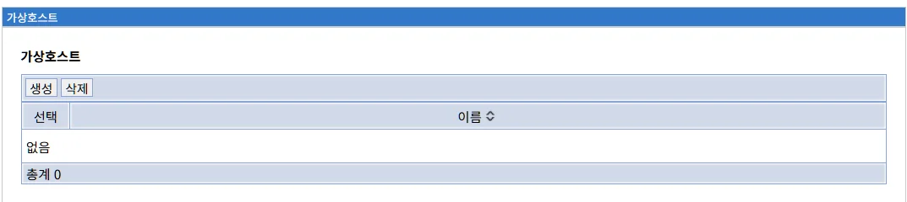
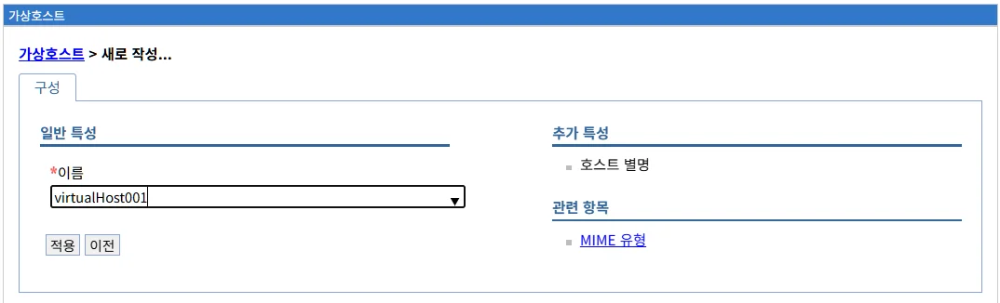
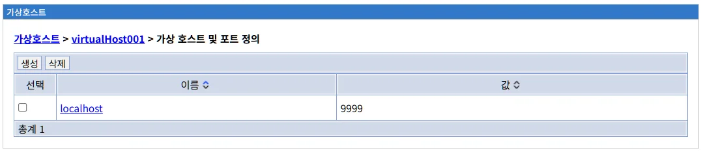
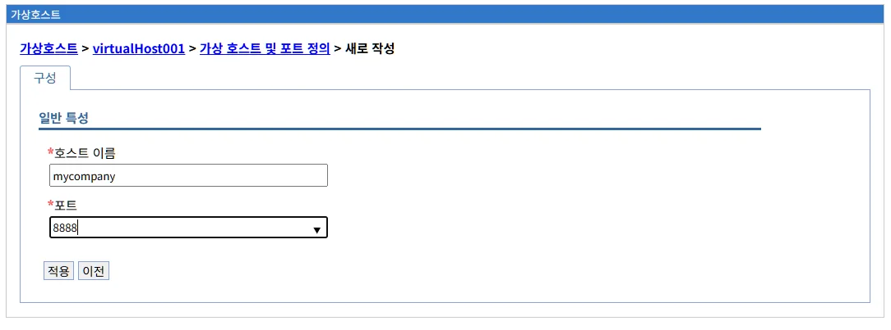
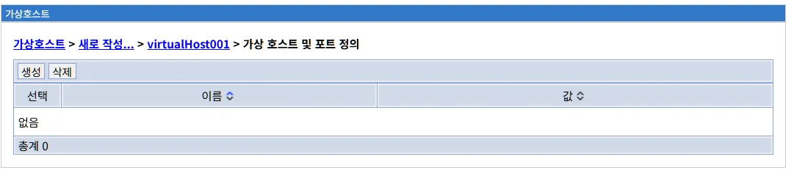
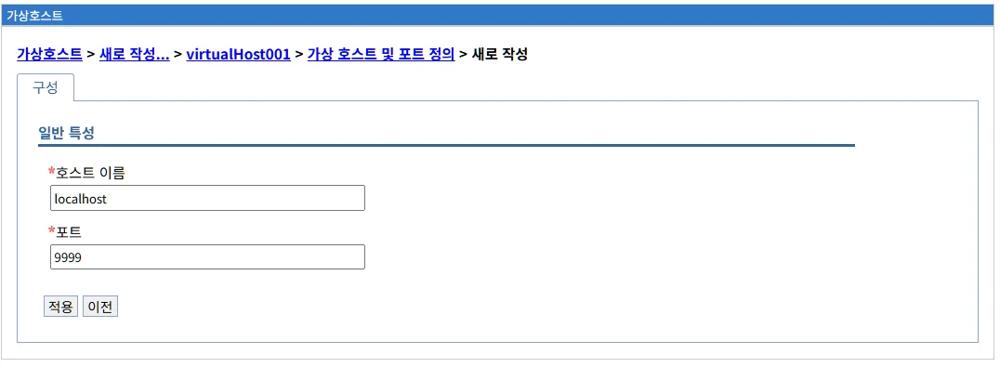

# 가상호스트 관리

## 개요

가상호스트(Virtual Host)는 하나의 Liberty 서버에서 여러 도메인이나 호스트 이름으로 애플리케이션을 제공할 수 있게 해주는 기능입니다.

**주요 역할:**
- 하나의 서버에서 여러 도메인/호스트 이름 처리
- 애플리케이션별 네트워크 격리
- 포트 및 호스트 이름 기반 라우팅
- 다중 사이트 호스팅

**Liberty 구현:**
LibriX의 가상호스트 관리는 Open Liberty의 `<virtualHost>` 요소를 기반으로 구현되며, Apache HTTP Server의 가상호스트 개념과 유사하면서도 Liberty의 경량 아키텍처를 활용합니다.

**가상호스트의 필요성:**

**시나리오 1: 다중 도메인**
```
하나의 서버에서 여러 도메인 서비스:
- www.company.com → 회사 홈페이지
- shop.company.com → 쇼핑몰
- api.company.com → API 서버
```

**시나리오 2: 포트 분리**
```
포트별로 다른 애플리케이션:
- :9080 → 공개 웹 애플리케이션
- :9443 → 보안 관리 콘솔
- :9081 → 내부 API
```

**시나리오 3: 네트워크 격리**
```
환경별 네트워크 분리:
- 외부망 → 고객용 애플리케이션
- 내부망 → 관리자용 애플리케이션
```

---

## 가상호스트 메인 화면

### 화면 구성



가상호스트 메인 화면은 다음과 같이 구성됩니다:

#### 상단 영역

**페이지 제목:**
```
가상호스트
```

#### 관리 탭

화면 상단에 두 개의 탭이 있습니다:

**1. 생성 탭**
- 새로운 가상호스트를 생성합니다
- 클릭 시 가상호스트 생성 화면으로 이동합니다

**2. 삭제 탭**
- 선택한 가상호스트를 삭제합니다
- 하나 이상의 가상호스트를 선택한 후 사용 가능합니다
- 삭제 전 확인 대화상자가 표시됩니다

**주의사항:**
- default_host는 삭제할 수 없습니다 (시스템 기본 가상호스트)
- 애플리케이션이 매핑된 가상호스트를 삭제하면 애플리케이션 접근 불가

#### 가상호스트 목록 테이블

목록 테이블은 다음 컬럼으로 구성됩니다:

| 컬럼 | 설명 |
|------|------|
| **선택** | 체크박스를 통해 가상호스트 선택 |
| **이름** | 가상호스트의 고유 이름 (클릭 시 상세 화면으로 이동) |

**현재 화면 상태:**

```
총계 0

[선택]  [이름 ↕]

없음

총계 0
```

현재 화면에는 등록된 가상호스트가 없습니다. (총계 0)

**기본 가상호스트:**

Liberty는 기본적으로 `default_host`라는 가상호스트를 자동으로 생성합니다. 이 화면에 표시되지 않는 것은 아직 사용자 정의 가상호스트가 생성되지 않았기 때문입니다.

#### 목록 정렬

**이름 컬럼 정렬:**
- 이름 컬럼 헤더의 화살표(↕)를 클릭하면 정렬됩니다
- 오름차순/내림차순 토글

#### 목록 하단

```
총계 0
```

등록된 가상호스트의 총 개수를 표시합니다.

---

## 가상호스트 개념

### 가상호스트란?

가상호스트는 하나의 물리적 서버에서 여러 논리적 호스트를 운영할 수 있게 해주는 기술입니다.

**기본 개념:**

```
하나의 Liberty 서버
├── 가상호스트 1 (default_host)
│   ├── 호스트 별칭: *:9080
│   └── 애플리케이션 A
├── 가상호스트 2 (www_host)
│   ├── 호스트 별칭: www.company.com:80
│   └── 애플리케이션 B
└── 가상호스트 3 (api_host)
    ├── 호스트 별칭: api.company.com:443
    └── 애플리케이션 C
```

### default_host (기본 가상호스트)

Liberty는 기본적으로 `default_host`라는 가상호스트를 생성합니다.

**default_host 특징:**

```xml
<virtualHost id="default_host">
    <hostAlias>*:9080</hostAlias>
    <hostAlias>*:9443</hostAlias>
</virtualHost>
```

**속성:**
- **ID**: default_host (변경 불가)
- **호스트 별칭**: 
  - `*:9080` - 모든 호스트명의 9080 포트
  - `*:9443` - 모든 호스트명의 9443 포트
- **용도**: 명시적으로 가상호스트를 지정하지 않은 애플리케이션이 사용
- **삭제**: 불가 (시스템 기본)

**default_host 동작:**

```
요청: http://localhost:9080/myapp
→ 가상호스트 매핑 확인
→ 명시적 매핑 없음
→ default_host 사용
→ myapp 애플리케이션으로 라우팅
```

### 호스트 별칭 (Host Alias)

호스트 별칭은 가상호스트가 처리할 호스트명과 포트를 정의합니다.

**형식:**
```
호스트명:포트
```

**예시:**

**1. 와일드카드 사용:**
```
*:9080          → 모든 호스트명의 9080 포트
*:*             → 모든 호스트명의 모든 포트
```

**2. 특정 호스트명:**
```
www.company.com:80      → www.company.com의 80 포트
shop.company.com:80     → shop.company.com의 80 포트
api.company.com:443     → api.company.com의 443 포트
```

**3. IP 주소:**
```
192.168.1.100:9080      → 특정 IP의 9080 포트
192.168.1.*:9080        → 192.168.1.x 대역의 9080 포트
```

**4. 로컬호스트:**
```
localhost:9080          → localhost의 9080 포트
127.0.0.1:9080          → 127.0.0.1의 9080 포트
```

### 요청 라우팅

클라이언트 요청이 가상호스트로 라우팅되는 과정:

```
1. HTTP 요청 도착
   GET http://www.company.com:80/myapp

2. Host 헤더 추출
   Host: www.company.com:80

3. 가상호스트 매칭
   default_host (*:9080, *:9443) → 매칭 안 됨
   www_host (www.company.com:80) → 매칭됨!

4. 애플리케이션 라우팅
   www_host에 매핑된 애플리케이션 검색
   → myapp 애플리케이션으로 전달

5. 응답 반환
   애플리케이션이 요청 처리 후 응답
```

**매칭 우선순위:**

```
1. 정확한 호스트명:포트 매칭
   www.company.com:80

2. 호스트명 와일드카드
   *.company.com:80

3. 포트 와일드카드
   www.company.com:*

4. 전체 와일드카드
   *:80

5. default_host (최종)
   *:9080, *:9443
```

---

## 가상호스트 사용 사례

### 사례 1: 다중 도메인 호스팅

**시나리오:**
하나의 서버에서 여러 도메인의 웹사이트를 호스팅

**구성:**

```xml
<server>
    <!-- 회사 홈페이지 -->
    <virtualHost id="www_host">
        <hostAlias>www.company.com:80</hostAlias>
        <hostAlias>www.company.com:443</hostAlias>
    </virtualHost>
    
    <!-- 쇼핑몰 -->
    <virtualHost id="shop_host">
        <hostAlias>shop.company.com:80</hostAlias>
        <hostAlias>shop.company.com:443</hostAlias>
    </virtualHost>
    
    <!-- 블로그 -->
    <virtualHost id="blog_host">
        <hostAlias>blog.company.com:80</hostAlias>
        <hostAlias>blog.company.com:443</hostAlias>
    </virtualHost>
    
    <!-- 애플리케이션 매핑 -->
    <application location="corporate-website.war">
        <virtualHost ref="www_host"/>
    </application>
    
    <application location="online-shop.war">
        <virtualHost ref="shop_host"/>
    </application>
    
    <application location="company-blog.war">
        <virtualHost ref="blog_host"/>
    </application>
</server>
```

**결과:**
```
http://www.company.com → corporate-website.war
http://shop.company.com → online-shop.war
http://blog.company.com → company-blog.war
```

### 사례 2: 포트 기반 분리

**시나리오:**
포트별로 다른 애플리케이션 제공

**구성:**

```xml
<server>
    <!-- 공개 웹 포트 -->
    <virtualHost id="public_host">
        <hostAlias>*:9080</hostAlias>
        <hostAlias>*:9443</hostAlias>
    </virtualHost>
    
    <!-- 관리 포트 -->
    <virtualHost id="admin_host">
        <hostAlias>*:9081</hostAlias>
        <hostAlias>*:9444</hostAlias>
    </virtualHost>
    
    <!-- 애플리케이션 매핑 -->
    <application location="public-app.war">
        <virtualHost ref="public_host"/>
    </application>
    
    <application location="admin-console.war">
        <virtualHost ref="admin_host"/>
    </application>
</server>
```

**결과:**
```
http://localhost:9080/public → public-app.war
http://localhost:9081/admin → admin-console.war
```

### 사례 3: 환경별 분리

**시나리오:**
개발/테스트/프로덕션 환경을 하나의 서버에서 분리

**구성:**

```xml
<server>
    <!-- 개발 환경 -->
    <virtualHost id="dev_host">
        <hostAlias>dev.company.com:80</hostAlias>
    </virtualHost>
    
    <!-- 테스트 환경 -->
    <virtualHost id="test_host">
        <hostAlias>test.company.com:80</hostAlias>
    </virtualHost>
    
    <!-- 프로덕션 환경 -->
    <virtualHost id="prod_host">
        <hostAlias>www.company.com:80</hostAlias>
    </virtualHost>
    
    <!-- 애플리케이션 매핑 -->
    <application location="myapp-dev.war">
        <virtualHost ref="dev_host"/>
    </application>
    
    <application location="myapp-test.war">
        <virtualHost ref="test_host"/>
    </application>
    
    <application location="myapp-prod.war">
        <virtualHost ref="prod_host"/>
    </application>
</server>
```

**결과:**
```
http://dev.company.com → myapp-dev.war
http://test.company.com → myapp-test.war
http://www.company.com → myapp-prod.war
```

### 사례 4: 보안 분리

**시나리오:**
외부 접근과 내부 접근을 분리

**구성:**

```xml
<server>
    <!-- 외부 접근 (공개 IP) -->
    <virtualHost id="external_host">
        <hostAlias>203.0.113.100:80</hostAlias>
        <hostAlias>203.0.113.100:443</hostAlias>
    </virtualHost>
    
    <!-- 내부 접근 (사설 IP) -->
    <virtualHost id="internal_host">
        <hostAlias>192.168.1.100:8080</hostAlias>
    </virtualHost>
    
    <!-- 로컬 접근만 허용 -->
    <virtualHost id="localhost_host">
        <hostAlias>localhost:9090</hostAlias>
        <hostAlias>127.0.0.1:9090</hostAlias>
    </virtualHost>
    
    <!-- 애플리케이션 매핑 -->
    <application location="customer-portal.war">
        <virtualHost ref="external_host"/>
    </application>
    
    <application location="employee-intranet.war">
        <virtualHost ref="internal_host"/>
    </application>
    
    <application location="admin-tool.war">
        <virtualHost ref="localhost_host"/>
    </application>
</server>
```

**결과:**
```
외부에서: http://203.0.113.100 → customer-portal.war
내부에서: http://192.168.1.100:8080 → employee-intranet.war
로컬에서: http://localhost:9090 → admin-tool.war
```

### 사례 5: API 버전 분리

**시나리오:**
API 버전별로 다른 엔드포인트 제공

**구성:**

```xml
<server>
    <!-- API v1 -->
    <virtualHost id="api_v1_host">
        <hostAlias>api.company.com:80</hostAlias>
        <hostAlias>v1.api.company.com:80</hostAlias>
    </virtualHost>
    
    <!-- API v2 -->
    <virtualHost id="api_v2_host">
        <hostAlias>v2.api.company.com:80</hostAlias>
    </virtualHost>
    
    <!-- API v3 (최신) -->
    <virtualHost id="api_v3_host">
        <hostAlias>v3.api.company.com:80</hostAlias>
    </virtualHost>
    
    <!-- 애플리케이션 매핑 -->
    <application location="api-v1.war">
        <virtualHost ref="api_v1_host"/>
    </application>
    
    <application location="api-v2.war">
        <virtualHost ref="api_v2_host"/>
    </application>
    
    <application location="api-v3.war">
        <virtualHost ref="api_v3_host"/>
    </application>
</server>
```

**결과:**
```
http://api.company.com → api-v1.war (기본 v1)
http://v1.api.company.com → api-v1.war
http://v2.api.company.com → api-v2.war
http://v3.api.company.com → api-v3.war
```

---

## 가상호스트 생성

### 가상호스트 생성 화면



"생성" 탭을 클릭하면 새로운 가상호스트를 생성하는 화면이 나타납니다.

**화면 경로:**
```
가상호스트 > 새로 작성...
```

**화면 구성:**

```
일반 특성                     추가 특성

*이름                          ■ 호스트 별명
[virtualHost001        ▼]     

                              관련 항목
                              
                              ■ MIME 유형

[적용]  [이전]
```

### 입력 필드

가상호스트 생성 화면은 좌우 두 영역으로 구성됩니다:

#### 좌측: 일반 특성

**1. 이름 *필수**

```
*이름
[virtualHost001                 ▼]
```

가상호스트의 고유 식별자를 입력합니다.

**입력 규칙:**
- 필수 입력 항목
- 영문자, 숫자, 언더스코어(_), 하이픈(-) 사용 가능
- 대소문자 구분
- 서버 내에서 고유해야 함
- 공백 및 특수문자 사용 불가

**명명 규칙:**

**패턴 1: 도메인 기반 (권장)**
```
좋은 예:
- www_host
- api_host
- blog_host
- shop_host
- admin_host
```

**패턴 2: 용도 기반**
```
좋은 예:
- public_host
- internal_host
- external_host
- secure_host
- mobile_host
```

**패턴 3: 환경 기반**
```
좋은 예:
- dev_host
- test_host
- prod_host
- staging_host
```

**패턴 4: 포트 기반**
```
좋은 예:
- port9080_host
- port9443_host
- http_host
- https_host
```

**나쁜 예:**
```
✗ my host              (공백 사용)
✗ host@www             (특수문자 사용)
✗ 123host              (숫자로 시작)
✗ virtual-host-001     (너무 일반적)
```

**명명 가이드:**

| 용도 | 명명 패턴 | 예시 |
|------|----------|------|
| **도메인별** | domain_host | `www_host`, `api_host` |
| **서비스별** | service_host | `shop_host`, `blog_host` |
| **환경별** | env_host | `dev_host`, `prod_host` |
| **접근별** | access_host | `public_host`, `internal_host` |
| **프로토콜별** | protocol_host | `http_host`, `https_host` |

**예약어:**
- `default_host` - Liberty 기본 가상호스트 (생성 불가)

#### 우측: 추가 특성

**1. 호스트 별명 (Host Alias)**

```
추가 특성

■ 호스트 별명
```

가상호스트가 처리할 호스트명과 포트를 정의합니다.

**설정 방법:**
- 체크박스를 클릭하여 활성화
- 호스트 별명 목록 화면으로 이동
- 하나 이상의 호스트 별명을 추가해야 함

**호스트 별명은 필수입니다!**

가상호스트는 최소 하나의 호스트 별명이 있어야 작동합니다. 호스트 별명이 없으면:
```
오류: 가상호스트에 호스트 별명이 없습니다.
가상호스트는 최소 하나의 호스트 별명이 필요합니다.
```

**2. MIME 유형**

```
관련 항목

■ MIME 유형
```

가상호스트에 특정 MIME 타입 매핑을 정의합니다 (선택사항).

**설정 방법:**
- 체크박스를 클릭하여 활성화
- MIME 유형 설정 화면으로 이동
- 파일 확장자와 MIME 타입 매핑 추가

**MIME 유형 예시:**
```
.json → application/json
.xml → application/xml
.pdf → application/pdf
.mp4 → video/mp4
```

### 하단 버튼

```
[적용]  [이전]
```

**적용 버튼:**
- 입력한 정보를 검증하고 다음 단계로 이동합니다
- 필수 필드 검증 수행
- 호스트 별명 설정 화면으로 이동

**이전 버튼:**
- 입력한 내용을 버리고 목록 화면으로 돌아갑니다
- 입력한 데이터는 저장되지 않습니다

### 생성 프로세스

가상호스트 생성은 2단계로 진행됩니다:

#### 1단계: 기본 정보 입력 (현재 화면)

**입력 항목:**
- 이름 (필수)
- 호스트 별명 활성화 (필수)
- MIME 유형 활성화 (선택)

**"적용" 버튼 클릭:**

```
진행:
1. 이름 검증
   ✓ 필수 항목 확인
   ✓ 형식 검증
   ✓ 중복 확인

2. 다음 단계로 이동
   → 호스트 별명 설정 화면
```

#### 2단계: 호스트 별명 설정

**호스트 별명 추가:**

가상호스트에 하나 이상의 호스트 별명을 추가해야 합니다.

**호스트 별명 형식:**
```
호스트명:포트

예시:
*:9080
www.company.com:80
api.company.com:443
192.168.1.100:8080
localhost:9090
```

**최종 적용:**

호스트 별명 설정을 완료하고 "적용" 버튼을 클릭하면:

```
진행:
1. 호스트 별명 검증
   ✓ 형식 확인
   ✓ 중복 확인

2. Liberty server.xml 업데이트
   ✓ <virtualHost> 요소 생성
   ✓ <hostAlias> 요소 추가

3. 서버 자동 갱신
   ✓ 구성 변경 감지
   ✓ 자동 재로드 완료

4. 목록 화면으로 이동
   ✓ 새 가상호스트 표시
```

### 생성 예시

#### 예시 1: 웹사이트 가상호스트

**시나리오:**
회사 웹사이트용 가상호스트 생성

**1단계: 기본 정보**
```
이름: www_host
☑ 호스트 별명
☐ MIME 유형
```

**2단계: 호스트 별명**
```
www.company.com:80
www.company.com:443
company.com:80
company.com:443
```

**결과 (server.xml):**
```xml
<virtualHost id="www_host">
    <hostAlias>www.company.com:80</hostAlias>
    <hostAlias>www.company.com:443</hostAlias>
    <hostAlias>company.com:80</hostAlias>
    <hostAlias>company.com:443</hostAlias>
</virtualHost>
```

**사용:**
```xml
<application location="website.war">
    <virtualHost ref="www_host"/>
</application>
```

#### 예시 2: API 가상호스트

**시나리오:**
REST API 서비스용 가상호스트 생성

**1단계: 기본 정보**
```
이름: api_host
☑ 호스트 별명
☑ MIME 유형 (JSON 최적화)
```

**2단계: 호스트 별명**
```
api.company.com:443
v1.api.company.com:443
v2.api.company.com:443
```

**결과 (server.xml):**
```xml
<virtualHost id="api_host">
    <hostAlias>api.company.com:443</hostAlias>
    <hostAlias>v1.api.company.com:443</hostAlias>
    <hostAlias>v2.api.company.com:443</hostAlias>
    <mimeType>
        <type>application/json</type>
        <extension>json</extension>
    </mimeType>
</virtualHost>
```

**사용:**
```xml
<application location="rest-api.war">
    <virtualHost ref="api_host"/>
</application>
```

#### 예시 3: 관리 콘솔 가상호스트

**시나리오:**
내부 관리자용 가상호스트 생성 (로컬 접근만 허용)

**1단계: 기본 정보**
```
이름: admin_host
☑ 호스트 별명
☐ MIME 유형
```

**2단계: 호스트 별명**
```
localhost:9090
127.0.0.1:9090
192.168.1.100:9090
```

**결과 (server.xml):**
```xml
<virtualHost id="admin_host">
    <hostAlias>localhost:9090</hostAlias>
    <hostAlias>127.0.0.1:9090</hostAlias>
    <hostAlias>192.168.1.100:9090</hostAlias>
</virtualHost>
```

**사용:**
```xml
<application location="admin-console.war">
    <virtualHost ref="admin_host"/>
</application>
```

#### 예시 4: 개발 환경 가상호스트

**시나리오:**
개발 환경용 모든 요청 수용 가상호스트

**1단계: 기본 정보**
```
이름: dev_host
☑ 호스트 별명
☐ MIME 유형
```

**2단계: 호스트 별명**
```
*:9080
*:9443
```

**결과 (server.xml):**
```xml
<virtualHost id="dev_host">
    <hostAlias>*:9080</hostAlias>
    <hostAlias>*:9443</hostAlias>
</virtualHost>
```

**사용:**
```xml
<application location="myapp-dev.war">
    <virtualHost ref="dev_host"/>
</application>
```

#### 예시 5: 다중 서브도메인 가상호스트

**시나리오:**
여러 서브도메인을 처리하는 가상호스트

**1단계: 기본 정보**
```
이름: multi_host
☑ 호스트 별명
☐ MIME 유형
```

**2단계: 호스트 별명**
```
*.company.com:80
*.company.com:443
```

**결과 (server.xml):**
```xml
<virtualHost id="multi_host">
    <hostAlias>*.company.com:80</hostAlias>
    <hostAlias>*.company.com:443</hostAlias>
</virtualHost>
```

**매칭 예시:**
```
www.company.com:80 → 매칭
api.company.com:80 → 매칭
shop.company.com:443 → 매칭
blog.company.com:443 → 매칭
```

### 생성 시 주의사항

**1. 이름 중복 방지**

같은 이름의 가상호스트를 생성할 수 없습니다:

```
오류 시나리오:
- "www_host"라는 가상호스트가 이미 존재
- 같은 이름으로 다시 생성 시도

→ 오류: 같은 이름의 가상호스트가 이미 존재합니다.

해결 방법:
- 다른 이름 사용
- 또는 기존 가상호스트 수정
```

**2. default_host 예약**

`default_host`는 Liberty 시스템 예약어입니다:

```
오류 시나리오:
- 이름: default_host

→ 오류: "default_host"는 예약된 이름입니다.

해결 방법:
- 다른 이름 사용 (예: default_custom_host)
```

**3. 호스트 별명 필수**

가상호스트는 반드시 하나 이상의 호스트 별명이 있어야 합니다:

```
오류 시나리오:
- 가상호스트 생성
- 호스트 별명 추가 안 함

→ 오류: 호스트 별명이 없는 가상호스트는 작동하지 않습니다.

해결 방법:
- 최소 하나의 호스트 별명 추가
```

**4. 호스트 별명 충돌**

다른 가상호스트와 호스트 별명이 겹치면 안 됩니다:

```
오류 시나리오:
- www_host: www.company.com:80
- new_host: www.company.com:80 (중복!)

→ 경고: 호스트 별명이 중복됩니다.
→ 요청 라우팅이 예측 불가능해질 수 있습니다.

해결 방법:
- 고유한 호스트 별명 사용
- 또는 포트 분리
```

**5. 와일드카드 남용 주의**

와일드카드(`*`)를 과도하게 사용하면 충돌 가능:

```
주의 시나리오:
- host1: *:9080 (모든 호스트의 9080)
- host2: www.company.com:9080 (특정 호스트의 9080)

→ 충돌 발생: 어떤 가상호스트로 라우팅?

권장:
- 구체적인 호스트명 사용
- 와일드카드는 개발 환경에서만 사용
```

### 생성 후 확인

가상호스트 생성 후 다음을 확인하세요:

#### 1. 목록에서 확인

```
가상호스트 목록

☐  www_host

총계 1
```

생성한 가상호스트가 목록에 표시됩니다.

#### 2. Liberty 로그 확인

```bash
tail -f ${server.output.dir}/logs/messages.log
```

**예상 로그:**
```
[2026-01-15 15:30:45.123] CWWKG0016I: Starting server configuration update.
[2026-01-15 15:30:45.234] CWWKG0017I: The server configuration was successfully updated in 0.111 seconds.
```

#### 3. server.xml 확인

```bash
cat ${server.config.dir}/server.xml | grep -A 5 "virtualHost id=\"www_host\""
```

**예상 출력:**
```xml
<virtualHost id="www_host">
    <hostAlias>www.company.com:80</hostAlias>
    <hostAlias>www.company.com:443</hostAlias>
</virtualHost>
```

#### 4. 접근 테스트

가상호스트에 애플리케이션을 매핑하고 테스트:

```bash
# 호스트명으로 접근
curl -H "Host: www.company.com" http://localhost:80/myapp

# 또는 실제 도메인으로 접근 (DNS 설정 필요)
curl http://www.company.com/myapp
```

**성공 응답:**
```
HTTP/1.1 200 OK
Content-Type: text/html
...
```

#### 5. 호스트 별명 매칭 확인

다양한 호스트명으로 테스트:

```bash
# 매칭되어야 하는 요청
curl -H "Host: www.company.com:80" http://localhost/myapp → 성공
curl -H "Host: www.company.com:443" https://localhost/myapp → 성공

# 매칭되지 않아야 하는 요청
curl -H "Host: other.company.com:80" http://localhost/myapp → 실패 (404)
curl -H "Host: www.company.com:9080" http://localhost:9080/myapp → 실패 (404)
```

---

## 다음 단계

- 호스트 별명을 추가하려면 가상호스트 상세 화면으로 이동하세요.
- 애플리케이션에 가상호스트를 매핑하려면 애플리케이션 설정 화면에서 지정하세요.
- MIME 유형을 설정하려면 가상호스트 상세 화면에서 추가하세요.

---

## 참고 자료

### Liberty 공식 문서
- [Virtual Host Configuration](https://openliberty.io/docs/latest/reference/config/virtualHost.html)
- [Host Alias](https://openliberty.io/docs/latest/reference/config/virtualHost.html#hostAlias)
- [Application Configuration](https://openliberty.io/docs/latest/reference/config/application.html)

### Apache HTTP Server 문서
- [Apache Virtual Host](https://httpd.apache.org/docs/2.4/vhosts/)
- [Name-based Virtual Host](https://httpd.apache.org/docs/2.4/vhosts/name-based.html)

### 관련 LibriX 문서
- [애플리케이션 설치](../application/application-install.md)
- [엔터프라이즈 애플리케이션 관리](../application/enterprise-application.md)
- [웹서버 관리](../server/web-server.md)

---

## 호스트 별명 관리

### 호스트 별명 목록 화면



가상호스트를 생성한 후 "가상 호스트 및 포트 정의" 화면으로 이동합니다.

**화면 경로:**
```
가상호스트 > virtualHost001 > 가상 호스트 및 포트 정의
```

**화면 구성:**

```
[생성]  [삭제]

선택    이름 ↕           값 ↕
☐      localhost        9999

총계 1
```

#### 관리 탭

**1. 생성 탭**
- 새로운 호스트 별명을 추가합니다
- 클릭 시 호스트 별명 생성 화면으로 이동합니다

**2. 삭제 탭**
- 선택한 호스트 별명을 삭제합니다
- 최소 하나의 호스트 별명은 남겨야 합니다

#### 목록 테이블

| 컬럼 | 설명 |
|------|------|
| **선택** | 체크박스를 통해 호스트 별명 선택 |
| **이름** | 호스트명 (도메인 또는 IP) |
| **값** | 포트 번호 |

**현재 예시:**
```
localhost:9999
→ 이름: localhost
→ 값: 9999
```

### 호스트 별명 추가



"생성" 탭을 클릭하면 새로운 호스트 별명을 추가하는 화면이 나타납니다.

**화면 경로:**
```
가상호스트 > virtualHost001 > 가상 호스트 및 포트 정의 > 새로 작성
```

**화면 구성:**

```
일반 특성

*호스트 이름
[mycompany                          ]

*포트
[8888                               ▼]

[적용]  [이전]
```

### 입력 필드

#### 1. 호스트 이름 *필수

```
*호스트 이름
[mycompany]
```

가상호스트가 처리할 호스트명을 입력합니다.

**입력 형식:**

**1. 와일드카드**
```
*               → 모든 호스트명
```

**2. 도메인명**
```
www.company.com
api.company.com
shop.company.com
blog.company.com
```

**3. 서브도메인 와일드카드**
```
*.company.com   → 모든 서브도메인
*.api.company.com
```

**4. IP 주소**
```
192.168.1.100
10.0.0.50
203.0.113.100
```

**5. IP 대역 와일드카드**
```
192.168.1.*     → 192.168.1.0/24 대역
10.0.*.*        → 10.0.0.0/16 대역
```

**6. localhost**
```
localhost
127.0.0.1
```

**입력 예시:**

| 호스트 이름 | 매칭 예시 |
|------------|----------|
| `*` | 모든 호스트명 |
| `www.company.com` | www.company.com만 |
| `*.company.com` | api.company.com, shop.company.com 등 |
| `192.168.1.100` | 192.168.1.100만 |
| `192.168.1.*` | 192.168.1.1 ~ 192.168.1.254 |
| `localhost` | localhost만 |

#### 2. 포트 *필수

```
*포트
[8888                               ▼]
```

가상호스트가 처리할 포트 번호를 입력합니다.

**입력 형식:**

**1. 와일드카드**
```
*               → 모든 포트
```

**2. 특정 포트**
```
80              → HTTP
443             → HTTPS
8080            → 대체 HTTP
8443            → 대체 HTTPS
9080            → Liberty 기본 HTTP
9443            → Liberty 기본 HTTPS
```

**일반적인 포트 번호:**

| 포트 | 프로토콜 | 용도 |
|------|---------|------|
| 80 | HTTP | 표준 웹 트래픽 |
| 443 | HTTPS | 보안 웹 트래픽 |
| 8080 | HTTP | 대체 웹 포트 |
| 8443 | HTTPS | 대체 보안 포트 |
| 9080 | HTTP | Liberty 기본 HTTP |
| 9443 | HTTPS | Liberty 기본 HTTPS |
| 3000-9000 | 사용자 정의 | 애플리케이션별 포트 |

**포트 선택 가이드:**

```
프로덕션 환경:
- 80 (HTTP)
- 443 (HTTPS)
→ 표준 포트 사용 (URL에 포트 번호 불필요)

개발/테스트 환경:
- 8080, 9080 (HTTP)
- 8443, 9443 (HTTPS)
→ 비특권 포트 사용

관리 콘솔:
- 9090, 9091 등
→ 비표준 포트로 분리
```

### 호스트 별명 조합 예시

#### 예시 1: 프로덕션 웹사이트

```
가상호스트: www_host

호스트 별명:
1. www.company.com:80
2. www.company.com:443
3. company.com:80
4. company.com:443
```

**server.xml:**
```xml
<virtualHost id="www_host">
    <hostAlias>www.company.com:80</hostAlias>
    <hostAlias>www.company.com:443</hostAlias>
    <hostAlias>company.com:80</hostAlias>
    <hostAlias>company.com:443</hostAlias>
</virtualHost>
```

**매칭:**
```
http://www.company.com → 매칭
https://www.company.com → 매칭
http://company.com → 매칭
https://company.com → 매칭
```

#### 예시 2: API 서비스

```
가상호스트: api_host

호스트 별명:
1. api.company.com:443
2. v1.api.company.com:443
3. v2.api.company.com:443
```

**server.xml:**
```xml
<virtualHost id="api_host">
    <hostAlias>api.company.com:443</hostAlias>
    <hostAlias>v1.api.company.com:443</hostAlias>
    <hostAlias>v2.api.company.com:443</hostAlias>
</virtualHost>
```

**매칭:**
```
https://api.company.com → 매칭 (기본 최신 버전)
https://v1.api.company.com → 매칭 (v1 API)
https://v2.api.company.com → 매칭 (v2 API)
```

#### 예시 3: 개발 환경

```
가상호스트: dev_host

호스트 별명:
1. *:9080
2. *:9443
```

**server.xml:**
```xml
<virtualHost id="dev_host">
    <hostAlias>*:9080</hostAlias>
    <hostAlias>*:9443</hostAlias>
</virtualHost>
```

**매칭:**
```
http://localhost:9080 → 매칭
http://192.168.1.100:9080 → 매칭
https://dev.company.com:9443 → 매칭
모든 호스트명의 9080, 9443 포트 → 매칭
```

#### 예시 4: 내부 네트워크

```
가상호스트: internal_host

호스트 별명:
1. 192.168.1.*:8080
2. 10.0.0.*:8080
```

**server.xml:**
```xml
<virtualHost id="internal_host">
    <hostAlias>192.168.1.*:8080</hostAlias>
    <hostAlias>10.0.0.*:8080</hostAlias>
</virtualHost>
```

**매칭:**
```
http://192.168.1.100:8080 → 매칭
http://192.168.1.50:8080 → 매칭
http://10.0.0.10:8080 → 매칭
http://10.0.0.200:8080 → 매칭
```

#### 예시 5: 로컬 전용

```
가상호스트: localhost_host

호스트 별명:
1. localhost:9090
2. 127.0.0.1:9090
```

**server.xml:**
```xml
<virtualHost id="localhost_host">
    <hostAlias>localhost:9090</hostAlias>
    <hostAlias>127.0.0.1:9090</hostAlias>
</virtualHost>
```

**매칭:**
```
http://localhost:9090 → 매칭
http://127.0.0.1:9090 → 매칭
http://192.168.1.100:9090 → 매칭 안 됨 (로컬만)
```

### 호스트 별명 우선순위

여러 가상호스트의 호스트 별명이 요청과 매칭될 수 있는 경우 우선순위:

```
1. 정확한 호스트명:포트
   www.company.com:80

2. 호스트명 와일드카드 + 정확한 포트
   *.company.com:80

3. 정확한 호스트명 + 포트 와일드카드
   www.company.com:*

4. IP 주소 + 정확한 포트
   192.168.1.100:80

5. IP 대역 + 정확한 포트
   192.168.1.*:80

6. 전체 와일드카드
   *:80

7. 완전 와일드카드
   *:*
```

**예시:**

```
가상호스트 구성:
- host1: www.company.com:80 (정확)
- host2: *.company.com:80 (와일드카드)
- host3: *:80 (전체 와일드카드)

요청: http://www.company.com:80
→ host1 매칭 (정확한 매칭이 우선)

요청: http://api.company.com:80
→ host2 매칭 (서브도메인 와일드카드)

요청: http://other.com:80
→ host3 매칭 (전체 와일드카드)
```

### 호스트 별명 삭제

호스트 별명을 삭제하려면:

1. 목록에서 삭제할 호스트 별명 선택
2. "삭제" 탭 클릭
3. 확인

**주의사항:**
```
최소 하나의 호스트 별명 필요:
- 마지막 남은 호스트 별명은 삭제 불가
- 가상호스트는 최소 1개의 호스트 별명 필요

오류 메시지:
"가상호스트는 최소 하나의 호스트 별명이 필요합니다."
```

---

## MIME 유형 관리

### MIME 유형 목록 화면



가상호스트에 MIME 유형 매핑을 추가할 수 있습니다.

**화면 경로:**
```
가상호스트 > 새로 작성... > virtualHost001 > 가상 호스트 및 포트 정의
```

**화면 구성:**

```
[생성]  [삭제]

선택    이름 ↕           값 ↕

없음

총계 0
```

### MIME 유형 추가



"생성" 탭을 클릭하면 MIME 유형을 추가하는 화면이 나타납니다.

**화면 구성:**

```
일반 특성

*호스트 이름
[localhost                          ]

*포트
[9999                               ]

[적용]  [이전]
```

**MIME 유형이란?**

MIME(Multipurpose Internet Mail Extensions) 유형은 파일의 형식을 정의합니다.

**형식:**
```
파일 확장자 → MIME 타입
```

**일반적인 MIME 유형:**

| 확장자 | MIME 타입 | 설명 |
|--------|-----------|------|
| .html | text/html | HTML 문서 |
| .css | text/css | CSS 스타일시트 |
| .js | application/javascript | JavaScript |
| .json | application/json | JSON 데이터 |
| .xml | application/xml | XML 데이터 |
| .pdf | application/pdf | PDF 문서 |
| .jpg | image/jpeg | JPEG 이미지 |
| .png | image/png | PNG 이미지 |
| .gif | image/gif | GIF 이미지 |
| .mp4 | video/mp4 | MP4 비디오 |
| .mp3 | audio/mpeg | MP3 오디오 |
| .zip | application/zip | ZIP 압축 |

**Liberty 기본 MIME 유형:**

Liberty는 이미 일반적인 MIME 유형을 내장하고 있습니다. 추가 설정은 다음 경우에만 필요합니다:

```
필요한 경우:
- 사용자 정의 파일 확장자
- 기본 매핑 재정의
- 특수 컨텐츠 타입
```

**예시:**

```xml
<virtualHost id="api_host">
    <hostAlias>api.company.com:443</hostAlias>
    
    <!-- 사용자 정의 MIME 타입 -->
    <mimeType>
        <type>application/vnd.api+json</type>
        <extension>api</extension>
    </mimeType>
</virtualHost>
```

---

## 변경사항 저장 및 검토

가상호스트를 생성하거나 수정한 후 "적용" 버튼을 클릭하면 저장 및 검토 프로세스가 시작됩니다.

저장/검토 프로세스는 이전 문서들(Liberty 변수, JDBC 제공자, 데이터소스)과 동일한 패턴을 따릅니다.

### 저장 옵션

**옵션 1: 변경사항을 즉시 적용**
- 변경사항이 즉시 server.xml에 반영
- Liberty가 자동으로 구성을 재로드
- 가상호스트를 즉시 사용 가능

**옵션 2: 변경사항을 저장하고 나중에 동기화**
- 변경사항이 LibriX 데이터베이스에 저장
- 나중에 수동으로 동기화하여 적용

---

## Liberty server.xml 구성

가상호스트는 server.xml 파일의 `<virtualHost>` 요소로 정의됩니다.

### 기본 구문

```xml
<virtualHost id="가상호스트ID">
    <hostAlias>호스트명:포트</hostAlias>
    <hostAlias>호스트명:포트</hostAlias>
    ...
</virtualHost>
```

### 구성 예시

#### 단순 가상호스트

```xml
<server>
    <!-- 웹사이트 가상호스트 -->
    <virtualHost id="www_host">
        <hostAlias>www.company.com:80</hostAlias>
        <hostAlias>www.company.com:443</hostAlias>
    </virtualHost>
    
    <!-- 애플리케이션 매핑 -->
    <application location="website.war">
        <virtualHost ref="www_host"/>
    </application>
</server>
```

#### 다중 도메인

```xml
<server>
    <!-- 메인 사이트 -->
    <virtualHost id="main_host">
        <hostAlias>www.company.com:80</hostAlias>
        <hostAlias>www.company.com:443</hostAlias>
    </virtualHost>
    
    <!-- 쇼핑몰 -->
    <virtualHost id="shop_host">
        <hostAlias>shop.company.com:80</hostAlias>
        <hostAlias>shop.company.com:443</hostAlias>
    </virtualHost>
    
    <!-- API -->
    <virtualHost id="api_host">
        <hostAlias>api.company.com:443</hostAlias>
    </virtualHost>
    
    <!-- 애플리케이션 매핑 -->
    <application location="main-site.war">
        <virtualHost ref="main_host"/>
    </application>
    
    <application location="online-shop.war">
        <virtualHost ref="shop_host"/>
    </application>
    
    <application location="rest-api.war">
        <virtualHost ref="api_host"/>
    </application>
</server>
```

#### MIME 유형 포함

```xml
<server>
    <virtualHost id="api_host">
        <hostAlias>api.company.com:443</hostAlias>
        
        <!-- 사용자 정의 MIME 유형 -->
        <mimeType>
            <type>application/vnd.api+json</type>
            <extension>api</extension>
        </mimeType>
        
        <mimeType>
            <type>application/hal+json</type>
            <extension>hal</extension>
        </mimeType>
    </virtualHost>
</server>
```

#### 와일드카드 사용

```xml
<server>
    <!-- 모든 서브도메인 -->
    <virtualHost id="wildcard_host">
        <hostAlias>*.company.com:80</hostAlias>
        <hostAlias>*.company.com:443</hostAlias>
    </virtualHost>
    
    <!-- 내부 네트워크 -->
    <virtualHost id="internal_host">
        <hostAlias>192.168.1.*:8080</hostAlias>
        <hostAlias>10.0.0.*:8080</hostAlias>
    </virtualHost>
    
    <!-- 개발 환경 -->
    <virtualHost id="dev_host">
        <hostAlias>*:9080</hostAlias>
        <hostAlias>*:9443</hostAlias>
    </virtualHost>
</server>
```

---

## 애플리케이션에 가상호스트 매핑

애플리케이션에 가상호스트를 매핑하는 방법은 두 가지입니다:

### 방법 1: server.xml 직접 편집

```xml
<application location="myapp.war">
    <virtualHost ref="www_host"/>
</application>
```

### 방법 2: LibriX 관리 콘솔

**애플리케이션 설치 시:**

```
애플리케이션 설치 > 4단계: 가상호스트 설정

가상호스트 선택:
☐ default_host
☑ www_host
☐ api_host
```

**설치된 애플리케이션 수정:**

```
엔터프라이즈 애플리케이션 > myapp > 추가 특성 > 가상호스트

현재 가상호스트: default_host
변경: www_host
```

### 매핑 예시

#### 예시 1: 단일 가상호스트

```xml
<virtualHost id="www_host">
    <hostAlias>www.company.com:80</hostAlias>
</virtualHost>

<application location="website.war">
    <virtualHost ref="www_host"/>
</application>
```

**결과:**
```
http://www.company.com → website.war
```

#### 예시 2: 여러 애플리케이션

```xml
<virtualHost id="www_host">
    <hostAlias>www.company.com:80</hostAlias>
</virtualHost>

<virtualHost id="api_host">
    <hostAlias>api.company.com:443</hostAlias>
</virtualHost>

<application location="main-site.war" context-root="/">
    <virtualHost ref="www_host"/>
</application>

<application location="rest-api.war" context-root="/v1">
    <virtualHost ref="api_host"/>
</application>
```

**결과:**
```
http://www.company.com/ → main-site.war
https://api.company.com/v1 → rest-api.war
```

#### 예시 3: 매핑 없음 (default_host 사용)

```xml
<application location="myapp.war"/>
```

가상호스트를 지정하지 않으면 자동으로 `default_host` 사용:

**결과:**
```
http://localhost:9080/myapp → myapp.war
https://localhost:9443/myapp → myapp.war
```

---

## 문제 해결

### 일반적인 문제

#### 문제 1: 404 Not Found

**증상:**
```
가상호스트와 애플리케이션은 정상이지만 404 오류
```

**원인:**
1. 호스트 별명이 요청과 매칭되지 않음
2. 애플리케이션이 가상호스트에 매핑되지 않음
3. 컨텍스트 루트가 잘못됨

**해결 방법:**

**1. 호스트 별명 확인:**
```bash
# server.xml 확인
cat ${server.config.dir}/server.xml | grep -A 3 "virtualHost id=\"www_host\""

# 예상 출력
<virtualHost id="www_host">
    <hostAlias>www.company.com:80</hostAlias>
</virtualHost>
```

**2. Host 헤더 확인:**
```bash
# 요청 시 Host 헤더
curl -v -H "Host: www.company.com:80" http://localhost/myapp

# 응답에서 확인
> Host: www.company.com:80
```

**3. 애플리케이션 매핑 확인:**
```xml
<application location="myapp.war">
    <virtualHost ref="www_host"/>
</application>
```

#### 문제 2: 가상호스트 충돌

**증상:**
```
여러 가상호스트가 같은 요청과 매칭
```

**원인:**
```
host1: *:80
host2: www.company.com:80

요청: http://www.company.com
→ 두 가상호스트 모두 매칭 가능
```

**해결 방법:**

우선순위가 높은 매칭을 사용:
```xml
<!-- 우선순위 높음 -->
<virtualHost id="specific_host">
    <hostAlias>www.company.com:80</hostAlias>
</virtualHost>

<!-- 우선순위 낮음 -->
<virtualHost id="wildcard_host">
    <hostAlias>*:80</hostAlias>
</virtualHost>
```

#### 문제 3: 호스트 별명 중복

**증상:**
```
같은 호스트 별명이 여러 가상호스트에 정의됨
```

**원인:**
```
host1: www.company.com:80
host2: www.company.com:80 (중복!)
```

**해결 방법:**

중복 제거:
```bash
# 중복 확인
grep -r "www.company.com:80" ${server.config.dir}/server.xml

# 하나만 남기고 삭제
```

#### 문제 4: DNS/hosts 파일 문제

**증상:**
```
도메인으로 접근 시 404, localhost로 접근 시 정상
```

**원인:**
DNS 또는 /etc/hosts 파일 설정 오류

**해결 방법:**

**/etc/hosts 추가 (테스트용):**
```bash
sudo vi /etc/hosts

# 추가
127.0.0.1 www.company.com
127.0.0.1 api.company.com
```

**테스트:**
```bash
ping www.company.com
# 127.0.0.1로 응답하면 정상

curl http://www.company.com/myapp
```

---

## 모범 사례

### 1. 명확한 명명 규칙

```
좋은 예:
- www_host (웹사이트)
- api_host (API)
- admin_host (관리)

나쁜 예:
- host1 (의미 불명확)
- myhost (일반적)
- test123 (임시 이름)
```

### 2. 최소 권한 원칙

```
와일드카드 최소화:

개발:
  *:9080 (모든 호스트 허용)

프로덕션:
  www.company.com:80 (특정 도메인만)
```

### 3. HTTPS 우선

```xml
<!-- HTTP → HTTPS 리다이렉트 -->
<virtualHost id="www_host">
    <hostAlias>www.company.com:80</hostAlias>
    <hostAlias>www.company.com:443</hostAlias>
</virtualHost>

<httpEndpoint id="defaultHttpEndpoint"
              httpPort="80"
              httpsPort="443">
    <!-- HTTP를 HTTPS로 리다이렉트 -->
    <httpOptions doNotAllowDuplicateSetCookies="true"/>
</httpEndpoint>
```

### 4. 환경별 분리

```
개발: dev.company.com:9080
테스트: test.company.com:9080  
스테이징: staging.company.com:80
프로덕션: www.company.com:80
```

### 5. 문서화

```xml
<server>
    <!-- 
        프로덕션 웹사이트
        - 도메인: www.company.com
        - 포트: 80, 443
        - 애플리케이션: main-site.war
    -->
    <virtualHost id="www_host">
        <hostAlias>www.company.com:80</hostAlias>
        <hostAlias>www.company.com:443</hostAlias>
    </virtualHost>
</server>
```

### 6. 정기적 검토

```
분기별 검토:
☐ 사용하지 않는 가상호스트 제거
☐ 호스트 별명 최적화
☐ 보안 설정 확인
☐ 문서 업데이트
```

---

## WebSphere ND와의 비교

### 아키텍처 차이

**WebSphere ND:**
```
가상호스트 관리:
- Deployment Manager에서 중앙 관리
- Cell 레벨에서 정의
- 모든 서버에 복제

위치:
환경 > 가상 호스트
```

**Liberty (LibriX):**
```
가상호스트 관리:
- 각 서버의 server.xml에서 정의
- LibriX가 중앙에서 조율

위치:
환경 > 가상호스트
```

### 구성 비교

**WebSphere ND:**
```
가상호스트 구성:
- 이름
- 호스트 별명 목록
- MIME 유형 (선택)

호스트 별명 형식:
*
*.company.com
www.company.com
192.168.1.100
```

**Liberty (LibriX):**
```
가상호스트 구성:
- ID
- 호스트 별명 목록
- MIME 유형 (선택)

호스트 별명 형식:
호스트명:포트
*:9080
www.company.com:80
```

**주요 차이점:**

| 항목 | WebSphere ND | Liberty |
|------|--------------|---------|
| **별명 형식** | 호스트명만 | 호스트명:포트 |
| **기본 가상호스트** | default_host | default_host |
| **포트 지정** | HTTP 전송에서 별도 정의 | 호스트 별명에 포함 |
| **관리 위치** | Cell 레벨 | Server 레벨 |

---

## 참고 자료

### Liberty 공식 문서
- [Virtual Host Configuration](https://openliberty.io/docs/latest/reference/config/virtualHost.html)
- [Host Alias](https://openliberty.io/docs/latest/reference/config/virtualHost.html#hostAlias)
- [MIME Type](https://openliberty.io/docs/latest/reference/config/virtualHost.html#mimeType)
- [Application Configuration](https://openliberty.io/docs/latest/reference/config/application.html)

### 관련 LibriX 문서
- [애플리케이션 설치](../application/application-install.md)
- [엔터프라이즈 애플리케이션 관리](../application/enterprise-application.md)
- [웹서버 관리](../server/web-server.md)
- [Liberty 변수 관리](../environment/liberty-variables.md)

---

## 요약

가상호스트는 하나의 Liberty 서버에서 여러 도메인과 애플리케이션을 분리하여 제공하는 핵심 기능입니다.

**주요 특징:**
- 도메인/포트 기반 라우팅
- 호스트 별명으로 매칭 규칙 정의
- 애플리케이션별 네트워크 격리
- 다중 사이트 호스팅

**호스트 별명 형식:**
- `호스트명:포트`
- 와일드카드 지원 (`*`, `*.company.com`)
- IP 주소 및 대역 지원

**모범 사례:**
- 명확한 명명 규칙
- 최소 권한 원칙 (와일드카드 최소화)
- HTTPS 우선
- 환경별 분리
- 정기적 검토

가상호스트를 효과적으로 활용하여 안전하고 체계적인 애플리케이션 호스팅 환경을 구축하세요!
