# 모니터링

LibriX 관리콘솔의 모니터링 기능을 통해 Liberty 서버와 리소스의 실시간 성능을 모니터링하는 방법을 설명합니다.

## 목차

- [모니터링 개요](#모니터링-개요)
- [서버 모니터링](#서버-모니터링)
- [연결 풀 모니터링](#연결-풀-모니터링)
- [네임스페이스 현황](#네임스페이스-현황)
- [모니터링 대시보드](#모니터링-대시보드)
- [모니터링 대시보드 (그래픽)](#모니터링-대시보드-그래픽)

---

## 모니터링 개요

### LibriX 모니터링 시스템

LibriX는 Open Liberty/WebSphere Liberty 서버의 성능과 상태를 실시간으로 모니터링할 수 있는 통합 모니터링 시스템을 제공합니다.

**주요 기능:**
- **서버 모니터링**: Liberty 서버의 CPU, 메모리, 스레드 사용량 추적
- **연결 풀 모니터링**: 데이터소스 연결 풀의 사용 현황 모니터링
- **네임스페이스 현황**: JNDI 네임스페이스 구조 확인
- **실시간 대시보드**: 텍스트 및 그래픽 형태의 실시간 데이터 시각화

### 모니터링 아키텍처

```
LibriX 관리 콘솔
    ↓
배치 관리자 (dmgr)
    ↓
노드 에이전트 (Node Agent)
    ↓
Liberty 서버 (JMX MBeans)
    ↓
성능 메트릭 수집
```

**메트릭 수집 방식:**
- JMX (Java Management Extensions) 기반
- Liberty의 `monitor-1.0` 기능 활용
- MBeans를 통한 실시간 데이터 수집

### 모니터링 활성화

모니터링 기능을 사용하려면:

1. **Liberty 서버에 monitor 기능 활성화** (server.xml):
```xml
<featureManager>
    <feature>monitor-1.0</feature>
</featureManager>
```

2. **JMX 포트 구성** (자동 구성됨):
```xml
<jmxConnector>
    <jmxConnector id="jmx" host="*" port="9010" />
</jmxConnector>
```

3. **LibriX 관리콘솔에서 모니터링 시작**:
   - 모니터링 메뉴에서 서버 선택
   - "모니터링 시작" 버튼 클릭

---

## 서버 모니터링

### 서버 모니터링 개요

Liberty 서버의 실시간 성능 지표를 모니터링하고, 서버별로 모니터링을 시작하거나 중지할 수 있습니다.

**화면 경로:**
```
모니터링 및 문제 분석 > 모니터링 > 서버 모니터링
```

### 서버 모니터링 메인 화면

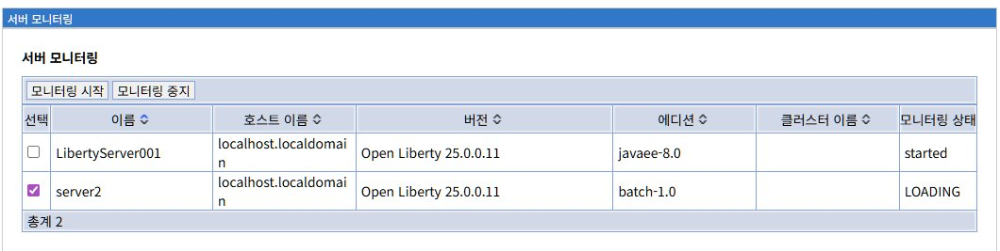

**화면 구성:**

**탭**:
- **모니터링 시작**: 선택한 서버의 모니터링을 활성화
- **모니터링 중지**: 실행 중인 모니터링을 비활성화

**서버 목록 테이블**:

| 컬럼 | 설명 |
|------|------|
| **선택** | 체크박스로 서버 선택 (다중 선택 가능) |
| **이름** | 서버명 (예: LibertyServer001, server2) |
| **호스트 이름** | 서버가 실행 중인 호스트 (예: localhost.localdomain) |
| **버전** | Liberty 버전 (예: Open Liberty 25.0.0.11) |
| **에디션** | Liberty 프로파일 (javaee-8.0, jakartaee-8.0, batch-1.0 등) |
| **클러스터 이름** | 소속된 클러스터 (없으면 빈칸) |
| **모니터링 상태** | started, stopped, disable, LOADING |

**예시 데이터**:
```
이름                 | 호스트 이름              | 버전                    | 에디션        | 클러스터        | 모니터링 상태
LibertyServer001    | localhost.localdomain   | Open Liberty 25.0.0.11 | javaee-8.0   | MyCluster      | started
MyTestServer        | localhost.localdomain   | Open Liberty 25.0.0.11 | jakartaee-8.0| MyServerCluster| disable
server2             | localhost.localdomain   | Open Liberty 25.0.0.11 | batch-1.0    |                | stopped
```

### 모니터링 상태

**가능한 상태**:

| 상태 | 의미 | 설명 |
|------|------|------|
| **started** | 모니터링 중 | 서버가 모니터링되고 있으며, 메트릭 수집 중 |
| **stopped** | 모니터링 중지됨 | 모니터링이 비활성화된 상태 |
| **disable** | 사용 불가 | 서버가 중지되었거나 모니터링 불가능 |
| **LOADING** | 시작 중 | 모니터링이 시작되는 중 (일시적 상태) |

### 모니터링 시작

**프로세스:**

1. **서버 선택**:
   - 체크박스로 모니터링할 서버 선택 (다중 선택 가능)
   - 상태가 "stopped"인 서버만 선택 가능

2. **모니터링 시작 탭 클릭**:
   - 선택한 서버의 모니터링 활성화
   - 상태가 "LOADING"으로 변경

3. **모니터링 활성화**:
   - JMX 연결 수립
   - MBean 등록 확인
   - 메트릭 수집 시작
   - 상태가 "started"로 변경

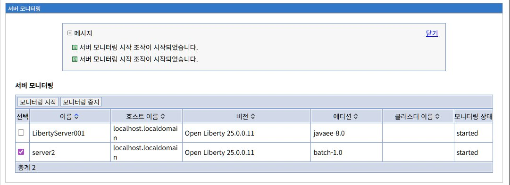

**성공 메시지**:
```
✓ 서버 모니터링 시작 조치이 시작되었습니다.
```

**상태 변화**:
```
stopped → LOADING (2-5초) → started
```


### 모니터링 중지

**프로세스:**

1. **실행 중인 서버 선택**: 상태가 "started"인 서버 선택
2. **모니터링 중지 탭 클릭**: JMX 연결 종료, 메트릭 수집 중지
3. **상태 변경**: "stopped"로 변경

**중지 시 영향**:
- 해당 서버의 메트릭이 대시보드에서 사라짐
- 기존 수집된 데이터는 유지됨
- 서버 자체는 정상 실행 상태 유지

### Liberty server.xml 구성

**모니터링 활성화를 위한 최소 구성**:

```xml
<?xml version="1.0" encoding="UTF-8"?>
<server description="Liberty Server">

    <!-- 모니터링 기능 활성화 -->
    <featureManager>
        <feature>monitor-1.0</feature>
        <feature>jmx-1.0</feature>
    </featureManager>

    <!-- JMX 연결 구성 -->
    <jmxConnector>
        <jmxConnector id="jmx" host="*" port="9010" />
    </jmxConnector>

    <!-- 모니터링 메트릭 필터 -->
    <monitor filter="JVM,WebContainer,Session,ThreadPool,ConnectionPool" />

</server>
```

### WebSphere ND와의 비교

| 기능 | WebSphere ND | LibriX |
|------|--------------|--------|
| **아키텍처** | Deployment Manager → NodeAgent → Server | 배치 관리자 → 노드 에이전트 → Liberty 서버 |
| **모니터링 활성화** | 자동 활성화 (PMI) | 수동 시작/중지 |
| **메트릭 수집** | PMI (Performance Monitoring Infrastructure) | JMX + monitor-1.0 기능 |
| **UI** | 통합 관리 콘솔 (ISC) | LibriX 웹 콘솔 |

---

## 연결 풀 모니터링

### 연결 풀 모니터링 개요

데이터소스 연결 풀의 사용 현황을 실시간으로 모니터링하여, 연결 부족이나 누수를 조기에 감지할 수 있습니다.

**화면 경로:**
```
모니터링 및 문제 분석 > 모니터링 > 연결 풀 모니터링
```

### 연결 풀 모니터링 메인 화면

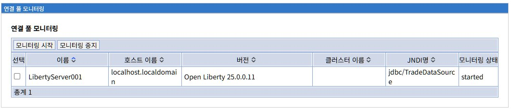

**화면 구성:**

**탭**:
- **모니터링 시작**: 선택한 서버의 연결 풀 모니터링 활성화
- **모니터링 중지**: 실행 중인 모니터링 비활성화

**연결 풀 목록 테이블**:

| 컬럼 | 설명 |
|------|------|
| **선택** | 체크박스로 서버 선택 |
| **이름** | 서버명 |
| **호스트 이름** | 서버 호스트 |
| **버전** | Liberty 버전 |
| **클러스터 이름** | 소속 클러스터 |
| **JNDI명** | 데이터소스 JNDI 이름 (예: jdbc/TradeDataSource) |
| **모니터링 상태** | started, stopped, disable, LOADING |

### 연결 풀 메트릭

**수집되는 메트릭**:

| 메트릭 | 설명 |
|--------|------|
| **생성건수** | 생성된 총 연결 수 |
| **풀정리건수** | 풀에서 제거된 연결 수 |
| **할당량** | 현재 할당된 연결 수 |
| **사용중** | 활성 상태인 연결 수 |
| **여유** | 사용 가능한 유휴 연결 수 |
| **대기시간** | 연결 대기 시간 (ms) |
| **사용시간** | 평균 연결 사용 시간 (ms) |
| **최대값** | 최대 연결 수 (maxPoolSize) |

### Liberty server.xml 구성

**연결 풀 모니터링을 위한 구성**:

```xml
<?xml version="1.0" encoding="UTF-8"?>
<server description="Liberty Server">

    <featureManager>
        <feature>jdbc-4.2</feature>
        <feature>monitor-1.0</feature>
    </featureManager>

    <library id="DB2JCC">
        <fileset dir="${shared.resource.dir}/db2" includes="*.jar"/>
    </library>

    <dataSource id="TradeDataSource" jndiName="jdbc/TradeDataSource">
        <jdbcDriver libraryRef="DB2JCC"/>
        <properties.db2.jcc 
            databaseName="TRADEDB" 
            serverName="localhost" 
            portNumber="50000"/>
        
        <connectionManager 
            maxPoolSize="50"
            minPoolSize="10"
            connectionTimeout="30s" />
    </dataSource>

    <monitor filter="ConnectionPool" />

</server>
```

---

## 네임스페이스 현황

### 네임스페이스 현황 개요

Liberty 서버의 JNDI (Java Naming and Directory Interface) 네임스페이스 구조를 확인하고, 등록된 리소스를 조회할 수 있습니다.

**화면 경로:**
```
모니터링 및 문제 분석 > 모니터링 > 네임스페이스 현황
```

### 네임스페이스 현황 메인 화면

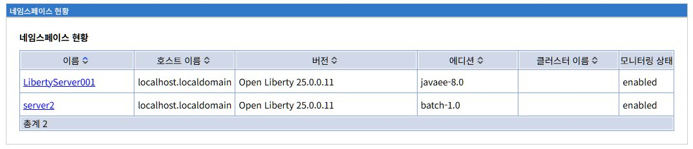

**화면 구성:**

**서버 목록 테이블**:

| 컬럼 | 설명 |
|------|------|
| **이름** | 서버명 (클릭 시 상세 화면으로 이동) |
| **호스트 이름** | 서버 호스트 |
| **버전** | Liberty 버전 |
| **에디션** | Liberty 프로파일 |
| **클러스터 이름** | 소속 클러스터 |
| **모니터링 상태** | enabled (항상 활성화) |

**특징**:
- 모니터링 상태가 항상 "enabled"
- 별도의 시작/중지 버튼 없음
- 서버명 클릭으로 상세 정보 확인

### 네임스페이스 상세 화면

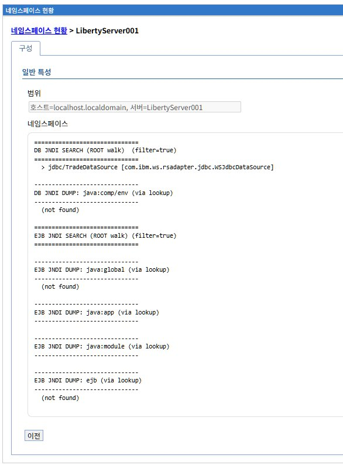

**화면 구성:**

**일반 특성**:
- **범위**: 호스트=localhost.localdomain, 서버=LibertyServer001
- **네임스페이스**: JNDI 트리 구조 표시

**표시 형식**:

```
============================
[카테고리] JNDI SEARCH (ROOT walk) (filter=true)
============================
 > [JNDI 이름] [클래스]
```

**예시 출력**:

```
============================
DB JNDI SEARCH (ROOT walk) (filter=true)
============================
 > jdbc/TradeDataSource [com.ibm.ws.rsadapter.jdbc.WSJdbcDataSource]

============================
EJB JNDI SEARCH (ROOT walk) (filter=true)
============================
 (not found)
```

### JNDI 네임스페이스 카테고리

#### 1. DB JNDI (데이터소스)

**SEARCH (ROOT walk)**:
- 전역 네임스페이스에 등록된 모든 데이터소스 검색
- 형식: `jdbc/[이름]`

**DUMP (java:comp/env)**:
- 애플리케이션 컴포넌트의 로컬 JNDI 컨텍스트
- 리소스 참조 (resource-ref) 확인

#### 2. EJB JNDI (Enterprise JavaBeans)

**java:global**: 전역 네임스페이스, 모든 애플리케이션에서 접근
**java:app**: 애플리케이션 네임스페이스, 같은 앱 내에서만 접근
**java:module**: 모듈 네임스페이스, 같은 모듈 내에서만 접근

---

## 모니터링 대시보드

### 모니터링 대시보드 개요

실시간으로 수집된 서버 및 연결 풀 메트릭을 테이블 형태로 표시하여, 여러 서버의 성능을 한눈에 비교할 수 있습니다.

**화면 경로:**
```
모니터링 및 문제 분석 > 모니터링 > 모니터링 대시보드
```

### 모니터링 대시보드 메인 화면

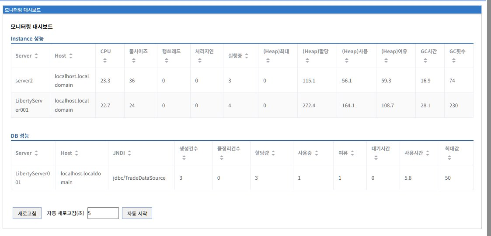

**화면 구성:**

대시보드는 두 개의 주요 섹션으로 구성됩니다:
1. **Instance 성능**: 서버 JVM 메트릭
2. **DB 성능**: 데이터소스 연결 풀 메트릭

### Instance 성능 테이블

**컬럼 구성**:

| 컬럼 | 설명 | 단위 |
|------|------|------|
| **Server** | 서버명 | - |
| **Host** | 호스트명 | - |
| **CPU** | CPU 사용률 | % |
| **풀사이즈** | 스레드 풀 크기 | 개 |
| **행쓰레드** | Hang 스레드 수 | 개 |
| **처리지연** | 요청 처리 지연 시간 | ms |
| **실행중** | 현재 실행 중인 요청 수 | 개 |
| **(Heap)최대** | 최대 힙 크기 | MB |
| **(Heap)할당** | 할당된 힙 크기 | MB |
| **(Heap)사용** | 현재 힙 사용량 | MB |
| **(Heap)여유** | 힙 여유 공간 | MB |
| **GC시간** | 가비지 컬렉션 소요 시간 | ms |
| **GC횟수** | 가비지 컬렉션 발생 횟수 | 회 |

**예시 데이터**:

```
Server           | Host                | CPU  | 풀사이즈 | 행쓰레드 | 처리지연 | 실행중 | (Heap)최대 | (Heap)할당 | (Heap)사용 | (Heap)여유 | GC시간 | GC횟수
server2          | localhost.localdomain| 23.3 | 36      | 0       | 0       | 3     | 0         | 115.1     | 56.1      | 59.3      | 16.9  | 74
LibertyServer001 | localhost.localdomain| 22.7 | 24      | 0       | 0       | 4     | 0         | 272.4     | 164.1     | 108.7     | 28.1  | 230
```

### DB 성능 테이블

**컬럼 구성**:

| 컬럼 | 설명 | 단위 |
|------|------|------|
| **Server** | 서버명 | - |
| **Host** | 호스트명 | - |
| **JNDI** | 데이터소스 JNDI 이름 | - |
| **생성건수** | 생성된 총 연결 수 | 개 |
| **풀정리건수** | 풀에서 제거된 연결 수 | 개 |
| **할당량** | 현재 할당된 연결 수 | 개 |
| **사용중** | 활성 연결 수 | 개 |
| **여유** | 유휴 연결 수 | 개 |
| **대기시간** | 연결 대기 시간 | ms |
| **사용시간** | 평균 연결 사용 시간 | ms |
| **최대값** | 최대 연결 수 (maxPoolSize) | 개 |

**예시 데이터**:

```
Server           | Host                | JNDI                  | 생성건수 | 풀정리건수 | 할당량 | 사용중 | 여유 | 대기시간 | 사용시간 | 최대값
LibertyServer001 | localhost.localdomain| jdbc/TradeDataSource | 3       | 0         | 3     | 1     | 1   | 0       | 5.8     | 50
```

### 자동 새로고침 기능

**화면 하단 컨트롤**:

- **[새로고침]**: 수동 새로고침
- **자동 새로고침(초)**: 갱신 간격 지정
- **[자동 시작]**: 자동 갱신 시작/중지

---

## 모니터링 대시보드 (그래픽)

### 모니터링 대시보드 (그래픽) 개요

시계열 그래프를 통해 서버 및 연결 풀 메트릭의 추세를 시각적으로 분석할 수 있습니다.

**화면 경로:**
```
모니터링 및 문제 분석 > 모니터링 > 모니터링 대시보드 (그래픽)
```

### 그래프 구성

화면은 4개의 시계열 그래프로 구성됩니다:

1. **프로세스별 CPU 사용량 (%)** - CPU 사용률 추이
2. **액티브 쓰레드** - 활성 스레드 수 추이
3. **Heap 사용량 (MB)** - 힙 메모리 사용량 추이
4. **액티브 DB 연결풀** - 활성 DB 연결 수 추이

### 1. 프로세스별 CPU 사용량 (%)

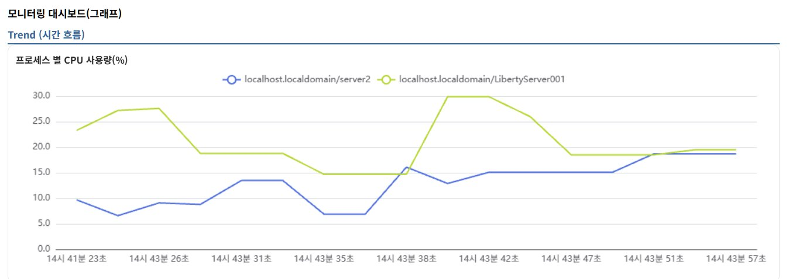

**그래프 특징**:
- **유형**: 라인 차트 (시계열)
- **Y축**: CPU 사용률 (0.0 ~ 30.0%)
- **X축**: 시간 (초 단위)
- **범례**: 🔵 server2, 🟡 LibertyServer001

**정상 패턴**: CPU 사용률이 일정 범위 내에서 변동 (10-30%)
**문제 패턴**: CPU 사용률이 지속적으로 70% 이상

### 2. 액티브 쓰레드

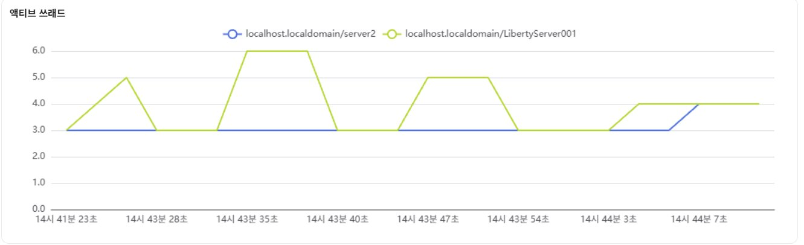

**그래프 특징**:
- **Y축**: 액티브 쓰레드 수 (0.0 ~ 6.0)
- **정상 패턴**: 스레드 수가 완만하게 변동
- **문제 패턴**: 스레드 수가 최대값에 도달

### 3. Heap 사용량 (MB)

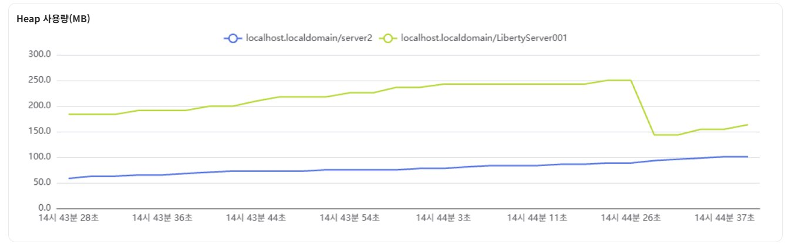

**그래프 특징**:
- **Y축**: Heap 사용량 (0.0 ~ 300.0 MB)

**정상 패턴 (톱니 모양)**:
```
Heap: ↗↙↗↙↗↙ (GC가 주기적으로 메모리 정리)
```

**문제 패턴 (메모리 누수)**:
```
Heap: ↗ ↗ ↗ ↗ (GC 후에도 메모리 미회수)
```

### 4. 액티브 DB 연결풀

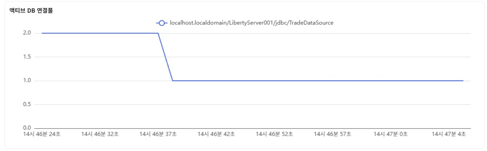

**그래프 특징**:
- **Y축**: 액티브 DB 연결 수
- **정상 패턴**: 연결 수가 낮은 수준 유지 (1-5개)
- **문제 패턴**: 연결 수가 최대값에 근접

### 자동 새로고침 및 추세 제어

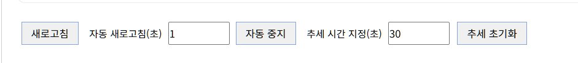

**화면 하단 컨트롤**:

- **[새로고침]**: 수동 새로고침
- **자동 새로고침(초)**: 그래프 갱신 간격 (권장: 1-5초)
- **[자동 증차]**: 자동 갱신 시작/중지
- **추세 시간 지정(초)**: 시계열 범위 설정 (기본: 30초)
- **[추세 초기화]**: 누적 데이터 초기화

---

## 모니터링 모범 사례

### 1. 주기적 점검

```
일일: 대시보드 확인, 이상 징후 확인
주간: 추세 분석, 피크 시간대 확인
월간: 성능 리포트 작성, 최적화 대상 식별
```

### 2. 임계값 설정

**CPU**: 주의 70%, 경고 85%, 위험 95%
**메모리**: 주의 70%, 경고 85%
**스레드**: maxThreads의 70% 이상 시 주의
**DB 연결**: maxPoolSize의 70% 이상 시 주의

### 3. 성능 최적화

**JVM 튜닝**:
```
-Xms2048m
-Xmx2048m
-Xgcpolicy:gencon
```

**스레드 풀 튜닝**:
```xml
<executor 
    name="DefaultExecutor"
    maxThreads="100"
    minThreads="20" />
```

**연결 풀 튜닝**:
```xml
<connectionManager 
    maxPoolSize="100"
    minPoolSize="20"
    connectionTimeout="30s" />
```

---

## 문제 해결

### CPU 사용률 지속 상승

**증상**: CPU 70% 이상 지속
**해결**: 스레드 덤프 수집, 코드 최적화

### 메모리 누수

**증상**: 힙 사용량 계속 증가, GC 후에도 미회수
**해결**: 힙 덤프 수집, Eclipse MAT로 분석

### 스레드 풀 고갈

**증상**: 스레드 수가 maxThreads 도달
**해결**: maxThreads 증가, 슬로우 쿼리 최적화

### DB 연결 풀 고갈

**증상**: 연결 수가 maxPoolSize 도달
**해결**: maxPoolSize 증가, 연결 누수 확인

---

## WebSphere ND와의 비교

| 기능 | WebSphere ND | LibriX |
|------|--------------|--------|
| **모니터링 도구** | Tivoli Performance Viewer | LibriX 모니터링 대시보드 |
| **메트릭 수집** | PMI | JMX + monitor-1.0 |
| **그래프** | 라인, 바, 파이 차트 | 라인 차트 (시계열) |
| **알림** | 임계값 알림 | 없음 (수동 모니터링) |
| **히스토리** | 장기 데이터 저장 | 현재 세션만 |

---

## 다음 단계

- 실시간 모니터링을 시작하려면 **서버 모니터링** 메뉴에서 모니터링을 활성화하십시오.
- 성능 추세를 분석하려면 **모니터링 대시보드 (그래픽)**을 활용하십시오.
- 문제 발생 시 **문제 분석** 메뉴에서 덤프를 생성하여 상세 분석하십시오.
