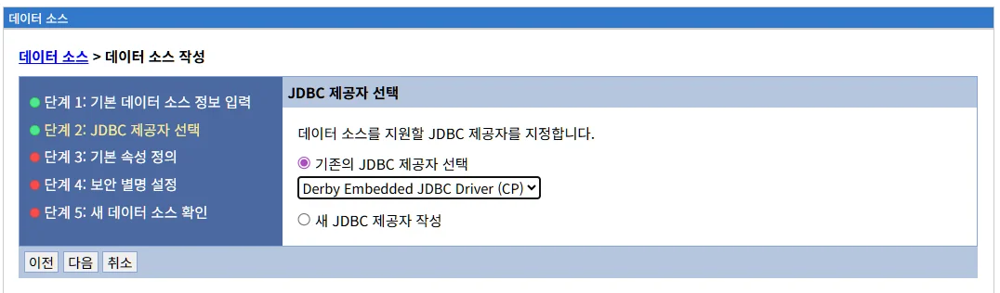
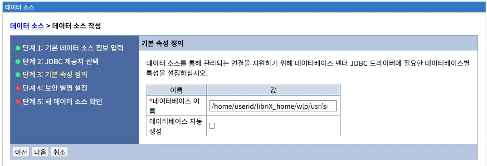
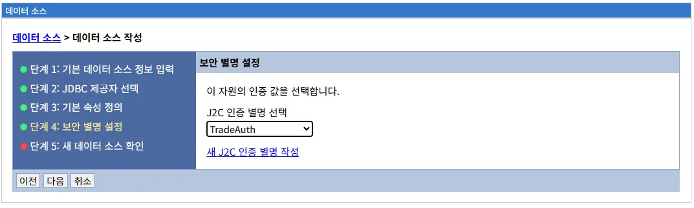
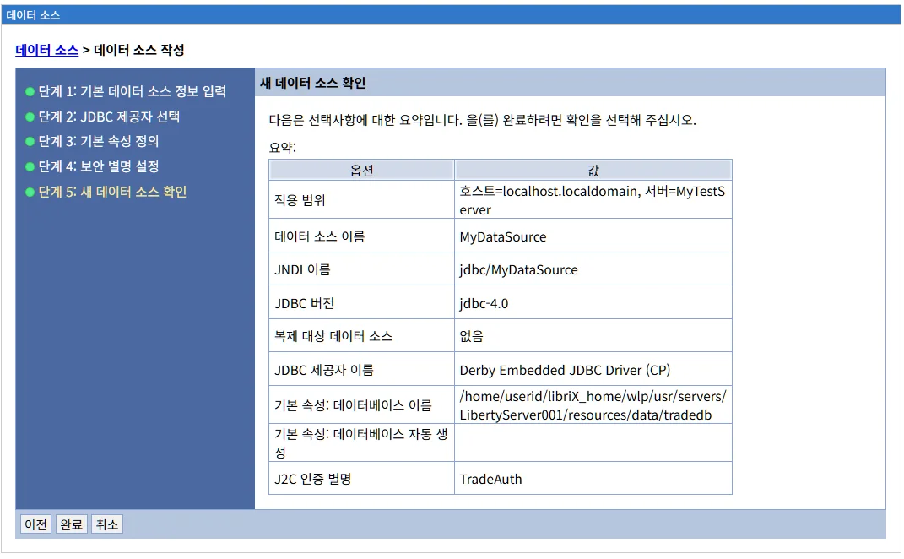

# 데이터소스 관리
데이터소스(Data Source)는 애플리케이션이 데이터베이스에 연결하기 위한 연결 풀(Connection Pool)을 제공하는 Liberty의 핵심 리소스입니다. JNDI를 통한 애플리케이션 접근 제공, 연결 풀링을 통한 성능 최적화, 연결 수명 주기 관리 방법을 설명합니다.

## 목차

- [개요](#개요)
- [데이터소스 메인 화면](#데이터소스-메인-화면)
- [데이터소스 생성](#데이터소스-생성)
- [데이터소스 생성 2단계: JDBC 제공자 선택](#데이터소스-생성-2단계-jdbc-제공자-선택)
- [데이터소스 생성 3단계: 기본 속성 정의](#데이터소스-생성-3단계-기본-속성-정의)
- [데이터소스 생성 4단계: 보안 별칭 설정](#데이터소스-생성-4단계-보안-별칭-설정)
- [데이터소스 생성 5단계: 새 데이터 소스 확인](#데이터소스-생성-5단계-새-데이터-소스-확인)
- [다음 단계](#다음-단계)
- [참고 자료](#참고-자료)

---
## 개요

데이터소스(Data Source)는 애플리케이션이 데이터베이스에 연결하기 위한 연결 풀(Connection Pool)을 제공하는 Liberty의 핵심 리소스입니다.

**주요 역할:**
- 데이터베이스 연결 관리
- 연결 풀링을 통한 성능 최적화
- 연결 수명 주기 관리
- JNDI를 통한 애플리케이션 접근 제공

**JDBC 제공자와의 관계:**
- JDBC 제공자: JDBC 드라이버 정의
- 데이터소스: 실제 데이터베이스 연결 정보 + 연결 풀 설정

**Liberty 구현:**
LibriX의 데이터소스는 Open Liberty의 `<dataSource>` 요소를 기반으로 구현되며, WebSphere Application Server와 유사한 UI를 제공하면서도 Liberty의 경량화된 구조를 활용합니다.

---

## 데이터소스 메인 화면

### 화면 구성


데이터소스 메인 화면은 다음과 같이 구성됩니다:

#### 상단 영역

**범위 선택 드롭다운**
```
범위: [모든 범위 ▼]
```

데이터소스의 범위를 선택하여 필터링합니다.

**범위 옵션:**
- **모든 범위**: 모든 서버/노드의 데이터소스 표시
- **클러스터 범위**: 특정 클러스터의 데이터소스만 표시
- **호스트 범위**: 특정 호스트의 데이터소스만 표시
- **서버 범위**: 특정 서버의 데이터소스만 표시

범위 선택 방식은 JDBC 제공자와 동일합니다.

#### 관리 탭

화면 상단에 세 개의 탭이 있습니다:

**1. 생성 탭**
- 새로운 데이터소스를 생성합니다
- 클릭 시 데이터소스 생성 마법사가 시작됩니다

**2. 삭제 탭**
- 선택한 데이터소스를 삭제합니다
- 하나 이상의 데이터소스를 선택한 후 사용 가능합니다
- 삭제 전 확인 대화상자가 표시됩니다

**3. 연결테스트 탭**
- 선택한 데이터소스의 연결을 테스트합니다
- 데이터베이스 연결 가능 여부를 확인합니다
- 여러 데이터소스를 동시에 테스트할 수 있습니다

**주의사항:**
- 애플리케이션이 사용 중인 데이터소스는 삭제할 수 없습니다
- 삭제하려면 먼저 애플리케이션을 중지하거나 데이터소스 참조를 제거해야 합니다

#### 데이터소스 목록 테이블

목록 테이블은 다음 컬럼으로 구성됩니다:

| 컬럼 | 설명 |
|------|------|
| **선택** | 체크박스를 통해 데이터소스 선택 |
| **이름** | 데이터소스의 고유 이름 (클릭 시 상세 화면으로 이동) |
| **JNDI 이름** | JNDI 조회를 위한 이름 |
| **범위** | 데이터소스가 정의된 범위 (호스트, 서버, 클러스터) |
| **제공자** | 사용하는 JDBC 제공자 |
| **버전** | JDBC 버전 (jdbc-4.0, jdbc-4.2, jdbc-4.3) |

**목록 예시:**

현재 화면에는 다음 데이터소스가 표시되어 있습니다:

```
☐  TradeDataSource
   JNDI: jdbc/TradeDataSource
   범위: 호스트=localhost.localdomain, 서버=LibertyServer001
   제공자: Derby Embedded JDBC Driver
   버전: jdbc-4.0
```

**컬럼 정렬:**
- 각 컬럼 헤더를 클릭하면 오름차순/내림차순으로 정렬됩니다
- 이름, JNDI 이름, 범위, 제공자, 버전 순으로 정렬 가능

**목록 하단:**
```
총계 1
```

등록된 데이터소스의 총 개수를 표시합니다.

### 데이터소스 이름 컬럼 상세

**이름 (Name):**
- 데이터소스의 고유 식별자
- LibriX 관리콘솔에서 표시되는 이름
- 클릭 시 데이터소스 상세 화면으로 이동

**명명 규칙 권장:**
```
패턴: <Application>DataSource

예시:
- TradeDataSource
- HRDataSource
- PayrollDataSource
- CustomerDataSource
```

### JNDI 이름 컬럼 상세

**JNDI 이름 (JNDI Name):**
- Java Naming and Directory Interface 조회 이름
- 애플리케이션에서 데이터소스를 찾을 때 사용하는 이름
- 일반적으로 `jdbc/` 접두사 사용

**JNDI 이름 패턴:**
```
표준 패턴: jdbc/<ApplicationName>

예시:
- jdbc/TradeDataSource
- jdbc/myapp
- jdbc/hr
- jdbc/payroll
```

**애플리케이션에서 사용:**

```java
// JNDI를 통한 데이터소스 조회
InitialContext ctx = new InitialContext();
DataSource ds = (DataSource) ctx.lookup("jdbc/TradeDataSource");
Connection conn = ds.getConnection();
```

**또는 @Resource 어노테이션:**

```java
@Resource(name = "jdbc/TradeDataSource")
private DataSource dataSource;
```

### 범위 컬럼 상세

**범위 (Scope):**
- 데이터소스가 정의된 범위
- JDBC 제공자와 동일한 범위 개념

**범위 표시 형식:**
```
호스트=localhost.localdomain, 서버=LibertyServer001
```

**범위 유형:**
- **클러스터 범위**: `클러스터=MyCluster`
- **호스트 범위**: `호스트=localhost.localdomain`
- **서버 범위**: `호스트=localhost.localdomain, 서버=LibertyServer001`

### 제공자 컬럼 상세

**제공자 (Provider):**
- 데이터소스가 사용하는 JDBC 제공자의 이름
- JDBC 제공자에서 정의한 드라이버 정보 사용

**예시:**
- Derby Embedded JDBC Driver
- MySQL_Production_Driver
- Oracle_Thin_Driver
- PostgreSQL JDBC Driver

**제공자와 데이터소스 관계:**
```
JDBC 제공자 (1) ←──── (N) 데이터소스

하나의 JDBC 제공자로 여러 데이터소스 생성 가능
```

### 버전 컬럼 상세

**버전 (Version):**
- 사용하는 JDBC 스펙 버전
- Liberty 기능과 연동

**JDBC 버전:**
- **jdbc-4.0**: JDBC 4.0 (Java 6+)
- **jdbc-4.1**: JDBC 4.1 (Java 7+)
- **jdbc-4.2**: JDBC 4.2 (Java 8+)
- **jdbc-4.3**: JDBC 4.3 (Java 9+)

**Liberty server.xml에서 기능 활성화:**
```xml
<featureManager>
    <!-- JDBC 4.0 -->
    <feature>jdbc-4.0</feature>
    
    <!-- JDBC 4.2 (권장) -->
    <feature>jdbc-4.2</feature>
    
    <!-- JDBC 4.3 -->
    <feature>jdbc-4.3</feature>
</featureManager>
```

**버전별 주요 기능:**

| 버전 | Java 버전 | 주요 기능 |
|------|----------|----------|
| **JDBC 4.0** | Java 6+ | 기본 JDBC, Connection Pool |
| **JDBC 4.1** | Java 7+ | try-with-resources 지원 |
| **JDBC 4.2** | Java 8+ | Date/Time API, Batch 개선 |
| **JDBC 4.3** | Java 9+ | Connection Sharding |

**권장 버전:**
- 새로운 프로젝트: **jdbc-4.2** (Java 8+)
- Java 11 이상: **jdbc-4.3**
- 레거시: jdbc-4.0 (유지 가능)

---

## 데이터소스 생성

### 생성 마법사 개요

"생성" 탭을 클릭하면 데이터소스 생성 마법사가 시작됩니다.

데이터소스 생성은 5단계로 구성되어 있습니다:
1. **기본 데이터 소스 정보 입력**: 이름, JNDI 이름, JDBC 버전 설정
2. **JDBC 제공자 선택**: 사용할 JDBC 제공자 선택
3. **기본 속성 정의**: 데이터베이스 연결 정보 입력
4. **보안 별칭 설정**: 데이터베이스 인증 정보 설정
5. **새 데이터 소스 확인**: 입력 정보 검토 및 완료

### 1단계: 기본 데이터 소스 정보 입력


**화면 구성:**

좌측 패널에 진행 단계가 표시됩니다:
```
● 단계 1: 기본 데이터 소스 정보 입력  (현재)
○ 단계 2: JDBC 제공자 선택
○ 단계 3: 기본 속성 정의
○ 단계 4: 보안 별칭 설정
○ 단계 5: 새 데이터 소스 확인
```

**화면 설명:**

```
기본 데이터 소스 정보 입력

JDBC 제공자와 연관시킬 데이터 소스의 기본 구성 값을 설정하십시오. 
데이터 소스는 애플리케이션 서버나 데이터베이스 간의 실제 접속을 제공합니다.
```

#### 입력 필드

**1. 범위 (읽기 전용)**

```
범위: 호스트=localhost.localdomain, 서버=MyTestServer
```

- 데이터소스가 생성될 범위
- 목록 화면에서 선택한 범위가 자동으로 설정됩니다
- 읽기 전용 필드입니다
- 변경하려면 취소 후 목록 화면에서 다른 범위를 선택해야 합니다

**범위 선택 가이드:**

```
클러스터 범위:
✓ 클러스터의 모든 멤버에서 사용
✓ 고가용성 환경
✓ 로드 밸런싱

호스트 범위:
✓ 호스트의 모든 서버에서 사용
✓ 개발/테스트 환경
✓ 리소스 공유

서버 범위:
✓ 특정 서버에만 사용
✓ 격리된 환경
✓ 서버별 다른 DB 연결
```

**2. 데이터 소스 이름 *필수**

```
*데이터 소스 이름: [____________________]
```

데이터소스의 고유 식별자를 입력합니다.

**명명 규칙:**
- 영문, 숫자, 언더스코어(_), 하이픈(-) 사용 가능
- 공백 사용 가능하지만 권장하지 않음
- 대소문자 구분
- 같은 범위 내에서 고유해야 함

**명명 패턴 권장:**
```
패턴: <Application>DataSource

예시:
- TradeDataSource
- HRDataSource
- PayrollDataSource
- CustomerDataSource
- OrderDataSource
```

**환경별 명명:**
```
개발: HR_Dev_DataSource
테스트: HR_Test_DataSource
프로덕션: HR_Prod_DataSource
```

**좋은 이름 예시:**
```
✓ TradeDataSource
✓ CustomerDataSource
✓ PayrollDataSource
✓ InventoryDataSource
```

**나쁜 이름 예시:**
```
✗ ds1
✗ datasource
✗ myds
✗ test
```

**3. JNDI 이름 *필수**

```
*JNDI 이름: [____________________]
```

애플리케이션에서 데이터소스를 조회할 때 사용하는 JNDI 이름을 입력합니다.

**JNDI 명명 규칙:**
- 일반적으로 `jdbc/` 접두사 사용
- 소문자 사용 권장
- 슬래시(/) 구분자 사용
- 계층 구조 표현 가능

**JNDI 이름 패턴:**
```
표준 패턴: jdbc/<application>

예시:
- jdbc/trade
- jdbc/hr
- jdbc/payroll
- jdbc/customer
```

**계층 구조 패턴:**
```
jdbc/<application>/<purpose>

예시:
- jdbc/trade/readonly
- jdbc/trade/readwrite
- jdbc/hr/master
- jdbc/hr/slave
```

**환경별 JNDI 이름:**
```
개발: jdbc/hr/dev
테스트: jdbc/hr/test
프로덕션: jdbc/hr/prod
```

**JNDI 이름 vs 데이터소스 이름:**

| 구분 | 데이터소스 이름 | JNDI 이름 |
|------|----------------|-----------|
| **용도** | LibriX 관리용 | 애플리케이션 조회용 |
| **표시** | 관리콘솔 | 애플리케이션 코드 |
| **패턴** | TradeDataSource | jdbc/trade |
| **변경** | 관리자만 가능 | 애플리케이션 영향 |

**애플리케이션에서 JNDI 사용:**

```java
// JNDI 조회 방식
InitialContext ctx = new InitialContext();
DataSource ds = (DataSource) ctx.lookup("jdbc/trade");
Connection conn = ds.getConnection();
```

```java
// @Resource 어노테이션 방식
@Resource(name = "jdbc/trade")
private DataSource dataSource;

public void doWork() {
    Connection conn = dataSource.getConnection();
    // ...
}
```

```xml
<!-- web.xml에서 참조 -->
<resource-ref>
    <res-ref-name>jdbc/trade</res-ref-name>
    <res-type>javax.sql.DataSource</res-type>
    <res-auth>Container</res-auth>
</resource-ref>
```

**4. JDBC 버전 *필수**

```
*JDBC 버전: [선택 ▼]
```

사용할 JDBC 스펙 버전을 선택합니다.

**선택 가능한 JDBC 버전:**
```
선택
jdbc-4.0
jdbc-4.1
jdbc-4.2
jdbc-4.3
```

**JDBC 버전 상세:**

**jdbc-4.0 (Java 6+)**
- JDBC 4.0 스펙
- Java SE 6 이상
- 기본 JDBC 기능
- 레거시 시스템

**주요 기능:**
```
✓ Connection Pool
✓ PreparedStatement
✓ ResultSet
✓ Transaction 관리
```

**jdbc-4.1 (Java 7+)**
- JDBC 4.1 스펙
- Java SE 7 이상
- try-with-resources 지원

**주요 기능:**
```
✓ try-with-resources (AutoCloseable)
✓ RowSet 1.1
✓ 향상된 예외 처리
```

**코드 예시:**
```java
// JDBC 4.1 try-with-resources
try (Connection conn = ds.getConnection();
     PreparedStatement ps = conn.prepareStatement(sql);
     ResultSet rs = ps.executeQuery()) {
    // 자동으로 close() 호출
}
```

**jdbc-4.2 (Java 8+) - 권장**
- JDBC 4.2 스펙
- Java SE 8 이상
- Date/Time API 지원

**주요 기능:**
```
✓ java.time 패키지 지원
✓ Batch 처리 개선
✓ REF Cursor 지원
✓ 대용량 업데이트 카운트
```

**코드 예시:**
```java
// JDBC 4.2 Date/Time API
LocalDateTime now = LocalDateTime.now();
ps.setObject(1, now);

LocalDate date = rs.getObject(1, LocalDate.class);
```

**jdbc-4.3 (Java 9+)**
- JDBC 4.3 스펙
- Java SE 9 이상
- 최신 기능

**주요 기능:**
```
✓ Connection Sharding
✓ 향상된 보안
✓ 모듈 시스템 지원
```

**버전 선택 가이드:**

| 프로젝트 유형 | 권장 버전 | 이유 |
|-------------|----------|------|
| **새 프로젝트** | jdbc-4.2 | Java 8 표준, Date/Time API |
| **Java 11+** | jdbc-4.3 | 최신 기능 |
| **레거시** | jdbc-4.0 | 기존 호환성 유지 |
| **Java 7** | jdbc-4.1 | try-with-resources |

**Liberty server.xml 기능:**

선택한 JDBC 버전에 맞는 Liberty 기능이 자동으로 활성화됩니다:

```xml
<featureManager>
    <!-- JDBC 4.0 -->
    <feature>jdbc-4.0</feature>
    
    <!-- JDBC 4.2 (권장) -->
    <feature>jdbc-4.2</feature>
    
    <!-- JDBC 4.3 -->
    <feature>jdbc-4.3</feature>
</featureManager>
```

**권장 사항:**
- 새로운 프로젝트: **jdbc-4.2** 사용
- Java 8 이상: **jdbc-4.2** 권장
- Java 11 이상: **jdbc-4.3** 고려
- 레거시 유지: jdbc-4.0 가능

**5. 복제 대상 데이터 소스 (선택사항)**

```
복제 대상 데이터 소스: [없음 ▼]
```

기존 데이터소스의 설정을 복사하여 새 데이터소스를 생성할 수 있습니다.

**복제 대상 선택:**
```
없음
TradeDataSource
HRDataSource
PayrollDataSource
(기존 데이터소스 목록)
```

**복제 기능:**
- 기존 데이터소스의 설정을 템플릿으로 사용
- 연결 정보, 연결 풀 설정 등이 자동으로 채워짐
- 이름과 JNDI 이름만 변경하면 됨
- 동일한 구성의 데이터소스를 빠르게 생성

**복제 시나리오:**

**시나리오 1: 환경별 데이터소스**
```
프로덕션 데이터소스를 복제하여:
- 테스트 데이터소스 생성
- 개발 데이터소스 생성
→ 같은 구성, 다른 연결 정보
```

**시나리오 2: 읽기 전용 데이터소스**
```
마스터 데이터소스를 복제하여:
- 읽기 전용 슬레이브 데이터소스 생성
→ 같은 연결 풀 설정, 다른 서버
```

**시나리오 3: 애플리케이션별 데이터소스**
```
공통 데이터소스를 복제하여:
- 각 애플리케이션별 데이터소스 생성
→ 독립적인 연결 풀 관리
```

**복제 시 복사되는 설정:**
- JDBC 제공자
- JDBC 버전
- 데이터베이스 연결 정보 (호스트, 포트, DB명)
- 연결 풀 설정 (최소/최대 연결 수 등)
- 타임아웃 설정
- 사용자 정의 속성

**복제 시 변경 필요:**
- 데이터소스 이름 (필수)
- JNDI 이름 (필수)
- 서버 호스트명/IP (환경별)
- 사용자 이름/비밀번호 (환경별)

**복제 사용 예시:**

```
1. 복제 대상 선택: TradeDataSource
2. 새 이름 입력: TradeDataSource_Test
3. 새 JNDI 이름: jdbc/trade/test
4. 다음 단계에서 서버 주소만 변경
   - 프로덕션: prod-db-01.company.com
   - 테스트: test-db-01.company.com
5. 완료
```

**복제 vs 새로 작성:**

| 방식 | 장점 | 단점 | 사용 시기 |
|------|------|------|----------|
| **복제** | 빠름, 일관성 | 검토 필요 | 유사한 설정 |
| **새로 작성** | 세밀한 제어 | 시간 소요 | 완전히 다른 설정 |

**6. 설명 (선택사항)**

```
설명: [_________________________________]
      [_________________________________]
      [_________________________________]
```

데이터소스에 대한 상세 설명을 입력합니다.

**포함할 내용:**
- 용도 및 목적
- 사용하는 애플리케이션
- 데이터베이스 정보
- 환경 (개발/테스트/프로덕션)
- 담당자 또는 팀
- 연락처

**설명 예시:**

**상세한 설명:**
```
Trade application production database
Server: mysql-prod-01.company.com
Database: trade_production
Environment: Production
Owner: Trade Team (trade-team@company.com)
Connection Pool: 10-50 connections
Created: 2026-01-09
```

**간단한 설명:**
```
Trade application database for production environment
Max connections: 50
```

**최소한의 설명:**
```
Production database for Trade application
```

#### 하단 버튼

```
[다음]  [취소]
```

**다음 버튼:**
- 입력한 정보를 저장하고 2단계로 이동
- 필수 필드 검증 수행

**취소 버튼:**
- 작성 중인 내용을 버리고 목록 화면으로 돌아감

**필수 필드 검증:**

"다음" 버튼 클릭 시 다음 필드가 검증됩니다:
- 데이터 소스 이름 *
- JNDI 이름 *
- JDBC 버전 *

필수 필드가 비어있으면 오류 메시지가 표시됩니다:
```
다음 필수 필드를 입력하십시오:
- 데이터 소스 이름
- JNDI 이름
- JDBC 버전
```

**이름 중복 검증:**

같은 범위 내에 같은 이름의 데이터소스가 있으면:
```
오류: 데이터소스 이름이 이미 존재합니다.
다른 이름을 사용하십시오.
```

**JNDI 이름 중복 검증:**

같은 범위 내에 같은 JNDI 이름이 있으면:
```
경고: JNDI 이름이 이미 사용 중입니다.
애플리케이션에서 혼동이 발생할 수 있습니다.
계속하시겠습니까?
```

### 1단계 작성 팁

**1. 명명 규칙 일관성**

조직 전체에서 일관된 명명 규칙을 사용하세요:

```
데이터소스 이름:
<Application><Purpose>DataSource

예시:
- TradeReadWriteDataSource
- TradeReadOnlyDataSource
- HRMasterDataSource
- HRSlaveDataSource
```

```
JNDI 이름:
jdbc/<application>/<purpose>

예시:
- jdbc/trade/rw
- jdbc/trade/ro
- jdbc/hr/master
- jdbc/hr/slave
```

**2. 환경 식별**

데이터소스 이름에 환경을 명시하면 관리가 쉽습니다:

```
개발: Trade_Dev_DataSource → jdbc/trade/dev
테스트: Trade_Test_DataSource → jdbc/trade/test
스테이징: Trade_Staging_DataSource → jdbc/trade/staging
프로덕션: Trade_Prod_DataSource → jdbc/trade/prod
```

**3. JDBC 버전 선택**

프로젝트의 Java 버전에 맞게 선택:

```
Java 6-7: jdbc-4.0 또는 jdbc-4.1
Java 8: jdbc-4.2 (권장)
Java 9-11: jdbc-4.2 또는 jdbc-4.3
Java 11+: jdbc-4.3 (권장)
```

**4. 복제 활용**

유사한 데이터소스를 여러 개 생성할 때는 복제 기능을 활용:

```
1. 마스터 데이터소스 생성 (완벽하게 설정)
2. 복제하여 슬레이브 데이터소스 생성
3. 서버 주소만 변경
→ 시간 절약, 설정 일관성 보장
```

**5. 문서화**

설명 필드를 활용하여 중요 정보를 기록:

```
필수 정보:
- 용도
- 데이터베이스 서버
- 환경
- 담당자

선택 정보:
- 생성 날짜
- 변경 이력
- 특이사항
```

---

## 데이터소스 생성 2단계: JDBC 제공자 선택



2단계에서는 데이터소스가 사용할 JDBC 제공자를 선택합니다.

**화면 구성:**

좌측 패널에 진행 단계가 표시됩니다:
```
● 단계 1: 기본 데이터 소스 정보 입력  (완료)
● 단계 2: JDBC 제공자 선택         (현재)
○ 단계 3: 기본 속성 정의
○ 단계 4: 보안 별칭 설정
○ 단계 5: 새 데이터 소스 확인
```

**화면 설명:**

```
JDBC 제공자 선택

데이터 소스를 지원할 JDBC 제공자를 지정합니다.
```

### JDBC 제공자 선택 옵션

2단계에서는 두 가지 방법으로 JDBC 제공자를 지정할 수 있습니다:

**1. 기존의 JDBC 제공자 선택 (권장)**

```
● 기존의 JDBC 제공자 선택
  [Derby Embedded JDBC Driver (CP) ▼]
```

이미 생성된 JDBC 제공자 중에서 선택합니다.

**드롭다운 목록:**
- 현재 범위에서 사용 가능한 모든 JDBC 제공자가 표시됩니다
- JDBC 제공자 이름으로 정렬됩니다
- 괄호 안에 구현 유형이 표시됩니다 (CP, XA, DS)

**드롭다운 예시:**
```
선택
Derby Embedded JDBC Driver (CP)
MySQL_Production_Driver (CP)
Oracle_Thin_Driver (CP)
PostgreSQL_Driver (CP)
DB2_JCC_Driver (XA)
```

**구현 유형 약어:**
- **(CP)**: Connection Pool DataSource
- **(XA)**: XA DataSource
- **(DS)**: Simple DataSource

**기존 JDBC 제공자 선택 시 장점:**

```
✓ 빠른 생성
✓ 검증된 드라이버 설정
✓ 중앙 관리된 드라이버
✓ 일관된 구성
✓ 드라이버 업데이트 용이
```

**JDBC 제공자가 없는 경우:**

드롭다운에 선택 가능한 JDBC 제공자가 없다면:
- "새 JDBC 제공자 작성" 옵션을 선택하거나
- 취소 후 먼저 JDBC 제공자를 생성해야 합니다

**메시지:**
```
선택 가능한 JDBC 제공자가 없습니다.
새 JDBC 제공자를 작성하거나 먼저 JDBC 제공자를 생성하십시오.
```

**2. 새 JDBC 제공자 작성**

```
○ 새 JDBC 제공자 작성
```

데이터소스 생성과 함께 새로운 JDBC 제공자를 생성합니다.

**새 JDBC 제공자 작성 선택 시:**
- 이 옵션을 선택하면 JDBC 제공자 생성 마법사가 통합됩니다
- 다음 단계에서 JDBC 제공자 정보를 입력해야 합니다
- 데이터소스와 JDBC 제공자가 함께 생성됩니다

**새 JDBC 제공자 작성 시 추가 단계:**
```
단계 2-1: JDBC 제공자 유형 선택
  - 데이터베이스 유형 (Derby, MySQL, Oracle 등)
  - 제공자 유형
  - 구현 유형

단계 2-2: JDBC 제공자 클래스 경로 입력
  - 드라이버 클래스 경로
  - 구현 클래스 이름
  
단계 3: 기본 속성 정의 (계속)
```

**새 JDBC 제공자 작성 시 장점:**

```
✓ 한 번에 모두 생성
✓ 별도 작업 불필요
✓ 빠른 시작
```

**새 JDBC 제공자 작성 시 단점:**

```
✗ 재사용 어려움
✗ 여러 데이터소스 생성 시 비효율
✗ 중앙 관리 불가
✗ 드라이버 업데이트 시 여러 곳 수정
```

### JDBC 제공자 선택 가이드

**언제 "기존의 JDBC 제공자 선택"을 사용하나요?**

```
권장 상황:
✓ JDBC 제공자가 이미 존재
✓ 여러 데이터소스가 같은 드라이버 사용
✓ 중앙 집중식 드라이버 관리
✓ 프로덕션 환경
✓ 표준화된 환경
```

**예시:**
```
시나리오: MySQL 데이터베이스 여러 개 사용

1. MySQL_Driver JDBC 제공자 1개 생성
2. 여러 데이터소스 생성:
   - CustomerDataSource → MySQL_Driver 사용
   - OrderDataSource → MySQL_Driver 사용
   - ProductDataSource → MySQL_Driver 사용
   
장점: 드라이버 업데이트 시 MySQL_Driver만 수정
```

**언제 "새 JDBC 제공자 작성"을 사용하나요?**

```
사용 상황:
✓ 처음 데이터소스 생성
✓ JDBC 제공자가 없음
✓ 빠른 테스트
✓ 일회성 데이터소스
✓ 독립적인 드라이버 버전 필요
```

**예시:**
```
시나리오: 새 프로젝트 빠른 시작

1. 데이터소스 생성 시작
2. "새 JDBC 제공자 작성" 선택
3. Derby Embedded 드라이버 설정
4. 즉시 사용 가능

적합: 개발 초기, PoC, 데모
```

**권장 프로세스:**

```
1단계: JDBC 제공자 먼저 생성 (권장)
  - 자원 > JDBC 제공자 메뉴
  - 데이터베이스별로 JDBC 제공자 생성
  - 체계적인 명명 규칙 적용

2단계: 데이터소스 생성
  - "기존의 JDBC 제공자 선택" 사용
  - 필요한 JDBC 제공자 선택
  - 연결 정보만 입력

장점:
✓ 재사용 가능
✓ 중앙 관리
✓ 일관성 보장
```

### JDBC 제공자 선택 예시

**예시 1: MySQL 프로덕션 데이터소스**

```
1단계에서 입력:
- 데이터 소스 이름: CustomerDataSource
- JNDI 이름: jdbc/customer
- JDBC 버전: jdbc-4.2

2단계에서 선택:
● 기존의 JDBC 제공자 선택
  [MySQL_Production_Driver (CP)]
  
이유:
- 이미 생성된 MySQL JDBC 제공자 사용
- 다른 데이터소스와 동일한 드라이버 공유
- 중앙 관리
```

**예시 2: Derby 개발 데이터소스 (빠른 시작)**

```
1단계에서 입력:
- 데이터 소스 이름: TestDataSource
- JNDI 이름: jdbc/test
- JDBC 버전: jdbc-4.2

2단계에서 선택:
○ 새 JDBC 제공자 작성
  
이유:
- 빠른 개발 시작
- Derby Embedded 사용 (간단)
- 일회성 테스트
```

**예시 3: Oracle 환경별 데이터소스**

```
시나리오: 개발/테스트/프로덕션 환경

JDBC 제공자 (공통):
- Oracle_Thin_Driver (1개)

데이터소스 (3개):
1. Oracle_Dev_DataSource → Oracle_Thin_Driver
2. Oracle_Test_DataSource → Oracle_Thin_Driver
3. Oracle_Prod_DataSource → Oracle_Thin_Driver

2단계에서 모두:
● 기존의 JDBC 제공자 선택
  [Oracle_Thin_Driver (CP)]
```

### JDBC 제공자와 데이터소스 관계

**1:N 관계:**

```
JDBC 제공자 (1)
    ├── 데이터소스 1
    ├── 데이터소스 2
    └── 데이터소스 3
```

**실제 예시:**

```
MySQL_Driver (JDBC 제공자)
    ├── CustomerDataSource (jdbc/customer)
    ├── OrderDataSource (jdbc/order)
    └── ProductDataSource (jdbc/product)

Oracle_Thin_Driver (JDBC 제공자)
    ├── HRDataSource (jdbc/hr)
    └── PayrollDataSource (jdbc/payroll)

Derby_Embedded_Driver (JDBC 제공자)
    └── TestDataSource (jdbc/test)
```

**JDBC 제공자 역할:**
- JDBC 드라이버 클래스 제공
- 드라이버 JAR 파일 위치 정의
- 드라이버 유형 정의 (CP, XA, DS)

**데이터소스 역할:**
- 실제 데이터베이스 연결 정보 (호스트, 포트, DB명)
- 인증 정보 (사용자, 비밀번호)
- 연결 풀 설정 (최소/최대 연결 수)
- JNDI 이름 제공

### Liberty server.xml 구성 관계

**JDBC 제공자 구성:**
```xml
<library id="MySQLLib">
    <fileset dir="${shared.resource.dir}/jdbc/mysql" 
             includes="mysql-connector-java-8.0.28.jar"/>
</library>

<jdbcDriver id="MySQLDriver" libraryRef="MySQLLib"/>
```

**데이터소스 구성:**
```xml
<dataSource id="CustomerDataSource" jndiName="jdbc/customer">
    <jdbcDriver libraryRef="MySQLLib"/>
    <properties serverName="mysql-prod-01.company.com"
                portNumber="3306"
                databaseName="customer"
                user="customer_user"
                password="********"/>
    <connectionManager maxPoolSize="50" minPoolSize="5"/>
</dataSource>
```

**관계:**
```
데이터소스 → jdbcDriver → library → JAR 파일
```

### 하단 버튼

```
[이전]  [다음]  [취소]
```

**이전 버튼:**
- 1단계(기본 정보 입력)로 돌아갑니다
- 입력한 정보는 유지됩니다

**다음 버튼:**
- 선택한 정보를 저장하고 다음 단계로 이동합니다
- JDBC 제공자 선택 확인

**취소 버튼:**
- 작성 중인 모든 내용을 버립니다
- 목록 화면으로 돌아갑니다

**선택 검증:**

"다음" 버튼 클릭 시:
- "기존의 JDBC 제공자 선택"인 경우: JDBC 제공자가 선택되었는지 확인
- "새 JDBC 제공자 작성"인 경우: 다음 단계에서 JDBC 제공자 정보 입력

**오류 메시지:**
```
JDBC 제공자를 선택하십시오.
```

### 2단계 작성 팁

**1. 기존 JDBC 제공자 우선 사용**

가능하면 기존 JDBC 제공자를 사용하세요:

```
장점:
✓ 빠른 생성
✓ 검증된 설정
✓ 재사용성
✓ 중앙 관리
✓ 일관성

예외:
- 완전히 다른 드라이버 버전
- 특수한 드라이버 설정
- 일회성 테스트
```

**2. JDBC 제공자 사전 계획**

데이터소스를 생성하기 전에 JDBC 제공자를 계획하세요:

```
데이터베이스 조사:
- 어떤 데이터베이스를 사용하나?
- 몇 개의 데이터소스가 필요한가?
- 환경별로 다른 드라이버가 필요한가?

JDBC 제공자 설계:
- 데이터베이스당 1개의 JDBC 제공자
- 명확한 명명 규칙
- 문서화

예시:
- MySQL_Driver → 모든 MySQL 데이터소스
- Oracle_Thin_Driver → 모든 Oracle 데이터소스
- PostgreSQL_Driver → 모든 PostgreSQL 데이터소스
```

**3. 새 JDBC 제공자 작성 시 주의**

"새 JDBC 제공자 작성"을 선택할 때:

```
고려사항:
- 재사용할 예정인가?
  → YES: 별도로 JDBC 제공자 먼저 생성
  → NO: 새 JDBC 제공자 작성 OK

- 같은 데이터베이스의 여러 데이터소스?
  → YES: JDBC 제공자 먼저 생성 (권장)
  → NO: 새 JDBC 제공자 작성 OK

- 프로덕션 환경인가?
  → YES: JDBC 제공자 먼저 생성 (권장)
  → NO: 새 JDBC 제공자 작성 가능
```

**4. JDBC 제공자 명명 확인**

드롭다운에서 JDBC 제공자를 선택할 때 이름을 주의깊게 확인하세요:

```
올바른 선택:
✓ MySQL_Production_Driver (프로덕션 MySQL)
✓ Oracle_Thin_Driver (Oracle Thin)
✓ PostgreSQL_Driver (PostgreSQL)

잘못된 선택:
✗ MySQL_Test_Driver (테스트용 드라이버를 프로덕션에)
✗ Oracle_OCI_Driver (Type 2 드라이버 의도치 않게)
```

**5. 구현 유형 확인**

JDBC 제공자 이름 뒤의 괄호를 확인하세요:

```
(CP): Connection Pool - 일반적인 선택 ✓
(XA): XA DataSource - 분산 트랜잭션 필요 시
(DS): Simple DataSource - 테스트용

예시:
MySQL_Driver (CP) ← 일반 애플리케이션용
MySQL_XA_Driver (XA) ← JTA 분산 트랜잭션용
```

---

## 데이터소스 생성 3단계: 기본 속성 정의



3단계에서는 데이터베이스 연결 정보를 입력합니다.

**화면 구성:**

좌측 패널에 진행 단계가 표시됩니다:
```
● 단계 1: 기본 데이터 소스 정보 입력  (완료)
● 단계 2: JDBC 제공자 선택         (완료)
● 단계 3: 기본 속성 정의           (현재)
○ 단계 4: 보안 별칭 설정
○ 단계 5: 새 데이터 소스 확인
```

**화면 설명:**

```
기본 속성 정의

데이터소스를 통해 관리되는 연결을 지원하기 위해 데이터베이스 벤더 JDBC 드라이버에 
필요한 데이터베이스별 특성을 설정하십시오.
```

### 입력 필드

3단계의 입력 필드는 2단계에서 선택한 JDBC 제공자의 데이터베이스 유형에 따라 달라집니다.

#### Derby Embedded 속성

화면에 표시된 Derby Embedded의 경우:

**1. 데이터베이스 이름 *필수**

```
*데이터베이스 이름: [/home/userid/libriX_home/wlp/usr/servers/...]
```

Derby Embedded 모드의 데이터베이스 경로를 입력합니다.

**입력 형식:**
- 절대 경로 또는 상대 경로
- 디렉토리 경로 (데이터베이스가 저장될 위치)
- Derby가 자동으로 데이터베이스 파일 생성

**경로 예시:**
```
절대 경로:
/home/userid/databases/mydb
/opt/derby/data/tradedb
/var/lib/derby/testdb

상대 경로:
databases/mydb
data/mydb

Liberty 변수 사용:
${server.config.dir}/databases/mydb
${wlp.user.dir}/shared/databases/mydb
```

**데이터베이스 생성:**
- Derby Embedded는 경로에 데이터베이스가 없으면 자동 생성합니다
- 아래 "데이터베이스 자동 생성" 옵션 사용

**2. 데이터베이스 자동 생성 (선택사항)**

```
데이터베이스 자동 생성: ☐
```

데이터베이스가 존재하지 않을 때 자동으로 생성할지 여부를 선택합니다.

**체크박스 옵션:**
- **체크 ☑**: 데이터베이스가 없으면 자동 생성
- **체크 해제 ☐**: 데이터베이스가 없으면 연결 실패

**자동 생성 권장 사항:**

```
체크 권장:
✓ 개발 환경
✓ 테스트 환경
✓ 새로운 데이터베이스
✓ PoC/데모

체크 해제 권장:
✓ 프로덕션 환경
✓ 기존 데이터베이스
✓ 명시적 생성 필요
```

**Liberty server.xml 구성:**

```xml
<dataSource id="TradeDataSource" jndiName="jdbc/trade">
    <jdbcDriver libraryRef="DerbyLib"/>
    <properties.derby.embedded 
        databaseName="${server.config.dir}/databases/tradedb"
        createDatabase="create"/>  <!-- 자동 생성 -->
</dataSource>
```

체크 해제 시:
```xml
<properties.derby.embedded 
    databaseName="${server.config.dir}/databases/tradedb"/>
<!-- createDatabase 속성 없음 -->
```

### 데이터베이스별 속성 필드

3단계의 입력 필드는 데이터베이스 유형에 따라 다릅니다. 각 데이터베이스별로 필요한 속성을 살펴보겠습니다.

#### Derby Network Client

**필수 필드:**

**1. 서버 이름**
```
서버 이름: [localhost]
```
Derby Network Server의 호스트명 또는 IP 주소

**2. 포트 번호**
```
포트 번호: [1527]
```
Derby Network Server 포트 (기본값: 1527)

**3. 데이터베이스 이름**
```
데이터베이스 이름: [myDB]
```
데이터베이스 이름

**Liberty 구성:**
```xml
<properties.derby.client
    serverName="localhost"
    portNumber="1527"
    databaseName="myDB"/>
```

#### MySQL / MariaDB

**필수 필드:**

**1. 서버 이름 *필수**
```
*서버 이름: [mysql-prod-01.company.com]
```
MySQL 서버의 호스트명 또는 IP 주소

**2. 포트 번호 *필수**
```
*포트 번호: [3306]
```
MySQL 포트 번호 (기본값: 3306)

**3. 데이터베이스 이름 *필수**
```
*데이터베이스 이름: [myapp]
```
연결할 데이터베이스(스키마) 이름

**선택 필드:**

**4. 문자 인코딩**
```
문자 인코딩: [UTF-8]
```
문자셋 설정 (UTF-8, latin1, euckr 등)

**5. 서버 타임존**
```
서버 타임존: [Asia/Seoul]
```
MySQL 8.0 이상에서 필요

**6. SSL 사용**
```
SSL 사용: ☐
```
SSL/TLS 암호화 연결 사용 여부

**Liberty 구성:**
```xml
<properties.mysql
    serverName="mysql-prod-01.company.com"
    portNumber="3306"
    databaseName="myapp"
    characterEncoding="UTF-8"
    serverTimezone="Asia/Seoul"
    useSSL="true"/>
```

#### Oracle

**필수 필드:**

**1. 서버 이름 *필수**
```
*서버 이름: [oracle-prod-01.company.com]
```
Oracle 서버의 호스트명 또는 IP 주소

**2. 포트 번호 *필수**
```
*포트 번호: [1521]
```
Oracle 리스너 포트 (기본값: 1521)

**3. 데이터베이스 식별 방법**

**방법 A: SID 사용**
```
SID: [ORCL]
```
Oracle System Identifier

**방법 B: Service Name 사용**
```
Service Name: [myservice.company.com]
```
Oracle Service Name (권장)

**둘 중 하나만 입력:**
- SID: 레거시 방식
- Service Name: 최신 권장 방식

**선택 필드:**

**4. 연결 유형**
```
연결 유형: ● Thin  ○ OCI
```
- **Thin**: Type 4 드라이버 (권장)
- **OCI**: Type 2 드라이버 (네이티브)

**Liberty 구성 (SID):**
```xml
<properties.oracle
    serverName="oracle-prod-01.company.com"
    portNumber="1521"
    databaseName="ORCL"/>  <!-- SID -->
```

**Liberty 구성 (Service Name):**
```xml
<properties.oracle
    URL="jdbc:oracle:thin:@//oracle-prod-01.company.com:1521/myservice.company.com"/>
```

#### PostgreSQL

**필수 필드:**

**1. 서버 이름 *필수**
```
*서버 이름: [postgres-prod-01.company.com]
```
PostgreSQL 서버의 호스트명 또는 IP 주소

**2. 포트 번호 *필수**
```
*포트 번호: [5432]
```
PostgreSQL 포트 (기본값: 5432)

**3. 데이터베이스 이름 *필수**
```
*데이터베이스 이름: [myapp]
```
연결할 데이터베이스 이름

**선택 필드:**

**4. 스키마**
```
스키마: [public]
```
기본 스키마 (기본값: public)

**5. SSL 모드**
```
SSL 모드: [prefer ▼]
```
- disable: SSL 사용 안 함
- allow: 가능하면 SSL
- prefer: SSL 우선 (기본값)
- require: SSL 필수
- verify-ca: SSL + CA 검증
- verify-full: SSL + 전체 검증

**Liberty 구성:**
```xml
<properties.postgresql
    serverName="postgres-prod-01.company.com"
    portNumber="5432"
    databaseName="myapp"
    currentSchema="public"
    ssl="true"
    sslmode="prefer"/>
```

#### Microsoft SQL Server

**필수 필드:**

**1. 서버 이름 *필수**
```
*서버 이름: [sqlserver-prod-01.company.com]
```
SQL Server의 호스트명 또는 IP 주소

**인스턴스 포함 가능:**
```
sqlserver-prod-01.company.com\INSTANCE01
```

**2. 포트 번호 *필수**
```
*포트 번호: [1433]
```
SQL Server 포트 (기본값: 1433)

**3. 데이터베이스 이름 *필수**
```
*데이터베이스 이름: [MyAppDB]
```
연결할 데이터베이스 이름

**선택 필드:**

**4. 암호화 사용**
```
암호화 사용: ☑
```
TLS/SSL 암호화 연결

**5. 인증 방식**
```
인증 방식: ● SQL Server  ○ Windows  ○ Azure AD
```
- SQL Server: 사용자/비밀번호 인증
- Windows: Windows 통합 인증
- Azure AD: Azure Active Directory

**Liberty 구성:**
```xml
<properties.microsoft.sqlserver
    serverName="sqlserver-prod-01.company.com"
    portNumber="1433"
    databaseName="MyAppDB"
    encrypt="true"
    trustServerCertificate="false"/>
```

#### DB2

**필수 필드:**

**1. 서버 이름 *필수**
```
*서버 이름: [db2-prod-01.company.com]
```
DB2 서버의 호스트명 또는 IP 주소

**2. 포트 번호 *필수**
```
*포트 번호: [50000]
```
DB2 포트 (기본값: 50000)

**3. 데이터베이스 이름 *필수**
```
*데이터베이스 이름: [MYDB]
```
DB2 데이터베이스 이름

**선택 필드:**

**4. 드라이버 유형**
```
드라이버 유형: [4 ▼]
```
- 4: Type 4 (JCC) - 권장
- 2: Type 2 (CLI)

**Liberty 구성:**
```xml
<properties.db2.jcc
    serverName="db2-prod-01.company.com"
    portNumber="50000"
    databaseName="MYDB"
    driverType="4"/>
```

### 속성 입력 팁

**1. 호스트명 사용 권장**

IP 주소보다 호스트명 사용을 권장합니다:

```
✓ 권장: mysql-prod-01.company.com
✗ 비권장: 192.168.1.100

이유:
- IP 변경 시 설정 수정 불필요
- DNS 기반 로드 밸런싱 가능
- 가독성 향상
```

**2. 환경별 네이밍**

환경에 따라 명확한 호스트명 사용:

```
개발: mysql-dev-01.company.com
테스트: mysql-test-01.company.com
스테이징: mysql-staging-01.company.com
프로덕션: mysql-prod-01.company.com
```

**3. 기본 포트 사용**

보안상 이유가 없다면 기본 포트 사용:

```
MySQL: 3306
PostgreSQL: 5432
Oracle: 1521
SQL Server: 1433
DB2: 50000
```

**4. 데이터베이스 이름 명확화**

명확하고 설명적인 데이터베이스 이름:

```
✓ 좋은 예:
- trade_production
- hr_master
- customer_data

✗ 나쁜 예:
- db1
- test
- mydb
```

**5. SSL/TLS 사용**

프로덕션 환경에서는 암호화 연결 사용:

```
✓ SSL/TLS 활성화
✓ 인증서 검증
✓ 안전한 통신
```

### 연결 테스트 권장

3단계 입력 후 연결 테스트를 권장합니다:

**테스트 방법:**
1. 필수 필드 모두 입력
2. "다음" 대신 임시 저장
3. 데이터소스 목록에서 "연결테스트" 실행
4. 성공 확인 후 계속 진행

**연결 실패 시 확인사항:**
```
□ 서버 호스트명/IP가 정확한가?
□ 포트 번호가 올바른가?
□ 데이터베이스가 존재하는가?
□ 네트워크 접근이 가능한가?
□ 방화벽 규칙이 올바른가?
□ 데이터베이스가 실행 중인가?
```

### 하단 버튼

```
[이전]  [다음]  [취소]
```

**이전 버튼:**
- 2단계(JDBC 제공자 선택)로 돌아갑니다

**다음 버튼:**
- 입력한 정보를 저장하고 4단계로 이동합니다
- 필수 필드 검증 수행

**취소 버튼:**
- 작성 중인 모든 내용을 버립니다

**필수 필드 검증:**

데이터베이스별로 필수 필드가 다릅니다. 예시:

**MySQL 필수 필드:**
```
- 서버 이름 *
- 포트 번호 *
- 데이터베이스 이름 *
```

필수 필드가 비어있으면:
```
다음 필수 필드를 입력하십시오:
- 서버 이름
- 데이터베이스 이름
```

---

## 데이터소스 생성 4단계: 보안 별칭 설정



4단계에서는 데이터베이스 인증 정보를 설정합니다.

**화면 구성:**

좌측 패널에 진행 단계가 표시됩니다:
```
● 단계 1: 기본 데이터 소스 정보 입력  (완료)
● 단계 2: JDBC 제공자 선택         (완료)
● 단계 3: 기본 속성 정의           (완료)
● 단계 4: 보안 별칭 설정           (현재)
○ 단계 5: 새 데이터 소스 확인
```

**화면 설명:**

```
보안 별칭 설정

이 자원의 인증 값을 선택합니다.
```

### J2C 인증 별칭

**J2C 인증 별칭 선택:**

```
J2C 인증 별칭 선택
[TradeAuth ▼]
```

데이터베이스 연결을 위한 인증 정보(사용자 이름/비밀번호)를 저장한 J2C 인증 별칭을 선택합니다.

**J2C 인증 별칭이란?**

J2C (Java 2 Connector) 인증 별칭은 데이터베이스나 다른 리소스에 접근하기 위한 인증 정보를 중앙에서 관리하는 메커니즘입니다.

**구성 요소:**
- 별칭 이름: 인증 정보를 식별하는 고유 이름
- 사용자 이름: 데이터베이스 사용자 ID
- 비밀번호: 데이터베이스 비밀번호

**장점:**
```
✓ 중앙 집중식 인증 정보 관리
✓ 비밀번호 암호화 저장
✓ 여러 데이터소스에서 재사용
✓ 보안 강화
✓ 비밀번호 변경 시 한 곳만 수정
```

### 드롭다운 옵션

**1. 기존 J2C 인증 별칭 선택**

드롭다운에서 기존에 생성된 J2C 인증 별칭을 선택합니다.

**드롭다운 목록 예시:**
```
선택
TradeAuth
HRAuth
PayrollAuth
CustomerAuth
MySQL_Production_Auth
Oracle_HR_Auth
```

**별칭 선택 시:**
- 해당 별칭에 저장된 사용자 이름과 비밀번호가 자동으로 사용됩니다
- 별도로 사용자 정보를 입력할 필요가 없습니다

**2. 새 J2C 인증 별칭 작성**

```
새 J2C 인증 별칭 작성
```

링크를 클릭하면 새로운 J2C 인증 별칭 생성 화면으로 이동합니다.

**새 인증 별칭 생성 시 입력 정보:**

**별칭 이름:**
```
별칭: [MySQL_Production_Auth]
```
- 인증 정보를 식별하는 고유 이름
- 영문, 숫자, 언더스코어 사용 권장
- 의미 있는 이름 사용

**사용자 이름:**
```
사용자 이름: [myapp_user]
```
- 데이터베이스 사용자 ID
- 데이터베이스에서 생성한 사용자

**비밀번호:**
```
비밀번호: [********]
비밀번호 확인: [********]
```
- 데이터베이스 사용자의 비밀번호
- 암호화되어 저장됩니다
- 확인을 위해 두 번 입력

**설명 (선택사항):**
```
설명: [MySQL production database authentication for trade application]
```
- 인증 별칭의 용도 설명
- 어떤 데이터베이스에 사용되는지 명시

**생성 후:**
- 새로 만든 인증 별칭이 드롭다운에 자동으로 추가됩니다
- 데이터소스 생성이 계속 진행됩니다

### J2C 인증 별칭 명명 규칙

**명명 패턴 권장:**

```
패턴 1: <Database>_<Environment>_Auth
예시:
- MySQL_Production_Auth
- Oracle_Test_Auth
- PostgreSQL_Dev_Auth

패턴 2: <Application>_<Database>_Auth
예시:
- Trade_MySQL_Auth
- HR_Oracle_Auth
- Customer_PostgreSQL_Auth

패턴 3: <Purpose>Auth
예시:
- TradeAuth
- HRAuth
- PayrollAuth
```

**환경별 인증 별칭:**

```
개발: Trade_Dev_Auth
  - 사용자: trade_dev_user
  - 비밀번호: dev_password

테스트: Trade_Test_Auth
  - 사용자: trade_test_user
  - 비밀번호: test_password

프로덕션: Trade_Prod_Auth
  - 사용자: trade_prod_user
  - 비밀번호: prod_password
```

### J2C 인증 별칭과 데이터소스 관계

**1:N 관계:**

하나의 J2C 인증 별칭을 여러 데이터소스에서 사용할 수 있습니다.

```
MySQL_Production_Auth (J2C 인증 별칭)
    ├── CustomerDataSource (jdbc/customer)
    ├── OrderDataSource (jdbc/order)
    └── ProductDataSource (jdbc/product)
```

**시나리오:**

같은 데이터베이스 서버의 여러 데이터베이스:
```
MySQL 서버: mysql-prod-01.company.com

데이터베이스:
- customer_db → CustomerDataSource
- order_db → OrderDataSource
- product_db → ProductDataSource

모두 같은 사용자:
- 사용자: mysql_app_user
- 비밀번호: ********

J2C 인증 별칭:
- MySQL_App_Auth (한 번만 생성)
→ 세 개의 데이터소스 모두 사용
```

**장점:**
- 인증 정보를 한 곳에서 관리
- 비밀번호 변경 시 한 번만 수정
- 일관성 보장

### Liberty server.xml 구성

**J2C 인증 별칭 구성:**

```xml
<authData id="TradeAuth" 
          user="trade_user" 
          password="{xor}Lz4sLChvLTs="/>
```

**비밀번호 암호화:**
- Liberty는 비밀번호를 XOR 인코딩으로 저장합니다
- `securityUtility encode` 명령으로 암호화 가능
- 평문 비밀번호는 자동으로 암호화됩니다

**암호화 명령:**
```bash
# 비밀번호 암호화
${wlp.install.dir}/bin/securityUtility encode mypassword

# 출력:
{xor}Lz4sLChvLTs=
```

**데이터소스에서 인증 별칭 사용:**

```xml
<dataSource id="TradeDataSource" jndiName="jdbc/trade">
    <jdbcDriver libraryRef="MySQLLib"/>
    <properties serverName="mysql-prod-01.company.com"
                portNumber="3306"
                databaseName="trade"/>
    <containerAuthData ref="TradeAuth"/>
</dataSource>
```

**또는 직접 인증 정보 지정:**

```xml
<dataSource id="TradeDataSource" jndiName="jdbc/trade">
    <jdbcDriver libraryRef="MySQLLib"/>
    <properties serverName="mysql-prod-01.company.com"
                portNumber="3306"
                databaseName="trade"
                user="trade_user"
                password="{xor}Lz4sLChvLTs="/>
</dataSource>
```

**권장 방식:**
- 프로덕션: J2C 인증 별칭 사용 (중앙 관리)
- 개발/테스트: 직접 지정 가능

### 인증 별칭 vs 직접 인증

| 항목 | J2C 인증 별칭 | 직접 인증 |
|------|--------------|----------|
| **관리** | 중앙 집중식 | 분산 |
| **재사용** | 여러 데이터소스 | 단일 데이터소스 |
| **비밀번호 변경** | 한 곳만 수정 | 모든 데이터소스 수정 |
| **보안** | 높음 | 중간 |
| **사용 사례** | 프로덕션 환경 | 개발/테스트 |

### 인증 별칭 선택 가이드

**J2C 인증 별칭 사용 권장:**

```
✓ 프로덕션 환경
✓ 여러 데이터소스가 같은 DB 사용자
✓ 보안이 중요한 환경
✓ 비밀번호 정기 변경
✓ 감사(Audit) 필요
```

**직접 인증 정보 입력:**

```
✓ 개발 환경
✓ 간단한 테스트
✓ PoC/데모
✓ 각 데이터소스마다 다른 사용자
```

### 데이터베이스 사용자 권한

J2C 인증 별칭에 사용할 데이터베이스 사용자는 적절한 권한이 있어야 합니다.

**필수 권한:**

**MySQL:**
```sql
-- 사용자 생성
CREATE USER 'myapp_user'@'%' IDENTIFIED BY 'password';

-- 권한 부여
GRANT SELECT, INSERT, UPDATE, DELETE ON myapp.* TO 'myapp_user'@'%';
FLUSH PRIVILEGES;
```

**Oracle:**
```sql
-- 사용자 생성
CREATE USER myapp_user IDENTIFIED BY password;

-- 권한 부여
GRANT CONNECT, RESOURCE TO myapp_user;
GRANT SELECT, INSERT, UPDATE, DELETE ON schema.table TO myapp_user;
```

**PostgreSQL:**
```sql
-- 사용자 생성
CREATE USER myapp_user WITH PASSWORD 'password';

-- 권한 부여
GRANT CONNECT ON DATABASE myapp TO myapp_user;
GRANT SELECT, INSERT, UPDATE, DELETE ON ALL TABLES IN SCHEMA public TO myapp_user;
```

**SQL Server:**
```sql
-- 로그인 생성
CREATE LOGIN myapp_user WITH PASSWORD = 'password';

-- 데이터베이스 사용자 생성
CREATE USER myapp_user FOR LOGIN myapp_user;

-- 권한 부여
EXEC sp_addrolemember 'db_datareader', 'myapp_user';
EXEC sp_addrolemember 'db_datawriter', 'myapp_user';
```

**DB2:**
```sql
-- 사용자 생성 (OS 사용자 필요)
CONNECT TO mydb;

-- 권한 부여
GRANT CONNECT ON DATABASE TO USER myapp_user;
GRANT SELECT, INSERT, UPDATE, DELETE ON TABLE schema.table TO USER myapp_user;
```

**최소 권한 원칙:**
- 애플리케이션에 필요한 최소한의 권한만 부여
- DDL 권한(CREATE, DROP, ALTER)은 가급적 부여하지 않음
- 프로덕션과 개발 환경의 권한 분리

### 보안 모범 사례

**1. 강력한 비밀번호 사용**

```
✓ 최소 12자 이상
✓ 대소문자, 숫자, 특수문자 포함
✓ 사전 단어 사용 금지
✓ 주기적 변경 (90일 권장)
```

**2. 환경별 인증 정보 분리**

```
개발: 약한 비밀번호 허용 (dev123)
테스트: 중간 수준 비밀번호
프로덕션: 강력한 비밀번호 필수
```

**3. 인증 정보 공유 최소화**

```
각 애플리케이션별 전용 사용자:
- trade_app → trade_user
- hr_app → hr_user
- payroll_app → payroll_user
```

**4. 비밀번호 로테이션**

```
프로덕션: 90일마다 변경
테스트: 180일마다 변경
개발: 1년마다 변경
```

**5. 감사 로그 활성화**

```
데이터베이스 접속 기록:
- 누가 (사용자)
- 언제 (타임스탬프)
- 무엇을 (쿼리)
```

### 하단 버튼

```
[이전]  [다음]  [취소]
```

**이전 버튼:**
- 3단계(기본 속성 정의)로 돌아갑니다

**다음 버튼:**
- 선택한 인증 정보를 저장하고 5단계로 이동합니다
- J2C 인증 별칭 선택 확인

**취소 버튼:**
- 작성 중인 모든 내용을 버립니다

**선택 검증:**

J2C 인증 별칭을 선택하지 않으면:
```
경고: J2C 인증 별칭이 선택되지 않았습니다.
데이터베이스 연결 시 인증 정보가 없어 실패할 수 있습니다.
계속하시겠습니까?

[예]  [아니오]
```

**인증 없이 계속:**
- Derby Embedded 등 인증이 필요 없는 경우
- 나중에 수동으로 설정할 경우
- 테스트 목적

### 4단계 작성 팁

**1. 인증 별칭 사전 생성**

데이터소스 생성 전에 J2C 인증 별칭을 미리 생성하면 빠릅니다:

```
사전 작업:
1. 보안 > J2C 인증 데이터 메뉴
2. 필요한 인증 별칭 모두 생성
3. 데이터소스 생성 시 선택만 하면 됨
```

**2. 환경별 인증 별칭 준비**

```
개발 환경:
- MySQL_Dev_Auth
- Oracle_Dev_Auth
- PostgreSQL_Dev_Auth

테스트 환경:
- MySQL_Test_Auth
- Oracle_Test_Auth
- PostgreSQL_Test_Auth

프로덕션:
- MySQL_Prod_Auth
- Oracle_Prod_Auth
- PostgreSQL_Prod_Auth
```

**3. 명명 규칙 일관성**

조직 전체에서 일관된 명명 규칙 사용:

```
<Database>_<Environment>_Auth
```

**4. 인증 정보 문서화**

```
J2C 인증 별칭: MySQL_Prod_Auth
- 사용자: mysql_prod_user
- 용도: 프로덕션 MySQL 데이터베이스
- 권한: SELECT, INSERT, UPDATE, DELETE
- 변경 주기: 90일
- 담당자: DBA 팀
```

**5. 테스트 계정 분리**

프로덕션과 테스트 계정 분리:

```
프로덕션:
- 사용자: prod_user
- 비밀번호: 강력
- 권한: 최소

테스트:
- 사용자: test_user
- 비밀번호: 중간
- 권한: 확장
```

---

## 데이터소스 생성 5단계: 새 데이터 소스 확인



5단계에서는 입력한 모든 정보를 검토하고 확인합니다.

**화면 구성:**

좌측 패널에 진행 단계가 표시됩니다:
```
● 단계 1: 기본 데이터 소스 정보 입력  (완료)
● 단계 2: JDBC 제공자 선택         (완료)
● 단계 3: 기본 속성 정의           (완료)
● 단계 4: 보안 별칭 설정           (완료)
● 단계 5: 새 데이터 소스 확인      (현재)
```

**화면 설명:**

```
새 데이터 소스 확인

다음은 선택사항에 대한 요약입니다. 올(를) 완료하려면 확인을 선택해 주십시오.
```

### 요약 정보 테이블

입력한 모든 설정 정보가 표 형식으로 표시됩니다:

| 옵션 | 값 |
|------|-----|
| **적용 범위** | 호스트=localhost.localdomain, 서버=MyTestServer |
| **데이터 소스 이름** | MyDataSource |
| **JNDI 이름** | jdbc/MyDataSource |
| **JDBC 버전** | jdbc-4.0 |
| **복제 대상 데이터 소스** | 없음 |
| **JDBC 제공자 이름** | Derby Embedded JDBC Driver (CP) |
| **기본 속성: 데이터베이스 이름** | /home/userid/libriX_home/wlp/usr/servers/LibertyServer001/resources/data/tradedb |
| **기본 속성: 데이터베이스 자동 생성** | |
| **J2C 인증 별명** | TradeAuth |

### 요약 정보 설명

**1. 적용 범위**
- 데이터소스가 생성될 범위
- 이 범위 내의 서버에서 사용 가능

**2. 데이터 소스 이름**
- LibriX 관리콘솔에서 표시되는 이름
- 1단계에서 입력한 이름

**3. JNDI 이름**
- 애플리케이션에서 조회할 때 사용하는 이름
- `jdbc/MyDataSource` 형식

**4. JDBC 버전**
- 사용할 JDBC 스펙 버전
- jdbc-4.0, jdbc-4.2, jdbc-4.3 등

**5. 복제 대상 데이터 소스**
- 복제 기능을 사용한 경우 원본 데이터소스 이름
- 사용하지 않은 경우 "없음"

**6. JDBC 제공자 이름**
- 선택한 JDBC 제공자
- 괄호 안에 구현 유형 표시 (CP, XA, DS)

**7. 기본 속성**
- 데이터베이스별로 다른 속성 표시
- 현재 예시는 Derby Embedded:
  - 데이터베이스 이름 (경로)
  - 데이터베이스 자동 생성 옵션

**8. J2C 인증 별명**
- 선택한 인증 정보
- 데이터베이스 접속 사용자/비밀번호

### 데이터베이스별 요약 정보 예시

요약 화면에 표시되는 정보는 데이터베이스 유형에 따라 다릅니다.

**MySQL 데이터소스 요약:**
```
적용 범위: 호스트=localhost.localdomain, 서버=LibertyServer001
데이터 소스 이름: CustomerDataSource
JNDI 이름: jdbc/customer
JDBC 버전: jdbc-4.2
JDBC 제공자 이름: MySQL_Driver (CP)
기본 속성: 서버 이름: mysql-prod-01.company.com
기본 속성: 포트 번호: 3306
기본 속성: 데이터베이스 이름: customer
J2C 인증 별명: MySQL_Prod_Auth
```

**Oracle 데이터소스 요약:**
```
적용 범위: 호스트=localhost.localdomain, 서버=LibertyServer001
데이터 소스 이름: HRDataSource
JNDI 이름: jdbc/hr
JDBC 버전: jdbc-4.2
JDBC 제공자 이름: Oracle_Thin_Driver (CP)
기본 속성: 서버 이름: oracle-prod-01.company.com
기본 속성: 포트 번호: 1521
기본 속성: Service Name: hr.company.com
J2C 인증 별명: Oracle_HR_Auth
```

**PostgreSQL 데이터소스 요약:**
```
적용 범위: 호스트=localhost.localdomain, 서버=LibertyServer001
데이터 소스 이름: PayrollDataSource
JNDI 이름: jdbc/payroll
JDBC 버전: jdbc-4.2
JDBC 제공자 이름: PostgreSQL_Driver (CP)
기본 속성: 서버 이름: postgres-prod-01.company.com
기본 속성: 포트 번호: 5432
기본 속성: 데이터베이스 이름: payroll
J2C 인증 별명: PostgreSQL_Payroll_Auth
```

### 요약 정보 검토 체크리스트

완료 버튼을 클릭하기 전에 다음을 확인하세요:

**1. 기본 정보 확인**
```
☐ 데이터 소스 이름이 정확한가?
☐ JNDI 이름이 애플리케이션과 일치하는가?
☐ 적용 범위가 올바른가?
☐ JDBC 버전이 적절한가?
```

**2. JDBC 제공자 확인**
```
☐ 올바른 JDBC 제공자를 선택했는가?
☐ 구현 유형(CP/XA/DS)이 적절한가?
☐ 데이터베이스 유형이 맞는가?
```

**3. 연결 정보 확인**
```
☐ 서버 호스트명/IP가 정확한가?
☐ 포트 번호가 올바른가?
☐ 데이터베이스 이름이 정확한가?
☐ 네트워크 접근이 가능한가?
```

**4. 인증 정보 확인**
```
☐ 올바른 J2C 인증 별칭을 선택했는가?
☐ 데이터베이스 사용자 권한이 충분한가?
☐ 비밀번호가 유효한가?
```

**5. 환경 확인**
```
☐ 개발/테스트/프로덕션 환경이 맞는가?
☐ 환경에 맞는 데이터베이스 서버인가?
☐ 환경에 맞는 인증 정보인가?
```

### 하단 버튼

```
[이전]  [완료]  [취소]
```

**이전 버튼:**
- 4단계(보안 별칭 설정)로 돌아갑니다
- 입력한 정보는 유지됩니다
- 수정이 필요한 경우 사용

**완료 버튼:**
- 데이터소스 생성을 완료합니다
- 다음 프로세스가 자동으로 진행됩니다

**취소 버튼:**
- 작성 중인 모든 내용을 버립니다
- 확인 대화상자 표시
- 목록 화면으로 돌아갑니다

### 완료 후 프로세스

"완료" 버튼을 클릭하면 다음 작업이 자동으로 수행됩니다:

#### 1. 구성 검증

LibriX는 입력된 정보의 유효성을 검증합니다:

**검증 항목:**
- 데이터소스 이름 중복 확인 (같은 범위 내)
- JNDI 이름 중복 확인
- JDBC 제공자 존재 확인
- J2C 인증 별칭 존재 확인

**검증 실패 시:**
```
데이터소스 생성 실패

오류: 같은 이름의 데이터소스가 이미 존재합니다.
이름: MyDataSource
범위: 호스트=localhost.localdomain, 서버=MyTestServer

다른 이름을 사용하십시오.

[확인]
```

#### 2. Liberty server.xml 업데이트

LibriX는 Liberty의 server.xml 파일을 자동으로 업데이트합니다.

**생성되는 구성 예시 (Derby Embedded):**

```xml
<server>
    <!-- 기존 JDBC 제공자 -->
    <library id="DerbyLib">
        <fileset dir="${server.config.dir}/resources" includes="derby-*.jar"/>
    </library>
    
    <jdbcDriver id="DerbyEmbeddedDriver" libraryRef="DerbyLib"/>
    
    <!-- 새로 생성된 데이터소스 -->
    <dataSource id="MyDataSource" jndiName="jdbc/MyDataSource">
        <jdbcDriver libraryRef="DerbyLib"/>
        <properties.derby.embedded 
            databaseName="${server.config.dir}/resources/data/tradedb"
            createDatabase="create"/>
        <containerAuthData ref="TradeAuth"/>
    </dataSource>
    
    <!-- J2C 인증 정보 -->
    <authData id="TradeAuth" 
              user="trade_user" 
              password="{xor}Lz4sLChvLTs="/>
</server>
```

**생성되는 구성 예시 (MySQL):**

```xml
<server>
    <!-- JDBC 제공자 -->
    <library id="MySQLLib">
        <fileset dir="${shared.resource.dir}/jdbc/mysql" includes="*.jar"/>
    </library>
    
    <jdbcDriver id="MySQLDriver" libraryRef="MySQLLib"/>
    
    <!-- 데이터소스 -->
    <dataSource id="CustomerDataSource" jndiName="jdbc/customer">
        <jdbcDriver libraryRef="MySQLLib"/>
        <properties serverName="mysql-prod-01.company.com"
                    portNumber="3306"
                    databaseName="customer"
                    serverTimezone="Asia/Seoul"/>
        <containerAuthData ref="MySQL_Prod_Auth"/>
        <connectionManager maxPoolSize="50" 
                          minPoolSize="5"
                          connectionTimeout="30s"/>
    </dataSource>
    
    <!-- J2C 인증 정보 -->
    <authData id="MySQL_Prod_Auth" 
              user="customer_user" 
              password="{xor}KzosLCgvLDc="/>
</server>
```

**생성되는 구성 예시 (Oracle):**

```xml
<server>
    <!-- JDBC 제공자 -->
    <library id="OracleLib">
        <fileset dir="${shared.resource.dir}/jdbc/oracle" includes="*.jar"/>
    </library>
    
    <jdbcDriver id="OracleThinDriver" libraryRef="OracleLib"/>
    
    <!-- 데이터소스 -->
    <dataSource id="HRDataSource" jndiName="jdbc/hr">
        <jdbcDriver libraryRef="OracleLib"/>
        <properties.oracle 
            URL="jdbc:oracle:thin:@//oracle-prod-01.company.com:1521/hr.company.com"/>
        <containerAuthData ref="Oracle_HR_Auth"/>
        <connectionManager maxPoolSize="100" 
                          minPoolSize="10"
                          agedTimeout="5m"
                          maxIdleTime="30m"/>
    </dataSource>
    
    <!-- J2C 인증 정보 -->
    <authData id="Oracle_HR_Auth" 
              user="hr_user" 
              password="{xor}PDc+Lys+LDYvPDor"/>
</server>
```

#### 3. 서버 자동 갱신

Liberty는 server.xml 변경을 자동으로 감지하고 갱신합니다.

**Liberty 로그:**
```
[2026-01-13 18:30:45.123] CWWKG0016I: Starting server configuration update.
[2026-01-13 18:30:45.234] CWWKG0017I: The server configuration was successfully updated in 0.111 seconds.
[2026-01-13 18:30:45.345] J2CA0086I: DataSource MyDataSource is available.
[2026-01-13 18:30:45.456] DSRA8203I: Database product name: Apache Derby
[2026-01-13 18:30:45.567] DSRA8204I: Database product version: 10.13.1.1
[2026-01-13 18:30:45.678] DSRA8205I: JDBC driver name: Apache Derby Embedded JDBC Driver
[2026-01-13 18:30:45.789] DSRA8206I: JDBC driver version: 10.13.1.1
```

**재시작 불필요:**
- Liberty의 동적 구성 기능
- 서버 재시작 없이 즉시 적용
- 실행 중인 애플리케이션에 영향 없음

#### 4. 데이터소스 등록

생성된 데이터소스가 LibriX 관리 데이터베이스에 등록됩니다.

**등록 정보:**
- 데이터소스 ID
- 이름, JNDI 이름
- 범위 정보
- JDBC 제공자 참조
- 생성 일시
- 생성자

#### 5. 연결 풀 초기화

Liberty는 데이터소스의 연결 풀을 초기화합니다.

**초기화 과정:**
1. JDBC 드라이버 로드
2. 데이터베이스 연결 테스트
3. 최소 연결 수만큼 연결 생성
4. 연결 풀 준비 완료

**로그:**
```
[2026-01-13 18:30:46.123] J2CA0087I: Connection pool for dataSource MyDataSource initialized. 
Minimum pool size: 5, Maximum pool size: 50
```

#### 6. 목록 화면 이동

생성이 완료되면 데이터소스 목록 화면으로 자동 이동합니다.

**성공 메시지:**
```
데이터소스가 성공적으로 생성되었습니다.

이름: MyDataSource
JNDI 이름: jdbc/MyDataSource
범위: 호스트=localhost.localdomain, 서버=MyTestServer
```

**목록 화면:**
```
데이터소스 목록

범위: 모든 범위

선택  이름              JNDI 이름          범위                    제공자                버전
☐    MyDataSource      jdbc/MyDataSource  호스트=localhost...    Derby Embedded...    jdbc-4.0
☐    TradeDataSource   jdbc/trade         호스트=localhost...    Derby Embedded...    jdbc-4.0

총계 2
```

### 생성 후 확인 사항

데이터소스 생성 후 다음을 확인하세요:

**1. 목록에서 확인**
```
✓ 데이터소스가 목록에 표시되는가?
✓ 이름과 JNDI 이름이 정확한가?
✓ 범위가 올바른가?
✓ JDBC 제공자가 올바른가?
```

**2. Liberty 로그 확인**
```bash
tail -f ${server.output.dir}/logs/messages.log
```

**예상 로그:**
```
CWWKG0017I: The server configuration was successfully updated
J2CA0086I: DataSource MyDataSource is available
DSRA8203I: Database product name: ...
```

**오류 로그 예시:**
```
DSRA8020E: Unable to create a connection
DSRA0010E: SQL State = 08001, Error Code = 0
```

**3. server.xml 확인**
```bash
cat ${server.config.dir}/server.xml | grep -A 10 "dataSource id=\"MyDataSource\""
```

**확인 항목:**
- `<dataSource>` 요소 생성 확인
- JNDI 이름 확인
- 속성(properties) 확인
- 인증 정보 참조 확인

**4. 연결 테스트**

목록에서 생성된 데이터소스를 선택하고 "연결테스트" 실행:

**테스트 성공:**
```
연결 테스트 성공

데이터소스: MyDataSource
데이터베이스: Apache Derby 10.13.1.1
응답 시간: 45ms
상태: 정상
```

**테스트 실패:**
```
연결 테스트 실패

데이터소스: MyDataSource
오류: java.sql.SQLException: Unable to connect to database

가능한 원인:
- 데이터베이스 서버가 실행 중이 아님
- 네트워크 접근 불가
- 인증 정보 오류
- 방화벽 차단
```

**5. 애플리케이션에서 사용**

애플리케이션을 배포하고 데이터소스 사용 테스트:

```java
@Resource(name = "jdbc/MyDataSource")
private DataSource dataSource;

public void testConnection() {
    try (Connection conn = dataSource.getConnection()) {
        System.out.println("Database connected successfully");
        System.out.println("Product: " + conn.getMetaData().getDatabaseProductName());
        System.out.println("Version: " + conn.getMetaData().getDatabaseProductVersion());
    } catch (SQLException e) {
        e.printStackTrace();
    }
}
```

### 생성 실패 시 문제 해결

데이터소스 생성이 실패하는 경우:

**1. 이름 중복 오류**

**증상:**
```
데이터소스 생성 실패
오류: 같은 이름의 데이터소스가 이미 존재합니다.
```

**해결:**
- 다른 이름 사용
- 또는 기존 데이터소스 수정/삭제

**2. JNDI 이름 중복 경고**

**증상:**
```
경고: JNDI 이름이 이미 사용 중입니다.
```

**해결:**
- 다른 JNDI 이름 사용
- JNDI 이름 중복은 혼동 유발

**3. JDBC 제공자 없음**

**증상:**
```
오류: 선택한 JDBC 제공자를 찾을 수 없습니다.
```

**해결:**
- JDBC 제공자가 삭제되었는지 확인
- 범위가 올바른지 확인
- JDBC 제공자 재생성

**4. J2C 인증 별칭 없음**

**증상:**
```
경고: J2C 인증 별칭을 찾을 수 없습니다.
```

**해결:**
- J2C 인증 별칭 재생성
- 또는 없이 계속 (Derby Embedded 등)

**5. Liberty 갱신 실패**

**증상:**
```
CWWKG0058E: Unable to process configuration
```

**해결:**
- server.xml 문법 오류 확인
- Liberty 로그 확인
- 수동으로 server.xml 수정

### 생성 완료 후 다음 단계

데이터소스 생성이 완료되었습니다! 이제 다음 작업을 수행할 수 있습니다:

**1. 연결 풀 최적화**
- 최소/최대 연결 수 조정
- 타임아웃 설정
- 성능 튜닝

**2. 애플리케이션 배포**
- 데이터소스를 사용하는 애플리케이션 배포
- JNDI 조회 테스트
- 데이터베이스 연동 확인

**3. 모니터링 설정**
- 연결 풀 상태 모니터링
- 데이터베이스 성능 모니터링
- 알람 설정

**4. 백업 및 문서화**
- server.xml 백업
- 데이터소스 구성 문서화
- 변경 이력 기록

**다음 문서:**
- [데이터소스 상세 설정](datasource-configuration.md) - 고급 설정
- [연결 풀 최적화](connection-pool-tuning.md) - 성능 튜닝
- [데이터소스 모니터링](datasource-monitoring.md) - 모니터링 가이드

---

### 데이터소스 생성 전 준비사항

데이터소스를 생성하기 전에 다음을 준비해야 합니다:

**1. JDBC 제공자 생성**
- 데이터소스는 JDBC 제공자를 기반으로 생성됩니다
- 먼저 [JDBC 제공자](jdbc-provider.md)를 생성해야 합니다
- 사용할 데이터베이스에 맞는 JDBC 제공자 준비

**2. 데이터베이스 정보**
- 데이터베이스 서버 호스트명 또는 IP
- 포트 번호
- 데이터베이스 이름 (SID 또는 Service Name)
- 사용자 이름 및 비밀번호

**3. 네트워크 접근**
- Liberty 서버에서 데이터베이스 서버로 네트워크 접근 가능
- 방화벽 규칙 확인
- 데이터베이스 포트 오픈 확인

**4. 데이터베이스 사용자 권한**
- 데이터베이스 접속 권한
- 필요한 테이블/스키마 접근 권한
- DML (SELECT, INSERT, UPDATE, DELETE) 권한

### 데이터베이스별 연결 정보 예시

데이터소스 생성 시 필요한 정보를 미리 준비하세요:

**Derby:**
```
서버명: localhost
포트: 1527 (Network 모드)
데이터베이스: myDB
사용자: app
비밀번호: app

또는

데이터베이스 경로: /opt/derby/myDB (Embedded 모드)
```

**MySQL:**
```
서버명: mysql-prod-01.company.com
포트: 3306
데이터베이스: myapp
사용자: myapp_user
비밀번호: *********
```

**Oracle:**
```
서버명: oracle-prod-01.company.com
포트: 1521
SID: ORCL
또는
Service Name: myservice.company.com

사용자: HR_USER
비밀번호: *********
```

**PostgreSQL:**
```
서버명: postgres-prod-01.company.com
포트: 5432
데이터베이스: myapp
사용자: myapp_user
비밀번호: *********
```

**SQL Server:**
```
서버명: sqlserver-prod-01.company.com
포트: 1433
데이터베이스: MyAppDB
사용자: myapp_user
비밀번호: *********
```

**DB2:**
```
서버명: db2-prod-01.company.com
포트: 50000
데이터베이스: MYDB
사용자: DB2USER
비밀번호: *********
```

---

## 다음 단계

- JDBC 제공자를 먼저 생성하려면 [JDBC 제공자 관리](jdbc-provider.md) 문서를 참조하십시오.
- 연결 풀 최적화에 대한 정보는 [연결 풀 튜닝](connection-pool-tuning.md) 문서를 참조하십시오.
- 애플리케이션에서 데이터소스를 사용하려면 [애플리케이션 리소스 참조](application-resource-reference.md) 문서를 참조하십시오.

---

## 참고 자료

### Liberty 문서
- [Relational Database Connections](https://openliberty.io/docs/latest/relational-database-connections.html)
- [Data Source Configuration](https://openliberty.io/docs/latest/reference/config/dataSource.html)
- [Connection Manager](https://openliberty.io/docs/latest/reference/config/connectionManager.html)

### WebSphere ND 문서
- [Data Source Configuration](https://www.ibm.com/docs/en/was-nd/9.0.5?topic=resources-data-source-configuration)
- [Connection Pool Settings](https://www.ibm.com/docs/en/was-nd/9.0.5?topic=settings-connection-pool-settings)
