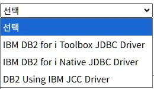
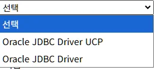
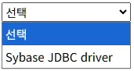
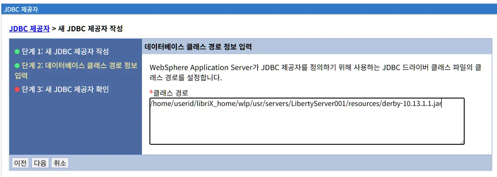
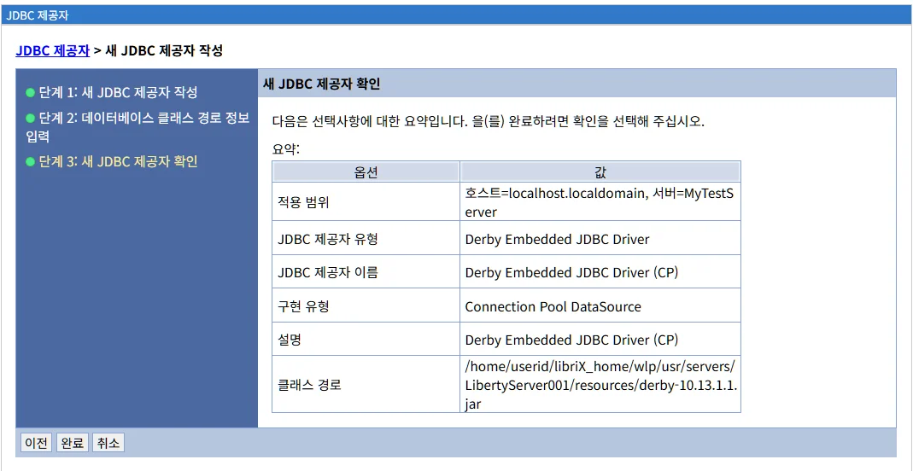

# JDBC 제공자 관리

## 개요

JDBC 제공자(JDBC Provider)는 애플리케이션이 데이터베이스에 연결하기 위해 필요한 JDBC 드라이버와 구성 정보를 관리하는 LibriX의 핵심 리소스입니다.

**주요 역할:**
- JDBC 드라이버 클래스 및 라이브러리 관리
- 데이터베이스 벤더별 드라이버 구성
- 데이터소스의 기반 제공
- 연결 풀링 메커니즘 지원

**Liberty 구현:**
LibriX의 JDBC 제공자는 Open Liberty의 `<library>` 및 `<jdbcDriver>` 요소를 기반으로 구현되며, WebSphere Application Server와 유사한 UI를 제공하면서도 Liberty의 경량화된 구조를 활용합니다.

---

## JDBC 제공자 메인 화면

### 화면 구성


JDBC 제공자 메인 화면은 다음과 같이 구성됩니다:

#### 상단 영역

**범위 선택 드롭다운**
```
범위: [모든 범위 ▼]
```

JDBC 제공자의 범위를 선택하여 필터링합니다.


**범위 드롭다운 구조:**

드롭다운을 클릭하면 다음과 같은 계층 구조가 표시됩니다:

```
[모든 범위]
├── 클러스터=MyCluster
├── 클러스터=MyServerCluster
├── 호스트=localhost.localdomain
├── 호스트=localhost.localdomain, 서버=LibertyServer001
└── 호스트=localhost.localdomain, 서버=MyTestServer
```

**범위 유형:**

**1. 모든 범위 (All Scopes)**
```
모든 범위
```
- 시스템의 모든 JDBC 제공자를 표시합니다
- 범위에 관계없이 모든 JDBC 제공자가 목록에 나타납니다
- 전체 시스템 관리 및 모니터링에 유용합니다

**2. 클러스터 범위 (Cluster Scope)**
```
클러스터=MyCluster
클러스터=MyServerCluster
```
- 특정 클러스터에 정의된 JDBC 제공자만 표시합니다
- 클러스터의 모든 멤버 서버에서 공유됩니다
- 클러스터 레벨에서 중앙 집중식 관리를 제공합니다

**클러스터 범위의 특징:**
- 클러스터에 속한 모든 서버가 동일한 JDBC 제공자를 사용합니다
- 한 번의 설정으로 여러 서버에 배포됩니다
- 고가용성 환경에서 일관된 데이터베이스 연결을 보장합니다
- 클러스터 멤버 추가 시 자동으로 JDBC 제공자가 적용됩니다

**사용 시나리오:**
```
✓ 프로덕션 클러스터의 공통 데이터베이스 연결
✓ 부하 분산 환경에서 일관된 드라이버 설정
✓ 고가용성이 필요한 애플리케이션
✓ 여러 서버에 동일한 JDBC 설정 배포
```

**3. 호스트 범위 (Host/Node Scope)**
```
호스트=localhost.localdomain
```
- 특정 호스트(노드)에 정의된 JDBC 제공자만 표시합니다
- 해당 호스트의 모든 서버에서 사용 가능합니다
- 호스트 레벨에서 JDBC 제공자를 공유할 때 사용합니다

**호스트 범위의 특징:**
- 같은 호스트의 여러 서버가 JDBC 제공자를 공유합니다
- 호스트별로 다른 드라이버 버전이나 설정을 사용할 수 있습니다
- 물리적 서버 단위로 관리됩니다

**사용 시나리오:**
```
✓ 같은 서버의 여러 Liberty 인스턴스
✓ 개발/테스트 환경의 여러 서버
✓ 호스트별로 다른 데이터베이스 연결
```

**4. 서버 범위 (Server Scope)**
```
호스트=localhost.localdomain, 서버=LibertyServer001
호스트=localhost.localdomain, 서버=MyTestServer
```
- 특정 서버에만 정의된 JDBC 제공자를 표시합니다
- 가장 세분화된 범위입니다
- 서버별로 독립적인 JDBC 제공자 구성이 가능합니다

**서버 범위의 특징:**
- 특정 서버에만 적용됩니다
- 다른 서버와 격리된 JDBC 설정을 유지합니다
- 가장 유연한 구성을 제공합니다

**사용 시나리오:**
```
✓ 서버별로 다른 데이터베이스 연결
✓ 개발/테스트/프로덕션 환경 분리
✓ 특정 서버만의 커스텀 드라이버 설정
✓ 애플리케이션별 전용 데이터베이스
```

**범위 선택 원칙:**

| 범위 | 공유 범위 | 관리 복잡도 | 유연성 | 사용 사례 |
|------|----------|------------|--------|----------|
| **클러스터** | 클러스터 멤버 전체 | 낮음 | 낮음 | 프로덕션 클러스터 |
| **호스트** | 호스트의 모든 서버 | 중간 | 중간 | 개발/테스트 환경 |
| **서버** | 단일 서버만 | 높음 | 높음 | 격리된 환경, 특수 구성 |

**범위 선택 시 고려사항:**

**클러스터 범위 선택 시:**
```
장점:
✓ 중앙 집중식 관리
✓ 일관된 구성
✓ 관리 오버헤드 최소화
✓ 자동 배포

단점:
✗ 서버별 커스터마이징 불가
✗ 모든 서버가 동일한 드라이버 사용
```

**호스트 범위 선택 시:**
```
장점:
✓ 호스트별 관리
✓ 여러 서버 공유
✓ 중간 수준의 유연성

단점:
✗ 서버 간 격리 안 됨
✗ 호스트별 관리 필요
```

**서버 범위 선택 시:**
```
장점:
✓ 최대 유연성
✓ 서버 간 완전 격리
✓ 독립적인 드라이버 버전 관리

단점:
✗ 관리 복잡도 증가
✗ 서버마다 개별 설정 필요
✗ 일관성 유지 어려움
```

**범위 필터링 동작:**

범위를 선택하면 JDBC 제공자 목록이 자동으로 필터링됩니다:

**예시 1: "모든 범위" 선택**
```
Derby Embedded JDBC Driver      (서버: LibertyServer001)
MySQL Production Driver         (클러스터: MyCluster)
Oracle Test Driver              (서버: MyTestServer)
PostgreSQL Dev Driver           (호스트: localhost.localdomain)
```
→ 모든 JDBC 제공자 표시

**예시 2: "클러스터=MyCluster" 선택**
```
MySQL Production Driver         (클러스터: MyCluster)
```
→ MyCluster에 정의된 JDBC 제공자만 표시

**예시 3: "호스트=localhost.localdomain, 서버=LibertyServer001" 선택**
```
Derby Embedded JDBC Driver      (서버: LibertyServer001)
```
→ LibertyServer001에 정의된 JDBC 제공자만 표시

**범위의 의미:**
- JDBC 제공자는 특정 서버에 종속되거나 여러 서버에서 공유될 수 있습니다
- 범위를 통해 JDBC 제공자가 어느 서버/클러스터에 배포되는지 제어합니다
- 범위는 JDBC 제공자의 가시성(visibility)과 접근성(accessibility)을 결정합니다
- 범위가 넓을수록(클러스터 > 호스트 > 서버) 더 많은 서버에서 사용 가능합니다

#### 관리 탭

화면 상단에 두 개의 탭이 있습니다:

**1. 생성 탭**
- 새로운 JDBC 제공자를 생성합니다
- 클릭 시 JDBC 제공자 생성 마법사가 시작됩니다

**2. 삭제 탭**
- 선택한 JDBC 제공자를 삭제합니다
- 하나 이상의 JDBC 제공자를 선택한 후 사용 가능합니다
- 삭제 전 확인 대화상자가 표시됩니다

**주의사항:**
- 데이터소스가 참조하고 있는 JDBC 제공자는 삭제할 수 없습니다
- 삭제하려면 먼저 관련 데이터소스를 제거해야 합니다

#### JDBC 제공자 목록 테이블

목록 테이블은 다음 컬럼으로 구성됩니다:

| 컬럼 | 설명 |
|------|------|
| **선택** | 체크박스를 통해 JDBC 제공자 선택 |
| **이름** | JDBC 제공자의 고유 이름 (클릭 시 상세 화면으로 이동) |
| **범위** | JDBC 제공자가 정의된 범위 (노드, 서버) |
| **설명** | JDBC 제공자에 대한 설명 |

**목록 예시:**

현재 화면에는 다음 JDBC 제공자가 표시되어 있습니다:

```
☐  Derby Embedded JDBC Driver
   범위: 호스트=localhost.localdomain, 서버=LibertyServer001
   설명: Derby Embedded JDBC Driver
```

**목록 하단:**
```
총계 1
```

등록된 JDBC 제공자의 총 개수를 표시합니다.

---

## JDBC 제공자 생성

### 생성 마법사

"생성" 탭을 클릭하면 JDBC 제공자 생성 마법사가 시작됩니다.

## JDBC 제공자 생성

### 생성 마법사

"생성" 탭을 클릭하면 JDBC 제공자 생성 마법사가 시작됩니다.

생성 마법사는 3단계로 구성되어 있습니다:
1. 새 JDBC 제공자 작성 (기본 정보 입력)
2. 데이터베이스 클래스 경로 정보 입력
3. 새 JDBC 제공자 확인 (검토)

### 1단계: 새 JDBC 제공자 작성


**화면 구성:**

좌측 패널에 진행 단계가 표시됩니다:
```
● 단계 1: 새 JDBC 제공자 작성
○ 단계 2: 데이터베이스 클래스 경로 정보 입력
○ 단계 3: 새 JDBC 제공자 확인
```

**입력 필드:**

#### 1. 범위 (Scope)

```
범위: 호스트=localhost.localdomain, 서버=LibertyServer001
```

- 생성 전에 선택한 범위가 자동으로 설정됩니다
- 읽기 전용 필드입니다
- JDBC 제공자가 생성될 범위를 나타냅니다

**범위 설정 방법:**
- JDBC 제공자 목록 화면에서 범위를 먼저 선택합니다
- 선택한 범위가 이 필드에 자동으로 표시됩니다
- 범위를 변경하려면 취소 후 목록 화면에서 다른 범위를 선택해야 합니다

**범위 예시:**
```
클러스터 범위:     클러스터=MyCluster
호스트 범위:       호스트=localhost.localdomain
서버 범위:         호스트=localhost.localdomain, 서버=LibertyServer001
```

#### 2. 데이터베이스 유형 *필수

```
*데이터베이스 유형: [선택 ▼]
```

데이터베이스 벤더와 드라이버 유형을 선택합니다.


**선택 가능한 데이터베이스 유형:**

```
선택
DB2
Derby
Informix
Oracle
사용자 정의
PostgreSQL
SQL Server
SyBase
```

**데이터베이스 유형별 설명:**

**1. DB2**
- IBM DB2 for LUW (Linux, Unix, Windows)
- IBM DB2 for z/OS
- IBM DB2 for i (AS/400)
- 엔터프라이즈급 관계형 데이터베이스

**2. Derby**
- Apache Derby (Java DB)
- 순수 Java 임베디드 데이터베이스
- 개발 및 테스트에 적합
- 경량 데이터베이스

**3. Informix**
- IBM Informix Database
- 고성능 OLTP 데이터베이스
- 엔터프라이즈 애플리케이션

**4. Oracle**
- Oracle Database
- 세계적으로 가장 많이 사용되는 엔터프라이즈 DB
- 다양한 버전 지원 (11g, 12c, 18c, 19c, 21c)

**5. 사용자 정의**
- 위 목록에 없는 데이터베이스
- 커스텀 JDBC 드라이버
- 수동 설정 필요

**6. PostgreSQL**
- 오픈소스 관계형 데이터베이스
- 엔터프라이즈급 기능
- 표준 SQL 준수

**7. SQL Server**
- Microsoft SQL Server
- Windows 및 Linux 지원
- Azure SQL Database 호환

**8. SyBase**
- SAP Sybase ASE (Adaptive Server Enterprise)
- 고성능 트랜잭션 처리
- 레거시 시스템

**데이터베이스 유형 선택 시 자동 설정:**

데이터베이스 유형을 선택하면:
- **제공자 유형** 드롭다운이 해당 DB에 맞게 업데이트됩니다
- 기본 구현 클래스가 자동으로 설정됩니다 (2단계에서)
- 권장 클래스 경로 템플릿이 제공됩니다 (2단계에서)

#### 3. 제공자 유형 *필수

```
*제공자 유형: [선택 ▼]
```

선택한 데이터베이스 유형에 따라 사용 가능한 제공자 유형이 달라집니다.

**DB2 선택 시:**



```
선택
IBM DB2 for i Toolbox JDBC Driver
IBM DB2 for i Native JDBC Driver
DB2 Using IBM JCC Driver
```

**DB2 제공자 유형 설명:**

**1. IBM DB2 for i Toolbox JDBC Driver**
- IBM Toolbox for Java (JTOpen)
- AS/400, iSeries, System i 용
- Type 4 드라이버 (순수 Java)
- 네트워크를 통한 원격 접속

**구현 클래스:**
```java
com.ibm.as400.access.AS400JDBCDriver
```

**클래스 경로:**
```
${shared.resource.dir}/jdbc/db2/jt400.jar
```

**사용 사례:**
- AS/400 시스템 연동
- iSeries 데이터베이스 접근
- IBM i 플랫폼

**2. IBM DB2 for i Native JDBC Driver**
- 네이티브 드라이버
- Type 2 드라이버 (네이티브 라이브러리 필요)
- 로컬 DB2 for i 접속
- 최고 성능

**구현 클래스:**
```java
com.ibm.db2.jdbc.app.DB2Driver
```

**네이티브 라이브러리:**
```
/QIBM/ProdData/OS400/jt400/lib
```

**사용 사례:**
- 로컬 IBM i 시스템
- 최고 성능 필요 시
- 레거시 애플리케이션

**3. DB2 Using IBM JCC Driver (권장)**
- IBM Data Server Driver for JDBC and SQLJ
- Type 4 드라이버 (순수 Java)
- 모든 DB2 플랫폼 지원 (LUW, z/OS, i)
- 최신 기능 지원

**구현 클래스:**
```java
com.ibm.db2.jcc.DB2Driver
```

**클래스 경로:**
```
${shared.resource.dir}/jdbc/db2/db2jcc4.jar
```

**사용 사례:**
- DB2 LUW (Linux, Unix, Windows)
- DB2 z/OS
- 새로운 프로젝트 (권장)
- 크로스 플랫폼 호환성

**Derby 선택 시:**


```
선택
Derby Embedded JDBC Driver
Derby Network Client JDBC Driver
```

**Derby 제공자 유형 설명:**

**1. Derby Embedded JDBC Driver**
- 임베디드 모드
- 애플리케이션과 같은 JVM에서 실행
- 네트워크 연결 불필요
- 단일 애플리케이션 접근

**구현 클래스:**
```java
org.apache.derby.jdbc.EmbeddedDriver
```

**연결 URL:**
```
jdbc:derby:myDB;create=true
```

**사용 사례:**
- 개발 및 테스트
- 단일 사용자 애플리케이션
- 데스크톱 애플리케이션

**2. Derby Network JDBC Driver**
- 네트워크 모드 (클라이언트-서버)
- 별도의 Derby Network Server 필요
- 다중 클라이언트 접근 가능
- 원격 접속 지원

**구현 클래스:**
```java
org.apache.derby.jdbc.ClientDriver
```

**연결 URL:**
```
jdbc:derby://localhost:1527/myDB
```

**사용 사례:**
- 다중 사용자 환경
- 원격 데이터베이스 접근
- 서버-클라이언트 아키텍처

**Oracle 선택 시:**

```
선택
Oracle JDBC Driver (Thin)
Oracle JDBC Driver (OCI)
```

**Oracle 제공자 유형 설명:**

**1. Oracle JDBC Driver (Thin) - 권장**
- Type 4 드라이버 (순수 Java)
- 플랫폼 독립적
- 네이티브 라이브러리 불필요
- 가장 널리 사용

**구현 클래스:**
```java
oracle.jdbc.driver.OracleDriver
// 또는
oracle.jdbc.OracleDriver
```

**클래스 경로:**
```
${shared.resource.dir}/jdbc/oracle/ojdbc8.jar
```

**연결 URL:**
```
jdbc:oracle:thin:@hostname:1521:ORCL
jdbc:oracle:thin:@//hostname:1521/SERVICE_NAME
```

**사용 사례:**
- 대부분의 애플리케이션
- 원격 Oracle 데이터베이스
- 크로스 플랫폼 환경

**2. Oracle JDBC Driver (OCI)**
- Type 2 드라이버 (네이티브)
- Oracle Instant Client 필요
- 더 나은 성능 (일부 경우)
- 고급 기능 지원

**구현 클래스:**
```java
oracle.jdbc.OracleDriver
```

**네이티브 라이브러리:**
```
/opt/oracle/instantclient_19_8
```

**연결 URL:**
```
jdbc:oracle:oci:@TNSNAME
```

**사용 사례:**
- 최고 성능 필요
- Oracle Wallet 사용
- Advanced Queuing (AQ)
- 복잡한 데이터 타입

**MySQL 선택 시:**

```
선택
MySQL Connector/J
```

**MySQL 제공자 유형 설명:**

**MySQL Connector/J**
- MySQL 공식 JDBC 드라이버
- Type 4 드라이버 (순수 Java)
- MariaDB 호환

**구현 클래스:**
```java
// MySQL 8.x
com.mysql.cj.jdbc.Driver

// MySQL 5.x (deprecated)
com.mysql.jdbc.Driver
```

**클래스 경로:**
```
${shared.resource.dir}/jdbc/mysql/mysql-connector-java-8.0.28.jar
```

**연결 URL:**
```
jdbc:mysql://hostname:3306/mydb
jdbc:mysql://hostname:3306/mydb?useSSL=true&serverTimezone=UTC
```

**PostgreSQL 선택 시:**

```
선택
PostgreSQL JDBC Driver
```

**PostgreSQL 제공자 유형 설명:**

**PostgreSQL JDBC Driver**
- PostgreSQL 공식 JDBC 드라이버
- Type 4 드라이버 (순수 Java)

**구현 클래스:**
```java
org.postgresql.Driver
```

**클래스 경로:**
```
${shared.resource.dir}/jdbc/postgresql/postgresql-42.3.3.jar
```

**연결 URL:**
```
jdbc:postgresql://hostname:5432/mydb
jdbc:postgresql://hostname:5432/mydb?ssl=true
```

**SQL Server 선택 시:**

```
선택
Microsoft SQL Server JDBC Driver
jTDS SQL Server Driver
```

**SQL Server 제공자 유형 설명:**

**1. Microsoft SQL Server JDBC Driver (권장)**
- Microsoft 공식 JDBC 드라이버
- Type 4 드라이버
- 최신 기능 지원

**구현 클래스:**
```java
com.microsoft.sqlserver.jdbc.SQLServerDriver
```

**클래스 경로:**
```
${shared.resource.dir}/jdbc/sqlserver/mssql-jdbc-9.4.1.jre8.jar
```

**연결 URL:**
```
jdbc:sqlserver://hostname:1433;databaseName=mydb
```

**2. jTDS SQL Server Driver**
- 오픈소스 Type 4 드라이버
- SQL Server 및 Sybase 지원
- 레거시 환경

**구현 클래스:**
```java
net.sourceforge.jtds.jdbc.Driver
```

**클래스 경로:**
```
${shared.resource.dir}/jdbc/jtds/jtds-1.3.1.jar
```

**연결 URL:**
```
jdbc:jtds:sqlserver://hostname:1433/mydb
```

**Informix 선택 시:**


```
선택
Informix JDBC Driver
Informix Using IBM JCC Driver
```

**Informix 제공자 유형 설명:**

**1. Informix JDBC Driver**
- IBM Informix 공식 JDBC 드라이버
- Type 4 드라이버 (순수 Java)
- Informix 전용 최적화

**구현 클래스:**
```java
com.informix.jdbc.IfxDriver
```

**클래스 경로:**
```
${shared.resource.dir}/jdbc/informix/ifxjdbc.jar
${shared.resource.dir}/jdbc/informix/ifxjdbcx.jar
```

**연결 URL:**
```
jdbc:informix-sqli://hostname:9088/mydb:INFORMIXSERVER=ol_informix1150
```

**사용 사례:**
- 일반 Informix 데이터베이스 연결
- 최신 Informix 버전 (11.x, 12.x, 14.x)
- 표준 JDBC 기능

**2. Informix Using IBM JCC Driver**
- IBM Data Server Driver for JDBC and SQLJ
- Type 4 드라이버
- Informix + DB2 통합 환경

**구현 클래스:**
```java
com.ibm.db2.jcc.DB2Driver
```

**클래스 경로:**
```
${shared.resource.dir}/jdbc/informix/db2jcc4.jar
${shared.resource.dir}/jdbc/informix/db2jcc_license_informix.jar
```

**연결 URL:**
```
jdbc:ids://hostname:9089/mydb:informixserver=ol_informix1150
```

**사용 사례:**
- DB2와 Informix 혼용 환경
- IBM 통합 드라이버 사용
- 고급 IBM 기능 필요

**Oracle 선택 시:**



```
선택
Oracle JDBC Driver UCP
Oracle JDBC Driver
```

**Oracle 제공자 유형 설명:**

**1. Oracle JDBC Driver UCP (Universal Connection Pool)**
- Oracle Universal Connection Pool 지원
- Type 4 드라이버 (Thin)
- Oracle 고급 연결 풀링
- 성능 최적화 기능

**구현 클래스:**
```java
oracle.jdbc.OracleDriver
```

**클래스 경로:**
```
${shared.resource.dir}/jdbc/oracle/ojdbc8.jar
${shared.resource.dir}/jdbc/oracle/ucp.jar
```

**연결 URL:**
```
jdbc:oracle:thin:@hostname:1521:ORCL
jdbc:oracle:thin:@//hostname:1521/SERVICE_NAME
```

**UCP 특징:**
- Fast Connection Failover (FCF)
- Runtime Connection Load Balancing (RCLB)
- Connection Affinity
- Application Continuity
- 웹 요청 경계 인식

**사용 사례:**
- Oracle RAC 환경
- 고가용성 필요
- 최적의 연결 분산
- Oracle 고급 기능 활용

**2. Oracle JDBC Driver (표준)**
- 표준 Oracle JDBC 드라이버
- Type 4 드라이버 (Thin) 또는 Type 2 (OCI)
- 가장 일반적으로 사용

**구현 클래스:**
```java
// Thin (Type 4)
oracle.jdbc.driver.OracleDriver
oracle.jdbc.OracleDriver

// OCI (Type 2)
oracle.jdbc.OracleDriver
```

**클래스 경로:**
```
// Thin
${shared.resource.dir}/jdbc/oracle/ojdbc8.jar

// OCI
${shared.resource.dir}/jdbc/oracle/ojdbc8.jar
네이티브 라이브러리: /opt/oracle/instantclient_19_8
```

**연결 URL:**
```
// Thin
jdbc:oracle:thin:@hostname:1521:ORCL
jdbc:oracle:thin:@//hostname:1521/SERVICE_NAME

// OCI
jdbc:oracle:oci:@TNSNAME
```

**사용 사례:**
- 일반 Oracle 데이터베이스 연결
- 단일 인스턴스 환경
- 표준 JDBC 기능만 필요

**PostgreSQL 선택 시:**


```
선택
PostgreSQL JDBC Driver
```

**PostgreSQL 제공자 유형 설명:**

**PostgreSQL JDBC Driver**
- PostgreSQL 공식 JDBC 드라이버
- Type 4 드라이버 (순수 Java)
- 모든 PostgreSQL 버전 지원

**구현 클래스:**
```java
org.postgresql.Driver
```

**클래스 경로:**
```
${shared.resource.dir}/jdbc/postgresql/postgresql-42.5.1.jar
```

**연결 URL:**
```
jdbc:postgresql://hostname:5432/mydb
jdbc:postgresql://hostname:5432/mydb?ssl=true
jdbc:postgresql://hostname:5432/mydb?ssl=true&sslmode=require
```

**주요 기능:**
- SSL/TLS 연결 지원
- 배열, JSON, UUID 등 고급 데이터 타입
- Copy API 지원
- Logical Replication
- SCRAM-SHA-256 인증

**연결 속성:**
```
ssl=true                    # SSL 연결
sslmode=require            # SSL 모드 (disable, allow, prefer, require, verify-ca, verify-full)
connectTimeout=10          # 연결 타임아웃 (초)
socketTimeout=30           # 소켓 타임아웃 (초)
loginTimeout=10            # 로그인 타임아웃 (초)
prepareThreshold=5         # PreparedStatement 임계값
```

**사용 사례:**
- PostgreSQL 9.x, 10.x, 11.x, 12.x, 13.x, 14.x, 15.x
- 오픈소스 엔터프라이즈 DB
- JSON/JSONB 데이터 처리
- 지리 정보 시스템 (PostGIS)

**SQL Server 선택 시:**


```
선택
Microsoft SQL Server JDBC Driver
DataDirect Connect for JDBC Driver for SQL Server
```

**SQL Server 제공자 유형 설명:**

**1. Microsoft SQL Server JDBC Driver (권장)**
- Microsoft 공식 JDBC 드라이버
- Type 4 드라이버 (순수 Java)
- 최신 기능 및 보안 업데이트
- SQL Server 2012 이상 지원

**구현 클래스:**
```java
com.microsoft.sqlserver.jdbc.SQLServerDriver
```

**클래스 경로:**
```
${shared.resource.dir}/jdbc/sqlserver/mssql-jdbc-11.2.0.jre8.jar
```

**연결 URL:**
```
jdbc:sqlserver://hostname:1433;databaseName=mydb
jdbc:sqlserver://hostname:1433;databaseName=mydb;encrypt=true;trustServerCertificate=false
```

**주요 기능:**
- Always Encrypted 지원
- Azure Active Directory 인증
- Kerberos 인증
- 연결 복원력 (Connection Resiliency)
- 대량 복사 (Bulk Copy)

**연결 속성:**
```
encrypt=true                              # 암호화 연결
trustServerCertificate=false             # 서버 인증서 검증
integratedSecurity=true                  # Windows 인증
authentication=ActiveDirectoryPassword   # Azure AD 인증
loginTimeout=30                          # 로그인 타임아웃
packetSize=8000                          # 패킷 크기
```

**사용 사례:**
- SQL Server 2012 이상
- Azure SQL Database
- Windows/Linux 환경
- 최신 보안 기능 필요

**2. DataDirect Connect for JDBC Driver for SQL Server**
- Progress DataDirect 상용 드라이버
- Type 4 드라이버
- 고급 성능 및 기능
- 상용 지원 제공

**구현 클래스:**
```java
com.ddtek.jdbc.sqlserver.SQLServerDriver
```

**클래스 경로:**
```
${shared.resource.dir}/jdbc/datadirect/sqlserver.jar
```

**연결 URL:**
```
jdbc:datadirect:sqlserver://hostname:1433;databaseName=mydb
```

**주요 기능:**
- 고급 성능 튜닝
- 확장된 데이터 타입 지원
- 상용 기술 지원
- 엔터프라이즈 기능

**사용 사례:**
- 엔터프라이즈 애플리케이션
- 상용 지원 필요
- 고급 성능 최적화
- 레거시 SQL Server (2008 이하)

**SyBase 선택 시:**



```
선택
Sybase JDBC driver
```

**SyBase 제공자 유형 설명:**

**Sybase JDBC driver (jConnect)**
- SAP Sybase jConnect JDBC 드라이버
- Type 4 드라이버 (순수 Java)
- Sybase ASE (Adaptive Server Enterprise) 지원

**구현 클래스:**
```java
com.sybase.jdbc4.jdbc.SybDriver
```

**클래스 경로:**
```
${shared.resource.dir}/jdbc/sybase/jconn4.jar
```

**연결 URL:**
```
jdbc:sybase:Tds:hostname:5000/mydb
jdbc:sybase:Tds:hostname:5000?ServiceName=mydb
```

**주요 기능:**
- Sybase ASE 12.x, 15.x, 16.x 지원
- CIS (Component Integration Services)
- High Availability
- Wide Table 지원
- In-Memory Database

**연결 속성:**
```
CHARSET=utf8              # 문자 인코딩
PACKETSIZE=8192          # 네트워크 패킷 크기
APPLICATIONNAME=MyApp    # 애플리케이션 이름
ENABLE_BULK_LOAD=true    # 대량 로드 활성화
```

**사용 사례:**
- Sybase ASE 데이터베이스
- 레거시 엔터프라이즈 시스템
- 금융/통신 산업
- 고성능 OLTP

**사용자 정의 선택 시:**

```
선택
User-defined JDBC Provider
```

**사용자 정의 제공자:**
- 위 목록에 없는 모든 데이터베이스
- 커스텀 JDBC 드라이버
- 2단계에서 수동으로 모든 정보 입력 필요

**사용 사례:**
- H2 Database
- HSQLDB
- SQLite
- Cassandra (JDBC 인터페이스)
- 커스텀 데이터베이스

#### 4. 구현 유형 *필수

```
*구현 유형: [선택 ▼]
```


JDBC 드라이버의 구현 방식을 선택합니다.

```
선택
연결 풀 데이터 소스
XA 데이터 소스
데이터 소스
```

**구현 유형 설명:**

**1. 연결 풀 데이터 소스 (Connection Pool Data Source) - 권장**
- 연결 풀링 지원
- javax.sql.ConnectionPoolDataSource 구현
- 가장 일반적으로 사용
- 엔터프라이즈 애플리케이션에 적합
- Liberty의 기본 연결 풀 메커니즘 활용

**Liberty 구성:**
```xml
<dataSource id="myDS" jndiName="jdbc/myapp">
    <jdbcDriver libraryRef="MySQLLib"/>
    <connectionManager maxPoolSize="20" minPoolSize="2"/>
    <properties serverName="localhost" 
                portNumber="3306"
                databaseName="mydb"
                user="dbuser"
                password="dbpass"/>
</dataSource>
```

**사용 사례:**
- 일반 웹 애플리케이션
- 높은 동시 사용자
- 연결 재사용 필요
- 대부분의 엔터프라이즈 애플리케이션

**장점:**
```
✓ 연결 재사용으로 성능 향상
✓ 리소스 효율적
✓ 동시 접속 관리
✓ 연결 수 제어 가능
```

**2. XA 데이터 소스 (XA Data Source)**
- 분산 트랜잭션 지원
- javax.sql.XADataSource 구현
- 2단계 커밋(Two-Phase Commit) 지원
- 여러 리소스 매니저 간 트랜잭션

**Liberty 구성:**
```xml
<dataSource id="myXADS" jndiName="jdbc/myxaapp" type="javax.sql.XADataSource">
    <jdbcDriver libraryRef="MySQLLib"/>
    <properties serverName="localhost"
                portNumber="3306"
                databaseName="mydb"
                user="dbuser"
                password="dbpass"/>
</dataSource>
```

**사용 사례:**
- 분산 트랜잭션 (JTA)
- 여러 데이터베이스 동시 업데이트
- 메시지 큐와 데이터베이스 트랜잭션
- 마이크로서비스 간 트랜잭션

**장점:**
```
✓ ACID 보장 (여러 리소스)
✓ 자동 롤백
✓ 데이터 일관성
```

**단점:**
```
✗ 성능 오버헤드
✗ 복잡한 구성
✗ 2PC 프로토콜 비용
```

**3. 데이터 소스 (Data Source - Simple)**
- 기본 데이터소스
- javax.sql.DataSource 구현
- 연결 풀링 없음
- 가장 간단한 형태

**Liberty 구성:**
```xml
<dataSource id="simpleDS" jndiName="jdbc/simple" type="javax.sql.DataSource">
    <jdbcDriver libraryRef="MySQLLib"/>
    <properties serverName="localhost"
                portNumber="3306"
                databaseName="mydb"
                user="dbuser"
                password="dbpass"/>
</dataSource>
```

**사용 사례:**
- 간단한 테스트
- 개발 환경
- 낮은 트래픽
- 배치 작업 (단일 연결)

**장점:**
```
✓ 간단한 구성
✓ 최소한의 오버헤드
```

**단점:**
```
✗ 연결 풀링 없음
✗ 성능 낮음
✗ 많은 동시 사용자 처리 불가
✗ 프로덕션 부적합
```

**구현 유형 비교표:**

| 구현 유형 | 연결 풀링 | 분산 트랜잭션 | 성능 | 복잡도 | 사용 사례 |
|----------|----------|--------------|------|--------|----------|
| **연결 풀** | ✓ | ✗ | 높음 | 낮음 | 일반 애플리케이션 |
| **XA** | ✓ | ✓ | 중간 | 높음 | 분산 트랜잭션 |
| **Simple** | ✗ | ✗ | 낮음 | 매우 낮음 | 테스트/개발 |

**구현 유형 선택 가이드:**

```
일반적인 웹 애플리케이션:
→ 연결 풀 데이터 소스

분산 트랜잭션 필요:
→ XA 데이터 소스
→ 여러 DB 동시 사용
→ 메시지 큐 + DB 트랜잭션
→ Saga 패턴 구현

간단한 테스트:
→ 데이터 소스
→ 연결 풀링 불필요
→ 단일 연결만 사용
```

**성능 고려사항:**

**연결 풀 데이터 소스:**
- 연결 생성/종료 오버헤드 제거
- 동시 접속 수 제어
- 최적의 연결 수 유지
- 연결 검증 및 재사용

**XA 데이터 소스:**
- 2PC 프로토콜 오버헤드 (약 10-30%)
- 트랜잭션 코디네이터 비용
- 데이터 일관성 vs 성능 트레이드오프
- 필요한 경우에만 사용 권장

**데이터 소스:**
- 매 요청마다 연결 생성/종료
- 높은 오버헤드
- 프로덕션 사용 비권장

#### 5. 이름 *필수

```
*이름: [____________________]
```

JDBC 제공자의 고유 이름을 입력합니다.

**명명 규칙:**
- 영문, 숫자, 언더스코어(_), 하이픈(-) 사용 가능
- 공백 사용 가능하지만 권장하지 않음
- 대소문자 구분
- 고유해야 함 (같은 범위 내에서)

**명명 패턴 권장:**
```
패턴: <Database>_<Type>_<Environment>_Provider

예시:
- Derby_Embedded_Dev_Provider
- MySQL_Production_Provider
- Oracle_Thin_HR_Provider
- PostgreSQL_Test_Provider
- DB2_JCC_Prod_Provider
```

**좋은 이름 예시:**
```
✓ MySQL_Production_Provider
✓ Oracle_Thin_Driver
✓ Derby_Embedded_Dev
✓ PostgreSQL_HR_DataSource
```

**나쁜 이름 예시:**
```
✗ provider1
✗ jdbc
✗ test
✗ MyProvider (너무 일반적)
```

#### 6. 설명 (선택사항)

```
설명: [_________________________________]
      [_________________________________]
      [_________________________________]
```

JDBC 제공자에 대한 상세 설명을 입력합니다.

**포함할 내용:**
- 용도 및 목적
- 사용하는 애플리케이션
- 데이터베이스 정보 (서버, 데이터베이스 이름)
- 드라이버 버전
- 담당자 또는 팀
- 연락처

**설명 예시:**

**좋은 설명:**
```
Production MySQL database driver for HR application.
Server: mysql-prod-01.company.com
Database: hr_production
Driver: MySQL Connector/J 8.0.28
Contact: dba-team@company.com
Last updated: 2026-01-09
```

**간단한 설명:**
```
MySQL driver for development environment
Driver version: 8.0.28
```

**최소한의 설명:**
```
Production Oracle database for ERP system
```

**하단 버튼:**

```
[다음]  [취소]
```

- **다음**: 입력한 정보를 저장하고 2단계로 이동
- **취소**: 작성 중인 내용을 버리고 목록 화면으로 돌아감

**필수 필드 검증:**

"다음" 버튼 클릭 시 다음 필드가 검증됩니다:
- 데이터베이스 유형 *
- 제공자 유형 *
- 구현 유형 *
- 이름 *

필수 필드가 비어있으면 오류 메시지가 표시됩니다:
```
다음 필수 필드를 입력하십시오:
- 데이터베이스 유형
- 이름
```

### 1단계 작성 팁

**1. 범위 선택 전략**

JDBC 제공자 생성 전에 적절한 범위를 선택하세요:

```
클러스터 범위:
✓ 프로덕션 클러스터
✓ 모든 멤버 서버가 같은 DB 사용
✓ 중앙 집중식 관리

호스트 범위:
✓ 개발/테스트 환경
✓ 호스트의 여러 서버 공유
✓ 호스트별 다른 드라이버 버전

서버 범위:
✓ 격리된 환경
✓ 서버별 다른 DB
✓ 특수 구성 필요
```

**2. 데이터베이스 유형 선택 가이드**

프로젝트에 맞는 데이터베이스 유형을 선택하세요:

```
임베디드 데이터베이스:
→ Derby Embedded (개발/테스트)

엔터프라이즈 데이터베이스:
→ Oracle Thin (프로덕션)
→ DB2 JCC (프로덕션)
→ SQL Server (프로덕션)

오픈소스 데이터베이스:
→ MySQL Connector/J
→ PostgreSQL JDBC
```

**3. 제공자 유형 선택 가이드**

애플리케이션 요구사항에 따라 선택하세요:

```
일반적인 웹 애플리케이션:
→ Connection Pool Data Source

분산 트랜잭션 (JTA):
→ XA Data Source
→ 여러 DB 동시 사용
→ 메시지 큐와 DB 트랜잭션

간단한 테스트:
→ Data Source (Simple)
→ 연결 풀링 불필요
```

**4. 구현 유형 선택 가이드**

특별한 이유가 없다면 Type 4를 선택하세요:

```
권장 (Type 4):
✓ 순수 Java
✓ 설치 간편
✓ 플랫폼 독립적
✓ 유지보수 쉬움

특수 경우 (Type 2):
✓ 성능이 매우 중요
✓ 레거시 시스템 유지
✓ 특정 네이티브 기능 필요
```

**5. 이름 작성 가이드**

일관된 명명 규칙을 사용하세요:

```
환경별:
- MySQL_Dev_Provider
- MySQL_Test_Provider
- MySQL_Prod_Provider

애플리케이션별:
- Oracle_HR_Provider
- Oracle_Finance_Provider
- Oracle_Sales_Provider

드라이버 유형별:
- DB2_JCC_Provider
- DB2_CLI_Provider
- Oracle_Thin_Provider
- Oracle_OCI_Provider
```

### 2단계: 데이터베이스 클래스 경로 정보 입력



2단계에서는 JDBC 드라이버의 클래스 경로를 설정합니다.

**화면 구성:**

좌측 패널에 진행 단계가 표시됩니다:
```
● 단계 1: 새 JDBC 제공자 작성           (완료)
● 단계 2: 데이터베이스 클래스 경로 정보 입력  (현재)
○ 단계 3: 새 JDBC 제공자 확인
```

**화면 설명:**

```
데이터베이스 클래스 경로 정보 입력

WebSphere Application Server가 JDBC 제공자를 정의하기 위해 사용하는 
JDBC 드라이버 클래스 파일의 클래스 경로를 설정합니다.
```

#### 클래스 경로 *필수

```
*클래스 경로:
[/home/userid/librix_home/wlp/usr/servers/LibertyServer001/resources/derby-10.13.1.1.jar]
```

JDBC 드라이버 JAR 파일의 전체 경로를 입력합니다.

**입력 형식:**

**1. 절대 경로 사용**
```
/home/userid/librix_home/wlp/usr/servers/LibertyServer001/resources/derby-10.13.1.1.jar
```

**2. Liberty 변수 사용 (권장)**
```
${shared.resource.dir}/jdbc/derby-10.13.1.1.jar
${server.config.dir}/resources/derby-10.13.1.1.jar
${wlp.install.dir}/lib/derby-10.13.1.1.jar
```

**3. 여러 JAR 파일 (세미콜론으로 구분)**

**Windows:**
```
${shared.resource.dir}/jdbc/ojdbc8.jar;${shared.resource.dir}/jdbc/orai18n.jar
```

**Linux/Unix:**
```
${shared.resource.dir}/jdbc/ojdbc8.jar:${shared.resource.dir}/jdbc/orai18n.jar
```

**4. 와일드카드 사용**
```
${shared.resource.dir}/jdbc/*.jar
${shared.resource.dir}/jdbc/oracle/*.jar
```

**Liberty 경로 변수:**

| 변수 | 설명 | 기본 경로 |
|------|------|----------|
| `${shared.resource.dir}` | 공유 리소스 디렉토리 | `/opt/ibm/wlp/usr/shared` |
| `${server.config.dir}` | 서버 구성 디렉토리 | `/opt/ibm/wlp/usr/servers/서버명` |
| `${server.output.dir}` | 서버 출력 디렉토리 | `/opt/ibm/wlp/usr/servers/서버명` |
| `${wlp.install.dir}` | Liberty 설치 디렉토리 | `/opt/ibm/wlp` |
| `${wlp.user.dir}` | Liberty 사용자 디렉토리 | `/opt/ibm/wlp/usr` |

**권장 디렉토리 구조:**

```
/opt/ibm/wlp/usr/shared/
└── jdbc/
    ├── derby/
    │   └── derby-10.14.2.0.jar
    ├── db2/
    │   ├── db2jcc4.jar
    │   └── db2jcc_license_cu.jar
    ├── mysql/
    │   └── mysql-connector-java-8.0.28.jar
    ├── oracle/
    │   ├── ojdbc8.jar
    │   └── orai18n.jar
    ├── postgresql/
    │   └── postgresql-42.5.1.jar
    └── sqlserver/
        └── mssql-jdbc-11.2.0.jre8.jar
```

**데이터베이스별 클래스 경로 예시:**

**Derby:**
```
${shared.resource.dir}/jdbc/derby/derby-10.14.2.0.jar
```

**DB2:**
```
// JCC Driver (Type 4)
${shared.resource.dir}/jdbc/db2/db2jcc4.jar

// 라이선스 파일 포함
${shared.resource.dir}/jdbc/db2/db2jcc4.jar:${shared.resource.dir}/jdbc/db2/db2jcc_license_cu.jar
```

**Oracle:**
```
// Thin Driver만
${shared.resource.dir}/jdbc/oracle/ojdbc8.jar

// 국제화 지원 포함
${shared.resource.dir}/jdbc/oracle/ojdbc8.jar:${shared.resource.dir}/jdbc/oracle/orai18n.jar

// 모든 Oracle JAR
${shared.resource.dir}/jdbc/oracle/*.jar
```

**MySQL:**
```
${shared.resource.dir}/jdbc/mysql/mysql-connector-java-8.0.28.jar
```

**PostgreSQL:**
```
${shared.resource.dir}/jdbc/postgresql/postgresql-42.5.1.jar
```

**SQL Server:**
```
${shared.resource.dir}/jdbc/sqlserver/mssql-jdbc-11.2.0.jre8.jar
```

**Informix:**
```
${shared.resource.dir}/jdbc/informix/ifxjdbc.jar:${shared.resource.dir}/jdbc/informix/ifxjdbcx.jar
```

**Sybase:**
```
${shared.resource.dir}/jdbc/sybase/jconn4.jar
```

**클래스 경로 입력 팁:**

**1. Liberty 변수 사용 권장**
```
✓ ${shared.resource.dir}/jdbc/mysql/mysql-connector-java-8.0.28.jar
✗ /opt/ibm/wlp/usr/shared/jdbc/mysql/mysql-connector-java-8.0.28.jar
```

**이유:**
- 서버 이동 시 경로 자동 조정
- 환경별 설정 변경 불필요
- 가독성 향상

**2. 버전 번호 명시**
```
✓ mysql-connector-java-8.0.28.jar
✗ mysql-connector-java.jar
```

**이유:**
- 버전 추적 용이
- 업그레이드 이력 관리
- 호환성 문제 방지

**3. 데이터베이스별 디렉토리 분리**
```
✓ ${shared.resource.dir}/jdbc/mysql/mysql-connector-java-8.0.28.jar
✗ ${shared.resource.dir}/jdbc/mysql-connector-java-8.0.28.jar
```

**이유:**
- 체계적 관리
- 여러 드라이버 혼재 방지
- 유지보수 편의성

**4. 와일드카드 사용 주의**
```
// 권장: 특정 디렉토리
${shared.resource.dir}/jdbc/oracle/*.jar

// 비권장: 너무 광범위
${shared.resource.dir}/jdbc/*.jar
```

**이유:**
- 불필요한 JAR 로딩 방지
- 클래스 충돌 방지
- 명확한 의존성 관리

**클래스 경로 검증:**

입력한 클래스 경로가 올바른지 확인하는 방법:

**1. 파일 존재 확인**
```bash
# 서버에 SSH 접속
ls -l ${shared.resource.dir}/jdbc/mysql/mysql-connector-java-8.0.28.jar

# 또는 실제 경로로
ls -l /opt/ibm/wlp/usr/shared/jdbc/mysql/mysql-connector-java-8.0.28.jar
```

**2. JAR 파일 내용 확인**
```bash
# JDBC 드라이버 클래스 확인
jar -tf mysql-connector-java-8.0.28.jar | grep "Driver"

# 예상 출력:
# com/mysql/cj/jdbc/Driver.class
```

**3. 권한 확인**
```bash
# 파일 권한
ls -l mysql-connector-java-8.0.28.jar
# -rw-r--r-- 1 liberty liberty 2470711 Jan 9 10:00 mysql-connector-java-8.0.28.jar

# Liberty 사용자가 읽을 수 있어야 함
```

**네이티브 라이브러리 경로 (Type 2 드라이버)**

Type 2 드라이버 (OCI, DB2 CLI 등)를 사용하는 경우 네이티브 라이브러리 경로가 필요합니다.

**입력 예시:**

**Oracle OCI:**
```
/opt/oracle/instantclient_19_8
```

**DB2 CLI:**
```
/opt/IBM/db2/V11.5/lib64
```

**Informix CSDK:**
```
/opt/IBM/informix/lib
```

**네이티브 라이브러리 경로 설정 (Liberty):**

Liberty server.xml에서는 네이티브 라이브러리를 다음과 같이 설정합니다:

```xml
<library id="OracleLib">
    <fileset dir="${shared.resource.dir}/jdbc/oracle" includes="ojdbc8.jar"/>
    <nativeLibrary>
        <fileset dir="/opt/oracle/instantclient_19_8" includes="*.so"/>
    </nativeLibrary>
</library>
```

**환경 변수 설정도 필요:**

**Linux:**
```bash
export LD_LIBRARY_PATH=/opt/oracle/instantclient_19_8:$LD_LIBRARY_PATH
```

**macOS:**
```bash
export DYLD_LIBRARY_PATH=/opt/oracle/instantclient_19_8:$DYLD_LIBRARY_PATH
```

**하단 버튼:**

```
[이전]  [다음]  [취소]
```

- **이전**: 1단계로 돌아가기
- **다음**: 입력한 정보를 저장하고 3단계로 이동
- **취소**: 작성 중인 내용을 버리고 목록 화면으로 돌아감

**필수 필드 검증:**

"다음" 버튼 클릭 시 클래스 경로 필드가 비어있으면 오류 메시지가 표시됩니다:
```
다음 필수 필드를 입력하십시오:
- 클래스 경로
```

**클래스 경로 유효성 검사:**

LibriX는 입력된 클래스 경로의 유효성을 검사합니다:
- 파일 존재 여부 확인
- 읽기 권한 확인
- JAR 파일 형식 검증

**오류 예시:**
```
클래스 경로 오류: 
파일을 찾을 수 없습니다: ${shared.resource.dir}/jdbc/mysql/mysql-connector-java-8.0.28.jar

경로를 확인하십시오.
```

### 2단계 작성 팁

**1. JDBC 드라이버 다운로드**

클래스 경로를 입력하기 전에 JDBC 드라이버를 다운로드하고 배치해야 합니다.

**다운로드 소스:**

**Derby:**
```
https://db.apache.org/derby/
Maven: https://mvnrepository.com/artifact/org.apache.derby/derby
```

**DB2:**
```
IBM Fix Central
DB2 설치 디렉토리: SQLLIB/java/
```

**Oracle:**
```
https://www.oracle.com/database/technologies/jdbc-drivers-12c-downloads.html
Maven: https://mvnrepository.com/artifact/com.oracle.database.jdbc/ojdbc8
```

**MySQL:**
```
https://dev.mysql.com/downloads/connector/j/
Maven: https://mvnrepository.com/artifact/mysql/mysql-connector-java
```

**PostgreSQL:**
```
https://jdbc.postgresql.org/download.html
Maven: https://mvnrepository.com/artifact/org.postgresql/postgresql
```

**SQL Server:**
```
https://docs.microsoft.com/en-us/sql/connect/jdbc/download-microsoft-jdbc-driver-for-sql-server
Maven: https://mvnrepository.com/artifact/com.microsoft.sqlserver/mssql-jdbc
```

**2. 드라이버 배치**

다운로드한 JDBC 드라이버를 Liberty 서버에 배치:

```bash
# 디렉토리 생성
mkdir -p /opt/ibm/wlp/usr/shared/jdbc/mysql

# 파일 복사
cp mysql-connector-java-8.0.28.jar /opt/ibm/wlp/usr/shared/jdbc/mysql/

# 권한 설정
chown liberty:liberty /opt/ibm/wlp/usr/shared/jdbc/mysql/mysql-connector-java-8.0.28.jar
chmod 644 /opt/ibm/wlp/usr/shared/jdbc/mysql/mysql-connector-java-8.0.28.jar
```

**3. 경로 확인**

파일이 올바른 위치에 있는지 확인:

```bash
# 파일 확인
ls -l /opt/ibm/wlp/usr/shared/jdbc/mysql/

# Liberty 변수 확인
echo ${shared.resource.dir}
# /opt/ibm/wlp/usr/shared
```

**4. Maven에서 다운로드 (선택사항)**

Maven을 사용하여 JDBC 드라이버를 다운로드할 수 있습니다:

```bash
# MySQL Connector/J 다운로드
mvn dependency:get \
  -Dartifact=mysql:mysql-connector-java:8.0.28:jar \
  -Ddest=/opt/ibm/wlp/usr/shared/jdbc/mysql/mysql-connector-java-8.0.28.jar
```

**5. 여러 JAR 파일 처리**

일부 JDBC 드라이버는 여러 JAR 파일이 필요합니다:

**Oracle 예시:**
```bash
# 메인 드라이버
ojdbc8.jar

# 국제화 지원
orai18n.jar

# XML 지원 (선택)
xdb.jar
xmlparserv2.jar
```

**클래스 경로 입력:**
```
${shared.resource.dir}/jdbc/oracle/ojdbc8.jar:${shared.resource.dir}/jdbc/oracle/orai18n.jar
```

**6. 버전 호환성 확인**

JDBC 드라이버 버전과 데이터베이스 버전의 호환성을 확인하세요:

**MySQL:**
```
Connector/J 8.0.x → MySQL 5.6, 5.7, 8.0
Connector/J 5.1.x → MySQL 4.1, 5.0, 5.1, 5.5, 5.6, 5.7 (deprecated)
```

**Oracle:**
```
ojdbc8.jar → Oracle 12c, 18c, 19c, 21c (JDK 8)
ojdbc11.jar → Oracle 18c, 19c, 21c (JDK 11+)
```

**PostgreSQL:**
```
postgresql-42.x.jar → PostgreSQL 8.2 이상, JDK 8
```

### 3단계: 새 JDBC 제공자 확인



**1. 구현 클래스 이름**
```
구현 클래스 이름: [org.apache.derby.jdbc.EmbeddedDriver]
```

- JDBC 드라이버의 메인 클래스
- 데이터베이스 벤더가 제공하는 드라이버 클래스

**주요 데이터베이스별 구현 클래스:**

**Derby:**
```java
// Embedded
org.apache.derby.jdbc.EmbeddedDriver

// Network (Client)
org.apache.derby.jdbc.ClientDriver
```

**DB2:**
```java
// Universal JDBC Driver (Type 4)
com.ibm.db2.jcc.DB2Driver

// Legacy (Type 2)
COM.ibm.db2.jdbc.app.DB2Driver
```

**Oracle:**
```java
// Thin driver (Type 4)
oracle.jdbc.driver.OracleDriver

// OCI driver (Type 2)
oracle.jdbc.OracleDriver
```

**MySQL:**
```java
// Connector/J 8.0+
com.mysql.cj.jdbc.Driver

// Legacy (5.x)
com.mysql.jdbc.Driver
```

**PostgreSQL:**
```java
org.postgresql.Driver
```

**SQL Server:**
```java
// Microsoft Driver
com.microsoft.sqlserver.jdbc.SQLServerDriver

// jTDS
net.sourceforge.jtds.jdbc.Driver
```

**2. 클래스 경로**
```
클래스 경로: [${shared.resource.dir}/jdbc/derby.jar]
```

- JDBC 드라이버 JAR 파일의 위치
- 여러 JAR 파일은 세미콜론(;) 또는 콜론(:)으로 구분
- Liberty 변수 사용 가능

**Liberty 경로 변수:**

```bash
${shared.resource.dir}    # 공유 리소스 디렉토리 (/opt/ibm/wlp/usr/shared)
${server.config.dir}      # 서버 구성 디렉토리
${server.output.dir}      # 서버 출력 디렉토리
${wlp.install.dir}        # Liberty 설치 디렉토리
${wlp.user.dir}           # Liberty 사용자 디렉토리
```

**클래스 경로 예시:**

**단일 JAR:**
```
${shared.resource.dir}/jdbc/mysql-connector-java-8.0.28.jar
```

**여러 JAR (Windows):**
```
${shared.resource.dir}/jdbc/ojdbc8.jar;${shared.resource.dir}/jdbc/orai18n.jar
```

**여러 JAR (Linux/Unix):**
```
${shared.resource.dir}/jdbc/ojdbc8.jar:${shared.resource.dir}/jdbc/orai18n.jar
```

**와일드카드 사용:**
```
${shared.resource.dir}/jdbc/*.jar
```

**권장 디렉토리 구조:**
```
/opt/ibm/wlp/usr/shared/
└── jdbc/
    ├── derby/
    │   └── derby-10.14.2.0.jar
    ├── mysql/
    │   └── mysql-connector-java-8.0.28.jar
    ├── oracle/
    │   ├── ojdbc8.jar
    │   └── orai18n.jar
    ├── postgresql/
    │   └── postgresql-42.3.3.jar
    └── sqlserver/
        └── mssql-jdbc-9.4.1.jre8.jar
```

**3. 네이티브 라이브러리 경로 (선택사항)**
```
네이티브 라이브러리 경로: [/opt/oracle/instantclient_19_8]
```

- Type 2 드라이버에서 필요한 네이티브 라이브러리 경로
- OCI 드라이버, DB2 Type 2 등에서 사용
- Type 4 드라이버는 불필요

**예시:**
- Oracle OCI: `/opt/oracle/instantclient_19_8`
- DB2 Type 2: `/opt/IBM/db2/V11.5/lib64`

### 4단계: 고급 설정 (선택사항)

**1. 격리 수준 (Isolation Level)**
```
격리 수준: [TRANSACTION_READ_COMMITTED ▼]
```

데이터베이스 트랜잭션의 격리 수준을 설정합니다.

**격리 수준 옵션:**

```
TRANSACTION_NONE               (0) - 트랜잭션 미지원
TRANSACTION_READ_UNCOMMITTED   (1) - 커밋되지 않은 읽기
TRANSACTION_READ_COMMITTED     (2) - 커밋된 읽기 (기본값)
TRANSACTION_REPEATABLE_READ    (4) - 반복 가능한 읽기
TRANSACTION_SERIALIZABLE       (8) - 직렬화 가능
```

**격리 수준 설명:**

| 수준 | 더티 리드 | 비반복 리드 | 팬텀 리드 | 성능 | 일관성 |
|------|----------|-----------|----------|------|--------|
| READ_UNCOMMITTED | 가능 | 가능 | 가능 | 최상 | 최하 |
| READ_COMMITTED | 불가능 | 가능 | 가능 | 상 | 중하 |
| REPEATABLE_READ | 불가능 | 불가능 | 가능 | 중 | 중상 |
| SERIALIZABLE | 불가능 | 불가능 | 불가능 | 최하 | 최상 |

**권장 설정:**
- 대부분의 애플리케이션: `TRANSACTION_READ_COMMITTED`
- 높은 일관성 필요: `TRANSACTION_REPEATABLE_READ` 또는 `SERIALIZABLE`
- 읽기 전용, 성능 우선: `TRANSACTION_READ_UNCOMMITTED`

**2. 문 캐시 크기 (Statement Cache Size)**
```
문 캐시 크기: [100]
```

- PreparedStatement를 캐시하는 크기
- 재사용되는 SQL 문의 성능 향상
- 기본값: 10-100

**권장 값:**
- 소규모 애플리케이션: 50
- 중규모 애플리케이션: 100-200
- 대규모 애플리케이션: 200-500

**3. 연결 속성 (Custom Properties)**

데이터베이스별 추가 속성을 설정할 수 있습니다.

**Oracle 예시:**
```
속성:
  oracle.net.CONNECT_TIMEOUT = 10000
  oracle.jdbc.ReadTimeout = 30000
  oracle.net.keepAlive = true
```

**MySQL 예시:**
```
속성:
  useSSL = true
  serverTimezone = UTC
  autoReconnect = true
```

**PostgreSQL 예시:**
```
속성:
  ssl = true
  sslmode = require
  connectTimeout = 10
```

### 5단계: 검토 및 완료

**검토 화면:**

입력한 모든 정보를 확인합니다:

```
JDBC 제공자 구성 검토

이름: MySQL_Production_Provider
설명: Production MySQL database for main application
범위: 서버 = LibertyServer001

구현 클래스: com.mysql.cj.jdbc.Driver
클래스 경로: ${shared.resource.dir}/jdbc/mysql/mysql-connector-java-8.0.28.jar

격리 수준: TRANSACTION_READ_COMMITTED
문 캐시 크기: 100

[이전]  [완료]  [취소]
```

**완료 버튼 클릭:**
- 구성이 server.xml에 자동 저장
- JDBC 제공자 목록에 추가
- Liberty 서버가 자동으로 갱신 (재시작 불필요)

---

## JDBC 제공자 상세 화면

JDBC 제공자 목록에서 이름을 클릭하면 상세 화면으로 이동합니다.

### 탭 구성

**1. 구성 탭**
- JDBC 제공자의 기본 정보 조회 및 수정
- 드라이버 클래스 및 경로 변경
- 격리 수준 및 캐시 설정

**2. 연결 풀 탭 (관련 데이터소스)**
- 이 JDBC 제공자를 사용하는 데이터소스 목록
- 데이터소스 생성 링크

**3. 사용자 정의 속성 탭**
- 데이터베이스별 커스텀 속성 관리
- 속성 추가/수정/삭제

### 구성 탭 상세

**일반 속성:**

**1. 이름 (읽기 전용)**
```
이름: Derby_Embedded_Provider
```
- 생성 후 변경 불가
- 고유 식별자

**2. 설명**
```
설명: [Derby Embedded JDBC Driver for development]
```
- 수정 가능
- 목적 및 용도 명시

**3. 범위 (읽기 전용)**
```
범위: 호스트=localhost.localdomain, 서버=LibertyServer001
```
- 생성 시 설정한 범위
- 변경 불가

**드라이버 정보:**

**1. 구현 클래스 이름**
```
구현 클래스 이름: [org.apache.derby.jdbc.EmbeddedDriver]
```
- 수정 가능
- 드라이버 업그레이드 시 변경 가능

**2. 클래스 경로**
```
클래스 경로: [${shared.resource.dir}/jdbc/derby.jar]
```
- 수정 가능
- 드라이버 파일 위치 변경 가능

**3. 네이티브 라이브러리 경로**
```
네이티브 라이브러리 경로: []
```
- Type 2 드라이버에서만 필요

**고급 설정:**

**1. 격리 수준**
```
격리 수준: [TRANSACTION_READ_COMMITTED ▼]
```

**2. 문 캐시 크기**
```
문 캐시 크기: [10]
```

**저장 및 적용:**

화면 하단의 버튼:
- **확인**: 변경사항 저장 및 적용
- **취소**: 변경사항 버리기

변경 후 자동으로 server.xml 업데이트, 서버 재시작 불필요

### 연결 풀 탭

**관련 데이터소스 목록:**

이 JDBC 제공자를 사용하는 모든 데이터소스가 표시됩니다.

```
관련 데이터소스:

이름                    JNDI 이름              최대 연결 수
═══════════════════════════════════════════════════════════
MyAppDataSource         jdbc/myapp             20
TestDataSource          jdbc/test              5
```

**새 데이터소스 생성:**
- "새 데이터소스 생성" 링크 클릭
- 자동으로 현재 JDBC 제공자가 선택된 상태로 데이터소스 생성 마법사 시작

### 사용자 정의 속성 탭

**커스텀 속성 관리:**

데이터베이스 벤더별 추가 연결 속성을 설정합니다.

**속성 목록:**

```
이름                          값                       설명
════════════════════════════════════════════════════════════════
oracle.net.CONNECT_TIMEOUT    10000                   연결 타임아웃 (ms)
oracle.jdbc.ReadTimeout       30000                   읽기 타임아웃 (ms)
```

**속성 추가:**
1. "새로 작성" 버튼 클릭
2. 속성 이름 입력
3. 속성 값 입력
4. 설명 입력 (선택사항)
5. "확인" 클릭

**속성 수정:**
1. 속성 이름 클릭
2. 값 수정
3. "확인" 클릭

**속성 삭제:**
1. 속성 체크박스 선택
2. "삭제" 버튼 클릭
3. 확인 대화상자에서 "확인" 클릭

---

## JDBC 제공자 삭제

### 삭제 절차

**1. JDBC 제공자 선택**

목록에서 삭제할 JDBC 제공자의 체크박스를 선택합니다.

```
☑ Old_MySQL_Provider
☐ Derby_Embedded_Provider
```

**2. 삭제 탭 클릭**

화면 상단의 "삭제" 탭을 클릭합니다.

**3. 확인 대화상자**

```
선택한 JDBC 제공자를 삭제하시겠습니까?

삭제할 JDBC 제공자:
- Old_MySQL_Provider

경고: 이 JDBC 제공자를 사용하는 데이터소스가 있으면 
삭제할 수 없습니다.

[확인]  [취소]
```

**4. 삭제 실행**

"확인" 버튼 클릭 시:
- server.xml에서 JDBC 제공자 구성 제거
- 목록에서 제거
- Liberty 서버 자동 갱신

### 삭제 시 주의사항

**1. 데이터소스 종속성 확인**

삭제하려는 JDBC 제공자를 참조하는 데이터소스가 있으면 삭제할 수 없습니다.

**오류 메시지:**
```
JDBC 제공자를 삭제할 수 없습니다.
다음 데이터소스가 이 JDBC 제공자를 사용하고 있습니다:
- MyAppDataSource (jdbc/myapp)
- TestDataSource (jdbc/test)

먼저 데이터소스를 삭제하거나 다른 JDBC 제공자를 
사용하도록 변경하십시오.
```

**해결 방법:**
1. 관련 데이터소스를 먼저 삭제하거나
2. 데이터소스가 다른 JDBC 제공자를 사용하도록 변경

**2. 애플리케이션 영향**

JDBC 제공자를 삭제하면:
- 해당 JDBC 제공자를 사용하는 모든 데이터소스가 영향을 받음
- 데이터소스를 사용하는 애플리케이션의 데이터베이스 연결 실패
- 애플리케이션 오류 발생 가능

**권장 절차:**
1. 애플리케이션 중지
2. 관련 데이터소스 확인
3. 데이터소스 제거 또는 변경
4. JDBC 제공자 삭제
5. 필요시 새 JDBC 제공자 및 데이터소스 생성
6. 애플리케이션 시작 및 테스트

---

## Liberty server.xml 구성

### JDBC 제공자 구성 예시

LibriX에서 생성한 JDBC 제공자는 Liberty의 `server.xml`에 다음과 같이 저장됩니다.

#### Derby Embedded

```xml
<server>
    <!-- JDBC 드라이버 라이브러리 -->
    <library id="DerbyLib">
        <fileset dir="${shared.resource.dir}/jdbc" includes="derby.jar"/>
    </library>
    
    <!-- JDBC 드라이버 정의 -->
    <jdbcDriver id="DerbyEmbedded" libraryRef="DerbyLib">
        <properties.derby.embedded databaseName="myDB" createDatabase="create"/>
    </jdbcDriver>
</server>
```

#### MySQL

```xml
<server>
    <!-- JDBC 드라이버 라이브러리 -->
    <library id="MySQLLib">
        <fileset dir="${shared.resource.dir}/jdbc/mysql" 
                 includes="mysql-connector-java-8.0.28.jar"/>
    </library>
    
    <!-- JDBC 드라이버 정의 -->
    <jdbcDriver id="MySQL" libraryRef="MySQLLib"/>
</server>
```

#### Oracle

```xml
<server>
    <!-- JDBC 드라이버 라이브러리 -->
    <library id="OracleLib">
        <fileset dir="${shared.resource.dir}/jdbc/oracle" includes="*.jar"/>
    </library>
    
    <!-- JDBC 드라이버 정의 -->
    <jdbcDriver id="Oracle" libraryRef="OracleLib">
        <!-- 커스텀 속성 -->
        <properties oracle.net.CONNECT_TIMEOUT="10000"
                    oracle.jdbc.ReadTimeout="30000"/>
    </jdbcDriver>
</server>
```

#### PostgreSQL

```xml
<server>
    <!-- JDBC 드라이버 라이브러리 -->
    <library id="PostgreSQLLib">
        <fileset dir="${shared.resource.dir}/jdbc/postgresql" 
                 includes="postgresql-42.3.3.jar"/>
    </library>
    
    <!-- JDBC 드라이버 정의 -->
    <jdbcDriver id="PostgreSQL" libraryRef="PostgreSQLLib"/>
</server>
```

#### SQL Server

```xml
<server>
    <!-- JDBC 드라이버 라이브러리 -->
    <library id="SQLServerLib">
        <fileset dir="${shared.resource.dir}/jdbc/sqlserver" 
                 includes="mssql-jdbc-9.4.1.jre8.jar"/>
    </library>
    
    <!-- JDBC 드라이버 정의 -->
    <jdbcDriver id="SQLServer" libraryRef="SQLServerLib"/>
</server>
```

#### 여러 JDBC 제공자

```xml
<server>
    <!-- Derby 라이브러리 -->
    <library id="DerbyLib">
        <fileset dir="${shared.resource.dir}/jdbc/derby" includes="*.jar"/>
    </library>
    
    <!-- MySQL 라이브러리 -->
    <library id="MySQLLib">
        <fileset dir="${shared.resource.dir}/jdbc/mysql" includes="*.jar"/>
    </library>
    
    <!-- Oracle 라이브러리 -->
    <library id="OracleLib">
        <fileset dir="${shared.resource.dir}/jdbc/oracle" includes="*.jar"/>
    </library>
    
    <!-- Derby 드라이버 -->
    <jdbcDriver id="DerbyEmbedded" libraryRef="DerbyLib"/>
    
    <!-- MySQL 드라이버 -->
    <jdbcDriver id="MySQL" libraryRef="MySQLLib"/>
    
    <!-- Oracle 드라이버 -->
    <jdbcDriver id="Oracle" libraryRef="OracleLib"/>
</server>
```

### 고급 구성

#### 격리 수준 설정

```xml
<jdbcDriver id="MySQL" libraryRef="MySQLLib">
    <properties transactionIsolation="TRANSACTION_READ_COMMITTED"/>
</jdbcDriver>
```

#### 문 캐시 크기

```xml
<jdbcDriver id="Oracle" libraryRef="OracleLib">
    <properties statementCacheSize="100"/>
</jdbcDriver>
```

#### 커스텀 속성

```xml
<jdbcDriver id="MySQL" libraryRef="MySQLLib">
    <properties useSSL="true"
                serverTimezone="UTC"
                autoReconnect="true"/>
</jdbcDriver>
```

---

## 데이터베이스별 JDBC 드라이버 설정 가이드

### Derby

**드라이버 다운로드:**
- Apache Derby 공식 사이트: https://db.apache.org/derby/
- Maven Repository: https://mvnrepository.com/artifact/org.apache.derby/derby

**Embedded 모드:**
```xml
<library id="DerbyLib">
    <fileset dir="${shared.resource.dir}/jdbc/derby" includes="derby-*.jar"/>
</library>

<jdbcDriver id="DerbyEmbedded" libraryRef="DerbyLib">
    <properties.derby.embedded databaseName="myDB" createDatabase="create"/>
</jdbcDriver>
```

**Network 모드:**
```xml
<library id="DerbyClientLib">
    <fileset dir="${shared.resource.dir}/jdbc/derby" includes="derbyclient-*.jar"/>
</library>

<jdbcDriver id="DerbyNetwork" libraryRef="DerbyClientLib"/>
```

**연결 URL:**
```
Embedded: jdbc:derby:myDB;create=true
Network:  jdbc:derby://localhost:1527/myDB
```

### DB2

**드라이버 다운로드:**
- IBM Data Server Driver for JDBC and SQLJ (JCC)
- IBM DB2 설치 디렉토리: `SQLLIB/java`

**Type 4 드라이버 (권장):**
```xml
<library id="DB2Lib">
    <fileset dir="${shared.resource.dir}/jdbc/db2" includes="db2jcc4.jar"/>
</library>

<jdbcDriver id="DB2" libraryRef="DB2Lib">
    <properties.db2.jcc 
        driverType="4"
        progressiveStreaming="2"
        enableSeamlessFailover="1"
        maxRetriesForClientReroute="3"/>
</jdbcDriver>
```

**Type 2 드라이버:**
```xml
<library id="DB2Lib">
    <fileset dir="${shared.resource.dir}/jdbc/db2" includes="db2jcc4.jar,db2jcc_license_cu.jar"/>
</library>

<jdbcDriver id="DB2Type2" libraryRef="DB2Lib">
    <properties.db2.jcc driverType="2"/>
</jdbcDriver>
```

**연결 URL:**
```
Type 4: jdbc:db2://hostname:50000/MYDB
Type 2: jdbc:db2:MYDB
```

### Oracle

**드라이버 다운로드:**
- Oracle 공식 사이트: https://www.oracle.com/database/technologies/jdbc-drivers-12c-downloads.html
- Maven Repository: https://mvnrepository.com/artifact/com.oracle.database.jdbc/ojdbc8

**Thin 드라이버 (Type 4, 권장):**
```xml
<library id="OracleLib">
    <fileset dir="${shared.resource.dir}/jdbc/oracle" includes="ojdbc8.jar"/>
</library>

<jdbcDriver id="Oracle" libraryRef="OracleLib">
    <properties.oracle
        oracle.net.CONNECT_TIMEOUT="10000"
        oracle.jdbc.ReadTimeout="30000"
        oracle.net.keepAlive="true"/>
</jdbcDriver>
```

**OCI 드라이버 (Type 2):**
```xml
<library id="OracleOCILib">
    <fileset dir="${shared.resource.dir}/jdbc/oracle" includes="ojdbc8.jar"/>
    <nativeLibrary>
        <fileset dir="/opt/oracle/instantclient_19_8" includes="*.so"/>
    </nativeLibrary>
</library>

<jdbcDriver id="OracleOCI" libraryRef="OracleOCILib"/>
```

**연결 URL:**
```
Thin (SID):     jdbc:oracle:thin:@hostname:1521:ORCL
Thin (Service): jdbc:oracle:thin:@//hostname:1521/SERVICE_NAME
OCI:            jdbc:oracle:oci:@TNSNAME
```

### MySQL

**드라이버 다운로드:**
- MySQL 공식 사이트: https://dev.mysql.com/downloads/connector/j/
- Maven Repository: https://mvnrepository.com/artifact/mysql/mysql-connector-java

**MySQL Connector/J 8.x:**
```xml
<library id="MySQLLib">
    <fileset dir="${shared.resource.dir}/jdbc/mysql" 
             includes="mysql-connector-java-8.*.jar"/>
</library>

<jdbcDriver id="MySQL" libraryRef="MySQLLib">
    <properties.mysql
        useSSL="true"
        serverTimezone="UTC"
        autoReconnect="true"
        useUnicode="true"
        characterEncoding="UTF-8"/>
</jdbcDriver>
```

**MariaDB 호환:**
```xml
<library id="MariaDBLib">
    <fileset dir="${shared.resource.dir}/jdbc/mariadb" 
             includes="mariadb-java-client-*.jar"/>
</library>

<jdbcDriver id="MariaDB" libraryRef="MariaDBLib"/>
```

**연결 URL:**
```
MySQL:   jdbc:mysql://hostname:3306/mydb
MariaDB: jdbc:mariadb://hostname:3306/mydb
```

### PostgreSQL

**드라이버 다운로드:**
- PostgreSQL 공식 사이트: https://jdbc.postgresql.org/download.html
- Maven Repository: https://mvnrepository.com/artifact/org.postgresql/postgresql

**PostgreSQL JDBC Driver:**
```xml
<library id="PostgreSQLLib">
    <fileset dir="${shared.resource.dir}/jdbc/postgresql" 
             includes="postgresql-*.jar"/>
</library>

<jdbcDriver id="PostgreSQL" libraryRef="PostgreSQLLib">
    <properties.postgresql
        ssl="true"
        sslmode="require"
        connectTimeout="10"
        socketTimeout="30"/>
</jdbcDriver>
```

**연결 URL:**
```
jdbc:postgresql://hostname:5432/mydb
```

### Microsoft SQL Server

**드라이버 다운로드:**
- Microsoft 공식 사이트: https://docs.microsoft.com/en-us/sql/connect/jdbc/download-microsoft-jdbc-driver-for-sql-server
- Maven Repository: https://mvnrepository.com/artifact/com.microsoft.sqlserver/mssql-jdbc

**Microsoft JDBC Driver:**
```xml
<library id="SQLServerLib">
    <fileset dir="${shared.resource.dir}/jdbc/sqlserver" 
             includes="mssql-jdbc-*.jar"/>
</library>

<jdbcDriver id="SQLServer" libraryRef="SQLServerLib">
    <properties.microsoft.sqlserver
        encrypt="true"
        trustServerCertificate="false"
        loginTimeout="30"
        packetSize="8000"/>
</jdbcDriver>
```

**jTDS 드라이버 (대안):**
```xml
<library id="jTDSLib">
    <fileset dir="${shared.resource.dir}/jdbc/jtds" includes="jtds-*.jar"/>
</library>

<jdbcDriver id="jTDS" libraryRef="jTDSLib"/>
```

**연결 URL:**
```
Microsoft: jdbc:sqlserver://hostname:1433;databaseName=mydb
jTDS:      jdbc:jtds:sqlserver://hostname:1433/mydb
```

---

## 문제 해결

### 일반적인 문제

#### 1. 클래스 찾을 수 없음 (ClassNotFoundException)

**증상:**
```
java.lang.ClassNotFoundException: com.mysql.cj.jdbc.Driver
```

**원인:**
- JDBC 드라이버 JAR 파일이 클래스 경로에 없음
- JAR 파일 경로가 잘못됨
- JAR 파일이 손상됨

**해결:**
1. JAR 파일 존재 확인:
```bash
ls -l ${shared.resource.dir}/jdbc/mysql/
```

2. 클래스 경로 확인:
```xml
<library id="MySQLLib">
    <fileset dir="${shared.resource.dir}/jdbc/mysql" includes="*.jar"/>
</library>
```

3. Liberty 서버 로그 확인:
```bash
tail -f ${server.output.dir}/logs/messages.log
```

#### 2. 네이티브 라이브러리 로드 실패

**증상:**
```
java.lang.UnsatisfiedLinkError: no ocijdbc19 in java.library.path
```

**원인:**
- Type 2 드라이버의 네이티브 라이브러리를 찾을 수 없음
- 네이티브 라이브러리 경로가 잘못됨

**해결:**
1. 네이티브 라이브러리 경로 설정:
```xml
<library id="OracleLib">
    <fileset dir="${shared.resource.dir}/jdbc/oracle" includes="ojdbc8.jar"/>
    <nativeLibrary>
        <fileset dir="/opt/oracle/instantclient_19_8" includes="*.so"/>
    </nativeLibrary>
</library>
```

2. 환경 변수 설정:
```bash
# Linux
export LD_LIBRARY_PATH=/opt/oracle/instantclient_19_8:$LD_LIBRARY_PATH

# macOS
export DYLD_LIBRARY_PATH=/opt/oracle/instantclient_19_8:$DYLD_LIBRARY_PATH
```

3. Type 4 드라이버 사용 고려 (네이티브 라이브러리 불필요)

#### 3. 드라이버 버전 충돌

**증상:**
```
java.sql.SQLException: No suitable driver found
```

**원인:**
- 여러 버전의 드라이버가 클래스 경로에 존재
- 잘못된 드라이버 클래스 이름

**해결:**
1. 단일 드라이버 버전만 유지:
```bash
cd ${shared.resource.dir}/jdbc/mysql/
ls -l
# mysql-connector-java-8.0.28.jar만 유지
```

2. 구현 클래스 이름 확인:
```
MySQL 8.x: com.mysql.cj.jdbc.Driver
MySQL 5.x: com.mysql.jdbc.Driver (deprecated)
```

#### 4. 격리 수준 미지원

**증상:**
```
java.sql.SQLException: Transaction isolation level TRANSACTION_SERIALIZABLE not supported
```

**원인:**
- 데이터베이스가 요청한 격리 수준을 지원하지 않음

**해결:**
1. 지원되는 격리 수준 확인:
```java
DatabaseMetaData metaData = connection.getMetaData();
boolean supports = metaData.supportsTransactionIsolationLevel(
    Connection.TRANSACTION_SERIALIZABLE
);
```

2. 낮은 격리 수준 사용:
```
TRANSACTION_READ_COMMITTED (대부분 지원)
TRANSACTION_REPEATABLE_READ (일부 DB)
```

#### 5. 문 캐시 관련 오류

**증상:**
```
java.sql.SQLException: Statement cache is full
```

**원인:**
- 문 캐시 크기가 너무 작음
- 너무 많은 PreparedStatement 생성

**해결:**
1. 문 캐시 크기 증가:
```xml
<jdbcDriver id="Oracle" libraryRef="OracleLib">
    <properties statementCacheSize="200"/>
</jdbcDriver>
```

2. 애플리케이션 코드 개선:
```java
// PreparedStatement 재사용
try (PreparedStatement ps = conn.prepareStatement(sql)) {
    // 사용
}
```

---

## 모범 사례

### 1. 드라이버 파일 관리

**디렉토리 구조:**
```
/opt/ibm/wlp/usr/shared/jdbc/
├── derby/
│   └── derby-10.14.2.0.jar
├── db2/
│   ├── db2jcc4.jar
│   └── db2jcc_license_cu.jar
├── mysql/
│   └── mysql-connector-java-8.0.28.jar
├── oracle/
│   ├── ojdbc8.jar
│   └── orai18n.jar
├── postgresql/
│   └── postgresql-42.3.3.jar
└── sqlserver/
    └── mssql-jdbc-9.4.1.jre8.jar
```

**권한 설정:**
```bash
chown -R liberty:liberty /opt/ibm/wlp/usr/shared/jdbc/
chmod 755 /opt/ibm/wlp/usr/shared/jdbc/
chmod 644 /opt/ibm/wlp/usr/shared/jdbc/*/*.jar
```

### 2. 명명 규칙

**JDBC 제공자 이름:**
```
패턴: <Database>_<Type>_<Environment>

예시:
- MySQL_Thin_Production
- Oracle_Thin_Development
- DB2_JCC_Test
- PostgreSQL_Production
- Derby_Embedded_Dev
```

**일관성 유지:**
- 환경별 접미사 사용 (Dev, Test, Prod)
- 드라이버 유형 명시 (Thin, OCI, Embedded)
- 대문자 시작, 언더스코어로 구분

### 3. 범위 선택 전략

**서버 범위 사용 시:**
```
✓ 환경별 서버 분리 (Dev/Test/Prod)
✓ 서버별로 다른 데이터베이스 연결
✓ 독립적인 드라이버 버전 관리
✓ 테스트 및 개발 환경
```

**노드 범위 사용 시:**
```
✓ 동일한 데이터베이스를 사용하는 여러 서버
✓ 중앙 집중식 드라이버 관리
✓ 프로덕션 클러스터 환경
✓ 일관된 구성 유지
```

### 4. 드라이버 버전 관리

**버전 명시:**
```
/opt/ibm/wlp/usr/shared/jdbc/mysql/
└── mysql-connector-java-8.0.28.jar  (버전 포함)

클래스 경로:
${shared.resource.dir}/jdbc/mysql/mysql-connector-java-8.0.28.jar
```

**업그레이드 절차:**
1. 새 버전 드라이버 다운로드
2. 테스트 환경에 배포
3. 충분한 테스트
4. 프로덕션 환경에 배포
5. 이전 버전 백업 후 제거

**버전 관리 팁:**
- 파일 이름에 버전 번호 포함
- 심볼릭 링크 사용 (Linux):
```bash
ln -s mysql-connector-java-8.0.28.jar mysql-connector-java-current.jar
```
- 변경 로그 유지

### 5. 보안

**파일 권한:**
```bash
# 드라이버 파일은 Liberty 사용자만 읽기 가능
chmod 640 /opt/ibm/wlp/usr/shared/jdbc/*/*.jar
chown liberty:liberty /opt/ibm/wlp/usr/shared/jdbc/*/*.jar
```

**민감 정보 보호:**
- JDBC 제공자에는 연결 정보 포함 안 함 (데이터소스에서 관리)
- 사용자 정의 속성에 비밀번호 포함 금지

### 6. 성능 최적화

**문 캐시 크기:**
```
소규모 애플리케이션: 50
중규모 애플리케이션: 100-200
대규모 애플리케이션: 200-500
```

**격리 수준:**
```
읽기 전용: TRANSACTION_READ_UNCOMMITTED (최고 성능)
일반:     TRANSACTION_READ_COMMITTED (권장)
높은 일관성: TRANSACTION_REPEATABLE_READ
```

### 7. 문서화

**JDBC 제공자 설명 작성:**
```
좋은 예:
"Production MySQL database driver for HR application. 
Contact: dba-team@company.com. 
Driver version: 8.0.28"

나쁜 예:
"MySQL driver"
```

**변경 이력 관리:**
- 드라이버 업그레이드 날짜 기록
- 변경 사유 문서화
- 영향받는 애플리케이션 목록 유지

---

## WebSphere ND와의 비교

### 주요 차이점

| 항목 | WebSphere ND | LibriX (Liberty) |
|------|--------------|------------------|
| **구성 방식** | 관리콘솔 UI | 관리콘솔 UI + server.xml |
| **저장 위치** | Cell 저장소 | server.xml 파일 |
| **드라이버 배포** | dmgr 통한 동기화 | 파일 시스템 직접 배치 |
| **범위** | Cell/Node/Server/Cluster | Node/Server |
| **동적 갱신** | 저장 후 동기화 필요 | 즉시 반영 (재시작 불필요) |
| **템플릿** | 내장 템플릿 다수 | 기본 템플릿 제공 |

### 유사점

| 항목 | WebSphere ND | LibriX (Liberty) |
|------|--------------|------------------|
| **UI 구조** | 매우 유사 | 매우 유사 |
| **생성 마법사** | 단계별 마법사 | 단계별 마법사 |
| **드라이버 클래스** | 직접 지정 | 직접 지정 |
| **클래스 경로** | 직접 지정 | 직접 지정 |
| **격리 수준** | 지원 | 지원 |
| **문 캐시** | 지원 | 지원 |
| **사용자 정의 속성** | 지원 | 지원 |

### Liberty의 장점

**1. 간소화된 구성**
```
WebSphere ND: 
- Cell 저장소
- 노드 동기화
- Repository epoch

Liberty:
- server.xml 파일
- 파일 시스템 기반
- 즉시 반영
```

**2. 빠른 배포**
```
WebSphere ND: dmgr → NodeAgent → Server
Liberty:      파일 복사 → 자동 감지
```

**3. 경량**
```
WebSphere ND: JDBC 제공자 메타데이터 복잡
Liberty:      간결한 XML 구성
```

**4. 버전 관리 친화적**
```
Liberty server.xml:
- Git으로 버전 관리 가능
- 텍스트 기반 Diff
- 쉬운 롤백
```

### WebSphere ND의 장점

**1. 중앙 집중식 관리**
```
dmgr에서 모든 JDBC 제공자 관리
자동 동기화
일관된 구성
```

**2. 풍부한 템플릿**
```
더 많은 데이터베이스 템플릿
상세한 옵션
검증된 구성
```

**3. Cell 범위**
```
Cell 전체에서 JDBC 제공자 공유
클러스터 간 공유
```

---

## 다음 단계

- JDBC 제공자를 사용하여 데이터소스를 생성하려면 [데이터소스 관리](datasource.md) 문서를 참조하십시오.
- 애플리케이션에서 데이터소스를 사용하려면 [애플리케이션 리소스 참조](application-resource-reference.md) 문서를 참조하십시오.
- 연결 풀 튜닝에 대한 정보는 [연결 풀 최적화](connection-pool-tuning.md) 문서를 참조하십시오.

---

## 참고 자료

### Liberty 문서
- [Relational Database Connections](https://openliberty.io/docs/latest/relational-database-connections.html)
- [JDBC Driver Configuration](https://openliberty.io/docs/latest/reference/config/jdbcDriver.html)
- [Library Configuration](https://openliberty.io/docs/latest/reference/config/library.html)

### 데이터베이스별 JDBC 드라이버
- [Apache Derby](https://db.apache.org/derby/)
- [IBM DB2](https://www.ibm.com/support/pages/db2-jdbc-driver-versions-and-downloads)
- [Oracle JDBC](https://www.oracle.com/database/technologies/appdev/jdbc-downloads.html)
- [MySQL Connector/J](https://dev.mysql.com/downloads/connector/j/)
- [PostgreSQL JDBC](https://jdbc.postgresql.org/)
- [Microsoft SQL Server JDBC](https://docs.microsoft.com/en-us/sql/connect/jdbc/)

### WebSphere ND 문서
- [Configuring JDBC Providers](https://www.ibm.com/docs/en/was-nd/9.0.5?topic=resources-configuring-jdbc-providers)
- [Data source configuration](https://www.ibm.com/docs/en/was-nd/9.0.5?topic=resources-data-source-configuration)

3단계에서는 입력한 모든 정보를 검토하고 확인합니다.

**화면 구성:**

좌측 패널에 진행 단계가 표시됩니다:
```
● 단계 1: 새 JDBC 제공자 작성           (완료)
● 단계 2: 데이터베이스 클래스 경로 정보 입력  (완료)
● 단계 3: 새 JDBC 제공자 확인           (현재)
```

**화면 설명:**

```
새 JDBC 제공자 확인

다음은 선택사항에 대한 요약입니다. 올(를) 완료하려면 확인을 선택해 주십시오.
```

**요약 정보 테이블:**

| 옵션 | 값 |
|------|-----|
| **적용 범위** | 호스트=localhost.localdomain, 서버=MyTestServer |
| **JDBC 제공자 유형** | Derby Embedded JDBC Driver |
| **JDBC 제공자 이름** | Derby Embedded JDBC Driver (CP) |
| **구현 유형** | Connection Pool DataSource |
| **설명** | Derby Embedded JDBC Driver (CP) |
| **클래스 경로** | /home/userid/librix_home/wlp/usr/servers/LibertyServer001/resources/derby-10.13.1.1.jar |

#### 요약 정보 설명

**1. 적용 범위 (Scope)**
- JDBC 제공자가 생성될 범위
- 이 범위 내의 서버에서 사용 가능
- 1단계에서 선택한 범위가 표시됨

**2. JDBC 제공자 유형 (Database Type)**
- 선택한 데이터베이스 유형
- 1단계에서 선택한 값

**3. JDBC 제공자 이름 (Provider Name)**
- JDBC 제공자의 고유 이름
- "(CP)"는 Connection Pool 타입을 나타냄

**4. 구현 유형 (Implementation Type)**
- 연결 풀 데이터소스, XA 데이터소스, 또는 데이터소스

**5. 클래스 경로 (Class Path)**
- JDBC 드라이버 JAR 파일의 경로
- 2단계에서 입력한 클래스 경로

#### 하단 버튼

```
[이전]  [완료]  [취소]
```

**완료** 버튼 클릭 시:
- 구성이 server.xml에 자동 저장
- JDBC 제공자 목록에 추가
- Liberty 서버가 자동으로 갱신 (재시작 불필요)

---

## JDBC 제공자 상세 화면
