# 인증서 관리 (Certificate Management)

## 개요

인증서 관리는 Liberty 서버의 SSL/TLS 인증서와 키 저장소를 관리하는 기능입니다. 이 메뉴에서는 서버 인증서, CA 인증서, 개인키 등을 생성, 가져오기, 내보내기, 갱신, 폐기할 수 있습니다.

**주요 기능:**
- 키 저장소(KeyStore) 관리
- 개인 인증서(Personal Certificates) 관리
- 서명자 인증서(Signer Certificates) 관리
- 인증서 가져오기/내보내기
- 인증서 갱신 및 폐기

**인증서와 키 저장소:**

```
키 저장소 (KeyStore)
├── 개인 인증서 (Personal Certificates)
│   ├── 서버 인증서 + 개인키
│   └── 클라이언트 인증서 + 개인키
└── 서명자 인증서 (Signer Certificates)
    ├── CA 루트 인증서
    ├── 중간 CA 인증서
    └── 신뢰하는 인증서
```

**Liberty 구현:**

LibriX의 인증서 관리는 Open Liberty의 키 저장소 개념을 기반으로 구현되며, PKCS12 형식의 키 저장소 파일을 사용합니다.

**WebSphere Application Server와의 관계:**

WebSphere Application Server의 인증서 관리 개념을 Liberty 환경에 맞게 단순화한 구현입니다.

**WebSphere ND Certificate Management:**
```
인증서 저장소:
- Cell 키 저장소
- Node 키 저장소
- Server 키 저장소
- 사용자 정의 키 저장소

관리 위치:
보안 > SSL 인증서 및 키 관리 > 키 저장소 및 인증서

기능:
- 키 저장소 생성/삭제
- 인증서 생성/가져오기/내보내기
- CSR 생성
- 자체 서명 인증서 생성
- 인증서 체인 관리
- 인증서 만료 모니터링
```

**Liberty (LibriX) Certificate Management:**
```
인증서 저장소:
- Node 기본 키 저장소 (NodeDefaultKeyStore)
- 자동 생성되는 PKCS12 파일

관리 위치:
보안 > 인증서 관리

기능:
- 키 저장소 설정 관리
- 개인 인증서 관리
- 서명자 인증서 관리
- 가져오기/내보내기
- 갱신/폐기
```

**주요 차이점:**

| 항목 | WebSphere ND | Liberty (LibriX) |
|------|--------------|------------------|
| **키 저장소 개수** | 다중 (Cell/Node/Server) | 노드별 1개 |
| **저장소 형식** | JKS, PKCS12 | PKCS12 |
| **GUI 지원** | 완전 지원 | 기본 지원 |
| **CSR 생성** | GUI 지원 | 명령줄 도구 |
| **자동 생성** | 선택적 | 자동 (서버 시작 시) |
| **인증서 체인** | GUI 관리 | 수동 관리 |

---

## 인증서 관리 메인 화면

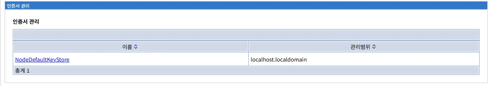

인증서 관리 메뉴를 선택하면 현재 정의된 키 저장소 목록이 표시됩니다.

**화면 경로:**
```
보안 > 인증서 관리
```

### 화면 구성

```
인증서 관리

이름 ↕                              관리범위 ↕
NodeDefaultKeyStore                 localhost.localdomain

총계 1
```

### 목록 테이블

인증서 관리 목록은 다음과 같은 정보를 표시합니다:

| 컬럼 | 설명 |
|------|------|
| **이름** | 키 저장소의 이름입니다. Liberty에서는 일반적으로 노드별로 `NodeDefaultKeyStore`가 자동 생성됩니다. 클릭하면 해당 키 저장소의 상세 설정 페이지로 이동합니다. |
| **관리범위** | 키 저장소가 적용되는 범위입니다. 일반적으로 호스트명과 도메인명으로 표시됩니다. |

**정렬 기능:**

컬럼 헤더의 화살표(↕)를 클릭하여 해당 컬럼 기준으로 오름차순/내림차순 정렬할 수 있습니다.

### 기본 키 저장소

Liberty를 설치하면 다음과 같은 기본 키 저장소가 자동으로 생성됩니다:

| 이름 | 관리범위 | 설명 |
|------|----------|------|
| **NodeDefaultKeyStore** | localhost.localdomain | 노드의 기본 키 저장소. 서버 인증서와 개인키가 저장됩니다. |

**자동 생성 프로세스:**

```
Liberty 서버 첫 시작 시:
1. ${shared.resource.dir}/security/key.p12 생성
2. 자체 서명 인증서 생성
   - CN=localhost.localdomain
   - 유효 기간: 10년
   - 키 크기: 2048비트 RSA
   - 알고리즘: SHA256withRSA
3. NodeDefaultKeyStore 등록
4. SSL 구성에 자동 연결
```

**키 저장소 파일 위치:**

```
기본 경로:
${shared.resource.dir}/security/key.p12

실제 경로 예시:
/opt/ibm/wlp/usr/shared/resources/security/key.p12

또는:
${server.config.dir}/resources/security/key.p12
```

**비밀번호:**

```
자동 생성된 비밀번호:
- 랜덤 생성
- server.env 파일에 저장
- 환경 변수로 참조

변수명:
keystore_password={generated_password}
```

---

## 키 저장소 상세 설정

### 키 저장소 상세 화면

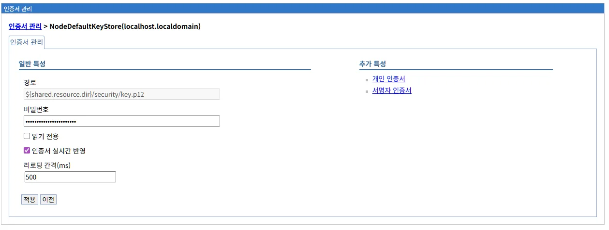

목록에서 키 저장소 이름을 클릭하면 상세 설정 화면이 표시됩니다.

**화면 경로:**
```
보안 > 인증서 관리 > NodeDefaultKeyStore(localhost.localdomain)
```

**화면 구성:**

```
인증서 관리 > NodeDefaultKeyStore(localhost.localdomain)

인증서 관리

일반 특성                          추가 특성
                                   - 개인 인증서
경로                               - 서명자 인증서
[${shared.resource.dir}/security/key.p12]

비밀번호
[••••••••••••••••••••••]

☐ 읽기 전용

☑ 인증서 실시간 반영

리로딩 간격(ms)
[500]

[적용]  [이전]
```

### 일반 특성

#### 1. 경로

```
경로
[${shared.resource.dir}/security/key.p12]
```

키 저장소 파일의 경로를 지정합니다.

**경로 형식:**

**변수 사용 (권장):**
```
${shared.resource.dir}/security/key.p12
${server.config.dir}/resources/security/key.p12
${server.output.dir}/resources/security/key.p12
```

**절대 경로:**
```
/opt/ibm/wlp/usr/shared/resources/security/key.p12
/var/liberty/security/key.p12
```

**상대 경로:**
```
resources/security/key.p12
security/key.p12
```

**Liberty 변수:**

| 변수 | 설명 | 예시 |
|------|------|------|
| **${shared.resource.dir}** | 공유 리소스 디렉토리 | `/opt/ibm/wlp/usr/shared/resources` |
| **${server.config.dir}** | 서버 구성 디렉토리 | `/opt/ibm/wlp/usr/servers/myServer` |
| **${server.output.dir}** | 서버 출력 디렉토리 | `/opt/ibm/wlp/usr/servers/myServer` |
| **${wlp.install.dir}** | Liberty 설치 디렉토리 | `/opt/ibm/wlp` |

**권장사항:**

```
프로덕션 환경:
- ${shared.resource.dir} 사용 (여러 서버 간 공유)
- 절대 경로 지정 (명확성)
- 중앙 저장소에 백업

개발 환경:
- ${server.config.dir} 사용 (서버별 독립)
- 상대 경로 허용
```

#### 2. 비밀번호

```
비밀번호
[••••••••••••••••••••••]
```

키 저장소를 보호하는 비밀번호입니다.

**특징:**
- 입력한 문자는 보안을 위해 마스킹 처리됩니다
- XOR 인코딩되어 server.xml에 저장됩니다
- 변경 시 새 비밀번호 입력

**비밀번호 변경:**

```
1. 비밀번호 필드에 새 비밀번호 입력
2. 적용 클릭
3. 저장
4. 키 저장소 파일의 비밀번호도 동시에 변경해야 함
```

**주의사항:**

```
⚠ 키 저장소 파일의 실제 비밀번호와 일치해야 합니다.
⚠ 비밀번호가 일치하지 않으면 서버가 시작되지 않습니다.
⚠ 비밀번호 변경 시 keytool로 키 저장소 파일도 변경해야 합니다.
```

**키 저장소 파일 비밀번호 변경:**

```bash
# PKCS12 키 저장소 비밀번호 변경
keytool -storepasswd \
  -storetype PKCS12 \
  -keystore ${shared.resource.dir}/security/key.p12

# 프롬프트:
Enter keystore password: [현재 비밀번호]
New keystore password: [새 비밀번호]
Re-enter new keystore password: [새 비밀번호 확인]
```

#### 3. 읽기 전용

```
☐ 읽기 전용
```

키 저장소를 읽기 전용 모드로 설정합니다.

**체크 시:**
```
효과:
- 키 저장소 파일 수정 불가
- 인증서 추가/삭제 불가
- 안전한 읽기 전용 접근

사용 사례:
- 프로덕션 환경에서 실수로 인한 변경 방지
- 공유 키 저장소 보호
- 감사 및 컴플라이언스
```

**체크 해제 시:**
```
효과:
- 키 저장소 파일 수정 가능
- 인증서 추가/삭제 가능

사용 사례:
- 개발/테스트 환경
- 인증서 관리 작업 수행
```

#### 4. 인증서 실시간 반영

```
☑ 인증서 실시간 반영
```

키 저장소 파일의 변경사항을 자동으로 감지하고 반영합니다.

**체크 시 (기본값):**
```
효과:
- 키 저장소 파일 변경 자동 감지
- 서버 재시작 없이 인증서 업데이트
- 리로딩 간격마다 파일 확인

장점:
- 인증서 갱신 시 무중단 적용
- 관리 편의성 향상

주의:
- 파일 시스템 I/O 증가
- 리로딩 간격 설정 중요
```

**체크 해제 시:**
```
효과:
- 파일 변경 자동 감지 안 함
- 인증서 변경 시 서버 재시작 필요

사용 사례:
- 성능 최적화 (I/O 최소화)
- 안정적인 프로덕션 환경
```

#### 5. 리로딩 간격(ms)

```
리로딩 간격(ms)
[500]
```

키 저장소 파일을 확인하는 간격(밀리초)입니다.

**기본값:** 500ms (0.5초)

**설정 가이드:**

```
개발 환경:
간격: 500ms (빠른 반영)
이유: 빈번한 인증서 변경

테스트 환경:
간격: 1000ms (1초)
이유: 적당한 균형

프로덕션 환경:
간격: 5000ms (5초) 또는 더 길게
이유: 파일 시스템 I/O 최소화

높은 트래픽 환경:
간격: 10000ms (10초) 이상
이유: 성능 우선
```

**권장사항:**

```
일반적인 설정:
- 500ms ~ 1000ms: 개발/테스트
- 5000ms ~ 10000ms: 프로덕션

고려사항:
- 짧을수록: 빠른 반영, 높은 I/O
- 길수록: 느린 반영, 낮은 I/O
- 인증서 갱신 빈도에 따라 조정
```

### 변경사항 적용

키 저장소 설정을 변경한 후 화면 하단의 버튼을 사용합니다:

**적용 버튼:**
```
[적용]

변경사항을 임시 저장합니다.
이후 저장/검토 프로세스로 이동합니다.
```

**이전 버튼:**
```
[이전]

변경사항을 취소하고 이전 화면으로 돌아갑니다.
```

---

## 개인 인증서 관리

### 개인 인증서 목록

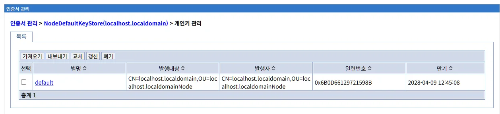

키 저장소 상세 화면의 "추가 특성"에서 "개인 인증서" 링크를 클릭하면 개인 인증서 목록이 표시됩니다.

**화면 경로:**
```
보안 > 인증서 관리 > NodeDefaultKeyStore(localhost.localdomain) > 개인 인증서
```

**화면 구성:**

```
인증서 관리 > NodeDefaultKeyStore(localhost.localdomain) > 개인키 관리

목록

[가져오기] [내보내기] [교체] [갱신] [폐기]

선택  별명 ↕   발행대상 ↕                           발행자 ↕                            일련번호 ↕          만기 ↕
☐    default  CN=localhost.localdomain,OU=localhost  CN=localhost.localdomain,OU=localhost  0x6B0D66129721598B  2028-04-09 12:45:08
             .localdomainNode                        .localdomainNode

총계 1
```

**개인 인증서란:**

개인 인증서(Personal Certificates)는 서버의 신원을 증명하는 인증서와 개인키의 쌍입니다.

```
개인 인증서 구성:
- 공개 인증서: 클라이언트에게 제공
- 개인키: 서버만 소유, 암호화에 사용
- 인증서 체인: CA 인증서 체인

용도:
- HTTPS 서버 인증
- 클라이언트 인증 (Mutual SSL)
- 코드 서명
- 이메일 서명/암호화
```

### 목록 테이블

| 컬럼 | 설명 |
|------|------|
| **선택** | 체크박스를 사용하여 인증서를 선택합니다. 내보내기, 갱신, 폐기 작업 시 사용됩니다. |
| **별명** | 인증서의 별명(alias)입니다. 키 저장소 내에서 인증서를 식별하는 고유한 이름입니다. 클릭하면 인증서 상세 정보를 볼 수 있습니다. |
| **발행대상** | 인증서가 발행된 주체(Subject)입니다. 일반적으로 서버의 호스트명이 포함됩니다. |
| **발행자** | 인증서를 발행한 CA(Certificate Authority)입니다. 자체 서명 인증서의 경우 발행대상과 동일합니다. |
| **일련번호** | 인증서의 고유 일련번호입니다. 16진수로 표시됩니다. |
| **만기** | 인증서의 만료일입니다. 만료 전에 갱신해야 합니다. |

### 관리 탭

개인 인증서를 관리하기 위한 5개의 탭이 제공됩니다:

```
[가져오기] - 외부 인증서 가져오기
[내보내기] - 인증서를 파일로 내보내기
[교체] - 기존 인증서를 새 인증서로 교체
[갱신] - 인증서 갱신 (자체 서명)
[폐기] - 인증서 삭제
```

---

## 인증서 상세 정보

### 인증서 상세 화면

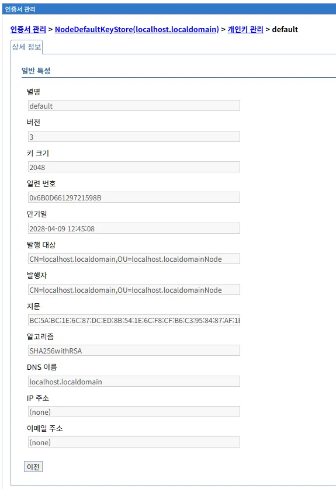

개인 인증서 목록에서 별명을 클릭하면 인증서의 상세 정보가 표시됩니다.

**화면 경로:**
```
보안 > 인증서 관리 > NodeDefaultKeyStore > 개인키 관리 > default
```

**화면 구성:**

```
인증서 관리 > NodeDefaultKeyStore > 개인키 관리 > default

상세 정보

일반 특성

별명
[default]

버전
[3]

키 크기
[2048]

일련 번호
[0x6B0D66129721598B]

만기일
[2028-04-09 12:45:08]

발행 대상
[CN=localhost.localdomain,OU=localhost.localdomainNode]

발행자
[CN=localhost.localdomain,OU=localhost.localdomainNode]

지문
[BC:5A:BC:1E:6C:87:DC:ED:8B:54:1E:6C:F8:CF:B6:C3:95:84:87:AF:1I]

알고리즘
[SHA256withRSA]

DNS 이름
[localhost.localdomain]

IP 주소
[(none)]

이메일 주소
[(none)]

[이전]
```

### 인증서 필드 설명

#### 별명
```
인증서를 식별하는 고유한 이름입니다.
예: default, myserver, production-cert
```

#### 버전
```
X.509 인증서 버전입니다.
- 버전 1: 기본 필드만
- 버전 2: 고유 식별자 추가
- 버전 3: 확장 필드 지원 (가장 일반적)
```

#### 키 크기
```
공개키/개인키의 비트 길이입니다.

RSA 키 크기:
- 2048비트: 표준, 권장
- 3072비트: 높은 보안
- 4096비트: 매우 높은 보안 (성능 저하)
- 1024비트: 약함, 사용 금지

ECDSA 키 크기:
- 256비트: P-256 커브
- 384비트: P-384 커브
```

#### 일련 번호
```
CA가 발행한 인증서의 고유 일련번호입니다.
16진수로 표시됩니다.
인증서 폐기 목록(CRL)에서 식별에 사용됩니다.
```

#### 만기일
```
인증서가 만료되는 날짜와 시간입니다.

만료 전 갱신 권장:
- 30일 전: 갱신 준비
- 14일 전: 갱신 실행
- 7일 전: 긴급 갱신

Let's Encrypt: 90일
일반 CA: 1년 (권장)
```

#### 발행 대상 (Subject)
```
인증서가 발행된 주체의 고유 이름(DN)입니다.

DN 구성 요소:
- CN (Common Name): 호스트명
- OU (Organizational Unit): 부서명
- O (Organization): 조직명
- L (Locality): 도시명
- ST (State): 주/도
- C (Country): 국가 코드

예시:
CN=www.example.com, OU=IT, O=Example Inc, L=Seoul, ST=Seoul, C=KR
```

#### 발행자 (Issuer)
```
인증서를 발행한 CA의 고유 이름(DN)입니다.

자체 서명 인증서:
발행 대상 = 발행자

공인 CA 인증서:
발행자: CN=DigiCert SHA2 Secure Server CA, O=DigiCert Inc, C=US
```

#### 지문 (Fingerprint)
```
인증서의 해시 값입니다.
인증서의 무결성을 검증하는 데 사용됩니다.

형식:
SHA-256: 64자리 16진수
SHA-1: 40자리 16진수 (약함, 사용 금지)

용도:
- 인증서 비교
- 인증서 진위 확인
- 인증서 고정(Certificate Pinning)
```

#### 알고리즘
```
인증서 서명에 사용된 알고리즘입니다.

권장 알고리즘:
- SHA256withRSA (가장 일반적)
- SHA384withRSA
- SHA512withRSA
- SHA256withECDSA

약한 알고리즘 (사용 금지):
- SHA1withRSA (약함)
- MD5withRSA (매우 약함)
```

#### DNS 이름 (SAN - Subject Alternative Name)
```
인증서가 유효한 추가 호스트명입니다.

예시:
- localhost.localdomain
- www.example.com
- example.com
- *.example.com (와일드카드)

중요성:
- 최신 브라우저는 CN보다 SAN을 우선 확인
- 여러 도메인을 하나의 인증서로 보호
```

#### IP 주소
```
인증서가 유효한 IP 주소입니다.
일반적으로 사용되지 않습니다.
```

#### 이메일 주소
```
인증서 소유자의 이메일 주소입니다.
주로 개인 인증서에 사용됩니다.
```

---

## 인증서 가져오기

### 인증서 가져오기 화면

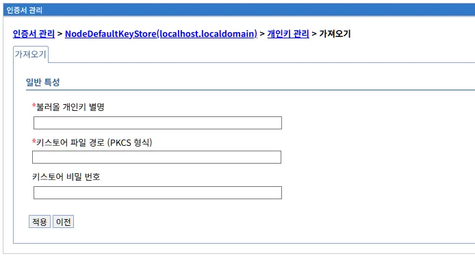

"가져오기" 탭을 클릭하면 외부 인증서를 키 저장소로 가져오는 화면이 표시됩니다.

**화면 경로:**
```
보안 > 인증서 관리 > NodeDefaultKeyStore > 개인키 관리 > 가져오기
```

**화면 구성:**

```
인증서 관리 > NodeDefaultKeyStore > 개인키 관리 > 가져오기

가져오기

일반 특성

*플러그 개인키 별명
[                                    ]

*키스토어 파일 경로 (PKCS 형식)
[                                    ]

키스토어 비밀 번호
[                                    ]

[적용]  [이전]
```

### 입력 필드

#### 1. 플러그 개인키 별명 (필수)

```
*플러그 개인키 별명
[myserver]
```

가져올 인증서의 별명을 지정합니다.

**명명 규칙:**

```
서버 인증서:
- server
- myserver
- prod-server
- api-gateway

클라이언트 인증서:
- client1
- partner-client
- mobile-app

환경별:
- dev-cert
- test-cert
- prod-cert
```

#### 2. 키스토어 파일 경로 (PKCS 형식) (필수)

```
*키스토어 파일 경로 (PKCS 형식)
[/tmp/imported-cert.p12]
```

가져올 인증서가 포함된 PKCS12 파일의 경로입니다.

**지원 형식:**
- PKCS12 (.p12, .pfx)

**파일 생성 방법:**

```bash
# 개인키와 인증서를 PKCS12로 변환
openssl pkcs12 -export \
  -in certificate.crt \
  -inkey private.key \
  -out imported-cert.p12 \
  -name myserver \
  -CAfile ca-chain.crt \
  -caname root

# 입력:
Enter Export Password: [비밀번호 입력]
```

#### 3. 키스토어 비밀 번호

```
키스토어 비밀 번호
[password123]
```

PKCS12 파일의 비밀번호입니다.

### 가져오기 프로세스

```
1단계: 파일 준비
- PKCS12 파일 생성 또는 획득
- Liberty 서버가 접근 가능한 위치에 복사

2단계: LibriX에서 가져오기
- 가져오기 탭 클릭
- 별명, 파일 경로, 비밀번호 입력
- 적용 클릭

3단계: 저장
- 변경사항 검토
- 저장

4단계: 확인
- 개인 인증서 목록에서 확인
- 인증서 상세 정보 확인
```

**사용 시나리오:**

**시나리오 1: 공인 CA 인증서 가져오기**
```
1. CA로부터 인증서 받기:
   - server.crt (서버 인증서)
   - intermediate.crt (중간 CA)
   - private.key (개인키)

2. PKCS12 파일 생성:
openssl pkcs12 -export \
  -in server.crt \
  -inkey private.key \
  -out server.p12 \
  -name myserver \
  -CAfile intermediate.crt

3. LibriX에서 가져오기:
   - 별명: myserver
   - 경로: /tmp/server.p12
   - 비밀번호: [입력]
```

**시나리오 2: 다른 서버에서 인증서 이동**
```
1. 원본 서버에서 내보내기:
keytool -exportcert \
  -alias myserver \
  -keystore source.p12 \
  -file myserver.crt

keytool -importkeystore \
  -srckeystore source.p12 \
  -destkeystore export.p12 \
  -srcalias myserver \
  -destalias myserver

2. 파일 전송:
scp export.p12 target-server:/tmp/

3. 대상 서버에서 가져오기:
   - LibriX UI 사용
```

---

## 인증서 내보내기

### 인증서 내보내기 화면

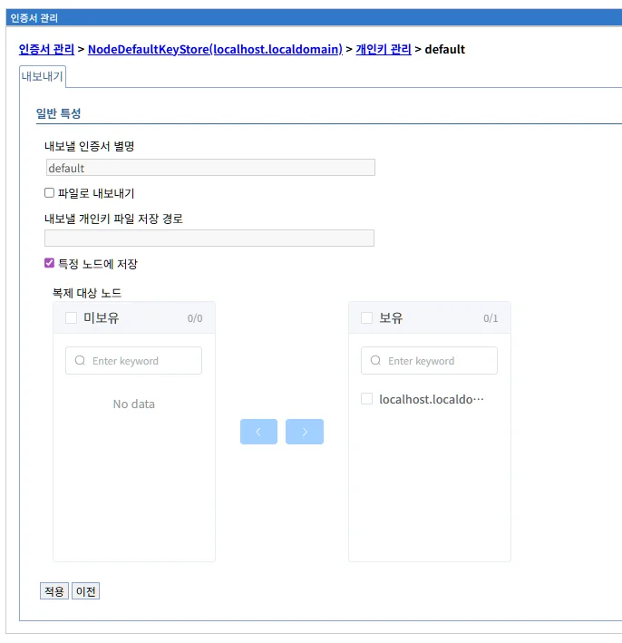

인증서를 선택하고 "내보내기" 탭을 클릭하면 인증서를 파일로 내보내는 화면이 표시됩니다.

**화면 경로:**
```
보안 > 인증서 관리 > NodeDefaultKeyStore > 개인키 관리 > 인증서 선택 > 내보내기
```

**화면 구성:**

```
인증서 관리 > NodeDefaultKeyStore > 개인키 관리 > default

내보내기

일반 특성

내보낼 인증서 별명
[default]

☐ 파일로 내보내기

내보낼 개인키 파일 저장 경로
[                                    ]

☑ 특정 노드에 저장

목적 대상 노드
미보유              보유
0/0                 0/1
[                ]  [☑ localhost.localdomain...]
[No data         ]  

[<  >]

[적용]  [이전]
```

### 내보내기 옵션

#### 1. 내보낼 인증서 별명

```
내보낼 인증서 별명
[default]
```

선택한 인증서의 별명이 자동으로 표시됩니다.

#### 2. 파일로 내보내기

```
☐ 파일로 내보내기
```

**체크 시:**
```
인증서를 파일 시스템에 저장합니다.
"내보낼 개인키 파일 저장 경로" 필드가 활성화됩니다.
```

**체크 해제 시:**
```
특정 노드로만 전송합니다 (클러스터 환경).
```

#### 3. 내보낼 개인키 파일 저장 경로

```
내보낼 개인키 파일 저장 경로
[/tmp/exported-cert.p12]
```

내보낸 인증서를 저장할 파일 경로입니다.

**권장 경로:**
```
임시 저장:
/tmp/exported-cert.p12
${java.io.tmpdir}/exported-cert.p12

백업 저장:
/backup/certificates/myserver-20240120.p12
${shared.resource.dir}/backup/cert.p12
```

#### 4. 특정 노드에 저장

```
☑ 특정 노드에 저장

목적 대상 노드
미보유              보유
0/0                 0/1
[                ]  [☑ localhost.localdomain]
```

클러스터 환경에서 인증서를 다른 노드로 복사합니다.

**사용 시나리오:**
```
단일 서버:
- 일반적으로 사용 안 함

클러스터 환경:
- 마스터 노드에서 워커 노드로 인증서 배포
- 여러 노드에 동일한 인증서 적용
```

### 내보내기 프로세스

```
1단계: 인증서 선택
- 개인 인증서 목록에서 체크박스 선택

2단계: 내보내기 탭 클릭
- 내보내기 화면 표시

3단계: 옵션 설정
- 파일로 내보내기 체크
- 저장 경로 입력

4단계: 적용 및 저장
- 적용 클릭
- 변경사항 저장

5단계: 파일 확인
- 지정한 경로에 파일 생성 확인
```

**사용 시나리오:**

**시나리오 1: 인증서 백업**
```
목적: 재해 복구를 위한 백업

절차:
1. default 인증서 선택
2. 내보내기 탭 클릭
3. 파일로 내보내기 체크
4. 경로: /backup/certs/default-20240120.p12
5. 적용 → 저장

결과:
백업 파일 생성 및 안전한 저장소에 보관
```

**시나리오 2: 다른 서버로 인증서 이동**
```
목적: 동일한 인증서를 여러 서버에서 사용

절차:
1. 서버 A에서 인증서 내보내기
2. 파일을 서버 B로 전송 (scp, sftp)
3. 서버 B에서 가져오기

명령:
scp /tmp/exported-cert.p12 serverB:/tmp/
```

---

## 인증서 교체

### 인증서 교체 화면

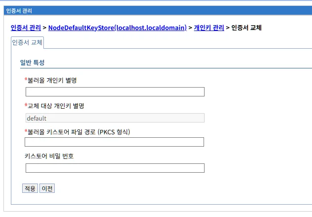

"교체" 탭을 클릭하면 기존 인증서를 새 인증서로 교체하는 화면이 표시됩니다.

**화면 경로:**
```
보안 > 인증서 관리 > NodeDefaultKeyStore > 개인키 관리 > 인증서 교체
```

**화면 구성:**

```
인증서 관리 > NodeDefaultKeyStore > 개인키 관리 > 인증서 교체

인증서 교체

일반 특성

*플러그 개인키 별명
[                                    ]

*교체 대상 개인키 별명
[default                             ]

*플러그 키스토어 파일 경로 (PKCS 형식)
[                                    ]

키스토어 비밀 번호
[                                    ]

[적용]  [이전]
```

### 입력 필드

#### 1. 플러그 개인키 별명 (필수)

```
*플러그 개인키 별명
[newserver]
```

새 인증서의 별명입니다.

#### 2. 교체 대상 개인키 별명 (필수)

```
*교체 대상 개인키 별명
[default]
```

교체할 기존 인증서의 별명입니다.
자동으로 표시됩니다.

#### 3. 플러그 키스토어 파일 경로 (PKCS 형식) (필수)

```
*플러그 키스토어 파일 경로 (PKCS 형식)
[/tmp/new-cert.p12]
```

새 인증서가 포함된 PKCS12 파일의 경로입니다.

#### 4. 키스토어 비밀 번호

```
키스토어 비밀 번호
[password123]
```

PKCS12 파일의 비밀번호입니다.

### 교체 프로세스

```
1단계: 새 인증서 준비
- 공인 CA에서 새 인증서 발급
- 또는 자체 서명 인증서 생성
- PKCS12 파일로 변환

2단계: LibriX에서 교체
- 교체 탭 클릭
- 새 인증서 별명 입력
- 교체 대상 확인
- 파일 경로 및 비밀번호 입력
- 적용 클릭

3단계: 저장 및 확인
- 변경사항 저장
- 인증서 목록에서 확인
- SSL 연결 테스트
```

**사용 시나리오:**

**시나리오 1: 만료 예정 인증서 교체**
```
상황:
기존 인증서가 곧 만료됨

절차:
1. CA에서 새 인증서 발급
2. 새 인증서를 PKCS12로 변환
3. LibriX에서 교체 실행:
   - 플러그 별명: newserver
   - 교체 대상: default
   - 파일: /tmp/new-cert.p12
4. 저장 및 서버 재시작 (필요시)
5. HTTPS 접속 테스트
6. 새 인증서 확인
```

**시나리오 2: 호스트명 변경**
```
상황:
서버 호스트명이 변경되어 새 인증서 필요

절차:
1. 새 호스트명으로 CSR 생성
2. CA에서 인증서 발급
3. 교체 실행
4. DNS 업데이트
5. 테스트
```

---

## 인증서 갱신

### 인증서 갱신 화면

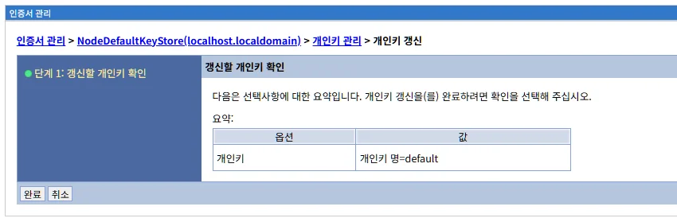

인증서를 선택하고 "갱신" 탭을 클릭하면 인증서를 갱신하는 화면이 표시됩니다.

**화면 경로:**
```
보안 > 인증서 관리 > NodeDefaultKeyStore > 개인키 관리 > 인증서 선택 > 갱신
```

**화면 구성:**

```
인증서 관리 > NodeDefaultKeyStore > 개인키 관리 > 갱신

● 단계 1: 갱신할 개인키 확인

갱신할 개인키 확인

다음은 선택사항에 대한 요약입니다. 
개인키 갱신(들) 완료하려면 확인을 선택해 주십시오.

요약:
옵션            값
개인키 명       개인키 명=default

[완료]  [취소]
```

### 갱신 프로세스

```
1단계: 인증서 선택
- 개인 인증서 목록에서 갱신할 인증서 선택

2단계: 갱신 탭 클릭
- 확인 메시지 표시

3단계: 확인
- 개인키 명 확인
- 완료 버튼 클릭

4단계: 저장
- 변경사항 저장

결과:
- 자체 서명 인증서가 새로 생성됨
- 유효 기간이 연장됨
- 기존 개인키는 유지됨
```

**주의사항:**

```
⚠ 자체 서명 인증서만 갱신 가능
⚠ 공인 CA 인증서는 CA에서 재발급 받아야 함
⚠ 갱신 시 새 일련번호와 유효 기간이 설정됨
⚠ 기존 개인키는 그대로 유지됨
```

**갱신 vs 교체:**

| 작업 | 갱신 | 교체 |
|------|------|------|
| **대상** | 자체 서명 인증서만 | 모든 인증서 |
| **개인키** | 유지 | 변경 가능 |
| **일련번호** | 변경 | 변경 |
| **유효 기간** | 연장 | 새로 설정 |
| **발행자** | 동일 | 변경 가능 |

---

## 인증서 폐기

### 인증서 폐기 화면

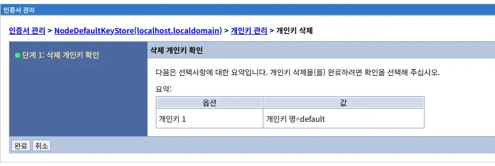

인증서를 선택하고 "폐기" 탭을 클릭하면 인증서를 삭제하는 화면이 표시됩니다.

**화면 경로:**
```
보안 > 인증서 관리 > NodeDefaultKeyStore > 개인키 관리 > 인증서 선택 > 폐기
```

**화면 구성:**

```
인증서 관리 > NodeDefaultKeyStore > 개인키 관리 > 개인키 삭제

● 단계 1: 삭제 개인키 확인

삭제 개인키 확인

다음은 선택사항에 대한 요약입니다. 
개인키 삭제(들) 완료하려면 확인을 선택해 주십시오.

요약:
옵션            값
개인키 1        개인키 명=default

[완료]  [취소]
```

### 폐기 프로세스

```
1단계: 인증서 선택
- 개인 인증서 목록에서 삭제할 인증서 선택
- 여러 개 선택 가능

2단계: 폐기 탭 클릭
- 확인 메시지 표시

3단계: 확인
- 삭제할 개인키 목록 확인
- 완료 버튼 클릭

4단계: 저장
- 변경사항 저장

결과:
- 인증서와 개인키가 키 저장소에서 삭제됨
- 복구 불가능
```

### 폐기 주의사항

**⚠ 중요:**

```
1. 복구 불가능
   - 삭제된 인증서와 개인키는 복구할 수 없습니다
   - 삭제 전 반드시 백업하십시오

2. 서비스 중단 가능
   - 사용 중인 인증서를 삭제하면 SSL 연결 실패
   - HTTPS 서비스 중단
   - 대체 인증서 준비 필요

3. 마지막 인증서
   - 마지막 개인 인증서를 삭제하면 HTTPS 사용 불가
   - 새 인증서 생성 또는 가져오기 필요

4. 참조 확인
   - SSL 구성에서 참조 중인지 확인
   - 애플리케이션에서 사용 중인지 확인
```

**삭제 전 체크리스트:**

```
☐ 인증서 백업 완료
☐ 대체 인증서 준비 (필요 시)
☐ SSL 구성 업데이트 계획
☐ 다운타임 계획 (필요 시)
☐ 관련 팀에 통보
☐ 롤백 계획 수립
```

---

## 서명자 인증서 관리

### 서명자 인증서 목록

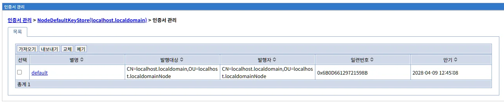

키 저장소 상세 화면의 "추가 특성"에서 "서명자 인증서" 링크를 클릭하면 서명자 인증서 목록이 표시됩니다.

**화면 경로:**
```
보안 > 인증서 관리 > NodeDefaultKeyStore(localhost.localdomain) > 인증서 관리
```

**화면 구성:**

```
인증서 관리 > NodeDefaultKeyStore > 인증서 관리

목록

[가져오기] [내보내기] [교체] [폐기]

선택  별명 ↕   발행대상 ↕                           발행자 ↕                            일련번호 ↕          만기 ↕
☐    default  CN=localhost.localdomain,OU=localhost  CN=localhost.localdomain,OU=localhost  0x6B0D66129721598B  2028-04-09 12:45:08
             .localdomainNode                        .localdomainNode

총계 1
```

**서명자 인증서란:**

서명자 인증서(Signer Certificates)는 신뢰하는 CA의 인증서입니다.

```
서명자 인증서 구성:
- CA 루트 인증서
- 중간 CA 인증서
- 신뢰하는 서버 인증서
- 신뢰하는 클라이언트 인증서

용도:
- 클라이언트 인증서 검증 (Mutual SSL)
- SSL 연결 검증
- 인증서 체인 검증
- 파트너사 인증서 신뢰
```

### 서명자 인증서 vs 개인 인증서

| 항목 | 개인 인증서 | 서명자 인증서 |
|------|------------|--------------|
| **개인키** | 포함 | 미포함 |
| **용도** | 자신을 증명 | 상대방을 검증 |
| **위치** | 키 저장소 | 신뢰 저장소 |
| **예시** | 서버 인증서 | CA 루트 인증서 |
| **개수** | 1-few | Many |

### 관리 탭

서명자 인증서를 관리하기 위한 4개의 탭이 제공됩니다:

```
[가져오기] - CA 인증서 가져오기
[내보내기] - 인증서를 파일로 내보내기
[교체] - 기존 인증서를 새 인증서로 교체
[폐기] - 인증서 삭제
```

**주의:**
- 서명자 인증서에는 "갱신" 탭이 없습니다
- CA 인증서는 갱신할 수 없으며, CA에서 새로 발급받아야 합니다

---

## 서명자 인증서 작업

### 서명자 인증서 가져오기

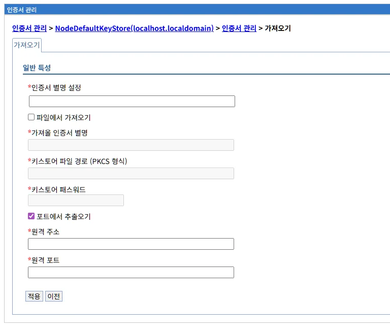

"가져오기" 탭을 클릭하면 CA 인증서를 가져오는 화면이 표시됩니다.

**화면 경로:**
```
보안 > 인증서 관리 > NodeDefaultKeyStore > 인증서 관리 > 가져오기
```

**화면 구성:**

```
인증서 관리 > NodeDefaultKeyStore > 인증서 관리 > 가져오기

가져오기

일반 특성

*인증서 별명 설정
[                                    ]

☐ 파일에서 가져오기

*가져올 인증서 별명
[                                    ]

*키스토어 파일 경로 (PKCS 형식)
[                                    ]

*키스토어 패스워드
[                    ]

☑ 포트에서 추출오기

*원격 주소
[                                    ]

*원격 포트
[                                    ]

[적용]  [이전]
```

#### 입력 필드

**1. 인증서 별명 설정 (필수)**
```
가져올 CA 인증서의 별명을 지정합니다.

예시:
- ca-root
- partner-ca
- intermediate-ca
- client-ca
```

**2. 파일에서 가져오기**
```
☐ 파일에서 가져오기

체크 시: 파일 시스템에서 인증서 가져오기
- 가져올 인증서 별명
- 키스토어 파일 경로
- 키스토어 패스워드
```

**3. 포트에서 추출오기 (기본 체크)**
```
☑ 포트에서 추출오기

체크 시: 원격 서버에서 직접 인증서 추출
- 원격 주소: 서버 호스트명 또는 IP
- 원격 포트: SSL/TLS 포트 (일반적으로 443)

장점:
- 간편한 인증서 획득
- 파일 변환 불필요

사용 예시:
원격 주소: www.example.com
원격 포트: 443

Liberty가 해당 서버에 연결하여 인증서 체인을 자동으로 가져옵니다.
```

**파일에서 가져오기 vs 포트에서 추출:**

| 방법 | 장점 | 단점 | 사용 사례 |
|------|------|------|----------|
| **파일에서** | 오프라인 가능, 정확한 인증서 선택 | 파일 준비 필요 | CA 루트 인증서, 오프라인 환경 |
| **포트에서** | 간편, 자동 체인 수집 | 네트워크 필요, 방화벽 제한 | 파트너 서버 인증서, 온라인 환경 |

#### 가져오기 시나리오

**시나리오 1: 파일에서 CA 인증서 가져오기**
```
목적: CA 루트 인증서 추가

절차:
1. CA 웹사이트에서 루트 인증서 다운로드 (ca-root.crt)
2. 서명자 인증서 > 가져오기
3. 파일에서 가져오기 체크
4. 인증서 별명: ca-root
5. 인증서 파일 경로: /tmp/ca-root.crt
6. 적용 → 저장

결과:
CA 루트 인증서가 신뢰 저장소에 추가됨
```

**시나리오 2: 포트에서 파트너 인증서 추출**
```
목적: 파트너 서버의 인증서 신뢰

절차:
1. 서명자 인증서 > 가져오기
2. 포트에서 추출오기 체크
3. 인증서 별명: partner-server
4. 원격 주소: partner.example.com
5. 원격 포트: 443
6. 적용 → 저장

결과:
파트너 서버의 인증서 체인이 자동으로 추가됨
```

### 서명자 인증서 내보내기

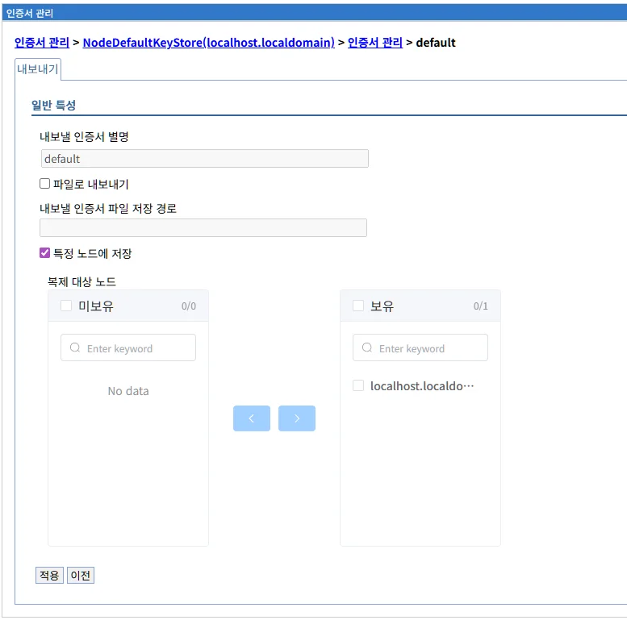

서명자 인증서를 선택하고 "내보내기" 탭을 클릭하면 인증서를 파일로 내보내는 화면이 표시됩니다.

**화면 구성:**

```
인증서 관리 > NodeDefaultKeyStore > 인증서 관리 > default

내보내기

일반 특성

내보낼 인증서 별명
[default]

☐ 파일로 내보내기

내보낼 인증서 파일 저장 경로
[                                    ]

☑ 특정 노드에 저장

목적 대상 노드
미보유              보유
0/0                 0/1
[                ]  [☑ localhost.localdomain...]

[<  >]

[적용]  [이전]
```

**개인 인증서 내보내기와의 차이점:**

| 항목 | 개인 인증서 | 서명자 인증서 |
|------|------------|--------------|
| **파일 내용** | 인증서 + 개인키 | 인증서만 |
| **파일 형식** | PKCS12 (.p12) | CRT (.crt) |
| **비밀번호** | 필요 | 불필요 |
| **용도** | 백업, 이동 | 배포, 공유 |

### 서명자 인증서 교체

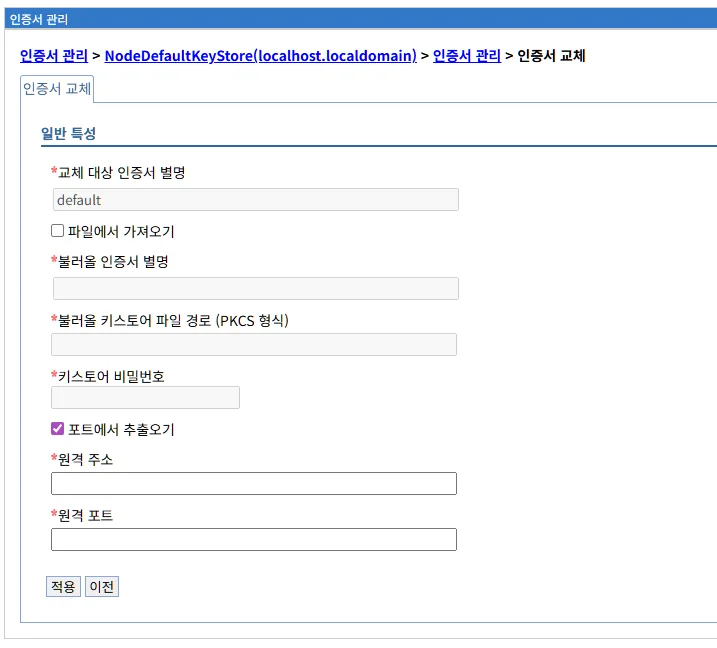

"교체" 탭을 클릭하면 기존 CA 인증서를 새 인증서로 교체하는 화면이 표시됩니다.

**화면 구성:**

```
인증서 관리 > NodeDefaultKeyStore > 인증서 관리 > 인증서 교체

인증서 교체

일반 특성

*교체 대상 인증서 별명
[default                             ]

☐ 파일에서 가져오기

*블러그 인증서 별명
[                                    ]

*블러그 키스토어 파일 경로 (PKCS 형식)
[                                    ]

*키스토어 비밀번호
[                    ]

☑ 포트에서 추출오기

*원격 주소
[                                    ]

*원격 포트
[                                    ]

[적용]  [이전]
```

**사용 시나리오:**

```
CA 인증서 갱신:
- 기존 CA가 루트 인증서 갱신
- 새 루트 인증서로 교체

중간 CA 변경:
- CA의 중간 인증서 구조 변경
- 새 중간 CA 인증서로 교체
```

### 서명자 인증서 폐기

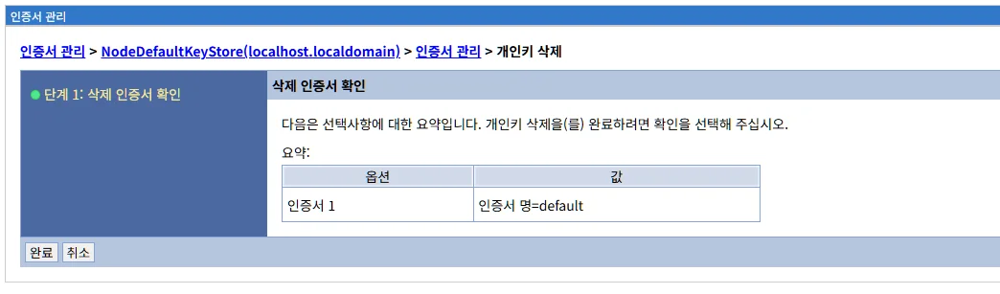

서명자 인증서를 선택하고 "폐기" 탭을 클릭하면 인증서를 삭제하는 화면이 표시됩니다.

**화면 구성:**

```
인증서 관리 > NodeDefaultKeyStore > 인증서 관리 > 개인키 삭제

● 단계 1: 삭제 인증서 확인

삭제 인증서 확인

다음은 선택사항에 대한 요약입니다. 
개인키 삭제(들) 완료하려면 확인을 선택해 주십시오.

요약:
옵션            값
인증서 1        인증서 명=default

[완료]  [취소]
```

**폐기 주의사항:**

```
⚠ CA 인증서 삭제 영향:
- 해당 CA가 발행한 모든 인증서 검증 실패
- SSL 연결 오류 발생 가능
- 클라이언트 인증 실패 (Mutual SSL)

삭제 전 확인:
☐ 다른 인증서가 해당 CA에 의존하지 않는지 확인
☐ 테스트 환경에서 먼저 검증
☐ 백업 생성
```

### 서명자 인증서 관리 시나리오

**시나리오 1: Mutual SSL을 위한 클라이언트 CA 추가**

```
목적:
클라이언트 인증서를 검증하기 위해 클라이언트 CA를 신뢰 저장소에 추가

절차:
1. 파트너사로부터 CA 인증서 받기 (client-ca.crt)
2. 서명자 인증서 관리 화면 접속
3. 가져오기 클릭
4. 별명: partner-ca
5. 파일 경로: /tmp/client-ca.crt
6. 적용 → 저장
7. SSL 구성에서 클라이언트 인증 활성화
```

**시나리오 2: 공인 CA 루트 인증서 추가**

```
목적:
특정 CA가 발행한 인증서를 신뢰하도록 설정

절차:
1. CA 웹사이트에서 루트 인증서 다운로드
2. 서명자 인증서로 가져오기
3. 중간 CA 인증서도 추가 (필요시)
```

**시나리오 3: 자체 서명 인증서 신뢰 (개발 환경)**

```
상황:
개발 서버의 자체 서명 인증서를 클라이언트에서 신뢰해야 함

절차:
1. 서버의 개인 인증서 내보내기
2. 클라이언트의 서명자 인증서로 가져오기
3. 클라이언트에서 서버 접속 시 인증서 경고 없음
```

---

## 변경사항 저장 프로세스

인증서 관리의 모든 변경 작업 후 저장 프로세스는 다른 컴포넌트와 동일합니다.

### 저장 확인 메시지

인증서를 가져오기, 교체, 갱신 또는 폐기한 후 "적용" 버튼을 클릭하면 다음과 같은 메시지가 표시됩니다:

```
□ 메시지

⚠ 로컬 구성에 변경 사항이 적용되었습니다.
   다음을 수행할 수 있습니다.

• 저장
• 저장하거나 버리기 전 변경사항 검토

⚠ 이 변경사항을 적용하려면, 서버를 다시 시작해야 합니다.
```

### 변경사항 검토

"저장하거나 버리기 전 변경사항 검토" 링크를 클릭하면 변경된 구성 파일을 확인할 수 있습니다:

```
저장

변경된 항목                                       상태
${shared.resource.dir}/security/key.p12          업데이트됨

[저장]  [버리기]  [이전]
```

**변경된 파일:**

| 파일 경로 | 상태 | 설명 |
|----------|------|------|
| **${shared.resource.dir}/security/key.p12** | 업데이트됨 | 키 저장소 파일. 인증서와 개인키가 이 파일에 저장됩니다. |

---

## Liberty 인증서 구성

### 키 저장소 요소

Liberty의 키 저장소는 `<keyStore>` 요소로 정의됩니다.

**server.xml 구성 예시:**

```xml
<?xml version="1.0" encoding="UTF-8"?>
<server description="Liberty Server">
    
    <!-- 키 저장소 정의 -->
    <keyStore id="defaultKeyStore" 
              location="${shared.resource.dir}/security/key.p12" 
              type="PKCS12" 
              password="{xor}Lz4sLChvLTs=" 
              readOnly="false"
              fileBased="true"
              updateTrigger="polled"
              pollingRate="500ms" />
    
    <!-- 신뢰 저장소 정의 (선택적) -->
    <keyStore id="defaultTrustStore" 
              location="${shared.resource.dir}/security/trust.p12" 
              type="PKCS12" 
              password="{xor}PjsyNjEsLQ==" />
    
    <!-- SSL 구성에서 키 저장소 참조 -->
    <ssl id="defaultSSLConfig" 
         keyStoreRef="defaultKeyStore" 
         trustStoreRef="defaultTrustStore"
         clientAuthentication="false" />
    
    <!-- HTTPS 엔드포인트 -->
    <httpEndpoint id="defaultHttpEndpoint" 
                  httpPort="9080" 
                  httpsPort="9443"
                  host="*">
        <sslOptions sslRef="defaultSSLConfig" />
    </httpEndpoint>
    
</server>
```

### 주요 키 저장소 속성

**1. id**
```xml
id="defaultKeyStore"
```
- 키 저장소의 고유 식별자
- SSL 구성에서 참조에 사용

**2. location**
```xml
location="${shared.resource.dir}/security/key.p12"
```
- 키 저장소 파일의 경로
- 절대 경로 또는 Liberty 변수 사용

**3. type**
```xml
type="PKCS12"  (권장)
type="JKS"     (레거시)
```
- 키 저장소 형식
- PKCS12 권장 (표준)

**4. password**
```xml
password="{xor}Lz4sLChvLTs="
password="password123"  (평문, 권장 안 함)
```
- 키 저장소 비밀번호
- XOR 인코딩 권장

**5. readOnly**
```xml
readOnly="false"  (기본값, 읽기/쓰기)
readOnly="true"   (읽기 전용)
```
- 읽기 전용 모드

**6. fileBased**
```xml
fileBased="true"   (기본값, 파일 기반)
fileBased="false"  (메모리 기반)
```
- 파일 기반 또는 메모리 기반

**7. updateTrigger**
```xml
updateTrigger="polled"    (주기적 확인)
updateTrigger="mbean"     (JMX 트리거)
updateTrigger="disabled"  (비활성화)
```
- 파일 변경 감지 방식

**8. pollingRate**
```xml
pollingRate="500ms"  (0.5초)
pollingRate="5s"     (5초)
```
- 파일 확인 간격

### 인증서 명령줄 관리

Liberty는 `keytool` 명령을 사용하여 인증서를 관리할 수 있습니다.

**주요 keytool 명령:**

**1. 키 저장소 생성**
```bash
keytool -genkeypair \
  -alias myserver \
  -keyalg RSA \
  -keysize 2048 \
  -validity 365 \
  -keystore key.p12 \
  -storetype PKCS12 \
  -dname "CN=www.example.com, OU=IT, O=Example Inc, L=Seoul, C=KR"
```

**2. 인증서 가져오기**
```bash
# CA 인증서 가져오기
keytool -import \
  -alias ca-root \
  -file ca-root.crt \
  -keystore trust.p12 \
  -storetype PKCS12

# 서버 인증서와 개인키 가져오기 (PKCS12)
keytool -importkeystore \
  -srckeystore server.p12 \
  -destkeystore key.p12 \
  -srcstoretype PKCS12 \
  -deststoretype PKCS12
```

**3. 인증서 내보내기**
```bash
# 인증서만 내보내기 (공개키)
keytool -exportcert \
  -alias myserver \
  -file myserver.crt \
  -keystore key.p12 \
  -storetype PKCS12

# 인증서와 개인키 내보내기
keytool -importkeystore \
  -srckeystore key.p12 \
  -destkeystore exported.p12 \
  -srcalias myserver \
  -destalias myserver
```

**4. 인증서 조회**
```bash
# 키 저장소의 모든 인증서 나열
keytool -list \
  -keystore key.p12 \
  -storetype PKCS12

# 특정 인증서 상세 정보
keytool -list -v \
  -alias myserver \
  -keystore key.p12 \
  -storetype PKCS12
```

**5. 인증서 삭제**
```bash
keytool -delete \
  -alias myserver \
  -keystore key.p12 \
  -storetype PKCS12
```

**6. CSR 생성**
```bash
# 인증서 서명 요청 생성
keytool -certreq \
  -alias myserver \
  -file myserver.csr \
  -keystore key.p12 \
  -storetype PKCS12

# CSR을 CA에 제출하여 인증서 획득
```

**7. 비밀번호 변경**
```bash
# 키 저장소 비밀번호 변경
keytool -storepasswd \
  -keystore key.p12 \
  -storetype PKCS12

# 개인키 비밀번호 변경
keytool -keypasswd \
  -alias myserver \
  -keystore key.p12 \
  -storetype PKCS12
```

---

## WebSphere ND와의 비교

### 인증서 관리 비교

#### WebSphere ND

**키 저장소 관리:**
```
위치:
보안 > SSL 인증서 및 키 관리 > 키 저장소 및 인증서

키 저장소 유형:
- Cell 레벨 키 저장소
- Node 레벨 키 저장소
- Server 레벨 키 저장소
- 사용자 정의 키 저장소

범위:
- Cell 전체
- 특정 Node
- 특정 Server

형식:
- JKS (Java KeyStore)
- PKCS12
- CMS (IBM Cryptographic Management Store)
```

**인증서 관리 기능:**
```
GUI 완전 지원:
- 키 저장소 생성/삭제
- 인증서 생성 (자체 서명)
- CSR 생성 (GUI)
- 인증서 가져오기 (CRT, P12, JKS)
- 인증서 내보내기
- 인증서 체인 관리
- 인증서 갱신
- 인증서 폐기
- 인증서 만료 알림

고급 기능:
- 인증서 그룹 관리
- 인증서 필터링
- 인증서 검증
- CRL(인증서 폐기 목록) 관리
- OCSP(온라인 인증서 상태 프로토콜)
```

#### Liberty (LibriX)

**키 저장소 관리:**
```
위치:
보안 > 인증서 관리

키 저장소 유형:
- Node 기본 키 저장소 (자동 생성)

범위:
- Server 레벨만

형식:
- PKCS12 (권장)
- JKS (지원)
```

**인증서 관리 기능:**
```
GUI 기본 지원:
- 키 저장소 설정 관리
- 개인 인증서 관리
- 서명자 인증서 관리
- 인증서 가져오기 (P12)
- 인증서 내보내기
- 인증서 교체
- 인증서 갱신 (자체 서명)
- 인증서 폐기

제한 사항:
- CSR 생성: 명령줄 도구 사용
- 인증서 생성: 자동 또는 명령줄
- 인증서 체인: 수동 관리
```

### 주요 차이점 요약

| 항목 | WebSphere ND | Liberty (LibriX) |
|------|--------------|------------------|
| **키 저장소 개수** | 다중 (Cell/Node/Server) | 노드별 1개 |
| **관리 범위** | Cell/Node/Server | Server only |
| **GUI 지원** | 완전 지원 | 기본 지원 |
| **자동 생성** | 선택적 | 자동 (첫 시작 시) |
| **CSR 생성** | GUI 지원 | 명령줄 도구 |
| **형식** | JKS, PKCS12, CMS | PKCS12 (권장) |
| **인증서 체인** | GUI 관리 | 수동 관리 |
| **만료 알림** | 내장 | 외부 모니터링 |

---

## 사용 시나리오

### 시나리오 1: 공인 CA 인증서 설정 (프로덕션)

**요구사항:**
- HTTPS 프로덕션 서비스
- 공인 CA 인증서 사용
- 브라우저 경고 없음

**단계별 구현:**

**1. 개인키 생성**
```bash
openssl genrsa -out private.key 2048
```

**2. CSR 생성**
```bash
openssl req -new \
  -key private.key \
  -out server.csr \
  -subj "/C=KR/ST=Seoul/L=Seoul/O=Example Inc/OU=IT/CN=www.example.com"
```

**3. CA에 CSR 제출 및 인증서 받기**
```
DigiCert, Let's Encrypt, Sectigo 등에 CSR 제출
인증서 파일 받기:
- server.crt (서버 인증서)
- intermediate.crt (중간 CA)
- root.crt (루트 CA)
```

**4. PKCS12 파일 생성**
```bash
# 인증서 체인 결합
cat server.crt intermediate.crt root.crt > cert-chain.crt

# PKCS12 변환
openssl pkcs12 -export \
  -in cert-chain.crt \
  -inkey private.key \
  -out server.p12 \
  -name myserver \
  -password pass:changeit
```

**5. LibriX에서 가져오기**
```
1. 보안 > 인증서 관리
2. NodeDefaultKeyStore 클릭
3. 개인 인증서 클릭
4. 가져오기 탭:
   - 별명: myserver
   - 경로: /tmp/server.p12
   - 비밀번호: changeit
5. 적용 → 저장
```

**6. SSL 구성 업데이트**
```
server.xml에서 별명 참조:
<keyStore id="defaultKeyStore" ... />
<ssl id="defaultSSLConfig" 
     keyStoreRef="defaultKeyStore" />
```

**7. 테스트**
```
https://www.example.com

브라우저에서 인증서 확인:
- 녹색 자물쇠 아이콘
- "안전함" 표시
- 인증서 정보 확인
```

### 시나리오 2: Let's Encrypt 무료 인증서

**요구사항:**
- 무료 SSL 인증서
- 자동 갱신

**구현:**

**1. Certbot 설치 및 인증서 받기**
```bash
# Certbot 설치 (Ubuntu)
apt-get install certbot

# 인증서 발급 (standalone 모드)
certbot certonly --standalone \
  -d www.example.com \
  -d example.com

# 발급된 파일:
# /etc/letsencrypt/live/www.example.com/fullchain.pem
# /etc/letsencrypt/live/www.example.com/privkey.pem
```

**2. PKCS12 변환**
```bash
openssl pkcs12 -export \
  -in /etc/letsencrypt/live/www.example.com/fullchain.pem \
  -inkey /etc/letsencrypt/live/www.example.com/privkey.pem \
  -out letsencrypt.p12 \
  -name letsencrypt \
  -password pass:changeit
```

**3. LibriX에 가져오기**
```
개인 인증서 가져오기:
- 별명: letsencrypt
- 경로: /tmp/letsencrypt.p12
- 비밀번호: changeit
```

**4. 자동 갱신 스크립트**
```bash
#!/bin/bash
# renew-cert.sh

# 인증서 갱신
certbot renew --quiet

# PKCS12 변환
openssl pkcs12 -export \
  -in /etc/letsencrypt/live/www.example.com/fullchain.pem \
  -inkey /etc/letsencrypt/live/www.example.com/privkey.pem \
  -out /opt/liberty/certs/letsencrypt.p12 \
  -name letsencrypt \
  -password pass:${KEYSTORE_PASSWORD}

# Liberty 재시작 (인증서 실시간 반영 활성화된 경우 불필요)
# /opt/ibm/wlp/bin/server stop myServer
# /opt/ibm/wlp/bin/server start myServer
```

**5. Cron 작업 설정**
```bash
# 매월 1일 오전 3시 실행
0 3 1 * * /opt/scripts/renew-cert.sh
```

### 시나리오 3: Mutual SSL (양방향 인증)

**요구사항:**
- API 게이트웨이
- 클라이언트 인증서 필수
- 특정 파트너사만 접근 허용

**구현:**

**서버 측 설정:**

**1. 서버 인증서 설정 (위 시나리오 1 참조)**

**2. 클라이언트 CA 인증서 가져오기**
```bash
# 파트너사 CA 인증서 받기
# partner-ca.crt

# LibriX에서 서명자 인증서로 가져오기:
1. 보안 > 인증서 관리
2. NodeDefaultKeyStore > 서명자 인증서
3. 가져오기:
   - 별명: partner-ca
   - 파일: /tmp/partner-ca.crt
```

**3. SSL 구성에서 클라이언트 인증 활성화**
```
보안 > SSL 구성 > NodeSSLSettings
클라이언트 인증: 활성화
```

**클라이언트 측 설정:**

**1. 클라이언트 인증서 생성**
```bash
# 개인키 생성
openssl genrsa -out client.key 2048

# CSR 생성
openssl req -new \
  -key client.key \
  -out client.csr \
  -subj "/C=KR/ST=Seoul/O=Partner Inc/CN=client1"

# CA에서 서명 (파트너사 CA)
openssl x509 -req \
  -in client.csr \
  -CA partner-ca.crt \
  -CAkey partner-ca.key \
  -CAcreateserial \
  -out client.crt \
  -days 365

# PKCS12 변환
openssl pkcs12 -export \
  -in client.crt \
  -inkey client.key \
  -out client.p12 \
  -name client1 \
  -password pass:changeit
```

**2. 클라이언트 접속**
```bash
# curl로 테스트
curl --cert client.p12:changeit \
     --cert-type P12 \
     https://api.example.com/endpoint

# Java 애플리케이션
java -Djavax.net.ssl.keyStore=client.p12 \
     -Djavax.net.ssl.keyStorePassword=changeit \
     -Djavax.net.ssl.keyStoreType=PKCS12 \
     -jar myapp.jar
```

### 시나리오 4: 인증서 갱신 (무중단)

**요구사항:**
- 만료 예정 인증서 갱신
- 서비스 다운타임 없음

**구현:**

**1. 새 인증서 준비**
```bash
# CSR 생성 및 CA에서 새 인증서 받기
# (시나리오 1과 동일)

# PKCS12 파일 생성
openssl pkcs12 -export \
  -in new-server.crt \
  -inkey private.key \
  -out new-server.p12 \
  -name myserver-new \
  -password pass:changeit
```

**2. 키 저장소 설정 확인**
```
보안 > 인증서 관리 > NodeDefaultKeyStore

☑ 인증서 실시간 반영: 체크 확인
리로딩 간격(ms): 500
```

**3. 새 인증서 가져오기**
```
개인 인증서 > 가져오기:
- 별명: myserver-new
- 경로: /tmp/new-server.p12
- 비밀번호: changeit

적용 → 저장
```

**4. SSL 구성 업데이트 (또는 기존 인증서 교체)**
```
방법 1: 기존 인증서 교체
개인 인증서 > 교체:
- 플러그 별명: myserver-new
- 교체 대상: myserver
- 파일: /tmp/new-server.p12

방법 2: SSL 구성에서 별명 변경
server.xml에서 별명 업데이트
```

**5. 자동 반영**
```
인증서 실시간 반영이 활성화되어 있으므로:
- 리로딩 간격 후 자동 반영
- 서버 재시작 불필요
- 무중단 갱신 완료
```

**6. 확인**
```
https://www.example.com

브라우저에서 새 인증서 확인:
- 발행일
- 만료일
- 일련번호
```

---

## 보안 모범 사례

### 인증서 보안

**1. 개인키 보호**

```
파일 권한:
chmod 600 private.key
chmod 600 key.p12

소유자:
chown libertyuser:libertygroup key.p12

위치:
/opt/ibm/wlp/usr/shared/resources/security/ (권장)
/var/liberty/security/ (별도 파티션)

백업:
암호화된 백업
안전한 오프사이트 저장소
접근 제어 및 감사
```

**2. 비밀번호 관리**

```
강력한 비밀번호:
- 최소 16자 이상
- 대소문자, 숫자, 특수문자 포함
- 사전 단어 금지

비밀번호 저장:
- XOR 인코딩 (최소)
- 환경 변수 또는 server.env
- 비밀 관리 시스템 (HashiCorp Vault)

비밀번호 변경:
- 정기적인 변경 (6개월)
- 관리자 변경 시 즉시 변경
- 침해 의심 시 즉시 변경
```

**3. 인증서 유형**

```
프로덕션 환경:
✓ 공인 CA 인증서 사용 (DigiCert, Let's Encrypt)
✓ 2048비트 이상 RSA 또는 256비트 ECDSA
✓ SHA-256 이상 서명 알고리즘
✓ SAN(Subject Alternative Name) 포함
✗ 자체 서명 인증서 금지
✗ 1024비트 RSA 금지
✗ SHA-1 서명 금지

개발/테스트 환경:
✓ 자체 서명 인증서 허용
✓ 짧은 유효 기간 (90일)
✓ 명확한 구분 (CN에 "DEV" 포함)
```

### 인증서 수명 주기 관리

**1. 인증서 만료 모니터링**

```
모니터링 도구:
- Nagios/Zabbix 플러그인
- SSL Labs 모니터링
- 사용자 정의 스크립트

알림 설정:
- 60일 전: 갱신 준비
- 30일 전: 갱신 계획
- 14일 전: 갱신 실행
- 7일 전: 긴급 갱신

스크립트 예시:
#!/bin/bash
CERT_FILE="/opt/liberty/security/key.p12"
DAYS_WARNING=30

EXPIRY=$(openssl pkcs12 -in $CERT_FILE -nodes -passin pass:changeit | \
         openssl x509 -noout -enddate | cut -d= -f2)
EXPIRY_EPOCH=$(date -d "$EXPIRY" +%s)
NOW_EPOCH=$(date +%s)
DAYS_LEFT=$(( ($EXPIRY_EPOCH - $NOW_EPOCH) / 86400 ))

if [ $DAYS_LEFT -lt $DAYS_WARNING ]; then
  echo "Certificate expires in $DAYS_LEFT days!"
  # 알림 전송
fi
```

**2. 인증서 갱신 프로세스**

```
정기 갱신 (Let's Encrypt):
- 자동 갱신 스크립트
- Cron 작업
- 실패 시 알림

수동 갱신 (공인 CA):
- 60일 전 CA에 갱신 요청
- 30일 전 새 인증서 준비
- 14일 전 갱신 실행
- 7일 전 긴급 대응

갱신 체크리스트:
☐ 새 CSR 생성 (새 개인키 권장)
☐ CA에 제출
☐ 새 인증서 수령
☐ 인증서 체인 확인
☐ 테스트 환경에서 검증
☐ 프로덕션 배포
☐ 구 인증서 백업
☐ 갱신 확인 및 테스트
```

**3. 인증서 폐기**

```
폐기 사유:
- 개인키 유출
- 인증서 오발급
- 서버 폐기
- 조직 변경

폐기 절차:
1. CA에 폐기 요청 (CRL/OCSP)
2. Liberty에서 인증서 삭제
3. 새 인증서로 교체
4. 관련 시스템에 통보
5. 문서화

폐기 후:
- 폐기된 인증서 모니터링
- 부적절한 사용 감지
- 로그 검토
```

### 프로덕션 환경 체크리스트

**인증서 설정:**
```
☐ 공인 CA 인증서 사용
☐ 2048비트 이상 RSA 또는 256비트 ECDSA
☐ SHA-256 이상 서명 알고리즘
☐ SAN에 모든 도메인 포함
☐ 유효 기간 1년 이하
☐ 인증서 체인 완전성 확인
☐ 중간 CA 인증서 포함
```

**키 저장소:**
```
☐ PKCS12 형식 사용
☐ 강력한 비밀번호 (16자 이상)
☐ 파일 권한 600
☐ 안전한 위치에 저장
☐ 정기 백업
☐ 암호화된 백업 보관
```

**모니터링:**
```
☐ 인증서 만료 모니터링
☐ 30일 전 알림 설정
☐ SSL/TLS 취약점 스캔
☐ 정기적인 SSL Labs 테스트
☐ 로그 모니터링
```

**문서화:**
```
☐ 인증서 인벤토리
☐ 갱신 절차 문서화
☐ 담당자 연락처
☐ 긴급 대응 계획
☐ 변경 이력 기록
```

---

## 문제 해결

### 인증서 문제

**증상 1: HTTPS 연결 실패**

```
에러: javax.net.ssl.SSLHandshakeException: 
      sun.security.validator.ValidatorException: 
      PKIX path building failed
```

**원인 및 해결:**

```
원인 1: 인증서 체인 불완전
확인: 중간 CA 인증서 누락
해결: 중간 CA 인증서를 개인 인증서에 추가

keytool -importcert \
  -alias intermediate \
  -file intermediate.crt \
  -keystore key.p12 \
  -storetype PKCS12

원인 2: 신뢰 저장소에 CA 인증서 없음
확인: 서명자 인증서 목록 확인
해결: CA 루트 인증서를 서명자 인증서로 추가

원인 3: 인증서 만료
확인: keytool -list -v로 만료일 확인
해결: 인증서 갱신
```

**증상 2: 호스트명 불일치**

```
에러: java.security.cert.CertificateException: 
      No subject alternative names present
```

**원인 및 해결:**

```
원인: SAN(Subject Alternative Name)에 호스트명 없음

확인:
keytool -list -v -alias myserver -keystore key.p12

해결:
1. SAN 포함된 새 인증서 발급
2. 또는 호스트명 검증 비활성화 (권장 안 함)
```

**증상 3: 인증서 권한 오류**

```
에러: java.io.IOException: 
      Keystore was tampered with, or password was incorrect
```

**원인 및 해결:**

```
원인 1: 비밀번호 불일치
확인: server.xml의 password 확인
해결: 올바른 비밀번호 입력

원인 2: 파일 손상
확인: 파일 무결성 검증
해결: 백업에서 복원

원인 3: 파일 권한 문제
확인: ls -l key.p12
해결: chmod 600 key.p12
```

### 키 저장소 문제

**증상: 키 저장소 로드 실패**

```
에러: CWPKI0033E: The keystore did not load
```

**해결:**

```
1. 파일 존재 확인:
ls -l ${shared.resource.dir}/security/key.p12

2. 파일 권한 확인:
chmod 600 key.p12
chown libertyuser:libertygroup key.p12

3. 비밀번호 확인:
keytool -list -keystore key.p12 -storetype PKCS12

4. 파일 무결성 확인:
keytool -list -keystore key.p12 -storetype PKCS12 -v

5. 재생성 (필요 시):
${wlp.install.dir}/bin/server stop myServer
rm ${shared.resource.dir}/security/key.p12
${wlp.install.dir}/bin/server start myServer
```

### 로그 확인

**관련 로그 파일:**

```
Liberty 메시지 로그:
${server.output.dir}/logs/messages.log

추적 로그:
${server.output.dir}/logs/trace.log
```

**유용한 로그 메시지:**

```
인증서 로드 성공:
CWPKI0803A: SSL certificate created in ... seconds.
CWWKS4105I: LTPA keys created in ... seconds.

인증서 오류:
CWPKI0033E: The keystore did not load.
CWPKI0809W: Unable to initialize SSL connection.

인증서 만료 경고:
CWPKI0811W: SSL certificate is about to expire.
```

---

## 다음 단계

- SSL/TLS 프로토콜 구성은 [SSL 구성](ssl-configuration.md) 문서를 참조하십시오.
- 사용자 인증 구성은 [사용자 관리](user-management.md) 문서를 참조하십시오.
- J2C 인증 정보 관리는 [J2C 인증 데이터](j2c-authentication-data.md) 문서를 참조하십시오.

---

## 참고 자료

### Liberty 공식 문서

- [KeyStore Configuration](https://openliberty.io/docs/latest/reference/config/keyStore.html)
- [SSL Configuration](https://openliberty.io/docs/latest/reference/config/ssl.html)
- [Transport Security](https://openliberty.io/docs/latest/secure-http-connections.html)

### 도구 문서

- [OpenSSL Documentation](https://www.openssl.org/docs/)
- [Keytool Reference](https://docs.oracle.com/en/java/javase/11/tools/keytool.html)
- [Let's Encrypt Certbot](https://certbot.eff.org/docs/)

### 보안 표준

- [X.509 Certificate Standard](https://www.itu.int/rec/T-REC-X.509)
- [PKCS #12 Standard](https://www.rfc-editor.org/rfc/rfc7292)
- [SSL Labs Best Practices](https://github.com/ssllabs/research/wiki/SSL-and-TLS-Deployment-Best-Practices)

### 관련 LibriX 문서

- [SSL 구성](ssl-configuration.md)
- [사용자 관리](user-management.md)
- [J2C 인증 데이터](j2c-authentication-data.md)

---

## 요약

인증서 관리는 Liberty 서버의 SSL/TLS 인증서와 키 저장소를 관리하는 핵심 보안 기능입니다.

**주요 기능:**
- 키 저장소 관리 (PKCS12)
- 개인 인증서 관리 (서버 인증서 + 개인키)
- 서명자 인증서 관리 (CA 인증서)
- 인증서 가져오기/내보내기/교체/갱신/폐기

**기본 키 저장소:**
- NodeDefaultKeyStore (자동 생성)
- 위치: ${shared.resource.dir}/security/key.p12
- 자체 서명 인증서 (유효 기간 10년)

**인증서 유형:**
- 개인 인증서: 서버/클라이언트 인증서 + 개인키
- 서명자 인증서: CA 루트/중간 인증서

**보안 권장사항:**
- 프로덕션: 공인 CA 인증서 사용
- 키 크기: 2048비트 이상 RSA
- 서명 알고리즘: SHA-256 이상
- 정기 갱신: 만료 30일 전
- 비밀번호: 강력한 비밀번호 사용
- 모니터링: 인증서 만료 추적

인증서 관리를 통해 안전한 HTTPS 통신을 구현하고 신뢰할 수 있는 서비스를 제공하세요!
