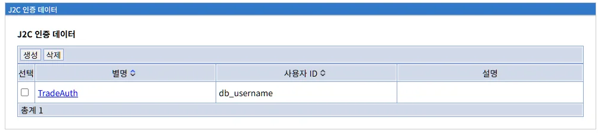
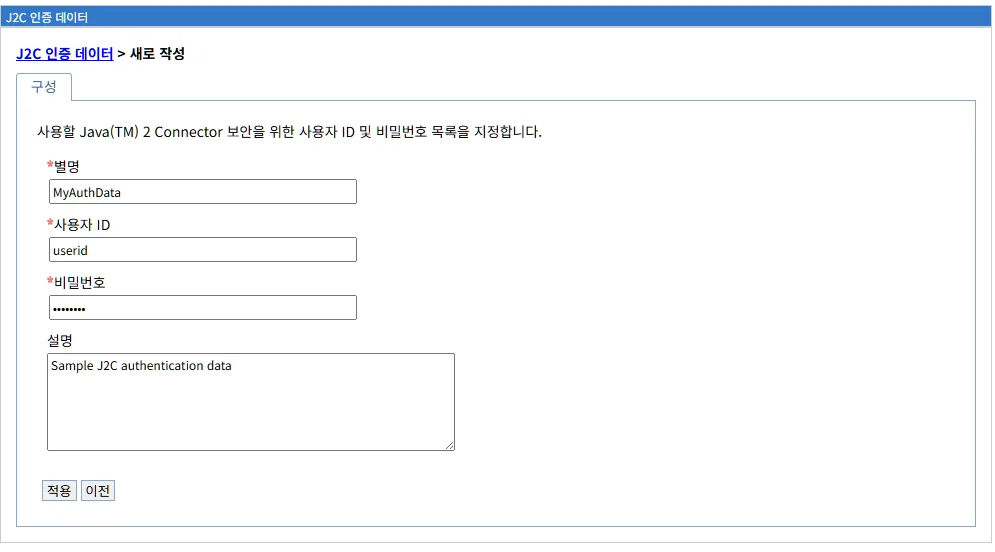
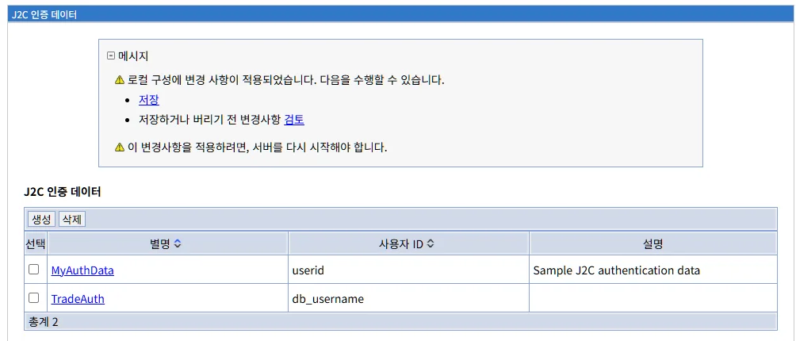
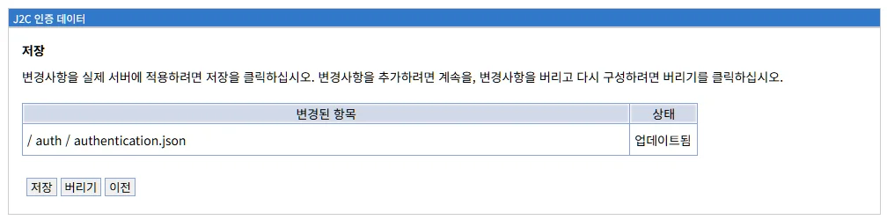
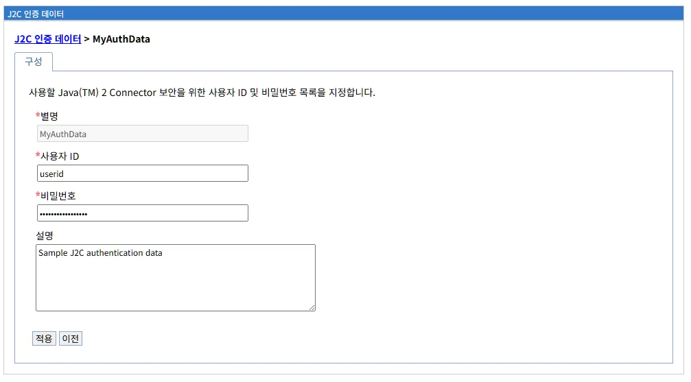
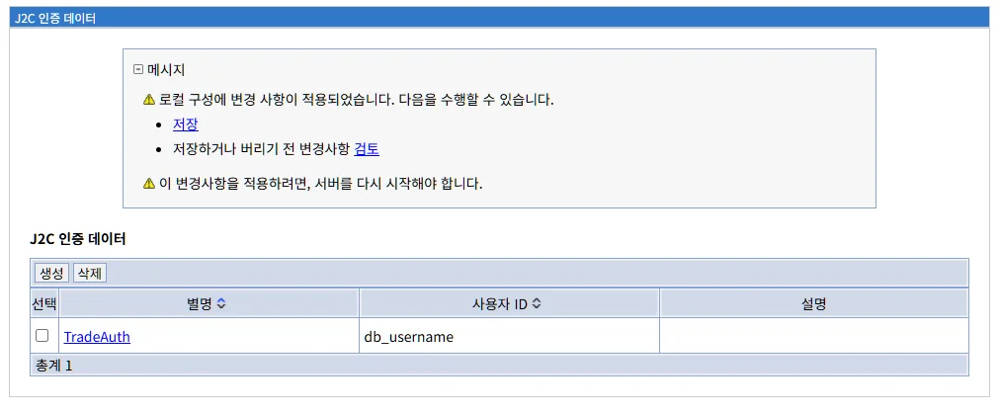

# J2C 인증 데이터 (J2C Authentication Data)

## 개요

J2C 인증 데이터는 Java 2 Connector (J2C) 아키텍처를 통해 외부 리소스(데이터베이스, EIS 등)에 접근할 때 사용되는 인증 정보를 관리하는 기능입니다. 이 메뉴에서는 데이터소스, JMS, 기타 커넥터 등이 백엔드 시스템에 접근할 때 필요한 사용자 이름과 비밀번호를 중앙에서 안전하게 관리할 수 있습니다.

**주요 기능:**
- 리소스 접근을 위한 인증 정보 저장
- 별명(alias)을 통한 인증 정보 참조
- 비밀번호 암호화 저장
- 데이터소스, JMS 연결 팩토리 등에서 재사용

**Java 2 Connector (J2C) 아키텍처:**

J2C(Java EE Connector Architecture)는 Java 애플리케이션과 EIS(Enterprise Information System) 간의 표준 연결 방법을 정의합니다.

```
Java 애플리케이션
       ↓
J2C 커넥터 (리소스 어댑터)
       ↓
J2C 인증 데이터 (사용자 ID/비밀번호)
       ↓
외부 시스템 (데이터베이스, ERP, 메인프레임 등)
```

**Liberty 구현:**

LibriX의 J2C 인증 데이터는 Open Liberty의 `<authData>` 요소를 기반으로 구현되며, `authentication.json` 파일에 인증 정보를 저장합니다.

**WebSphere Application Server와의 관계:**

WebSphere Application Server의 J2C Authentication Data 개념을 Liberty 환경에 맞게 구현한 것입니다.

**WebSphere ND J2C Authentication Alias:**
```
개념:
- EIS 리소스 접근을 위한 인증 정보
- 별명(alias)으로 참조
- Cell, Node, Server 레벨에서 정의 가능

관리 위치:
보안 > 전역 보안 > J2C 인증 데이터

사용 위치:
- 데이터소스 연결
- JMS 연결 팩토리
- 리소스 어댑터

구성 방법:
- ISC에서 GUI로 생성
- 별명, 사용자 ID, 비밀번호 입력
```

**Liberty (LibriX) J2C Authentication Data:**
```
개념:
- 리소스 인증 정보
- authData ID로 참조
- Server 레벨에서 정의

관리 위치:
보안 > J2C 인증 데이터

사용 위치:
- 데이터소스 (datasource)
- JMS 연결 팩토리
- 리소스 어댑터

구성 방법:
- LibriX GUI로 생성
- 별명, 사용자 ID, 비밀번호 입력
- authentication.json에 저장
```

**주요 차이점:**

| 항목 | WebSphere ND | Liberty (LibriX) |
|------|--------------|------------------|
| **별명 식별자** | J2C Alias (문자열) | authData ID |
| **저장 위치** | 보안 레포지토리 | authentication.json |
| **범위** | Cell/Node/Server | Server |
| **암호화** | 양방향 암호화 | XOR 인코딩 |
| **관리 UI** | ISC (복잡) | LibriX (단순) |
| **참조 방법** | alias 문자열 | authDataRef |

---

## J2C 인증 데이터 메인 화면



J2C 인증 데이터 메뉴를 선택하면 현재 등록된 모든 인증 데이터의 목록이 표시됩니다.

**화면 경로:**
```
보안 > J2C 인증 데이터
```

### 화면 구성

```
J2C 인증 데이터

[생성]  [삭제]

선택    별명 ↕              사용자 ID ↕       설명
☐       TradeAuth          db_username

총계 1
```

### 목록 테이블

J2C 인증 데이터 목록은 다음과 같은 정보를 표시합니다:

| 컬럼 | 설명 |
|------|------|
| **선택** | 체크박스를 사용하여 인증 데이터를 선택합니다. 삭제 작업 시 사용됩니다. |
| **별명** | J2C 인증 데이터의 식별자(ID)입니다. 데이터소스나 JMS 등에서 이 별명을 참조합니다. 클릭하면 해당 인증 데이터의 상세 정보 페이지로 이동합니다. |
| **사용자 ID** | 리소스 접근 시 사용할 사용자 이름입니다. |
| **설명** | 인증 데이터에 대한 설명입니다. 선택 사항입니다. |

**정렬 기능:**

컬럼 헤더의 화살표(↕)를 클릭하여 해당 컬럼 기준으로 오름차순/내림차순 정렬할 수 있습니다.

**참고:**
- 비밀번호는 보안상 목록에 표시되지 않습니다
- 상세 화면에서도 마스킹(••••••) 처리됩니다

### 관리 탭

화면 상단에는 다음과 같은 관리 탭이 제공됩니다:

#### 1. 생성 탭

```
[생성]
```

새로운 J2C 인증 데이터를 생성합니다. 클릭하면 인증 데이터 생성 화면으로 이동합니다.

#### 2. 삭제 탭

```
[삭제]
```

선택한 J2C 인증 데이터를 삭제합니다.

**사용 방법:**
1. 목록에서 삭제할 인증 데이터의 체크박스 선택
2. [삭제] 탭 클릭
3. 확인 메시지에서 삭제 확인

**주의사항:**
- 삭제 작업은 되돌릴 수 없습니다
- 데이터소스나 JMS 등에서 사용 중인 인증 데이터를 삭제하면 해당 리소스가 작동하지 않을 수 있습니다
- 삭제 전에 참조 관계를 반드시 확인하십시오

### 사용 예시

**데이터소스에서 J2C 인증 데이터 참조:**

```xml
<dataSource id="db2DataSource" 
            jndiName="jdbc/sampleDB">
    <jdbcDriver libraryRef="db2DriverLib"/>
    <properties.db2.jcc 
        databaseName="SAMPLEDB" 
        serverName="db.company.com" 
        portNumber="50000"/>
    <!-- J2C 인증 데이터 참조 -->
    <containerAuthData user="db_username" password="..." />
</dataSource>
```

LibriX에서 J2C 인증 데이터를 생성하면 데이터소스 구성 시 별명을 선택하여 자동으로 인증 정보를 적용할 수 있습니다.

---

## J2C 인증 데이터 생성

### 인증 데이터 생성 화면



"생성" 탭을 클릭하면 새로운 J2C 인증 데이터를 생성하는 화면이 표시됩니다.

**화면 경로:**
```
보안 > J2C 인증 데이터 > 생성
```

**화면 구성:**

```
J2C 인증 데이터 > 새로 작성

구성

사용할 Java(TM) 2 Connector 보안을 위한 
사용자 ID 및 비밀번호 목록을 지정합니다.

*별명
[MyAuthData                          ]

*사용자 ID
[userid                              ]

*비밀번호
[••••••••                            ]

설명
[Sample J2C authentication data      ]
[                                     ]
[                                     ]

[적용]  [이전]
```

### 입력 필드

#### 1. 별명 *필수

```
*별명
[MyAuthData]
```

J2C 인증 데이터의 고유 식별자입니다. 데이터소스, JMS 연결 팩토리 등에서 이 별명을 사용하여 인증 정보를 참조합니다.

**입력 규칙:**
- 필수 입력 항목 (별표 * 표시)
- 영문자, 숫자, 하이픈(-), 언더스코어(_) 사용 가능
- 공백 불가
- 시스템 내에서 고유해야 함 (중복 불가)
- 대소문자 구분

**권장 명명 규칙:**

**데이터베이스 인증:**
```
DB 유형 + 환경 + 용도:
- DB2ProdAuth
- OracleProdAuth
- MySQLDevAuth
- PostgresTestAuth

DB 유형 + 애플리케이션:
- TradeAppDB2Auth
- PaymentOracleAuth
- InventoryMySQLAuth
```

**JMS 인증:**
```
메시징 시스템 + 용도:
- MQProdAuth
- KafkaAuth
- ActiveMQAuth
```

**EIS 인증:**
```
시스템 이름 + 용도:
- SAPAuth
- MainframeAuth
- ERPAuth
```

**환경별 구분:**
```
개발 환경:
- DevDBAuth
- TestDBAuth

프로덕션 환경:
- ProdDBAuth
- ProdJMSAuth
```

**잘못된 예시:**
```
✗ my auth data (공백 포함)
✗ auth@data (특수문자 @)
✗ 인증데이터 (한글, 환경에 따라 문제 발생 가능)
```

**올바른 예시:**
```
✓ TradeAuth
✓ DB2_Production_Auth
✓ oracle-dev-auth
✓ JMS_MQ_Auth
```

#### 2. 사용자 ID *필수

```
*사용자 ID
[userid]
```

백엔드 시스템(데이터베이스, JMS 등)에 접근할 때 사용할 사용자 이름입니다.

**입력 규칙:**
- 필수 입력 항목
- 대상 시스템의 유효한 사용자 계정이어야 함
- 대소문자 구분 (시스템에 따라 다름)

**데이터베이스별 사용자 ID 예시:**

**DB2:**
```
대문자 사용자 ID (일반적):
- DB2ADMIN
- DBUSER
- APPUSER

소문자도 가능 (따옴표로 생성된 경우):
- db2admin
- dbuser
```

**Oracle:**
```
대문자 스키마 이름:
- SCOTT
- HR
- SYSTEM
- TRADEAPP

소문자 (따옴표로 생성된 경우):
- scott
- hr
```

**MySQL:**
```
대소문자 구분 (Linux):
- root
- app_user
- trade_user

호스트 포함 (선택적):
- 'app_user'@'localhost'
- 'app_user'@'%'
```

**PostgreSQL:**
```
소문자 권장:
- postgres
- appuser
- tradeuser
```

**주의사항:**

**권한 요구사항:**
```
읽기 전용 애플리케이션:
- SELECT 권한만 부여
- 최소 권한 원칙 적용

읽기/쓰기 애플리케이션:
- SELECT, INSERT, UPDATE, DELETE 권한
- 필요한 테이블/스키마만 접근 허용

관리 작업:
- DDL 권한 (CREATE, ALTER, DROP)
- 프로덕션 환경에서는 제한
```

**보안 권장사항:**
```
✓ 애플리케이션 전용 계정 사용
✓ 데이터베이스 관리자 계정 사용 금지
✓ 최소 권한 원칙 적용
✓ 환경별 별도 계정 사용
✗ root, sa, system 등 관리자 계정 사용 금지
✗ 여러 애플리케이션에서 동일 계정 공유 지양
```

#### 3. 비밀번호 *필수

```
*비밀번호
[••••••••]
```

백엔드 시스템에 접근하기 위한 비밀번호입니다.

**입력 규칙:**
- 필수 입력 항목
- 입력한 문자는 보안을 위해 마스킹 처리됩니다 (••••••)
- 대상 시스템의 비밀번호 정책을 준수해야 함

**비밀번호 보안:**

**데이터베이스 계정 비밀번호 정책:**
```
최소 길이: 8-12자 이상
복잡도: 대소문자, 숫자, 특수문자
유효 기간: 90일 (일반적)
재사용 제한: 최근 5-10개 비밀번호
```

**프로덕션 환경 권장사항:**
```
✓ 강력한 비밀번호 사용
✓ 정기적인 비밀번호 변경 (90일)
✓ 비밀번호 관리 도구 사용
✓ 비밀번호 공유 금지
✓ 버전 관리 시스템에 평문 비밀번호 커밋 금지
```

**암호화 저장:**

Liberty는 비밀번호를 XOR 인코딩하여 `authentication.json` 파일에 저장합니다.

```json
{
  "authDataEntries": {
    "MyAuthData": {
      "user": "userid",
      "password": "{xor}Lz4sLChvLTs="
    }
  }
}
```

**주의사항:**
- XOR 인코딩은 평문보다 안전하지만 암호화는 아닙니다
- 디코딩이 가능하므로 구성 파일 접근 권한을 엄격히 관리해야 합니다
- 프로덕션 환경에서는 추가 보안 조치를 고려하십시오

#### 4. 설명 (선택)

```
설명
[Sample J2C authentication data]
```

J2C 인증 데이터에 대한 설명을 입력하는 텍스트 영역입니다.

**특징:**
- 선택 사항 (필수 아님)
- 여러 줄 입력 가능
- 인증 데이터의 용도, 연결 대상 시스템, 담당자 등을 기록

**권장 내용:**

**용도 명시:**
```
Trade application database authentication
Production Oracle database for payment system
Development MySQL database connection
```

**대상 시스템:**
```
Database: DB2 on db2prod.company.com
JMS: IBM MQ on mqprod.company.com:1414
EIS: SAP system PROD001
```

**환경 정보:**
```
Environment: Production
Owner: DevOps Team
Contact: devops@company.com
```

**변경 이력:**
```
Created: 2024-01-20 by admin
Last updated: 2024-03-15 - Password rotation
```

**종합 예시:**
```
설명:
Production database authentication for Trade Application
Database: Oracle 19c on oraprod01.company.com
Schema: TRADE_APP
Environment: Production
Owner: Trade Team (trade-team@company.com)
Created: 2024-01-20
Note: Password rotated quarterly
```

### 인증 데이터 생성 완료

모든 필수 필드를 입력한 후 화면 하단의 버튼을 사용하여 작업을 완료할 수 있습니다:

#### 적용 버튼

```
[적용]
```

입력한 정보로 J2C 인증 데이터를 생성합니다.

**클릭 시 동작:**
1. 입력 값 유효성 검사
2. authentication.json에 인증 정보 추가
3. 비밀번호 XOR 인코딩
4. 변경사항 저장 메시지 표시

#### 이전 버튼

```
[이전]
```

인증 데이터 생성을 취소하고 목록 화면으로 돌아갑니다.

**주의:**
- 입력한 내용은 저장되지 않습니다

---

## 변경사항 저장 프로세스

### 저장 확인 메시지



J2C 인증 데이터 생성 또는 수정 후 "적용" 버튼을 클릭하면 다음과 같은 메시지가 표시됩니다.

**메시지 내용:**

```
□ 메시지

⚠ 로컬 구성에 변경 사항이 적용되었습니다. 
   다음을 수행할 수 있습니다.

• 저장
• 저장하거나 버리기 전 변경사항 검토

⚠ 이 변경사항을 적용하려면, 서버를 다시 시작해야 합니다.
```

**메시지 설명:**

**1. 로컬 구성 변경**
```
변경사항이 메모리에 적용되었지만,
아직 디스크에 영구 저장되지 않은 상태입니다.
```

**2. 선택 옵션**
```
저장: 즉시 구성 파일에 변경사항 기록
검토: 변경된 파일 목록 확인 후 저장 여부 결정
```

**3. 서버 재시작**
```
대부분의 경우 서버 재시작 없이 즉시 적용됩니다.
일부 리소스는 재시작이 필요할 수 있습니다.
```

### 변경사항 검토



"저장하거나 버리기 전 변경사항 검토" 링크를 클릭하면 변경된 구성 파일 목록을 확인할 수 있습니다.

**화면 구성:**

```
저장

변경사항을 실제 서버에 적용하려면 저장을 클릭하십시오.
변경사항을 추가하려면 계속을,
변경사항을 버리고 다시 구성하려면 버리기를 클릭하십시오.

변경된 항목                    상태
/ auth / authentication.json   업데이트됨

[저장]  [버리기]  [이전]
```

**변경된 파일:**

| 파일 경로 | 상태 | 설명 |
|----------|------|------|
| **/auth/authentication.json** | 업데이트됨 | J2C 인증 데이터 구성 파일. 모든 인증 정보가 이 파일에 저장됩니다. |

**authentication.json 구조 예시:**

```json
{
  "authDataEntries": {
    "TradeAuth": {
      "user": "db_username",
      "password": "{xor}Lz4sLChvLTs=",
      "description": ""
    },
    "MyAuthData": {
      "user": "userid",
      "password": "{xor}PjsyNjE=",
      "description": "Sample J2C authentication data"
    }
  }
}
```

**주요 구성 요소:**

**1. authDataEntries 객체**
```json
"authDataEntries": {
  ...
}
```
- 모든 J2C 인증 데이터를 포함하는 컨테이너
- 각 인증 데이터는 별명을 키로 사용

**2. 개별 인증 데이터**
```json
"MyAuthData": {
  "user": "userid",
  "password": "{xor}PjsyNjE=",
  "description": "Sample J2C authentication data"
}
```
- **별명**: 객체의 키 (MyAuthData)
- **user**: 사용자 ID (평문)
- **password**: 비밀번호 (XOR 인코딩)
- **description**: 설명 (선택사항)

**3. 비밀번호 인코딩**
```json
"password": "{xor}PjsyNjE="
```
- XOR 인코딩된 비밀번호
- {xor} 접두사로 인코딩 방식 표시
- Base64 형식의 인코딩 문자열

**Liberty server.xml에서 참조:**

```xml
<server>
    <!-- J2C 인증 데이터 정의 -->
    <authData id="TradeAuth" 
              user="db_username" 
              password="{xor}Lz4sLChvLTs=" />
    
    <authData id="MyAuthData" 
              user="userid" 
              password="{xor}PjsyNjE=" />
    
    <!-- 데이터소스에서 참조 -->
    <dataSource id="tradeDB" 
                jndiName="jdbc/tradeDB">
        <jdbcDriver libraryRef="db2DriverLib"/>
        <properties.db2.jcc 
            databaseName="TRADEDB" 
            serverName="db2prod.company.com" 
            portNumber="50000"/>
        <!-- J2C 인증 데이터 참조 -->
        <containerAuthDataRef>TradeAuth</containerAuthDataRef>
    </dataSource>
</server>
```

### 저장 옵션

#### 저장 버튼

```
[저장]
```

변경사항을 구성 파일에 영구 저장합니다.

**실행 작업:**
1. authentication.json 파일 업데이트
2. 변경사항 디스크에 기록
3. 목록 화면으로 이동

**결과:**
- 새로운 J2C 인증 데이터가 시스템에 등록됨
- 데이터소스, JMS 등에서 참조 가능

#### 버리기 버튼

```
[버리기]
```

변경사항을 취소하고 이전 상태로 되돌립니다.

**실행 작업:**
1. 메모리의 변경사항 폐기
2. 구성 파일 변경 없음
3. 목록 화면으로 이동

**결과:**
- 새로운 인증 데이터가 생성되지 않음
- 시스템 상태 유지

#### 이전 버튼

```
[이전]
```

검토 화면을 닫고 이전 화면으로 돌아갑니다.

**주의:**
- 변경사항은 여전히 메모리에 남아있음
- 나중에 저장하거나 버릴 수 있음

---

## J2C 인증 데이터 상세 정보 및 편집

### 인증 데이터 상세 화면



목록에서 별명(링크)을 클릭하면 해당 인증 데이터의 상세 정보 및 편집 화면이 표시됩니다.

**화면 경로:**
```
보안 > J2C 인증 데이터 > {별명}
```

**화면 구성:**

```
J2C 인증 데이터 > MyAuthData

구성

사용할 Java(TM) 2 Connector 보안을 위한
사용자 ID 및 비밀번호 목록을 지정합니다.

*별명
[MyAuthData                          ]

*사용자 ID
[userid                              ]

*비밀번호
[•••••••••••••                       ]

설명
[Sample J2C authentication data      ]
[                                     ]
[                                     ]

[적용]  [이전]
```

### 편집 가능한 필드

#### 별명

```
*별명
[MyAuthData]
```

**특징:**
- 읽기 전용일 가능성이 높음 (일반적인 구현)
- 별명은 생성 후 변경할 수 없는 경우가 많습니다
- 변경이 필요한 경우 새로 생성하고 기존 것을 삭제해야 합니다

**이유:**
- 별명은 다른 리소스(데이터소스 등)에서 참조하는 키입니다
- 변경 시 모든 참조를 업데이트해야 하므로 위험합니다

**대안:**
- 새로운 별명으로 인증 데이터 생성
- 데이터소스 등의 참조를 새 별명으로 변경
- 기존 인증 데이터 삭제

#### 사용자 ID

```
*사용자 ID
[userid]
```

**특징:**
- 편집 가능
- 백엔드 시스템의 사용자 계정 변경 시 업데이트

**사용자 ID 변경 시나리오:**

**계정 변경:**
```
이전: test_user
새로: app_user

이유:
- 운영 환경으로 전환
- 권한 수정
- 조직 정책 변경
```

**데이터베이스 마이그레이션:**
```
이전: oracle_user
새로: db2_user

이유:
- 데이터베이스 변경
- 스키마 변경
```

**주의사항:**
- 새로운 사용자 ID가 백엔드 시스템에 존재하는지 확인
- 필요한 권한이 부여되었는지 확인
- 변경 후 연결 테스트 수행

#### 비밀번호

```
*비밀번호
[•••••••••••••]
```

**특징:**
- 편집 가능
- 현재 비밀번호는 보안상 표시되지 않음
- 새 비밀번호를 입력하면 변경됨
- 빈 칸으로 두면 비밀번호가 변경되지 않음

**비밀번호 변경 시나리오:**

**정기 비밀번호 변경:**
```
주기: 90일 (권장)
프로세스:
1. 백엔드 시스템에서 먼저 비밀번호 변경
2. J2C 인증 데이터에서 동일하게 변경
3. 연결 테스트
```

**보안 침해 대응:**
```
즉시 변경:
1. 의심되는 계정의 비밀번호 변경
2. J2C 인증 데이터 업데이트
3. 로그 검토
4. 추가 보안 조치
```

**계정 잠금 해제:**
```
비밀번호 실패로 계정 잠금 시:
1. 데이터베이스 관리자에게 잠금 해제 요청
2. 비밀번호 재설정
3. J2C 인증 데이터 업데이트
```

**비밀번호 변경 절차:**

```
단계 1: 백엔드 시스템에서 비밀번호 변경
-----------------------------------------------
# Oracle 예시
SQL> ALTER USER app_user IDENTIFIED BY "NewPassword123!";

# MySQL 예시
mysql> ALTER USER 'app_user'@'%' IDENTIFIED BY 'NewPassword123!';

# DB2 예시
db2 => CONNECT TO SAMPLE
db2 => UPDATE SYSIBM.SYSDBAUTH SET PASSWORD = 'NewPassword123!' 
       WHERE GRANTEE = 'APP_USER'

단계 2: Liberty에서 연결 테스트 전 변경
-----------------------------------------------
1. J2C 인증 데이터 상세 화면 접속
2. 비밀번호 필드에 새 비밀번호 입력
3. 적용 → 저장

단계 3: 연결 테스트
-----------------------------------------------
1. 데이터소스 테스트 연결
2. 로그 확인
3. 애플리케이션 동작 확인
```

#### 설명

```
설명
[Sample J2C authentication data]
```

**특징:**
- 편집 가능
- 인증 데이터에 대한 추가 정보 업데이트

**변경 예시:**
```
초기 설명:
Sample J2C authentication data

업데이트된 설명:
Production Oracle database for Trade Application
Database: TRADEDB on oraprod01.company.com
Last password change: 2024-03-15
Next rotation: 2024-06-15
```

### 변경사항 적용

인증 데이터를 수정한 후 "적용" 버튼을 클릭하면 변경사항이 적용됩니다.

**적용 프로세스:**
1. 수정된 필드 값 검증
2. authentication.json 업데이트
3. 변경사항 저장 메시지 표시
4. 저장/검토/버리기 선택

**즉시 적용되는 변경사항:**
- 사용자 ID 변경
- 비밀번호 변경
- 설명 변경

**영향을 받는 리소스:**
- 해당 J2C 인증 데이터를 사용하는 모든 데이터소스
- JMS 연결 팩토리
- 리소스 어댑터

**주의사항:**
- 변경 후 즉시 관련 리소스의 연결을 테스트하십시오
- 프로덕션 환경에서는 변경 전 백업을 권장합니다
- 비밀번호 변경 시 다운타임 최소화를 위해 유지보수 시간대에 작업하십시오

---

## J2C 인증 데이터 삭제

### 삭제 확인 화면



J2C 인증 데이터를 삭제하려면 목록에서 선택하고 "삭제" 탭을 클릭합니다.

**화면 경로:**
```
보안 > J2C 인증 데이터 > 선택 > 삭제
```

**화면 구성:**

```
□ 메시지

⚠ 로컬 구성에 변경 사항이 적용되었습니다.
   다음을 수행할 수 있습니다.

• 저장
• 저장하거나 버리기 전 변경사항 검토

⚠ 이 변경사항을 적용하려면, 서버를 다시 시작해야 합니다.

J2C 인증 데이터

[생성]  [삭제]

선택    별명 ↕              사용자 ID ↕       설명
☐       TradeAuth          db_username

총계 1
```

### 삭제 프로세스

#### 1단계: 인증 데이터 선택

```
목록에서 삭제할 인증 데이터의 체크박스 선택
```

**다중 선택:**
- 여러 인증 데이터를 동시에 선택하여 일괄 삭제 가능

#### 2단계: 삭제 탭 클릭

```
[삭제] 탭 클릭
```

삭제 확인 메시지가 표시됩니다.

#### 3단계: 변경사항 저장

```
"저장" 또는 "버리기" 선택
```

**저장:**
- 선택한 인증 데이터를 영구 삭제
- authentication.json에서 해당 항목 제거

**버리기:**
- 삭제 취소
- 인증 데이터 유지

### 삭제 제한 사항 및 주의사항

**삭제 전 확인 사항:**

**1. 참조 관계 확인**
```
경고: 
다른 리소스에서 사용 중인 J2C 인증 데이터를 삭제하면
해당 리소스가 작동하지 않습니다.

확인 방법:
☐ 데이터소스 목록에서 해당 별명 검색
☐ JMS 연결 팩토리에서 사용 여부 확인
☐ 리소스 어댑터 구성 확인
☐ 애플리케이션 바인딩 확인
```

**2. 데이터소스에서 사용 중인 경우**
```
증상:
데이터소스 연결 실패
CWWKE0701E: ... authentication alias not found

해결:
1. 새로운 J2C 인증 데이터 생성
2. 데이터소스에서 참조 변경
3. 기존 인증 데이터 삭제
```

**3. 백업 권장**
```
삭제 전:
1. authentication.json 파일 백업
2. 관련 구성 파일 백업
3. 현재 설정 문서화

백업 명령:
cp /auth/authentication.json /auth/authentication.json.backup
```

### 삭제 후 영향

**즉시 효과:**
- 해당 별명으로 인증 불가
- 참조하는 리소스 연결 실패

**구성 파일 변경:**

```json
/* 삭제 전 */
{
  "authDataEntries": {
    "TradeAuth": {
      "user": "db_username",
      "password": "{xor}Lz4sLChvLTs="
    },
    "MyAuthData": {
      "user": "userid",
      "password": "{xor}PjsyNjE="
    }
  }
}

/* MyAuthData 삭제 후 */
{
  "authDataEntries": {
    "TradeAuth": {
      "user": "db_username",
      "password": "{xor}Lz4sLChvLTs="
    }
  }
}
```

**데이터소스 에러 예시:**

```
# 삭제된 J2C 인증 데이터를 참조하는 데이터소스
<dataSource id="tradeDB" jndiName="jdbc/tradeDB">
    <containerAuthDataRef>MyAuthData</containerAuthDataRef>
    <!-- MyAuthData가 삭제되어 연결 실패 -->
</dataSource>

# 로그 메시지
[ERROR] CWWKE0701E: The authentication alias 'MyAuthData' 
        specified by the data source 'tradeDB' 
        could not be found.
```

**복구 방법:**

```
옵션 1: 백업에서 복원
cp /auth/authentication.json.backup /auth/authentication.json

옵션 2: 재생성
1. 동일한 별명으로 J2C 인증 데이터 재생성
2. 사용자 ID와 비밀번호 입력
3. 저장

옵션 3: 데이터소스 수정
1. 데이터소스에서 인증 참조 변경
2. 다른 유효한 J2C 인증 데이터로 변경
```

---

## Liberty J2C 인증 데이터 구성

### AuthData 요소

Liberty의 J2C 인증 데이터는 `<authData>` 요소로 정의됩니다.

**구성 파일 위치:**
```
/auth/authentication.json (LibriX GUI 사용 시)
또는
server.xml (<authData> 직접 정의)
```

**server.xml 구성 예시:**

```xml
<?xml version="1.0" encoding="UTF-8"?>
<server description="Liberty Server">
    
    <!-- J2C 인증 데이터 정의 -->
    <authData id="TradeAuth" 
              user="db_username" 
              password="{xor}Lz4sLChvLTs=" />
    
    <authData id="OracleAuth" 
              user="scott" 
              password="{xor}PjsyNjEsLQ==" />
    
    <authData id="MQAuth" 
              user="mquser" 
              password="{xor}MzovPiwsNw==" />
    
    <!-- 데이터소스에서 사용 -->
    <library id="db2DriverLib">
        <fileset dir="${shared.resource.dir}/db2" 
                 includes="*.jar"/>
    </library>
    
    <dataSource id="tradeDB" 
                jndiName="jdbc/tradeDB">
        <jdbcDriver libraryRef="db2DriverLib"/>
        <properties.db2.jcc 
            databaseName="TRADEDB" 
            serverName="db2prod.company.com" 
            portNumber="50000"/>
        <!-- J2C 인증 데이터 참조 -->
        <containerAuthDataRef>TradeAuth</containerAuthDataRef>
    </dataSource>
    
    <!-- JMS 연결 팩토리에서 사용 -->
    <jmsConnectionFactory id="jms/CF1" 
                         jndiName="jms/CF1">
        <properties.wmqJms 
            hostName="mqprod.company.com" 
            port="1414" 
            channel="SYSTEM.DEF.SVRCONN" 
            queueManager="QM1"/>
        <!-- J2C 인증 데이터 참조 -->
        <containerAuthDataRef>MQAuth</containerAuthDataRef>
    </jmsConnectionFactory>
    
</server>
```

### 비밀번호 인코딩

Liberty는 비밀번호를 XOR 인코딩하여 저장합니다.

**인코딩 방법:**

**1. securityUtility 명령 사용:**

```bash
# Liberty 설치 디렉토리에서
${wlp.install.dir}/bin/securityUtility encode mypassword

# 출력:
{xor}Lz4sLChvLTs=
```

**2. 구성 파일에 적용:**

```xml
<authData id="MyAuth" 
          user="dbuser" 
          password="{xor}Lz4sLChvLTs=" />
```

**주의사항:**

**XOR 인코딩의 한계:**
```
✓ 평문 비밀번호보다 안전
✓ 구성 파일 노출 시 즉시 탈취 방지
✗ 디코딩 가능 (암호화가 아님)
✗ 강력한 보안이 필요한 환경에는 부적합
```

**프로덕션 환경 권장사항:**
```
1. 구성 파일 접근 권한 엄격히 제한 (600 또는 400)
2. 비밀번호 정기 변경 (90일)
3. 외부 비밀 관리 시스템 사용 고려
   - HashiCorp Vault
   - AWS Secrets Manager
   - Azure Key Vault
4. 감사 로그 활성화
```

### 참조 방법

J2C 인증 데이터는 다양한 리소스에서 참조할 수 있습니다.

**1. 데이터소스 (DataSource)**

```xml
<dataSource id="db2DS" jndiName="jdbc/sampleDB">
    <jdbcDriver libraryRef="db2DriverLib"/>
    <properties.db2.jcc 
        databaseName="SAMPLE" 
        serverName="localhost" 
        portNumber="50000"/>
    <!-- 방법 1: authDataRef 사용 -->
    <containerAuthDataRef>TradeAuth</containerAuthDataRef>
</dataSource>

<!-- 또는 -->

<dataSource id="db2DS" jndiName="jdbc/sampleDB">
    <jdbcDriver libraryRef="db2DriverLib"/>
    <properties.db2.jcc 
        databaseName="SAMPLE" 
        serverName="localhost" 
        portNumber="50000"/>
    <!-- 방법 2: 직접 인증 정보 -->
    <containerAuthData user="db_username" password="{xor}..."/>
</dataSource>
```

**2. JMS 연결 팩토리**

```xml
<jmsConnectionFactory id="jms/CF1" jndiName="jms/CF1">
    <properties.wmqJms 
        hostName="mqserver.company.com" 
        port="1414" 
        channel="DEV.APP.SVRCONN" 
        queueManager="QM1"/>
    <!-- J2C 인증 데이터 참조 -->
    <containerAuthDataRef>MQAuth</containerAuthDataRef>
</jmsConnectionFactory>
```

**3. 리소스 어댑터**

```xml
<resourceAdapter id="sapAdapter" location="${shared.resource.dir}/sap.rar">
    <properties.sapAdapter 
        serverName="sap.company.com" 
        client="100" 
        systemNumber="00"/>
    <!-- J2C 인증 데이터 참조 -->
    <authDataRef>SAPAuth</authDataRef>
</resourceAdapter>
```

---

## WebSphere ND와의 비교

### J2C Authentication Data 비교

#### WebSphere ND

**관리 위치:**
```
보안 > 전역 보안 > J2C 인증 데이터
또는
리소스 > J2C 인증 데이터
```

**범위 선택:**
```
Cell 레벨: 전체 Cell에서 사용 가능
Node 레벨: 특정 Node에서만 사용 가능
Server 레벨: 특정 Server에서만 사용 가능
```

**구성 방법:**
```
1. ISC에서 GUI로 생성
2. 별명, 사용자 ID, 비밀번호, 설명 입력
3. 범위 선택
4. 저장
```

**데이터소스에서 참조:**
```
데이터소스 생성/편집:
1. "컨테이너 관리 인증 별명" 필드
2. 드롭다운에서 J2C 별명 선택
3. 또는 "사용자 정의" 선택 후 직접 입력
```

**저장 위치:**
```
WebSphere 보안 레포지토리 (데이터베이스 또는 파일)
암호화되어 저장
```

#### Liberty (LibriX)

**관리 위치:**
```
보안 > J2C 인증 데이터
```

**범위:**
```
Server 레벨만 지원
각 서버마다 독립적으로 관리
```

**구성 방법:**
```
1. LibriX GUI로 생성
2. 별명, 사용자 ID, 비밀번호, 설명 입력
3. 저장
```

**데이터소스에서 참조:**
```
데이터소스 생성 시:
1. "컨테이너 관리 인증" 섹션
2. J2C 인증 데이터 드롭다운에서 선택
3. server.xml에 <containerAuthDataRef> 추가
```

**저장 위치:**
```
/auth/authentication.json (LibriX)
또는
server.xml (<authData> 요소)
XOR 인코딩
```

### 주요 차이점 요약

| 항목 | WebSphere ND | Liberty (LibriX) |
|------|--------------|------------------|
| **별명** | J2C Alias | authData ID |
| **범위** | Cell/Node/Server | Server only |
| **저장소** | 보안 레포지토리 | authentication.json 또는 server.xml |
| **암호화** | 양방향 암호화 | XOR 인코딩 |
| **GUI 관리** | ISC (복잡) | LibriX (간단) |
| **참조 방식** | 별명 문자열 | authDataRef |
| **중앙 관리** | Cell 레벨 가능 | 서버별 독립 관리 |

---

## 사용 시나리오

### 시나리오 1: 데이터소스 인증 구성

**요구사항:**
- Trade 애플리케이션이 DB2 데이터베이스에 연결
- 프로덕션 환경
- 데이터베이스 계정: tradeapp / SecureP@ss123

**구현 단계:**

**1. J2C 인증 데이터 생성**
```
별명: TradeProdDBAuth
사용자 ID: tradeapp
비밀번호: SecureP@ss123
설명: Production DB2 authentication for Trade Application
```

**2. 데이터소스 생성**
```
JDBC 제공자: DB2 Universal JDBC Driver
데이터소스 이름: tradeDS
JNDI 이름: jdbc/tradeDB
데이터베이스: TRADEDB
서버: db2prod.company.com:50000
컨테이너 관리 인증: TradeProdDBAuth (선택)
```

**3. 애플리케이션에서 사용**
```java
// Java 코드
@Resource(lookup = "jdbc/tradeDB")
private DataSource dataSource;

public void executeTrade() {
    try (Connection conn = dataSource.getConnection()) {
        // 자동으로 TradeProdDBAuth의 인증 정보 사용
        // 명시적인 사용자 ID/비밀번호 불필요
    }
}
```

**4. Liberty server.xml 결과**
```xml
<authData id="TradeProdDBAuth" 
          user="tradeapp" 
          password="{xor}..." />

<dataSource id="tradeDS" jndiName="jdbc/tradeDB">
    <jdbcDriver libraryRef="db2DriverLib"/>
    <properties.db2.jcc 
        databaseName="TRADEDB" 
        serverName="db2prod.company.com" 
        portNumber="50000"/>
    <containerAuthDataRef>TradeProdDBAuth</containerAuthDataRef>
</dataSource>
```

### 시나리오 2: 다중 환경 관리

**요구사항:**
- 개발, 테스트, 프로덕션 환경 분리
- 각 환경마다 다른 데이터베이스 계정 사용

**구현:**

**개발 환경:**
```
J2C 인증 데이터:
- 별명: TradeDevDBAuth
- 사용자 ID: dev_user
- 비밀번호: dev_pass123

데이터소스:
- JNDI: jdbc/tradeDB
- 서버: db2dev.company.com
- 인증: TradeDevDBAuth
```

**테스트 환경:**
```
J2C 인증 데이터:
- 별명: TradeTestDBAuth
- 사용자 ID: test_user
- 비밀번호: test_pass123

데이터소스:
- JNDI: jdbc/tradeDB (동일)
- 서버: db2test.company.com
- 인증: TradeTestDBAuth
```

**프로덕션 환경:**
```
J2C 인증 데이터:
- 별명: TradeProdDBAuth
- 사용자 ID: prod_user
- 비밀번호: Pr0d_P@ss!

데이터소스:
- JNDI: jdbc/tradeDB (동일)
- 서버: db2prod.company.com
- 인증: TradeProdDBAuth
```

**장점:**
- 애플리케이션 코드 변경 없음 (JNDI 이름 동일)
- 환경별 독립적인 인증 정보 관리
- 권한 분리 (개발자는 프로덕션 비밀번호 불필요)

### 시나리오 3: JMS 메시징 인증

**요구사항:**
- IBM MQ 메시징 시스템 연결
- 메시지 큐 인증 필요

**구현:**

**1. J2C 인증 데이터 생성**
```
별명: MQProdAuth
사용자 ID: mqadmin
비밀번호: MQ_P@ssw0rd
설명: IBM MQ production authentication
```

**2. JMS 연결 팩토리 구성**
```xml
<authData id="MQProdAuth" 
          user="mqadmin" 
          password="{xor}..." />

<jmsConnectionFactory id="jms/QCF" 
                     jndiName="jms/QCF">
    <properties.wmqJms 
        hostName="mqprod.company.com" 
        port="1414" 
        channel="PROD.SVRCONN" 
        queueManager="PROD_QM1" 
        transportType="CLIENT"/>
    <containerAuthDataRef>MQProdAuth</containerAuthDataRef>
</jmsConnectionFactory>
```

**3. 애플리케이션에서 사용**
```java
@Resource(lookup = "jms/QCF")
private ConnectionFactory connectionFactory;

public void sendMessage() {
    try (JMSContext context = connectionFactory.createContext()) {
        // 자동으로 MQProdAuth의 인증 정보 사용
        Destination queue = context.createQueue("queue:///TRADE.QUEUE");
        context.createProducer().send(queue, "Trade message");
    }
}
```

### 시나리오 4: 비밀번호 로테이션

**요구사항:**
- 보안 정책에 따라 90일마다 데이터베이스 비밀번호 변경
- 애플리케이션 다운타임 최소화

**절차:**

**1. 사전 준비**
```
현재 상태:
- J2C 인증: TradeProdDBAuth
- 사용자: tradeapp
- 비밀번호: OldPassword123
```

**2. 데이터베이스에서 비밀번호 변경**
```sql
-- Oracle 예시
ALTER USER tradeapp IDENTIFIED BY "NewPassword456";
```

**3. 임시 J2C 인증 데이터 생성 (선택적)**
```
별명: TradeProdDBAuth_New
사용자 ID: tradeapp
비밀번호: NewPassword456
```

**4. 데이터소스 테스트**
```
테스트 데이터소스 생성:
- 새 J2C 인증 데이터 사용
- 연결 테스트
- 정상 동작 확인
```

**5. 기존 J2C 인증 데이터 업데이트**
```
TradeProdDBAuth 편집:
- 비밀번호 필드에 NewPassword456 입력
- 적용 → 저장
```

**6. 즉시 적용**
```
대부분의 경우:
- 서버 재시작 불필요
- 다음 연결부터 새 비밀번호 사용

연결 풀 리프레시:
- 기존 연결은 유지
- 새 연결은 새 비밀번호 사용
- 점진적으로 전환
```

**7. 임시 데이터 정리**
```
TradeProdDBAuth_New 삭제 (사용한 경우)
```

---

## 보안 모범 사례

### 인증 정보 관리

**1. 별명 명명 규칙**

```
일관성 유지:
✓ {시스템}_{환경}_Auth
✓ {애플리케이션}_{리소스}_Auth
✓ {데이터베이스}_Prod_Auth

가독성:
✓ TradeProdDBAuth (명확)
✗ auth1, auth2 (불명확)
```

**2. 계정 권한 최소화**

```
읽기 전용 애플리케이션:
권한: SELECT only
계정: readonly_user

읽기/쓰기 애플리케이션:
권한: SELECT, INSERT, UPDATE, DELETE
계정: app_user

관리 작업:
권한: DDL (CREATE, ALTER, DROP)
계정: admin_user (제한적 사용)
```

**3. 비밀번호 정책**

```
강도 요구사항:
- 최소 12자 이상
- 대소문자, 숫자, 특수문자 포함
- 사전 단어 금지
- 이전 비밀번호 재사용 금지

변경 주기:
- 프로덕션: 90일
- 개발/테스트: 180일
- 서비스 계정: 180일 (자동화된 경우)

저장:
- 비밀번호 관리 도구 사용
- 평문 저장 금지
- Git에 커밋 금지
```

**4. 감사 및 모니터링**

```
로그 기록:
- J2C 인증 데이터 생성/수정/삭제
- 비밀번호 변경 이력
- 인증 실패 시도

정기 검토:
- 월간: 사용되지 않는 인증 데이터 확인
- 분기별: 비밀번호 강도 검토
- 반기별: 권한 적절성 평가
```

### 프로덕션 환경 권장사항

**1. 외부 비밀 관리 시스템 사용**

```
HashiCorp Vault:
- 중앙 집중식 비밀 관리
- 동적 비밀번호 생성
- 접근 제어 및 감사

AWS Secrets Manager:
- 자동 비밀번호 로테이션
- AWS 서비스와 통합
- IAM 기반 접근 제어

Azure Key Vault:
- Azure 리소스와 통합
- 하드웨어 보안 모듈 (HSM) 지원
- 자동 백업
```

**2. 구성 파일 보호**

```bash
# authentication.json 파일 권한
chmod 600 /auth/authentication.json
chown libertyuser:libertygroup /auth/authentication.json

# 백업 파일 암호화
gpg --encrypt authentication.json.backup
```

**3. 네트워크 보안**

```
데이터베이스 연결:
- SSL/TLS 암호화 사용
- 방화벽 규칙 설정
- IP 화이트리스트

VPN 사용:
- 프로덕션 데이터베이스 접근 시 VPN 필수
- 개발자 직접 접근 제한
```

**4. 환경 분리**

```
개발 환경:
- 개발 전용 데이터베이스
- 개발 전용 계정
- 테스트 데이터 사용

프로덕션 환경:
- 격리된 네트워크
- 제한된 접근
- 별도의 인증 정보
```

---

## 문제 해결

### 연결 문제

**증상 1: 데이터소스 연결 실패**

```
에러: DSRA8101E: DataSource connection failed
```

**원인 및 해결:**

**1. J2C 인증 데이터 오류**
```
확인:
- 별명이 올바른지 확인
- 사용자 ID가 정확한지 확인
- 비밀번호가 정확한지 확인

테스트:
1. 데이터베이스 클라이언트로 직접 연결 테스트
2. 동일한 사용자 ID/비밀번호로 성공하는지 확인

해결:
- J2C 인증 데이터 편집
- 올바른 사용자 ID/비밀번호 입력
- 저장 후 재시도
```

**2. 데이터베이스 계정 잠금**
```
에러: ORA-28000: the account is locked
에러: SQL1370N User ID has been locked

확인:
- 데이터베이스 로그 확인
- 계정 상태 조회

해결:
# Oracle
ALTER USER app_user ACCOUNT UNLOCK;

# DB2
UPDATE SYSIBM.SYSDBAUTH 
SET STATUS = 'A' 
WHERE GRANTEE = 'APP_USER';

# MySQL
ALTER USER 'app_user'@'%' ACCOUNT UNLOCK;
```

**3. 비밀번호 만료**
```
에러: ORA-28001: the password has expired

해결:
1. 데이터베이스에서 비밀번호 재설정
2. J2C 인증 데이터 업데이트
3. 연결 재시도
```

**증상 2: 인증 별명을 찾을 수 없음**

```
에러: CWWKE0701E: The authentication alias 'MyAuthData' 
      could not be found.
```

**원인 및 해결:**

```
원인:
1. J2C 인증 데이터가 존재하지 않음
2. 별명 오타
3. authentication.json 파일 손상

확인:
1. J2C 인증 데이터 목록에서 별명 확인
2. 데이터소스 구성의 참조 확인
3. authentication.json 파일 내용 검증

해결:
1. 올바른 별명으로 수정
2. 또는 해당 별명으로 J2C 인증 데이터 생성
3. 서버 재시작 (필요한 경우)
```

### 구성 문제

**증상: 변경사항 저장 실패**

```
에러: "변경사항을 저장할 수 없습니다."
```

**원인 및 해결:**

```
1. 파일 권한 문제
확인: ls -l /auth/authentication.json
해결: chmod 644 /auth/authentication.json

2. 디스크 용량 부족
확인: df -h
해결: 불필요한 파일 삭제, 디스크 확장

3. JSON 문법 오류
확인: JSON 유효성 검사
해결: JSON 문법 수정 또는 백업에서 복원

4. 동시 수정 충돌
확인: 다른 관리자의 동시 작업 여부
해결: 조율 후 재시도
```

**증상: XOR 인코딩 실패**

```
에러: "비밀번호를 인코딩할 수 없습니다."
```

**해결:**

```bash
# securityUtility 도구 사용
${wlp.install.dir}/bin/securityUtility encode "mypassword"

# 출력된 인코딩 문자열을 authentication.json에 적용
{
  "authDataEntries": {
    "MyAuth": {
      "user": "dbuser",
      "password": "{xor}Lz4sLChvLTs="
    }
  }
}
```

### 로그 확인

**관련 로그 파일:**

```
Liberty 메시지 로그:
${server.output.dir}/logs/messages.log

데이터소스 추적:
TRACE 활성화 후
${server.output.dir}/logs/trace.log
```

**유용한 로그 메시지:**

```
인증 성공:
DSRA8203I: Database product name: DB2/LINUXX8664
DSRA8204I: Database product version: SQL11055

인증 실패:
DSRA0010E: SQL State = 28000, Error Code = -1,403
DSRA4011E: User ID or Password invalid

인증 별명 오류:
CWWKE0701E: The authentication alias ... could not be found
```

---

## 다음 단계

- SSL/TLS로 데이터베이스 연결을 암호화하려면 [SSL 구성](ssl-configuration.md) 문서를 참조하십시오.
- 데이터소스 생성 시 J2C 인증 데이터를 사용하려면 [데이터소스 관리](../resource/datasource.md) 문서를 참조하십시오.
- 인증서 관리는 [인증서 관리](certificate-management.md) 문서를 참조하십시오.

---

## 참고 자료

### Liberty 공식 문서

- [AuthData Configuration](https://openliberty.io/docs/latest/reference/config/authData.html)
- [DataSource Authentication](https://openliberty.io/docs/latest/reference/config/dataSource.html)
- [JMS Connection Factory Authentication](https://openliberty.io/docs/latest/reference/config/jmsConnectionFactory.html)
- [Security Utility](https://openliberty.io/docs/latest/reference/command/securityUtility-encode.html)

### WebSphere 문서

- [J2C Authentication Data](https://www.ibm.com/docs/en/was-nd/9.0.5?topic=security-j2c-authentication-data-entries)
- [Container-managed Authentication](https://www.ibm.com/docs/en/was-nd/9.0.5?topic=security-container-managed-authentication-aliases)

### 관련 LibriX 문서

- [사용자 관리](user-management.md)
- [데이터소스 관리](../resource/datasource.md)
- [JDBC 제공자 관리](../resource/jdbc-provider.md)
- [SSL 구성](ssl-configuration.md)

---

## 요약

J2C 인증 데이터는 애플리케이션이 외부 리소스(데이터베이스, JMS 등)에 접근할 때 필요한 인증 정보를 중앙에서 안전하게 관리하는 기능입니다.

**주요 기능:**
- 별명을 통한 인증 정보 참조
- 비밀번호 XOR 인코딩 저장
- 데이터소스, JMS 등에서 재사용
- authentication.json에 저장

**필수 입력 항목:**
- 별명 (고유 식별자)
- 사용자 ID (리소스 접근 계정)
- 비밀번호 (암호화 저장)

**사용 대상:**
- 데이터소스 (JDBC)
- JMS 연결 팩토리
- 리소스 어댑터
- 기타 J2C 커넥터

**보안 권장사항:**
- 강력한 비밀번호 사용
- 최소 권한 원칙 적용
- 정기적인 비밀번호 변경
- 구성 파일 접근 권한 제한
- 외부 비밀 관리 시스템 고려

J2C 인증 데이터를 효과적으로 활용하여 안전하고 체계적인 리소스 인증을 구현하세요!
