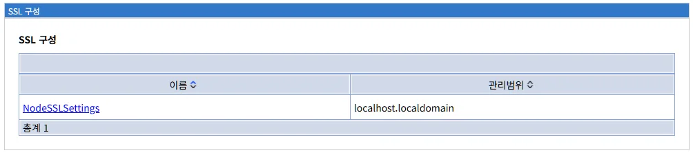
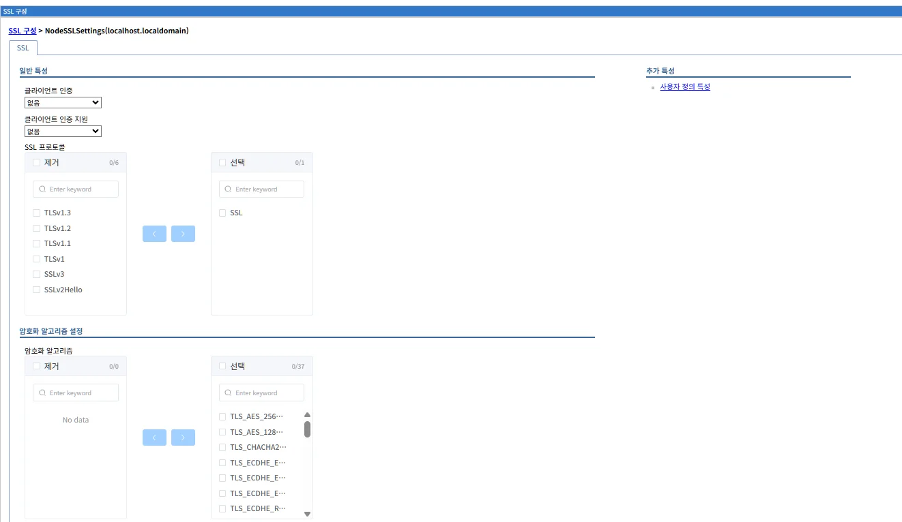
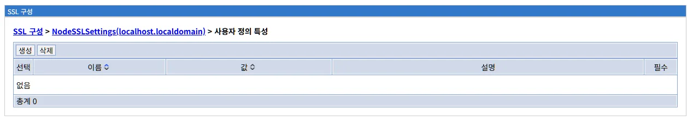
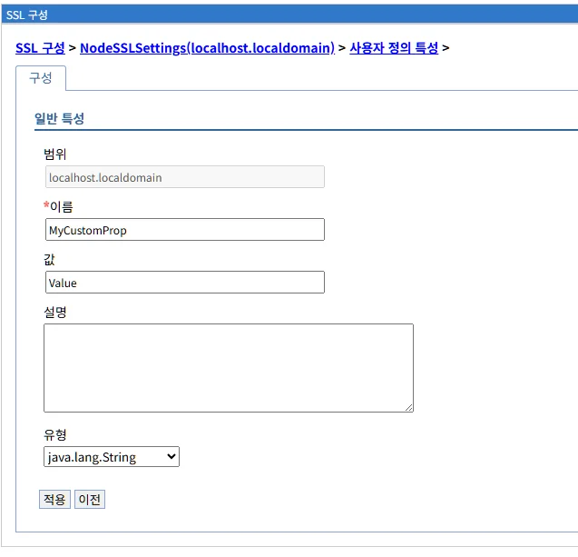

# SSL 구성 (SSL Configuration)
SSL 구성은 Liberty 서버의 SSL/TLS 통신을 설정하고 관리하는 기능입니다. HTTPS 통신, 클라이언트 인증, SSL 프로토콜, 암호화 알고리즘 등 보안 통신에 필요한 모든 설정 방법을 설명합니다.

## 목차

- [개요](#개요)
- [SSL 구성 메인 화면](#ssl-구성-메인-화면)
- [SSL 구성 상세 설정](#ssl-구성-상세-설정)
- [변경사항 저장 프로세스](#변경사항-저장-프로세스)
- [Liberty SSL 구성](#liberty-ssl-구성)
- [WebSphere ND와의 비교](#websphere-nd와의-비교)
- [사용 시나리오](#사용-시나리오)
- [보안 모범 사례](#보안-모범-사례)
- [문제 해결](#문제-해결)
- [다음 단계](#다음-단계)
- [참고 자료](#참고-자료)
- [요약](#요약)

---
## 개요

SSL 구성은 Liberty 서버의 SSL/TLS 통신을 설정하고 관리하는 기능입니다. 이 메뉴에서는 HTTPS 통신, 클라이언트 인증, SSL 프로토콜, 암호화 알고리즘 등 보안 통신에 필요한 모든 설정을 관리할 수 있습니다.

**주요 기능:**
- SSL/TLS 프로토콜 설정
- 암호화 스위트(Cipher Suite) 선택
- 클라이언트 인증 구성
- SSL 세션 캐시 관리
- 사용자 정의 SSL 속성 설정

**SSL/TLS 개요:**

SSL(Secure Sockets Layer)과 TLS(Transport Layer Security)는 네트워크 통신을 암호화하여 데이터를 안전하게 전송하는 프로토콜입니다.

```
클라이언트 (브라우저)
       ↓
   SSL/TLS 핸드셰이크
   - 프로토콜 버전 협상
   - 암호화 스위트 선택
   - 인증서 교환
   - 세션 키 생성
       ↓
  암호화된 통신
       ↓
Liberty 서버
```

**Liberty 구현:**

LibriX의 SSL 구성은 Open Liberty의 `<ssl>` 요소를 기반으로 구현되며, server.xml에 SSL 설정이 저장됩니다.

**WebSphere Application Server와의 관계:**

WebSphere Application Server의 SSL 구성 개념을 Liberty 환경에 맞게 단순화한 구현입니다.

**WebSphere ND SSL Configuration:**
```
SSL 구성 관리:
- 다중 SSL 구성 지원
- Cell/Node/Server 레벨 범위
- 키 저장소 및 신뢰 저장소 관리
- 동적 SSL 구성 선택

관리 위치:
보안 > SSL 인증서 및 키 관리 > SSL 구성

구성 항목:
- SSL 프로토콜 설정
- 암호화 스위트 선택
- 키 저장소/신뢰 저장소 참조
- 클라이언트 인증 설정
- SSL 세션 관리
```

**Liberty (LibriX) SSL Configuration:**
```
SSL 구성 관리:
- 노드별 기본 SSL 구성
- Server 레벨 범위
- 키 저장소 자동 생성 또는 수동 지정
- 단순화된 구성

관리 위치:
보안 > SSL 구성

구성 항목:
- 클라이언트 인증 설정
- SSL 프로토콜 선택
- 암호화 알고리즘 선택
- 사용자 정의 특성
```

**주요 차이점:**

| 항목 | WebSphere ND | Liberty (LibriX) |
|------|--------------|------------------|
| **SSL 구성 개수** | 다중 (용도별 생성 가능) | 노드별 기본 1개 |
| **범위** | Cell/Node/Server | Server |
| **키 저장소 관리** | 복잡 (GUI 완전 지원) | 단순 (자동 생성) |
| **동적 선택** | 지원 (애플리케이션별) | 제한적 |
| **구성 복잡도** | 높음 | 낮음 |
| **관리 UI** | ISC (상세) | LibriX (간소화) |

---

## SSL 구성 메인 화면



SSL 구성 메뉴를 선택하면 현재 정의된 SSL 구성 목록이 표시됩니다.

**화면 경로:**
```
보안 > SSL 구성
```

### 화면 구성

```
SSL 구성

이름 ↕                              관리범위 ↕
NodeSSLSettings                     localhost.localdomain

총계 1
```

### 목록 테이블

SSL 구성 목록은 다음과 같은 정보를 표시합니다:

| 컬럼 | 설명 |
|------|------|
| **이름** | SSL 구성의 이름입니다. Liberty에서는 일반적으로 노드별로 `NodeSSLSettings`가 자동 생성됩니다. 클릭하면 해당 SSL 구성의 상세 설정 페이지로 이동합니다. |
| **관리범위** | SSL 구성이 적용되는 범위입니다. 일반적으로 호스트명과 도메인명으로 표시됩니다. |

**정렬 기능:**

컬럼 헤더의 화살표(↕)를 클릭하여 해당 컬럼 기준으로 오름차순/내림차순 정렬할 수 있습니다.

### 기본 SSL 구성

Liberty를 설치하면 다음과 같은 기본 SSL 구성이 자동으로 생성됩니다:

| 이름 | 관리범위 | 설명 |
|------|----------|------|
| **NodeSSLSettings** | localhost.localdomain | 노드의 기본 SSL 구성. 모든 HTTPS 통신에 사용됩니다. |

**자동 생성 항목:**
```
Liberty 서버 시작 시:
1. 기본 키 저장소(keystore) 생성
2. 자체 서명 인증서 생성
3. NodeSSLSettings 구성 생성
4. HTTPS 포트 활성화 (기본: 9443)
```

**키 저장소 위치:**
```
기본 경로:
${server.config.dir}/resources/security/key.p12

또는:
${server.output.dir}/resources/security/key.p12

기본 비밀번호:
자동 생성 (server.env에 저장)
```

### 관리 탭

이 화면에는 생성/삭제 탭이 없습니다. SSL 구성은 시스템에서 자동으로 관리되며, 사용자는 기존 구성을 편집하여 사용합니다.

**참고:**
- WebSphere ND와 달리 Liberty에서는 일반적으로 하나의 SSL 구성만 사용합니다
- 추가 SSL 구성이 필요한 경우 server.xml을 직접 편집하여 생성할 수 있습니다

---

## SSL 구성 상세 설정

### SSL 구성 상세 화면



목록에서 SSL 구성 이름을 클릭하면 상세 설정 화면이 표시됩니다.

**화면 경로:**
```
보안 > SSL 구성 > NodeSSLSettings(localhost.localdomain)
```

**화면 구성:**

```
SSL 구성 > NodeSSLSettings(localhost.localdomain)

SSL

일반 특성                          추가 특성
                                   - 사용자 정의 특성

클라이언트 인증
[없음                        ▼]

클라이언트 인증 지원
[없음                        ▼]

SSL 프로토콜
제거                 선택
0/6                  0/1
[                ]   [SSL      ]
[TLSv1.3         ]
[TLSv1.2         ]   [<  >]
[TLSv1.1         ]
[TLSv1           ]
[SSLv3           ]
[SSLv2Hello      ]

암호화 알고리즘 설정
암호화 알고리즘
제거                 선택
0/0                  0/37
[                ]   [TLS_AES_256_GCM_SHA384]
[No data         ]   [TLS_AES_128_GCM_SHA256]
                     [TLS_CHACHA20_POLY1305_SHA256]
[<  >]               [TLS_ECDHE_ECDSA_WITH_AES_256...]
                     [TLS_ECDHE_ECDSA_WITH_AES_128...]
                     [TLS_ECDHE_RSA_WITH_AES_256...]
                     [TLS_ECDHE_RSA_WITH_AES_128...]
                     [...]
```

### 일반 특성

#### 1. 클라이언트 인증

```
클라이언트 인증
[없음                        ▼]
```

서버가 클라이언트(접속자)의 인증서를 요구할지 여부를 설정합니다.

**사용 가능한 옵션:**

**없음 (기본값)**
```
설명:
클라이언트 인증서를 요구하지 않습니다.
일반적인 HTTPS 통신에 사용됩니다.

동작:
- 서버만 인증서 제공
- 클라이언트는 서버 인증서 검증
- 클라이언트 인증서 불필요

사용 사례:
- 공개 웹사이트
- 일반 HTTPS 서비스
- 사용자 이름/비밀번호 인증 사용
```

**활성화**
```
설명:
클라이언트가 반드시 유효한 인증서를 제공해야 합니다.
Mutual SSL (mTLS) 또는 양방향 SSL이라고 합니다.

동작:
- 서버와 클라이언트 모두 인증서 제공
- 양방향 인증
- 클라이언트 인증서 없으면 연결 거부

사용 사례:
- B2B 시스템 간 통신
- API 서비스 (높은 보안 요구)
- 내부 관리 시스템
- IoT 디바이스 인증
```

**클라이언트 인증 활성화 시나리오:**

**시나리오 1: API 게이트웨이**
```
요구사항:
- 외부 파트너사 API 호출
- 클라이언트 인증서로 파트너사 검증

구성:
1. 클라이언트 인증: 활성화
2. 파트너사 인증서를 신뢰 저장소에 추가
3. 클라이언트는 자신의 인증서와 개인키로 연결
```

**시나리오 2: 관리 콘솔 보안 강화**
```
요구사항:
- 관리자만 접근 가능한 관리 콘솔
- 인증서 기반 강력한 인증

구성:
1. 클라이언트 인증: 활성화
2. 관리자 인증서 발급 및 배포
3. 관리자는 브라우저에 인증서 설치 후 접근
```

#### 2. 클라이언트 인증 지원

```
클라이언트 인증 지원
[없음                        ▼]
```

클라이언트 인증서를 선택적으로 지원할지 여부를 설정합니다.

**사용 가능한 옵션:**

**없음 (기본값)**
```
설명:
클라이언트 인증서를 지원하지 않습니다.
"클라이언트 인증"이 "없음"일 때의 기본 동작과 동일합니다.
```

**활성화**
```
설명:
클라이언트 인증서를 선택적으로 지원합니다.
클라이언트가 인증서를 제공하면 사용하고,
제공하지 않아도 연결을 허용합니다.

동작:
- 서버가 클라이언트에게 인증서 요청
- 클라이언트 인증서가 있으면 검증
- 클라이언트 인증서가 없어도 연결 허용
- 애플리케이션에서 인증서 존재 여부 확인 가능

사용 사례:
- 선택적 클라이언트 인증
- 인증서가 있는 사용자에게 추가 권한 부여
- 단계적 보안 적용
```

**클라이언트 인증 vs 클라이언트 인증 지원:**

| 항목 | 클라이언트 인증: 활성화 | 클라이언트 인증 지원: 활성화 |
|------|------------------------|---------------------------|
| **인증서 요청** | 예 | 예 |
| **인증서 필수** | 필수 | 선택적 |
| **인증서 없으면** | 연결 거부 | 연결 허용 |
| **사용 시나리오** | 강제 mTLS | 선택적 인증 |
| **보안 수준** | 높음 | 중간 |

**권장 설정:**

```
일반 웹 애플리케이션:
- 클라이언트 인증: 없음
- 클라이언트 인증 지원: 없음

B2B API (강제):
- 클라이언트 인증: 활성화
- 클라이언트 인증 지원: 없음

혼합 환경 (선택적):
- 클라이언트 인증: 없음
- 클라이언트 인증 지원: 활성화
```

### SSL 프로토콜

```
SSL 프로토콜
제거                 선택
0/6                  0/1
[                ]   [SSL      ]
[TLSv1.3         ]
[TLSv1.2         ]   [<  >]
[TLSv1.1         ]
[TLSv1           ]
[SSLv3           ]
[SSLv2Hello      ]
```

사용할 SSL/TLS 프로토콜 버전을 선택합니다.

**사용 가능한 프로토콜 (총 7개):**

**선택된 프로토콜 (기본값):**
- SSL (일반적인 SSL 설정)

**제거된 프로토콜 (선택 가능):**
- TLSv1.3
- TLSv1.2
- TLSv1.1
- TLSv1
- SSLv3
- SSLv2Hello

**프로토콜 목록 상세:**

**SSL (일반 SSL 설정)**
```
설명:
Liberty의 기본 SSL 설정을 나타냅니다.
특정 프로토콜 버전이 아닌 일반적인 SSL 구성입니다.

기본값으로 선택되어 있으며,
Liberty가 지원하는 프로토콜을 자동으로 사용합니다.
```

**TLSv1.3 (2018년, 최신)**
```
보안 수준: 매우 높음
성능: 우수 (더 빠른 핸드셰이크)
암호화: 최신 암호화 스위트만 지원
권장: 최신 클라이언트 환경에서 사용

장점:
- 향상된 보안
- 더 빠른 연결 속도
- 완전 순방향 비밀성 (Perfect Forward Secrecy)
- 암호화 스위트 단순화

지원:
- Java 11+
- OpenSSL 1.1.1+
- 최신 브라우저 (Chrome 70+, Firefox 63+)
```

**TLSv1.2 (2008년, 현재 표준)**
```
보안 수준: 높음
성능: 우수
암호화: 다양한 암호화 스위트 지원
권장: 대부분의 환경에서 사용 (기본값)

장점:
- 광범위한 지원
- 검증된 보안
- 충분한 암호화 강도

지원:
- Java 7+
- 거의 모든 클라이언트
```

**TLSv1.1 (2006년)**
```
보안 수준: 중간
성능: 양호
권장: 레거시 지원 목적으로만 사용

주의:
- 2020년부터 주요 브라우저에서 지원 중단
- PCI DSS에서 사용 금지 (2018년 6월 이후)
- 새로운 시스템에서는 사용 금지
```

**TLSv1 (1999년)**
```
보안 수준: 낮음
권장: 사용 금지

취약점:
- BEAST 공격
- POODLE 변종 공격
- 약한 암호화 스위트
```

**SSLv3 (1996년)**
```
보안 수준: 매우 낮음
권장: 절대 사용 금지

취약점:
- POODLE 공격 (CVE-2014-3566)
- 여러 알려진 취약점
- 모든 주요 브라우저에서 지원 중단
```

**SSLv2Hello**
```
설명:
SSLv2 호환성을 위한 핸드셰이크 형식
실제 SSLv2는 아님

권장: 사용 금지 (레거시 호환성 제외)
```

**프로토콜 선택 방법:**

**1. 제거 목록에서 선택 목록으로 이동**
```
단계:
1. 왼쪽 "제거" 목록에서 원하는 프로토콜 선택
2. 오른쪽 화살표(>) 버튼 클릭
3. 선택한 프로토콜이 "선택" 목록으로 이동
4. 여러 프로토콜을 선택할 수 있음
```

**2. 선택 목록에서 제거 목록으로 이동**
```
단계:
1. 오른쪽 "선택" 목록에서 제거할 프로토콜 선택
2. 왼쪽 화살표(<) 버튼 클릭
3. 선택한 프로토콜이 "제거" 목록으로 이동
```

**권장 프로토콜 설정:**

**최신 환경 (2024년 이후):**
```
선택 프로토콜:
- TLSv1.3
- TLSv1.2

제거 프로토콜:
- TLSv1.1
- TLSv1
- SSLv3
- SSLv2Hello

이유:
- 최고 수준의 보안
- 최신 클라이언트 대부분 지원
- 컴플라이언스 준수 (PCI DSS)
```

**일반 환경 (레거시 클라이언트 지원):**
```
선택 프로토콜:
- TLSv1.2
- TLSv1.1 (레거시 지원 목적)

제거 프로토콜:
- TLSv1 (가능한 한 제거)
- SSLv3 (필수 제거)
- SSLv2Hello (필수 제거)

이유:
- 레거시 시스템과 호환성
- 최소한의 보안 유지
```

**프로덕션 환경 (권장):**
```
선택 프로토콜:
- TLSv1.3 (Java 11+ 환경)
- TLSv1.2

제거 프로토콜:
- TLSv1.1
- TLSv1
- SSLv3
- SSLv2Hello

설정 이유:
- 보안 컴플라이언스
- PCI DSS 요구사항 충족
- GDPR 보안 요구사항 충족
```

### 암호화 알고리즘 설정

```
암호화 알고리즘 설정
암호화 알고리즘
제거                 선택
0/0                  0/37
[                ]   [TLS_AES_256_GCM_SHA384        ]
[No data         ]   [TLS_AES_128_GCM_SHA256        ]
                     [TLS_CHACHA20_POLY1305_SHA256  ]
[<  >]               [TLS_ECDHE_ECDSA_WITH_AES_256_GCM_SHA384]
                     [TLS_ECDHE_ECDSA_WITH_AES_128_GCM_SHA256]
                     [TLS_ECDHE_RSA_WITH_AES_256_GCM_SHA384]
                     [TLS_ECDHE_RSA_WITH_AES_128_GCM_SHA256]
                     [... 총 37개]
```

SSL/TLS 통신에 사용할 암호화 스위트(Cipher Suite)를 선택합니다.

**사용 가능한 암호화 알고리즘 (총 37개):**

기본적으로 모든 암호화 스위트가 "선택" 목록에 있으며, Liberty가 안전한 스위트를 자동으로 협상합니다.

**전체 암호화 스위트 목록:**

**TLS 1.3 전용 (3개):**
1. TLS_AES_256_GCM_SHA384
2. TLS_AES_128_GCM_SHA256
3. TLS_CHACHA20_POLY1305_SHA256

**TLS 1.2 ECDHE + GCM/CHACHA20 (6개):**
4. TLS_ECDHE_ECDSA_WITH_AES_256_GCM_SHA384
5. TLS_ECDHE_ECDSA_WITH_AES_128_GCM_SHA256
6. TLS_ECDHE_ECDSA_WITH_CHACHA20_POLY1305_SHA256
7. TLS_ECDHE_RSA_WITH_AES_256_GCM_SHA384
8. TLS_ECDHE_RSA_WITH_CHACHA20_POLY1305_SHA256
9. TLS_ECDHE_RSA_WITH_AES_128_GCM_SHA256

**TLS 1.2 DHE + GCM/CHACHA20 (5개):**
10. TLS_DHE_RSA_WITH_AES_256_GCM_SHA384
11. TLS_DHE_RSA_WITH_CHACHA20_POLY1305_SHA256
12. TLS_DHE_DSS_WITH_AES_256_GCM_SHA384
13. TLS_DHE_RSA_WITH_AES_128_GCM_SHA256
14. TLS_DHE_DSS_WITH_AES_128_GCM_SHA256

**TLS 1.2 ECDHE + CBC + SHA256/384 (4개):**
15. TLS_ECDHE_ECDSA_WITH_AES_256_CBC_SHA384
16. TLS_ECDHE_RSA_WITH_AES_256_CBC_SHA384
17. TLS_ECDHE_ECDSA_WITH_AES_128_CBC_SHA256
18. TLS_ECDHE_RSA_WITH_AES_128_CBC_SHA256

**TLS 1.2 DHE + CBC + SHA256 (4개):**
19. TLS_DHE_RSA_WITH_AES_256_CBC_SHA256
20. TLS_DHE_DSS_WITH_AES_256_CBC_SHA256
21. TLS_DHE_RSA_WITH_AES_128_CBC_SHA256
22. TLS_DHE_DSS_WITH_AES_128_CBC_SHA256

**TLS 1.0/1.1 ECDHE + CBC + SHA (4개):**
23. TLS_ECDHE_ECDSA_WITH_AES_256_CBC_SHA
24. TLS_ECDHE_RSA_WITH_AES_256_CBC_SHA
25. TLS_ECDHE_ECDSA_WITH_AES_128_CBC_SHA
26. TLS_ECDHE_RSA_WITH_AES_128_CBC_SHA

**TLS 1.0/1.1 DHE + CBC + SHA (4개):**
27. TLS_DHE_RSA_WITH_AES_256_CBC_SHA
28. TLS_DHE_DSS_WITH_AES_256_CBC_SHA
29. TLS_DHE_RSA_WITH_AES_128_CBC_SHA
30. TLS_DHE_DSS_WITH_AES_128_CBC_SHA

**TLS 1.2 RSA + GCM (2개):**
31. TLS_RSA_WITH_AES_256_GCM_SHA384
32. TLS_RSA_WITH_AES_128_GCM_SHA256

**TLS 1.2 RSA + CBC + SHA256 (2개):**
33. TLS_RSA_WITH_AES_256_CBC_SHA256
34. TLS_RSA_WITH_AES_128_CBC_SHA256

**TLS 1.0/1.1 RSA + CBC + SHA (2개):**
35. TLS_RSA_WITH_AES_256_CBC_SHA
36. TLS_RSA_WITH_AES_128_CBC_SHA

**특수 목적 (1개):**
37. TLS_EMPTY_RENEGOTIATION_INFO_SCSV (재협상 공격 방지)

**암호화 스위트란:**

암호화 스위트는 SSL/TLS 연결에서 사용할 암호화 알고리즘의 조합입니다.

```
암호화 스위트 구성 요소:

TLS_ECDHE_RSA_WITH_AES_256_GCM_SHA384
│   │     │        │       │    │
│   │     │        │       │    └─ MAC (메시지 인증)
│   │     │        │       └────── AEAD 모드
│   │     │        └────────────── 대칭키 암호화 (데이터 암호화)
│   │     └─────────────────────── 서버 인증 (인증서)
│   └───────────────────────────── 키 교환
└───────────────────────────────── 프로토콜

해석:
- TLS: 프로토콜
- ECDHE: 타원곡선 Diffie-Hellman (키 교환)
- RSA: RSA 인증서 (서버 인증)
- AES_256_GCM: AES 256비트 GCM 모드 (데이터 암호화)
- SHA384: SHA-384 해시 (메시지 인증)
```

**주요 암호화 스위트:**

**보안 등급 분류:**

**최고 등급 (TLS 1.3 전용 - 3개):**
- TLS_AES_256_GCM_SHA384
- TLS_AES_128_GCM_SHA256
- TLS_CHACHA20_POLY1305_SHA256

**높은 등급 (순방향 비밀성 + AEAD - 15개):**
- TLS_ECDHE_* + GCM/CHACHA20 (6개)
- TLS_DHE_* + GCM/CHACHA20 (5개)
- TLS_RSA + GCM (2개)
- TLS_RSA + CBC + SHA256 (2개)

**중간 등급 (순방향 비밀성 + CBC - 12개):**
- TLS_ECDHE_* + CBC + SHA256/384 (4개)
- TLS_DHE_* + CBC + SHA256 (4개)
- TLS_ECDHE_* + CBC + SHA (4개)

**낮은 등급 (레거시 - 6개):**
- TLS_DHE_* + CBC + SHA (4개)
- TLS_RSA + CBC + SHA (2개)

**특수 (1개):**
- TLS_EMPTY_RENEGOTIATION_INFO_SCSV

**TLS 1.3 전용 (최신, 가장 안전):**

**TLS_AES_256_GCM_SHA384**
```
보안 수준: 매우 높음
성능: 우수 (하드웨어 가속 지원)
키 길이: 256비트
권장: 최신 환경

특징:
- AES-GCM: 인증된 암호화 (AEAD)
- 완전 순방향 비밀성
- 빠른 성능
```

**TLS_AES_128_GCM_SHA256**
```
보안 수준: 높음
성능: 매우 우수
키 길이: 128비트
권장: 성능이 중요한 환경

특징:
- 256비트보다 빠름
- 충분한 보안 강도
- 배터리 효율적
```

**TLS_CHACHA20_POLY1305_SHA256**
```
보안 수준: 높음
성능: 우수 (모바일 환경)
권장: 하드웨어 AES 가속이 없는 환경

특징:
- 소프트웨어 구현 최적화
- 모바일 디바이스에 적합
- Google 개발
```

**TLS 1.2 권장 스위트:**

**TLS_ECDHE_RSA_WITH_AES_256_GCM_SHA384**
```
보안 수준: 매우 높음
순방향 비밀성: 지원
권장: TLS 1.2 환경에서 최우선

특징:
- ECDHE: 타원곡선 키 교환
- RSA: 일반적인 서버 인증서
- AES-256-GCM: 강력한 암호화
- 순방향 비밀성 보장
```

**TLS_ECDHE_RSA_WITH_AES_128_GCM_SHA256**
```
보안 수준: 높음
순방향 비밀성: 지원
권장: 성능과 보안의 균형

특징:
- 빠른 성능
- 충분한 보안
- 널리 지원됨
```

**TLS_ECDHE_ECDSA_WITH_AES_256_GCM_SHA384**
```
보안 수준: 매우 높음
인증서: ECDSA 인증서 필요
권장: ECDSA 인증서 사용 시

특징:
- ECDSA: 타원곡선 인증서
- 더 작은 인증서 크기
- 더 빠른 인증
- 최신 표준
```

**피해야 할 암호화 스위트:**

**약한 암호화 (권장하지 않음):**
```
CBC 모드:
- TLS_RSA_WITH_AES_128_CBC_SHA
- TLS_RSA_WITH_AES_256_CBC_SHA

이유:
- BEAST, Lucky13 공격 취약
- AEAD 모드 사용 권장

RC4 암호:
- TLS_RSA_WITH_RC4_128_SHA

이유:
- 심각한 보안 취약점
- RFC 7465에서 금지

DES, 3DES:
- TLS_RSA_WITH_3DES_EDE_CBC_SHA

이유:
- 약한 암호화
- Sweet32 공격 취약
- PCI DSS에서 금지 (2024년)

NULL, EXPORT, ANON:
- 모든 NULL 암호
- 모든 EXPORT 암호
- 모든 ANON 암호

이유:
- 암호화 없음 또는 매우 약함
- 중간자 공격 가능
```

**암호화 스위트 선택 가이드:**

**암호화 스위트 선택 가이드:**

**Liberty 기본 동작:**
```
기본 설정:
- 모든 37개 암호화 스위트가 "선택" 상태
- Liberty가 클라이언트와 협상하여 가장 안전한 스위트 자동 선택
- 우선순위: TLS 1.3 > ECDHE+GCM > DHE+GCM > ECDHE+CBC > ...

권장:
- 특별한 이유가 없다면 기본 설정 사용
- Liberty가 자동으로 안전한 스위트 선택
```

**수동 선택이 필요한 경우:**

**우선순위 1: TLS 1.3 스위트 (Java 11+) - 3개**
```
1. TLS_AES_256_GCM_SHA384
2. TLS_AES_128_GCM_SHA256
3. TLS_CHACHA20_POLY1305_SHA256
```

**우선순위 2: TLS 1.2 ECDHE+GCM 스위트 - 6개**
```
4. TLS_ECDHE_RSA_WITH_AES_256_GCM_SHA384
5. TLS_ECDHE_RSA_WITH_AES_128_GCM_SHA256
6. TLS_ECDHE_ECDSA_WITH_AES_256_GCM_SHA384
7. TLS_ECDHE_ECDSA_WITH_AES_128_GCM_SHA256
8. TLS_ECDHE_RSA_WITH_CHACHA20_POLY1305_SHA256
9. TLS_ECDHE_ECDSA_WITH_CHACHA20_POLY1305_SHA256
```

**우선순위 3: TLS 1.2 DHE+GCM 스위트 - 5개**
```
10. TLS_DHE_RSA_WITH_AES_256_GCM_SHA384
11. TLS_DHE_RSA_WITH_AES_128_GCM_SHA256
12. TLS_DHE_RSA_WITH_CHACHA20_POLY1305_SHA256
13. TLS_DHE_DSS_WITH_AES_256_GCM_SHA384
14. TLS_DHE_DSS_WITH_AES_128_GCM_SHA256
```

**우선순위 4: TLS 1.2 ECDHE+CBC (레거시 호환) - 4개**
```
15. TLS_ECDHE_RSA_WITH_AES_256_CBC_SHA384
16. TLS_ECDHE_RSA_WITH_AES_128_CBC_SHA256
17. TLS_ECDHE_ECDSA_WITH_AES_256_CBC_SHA384
18. TLS_ECDHE_ECDSA_WITH_AES_128_CBC_SHA256
```

**피해야 할 스위트 (레거시만):**
```
CBC + SHA (SHA256/384 아님):
- TLS_ECDHE_*_WITH_AES_*_CBC_SHA (23-26번)
- TLS_DHE_*_WITH_AES_*_CBC_SHA (27-30번)
- TLS_RSA_WITH_AES_*_CBC_SHA (35-36번)

이유: BEAST, Lucky13 공격 취약

RSA 키 교환 (순방향 비밀성 없음):
- TLS_RSA_WITH_* (31-36번)

이유: 개인키 탈취 시 과거 통신 복호화 가능
```

**암호화 스위트 선택 방법:**

```
기본 설정:
- Liberty는 안전한 암호화 스위트를 자동으로 선택합니다
- 일반적으로 수동 선택이 불필요합니다

수동 선택이 필요한 경우:
1. 특정 보안 정책 준수
2. 레거시 클라이언트 지원
3. 성능 최적화
4. 특정 암호화 스위트 강제

선택 방법:
1. 왼쪽 "선택" 목록에서 원하는 암호화 스위트 선택
2. 왼쪽 화살표(<) 버튼으로 "제거" 목록으로 이동 (사용 안 함)
3. 또는 기본 설정 사용 (모든 스위트 선택 상태)
```

**보안 권장사항:**

```
프로덕션 환경:
✓ TLS 1.3 및 TLS 1.2만 활성화
✓ GCM 또는 CHACHA20 모드 암호 사용
✓ ECDHE 키 교환 사용 (순방향 비밀성)
✓ 256비트 또는 128비트 AES
✗ CBC 모드 암호 사용 금지
✗ RC4, DES, 3DES 금지
✗ NULL, EXPORT, ANON 금지

PCI DSS 준수:
- TLS 1.2 이상 필수
- 3DES 금지 (2024년 6월 이후)
- 강력한 암호화만 허용

NIST 권장사항:
- AES-128 이상
- SHA-256 이상
- 2048비트 RSA 또는 256비트 ECDSA
```

### 추가 특성

#### 사용자 정의 특성



오른쪽 "추가 특성" 섹션의 "사용자 정의 특성" 링크를 클릭하면 사용자 정의 SSL 속성 관리 화면이 표시됩니다.

**화면 경로:**
```
보안 > SSL 구성 > NodeSSLSettings(localhost.localdomain) > 사용자 정의 특성
```

**화면 구성:**

```
SSL 구성 > NodeSSLSettings(localhost.localdomain) > 사용자 정의 특성

[생성]  [삭제]

선택    이름 ↕              값 ↕                설명    필수
☐       없음

총계 0
```

사용자 정의 특성을 통해 Liberty의 기본 SSL 설정에 없는 추가 속성을 설정할 수 있습니다.

##### 사용자 정의 특성 생성



"생성" 탭을 클릭하면 새로운 사용자 정의 특성을 추가하는 화면이 표시됩니다.

**화면 구성:**

```
SSL 구성 > NodeSSLSettings(localhost.localdomain) > 사용자 정의 특성 > 구성

일반 특성

범위
[localhost.localdomain                    ]

*이름
[MyCustomProp                             ]

값
[Value                                    ]

설명
[                                         ]
[                                         ]
[                                         ]

유형
[java.lang.String                        ▼]

[적용]  [이전]
```

**입력 필드:**

**범위 (읽기 전용)**
```
SSL 구성의 관리 범위가 자동으로 표시됩니다.
```

**이름 (필수)**
```
사용자 정의 속성의 이름을 입력합니다.

예시:
- com.ibm.ssl.protocol
- javax.net.ssl.sessionCacheSize
- sslProtocol
```

**값**
```
속성의 값을 입력합니다.

예시:
- TLSv1.2
- 1000
- true
```

**설명**
```
속성에 대한 설명을 입력합니다 (선택사항).
```

**유형**
```
속성 값의 데이터 타입을 선택합니다.

기본값: java.lang.String
```

**사용자 정의 특성 예시:**

```
SSL 세션 캐시 크기:
이름: javax.net.ssl.sessionCacheSize
값: 1000
설명: SSL session cache size

SSL 세션 타임아웃:
이름: javax.net.ssl.sessionTimeout
값: 86400
설명: SSL session timeout in seconds (24 hours)

프로토콜 강제:
이름: https.protocols
값: TLSv1.2,TLSv1.3
설명: Allowed SSL/TLS protocols
```

---

## 변경사항 저장 프로세스

SSL 구성 변경 후 저장 프로세스는 다른 컴포넌트와 동일합니다.

### 저장 확인 메시지

SSL 설정을 변경한 후 "적용" 버튼을 클릭하면 다음과 같은 메시지가 표시됩니다:

```
□ 메시지

⚠ 로컬 구성에 변경 사항이 적용되었습니다.
   다음을 수행할 수 있습니다.

• 저장
• 저장하거나 버리기 전 변경사항 검토

⚠ 이 변경사항을 적용하려면, 서버를 다시 시작해야 합니다.
```

### 변경사항 검토

"저장하거나 버리기 전 변경사항 검토" 링크를 클릭하면 변경된 구성 파일을 확인할 수 있습니다:

```
저장

변경된 항목                    상태
/ server.xml                   업데이트됨

[저장]  [버리기]  [이전]
```

**변경된 파일:**

| 파일 경로 | 상태 | 설명 |
|----------|------|------|
| **/server.xml** | 업데이트됨 | SSL 구성이 이 파일에 저장됩니다. |

---

## Liberty SSL 구성

### SSL 요소

Liberty의 SSL 구성은 `<ssl>` 요소로 정의됩니다.

**server.xml 구성 예시:**

```xml
<?xml version="1.0" encoding="UTF-8"?>
<server description="Liberty Server">
    
    <!-- 키 저장소 정의 -->
    <keyStore id="defaultKeyStore" 
              location="key.p12" 
              type="PKCS12" 
              password="{xor}Lz4sLChvLTs=" />
    
    <!-- 신뢰 저장소 정의 (선택적) -->
    <keyStore id="defaultTrustStore" 
              location="trust.p12" 
              type="PKCS12" 
              password="{xor}PjsyNjEsLQ==" />
    
    <!-- SSL 구성 -->
    <ssl id="defaultSSLConfig" 
         keyStoreRef="defaultKeyStore" 
         trustStoreRef="defaultTrustStore"
         clientAuthentication="false"
         clientAuthenticationSupported="false"
         sslProtocol="TLSv1.2"
         securityLevel="HIGH">
        
        <!-- 활성화할 프로토콜 -->
        <outboundConnection 
            sslProtocol="TLSv1.2,TLSv1.3" />
    </ssl>
    
    <!-- HTTPS 엔드포인트 -->
    <httpEndpoint id="defaultHttpEndpoint" 
                  httpPort="9080" 
                  httpsPort="9443"
                  host="*">
        <sslOptions sslRef="defaultSSLConfig" />
    </httpEndpoint>
    
</server>
```

### 주요 SSL 속성

**1. keyStoreRef**
```xml
keyStoreRef="defaultKeyStore"
```
- 서버 인증서와 개인키가 저장된 키 저장소 참조
- 필수 항목

**2. trustStoreRef**
```xml
trustStoreRef="defaultTrustStore"
```
- 신뢰하는 CA 인증서가 저장된 신뢰 저장소 참조
- 선택 항목 (클라이언트 인증 시 필요)

**3. clientAuthentication**
```xml
clientAuthentication="false"  (기본값)
clientAuthentication="true"   (클라이언트 인증서 필수)
```
- 클라이언트 인증 필수 여부

**4. clientAuthenticationSupported**
```xml
clientAuthenticationSupported="false"  (기본값)
clientAuthenticationSupported="true"   (클라이언트 인증서 선택적)
```
- 클라이언트 인증 선택적 지원

**5. sslProtocol**
```xml
sslProtocol="TLSv1.2"        (기본 프로토콜)
sslProtocol="TLSv1.2,TLSv1.3" (다중 프로토콜)
```
- 사용할 SSL/TLS 프로토콜

**6. securityLevel**
```xml
securityLevel="HIGH"    (강력한 암호화만)
securityLevel="MEDIUM"  (중간 강도)
securityLevel="LOW"     (약한 암호화 포함)
```
- 허용할 암호화 강도

### 암호화 스위트 제한

특정 암호화 스위트만 사용하려면 다음과 같이 설정합니다:

```xml
<ssl id="defaultSSLConfig" 
     keyStoreRef="defaultKeyStore"
     sslProtocol="TLSv1.2">
    
    <!-- 허용할 암호화 스위트만 지정 -->
    <outboundConnection
        enabledCiphers="TLS_ECDHE_RSA_WITH_AES_256_GCM_SHA384,
                        TLS_ECDHE_RSA_WITH_AES_128_GCM_SHA256" />
</ssl>
```

### 클라이언트 인증 구성

```xml
<ssl id="defaultSSLConfig" 
     keyStoreRef="defaultKeyStore"
     trustStoreRef="clientTrustStore"
     clientAuthentication="true"
     sslProtocol="TLSv1.2">
    
    <!-- 클라이언트 인증서 검증 -->
    <trustManager>
        <keyStore location="clientCerts.p12" 
                  password="password" />
    </trustManager>
</ssl>
```

---

## WebSphere ND와의 비교

### SSL 구성 관리 비교

#### WebSphere ND

**SSL 구성 위치:**
```
보안 > SSL 인증서 및 키 관리 > SSL 구성
```

**다중 SSL 구성:**
```
용도별 SSL 구성 생성 가능:
- DefaultSSLSettings (기본)
- NodeDefaultSSLSettings (노드)
- CellDefaultSSLSettings (Cell)
- CustomSSLConfig1 (사용자 정의)
- CustomSSLConfig2 (사용자 정의)

범위:
- Cell 레벨
- Node 레벨
- Server 레벨

동적 선택:
- 애플리케이션별 SSL 구성 선택
- 엔드포인트별 SSL 구성 선택
- SSL 별명(alias)을 통한 참조
```

**키 저장소 관리:**
```
GUI 완전 지원:
- 키 저장소 생성
- 인증서 가져오기/내보내기
- 인증서 서명 요청(CSR) 생성
- 자체 서명 인증서 생성
- 인증서 만료 알림
```

**고급 설정:**
```
- SSL 구성 그룹
- 품질 보호 (QoP)
- 암호화 레벨
- FIPS 140-2 지원
- SSL 세션 관리
- SSL 추적
```

#### Liberty (LibriX)

**SSL 구성 위치:**
```
보안 > SSL 구성
```

**단일 SSL 구성:**
```
기본 구성:
- NodeSSLSettings (자동 생성)

추가 구성:
- server.xml 직접 편집으로 생성 가능
- 하지만 GUI에서는 하나만 관리

범위:
- Server 레벨만 지원
```

**키 저장소 관리:**
```
자동 생성:
- 서버 시작 시 자동 생성
- 자체 서명 인증서 자동 생성

수동 관리:
- keytool 명령줄 도구 사용
- GUI 지원 제한적
```

**단순화된 설정:**
```
- 기본 SSL 설정만 제공
- 프로토콜 및 암호화 스위트 선택
- 클라이언트 인증 설정
- 사용자 정의 특성
```

### 주요 차이점 요약

| 항목 | WebSphere ND | Liberty (LibriX) |
|------|--------------|------------------|
| **SSL 구성 개수** | 다중 (무제한) | 기본 1개 |
| **범위** | Cell/Node/Server | Server |
| **동적 선택** | 지원 (별명 기반) | 제한적 |
| **키 저장소 GUI** | 완전 지원 | 제한적 |
| **인증서 관리** | GUI 완전 지원 | 명령줄 도구 |
| **고급 기능** | 많음 (FIPS 등) | 기본 기능 |
| **구성 복잡도** | 높음 | 낮음 |
| **사용 편의성** | 복잡 | 단순 |

---

## 사용 시나리오

### 시나리오 1: HTTPS 활성화 (기본)

**요구사항:**
- 웹 애플리케이션에 HTTPS 적용
- 자체 서명 인증서 사용 (개발/테스트)

**구현:**

Liberty는 기본적으로 HTTPS를 지원하므로 추가 설정이 거의 필요 없습니다.

**1. 서버 시작**
```bash
${wlp.install.dir}/bin/server start myServer
```

Liberty는 시작 시 자동으로:
- 키 저장소 생성 (key.p12)
- 자체 서명 인증서 생성
- HTTPS 포트 활성화 (9443)

**2. SSL 구성 확인**
```
LibriX GUI:
보안 > SSL 구성 > NodeSSLSettings

기본 설정:
- 클라이언트 인증: 없음
- SSL 프로토콜: TLSv1.2, TLSv1.3
- 암호화 스위트: 자동 선택
```

**3. 접속 테스트**
```
https://localhost:9443/myapp

브라우저 경고:
"신뢰할 수 없는 인증서"
→ 자체 서명 인증서이므로 정상

개발 환경에서는 무시하고 계속 진행
```

### 시나리오 2: 프로덕션 환경 SSL 구성

**요구사항:**
- 공인 인증서 사용
- TLS 1.2 이상만 허용
- 강력한 암호화 스위트만 사용

**구현:**

**1. 공인 인증서 획득**
```bash
# CSR 생성
keytool -genkeypair \
  -alias server \
  -keyalg RSA \
  -keysize 2048 \
  -keystore key.p12 \
  -storetype PKCS12 \
  -dname "CN=app.company.com, O=Company Inc, L=Seoul, ST=Seoul, C=KR"

keytool -certreq \
  -alias server \
  -keystore key.p12 \
  -file server.csr

# CSR을 CA에 제출하여 인증서 획득
# 획득한 인증서를 키 저장소에 임포트

# CA 루트 인증서 임포트
keytool -import \
  -alias root \
  -file root.cer \
  -keystore key.p12

# 중간 인증서 임포트
keytool -import \
  -alias intermediate \
  -file intermediate.cer \
  -keystore key.p12

# 서버 인증서 임포트
keytool -import \
  -alias server \
  -file server.cer \
  -keystore key.p12
```

**2. SSL 구성 수정**
```
LibriX GUI:
보안 > SSL 구성 > NodeSSLSettings

클라이언트 인증: 없음
클라이언트 인증 지원: 없음

SSL 프로토콜:
제거: TLSv1.1, TLSv1, SSLv3, SSLv2Hello
선택: TLSv1.3, TLSv1.2

암호화 알고리즘:
기본 설정 유지 (안전한 스위트 자동 선택)
또는 특정 스위트만 선택:
- TLS_AES_256_GCM_SHA384
- TLS_AES_128_GCM_SHA256
- TLS_ECDHE_RSA_WITH_AES_256_GCM_SHA384
- TLS_ECDHE_RSA_WITH_AES_128_GCM_SHA256
```

**3. 적용 및 테스트**
```
1. 적용 → 저장
2. 서버 재시작 (필요시)
3. SSL Labs 테스트: https://www.ssllabs.com/ssltest/
4. 브라우저 접속 확인
5. 인증서 검증 확인
```

### 시나리오 3: Mutual SSL (양방향 인증)

**요구사항:**
- API 게이트웨이
- 클라이언트 인증서 필수
- 특정 클라이언트만 접근 허용

**구현:**

**1. 클라이언트 인증서 생성**
```bash
# 클라이언트 키쌍 생성
keytool -genkeypair \
  -alias client1 \
  -keyalg RSA \
  -keysize 2048 \
  -keystore client1.p12 \
  -storetype PKCS12 \
  -dname "CN=Client1, O=Partner Inc, C=KR"

# 클라이언트 인증서 내보내기
keytool -export \
  -alias client1 \
  -keystore client1.p12 \
  -file client1.cer
```

**2. 서버에 클라이언트 인증서 임포트**
```bash
# 신뢰 저장소에 클라이언트 인증서 추가
keytool -import \
  -alias client1 \
  -file client1.cer \
  -keystore trust.p12 \
  -storetype PKCS12
```

**3. SSL 구성 수정**
```
LibriX GUI:
보안 > SSL 구성 > NodeSSLSettings

클라이언트 인증: 활성화  ← 중요!
클라이언트 인증 지원: 없음

적용 → 저장
```

**4. server.xml 수정 (신뢰 저장소 참조)**
```xml
<keyStore id="defaultKeyStore" 
          location="key.p12" 
          password="{xor}..." />

<keyStore id="defaultTrustStore" 
          location="trust.p12" 
          password="{xor}..." />

<ssl id="defaultSSLConfig" 
     keyStoreRef="defaultKeyStore" 
     trustStoreRef="defaultTrustStore"
     clientAuthentication="true" />
```

**5. 클라이언트 접속 테스트**
```bash
# 클라이언트 인증서로 접속
curl --cert client1.p12:password \
     --cert-type P12 \
     https://api.company.com/endpoint

# 인증서 없이 접속 (실패)
curl https://api.company.com/endpoint
# 에러: SSL certificate problem
```

### 시나리오 4: 레거시 클라이언트 지원

**요구사항:**
- 일부 오래된 클라이언트가 TLS 1.1만 지원
- 보안과 호환성 균형

**구현:**

**주의:** TLS 1.1은 보안상 권장하지 않습니다. 가능한 한 클라이언트를 업그레이드하십시오.

**1. SSL 구성 수정**
```
LibriX GUI:
보안 > SSL 구성 > NodeSSLSettings

SSL 프로토콜:
제거: TLSv1, SSLv3, SSLv2Hello
선택: TLSv1.3, TLSv1.2, TLSv1.1

주의: TLSv1.1은 레거시 지원 목적으로만 임시 활성화
```

**2. 점진적 마이그레이션 계획**
```
1단계: TLS 1.1 허용 (현재)
2단계: 클라이언트 업그레이드 (6개월)
3단계: TLS 1.1 비활성화 (1년 후)
```

**3. 모니터링**
```
로그 확인:
- 어떤 클라이언트가 TLS 1.1 사용 중인지
- 업그레이드 필요한 클라이언트 식별

메트릭 수집:
- TLS 버전별 연결 통계
- 레거시 클라이언트 사용 비율
```

---

## 보안 모범 사례

### SSL/TLS 보안 강화

**1. 프로토콜 선택**

```
최소 프로토콜 버전:
✓ TLS 1.2 이상 (필수)
✓ TLS 1.3 (권장, Java 11+)
✗ TLS 1.1 이하 (금지)
✗ SSLv3 (금지)

PCI DSS 요구사항:
- TLS 1.2 이상 필수 (2018년 6월 이후)
- 3DES 금지 (2024년 이후)
```

**2. 암호화 스위트 선택**

```
권장 암호화 스위트:
✓ AEAD 모드 (GCM, CHACHA20-POLY1305)
✓ 순방향 비밀성 (ECDHE)
✓ 256비트 또는 128비트 AES
✓ SHA-256 이상

금지 암호화 스위트:
✗ CBC 모드 (가능한 한)
✗ RC4
✗ DES, 3DES
✗ NULL, EXPORT, ANON
✗ MD5, SHA-1
```

**3. 인증서 관리**

```
인증서 요구사항:
✓ 공인 CA 발급 인증서 (프로덕션)
✓ 2048비트 RSA 또는 256비트 ECDSA
✓ SHA-256 서명
✓ SAN(Subject Alternative Name) 포함
✓ 유효 기간: 1년 이하 (권장)

주의사항:
✗ 자체 서명 인증서 (프로덕션 금지)
✗ 만료된 인증서
✗ 1024비트 RSA (약함)
✗ SHA-1 서명 (약함)

인증서 갱신:
- 만료 30일 전 갱신
- 자동 갱신 스크립트 사용 (Let's Encrypt)
- 인증서 만료 모니터링
```

**4. 클라이언트 인증**

```
사용 시나리오:
- B2B API 통신
- 관리 인터페이스
- 내부 시스템 간 통신
- IoT 디바이스 인증

주의사항:
- 클라이언트 인증서 관리 복잡도 증가
- 인증서 배포 및 갱신 프로세스 필요
- 인증서 폐기 목록(CRL) 또는 OCSP 구성
```

### 프로덕션 환경 체크리스트

**SSL/TLS 구성:**
```
☐ TLS 1.2 이상만 활성화
☐ TLS 1.3 활성화 (Java 11+)
☐ SSLv3, TLS 1.0, TLS 1.1 비활성화
☐ 강력한 암호화 스위트만 활성화
☐ 약한 암호화 스위트 비활성화
☐ 공인 CA 발급 인증서 사용
☐ 인증서 만료 모니터링 설정
☐ SSL Labs 테스트 A 등급 이상
```

**키 저장소:**
```
☐ PKCS12 형식 사용 (JKS 대신)
☐ 강력한 비밀번호 (16자 이상)
☐ 파일 권한 제한 (600 또는 400)
☐ 백업 및 재해 복구 계획
☐ 비밀번호 암호화 저장
```

**모니터링:**
```
☐ SSL 핸드셰이크 실패 로그
☐ 인증서 만료 알림
☐ 약한 프로토콜 사용 감지
☐ 클라이언트 인증 실패 추적
```

**컴플라이언스:**
```
☐ PCI DSS 준수 (결제 처리 시)
☐ HIPAA 준수 (의료 데이터 처리 시)
☐ GDPR 준수 (EU 데이터 처리 시)
☐ 내부 보안 정책 준수
```

---

## 문제 해결

### SSL 연결 문제

**증상 1: SSL 핸드셰이크 실패**

```
에러: javax.net.ssl.SSLHandshakeException: 
      Received fatal alert: handshake_failure
```

**원인 및 해결:**

**1. 프로토콜 불일치**
```
원인:
클라이언트와 서버가 공통 프로토콜을 지원하지 않음

확인:
- 서버 지원 프로토콜: TLSv1.2, TLSv1.3
- 클라이언트 지원 프로토콜: TLSv1.0

해결:
- 서버에서 TLSv1.0 활성화 (임시)
- 또는 클라이언트 업그레이드 (권장)
```

**2. 암호화 스위트 불일치**
```
원인:
클라이언트와 서버가 공통 암호화 스위트를 지원하지 않음

확인:
로그에서 암호화 스위트 협상 실패 확인

해결:
- 서버에서 추가 암호화 스위트 활성화
- 또는 클라이언트 설정 변경
```

**3. 인증서 문제**
```
원인:
- 인증서 만료
- 자체 서명 인증서
- 호스트명 불일치

확인:
keytool -list -v -keystore key.p12

해결:
- 인증서 갱신
- 공인 CA 인증서 사용
- SAN에 올바른 호스트명 포함
```

**증상 2: 클라이언트 인증 실패**

```
에러: javax.net.ssl.SSLHandshakeException: 
      Received fatal alert: bad_certificate
```

**원인 및 해결:**

```
원인 1: 클라이언트 인증서가 신뢰 저장소에 없음
해결: 클라이언트 인증서를 서버의 신뢰 저장소에 추가

원인 2: 클라이언트 인증서 만료
해결: 클라이언트 인증서 갱신

원인 3: 클라이언트 인증서 체인 불완전
해결: 중간 CA 인증서 포함하여 전송
```

### 인증서 문제

**증상: 인증서 만료**

```
에러: sun.security.validator.ValidatorException: 
      PKIX path validation failed: 
      validity check failed
```

**해결:**

```bash
# 1. 인증서 유효 기간 확인
keytool -list -v -keystore key.p12 -alias server

# 2. 새 인증서 획득 및 임포트
keytool -import -alias server -file new-server.cer -keystore key.p12

# 3. 서버 재시작
${wlp.install.dir}/bin/server stop myServer
${wlp.install.dir}/bin/server start myServer
```

**증상: 호스트명 불일치**

```
에러: java.security.cert.CertificateException: 
      No name matching api.company.com found
```

**해결:**

```
원인:
인증서의 CN 또는 SAN이 접속 URL과 일치하지 않음

확인:
인증서: CN=app.company.com
접속 URL: https://api.company.com

해결:
- SAN에 api.company.com 포함된 인증서 재발급
- 또는 올바른 URL로 접속
```

### 성능 문제

**증상: SSL 핸드셰이크 느림**

**해결:**

```
1. SSL 세션 캐시 활성화:
사용자 정의 특성:
이름: javax.net.ssl.sessionCacheSize
값: 1000

2. 세션 재사용:
사용자 정의 특성:
이름: javax.net.ssl.sessionTimeout
값: 86400 (24시간)

3. OCSP 스테이플링 활성화:
server.xml:
<ssl id="defaultSSLConfig" 
     enableOCSPStapling="true" />

4. 하드웨어 가속:
- AES-NI 지원 CPU 사용
- 암호화 하드웨어 가속 카드
```

### 로그 확인

**SSL 디버그 로깅 활성화:**

```bash
# Liberty 서버 시작 시 JVM 옵션 추가
export JAVA_OPTS="-Djavax.net.debug=ssl:handshake:verbose"

${wlp.install.dir}/bin/server start myServer
```

**로그 파일 위치:**

```
메시지 로그:
${server.output.dir}/logs/messages.log

추적 로그:
${server.output.dir}/logs/trace.log

콘솔 출력:
${server.output.dir}/logs/console.log
```

**유용한 로그 메시지:**

```
SSL 핸드셰이크 성공:
%Thread-1, WRITE: TLSv1.2 Application Data
%Thread-1, READ: TLSv1.2 Application Data

SSL 핸드셰이크 실패:
%Thread-1, SEND TLSv1.2 ALERT: fatal, handshake_failure

프로토콜 협상:
ClientHello, TLSv1.2
ServerHello, TLSv1.2

암호화 스위트 선택:
Cipher Suite: TLS_ECDHE_RSA_WITH_AES_256_GCM_SHA384
```

---

## 다음 단계

- 인증서 생성 및 관리를 위해 [인증서 관리](certificate-management.md) 문서를 참조하십시오.
- 데이터소스 SSL 연결 구성은 [데이터소스 관리](../resource/datasource.md) 문서를 참조하십시오.
- 사용자 인증 구성은 [사용자 관리](user-management.md) 문서를 참조하십시오.

---

## 참고 자료

### Liberty 공식 문서

- [SSL Configuration](https://openliberty.io/docs/latest/reference/config/ssl.html)
- [KeyStore Configuration](https://openliberty.io/docs/latest/reference/config/keyStore.html)
- [SSL Endpoint Configuration](https://openliberty.io/docs/latest/reference/config/sslOptions.html)
- [Transport Security](https://openliberty.io/docs/latest/secure-http-connections.html)

### WebSphere 문서

- [SSL Configuration](https://www.ibm.com/docs/en/was-nd/9.0.5?topic=security-ssl-configurations)
- [SSL Repertoires](https://www.ibm.com/docs/en/was-nd/9.0.5?topic=configurations-ssl-configuration-repertoire-settings)

### 보안 표준 및 가이드

- [OWASP Transport Layer Protection](https://cheatsheetseries.owasp.org/cheatsheets/Transport_Layer_Protection_Cheat_Sheet.html)
- [Mozilla SSL Configuration Generator](https://ssl-config.mozilla.org/)
- [SSL Labs Server Test](https://www.ssllabs.com/ssltest/)
- [NIST SP 800-52 Rev. 2](https://csrc.nist.gov/publications/detail/sp/800-52/rev-2/final)

### 관련 LibriX 문서

- [인증서 관리](certificate-management.md)
- [사용자 관리](user-management.md)
- [J2C 인증 데이터](j2c-authentication-data.md)

---

## 요약

SSL 구성은 Liberty 서버의 HTTPS 통신과 암호화를 관리하는 핵심 보안 기능입니다.

**주요 기능:**
- SSL/TLS 프로토콜 선택 (TLS 1.2, TLS 1.3)
- 암호화 스위트 설정
- 클라이언트 인증 구성 (Mutual SSL)
- 사용자 정의 SSL 속성

**기본 SSL 구성:**
- NodeSSLSettings (자동 생성)
- 자체 서명 인증서 (개발/테스트)
- HTTPS 포트: 9443

**보안 권장사항:**
- TLS 1.2 이상만 사용
- TLS 1.3 활성화 (Java 11+)
- 강력한 암호화 스위트 (AEAD, ECDHE)
- 공인 CA 인증서 사용 (프로덕션)
- 정기적인 인증서 갱신
- SSL Labs 테스트 A 등급 달성

**클라이언트 인증:**
- 없음: 일반 HTTPS (기본)
- 활성화: 양방향 SSL (필수)
- 지원: 선택적 클라이언트 인증

SSL 구성을 통해 안전한 HTTPS 통신을 구현하고 데이터를 보호하세요!
