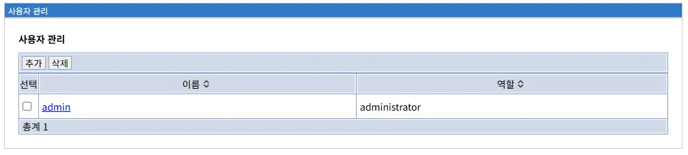
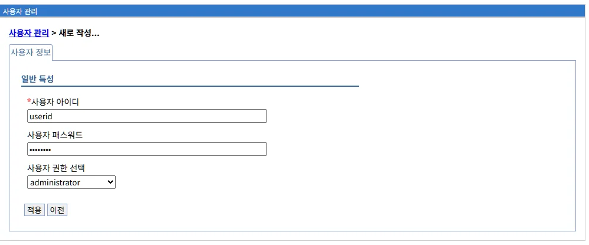
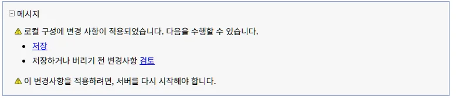
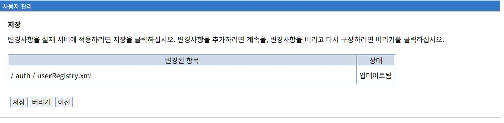
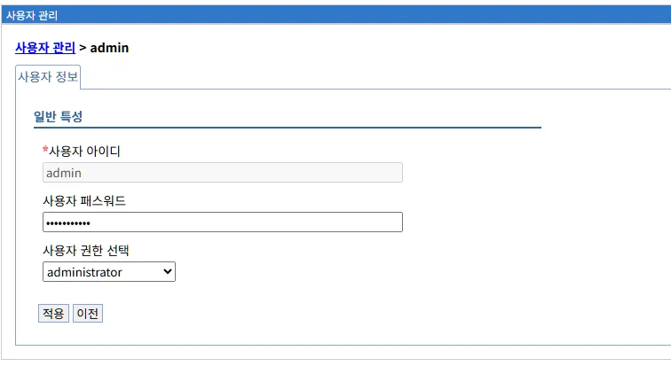
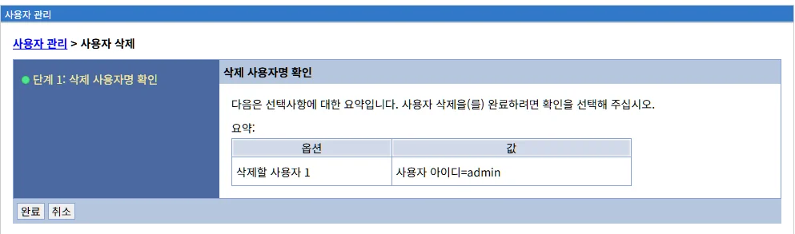

# 사용자 관리 (User Management)
분석 완료했습니다! 다음 내용을 파일의 "# 사용자 관리 (User Management)" 바로 아래에 삽입하세요:
markdown# 사용자 관리 (User Management)

사용자 관리는 LibriX 관리콘솔에 접근할 수 있는 사용자 계정을 생성하고 관리하는 기능입니다. 사용자의 인증 정보와 역할(권한) 설정을 통해 관리콘솔의 접근을 제어하는 방법을 설명합니다.

## 목차

- [개요](#개요)
- [사용자 관리 메인 화면](#사용자-관리-메인-화면)
- [사용자 생성](#사용자-생성)
- [변경사항 저장 프로세스](#변경사항-저장-프로세스)
- [사용자 상세 정보 및 편집](#사용자-상세-정보-및-편집)
- [사용자 삭제](#사용자-삭제)
- [Liberty 사용자 레지스트리 구성](#liberty-사용자-레지스트리-구성)
- [WebSphere ND와의 비교](#websphere-nd와의-비교)
- [보안 모범 사례](#보안-모범-사례)
- [문제 해결](#문제-해결)
- [다음 단계](#다음-단계)
- [참고 자료](#참고-자료)
- [요약](#요약)

---
## 개요

사용자 관리는 LibriX 관리콘솔에 접근할 수 있는 사용자 계정을 생성하고 관리하는 기능입니다. 이 메뉴에서는 사용자의 인증 정보와 역할(권한)을 설정하여 관리콘솔의 접근을 제어할 수 있습니다.

**주요 기능:**
- 사용자 계정 생성 및 삭제
- 사용자 비밀번호 관리
- 사용자 역할(권한) 할당
- 사용자 레지스트리 구성 관리

**Liberty 구현:**

LibriX의 사용자 관리는 Open Liberty의 기본 사용자 레지스트리(Basic User Registry)를 기반으로 구현되며, `userRegistry.xml` 파일에 사용자 정보를 저장합니다.

**WebSphere Application Server와의 관계:**

WebSphere Application Server의 사용자 레지스트리 개념을 Liberty 환경에 맞게 단순화한 구현입니다.

**WebSphere ND User Registry:**
```
사용자 레지스트리 유형:
- Federated Repository (통합 레포지토리)
- LDAP (경량 디렉토리 접근 프로토콜)
- Local OS (로컬 운영 체제)
- Custom (사용자 정의)
- Stand-alone Custom Registry

관리 위치:
보안 > 전역 보안 > 사용자 레지스트리
```

**Liberty (LibriX) User Registry:**
```
사용자 레지스트리 유형:
- Basic User Registry (기본 사용자 레지스트리)
  - XML 파일 기반 (userRegistry.xml)
  - 간단한 사용자/비밀번호 관리
  - 역할 기반 접근 제어

- LDAP (선택적, 고급 구성)
- Custom (선택적, 확장 가능)

관리 위치:
보안 > 사용자 관리
```

**주요 차이점:**

| 항목 | WebSphere ND | Liberty (LibriX) |
|------|--------------|------------------|
| **기본 레지스트리** | Federated Repository | Basic User Registry |
| **저장 위치** | 데이터베이스/LDAP | XML 파일 |
| **구성 복잡도** | 높음 (다단계 설정) | 낮음 (단순 XML) |
| **사용자 관리** | 복잡한 UI | 간소화된 UI |
| **역할 매핑** | 다중 레벨 | 단순 역할 선택 |
| **확장성** | 대규모 엔터프라이즈 | 중소규모 환경 |

---

## 사용자 관리 메인 화면



사용자 관리 메뉴를 선택하면 현재 등록된 모든 사용자의 목록이 표시됩니다.

**화면 경로:**
```
보안 > 사용자 관리
```

### 화면 구성

```
사용자 관리

[추가]  [삭제]

선택    이름 ↕         역할 ↕
☐       admin          administrator

총계 1
```

### 목록 테이블

사용자 목록은 다음과 같은 정보를 표시합니다:

| 컬럼 | 설명 |
|------|------|
| **선택** | 체크박스를 사용하여 사용자를 선택합니다. 삭제 작업 시 사용됩니다. |
| **이름** | 사용자 아이디(로그인 ID)입니다. 클릭하면 해당 사용자의 상세 정보 페이지로 이동합니다. |
| **역할** | 사용자에게 할당된 역할(권한)입니다. |

**정렬 기능:**

컬럼 헤더의 화살표(↕)를 클릭하여 해당 컬럼 기준으로 오름차순/내림차순 정렬할 수 있습니다.

### 관리 탭

화면 상단에는 다음과 같은 관리 탭이 제공됩니다:

#### 1. 추가 탭

```
[추가]
```

새로운 사용자를 생성합니다. 클릭하면 사용자 생성 화면으로 이동합니다.

#### 2. 삭제 탭

```
[삭제]
```

선택한 사용자를 삭제합니다. 

**사용 방법:**
1. 목록에서 삭제할 사용자의 체크박스 선택
2. [삭제] 탭 클릭
3. 확인 메시지에서 삭제 확인

**주의사항:**
- 삭제 작업은 되돌릴 수 없습니다
- 마지막 관리자 계정은 삭제할 수 없습니다
- 현재 로그인한 사용자는 자기 자신을 삭제할 수 없습니다

### 기본 사용자

LibriX를 처음 설치하면 다음과 같은 기본 사용자가 생성됩니다:

| 사용자 ID | 역할 | 설명 |
|-----------|------|------|
| **admin** | administrator | 시스템 관리자 계정. 모든 권한을 가집니다. |

**보안 권장사항:**
- 초기 admin 계정의 비밀번호를 즉시 변경하십시오
- 프로덕션 환경에서는 기본 계정 대신 개별 관리자 계정을 생성하십시오
- 정기적으로 비밀번호를 변경하십시오

---

## 사용자 생성

### 사용자 생성 화면



"추가" 탭을 클릭하면 새로운 사용자를 생성하는 화면이 표시됩니다.

**화면 경로:**
```
보안 > 사용자 관리 > 추가
```

**화면 구성:**

```
사용자 관리 > 새로 작성...

사용자 정보

일반 특성

*사용자 아이디
[userid                              ]

사용자 패스워드
[••••••••                            ]

사용자 권한 선택
[administrator                       ▼]

[적용]  [이전]
```

### 입력 필드

#### 1. 사용자 아이디 *필수

```
*사용자 아이디
[userid]
```

사용자의 로그인 ID를 입력합니다.

**입력 규칙:**
- 필수 입력 항목 (별표 * 표시)
- 영문자, 숫자, 특수문자 조합 가능
- 공백 불가
- 시스템 내에서 고유해야 함 (중복 불가)
- 대소문자 구분

**권장 명명 규칙:**
```
개인 사용자:
- 이름 기반: john.doe, jane.smith
- 이메일 형식: user@domain
- 조직 코드: dev001, admin01

서비스 계정:
- 용도 명시: backup_admin, monitor_user
- 시스템 연동: jenkins_user, gitlab_admin
```

**잘못된 예시:**
```
✗ admin user (공백 포함)
✗ 관리자 (한글, 환경에 따라 문제 발생 가능)
✗ user!@# (특수문자 과다)
```

**올바른 예시:**
```
✓ admin
✓ john.doe
✓ dev_user
✓ operator01
```

#### 2. 사용자 패스워드 *필수

```
사용자 패스워드
[••••••••]
```

사용자의 로그인 비밀번호를 입력합니다.

**입력 규칙:**
- 필수 입력 항목
- 입력한 문자는 보안을 위해 마스킹 처리됩니다 (••••••)
- 비밀번호 강도 정책은 시스템 보안 설정에 따름

**비밀번호 보안 권장사항:**

**강도 요구사항:**
```
최소 길이: 8자 이상 (권장: 12자 이상)
복잡도:
- 대문자 포함 (A-Z)
- 소문자 포함 (a-z)
- 숫자 포함 (0-9)
- 특수문자 포함 (!@#$%^&*)
```

**피해야 할 비밀번호:**
```
✗ password, admin123 (추측 가능)
✗ 12345678, qwerty (단순 패턴)
✗ 사용자 아이디와 동일
✗ 회사명, 제품명 등 공개 정보
```

**좋은 비밀번호 예시:**
```
✓ Lib@riX2024!
✓ Secur3P@ssw0rd
✓ MyC0mpl3x#Key
```

**비밀번호 관리 정책:**
```
정기 변경: 90일마다 변경 권장
재사용 제한: 최근 5개 비밀번호 재사용 금지
계정 잠금: 5회 연속 실패 시 계정 잠금
세션 타임아웃: 30분 비활성 시 자동 로그아웃
```

#### 3. 사용자 권한 선택 *필수

```
사용자 권한 선택
[administrator                       ▼]
```

사용자에게 할당할 역할(권한)을 드롭다운 메뉴에서 선택합니다.

**사용 가능한 역할:**

**1. administrator (관리자)**

```
[administrator]
```

**권한:**
- 모든 관리 기능에 대한 완전한 접근 권한
- 사용자 생성 및 삭제
- 서버 생성, 시작, 중지, 삭제
- 애플리케이션 설치 및 제거
- 시스템 설정 변경
- 보안 설정 관리

**용도:**
- 시스템 관리자
- DevOps 엔지니어
- 전체 시스템 관리 책임자

**2. reader (읽기 전용)**

```
[reader]
```

**권한:**
- 모든 정보 조회 가능
- 설정 변경 불가
- 사용자 생성/삭제 불가
- 서버 생명주기 작업 불가
- 애플리케이션 배포 불가

**용도:**
- 모니터링 담당자
- 감사(Audit) 담당자
- 시스템 현황 확인이 필요한 사용자
- 외부 협력 업체 (제한적 접근)

**역할 비교:**

| 작업 | administrator | reader |
|------|---------------|---------|
| **서버 목록 조회** | ✓ | ✓ |
| **서버 생성** | ✓ | ✗ |
| **서버 시작/중지** | ✓ | ✗ |
| **서버 삭제** | ✓ | ✗ |
| **애플리케이션 조회** | ✓ | ✓ |
| **애플리케이션 설치** | ✓ | ✗ |
| **애플리케이션 시작/중지** | ✓ | ✗ |
| **사용자 관리** | ✓ | ✗ |
| **보안 설정** | ✓ | ✗ |
| **데이터소스 생성** | ✓ | ✗ |
| **로그 조회** | ✓ | ✓ |
| **모니터링** | ✓ | ✓ |

**역할 선택 가이드:**

```
시나리오: 개발팀 멤버
역할: administrator
이유: 개발 서버 관리, 애플리케이션 배포 필요

시나리오: QA 테스터
역할: reader (또는 제한적 administrator)
이유: 서버 상태 확인, 로그 조회만 필요

시나리오: 운영팀 리더
역할: administrator
이유: 전체 시스템 관리 및 모니터링

시나리오: 보안 감사자
역할: reader
이유: 시스템 감사를 위한 읽기 권한만 필요

시나리오: 외주 개발자
역할: reader
이유: 제한적 접근, 시스템 변경 불가
```

### 사용자 생성 완료

모든 필수 필드를 입력한 후 화면 하단의 버튼을 사용하여 작업을 완료할 수 있습니다:

#### 적용 버튼

```
[적용]
```

입력한 정보로 사용자를 생성합니다.

**클릭 시 동작:**
1. 입력 값 유효성 검사
2. 사용자 레지스트리에 사용자 추가
3. 변경사항 저장 메시지 표시

#### 이전 버튼

```
[이전]
```

사용자 생성을 취소하고 사용자 목록 화면으로 돌아갑니다.

**주의:**
- 입력한 내용은 저장되지 않습니다

---

## 변경사항 저장 프로세스

### 저장 확인 메시지



사용자 생성 또는 수정 후 "적용" 버튼을 클릭하면 다음과 같은 메시지가 표시됩니다.

**메시지 내용:**

```
메시지

⚠ 로컬 구성에 변경 사항이 적용되었습니다. 다음을 수행할 수 있습니다.

• 저장
• 저장하거나 버리기 전 변경사항 검토

⚠ 이 변경사항을 적용하려면, 서버를 다시 시작해야 합니다.
```

**메시지 설명:**

**1. 로컬 구성 변경**
```
변경사항이 메모리에 적용되었지만, 
아직 디스크에 영구 저장되지 않은 상태입니다.
```

**2. 선택 옵션**
```
저장: 즉시 구성 파일에 변경사항 기록
검토: 변경된 파일 목록 확인 후 저장 여부 결정
```

**3. 서버 재시작 필요**
```
일부 보안 설정 변경은 서버 재시작 후 적용됩니다.
```

### 변경사항 검토



"저장하거나 버리기 전 변경사항 검토" 링크를 클릭하면 변경된 구성 파일 목록을 확인할 수 있습니다.

**화면 구성:**

```
저장

변경사항을 실제 서버에 적용하려면 저장을 클릭하십시오. 
변경사항을 추가하려면 계속을, 
변경사항을 버리고 다시 구성하려면 버리기를 클릭하십시오.

변경된 항목                    상태
/ auth / userRegistry.xml      업데이트됨

[저장]  [버리기]  [이전]
```

**변경된 파일:**

| 파일 경로 | 상태 | 설명 |
|----------|------|------|
| **/auth/userRegistry.xml** | 업데이트됨 | 사용자 레지스트리 구성 파일. 사용자 정보가 이 파일에 저장됩니다. |

**userRegistry.xml 구조 예시:**

```xml
<?xml version="1.0" encoding="UTF-8"?>
<server>
    <basicRegistry id="basic" realm="BasicRealm">
        <user name="admin" 
              password="{xor}Lz4sLChvLTs=" />
        <user name="userid" 
              password="{xor}PjsyNjE=" />
        
        <!-- 역할 매핑 -->
        <group name="administrators">
            <member name="admin" />
        </group>
        
        <group name="readers">
            <member name="userid" />
        </group>
    </basicRegistry>
</server>
```

**주요 구성 요소:**

**1. basicRegistry**
```xml
<basicRegistry id="basic" realm="BasicRealm">
```
- 기본 사용자 레지스트리 정의
- realm: 인증 영역 이름

**2. user**
```xml
<user name="admin" password="{xor}Lz4sLChvLTs=" />
```
- 개별 사용자 정의
- password: XOR 인코딩된 비밀번호
  (보안: 단방향 암호화는 아니지만 평문보다 안전)

**3. group**
```xml
<group name="administrators">
    <member name="admin" />
</group>
```
- 역할(그룹) 정의
- 그룹에 사용자 할당

### 저장 옵션

#### 저장 버튼

```
[저장]
```

변경사항을 구성 파일에 영구 저장합니다.

**실행 작업:**
1. userRegistry.xml 파일 업데이트
2. 변경사항 디스크에 기록
3. 사용자 목록 화면으로 이동

**결과:**
- 새로운 사용자가 시스템에 등록됨
- 다음 로그인부터 새 사용자 계정 사용 가능

#### 버리기 버튼

```
[버리기]
```

변경사항을 취소하고 이전 상태로 되돌립니다.

**실행 작업:**
1. 메모리의 변경사항 폐기
2. 구성 파일 변경 없음
3. 사용자 목록 화면으로 이동

**결과:**
- 새로운 사용자가 생성되지 않음
- 시스템 상태 유지

#### 이전 버튼

```
[이전]
```

검토 화면을 닫고 이전 화면으로 돌아갑니다.

**주의:**
- 변경사항은 여전히 메모리에 남아있음
- 나중에 저장하거나 버릴 수 있음

---

## 사용자 상세 정보 및 편집

### 사용자 상세 화면



사용자 목록에서 사용자 이름을 클릭하면 해당 사용자의 상세 정보 및 편집 화면이 표시됩니다.

**화면 경로:**
```
보안 > 사용자 관리 > {사용자 이름}
```

**화면 구성:**

```
사용자 관리 > admin

사용자 정보

일반 특성

*사용자 아이디
[admin                               ]

사용자 패스워드
[••••••••••••                        ]

사용자 권한 선택
[administrator                       ▼]

[적용]  [이전]
```

### 편집 가능한 필드

#### 사용자 아이디

```
*사용자 아이디
[admin]
```

**특징:**
- 읽기 전용 (편집 불가)
- 사용자 아이디는 생성 후 변경할 수 없습니다
- 변경이 필요한 경우 새 사용자를 생성하고 기존 사용자를 삭제해야 합니다

**이유:**
- 사용자 아이디는 시스템 전체에서 참조되는 기본 키입니다
- 변경 시 다양한 참조 관계에 영향을 미칠 수 있습니다

#### 사용자 패스워드

```
사용자 패스워드
[••••••••••••]
```

**특징:**
- 편집 가능
- 현재 비밀번호는 보안상 표시되지 않음
- 새 비밀번호를 입력하면 변경됨
- 빈 칸으로 두면 비밀번호가 변경되지 않음

**비밀번호 변경 방법:**
1. 패스워드 필드에 새 비밀번호 입력
2. "적용" 버튼 클릭
3. 변경사항 저장

**비밀번호 변경 주기:**
```
일반 사용자: 90일마다 변경 권장
관리자: 60일마다 변경 권장
서비스 계정: 180일마다 변경
```

#### 사용자 권한 선택

```
사용자 권한 선택
[administrator                       ▼]
```

**특징:**
- 편집 가능
- 드롭다운 메뉴에서 새로운 역할 선택 가능
- administrator ↔ reader 간 변경 가능

**역할 변경 시나리오:**

**승격 (reader → administrator):**
```
사용 사례:
- 사용자가 팀 리더로 승진
- 임시 관리자 권한 부여
- 시스템 관리 책임 위임

주의사항:
- 권한 부여 전 충분한 교육 필요
- 변경 이력 기록 및 감사
```

**강등 (administrator → reader):**
```
사용 사례:
- 역할 변경 (관리 → 모니터링)
- 임시 권한 회수
- 보안 정책 준수

주의사항:
- 사용자에게 사전 통보
- 마지막 관리자 계정은 강등 불가
```

### 변경사항 적용

사용자 정보를 수정한 후 "적용" 버튼을 클릭하면 변경사항이 적용됩니다.

**적용 프로세스:**
1. 수정된 필드 값 검증
2. userRegistry.xml 업데이트
3. 변경사항 저장 메시지 표시
4. 저장/검토/버리기 선택

**즉시 적용되는 변경사항:**
- 비밀번호 변경 (다음 로그인부터 적용)
- 역할 변경 (다음 로그인부터 적용)

**참고:**
- 현재 로그인 중인 사용자의 정보를 변경해도 현재 세션에는 영향을 주지 않습니다
- 변경된 권한은 다음 로그인 시부터 적용됩니다

---

## 사용자 삭제

### 삭제 확인 화면



사용자를 삭제하려면 목록에서 사용자를 선택하고 "삭제" 탭을 클릭합니다.

**화면 경로:**
```
보안 > 사용자 관리 > 사용자 선택 > 삭제
```

**화면 구성:**

```
사용자 관리 > 사용자 삭제

● 단계 1: 삭제 사용자명 확인

삭제 사용자명 확인

다음은 선택사항에 대한 요약입니다. 
사용자 삭제(들) 완료하려면 확인을 선택해 주십시오.

요약:
옵션                   값
삭제할 사용자명 1      사용자 아이디=admin

[완료]  [취소]
```

### 삭제 프로세스

#### 1단계: 사용자 선택

```
사용자 목록에서 삭제할 사용자의 체크박스 선택
```

**다중 선택:**
- 여러 사용자를 동시에 선택하여 일괄 삭제 가능
- 체크박스를 사용하여 복수 선택

#### 2단계: 삭제 탭 클릭

```
[삭제] 탭 클릭
```

삭제 확인 화면으로 이동합니다.

#### 3단계: 삭제 확인

```
삭제 사용자명 확인

요약 테이블에서 삭제할 사용자 목록 확인
```

**확인 정보:**
- 옵션: 삭제할 사용자명 1, 2, 3...
- 값: 실제 사용자 아이디

**예시:**
```
옵션                   값
삭제할 사용자명 1      사용자 아이디=admin
삭제할 사용자명 2      사용자 아이디=userid
```

#### 4단계: 완료 또는 취소

**완료 버튼:**
```
[완료]
```

선택한 사용자를 삭제합니다.

**실행 작업:**
1. userRegistry.xml에서 사용자 정보 제거
2. 역할 그룹에서 멤버십 제거
3. 변경사항 저장 메시지 표시
4. 저장 후 사용자 목록으로 이동

**취소 버튼:**
```
[취소]
```

삭제 작업을 취소하고 사용자 목록으로 돌아갑니다.

### 삭제 제한 사항

**삭제할 수 없는 경우:**

**1. 마지막 관리자 계정**
```
에러 메시지:
"마지막 administrator 역할 사용자는 삭제할 수 없습니다."

이유:
시스템에 최소 한 명의 관리자가 필요합니다.

해결:
다른 관리자 계정을 먼저 생성한 후 삭제하십시오.
```

**2. 현재 로그인 사용자**
```
에러 메시지:
"현재 로그인 중인 사용자는 삭제할 수 없습니다."

이유:
자기 자신의 계정을 삭제하면 시스템 접근이 불가능합니다.

해결:
다른 관리자 계정으로 로그인한 후 삭제하십시오.
```

**3. 시스템 예약 계정**
```
일부 시스템 내부 계정은 삭제가 제한될 수 있습니다.
```

### 삭제 후 영향

**즉시 효과:**
- 해당 사용자는 더 이상 로그인할 수 없음
- 기존 세션은 유지될 수 있음 (세션 타임아웃까지)

**구성 파일 변경:**
```xml
<!-- 삭제 전 -->
<basicRegistry id="basic" realm="BasicRealm">
    <user name="admin" password="{xor}Lz4sLChvLTs=" />
    <user name="userid" password="{xor}PjsyNjE=" />
    
    <group name="administrators">
        <member name="admin" />
    </group>
</basicRegistry>

<!-- userid 삭제 후 -->
<basicRegistry id="basic" realm="BasicRealm">
    <user name="admin" password="{xor}Lz4sLChvLTs=" />
    
    <group name="administrators">
        <member name="admin" />
    </group>
</basicRegistry>
```

**감사 로그:**
- 사용자 삭제 작업이 시스템 로그에 기록됩니다
- 누가, 언제, 어떤 사용자를 삭제했는지 추적 가능

---

## Liberty 사용자 레지스트리 구성

### Basic User Registry

LibriX는 Liberty의 Basic User Registry를 사용하여 사용자 인증을 관리합니다.

**구성 파일 위치:**
```
/auth/userRegistry.xml
```

**전체 구성 예시:**

```xml
<?xml version="1.0" encoding="UTF-8"?>
<server description="LibriX User Registry">
    
    <!-- Basic User Registry 정의 -->
    <basicRegistry id="basic" realm="LibriXRealm">
        
        <!-- 사용자 정의 -->
        <user name="admin" 
              password="{xor}Lz4sLChvLTs=" />
        
        <user name="operator" 
              password="{xor}PjsyNjEsLQ==" />
        
        <user name="monitor" 
              password="{xor}MzovPiwsNw==" />
        
        <!-- 역할(그룹) 정의 -->
        <group name="administrators">
            <member name="admin" />
            <member name="operator" />
        </group>
        
        <group name="readers">
            <member name="monitor" />
        </group>
    </basicRegistry>
    
    <!-- 관리 역할 매핑 -->
    <administrator-role>
        <user>admin</user>
        <group>administrators</group>
    </administrator-role>
    
    <reader-role>
        <user>monitor</user>
        <group>readers</group>
    </reader-role>
    
</server>
```

### 비밀번호 인코딩

Liberty는 비밀번호를 XOR 인코딩하여 저장합니다.

**인코딩 방법:**

**1. securityUtility 명령 사용:**

```bash
# Liberty 설치 디렉토리에서
${wlp.install.dir}/bin/securityUtility encode mypassword

# 출력:
{xor}Lz4sLChvLTs=
```

**2. 구성 파일에 적용:**

```xml
<user name="newuser" password="{xor}Lz4sLChvLTs=" />
```

**주의사항:**

**XOR 인코딩의 한계:**
```
✓ 평문 비밀번호보다 안전
✓ 구성 파일 노출 시 즉시 탈취 방지
✗ 디코딩 가능 (암호화가 아님)
✗ 강력한 보안이 필요한 환경에는 부적합
```

**프로덕션 환경 권장사항:**
```
1. LDAP 사용자 레지스트리 사용
2. 구성 파일 접근 권한 엄격히 제한
3. 정기적인 비밀번호 변경
4. 비밀번호 복잡도 정책 적용
```

### 역할 매핑

Liberty에서는 사용자를 그룹에 할당하고, 그룹에 역할을 매핑합니다.

**역할 매핑 구조:**

```
사용자 (user) 
  ↓
그룹 (group)
  ↓
역할 (role)
  ↓
권한 (permission)
```

**예시:**

```xml
<!-- 1. 사용자 정의 -->
<user name="john" password="{xor}..." />
<user name="jane" password="{xor}..." />

<!-- 2. 그룹 정의 및 멤버 할당 -->
<group name="administrators">
    <member name="john" />
</group>

<group name="readers">
    <member name="jane" />
</group>

<!-- 3. 역할 매핑 -->
<administrator-role>
    <group>administrators</group>
</administrator-role>

<reader-role>
    <group>readers</group>
</reader-role>
```

**동작 원리:**
1. john 사용자가 로그인
2. administrators 그룹 멤버십 확인
3. administrator 역할 부여
4. 전체 시스템 관리 권한 획득

---

## WebSphere ND와의 비교

### 사용자 레지스트리 비교

#### WebSphere ND

**사용자 레지스트리 유형:**

**1. Federated Repository (기본)**
```
특징:
- 다중 레포지토리 통합
- 파일, LDAP, 데이터베이스 지원
- 복잡한 구성

구성 위치:
보안 > 전역 보안 > 연합 레포지토리
```

**2. LDAP**
```
특징:
- 엔터프라이즈 디렉토리 서비스
- Active Directory, IBM TDS 등
- 중앙 집중식 사용자 관리

구성 위치:
보안 > 전역 보안 > LDAP 사용자 레지스트리
```

**3. Local OS**
```
특징:
- 운영 체제 사용자 계정 활용
- Windows, Linux 사용자
- 별도 사용자 관리 불필요
```

**4. Custom**
```
특징:
- 사용자 정의 레지스트리
- UserRegistry 인터페이스 구현
- 기존 인증 시스템 통합
```

#### Liberty (LibriX)

**사용자 레지스트리 유형:**

**1. Basic User Registry (기본)**
```
특징:
- XML 파일 기반
- 간단한 구성
- 소규모 환경 적합

구성 위치:
보안 > 사용자 관리
```

**2. LDAP (고급)**
```
특징:
- server.xml에 직접 구성
- WebSphere ND와 유사한 기능
- GUI 지원 제한적

구성 방법:
XML 편집기 또는 수동 편집
```

**3. Custom (확장)**
```
특징:
- 개발자가 직접 구현
- JAR 파일로 배포
- Liberty API 사용
```

### 관리 방식 비교

| 항목 | WebSphere ND | Liberty (LibriX) |
|------|--------------|------------------|
| **기본 레지스트리** | Federated Repository | Basic User Registry |
| **저장 방식** | 데이터베이스/LDAP | XML 파일 |
| **사용자 관리 UI** | ISC (복잡) | LibriX (단순) |
| **역할 정의** | 다중 레벨 | 단일 레벨 (administrator/reader) |
| **LDAP 통합** | GUI 완전 지원 | XML 직접 편집 |
| **확장성** | 대규모 (수만 명) | 중소규모 (수백 명) |
| **구성 복잡도** | 높음 | 낮음 |

### 역할 매핑 비교

#### WebSphere ND

```
복잡한 다단계 매핑:

사용자/그룹 (User/Group)
  ↓
보안 역할 (Security Role)
  ↓
애플리케이션 역할 (Application Role)
  ↓
J2EE 역할 (J2EE Role)
  ↓
메서드/리소스 권한
```

**예시:**
```
사용자: john
  ↓
그룹: developers
  ↓
보안 역할: Deployer
  ↓
애플리케이션 역할: admin
  ↓
EJB 메서드 호출 권한
```

#### Liberty (LibriX)

```
단순한 2단계 매핑:

사용자 (User)
  ↓
그룹 (Group)
  ↓
역할 (administrator/reader)
  ↓
시스템 권한
```

**예시:**
```
사용자: john
  ↓
그룹: administrators
  ↓
역할: administrator
  ↓
전체 시스템 관리 권한
```

---

## 보안 모범 사례

### 사용자 계정 관리

**1. 초기 설정**

```
✓ 기본 admin 비밀번호 즉시 변경
✓ 강력한 비밀번호 정책 수립
✓ 불필요한 기본 계정 삭제
✓ 개인별 계정 생성 (공유 계정 금지)
```

**2. 비밀번호 정책**

```
최소 길이: 12자 이상
복잡도: 대소문자, 숫자, 특수문자 조합
변경 주기: 90일
재사용 제한: 최근 5개 비밀번호
계정 잠금: 5회 실패 시
```

**3. 역할 할당 원칙**

```
최소 권한 원칙 (Principle of Least Privilege):
- 업무 수행에 필요한 최소한의 권한만 부여
- 불필요한 administrator 역할 지양
- 임시 권한은 기간 제한

역할 분리 (Separation of Duties):
- 개발자 ≠ 운영자
- 모니터링 ≠ 관리자
- 감사자 = reader 역할
```

**4. 정기적 검토**

```
월간 검토:
☐ 활성 사용자 계정 확인
☐ 미사용 계정 비활성화
☐ 역할 적절성 검토

분기별 검토:
☐ 비밀번호 변경 이력
☐ 계정 접근 로그
☐ 권한 변경 이력
```

### 프로덕션 환경 권장사항

**1. LDAP 통합**

```
Basic User Registry 대신 LDAP 사용:
- 중앙 집중식 사용자 관리
- 기업 디렉토리 통합 (Active Directory)
- 그룹 정책 활용
- 자동 계정 동기화
```

**LDAP 구성 예시:**

```xml
<server>
    <ldapRegistry id="ldap" 
                  realm="LDAPRealm" 
                  host="ldap.company.com" 
                  port="389" 
                  baseDN="dc=company,dc=com"
                  bindDN="cn=admin,dc=company,dc=com"
                  bindPassword="{xor}..." 
                  ldapType="IBM Tivoli Directory Server">
        
        <idsFilters
            userFilter="(&amp;(uid=%v)(objectclass=person))"
            groupFilter="(&amp;(cn=%v)(objectclass=groupOfNames))"
            userIdMap="*:uid"
            groupIdMap="*:cn"
            groupMemberIdMap="groupOfNames:member"/>
            
    </ldapRegistry>
</server>
```

**2. 다중 인증 (MFA)**

```
기본 비밀번호 + 추가 인증:
- OTP (One-Time Password)
- SMS 인증
- 인증 앱 (Google Authenticator 등)
- 하드웨어 토큰
```

**3. 세션 관리**

```
세션 보안 강화:
- 짧은 세션 타임아웃 (30분)
- 유휴 시간 제한 (15분)
- 동시 로그인 제한
- 세션 고정 공격 방지
```

**4. 감사 로그**

```
모든 보안 관련 활동 기록:
- 로그인 성공/실패
- 사용자 생성/삭제
- 역할 변경
- 비밀번호 변경
- 권한 변경
- 설정 수정
```

**5. 네트워크 보안**

```
관리 콘솔 접근 제한:
- VPN 필수
- IP 화이트리스트
- 방화벽 규칙
- SSL/TLS 암호화
```

---

## 문제 해결

### 로그인 문제

**증상 1: 로그인 실패**

```
에러: "사용자 이름 또는 비밀번호가 올바르지 않습니다."
```

**원인 및 해결:**

```
1. 비밀번호 오류
   확인: 대소문자 구분, Caps Lock 확인
   해결: 비밀번호 재설정

2. 사용자 계정 삭제됨
   확인: 사용자 목록에서 계정 존재 확인
   해결: 계정 재생성 또는 관리자 문의

3. 계정 잠금
   확인: 로그에서 계정 잠금 메시지 확인
   해결: 관리자가 계정 잠금 해제

4. userRegistry.xml 손상
   확인: XML 파일 문법 오류
   해결: 백업에서 복원 또는 수동 수정
```

**증상 2: 권한 없음 오류**

```
에러: "이 작업을 수행할 권한이 없습니다."
```

**원인 및 해결:**

```
1. reader 역할로 로그인
   확인: 사용자 상세에서 역할 확인
   해결: 관리자가 역할을 administrator로 변경

2. 역할 매핑 오류
   확인: userRegistry.xml의 그룹 멤버십
   해결: XML 파일에서 올바른 그룹에 사용자 추가

3. 캐시된 권한 정보
   확인: 다시 로그인
   해결: 로그아웃 후 재로그인
```

### 구성 문제

**증상: 사용자 추가 후 저장 실패**

```
에러: "변경사항을 저장할 수 없습니다."
```

**원인 및 해결:**

```
1. 파일 권한 문제
   확인: userRegistry.xml 파일 쓰기 권한
   해결: chmod 644 /auth/userRegistry.xml

2. 디스크 용량 부족
   확인: df -h 명령으로 디스크 확인
   해결: 불필요한 파일 삭제, 디스크 확장

3. XML 문법 오류
   확인: XML 유효성 검사
   해결: XML 문법 수정 또는 백업 복원

4. 동시 수정 충돌
   확인: 다른 관리자의 동시 수정 여부
   해결: 다시 시도하거나 조율
```

**증상: 비밀번호 인코딩 실패**

```
에러: "비밀번호를 인코딩할 수 없습니다."
```

**해결:**

```bash
# securityUtility 도구 사용
${wlp.install.dir}/bin/securityUtility encode "mypassword"

# 출력된 인코딩 문자열을 userRegistry.xml에 적용
<user name="newuser" password="{xor}Lz4sLChvLTs=" />
```

### 로그 확인

**관련 로그 파일:**

```
Liberty 메시지 로그:
${server.output.dir}/logs/messages.log

예시:
[2024-01-20 10:15:30] INFO  Authentication successful for user: admin
[2024-01-20 10:16:45] WARN  Authentication failed for user: unknown
[2024-01-20 10:17:22] ERROR User registry configuration error
```

**유용한 로그 메시지:**

```
로그인 성공:
CWWKS1100A: Authentication successful for user: {0}

로그인 실패:
CWWKS1100E: Authentication failed for user: {0}

사용자 레지스트리 로드:
CWWKS3005I: The user registry service is ready.

구성 변경:
CWWKG0017I: The server configuration was successfully updated.
```

---

## 다음 단계

- LDAP 통합을 구성하려면 Liberty 공식 문서의 [LDAP User Registry](https://openliberty.io/docs/latest/reference/config/ldapRegistry.html)를 참조하십시오.
- 애플리케이션 보안 역할 매핑은 [엔터프라이즈 애플리케이션 관리](../application/enterprise-application.md) 문서를 참조하십시오.
- SSL/TLS 구성은 [SSL 구성](ssl-configuration.md) 문서를 참조하십시오.
- J2C 인증 데이터 관리는 [J2C 인증 데이터](j2c-authentication-data.md) 문서를 참조하십시오.

---

## 참고 자료

### Liberty 공식 문서

- [Basic User Registry](https://openliberty.io/docs/latest/reference/config/basicRegistry.html)
- [LDAP User Registry](https://openliberty.io/docs/latest/reference/config/ldapRegistry.html)
- [Administrator Role](https://openliberty.io/docs/latest/reference/config/administrator-role.html)
- [Reader Role](https://openliberty.io/docs/latest/reference/config/reader-role.html)
- [Security Utility](https://openliberty.io/docs/latest/reference/command/securityUtility-encode.html)

### WebSphere 문서

- [User Registry Configuration](https://www.ibm.com/docs/en/was-nd/9.0.5?topic=users-configuring-user-registries)
- [Federated Repository](https://www.ibm.com/docs/en/was-nd/9.0.5?topic=repository-configuring-federated-repositories)
- [Security Roles](https://www.ibm.com/docs/en/was-nd/9.0.5?topic=applications-mapping-security-roles-users-groups)

### 관련 LibriX 문서

- [J2C 인증 데이터](j2c-authentication-data.md)
- [SSL 구성](ssl-configuration.md)
- [인증서 관리](certificate-management.md)
- [엔터프라이즈 애플리케이션 관리](../application/enterprise-application.md)

---

## 요약

사용자 관리는 LibriX 관리콘솔에 접근할 수 있는 사용자를 관리하는 기본 보안 기능입니다.

**주요 기능:**
- 사용자 생성 및 삭제
- 비밀번호 관리
- 역할 할당 (administrator / reader)
- Basic User Registry 기반

**사용자 역할:**
- **administrator**: 전체 시스템 관리 권한
- **reader**: 읽기 전용 권한

**구성 파일:**
- `/auth/userRegistry.xml`: 사용자 정보 저장
- XOR 인코딩된 비밀번호

**보안 권장사항:**
- 초기 admin 비밀번호 변경
- 강력한 비밀번호 사용
- 최소 권한 원칙 적용
- 정기적인 계정 검토
- 프로덕션 환경에서는 LDAP 사용

사용자 관리를 통해 LibriX 관리콘솔에 대한 접근을 효과적으로 제어하고 보안을 강화하세요!
