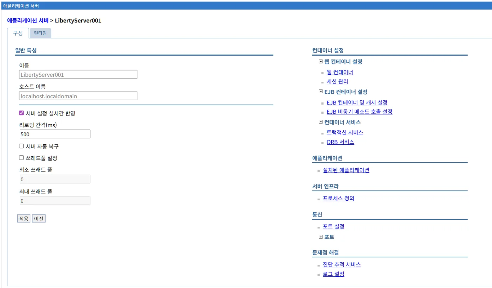
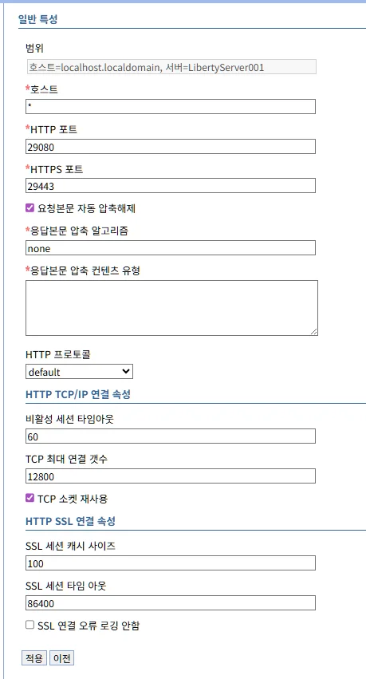
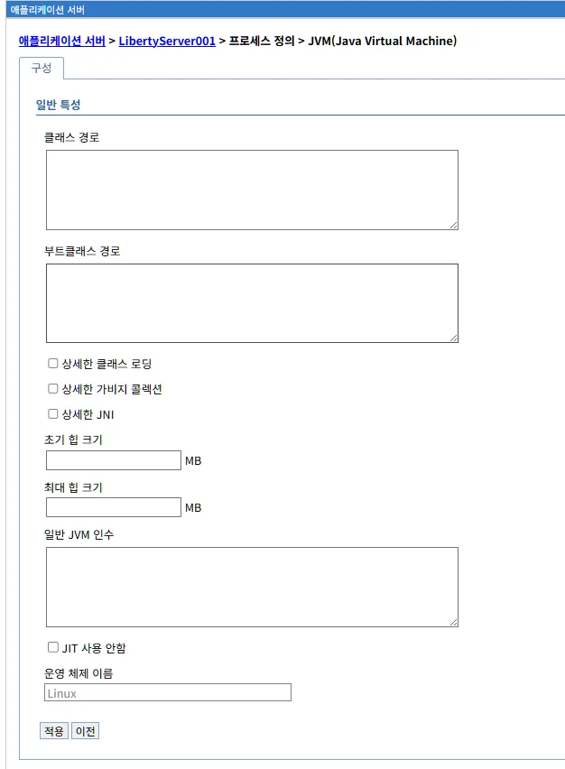
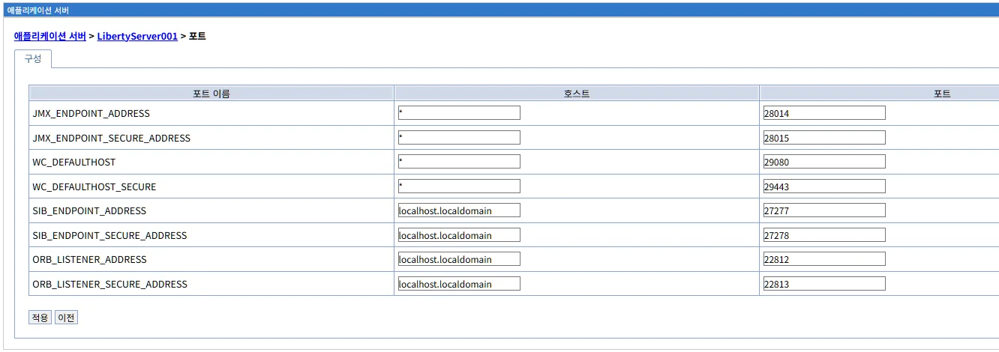
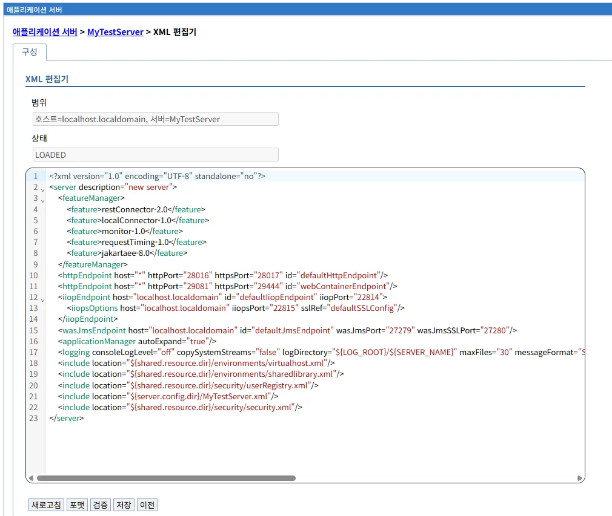

# 애플리케이션 서버 관리

## 개요

애플리케이션 서버 메뉴는 LibriX 관리콘솔에 등록된 Open Liberty 서버들을 중앙에서 관리할 수 있는 기능을 제공합니다. 이 메뉴에서는 여러 대의 Liberty 서버를 등록하고, 시작, 중지, 재시작 등의 생명주기 관리 작업을 수행할 수 있습니다.

## 애플리케이션 서버 목록

애플리케이션 서버 메뉴를 선택하면 현재 LibriX에 등록된 모든 애플리케이션 서버의 목록이 표시됩니다.


### 서버 목록 화면 구성

서버 목록 화면은 다음과 같은 정보를 테이블 형태로 제공합니다:

- **선택**: 체크박스를 사용하여 작업을 수행할 서버를 선택할 수 있습니다.
- **이름**: 서버의 이름입니다. 클릭하면 해당 서버의 상세 정보 페이지로 이동합니다.
- **호스트 이름**: 서버가 실행되고 있는 호스트의 도메인 이름 또는 IP 주소입니다.
- **버전**: 설치된 Open Liberty의 버전 정보입니다.
- **에디션**: 서버에서 사용 중인 Java 에디션 정보입니다.
- **클러스터 이름**: 서버가 속한 클러스터의 이름입니다. 클러스터에 속하지 않은 서버는 이 필드가 비어 있습니다.
- **상태**: 서버의 현재 실행 상태를 나타냅니다.
  - 녹색 원: 서버가 정상적으로 실행 중입니다.
  - 빨간 원: 서버가 중지된 상태입니다.

화면 하단에는 현재 등록된 서버의 총 개수가 표시됩니다.

### 서버 관리 기능

화면 상단에는 서버를 관리하기 위한 다음과 같은 버튼들이 제공됩니다:

#### 생성

새로운 애플리케이션 서버를 LibriX에 생성하고 등록합니다. Open Liberty 서버를 관리콘솔에 추가하여 중앙에서 관리할 수 있도록 합니다.

#### 삭제

선택한 서버를 LibriX에서 제거합니다. 실행 중인 서버는 삭제 할 수 없습니다.

삭제 작업을 수행하려면:

1. 목록에서 삭제할 서버의 체크박스를 선택합니다.
2. "삭제" 버튼을 클릭합니다.
3. 확인 대화상자가 나타나면 삭제를 확인합니다.

**주의**: 실행 중인 서버도 삭제할 수 있으나, 삭제 전에 서버를 중지하는 것이 권장됩니다.

#### 시작

선택한 서버를 시작합니다. 중지된 상태의 서버를 정상적으로 기동시킵니다.

시작 작업을 수행하려면:

1. 목록에서 시작할 서버의 체크박스를 선택합니다.
2. "시작" 버튼을 클릭합니다.
3. 서버가 시작되면 상태 표시등이 녹색으로 변경됩니다.

**참고**: 여러 서버를 동시에 선택하여 일괄 시작할 수 있습니다.

#### 중지

선택한 서버를 정상적으로 종료합니다. 서버는 현재 처리 중인 요청을 완료한 후 종료됩니다.

중지 작업을 수행하려면:

1. 목록에서 중지할 서버의 체크박스를 선택합니다.
2. "중지" 버튼을 클릭합니다.
3. 서버가 종료되면 상태 표시등이 빨간색으로 변경됩니다.

#### 재시작

선택한 서버를 재시작합니다. 서버를 중지한 후 다시 시작하는 작업을 한 번에 수행합니다. 설정 변경 후 적용이 필요한 경우에 유용합니다.

재시작 작업을 수행하려면:

1. 목록에서 재시작할 서버의 체크박스를 선택합니다.
2. "재시작" 버튼을 클릭합니다.
3. 서버가 중지된 후 다시 시작됩니다.

#### 즉시 중지

선택한 서버를 즉시 강제 종료합니다. 현재 처리 중인 요청과 관계없이 서버 프로세스를 즉시 종료합니다.

**경고**: 이 작업은 진행 중인 트랜잭션을 중단시킬 수 있으므로, 비상 상황이 아닌 경우 일반 "중지" 기능을 사용하는 것이 권장됩니다.

즉시 중지 작업을 수행하려면:

1. 목록에서 즉시 중지할 서버의 체크박스를 선택합니다.
2. "즉시 중지" 버튼을 클릭합니다.
3. 확인 대화상자가 나타나면 작업을 확인합니다.

## 서버 상태 모니터링

서버 목록 화면은 각 서버의 현재 상태를 실시간으로 표시합니다. 상태 표시등의 색상을 통해 서버의 운영 상태를 한눈에 파악할 수 있습니다.

상태 정보는 주기적으로 갱신되며, 서버에 문제가 발생한 경우 상태 표시가 변경됩니다.

## 새 애플리케이션 서버 생성

"생성" 버튼을 클릭하면 새로운 애플리케이션 서버를 LibriX에 등록하는 마법사가 시작됩니다. 서버 생성 프로세스는 2단계로 구성되어 있습니다.

### 단계 1: 호스트 선택

첫 번째 단계에서는 작성할 서버에 해당하는 호스트를 선택합니다.


#### 호스트 선택 필드

**호스트 선택** (필수)

드롭다운 메뉴에서 서버를 생성할 호스트를 선택합니다. 선택 옵션으로는 "선택"이 기본값으로 표시됩니다.

미리 등록된 호스트 목록 중에서 새로운 서버를 생성할 대상 호스트를 선택해야 합니다. 호스트가 목록에 없는 경우, 먼저 호스트를 등록해야 합니다.

**서버 이름** (필수)

새로 생성할 서버의 고유한 이름을 입력합니다. 서버 이름은 관리콘솔 내에서 서버를 식별하는 데 사용되므로 의미 있고 구분 가능한 이름을 사용하는 것이 좋습니다.

예시: `ProductionServer01`, `DevServer`, `TestAppServer` 등

**서버 에디션 선택** (필수)

드롭다운 메뉴에서 서버의 에디션을 선택합니다. 기본값은 "선택"으로 표시됩니다.

Open Liberty 서버가 사용할 플랫폼 에디션을 지정합니다. 선택 가능한 옵션에는 jakartaee-10.0, jakartaee-8.0, javaee-7.0, microprofile-1.0, servlet-3.1 등이 있습니다.

애플리케이션의 요구사항과 호환성에 맞는 에디션을 선택하십시오. (복수 선택 가능)

**복제 대상 서버 선택** (선택)

드롭다운 메뉴에서 복제할 서버를 선택할 수 있습니다. 기본값은 "없음"입니다.

이미 등록된 서버의 설정을 복제하여 새로운 서버를 생성하려는 경우 이 옵션을 사용합니다. 복제 대상 서버를 선택하면 해당 서버의 구성 정보가 새 서버에 복사됩니다.

#### 다음 단계로 이동

모든 필수 필드를 입력한 후 화면 하단의 "다음" 버튼을 클릭하여 2단계로 이동합니다. "취소" 버튼을 클릭하면 서버 생성 프로세스가 취소되고 서버 목록 화면으로 돌아갑니다.

### 단계 2: 새 서버 확인

두 번째 단계에서는 입력한 정보를 확인하고 서버 생성을 완료합니다.


#### 확인 정보

이 단계에서는 1단계에서 입력한 모든 정보가 요약 테이블 형식으로 표시됩니다. 다음 정보들을 최종 확인할 수 있습니다:

| 항목 | 설명 |
|------|------|
| **서버 유형** | 생성할 서버의 유형 (애플리케이션 서버) |
| **호스트 이름** | 서버가 생성될 호스트의 도메인 이름 또는 IP 주소 |
| **서버 이름** | 새로 생성할 서버의 고유 이름 |
| **JAVA EE 유형** | 선택한 플랫폼 에디션 (예: jakartaee-8.0) |
| **복제 대상 서버** | 복제할 대상 서버 (선택하지 않은 경우 "없음"으로 표시) |

화면 상단에는 "다음은 선택사항에 대한 요약입니다. 새 애플리케이션 서버 작성을(를) 완료하려면 확인을 선택해 주십시오."라는 안내 메시지가 표시됩니다.

#### 서버 생성 완료

확인 후 다음 작업을 수행할 수 있습니다:

- **이전**: 1단계로 돌아가서 입력한 정보를 수정합니다.
- **완료**: 입력한 정보로 서버 생성을 완료합니다. 서버가 성공적으로 생성되면 서버 목록 화면으로 이동하며, 새로 생성된 서버가 목록에 표시됩니다.
- **취소**: 서버 생성 프로세스를 취소하고 서버 목록 화면으로 돌아갑니다.

"완료" 버튼을 클릭하면 LibriX는 지정된 호스트에 새로운 애플리케이션 서버를 등록하고, 이후 해당 서버를 관리콘솔에서 관리할 수 있게 됩니다.

#### 서버 생성 완료 후 변경사항 확인

서버 생성이 완료되면 화면 상단에 다음과 같은 메시지 박스가 표시됩니다:

**메시지**

"로컬 구성에 변경 사항이 적용되었습니다. 다음을 수행할 수 있습니다."

이 메시지는 서버 구성이 로컬에 저장되었으며, 아직 서버에 반영되지 않았음을 나타냅니다. 다음 두 가지 옵션을 선택할 수 있습니다:

- **저장**: 변경사항을 즉시 서버에 적용합니다.
- **자장하거나 버리기 전 변경사항 검토**: 변경된 내용을 먼저 검토한 후 저장 또는 취소를 결정합니다.

**중요**: "이 변경사항을 적용하려면, 서버를 다시 시작해야 합니다."라는 안내 메시지가 함께 표시됩니다. 변경사항을 저장한 후에는 서버를 재시작해야 새로운 구성이 적용됩니다.

새로 생성된 서버는 서버 목록에 추가되며, 회색 상태 표시등으로 표시됩니다 (아직 시작되지 않은 상태).

### 변경사항 검토

"자장하거나 버리기 전 변경사항 검토" 링크를 클릭하면 변경사항 검토 화면이 표시됩니다.



#### 저장 화면

변경사항 검토 화면에서는 서버 생성으로 인해 추가되거나 수정된 파일 목록을 확인할 수 있습니다.

화면 상단에는 다음과 같은 안내 메시지가 표시됩니다:

"변경사항을 실제 서버에 적용하려면 저장을 클릭하십시오. 변경사항을 추가하려면 계속을, 변경사항을 버리고 다시 구성하려면 버리기를 클릭하십시오."

#### 변경된 항목 목록

변경된 파일들이 테이블 형식으로 표시됩니다:

| 변경된 항목 | 상태 |
|------------|------|
| 파일 경로 | 추가됨/수정됨 |

새로운 서버가 생성되면 일반적으로 다음과 같은 파일들이 추가됩니다:

- `/hosts/[호스트명]/servers/[서버명]/server.json`: 서버 JSON 구성 파일
- `/hosts/[호스트명]/servers/[서버명]/server.xml`: 서버 XML 구성 파일
- `/hosts/[호스트명]/servers/[서버명]/server.env`: 서버 환경 변수 파일
- `/hosts/[호스트명]/servers/[서버명]/jvm.options`: JVM 옵션 파일

각 파일의 상태는 "추가됨" 또는 "수정됨"으로 표시됩니다.

#### 변경사항 처리 옵션

화면 하단에는 다음과 같은 버튼들이 제공됩니다:

- **저장**: 변경사항을 서버에 적용하고 저장합니다. 저장 후 서버를 재시작하면 변경사항이 반영됩니다.
- **버리기**: 변경사항을 취소하고 이전 상태로 되돌립니다. 새로 생성된 서버가 삭제됩니다.
- **이전**: 서버 목록 화면으로 돌아갑니다. 변경사항은 저장되지 않은 상태로 유지됩니다.

변경사항을 검토한 후 "저장" 버튼을 클릭하면 새로운 서버 구성이 실제로 적용됩니다.

## 서버 상세 정보

서버 목록에서 서버 이름을 클릭하면 해당 서버의 상세 정보 페이지로 이동합니다. 서버 상세 페이지에서는 서버의 기본 설정을 조회하고 변경할 수 있으며, 다양한 관리 기능에 접근할 수 있습니다.

### 구성 탭

서버 상세 페이지의 "구성" 탭에서는 서버의 기본 속성과 설정을 관리할 수 있습니다.


#### 일반 특성

서버의 기본 정보와 실행 옵션을 설정할 수 있습니다:

**이름**

서버의 이름을 표시하고 수정할 수 있습니다. 서버 이름은 관리콘솔 내에서 서버를 식별하는 고유한 값입니다.

**호스트 이름**

서버가 실행되고 있는 호스트의 도메인 이름 또는 IP 주소를 표시합니다.

**서버 설정 실시간 반영**

체크박스를 선택하면 서버 설정 변경사항이 실시간으로 서버에 반영됩니다. 이 옵션을 활성화하면 대부분의 구성 변경 시 서버 재시작이 필요하지 않습니다.

**리로딩 간격(ms)**

서버가 설정 변경사항을 확인하는 주기를 밀리초 단위로 지정합니다. 기본값은 500ms입니다. 이 값을 조정하여 설정 반영 속도를 제어할 수 있습니다.

**서버 자동 복구**

체크박스를 선택하면 서버가 예기치 않게 종료되었을 때 자동으로 재시작됩니다. 프로덕션 환경에서 서버의 가용성을 높이는 데 유용합니다.

**쓰레드 설정**

체크박스를 선택하면 서버의 쓰레드 풀 설정을 사용자 정의할 수 있습니다.

**최소 쓰레드 풀**

서버가 유지할 최소 쓰레드 수를 지정합니다. 기본 값은 일반적으로 프로세서 수 × 2입니다. 또한 설정된 값이 4보다 작으면 기본값으로 4가 적용됩니다.

**최대 쓰레드 풀**

서버가 생성할 수 있는 최대 쓰레드 수를 지정합니다. 기본값은 최소값 크기 입니다.

#### 설정 변경 저장

화면 하단의 버튼을 사용하여 변경사항을 처리할 수 있습니다:

- **적용**: 변경사항을 저장하고 서버에 적용합니다.
- **이전**: 변경사항을 저장하지 않고 이전 화면으로 돌아갑니다.

### 서버 관리 링크

화면 오른쪽에는 서버의 다양한 관리 기능에 빠르게 접근할 수 있는 링크들이 카테고리별로 구성되어 있습니다:

#### 컨테이너 설정

- **웹 컨테이너 설정**: 웹 컨테이너의 세션 관리, 타임아웃 등의 설정을 관리합니다.
- **웹 컨테이너**: 웹 컨테이너의 일반 설정을 관리합니다.
- **세션 관리**: HTTP 세션 관리 정책을 구성합니다.

##### 웹 컨테이너 설정 상세

"웹 컨테이너" 링크를 클릭하면 웹 컨테이너의 상세 설정 화면이 표시됩니다.



**일반 특성**

웹 컨테이너의 기본 속성을 설정할 수 있습니다:

- **범위**: 웹 컨테이너의 전체 식별자가 표시됩니다 (예: 호스트=localhost.localdomain, 서버=LibertyServer001)
- **호스트** (필수): 호스트 이름을 입력합니다
- **HTTP 포트** (필수): HTTP 프로토콜을 위한 포트 번호를 지정합니다 (기본값: 29080)
- **HTTPS 포트** (필수): HTTPS 프로토콜을 위한 보안 포트 번호를 지정합니다 (기본값: 29443)
- **요청본문 자동 압축해제**: 체크박스를 선택하면 클라이언트로부터 받은 압축된 요청 본문을 자동으로 압축 해제합니다
- **응답본문 압축 알고리즘** (필수): 응답 본문을 압축할 때 사용할 알고리즘을 선택합니다 (기본값: none)
- **응답본문 압축 컨텐츠 유형** (필수): 압축을 적용할 컨텐츠 타입을 지정하는 텍스트 영역입니다. 여러 MIME 타입을 입력하여 특정 유형의 응답만 압축할 수 있습니다

**HTTP 프로토콜**

HTTP 프로토콜 관련 설정을 구성합니다:

- HTTP 프로토콜 버전을 드롭다운 메뉴에서 선택합니다. Servlet v4.0 이상은 HTTP/2, Servlet v3.1 이하는 HTTP/1.1 값이 기본값으로 적용 됩니다.

**HTTP TCP/IP 연결 속성**

TCP/IP 연결에 대한 세부 설정을 관리합니다:

- **비활성 세션 타임아웃**: 비활성 상태의 세션이 유지되는 시간을 초 단위로 지정합니다 (기본값: 60)
- **TCP 최대 연결 갯수**: 동시에 유지할 수 있는 최대 TCP 연결 수를 지정합니다 (기본값: 12800)
- **TCP 소켓 재사용**: 체크박스를 선택하면 TCP 소켓을 재사용하여 연결 성능을 향상시킵니다

**HTTP SSL 연결 속성**

SSL/TLS 보안 연결에 대한 설정을 구성합니다:

- **SSL 세션 캐시 사이즈**: SSL 세션 정보를 캐시할 수 있는 최대 개수를 지정합니다 (기본값: 100)
- **SSL 세션 타임아웃**: SSL 세션이 유지되는 시간을 초 단위로 지정합니다 (기본값: 86400, 즉 24시간)
- **SSL 연결 오류 로깅 안함**: 체크박스를 선택하면 SSL 연결 오류를 로그에 기록하지 않습니다

**설정 저장**

화면 하단의 버튼을 사용하여 변경사항을 처리할 수 있습니다:

- **적용**: 변경사항을 저장하고 웹 컨테이너에 적용합니다
- **이전**: 변경사항을 저장하지 않고 이전 화면으로 돌아갑니다

**추가 기능**

화면 오른쪽 상단에는 다음과 같은 추가 기능 링크가 제공됩니다:

- **사용자 정의 특성**: 웹 컨테이너의 사용자 정의 속성을 추가하거나 수정합니다
- **세션 관리**: HTTP 세션 관리 설정 페이지로 이동합니다

##### 사용자 정의 특성

"사용자 정의 특성" 링크를 클릭하면 웹 컨테이너에 대한 사용자 정의 속성을 관리할 수 있는 화면이 표시됩니다.

**사용자 정의 특성 목록**

사용자 정의 특성 목록 화면에는 다음과 같은 정보가 테이블 형태로 표시됩니다:

- **선택**: 체크박스를 사용하여 삭제할 특성을 선택합니다
- **이름**: 사용자 정의 특성의 이름
- **값**: 특성에 할당된 값
- **설명**: 특성에 대한 설명
- **필수**: 해당 특성이 필수인지 여부

등록된 사용자 정의 특성이 없는 경우 "없음 (총계 0)"으로 표시됩니다.

상단에는 "생성"과 "삭제" 버튼이 제공됩니다.

**새로운 사용자 정의 특성 생성**

"생성" 버튼을 클릭하면 새로운 사용자 정의 특성을 추가할 수 있는 화면이 표시됩니다.

일반 특성 섹션에서 다음 정보를 입력합니다:

- **범위**: 특성이 적용될 범위가 자동으로 표시됩니다 (예: 호스트=localhost.localdomain, 서버=LibertyServer001)
- **이름** (필수): 사용자 정의 특성의 이름을 입력합니다. 이름은 고유해야 하며, 특성을 식별하는 데 사용됩니다
- **값**: 특성에 할당할 값을 입력합니다
- **설명**: 특성의 용도나 설명을 입력하는 텍스트 영역입니다. 다른 관리자가 특성의 목적을 이해하는 데 도움이 됩니다
- **유형**: 특성 값의 데이터 유형을 드롭다운 메뉴에서 선택합니다 (기본값: java.lang.String)

입력을 완료한 후:

- **적용**: 새로운 사용자 정의 특성을 저장합니다
- **이전**: 특성 생성을 취소하고 목록 화면으로 돌아갑니다

사용자 정의 특성을 사용하면 웹 컨테이너의 동작을 세밀하게 제어하고, 애플리케이션별로 필요한 설정을 추가할 수 있습니다.

##### 세션 관리

"세션 관리" 링크를 클릭하면 HTTP 세션 관리 정책을 구성할 수 있는 화면이 표시됩니다.


**일반 특성**

- **범위**: 세션 관리 설정이 적용될 범위가 표시됩니다 (예: 호스트=localhost.localdomain, 서버=LibertyServer001)

**세션 추적 메커니즘**

세션을 추적하는 방식을 선택할 수 있습니다:

- **SSL ID 추적 사용**: 체크박스를 선택하면 SSL 세션 ID를 사용하여 세션을 추적합니다
- **쿠키 사용**: 체크박스를 선택하면 쿠키를 사용하여 세션을 추적합니다 (기본 활성화)
- **URL 재작성 사용**: 체크박스를 선택하면 URL 재작성 방식으로 세션을 추적합니다
  - **URL 인코딩 상시 사용**: URL 인코딩을 항상 사용합니다
  - **프로토콜 전환 재작성 사용**: 프로토콜 전환 시에도 세션 ID를 유지합니다
- **재작성시 사용된 키 변경**: 세션 ID 재작성 시 사용할 키 이름을 변경할 수 있습니다 (기본값: jsessionid)

**세션 제한**

세션 관리와 관련된 제한 값을 설정합니다:

- **최대 메모리 내 세션 수**: 메모리에 동시에 유지할 수 있는 최대 세션 개수를 지정합니다 (기본값: 1000). 이 값을 초과하면 가장 오래된 세션부터 제거됩니다
- **오버플로우 허용**: 체크박스를 선택하면 최대 세션 수를 초과하는 세션을 허용합니다 (기본 활성화)
- **세션 제한 시간**: 세션의 유효 시간을 초 단위로 지정합니다 (기본값: 1800, 즉 30분). 이 시간 동안 활동이 없으면 세션이 만료됩니다
- **보안 통합**: 체크박스를 선택하면 보안 컨텍스트와 세션을 통합합니다 (기본 활성화)
- **직렬 액세스 허용**: 체크박스를 선택하면 세션에 대한 직렬 액세스를 허용합니다

**설정 저장**

화면 하단의 버튼을 사용하여 변경사항을 처리할 수 있습니다:

- **적용**: 변경사항을 저장하고 세션 관리 정책에 적용합니다
- **이전**: 변경사항을 저장하지 않고 이전 화면으로 돌아갑니다

**추가 기능**

화면 오른쪽 상단에는 "사용자 정의 특성" 링크가 제공되어 세션 관리에 대한 추가 속성을 정의할 수 있습니다.

#### EJB 컨테이너 설정

- **EJB 컨테이너 및 캐시 설정**: Enterprise JavaBeans 컨테이너의 캐시 정책을 설정합니다.
- **EJB 비동기 메소드 호출 설정**: 비동기 EJB 메소드 호출에 대한 설정을 관리합니다.

##### EJB 컨테이너 및 캐시 설정 상세

"EJB 컨테이너 및 캐시 설정" 링크를 클릭하면 EJB 컨테이너의 캐시 관련 설정을 관리할 수 있는 화면이 표시됩니다.


**일반 특성**

EJB 컨테이너의 캐시 관련 속성을 설정할 수 있습니다:

- **범위**: EJB 컨테이너 설정이 적용될 범위가 표시됩니다 (예: 호스트=localhost.localdomain, 서버=LibertyServer001)

- **비활성 캐시 정리 간격(초)**: 비활성 상태의 EJB 인스턴스를 캐시에서 정리하는 주기를 초 단위로 지정합니다 (기본값: 3). 이 간격마다 사용되지 않는 EJB 인스턴스를 검사하고 제거합니다.

- **비활성 풀 정리 간격(초)**: 비활성 상태의 EJB 풀을 정리하는 주기를 초 단위로 지정합니다 (기본값: 30). 풀에서 사용되지 않는 인스턴스를 주기적으로 제거하여 메모리를 확보합니다.

- **캐시 크기(버킷)**: EJB 인스턴스를 저장할 캐시의 크기를 버킷 수로 지정합니다 (기본값: 2053). 더 큰 값을 설정하면 더 많은 EJB 인스턴스를 캐시할 수 있지만, 메모리 사용량이 증가합니다.

**설정 저장**

화면 하단의 버튼을 사용하여 변경사항을 처리할 수 있습니다:

- **적용**: 변경사항을 저장하고 EJB 컨테이너에 적용합니다
- **이전**: 변경사항을 저장하지 않고 이전 화면으로 돌아갑니다

**추가 기능**

화면 오른쪽 상단에는 "사용자 정의 특성" 링크가 제공되어 EJB 컨테이너에 대한 추가 속성을 정의할 수 있습니다.

이러한 설정을 통해 EJB 컨테이너의 성능을 최적화하고, 메모리 사용량을 효율적으로 관리할 수 있습니다.

##### EJB 비동기 메소드 호출 설정

"EJB 비동기 메소드 호출 설정" 링크를 클릭하면 비동기 EJB 메소드 호출에 대한 설정을 관리할 수 있는 화면이 표시됩니다.

**일반 특성**

비동기 EJB 메소드 호출 관련 속성을 설정할 수 있습니다:

- **범위**: 설정이 적용될 범위가 표시됩니다 (예: 호스트=localhost.localdomain, 서버=LibertyServer001)

- **최대 비동기 메소드 결과**: 동시에 유지할 수 있는 비동기 메소드 호출 결과의 최대 개수를 지정합니다 (기본값: 5000). 이 값을 초과하면 가장 오래된 결과부터 제거됩니다.

- **최대 언프레임드 비동기 메소드 결과**: 프레임되지 않은 비동기 메소드 결과의 최대 개수를 지정합니다 (기본값: 1000).

- **구성오류**: 비동기 메소드 구성 오류 발생 시 처리 방식을 선택합니다. 다음 옵션 중 하나를 선택할 수 있습니다:
  - **FAIL**: 오류 발생 시 애플리케이션 시작을 실패시킵니다
  - **WARN**: 오류를 경고로 기록하고 애플리케이션을 계속 시작합니다 (기본값)
  - **IGNORE**: 오류를 무시하고 애플리케이션을 정상적으로 시작합니다

**설정 저장**

화면 하단의 버튼을 사용하여 변경사항을 처리할 수 있습니다:

- **적용**: 변경사항을 저장하고 비동기 메소드 호출 설정에 적용합니다
- **이전**: 변경사항을 저장하지 않고 이전 화면으로 돌아갑니다

**추가 기능**

화면 오른쪽 상단에는 "사용자 정의 특성" 링크가 제공되어 비동기 메소드 호출에 대한 추가 속성을 정의할 수 있습니다.

#### 컨테이너 서비스

- **트랜잭션 서비스**: 트랜잭션 관리 서비스의 설정을 구성합니다.
- **ORB 서비스**: Object Request Broker 서비스를 설정합니다.

##### 트랜잭션 서비스 설정 상세

"트랜잭션 서비스" 링크를 클릭하면 트랜잭션 관리 서비스의 설정을 관리할 수 있는 화면이 표시됩니다.


**일반 특성**

트랜잭션 서비스의 기본 속성을 설정할 수 있습니다:

- **범위**: 트랜잭션 서비스 설정이 적용될 범위가 표시됩니다 (예: 호스트=localhost.localdomain, 서버=LibertyServer001)

- **트랜잭션 로그 디렉토리** (필수): 트랜잭션 로그 파일이 저장될 디렉토리 경로를 지정합니다 (기본값: ${server.output.dir}/). 트랜잭션 복구를 위해 로그가 이 위치에 기록됩니다.

- **트랜잭션 로그 사이즈(kb)**: 트랜잭션 로그 파일의 크기를 킬로바이트 단위로 지정합니다 (기본값: 1024)

- **전체 트랜잭션 지속 시간 제한시간** (필수): 트랜잭션이 완료되어야 하는 전체 제한 시간을 초 단위로 지정합니다 (기본값: 120). 이 시간을 초과하면 트랜잭션이 자동으로 롤백됩니다.

- **클라이언트 비활성 제한시간** (필수): 클라이언트가 비활성 상태로 유지될 수 있는 최대 시간을 초 단위로 지정합니다 (기본값: 60)

- **최대 트랜잭션 제한시간**: 개별 트랜잭션의 최대 제한 시간을 초 단위로 지정합니다 (기본값: 0, 무제한)

- **경험적 재시도 한계**: 경험적 완료를 재시도하는 최대 횟수를 지정합니다 (기본값: 0)

- **경험적 재시도 대기**: 경험적 완료 재시도 사이의 대기 시간을 초 단위로 지정합니다 (기본값: 60)

- **경험적 재시도 간격**: 경험적 완료 재시도 간격을 초 단위로 지정합니다 (기본값: 60)

- **경험적 보고에 대한 로깅 사용**: 체크박스를 선택하면 경험적 트랜잭션 결정에 대한 로깅을 활성화합니다

- **경험적 위험 허용**: 체크박스를 선택하면 경험적 트랜잭션 완료를 허용합니다 (기본 활성화). 이 옵션을 활성화하면 시스템 장애 시 트랜잭션 관리자가 경험적으로 트랜잭션을 완료할 수 있습니다.

- **경험적 완료 방향**: 경험적 트랜잭션 완료 시 기본 동작을 선택합니다 (기본값: ROLLBACK):
  - **ROLLBACK**: 불확실한 트랜잭션을 롤백합니다
  - **COMMIT**: 불확실한 트랜잭션을 커밋합니다
  - **MANUAL**: 관리자가 수동으로 결정합니다

**데이터베이스 이용한 트랜잭션 복구 로그 서비스**

데이터베이스를 사용한 트랜잭션 복구 로그 설정입니다:

- **데이터베이스명**: 트랜잭션 로그를 저장할 데이터 소스를 선택합니다. 드롭다운 메뉴에는 서버에 구성된 데이터 소스 목록이 표시됩니다 (기본값: 없음). 데이터베이스를 사용하여 트랜잭션 로그를 저장하면 파일 시스템 장애로부터 보호할 수 있습니다.

- **실패한 SQL 재실행**: 체크박스를 선택하면 실패한 SQL 문을 자동으로 재실행합니다

**설정 저장**

화면 하단의 버튼을 사용하여 변경사항을 처리할 수 있습니다:

- **적용**: 변경사항을 저장하고 트랜잭션 서비스에 적용합니다
- **이전**: 변경사항을 저장하지 않고 이전 화면으로 돌아갑니다

**추가 기능**

화면 오른쪽 상단에는 "사용자 정의 특성" 링크가 제공되어 트랜잭션 서비스에 대한 추가 속성을 정의할 수 있습니다.

트랜잭션 서비스 설정을 통해 애플리케이션의 트랜잭션 동작을 제어하고, 장애 발생 시 데이터 일관성을 보장할 수 있습니다.

##### ORB 서비스 설정 상세

"ORB 서비스" 링크를 클릭하면 Object Request Broker (ORB) 서비스의 설정을 관리할 수 있는 화면이 표시됩니다.


**일반 특성**

- **범위**: ORB 서비스 설정이 적용될 범위가 표시됩니다 (예: 호스트=localhost.localdomain, 서버=LibertyServer001)

**IIOP TCP/IP 연결 속성**

IIOP(Internet Inter-ORB Protocol) 프로토콜의 TCP/IP 연결 설정입니다:

- **호스트** (필수): ORB가 바인딩될 호스트 이름 또는 IP 주소를 지정합니다 (기본값: localhost.localdomain)

- **포트** (필수): IIOP 통신에 사용할 포트 번호를 지정합니다 (기본값: 22812)

- **비활성 세션 타임아웃**: 비활성 상태의 IIOP 세션이 유지되는 시간을 초 단위로 지정합니다 (기본값: 60)

- **TCP 최대 연결 갯수**: 동시에 유지할 수 있는 최대 TCP 연결 수를 지정합니다 (기본값: 12800)

- **TCP 소켓 재사용**: 체크박스를 선택하면 TCP 소켓을 재사용하여 연결 성능을 향상시킵니다 (기본 활성화)

**IIOP SSL 연결 속성**

IIOP 보안 연결에 대한 SSL/TLS 설정입니다:

- **호스트** (필수): SSL 연결을 위한 호스트 이름 또는 IP 주소를 지정합니다 (기본값: localhost.localdomain)

- **포트** (필수): IIOP over SSL 통신에 사용할 포트 번호를 지정합니다 (기본값: 22813)

- **SSL 세션 캐시 사이즈**: SSL 세션 정보를 캐시할 수 있는 최대 개수를 지정합니다 (기본값: 100)

- **SSL 세션 타임 아웃**: SSL 세션이 유지되는 시간을 초 단위로 지정합니다 (기본값: 86400, 즉 24시간)

- **SSL 연결 오류 로깅 안함**: 체크박스를 선택하면 SSL 연결 오류를 로그에 기록하지 않습니다

**설정 저장**

화면 하단의 버튼을 사용하여 변경사항을 처리할 수 있습니다:

- **적용**: 변경사항을 저장하고 ORB 서비스에 적용합니다
- **이전**: 변경사항을 저장하지 않고 이전 화면으로 돌아갑니다

**관련 항목**

화면 오른쪽 상단에는 다음과 같은 관련 설정 링크가 제공됩니다:

- **CSIV2 인바운드**: CSIV2(Common Secure Interoperability Version 2) 인바운드 통신 설정 (현재 작동하지 않음)
- **SCIV2 아웃바운드**: CSIV2 아웃바운드 통신 설정 (현재 작동하지 않음)

ORB 서비스는 분산 객체 간의 통신을 지원하며, 엔터프라이즈 애플리케이션에서 원격 EJB 호출 등에 사용됩니다.

#### 애플리케이션

- **설치된 애플리케이션**: 현재 서버에 배포된 애플리케이션 목록을 조회하고 관리합니다.

##### 설치된 애플리케이션 관리

"설치된 애플리케이션" 링크를 클릭하면 현재 서버에 설치된 애플리케이션 목록과 상태를 확인할 수 있는 화면이 표시됩니다.


**애플리케이션 목록**

설치된 애플리케이션 목록 화면에는 다음과 같은 정보가 테이블 형태로 표시됩니다:

- **선택**: 체크박스를 사용하여 작업을 수행할 애플리케이션을 선택합니다
- **이름**: 애플리케이션의 이름입니다. 클릭하면 해당 애플리케이션의 상세 정보 페이지로 이동합니다
- **컨텍스트 루트**: 웹 애플리케이션의 컨텍스트 루트 경로입니다. 이 경로를 통해 애플리케이션에 접근할 수 있습니다
- **타입**: 애플리케이션의 유형 (예: WAR, EAR 등)을 표시합니다
- **상태**: 애플리케이션의 현재 실행 상태를 색상으로 표시합니다:
  - **녹색 원**: STARTED - 애플리케이션이 정상적으로 실행 중입니다
  - **빨간색 원**: STOPPED - 애플리케이션이 중지된 상태입니다
  - **노란색 원**: STARTING - 애플리케이션이 시작되는 중입니다
  - **주황색 원**: STOPPING - 애플리케이션이 중지되는 중입니다

화면 하단에는 현재 설치된 애플리케이션의 총 개수가 표시됩니다 (예: "총계 4").

**애플리케이션 관리 기능**

설치된 애플리케이션에 대해 다음과 같은 관리 작업을 수행할 수 있습니다:

- **시작**: 선택한 애플리케이션을 시작합니다
- **중지**: 선택한 애플리케이션을 중지합니다
- **재시작**: 선택한 애플리케이션을 재시작합니다
- **제거**: 선택한 애플리케이션을 서버에서 제거합니다
- **업데이트**: 선택한 애플리케이션을 업데이트합니다
- **설치**: 새로운 애플리케이션을 서버에 배포합니다

애플리케이션 목록에서 애플리케이션 이름을 클릭하면 해당 애플리케이션의 상세 설정 및 모니터링 정보를 확인할 수 있습니다.

#### 서버 인프라

- **프로세스 정의**: 서버 프로세스의 정의와 설정을 관리합니다.

##### 프로세스 정의 설정 상세

"프로세스 정의" 링크를 클릭하면 JVM(Java Virtual Machine) 프로세스의 설정을 관리할 수 있는 화면이 표시됩니다.



**일반 특성**

JVM 프로세스의 주요 설정을 구성할 수 있습니다:

**클래스 경로**

애플리케이션에서 사용할 추가 클래스 경로를 지정하는 텍스트 영역입니다. 여러 경로를 입력할 수 있으며, 각 경로는 줄바꿈이나 세미콜론으로 구분합니다.

**부트클래스 경로**

JVM 부트스트랩 클래스 로더가 사용할 클래스 경로를 지정하는 텍스트 영역입니다. 시스템 클래스보다 먼저 로드되어야 하는 클래스들을 이 경로에 지정합니다.

**JVM 옵션**

다음과 같은 JVM 관련 옵션을 체크박스로 설정할 수 있습니다:

- **상세한 클래스 로딩**: 체크박스를 선택하면 클래스 로딩 과정에 대한 상세 정보를 출력합니다 (-verbose:class). 클래스 로딩 문제를 디버깅할 때 유용합니다.

- **상세한 가비지 콜렉션**: 체크박스를 선택하면 가비지 컬렉션 활동에 대한 상세 정보를 출력합니다 (-verbose:gc). 메모리 관리와 성능 튜닝에 도움이 됩니다.

- **상세한 JNI**: 체크박스를 선택하면 JNI(Java Native Interface) 호출에 대한 상세 정보를 출력합니다 (-verbose:jni).

**메모리 설정**

JVM 힙 메모리 크기를 설정합니다:

- **초기 힙 크기**: JVM 시작 시 할당되는 초기 힙 메모리 크기를 MB 단위로 지정합니다 (-Xms 옵션). 예: 512 입력 시 -Xms512m

- **최대 힙 크기**: JVM이 사용할 수 있는 최대 힙 메모리 크기를 MB 단위로 지정합니다 (-Xmx 옵션). 예: 2048 입력 시 -Xmx2048m

적절한 힙 크기 설정은 애플리케이션의 성능과 안정성에 중요한 영향을 미칩니다. 초기 힙 크기와 최대 힙 크기를 동일하게 설정하면 힙 크기 조정에 따른 오버헤드를 줄일 수 있습니다.

**일반 JVM 인수**

추가적인 JVM 인수를 지정하는 텍스트 영역입니다. 표준 JVM 옵션이나 벤더별 옵션을 직접 입력할 수 있습니다.

예시:
- `-XX:+UseG1GC` (G1 가비지 컬렉터 사용)
- `-XX:MaxMetaspaceSize=256m` (최대 메타스페이스 크기)
- `-Duser.timezone=Asia/Seoul` (시스템 속성 설정)

**JIT 옵션**

- **JIT 사용 안함**: 체크박스를 선택하면 JIT(Just-In-Time) 컴파일러를 비활성화합니다 (-Xint 옵션). 일반적으로 JIT 컴파일러는 성능 향상을 위해 활성화 상태로 유지하는 것이 권장됩니다.

**운영 체제 정보**

- **운영 체제 이름**: 서버가 실행 중인 운영 체제를 표시합니다 (예: Linux). 이 필드는 읽기 전용입니다.

**설정 저장**

화면 하단의 버튼을 사용하여 변경사항을 처리할 수 있습니다:

- **적용**: 변경사항을 저장합니다. JVM 프로세스 설정 변경 사항은 서버 재시작 후에 적용됩니다.
- **이전**: 변경사항을 저장하지 않고 이전 화면으로 돌아갑니다.

프로세스 정의 설정을 통해 JVM의 동작을 세밀하게 제어하고, 애플리케이션의 성능을 최적화할 수 있습니다.

#### 통신

- **포트 설정**: 서버가 사용하는 포트 설정을 관리합니다.
- **포트**: 개별 포트의 상세 설정을 조회하고 변경합니다.

##### 포트 설정 관리

"포트 설정" 링크를 클릭하면 서버가 사용하는 모든 포트의 설정을 관리할 수 있는 화면이 표시됩니다.



**포트 설정 목록**

서버에서 사용하는 포트들이 테이블 형태로 표시됩니다. 각 행은 다음 정보를 포함합니다:

- **포트 이름**: 포트의 용도를 나타내는 식별자입니다
- **호스트**: 포트가 바인딩될 호스트 주소입니다. 별표(*)는 모든 네트워크 인터페이스를 의미합니다
- **포트**: 실제 포트 번호입니다

**주요 포트 설정 항목**

서버는 다음과 같은 포트들을 사용합니다:

| 포트 이름 | 설명 | 기본 호스트 | 기본 포트 |
|----------|------|------------|----------|
| **JMX_ENDPOINT_ADDRESS** | JMX(Java Management Extensions) 관리 연결을 위한 포트 | * | 28014 |
| **JMX_ENDPOINT_SECURE_ADDRESS** | 보안 JMX 연결을 위한 포트 | * | 28015 |
| **WC_DEFAULTHOST** | 기본 HTTP 웹 컨테이너 포트 | * | 29080 |
| **WC_DEFAULTHOST_SECURE** | 기본 HTTPS 웹 컨테이너 보안 포트 | * | 29443 |
| **SIB_ENDPOINT_ADDRESS** | SIB(Service Integration Bus) 엔드포인트 주소 | localhost.localdomain | 27277 |
| **SIB_ENDPOINT_SECURE_ADDRESS** | 보안 SIB 엔드포인트 주소 | localhost.localdomain | 27278 |
| **ORB_LISTENER_ADDRESS** | ORB(Object Request Broker) 리스너 주소 | localhost.localdomain | 22812 |
| **ORB_LISTENER_SECURE_ADDRESS** | 보안 ORB 리스너 주소 | localhost.localdomain | 22813 |

**포트 설정 편집**

각 포트의 호스트 주소와 포트 번호를 직접 수정할 수 있습니다:

- **호스트 필드**: 특정 IP 주소나 호스트 이름을 입력하거나, 별표(*)를 입력하여 모든 네트워크 인터페이스에 바인딩할 수 있습니다
- **포트 필드**: 사용할 포트 번호를 입력합니다. 포트 번호는 1024 이상의 값을 사용하는 것이 권장되며, 다른 애플리케이션과 충돌하지 않도록 주의해야 합니다

**설정 저장**

화면 하단의 버튼을 사용하여 변경사항을 처리할 수 있습니다:

- **적용**: 변경사항을 저장합니다. 포트 설정 변경은 서버 재시작 후에 적용됩니다
- **이전**: 변경사항을 저장하지 않고 이전 화면으로 돌아갑니다

**주의사항**

- 포트를 변경할 때는 방화벽 규칙도 함께 업데이트해야 합니다
- 이미 사용 중인 포트 번호를 지정하면 서버 시작이 실패할 수 있습니다
- 1024 미만의 포트를 사용하려면 관리자 권한이 필요합니다
- 포트 변경 후에는 반드시 서버를 재시작해야 새로운 설정이 적용됩니다

#### 문제점 해결

- **진단 추적 서비스**: 서버의 진단 및 추적 기능을 설정합니다.
- **로그 설정**: 서버 로그의 레벨, 출력 형식, 위치 등을 구성합니다.

##### 진단 추적 서비스 설정 상세

"진단 추적 서비스" 링크를 클릭하면 서버의 진단 및 추적 기능을 설정할 수 있는 화면이 표시됩니다.


**일반 특성**

**추적 출력**

진단 추적 기능에 대한 설명이 표시됩니다: "로그 디렉토리 / 보관 갯수 / 파일 사이즈 등의 설정은 JVM 로그 설정을 가져옵니다."

이는 추적 로그가 JVM 로그 설정을 따른다는 것을 의미합니다.

**로그 파일명**

추적 로그가 기록될 파일 이름을 지정합니다 (기본값: trace.log). 이 파일은 서버의 로그 디렉토리에 생성됩니다.

예시:
- `trace.log` (기본값)
- `diagnostic.log`
- `debug.log`

**로그 세부사항 레벨 변경**

추적할 로그의 세부 수준을 지정하는 텍스트 영역입니다 (기본값: *=info).

추적 문자열 형식은 `component=level` 형태로 입력하며, 여러 항목을 쉼표나 줄바꿈으로 구분할 수 있습니다.

로그 레벨 옵션:
- **off**: 로그를 기록하지 않습니다
- **fatal**: 치명적인 오류만 기록합니다
- **severe**: 심각한 오류를 기록합니다
- **warning**: 경고 메시지를 기록합니다
- **audit**: 감사 이벤트를 기록합니다
- **info**: 정보성 메시지를 기록합니다 (기본값)
- **config**: 구성 정보를 기록합니다
- **detail**: 상세 정보를 기록합니다
- **fine**: 세밀한 디버그 정보를 기록합니다
- **finer**: 더 세밀한 디버그 정보를 기록합니다
- **finest**: 가장 상세한 디버그 정보를 기록합니다
- **all**: 모든 메시지를 기록합니다

예시:
```
*=info
com.ibm.ws.webcontainer=all
com.ibm.ws.session=fine
```

**콘솔 로그 레벨**

콘솔에 출력되는 로그의 형식을 드롭다운 메뉴에서 선택합니다 (기본값: ENHANCED).

선택 가능한 옵션:
- **ADVANCED**: 가장 상세한 형식으로 로그를 출력합니다
- **BASIC**: 기본적인 정보만 포함하는 간단한 형식입니다
- **ENHANCED**: 향상된 형식으로 로그를 출력합니다 (기본값, 권장)
- **TBASIC**: 타임스탬프가 포함된 기본 형식입니다

**설정 저장**

화면 하단의 버튼을 사용하여 변경사항을 처리할 수 있습니다:

- **적용**: 변경사항을 저장하고 진단 추적 설정에 적용합니다. 대부분의 추적 설정은 서버 재시작 없이 즉시 적용됩니다
- **이전**: 변경사항을 저장하지 않고 이전 화면으로 돌아갑니다

**사용 팁**

- 프로덕션 환경에서는 *=info 수준을 유지하여 성능 영향을 최소화하십시오
- 문제 해결 시에는 특정 컴포넌트의 로그 레벨만 상세하게 설정하십시오
- 모든 컴포넌트를 all이나 finest로 설정하면 로그 파일이 빠르게 증가하고 성능이 저하될 수 있습니다
- 디버깅이 완료되면 로그 레벨을 다시 info로 되돌리십시오

##### 로그 설정 상세

"로그 설정" 링크를 클릭하면 JVM 로그의 상세 설정을 관리할 수 있는 화면이 표시됩니다.

**일반 특성**

**콘솔 로그**

콘솔에 출력되는 로그 설정을 구성합니다.

**콘솔 로그 레벨**

콘솔에 출력할 로그의 최소 레벨을 드롭다운 메뉴에서 선택합니다 (기본값: OFF).

선택 가능한 옵션:
- **OFF**: 콘솔에 로그를 출력하지 않습니다 (기본값)
- **AUDIT**: 감사 이벤트만 출력합니다
- **ERROR**: 오류 메시지만 출력합니다
- **WARNING**: 경고 이상의 메시지를 출력합니다
- **INFO**: 정보성 메시지 이상을 출력합니다

**System.out / System.err 출력**

체크박스를 선택하면 애플리케이션의 System.out과 System.err 출력을 콘솔 로그에 포함시킵니다. 콘솔 로그 레벨이 OFF인 경우에도 System.out/System.err 출력은 콘솔에 표시됩니다.

**시스템 로그**

파일로 기록되는 시스템 로그 설정을 구성합니다.

**로그 디렉토리**

로그 파일이 저장될 디렉토리 경로를 지정합니다 (기본값: ${LOG_ROOT}/${SERVER_NAME}).

변수 사용 예시:
- `${LOG_ROOT}`: 로그 루트 디렉토리
- `${SERVER_NAME}`: 서버 이름
- `/var/log/liberty`: 절대 경로

**로그 파일명**

시스템 로그 파일의 이름을 지정합니다 (기본값: messages.log).

**보관 갯수**

로그 파일 롤오버 시 보관할 최대 파일 개수를 지정합니다 (기본값: 30). 이 개수를 초과하면 가장 오래된 로그 파일부터 삭제됩니다.

**파일 크기**

체크박스를 선택하면 로그 파일 크기 기반의 롤오버를 활성화합니다.

**최대 크기**

개별 로그 파일의 최대 크기를 MB 단위로 지정합니다 (기본값: 0, 무제한). 이 크기에 도달하면 새로운 로그 파일이 생성됩니다.

예: 20 입력 시 로그 파일이 20MB에 도달하면 롤오버됩니다.

**시간**

체크박스를 선택하면 시간 기반의 로그 롤오버를 활성화합니다 (기본 활성화).

**시작 시간**

일일 로그 롤오버가 시작되는 시간을 HH:MM 형식으로 지정합니다 (기본값: 00:00, 자정).

예시:
- `00:00`: 자정
- `01:00`: 새벽 1시
- `23:00`: 밤 11시

**반복 시간**

로그 롤오버가 반복되는 주기를 시간 단위로 지정합니다 (기본값: 24, 즉 매일).

예시:
- `24`: 매일 롤오버
- `12`: 12시간마다 롤오버
- `168`: 매주 롤오버

**설정 저장**

화면 하단의 버튼을 사용하여 변경사항을 처리할 수 있습니다:

- **적용**: 변경사항을 저장하고 로그 설정에 적용합니다. 대부분의 로그 설정은 서버 재시작 없이 즉시 적용됩니다
- **이전**: 변경사항을 저장하지 않고 이전 화면으로 돌아갑니다

**권장 설정**

프로덕션 환경:
- 콘솔 로그 레벨: OFF 또는 WARNING
- 보관 갯수: 30일 이상
- 시간 기반 롤오버: 활성화 (매일 자정)
- 파일 크기 제한: 20-50MB

개발 환경:
- 콘솔 로그 레벨: INFO
- System.out/System.err 출력: 활성화
- 보관 갯수: 7-14일
- 파일 크기 제한: 10MB

로그 설정을 통해 시스템 로그를 효율적으로 관리하고, 문제 발생 시 필요한 정보를 확보할 수 있습니다.
#### 기타

- **XML 편집기**: 서버의 server.xml 구성 파일을 직접 편집합니다.

##### XML 편집기

"XML 편집기" 링크를 클릭하면 서버의 server.xml 구성 파일을 직접 편집할 수 있는 화면이 표시됩니다.



Open Liberty 서버는 server.xml 파일을 통해 모든 구성을 관리합니다. LibriX는 대부분의 설정을 GUI를 통해 편집할 수 있도록 제공하지만, XML 편집기를 사용하면 server.xml 파일을 직접 편집하여 더욱 세밀한 제어와 고급 설정이 가능합니다.

**XML 편집기 화면 구성**

XML 편집기 화면은 다음과 같은 요소로 구성됩니다:

**범위**

현재 편집 중인 서버의 식별 정보가 표시됩니다 (예: 호스트=localhost.localdomain, 서버=MyTestServer).

**상태**

서버의 현재 상태가 표시됩니다:
- **LOADED**: 서버 구성이 로드된 상태
- **RUNNING**: 서버가 실행 중인 상태
- **STOPPED**: 서버가 중지된 상태

**XML 편집 영역**

server.xml 파일의 전체 내용이 라인 번호와 함께 표시되는 텍스트 편집기입니다. XML 편집기는 다음과 같은 기능을 제공합니다:

- **라인 번호 표시**: 각 라인의 번호가 왼쪽에 표시되어 코드 위치를 쉽게 파악할 수 있습니다
- **XML 구문 강조**: XML 요소, 속성, 값이 색상으로 구분되어 가독성이 향상됩니다
  - 요소 이름: 녹색으로 표시 (예: `<featureManager>`, `<httpEndpoint>`)
  - 속성 이름: 검은색으로 표시 (예: `host`, `httpPort`)
  - 속성 값: 빨간색으로 표시 (예: `"28016"`, `"29080"`)
- **들여쓰기**: XML 구조에 따라 자동으로 들여쓰기가 적용되어 계층 구조를 쉽게 파악할 수 있습니다
- **스크롤**: 긴 XML 파일의 경우 스크롤을 통해 전체 내용을 확인할 수 있습니다

**server.xml 파일의 주요 구조**

XML 편집기에 표시되는 server.xml 파일은 다음과 같은 주요 섹션으로 구성됩니다:

1. **XML 선언**
   ```xml
   <?xml version="1.0" encoding="UTF-8" standalone="no"?>
   ```

2. **server 루트 요소**
   ```xml
   <server description="new server">
   ```

3. **featureManager**: Liberty 서버에서 사용할 기능(Feature)들을 정의합니다
   ```xml
   <featureManager>
       <feature>restConnector-2.0</feature>
       <feature>localConnector-1.0</feature>
       <feature>monitor-1.0</feature>
       <feature>requestTiming-1.0</feature>
       <feature>jakartaee-8.0</feature>
   </featureManager>
   ```

4. **httpEndpoint**: HTTP/HTTPS 엔드포인트 설정
   ```xml
   <httpEndpoint host="*" httpPort="28016" httpsPort="28017" id="defaultHttpEndpoint"/>
   ```

5. **iiopsOptions**: IIOP 통신 설정
   ```xml
   <iiopsOptions host="localhost.localdomain" id="defaultIiopEndpoint" iiopPort="22814"/>
   ```

6. **applicationManager**: 애플리케이션 관리 설정
   ```xml
   <applicationManager autoExpand="true"/>
   ```

7. **logging**: 로깅 설정
   ```xml
   <logging consoleLogLevel="off" copySystemStreams="false" logDirectory="${LOG_ROOT}/${SERVER_NAME}" maxFiles="30" messageFileName="messages.log"/>
   ```

8. **include 요소**: 외부 구성 파일을 포함합니다
   ```xml
   <include location="${shared.resource.dir}/environments/virtualhost.xml"/>
   <include location="${shared.resource.dir}/environments/sharedlibrary.xml"/>
   <include location="${shared.resource.dir}/security/userRegistry.xml"/>
   <include location="${server.config.dir}/MyTestServer.xml"/>
   <include location="${shared.resource.dir}/security/security.xml"/>
   ```

**XML 편집 작업**

XML 편집기에서 server.xml 파일을 수정할 때 다음 사항에 유의하십시오:

1. **XML 문법 준수**: XML 파일의 기본 문법 규칙을 따라야 합니다
   - 모든 여는 태그는 닫는 태그가 있어야 합니다
   - 속성 값은 따옴표로 묶어야 합니다
   - 태그는 대소문자를 구분합니다

2. **Liberty 구성 요소 이해**: 수정하려는 요소의 의미와 영향을 정확히 이해하고 편집하십시오
   - Liberty 공식 문서를 참조하여 각 요소와 속성의 의미를 확인하십시오
   - 잘못된 설정은 서버 시작 실패나 오작동을 유발할 수 있습니다

3. **백업**: 중요한 변경 전에는 현재 설정을 백업하십시오

**XML 편집 버튼**

화면 하단에는 다음과 같은 버튼들이 제공됩니다:

- **새로고침**: 파일의 최신 내용을 다시 로드합니다. 편집 중인 내용은 손실됩니다.
- **포맷**: XML 파일의 들여쓰기와 형식을 자동으로 정리합니다.
- **검증**: XML 문법의 유효성을 검사합니다.
- **저장**: 변경사항을 server.xml 파일에 저장합니다.
- **이전**: 변경사항을 저장하지 않고 이전 화면으로 돌아갑니다.

**XML 편집 워크플로우**

1. **현재 설정 확인**: XML 편집기를 열면 현재 server.xml 파일의 내용을 확인할 수 있습니다

2. **필요한 부분 수정**: 스크롤을 이용하여 수정이 필요한 섹션을 찾아 직접 편집합니다
   - 새로운 요소 추가
   - 기존 속성 값 변경
   - 불필요한 요소 제거

3. **검증**: "검증" 버튼을 클릭하여 XML 문법 오류가 없는지 확인합니다

4. **포맷 정리** (선택): "포맷" 버튼을 클릭하여 들여쓰기와 형식을 자동으로 정리합니다

5. **저장**: "저장" 버튼을 클릭하여 변경사항을 적용합니다

6. **서버 반영**: 
   - `서버 설정 실시간 반영` 옵션이 활성화된 경우: 변경사항이 자동으로 서버에 반영됩니다
   - 실시간 반영이 비활성화된 경우: 서버를 재시작해야 변경사항이 적용됩니다

**주의사항**

- **실시간 반영 옵션 확인**: 서버의 "서버 설정 실시간 반영" 옵션이 활성화되어 있으면 XML 파일 저장 시 자동으로 서버에 반영됩니다
- **서버 재시작 필요 여부**: 일부 설정은 서버 재시작이 필요할 수 있습니다
- **변경 영향 범위**: server.xml 파일의 변경은 전체 서버에 영향을 미칠 수 있으므로 신중하게 편집하십시오
- **백업 필수**: 중요한 변경 전에는 반드시 현재 설정을 백업하십시오
- **문법 오류 주의**: XML 문법 오류가 있으면 서버가 시작되지 않을 수 있습니다

**XML 편집기 사용 시나리오**

다음과 같은 경우에 XML 편집기를 사용하는 것이 유용합니다:

1. **GUI에서 제공하지 않는 고급 설정**: LibriX GUI에 없는 Liberty 기능을 설정해야 할 때
2. **대량 설정 변경**: 여러 설정을 한 번에 변경해야 할 때
3. **복잡한 구성**: 여러 요소가 연관된 복잡한 구성을 설정할 때
4. **기존 설정 복사**: 다른 서버의 설정을 복사하여 적용할 때
5. **문제 해결**: 특정 문제를 해결하기 위해 구성 파일을 직접 확인하고 수정해야 할 때

**Liberty 구성 요소 참고 자료**

server.xml 파일에서 사용할 수 있는 주요 구성 요소들:

- **featureManager**: 서버 기능 관리
- **httpEndpoint**: HTTP/HTTPS 엔드포인트
- **applicationManager**: 애플리케이션 관리
- **logging**: 로깅 설정
- **dataSource**: 데이터소스 정의
- **jdbcDriver**: JDBC 드라이버 정의
- **transaction**: 트랜잭션 관리
- **orb**: ORB 서비스
- **webContainer**: 웹 컨테이너 설정
- **sessionManagement**: 세션 관리
- **ejbContainer**: EJB 컨테이너 설정

자세한 정보는 Open Liberty 공식 문서의 [Server Configuration Overview](https://openliberty.io/docs/latest/reference/config/server-configuration-overview.html)를 참조하십시오.

**WebSphere Application Server ISC와의 비교**

WebSphere Application Server의 ISC(Integrated Solutions Console)에서는 XML 파일을 직접 편집하는 기능이 제한적이었으나, LibriX는 Open Liberty의 XML 기반 구성 방식을 활용하여 유연한 XML 편집 기능을 제공합니다. 이를 통해 관리자는 GUI의 편의성과 XML 편집의 유연성을 모두 활용할 수 있습니다.

### 런타임 탭

"런타임" 탭에서는 서버의 현재 실행 상태와 성능 정보를 실시간으로 모니터링할 수 있습니다. (이 탭의 상세 내용은 추후 제공됩니다.)

## 다음 단계

- 새로운 서버를 추가하려면 "생성" 버튼을 사용하여 서버 등록 프로세스를 시작하십시오.
- 서버의 상세 정보를 보려면 서버 이름을 클릭하십시오.
- 서버 설정을 변경하려면 서버 상세 페이지로 이동하십시오.
