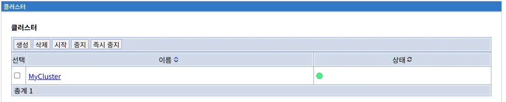
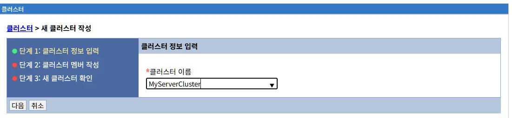
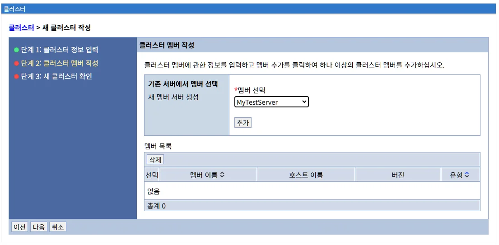
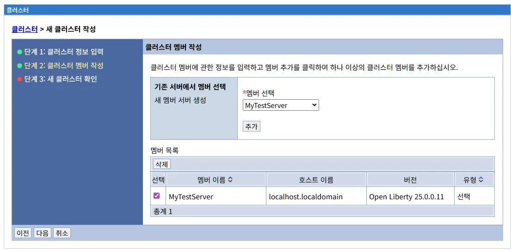
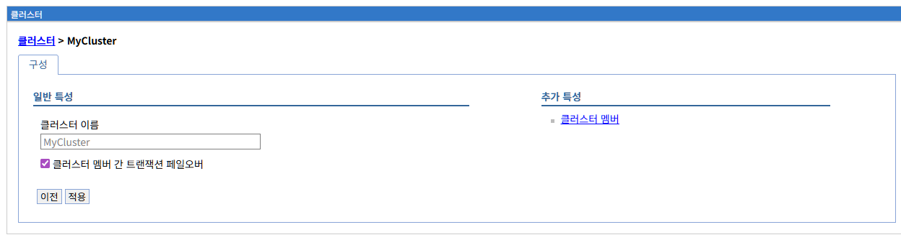

# 클러스터 관리

## 개요

클러스터 메뉴는 LibriX 관리콘솔에서 여러 애플리케이션 서버를 하나의 논리적 그룹으로 관리할 수 있는 기능을 제공합니다. 클러스터를 사용하면 여러 서버를 단일 단위로 관리하고, 고가용성과 확장성을 확보할 수 있습니다.

### LibriX와 Open Liberty/WebSphere Liberty

LibriX는 Open Liberty 및 WebSphere Liberty를 기반으로 하지만, 클러스터 관리 방식은 Liberty의 Collective Controller 방식과는 다릅니다. 대신 WebSphere Application Server Network Deployment (ND)의 NodeAgent 방식과 유사한 아키텍처를 사용합니다.

**WebSphere ND의 아키텍처**

WebSphere ND는 다음과 같은 계층적 관리 구조를 가집니다:

1. **Deployment Manager (DM)**: Cell의 중앙 관리 포인트
2. **NodeAgent**: 각 노드에서 실행되며 DM과 애플리케이션 서버 사이의 중개자 역할
3. **Application Server**: 실제 애플리케이션을 실행하는 서버 프로세스
4. **Cluster**: 동일한 애플리케이션을 실행하는 서버들의 논리적 그룹

**NodeAgent의 역할:**
- Deployment Manager의 관리 명령을 받아 해당 노드의 서버들에 전달
- 서버 시작/중지 등 생명주기 관리
- 서버 상태 모니터링 및 DM에 보고
- 구성 동기화 (DM에서 변경된 구성을 서버에 적용)

**LibriX의 접근 방식**

LibriX는 각 호스트에서 실행되는 **Agent 프로세스**를 통해 서버를 관리합니다. 이는 WebSphere ND의 NodeAgent와 유사한 역할을 수행합니다:

- **LibriX 관리콘솔**: WebSphere ND의 Deployment Manager와 유사한 중앙 관리 인터페이스
- **LibriX Agent**: 각 호스트에서 실행되며, WebSphere ND의 NodeAgent와 유사한 역할
  - 관리콘솔의 명령을 받아 해당 호스트의 Liberty 서버에 전달
  - 서버 프로세스의 시작/중지/재시작 수행
  - 서버 상태를 관리콘솔에 보고
  - 구성 파일 동기화 및 배포
- **Liberty 서버**: 실제 애플리케이션을 실행하는 Open Liberty 프로세스
- **클러스터**: 논리적으로 그룹화된 Liberty 서버들

**Liberty Collective와의 차이점**

Liberty의 Collective Controller 방식과 LibriX의 차이:

| 구분 | Liberty Collective | LibriX (NodeAgent 방식) |
|------|-------------------|------------------------|
| **아키텍처** | Collective Controller가 멤버 서버를 직접 관리 | Agent가 중개자 역할 수행 |
| **서버 시작** | Controller가 SSH/RPC로 직접 서버 시작 | Agent가 로컬에서 서버 시작 |
| **구성** | `clusterMember-1.0` 기능 필요 | Agent가 구성 관리, 서버는 표준 Liberty |
| **통신** | HTTPS/JMX 기반 | Agent와 관리콘솔 간 통신 |
| **인증** | RPC 인증 정보 필요 | Agent 인증 정보 사용 |

**왜 NodeAgent 방식을 사용하는가?**

LibriX가 Collective 대신 NodeAgent 방식을 채택한 이유:

1. **간단한 서버 구성**: Liberty 서버에 `clusterMember-1.0`이나 특별한 기능이 필요 없음
2. **안정적인 관리**: Agent가 로컬에서 서버를 제어하므로 네트워크 문제에 강함
3. **보안**: SSH/RPC 설정 없이도 안전한 서버 관리 가능
4. **확장성**: 각 호스트의 Agent가 독립적으로 동작하여 대규모 환경에 유리
5. **호환성**: 표준 Liberty 서버를 그대로 사용 가능

**예시: 서버 시작 흐름**

```
사용자 → LibriX 관리콘솔 → "클러스터 시작" 클릭
              ↓
    관리콘솔 → Host1 Agent → Liberty Server1 시작
              ↓
    관리콘솔 → Host2 Agent → Liberty Server2 시작
              ↓
           결과 보고
```

이러한 방식은 WebSphere ND 사용자에게 익숙한 관리 모델을 제공하면서도, Liberty의 경량성과 성능을 그대로 활용할 수 있습니다.

### 클러스터의 역할

클러스터는 다음과 같은 주요 기능을 제공합니다:

**고가용성 (High Availability)**

여러 서버가 동일한 애플리케이션을 실행하여, 하나의 서버에 장애가 발생하더라도 다른 서버가 요청을 처리할 수 있습니다.

**확장성 (Scalability)**

트래픽 증가에 따라 클러스터에 서버를 추가하여 처리 용량을 확장할 수 있습니다. 반대로 트래픽이 감소하면 서버를 제거하여 리소스를 절약할 수 있습니다.

**로드 밸런싱 (Load Balancing)**

웹서버 플러그인이나 로드 밸런서와 연동하여 클러스터 멤버들에게 요청을 균등하게 분산합니다.

**중앙 관리**

클러스터의 모든 멤버 서버를 하나의 단위로 관리할 수 있어 운영 효율성이 향상됩니다.

**세션 복제**

클러스터 멤버 간 세션 데이터를 공유하여, 사용자가 어떤 서버로 접속하더라도 동일한 세션을 유지할 수 있습니다.

### WebSphere ND 아키텍처와 클러스터

WebSphere Application Server Network Deployment의 클러스터 관리 구조는 다음과 같습니다:

**Cell (셀)**

하나 이상의 노드를 단일 관리 도메인으로 묶는 최상위 논리적 그룹입니다. Cell은 하나의 Deployment Manager에 의해 관리됩니다.

**Deployment Manager (DM)**

Cell의 중앙 관리 서버로, 모든 노드와 서버를 관리하는 단일 지점입니다. 웹 기반 관리 콘솔을 제공하며, 관리자는 이를 통해 전체 환경을 제어합니다.

**Node (노드)**

관리되는 애플리케이션 서버들의 논리적 그룹으로, 일반적으로 하나의 물리적 머신을 나타냅니다. 하지만 하나의 물리적 머신에 여러 노드를 생성할 수도 있습니다.

**NodeAgent (노드 에이전트)**

각 노드에서 실행되는 관리 프로세스로, Deployment Manager와 애플리케이션 서버 사이의 중개자 역할을 합니다:

- DM으로부터 관리 명령을 받아 해당 노드의 서버에 전달
- 서버 시작, 중지, 재시작 등 생명주기 관리
- 서버 상태를 모니터링하고 DM에 보고
- DM에서 변경된 구성을 서버에 동기화
- 노드의 서버를 시작하려면 NodeAgent가 먼저 실행 중이어야 함

**Application Server (애플리케이션 서버)**

실제 애플리케이션을 실행하는 Java 프로세스입니다. 각 서버는 자체 JVM에서 실행되며 고유한 프로세스 ID를 가집니다.

**Cluster (클러스터)**

동일한 애플리케이션을 실행하는 여러 애플리케이션 서버들의 논리적 그룹입니다. 클러스터는 다음을 제공합니다:
- 워크로드 분산 (Load Balancing)
- 고가용성 (High Availability)
- 장애 조치 (Failover)

### LibriX의 NodeAgent 기반 아키텍처

LibriX는 WebSphere ND와 유사한 계층 구조를 사용하지만, Liberty 서버를 관리합니다:

**LibriX 관리콘솔 ≈ Deployment Manager**

웹 기반 중앙 관리 인터페이스로, 모든 호스트와 서버를 관리합니다.

**LibriX Agent ≈ NodeAgent**

각 호스트에서 실행되는 Agent 프로세스:
- 관리콘솔의 명령을 받아 Liberty 서버에 전달
- 서버 시작, 중지, 재시작 수행
- 서버 상태 모니터링 및 보고
- 구성 파일 배포 및 동기화
- 로컬 파일 시스템 접근 및 관리

**Liberty Server ≈ Application Server**

Open Liberty 프로세스로 애플리케이션을 실행합니다.

**클러스터**

논리적으로 그룹화된 Liberty 서버들의 집합입니다.

**주요 차이점**

| WebSphere ND | LibriX |
|--------------|---------|
| Deployment Manager | LibriX 관리콘솔 |
| NodeAgent | LibriX Agent |
| WAS Application Server | Liberty Server |
| Cell | 관리 도메인 |
| 복잡한 설정 파일 | 웹 UI 기반 관리 |
| 무거운 DM | 경량 관리콘솔 |

## 클러스터 목록

서버 메뉴의 "클러스터" 링크를 선택하면 현재 LibriX에 정의된 모든 클러스터의 목록이 표시됩니다.



### 클러스터 목록 화면 구성

클러스터 목록 화면은 다음과 같은 정보를 제이블 형태로 제공합니다:

#### 테이블 컬럼

**선택**

체크박스를 사용하여 작업을 수행할 클러스터를 선택할 수 있습니다. 여러 클러스터를 동시에 선택하여 일괄 작업을 수행할 수 있습니다.

**이름**

클러스터의 고유한 이름입니다. 클러스터 이름을 클릭하면 해당 클러스터의 상세 정보 페이지로 이동합니다.

예시: `MyCluster`

클러스터 이름은 Liberty의 `clusterMember` 구성에서 `clusterName` 속성으로 사용됩니다.

**상태**

클러스터의 현재 상태를 나타내는 시각적 표시등입니다.

- **🟢 녹색 (실행 중)**: 클러스터의 모든 멤버가 정상적으로 실행 중입니다.
- **🟡 노란색 (부분 실행)**: 클러스터의 일부 멤버만 실행 중이거나 일부 멤버에 문제가 있습니다.
- **🔴 빨간색 (중지)**: 클러스터의 모든 멤버가 중지되었거나 심각한 문제가 있습니다.
- **⚪ 회색 (알 수 없음)**: 클러스터의 상태를 확인할 수 없습니다.

상태 표시는 클러스터 멤버 서버들의 개별 상태를 종합하여 표시됩니다.

### 클러스터 관리 탭

화면 상단에는 클러스터를 관리하기 위한 여러 탭이 제공됩니다:

#### 생성 탭

새로운 클러스터를 생성합니다.

클러스터를 생성하려면:
1. "생성" 탭을 클릭합니다.
2. 클러스터 생성 화면이 표시됩니다.
3. 클러스터 이름과 기타 설정을 입력합니다.
4. 클러스터에 포함할 애플리케이션 서버를 선택합니다.

#### 삭제 탭

선택한 클러스터를 LibriX에서 제거합니다.

삭제 작업을 수행하려면:
1. 목록에서 삭제할 클러스터의 체크박스를 선택합니다.
2. "삭제" 탭을 클릭합니다.
3. 확인 대화상자가 나타나면 삭제를 확인합니다.

**주의사항:**
- 클러스터를 삭제해도 클러스터에 속한 멤버 서버는 삭제되지 않습니다.
- 멤버 서버는 독립적인 서버로 계속 존재하며, 클러스터 구성만 제거됩니다.
- 클러스터를 삭제하기 전에 클러스터를 참조하는 웹서버 플러그인 설정을 확인해야 합니다.

#### 시작 탭

선택한 클러스터의 모든 멤버 서버를 일괄적으로 시작합니다.

시작 작업을 수행하려면:
1. 목록에서 시작할 클러스터의 체크박스를 선택합니다.
2. "시작" 탭을 클릭합니다.
3. 클러스터의 모든 멤버 서버가 순차적으로 시작됩니다.

**시작 순서:**
- LibriX는 클러스터 멤버를 정의된 순서대로 시작합니다.
- 각 멤버 서버의 시작 완료를 기다린 후 다음 서버를 시작할 수 있습니다 (구성에 따라).
- 시작 중인 서버의 상태는 실시간으로 업데이트됩니다.

#### 중지 탭

선택한 클러스터의 모든 멤버 서버를 일괄적으로 중지합니다.

중지 작업을 수행하려면:
1. 목록에서 중지할 클러스터의 체크박스를 선택합니다.
2. "중지" 탭을 클릭합니다.
3. 클러스터의 모든 멤버 서버가 정상적으로 종료됩니다.

**중지 특징:**
- Graceful Shutdown: 진행 중인 요청을 완료한 후 서버를 종료합니다.

#### 즉시 중지 탭

선택한 클러스터의 모든 멤버 서버를 즉시 강제로 중지합니다.

즉시 중지 작업을 수행하려면:
1. 목록에서 즉시 중지할 클러스터의 체크박스를 선택합니다.
2. "즉시 중지" 탭을 클릭합니다.
3. 확인 대화상자가 나타나면 즉시 중지를 확인합니다.

**주의사항:**
- 즉시 중지는 진행 중인 요청을 강제로 종료합니다.
- 데이터 손실이나 트랜잭션 롤백이 발생할 수 있습니다.
- 긴급한 상황이나 서버가 응답하지 않을 때만 사용해야 합니다.
- 정상적인 운영 중에는 "중지" 탭을 사용하는 것이 권장됩니다.

### 클러스터 목록 정보

화면 하단에는 현재 등록된 클러스터의 총 개수가 표시됩니다.

예시: `총계 1` - 현재 1개의 클러스터가 등록되어 있음

## 클러스터 생성

"생성" 탭을 클릭하면 새로운 클러스터를 생성하는 프로세스가 시작됩니다. 클러스터 생성은 3단계로 구성되어 있습니다.

### 단계 1: 클러스터 정보 입력

첫 번째 단계에서는 클러스터의 기본 정보를 입력합니다.



#### 클러스터 정보 입력

**클러스터 이름** (필수)

새로 생성할 클러스터의 고유한 이름을 입력합니다 (예: MyServerCluster).

클러스터 이름은 LibriX 시스템 내에서 유일해야 하며, 다음 용도로 사용됩니다:
- 관리콘솔에서 클러스터 식별
- 웹서버 플러그인 구성에서 클러스터 참조
- 로그 및 모니터링 도구에서 클러스터 구분

**명명 규칙 권장사항:**
- 클러스터의 용도나 애플리케이션을 나타내는 명확한 이름 사용
- 환경(프로덕션, 개발, 테스트)을 포함하는 것을 고려
- 특수문자 사용 자제 (영문자, 숫자, 하이픈, 언더스코어 권장)
- 공백 사용 자제

**좋은 예시:**
- `ProductionWebCluster`
- `Dev-AppServer-Cluster`
- `ECommerce_Cluster_Prod`
- `Customer_Portal_Test`

**나쁜 예시:**
- `Cluster1` (의미 불명확)
- `test` (환경만 표시, 용도 불명)
- `My Server Cluster!` (공백 및 특수문자 포함)

#### WebSphere ND와의 비교

WebSphere ND에서는 Deployment Manager 콘솔에서 다음과 같이 클러스터를 생성합니다:

1. Servers → Clusters → WebSphere application server clusters 선택
2. "New" 버튼 클릭
3. 클러스터 이름 입력
4. 메모리 간 세션 복제 옵션 선택
5. 첫 번째 클러스터 멤버 정의 (서버 이름, 노드, 가중치 등)

LibriX는 이 과정을 단계별로 나누어 더 직관적으로 제공합니다. 1단계에서는 클러스터 이름만 입력하고, 2단계에서 멤버를 선택하는 방식으로 단순화되었습니다.

#### 다음 단계로 이동

클러스터 이름을 입력한 후:
- **다음**: 2단계로 이동하여 클러스터에 포함할 멤버를 선택합니다
- **취소**: 클러스터 생성 프로세스를 취소하고 클러스터 목록 화면으로 돌아갑니다

### 단계 2: 클러스터 멤버 작성

두 번째 단계에서는 클러스터에 포함할 애플리케이션 서버를 선택합니다.



#### 클러스터 멤버에 관한 정보

화면 상단에는 "클러스터 멤버에 관한 정보를 입력하고 멤버 추가를 클릭하여 하나 이상의 클러스터 멤버를 추가하십시오."라는 안내 메시지가 표시됩니다.

클러스터는 최소 1개 이상의 멤버 서버를 포함해야 합니다. 일반적으로 고가용성을 위해 2개 이상의 멤버를 구성하는 것이 권장됩니다.

#### 기존 서버에서 멤버 선택

왼쪽 영역은 기존 애플리케이션 서버에서 클러스터 멤버를 선택하는 섹션입니다.

**새 멤버 서버 생성**

이 옵션을 선택하여 생성된 애플리케이션 서버를 클러스터에 추가할 수 있습니다. 

**멤버 선택** (필수)

드롭다운 메뉴에서 클러스터에 추가할 기존 애플리케이션 서버를 선택합니다 (예: MyTestServer).

드롭다운 목록에는 다음 조건을 만족하는 서버만 표시됩니다:
- LibriX에 등록된 애플리케이션 서버
- 현재 다른 클러스터에 속하지 않은 서버
- 정상적으로 구성된 서버

**추가 버튼**

선택한 서버를 클러스터 멤버 목록에 추가합니다. "추가" 버튼을 클릭하면 선택한 서버가 아래의 "멤버 목록" 테이블에 추가됩니다.

#### 멤버 목록

오른쪽 영역은 클러스터에 추가된 멤버 서버의 목록을 보여주는 테이블입니다.

**초기 상태**


멤버를 추가하기 전에는 "없음"으로 표시되며, 총계는 0입니다.

**멤버 추가 후**



멤버를 추가하면 다음 정보가 테이블에 표시됩니다:

**선택**

체크박스를 사용하여 제거하려는 멤버를 선택할 수 있습니다. 멤버를 선택한 후 삭제 기능을 사용하여 클러스터 멤버 목록에서 제거할 수 있습니다.

**멤버 이름**

클러스터에 추가된 애플리케이션 서버의 이름입니다 (예: MyTestServer).

**호스트 이름**

서버가 실행되는 호스트의 도메인 이름 또는 IP 주소입니다 (예: localhost.localdomain).

이 정보는 웹서버 플러그인이 요청을 라우팅할 때 사용되며, 클러스터 멤버 간 통신에도 활용됩니다.

**버전**

서버에서 실행 중인 Open Liberty 또는 WebSphere Liberty의 버전 정보입니다 (예: Open Liberty 25.0.0.11).

**중요**: 클러스터의 모든 멤버는 호환 가능한 버전을 사용해야 합니다. 서로 다른 메이저 버전을 혼용하면 예기치 않은 문제가 발생할 수 있습니다.

**유형**

서버의 상태나 유형을 나타냅니다 (예: 선택).

이 필드는 서버가 클러스터에 추가되었음을 표시합니다.

**총계**

클러스터에 추가된 멤버의 총 개수가 표시됩니다 (예: 총계 1).

#### WebSphere ND와의 비교

**WebSphere ND의 클러스터 멤버 추가:**

1. 클러스터 생성 시 첫 번째 멤버를 함께 정의
   - 멤버 이름, 노드, 가중치 입력
   - 서버 템플릿 선택
   
2. 추가 멤버는 클러스터 생성 후 별도로 추가
   - Cluster → Members → New 선택
   - 기존 서버를 클러스터 멤버로 변환하거나
   - 새 멤버 서버 생성
   
3. 각 멤버에 대해 개별적으로 설정
   - JVM 설정
   - 포트 할당
   - 리소스 참조

**LibriX의 접근:**

- 기존 서버를 드롭다운에서 선택하여 간단히 추가
- 여러 멤버를 한 번에 추가 가능
- 서버 설정은 이미 완료된 상태 (서버 생성 시 구성)
- 직관적인 UI로 멤버 관리

#### 클러스터 멤버 추가 시 고려사항

**동일한 애플리케이션**

클러스터의 모든 멤버는 동일한 애플리케이션을 배포해야 합니다. 서로 다른 애플리케이션이나 버전을 배포하면 클러스터가 제대로 작동하지 않습니다.

**네트워크 연결**

클러스터 멤버 간에 네트워크 연결이 가능해야 합니다:
- 세션 복제를 위한 통신
- 로드 밸런서의 헬스 체크
- 관리 명령 전달

**리소스 균형**

각 멤버 서버는 유사한 하드웨어 리소스(CPU, 메모리)를 가지는 것이 좋습니다. 리소스가 크게 다르면 로드 밸런싱이 불균형하게 될 수 있습니다.

**포트 충돌**

동일한 호스트에 여러 멤버를 배치하는 경우, 각 서버는 고유한 포트를 사용해야 합니다:
- HTTP 포트
- HTTPS 포트
- 관리 포트
- JMX 포트

#### 멤버 제거

클러스터 멤버 목록에서 서버를 제거하려면:

1. 제거할 멤버의 체크박스를 선택합니다.
2. 삭제 버튼이나 제거 기능을 사용합니다.
3. 멤버가 목록에서 제거되면서 애플리케이션 서버도 삭제 됩니다.

#### 다음 단계로 이동

클러스터 멤버를 모두 추가한 후:

- **이전**: 1단계로 돌아가서 클러스터 이름을 수정할 수 있습니다
- **다음**: 3단계로 이동하여 입력한 정보를 최종 확인합니다
- **취소**: 클러스터 생성 프로세스를 취소하고 클러스터 목록 화면으로 돌아갑니다

### 단계 3: 새 클러스터 확인

세 번째 단계에서는 입력한 정보를 최종 확인하고 클러스터 생성을 완료합니다.


#### 확인 정보

이 단계에서는 이전 단계에서 입력한 모든 정보가 요약 테이블 형식으로 표시됩니다. 다음 정보들을 최종 확인할 수 있습니다:

화면 상단에는 "다음은 선택사항에 대한 요약입니다. 새 클러스터 작성을(를) 완료하려면 확인을 선택해 주십시오."라는 안내 메시지가 표시됩니다.

#### 요약 정보

| 옵션 | 값 |
|------|------|
| **클러스터 이름** | 생성할 클러스터의 이름 (예: MyServerCluster) |
| **멤버1** | 클러스터에 포함된 첫 번째 멤버 서버 정보<br>호스트=localhost.localdomain, 서버=MyTestServer |
| **멤버2** | 클러스터에 포함된 두 번째 멤버 서버 정보 (있는 경우) |
| **멤버N** | 추가 멤버 서버 정보 (있는 경우) |

각 멤버 정보는 다음 형식으로 표시됩니다:
- **호스트**: 서버가 실행되는 호스트의 도메인 이름
- **서버**: 애플리케이션 서버의 이름

예시: `호스트=localhost.localdomain, 서버=MyTestServer`

#### 클러스터 생성 완료

확인이 끝나면 화면 하단의 버튼을 사용하여 클러스터 생성을 완료하거나 취소할 수 있습니다:

**이전**

2단계로 돌아가서 멤버 목록을 수정할 수 있습니다. 이미 입력한 값들은 유지됩니다.

**완료**

입력한 정보로 클러스터를 생성합니다. 완료 버튼을 클릭하면:

1. 클러스터가 LibriX에 등록됩니다.
2. 각 멤버 서버의 구성이 업데이트됩니다.
3. 변경사항 확인 메시지가 표시됩니다.

**취소**

클러스터 생성 프로세스를 취소하고 클러스터 목록 화면으로 돌아갑니다. 입력한 모든 정보는 저장되지 않습니다.

#### 클러스터 생성 완료 후 변경사항 확인

클러스터 생성이 완료되면 화면 상단에 변경사항 확인 메시지가 표시됩니다:

**메시지**

"로컬 구성에 변경 사항이 적용되었습니다. 다음을 수행할 수 있습니다."

이 메시지는 클러스터 구성이 로컬에 저장되었으며, 아직 모든 서버에 반영되지 않았음을 나타냅니다. 다음 두 가지 옵션을 선택할 수 있습니다:

- **저장**: 변경사항을 즉시 모든 관련 서버에 적용합니다.
- **저장하거나 버리기 전 변경사항 검토**: 변경된 내용을 먼저 검토한 후 저장 또는 취소를 결정합니다.

#### 변경사항 검토

"저장하거나 버리기 전 변경사항 검토" 링크를 클릭하면 변경사항 검토 화면이 표시됩니다.

검토 화면에서는 클러스터 생성으로 인해 추가되거나 수정된 파일 목록을 확인할 수 있습니다:

**변경된 파일 예시:**
- `/clusters/[클러스터명]/cluster.json`: 클러스터 정의 파일
- `/hosts/[호스트명]/servers/[서버명]/server.json`: 각 멤버 서버의 구성 파일
- `/hosts/[호스트명]/servers/[서버명]/cluster-membership.xml`: 클러스터 멤버십 정보

각 파일의 상태는 "추가됨" 또는 "수정됨"으로 표시됩니다.

다음 버튼을 사용하여 변경사항을 처리할 수 있습니다:

- **저장**: 변경사항을 모든 서버에 적용하고 저장합니다.
- **버리기**: 변경사항을 취소하고 이전 상태로 되돌립니다. 새로 생성된 클러스터가 삭제됩니다.
- **이전**: 클러스터 목록 화면으로 돌아갑니다. 변경사항은 저장되지 않은 상태로 유지됩니다.

#### 클러스터 생성 후 다음 단계

클러스터가 성공적으로 생성되면:

1. **클러스터 멤버 확인**
   - 클러스터 목록에서 새로 생성된 클러스터를 확인합니다.
   - 클러스터 이름을 클릭하여 상세 정보를 봅니다.
   - 모든 멤버 서버가 정상적으로 표시되는지 확인합니다.

2. **클러스터 시작**
   - 클러스터 목록에서 클러스터를 선택합니다.
   - "시작" 탭을 클릭하여 모든 멤버 서버를 일괄 시작합니다.
   - 또는 각 멤버 서버를 개별적으로 시작할 수 있습니다.

3. **웹서버 연동** (선택)
   - 웹서버 플러그인을 생성하여 클러스터와 연동합니다.
   - 플러그인 구성 파일(plugin-cfg.xml)에 클러스터 정보가 포함됩니다.
   - 웹서버를 통해 클러스터로 트래픽이 분산됩니다.

4. **애플리케이션 배포**
   - 클러스터의 모든 멤버에 동일한 애플리케이션을 배포합니다.
   - LibriX는 클러스터 단위로 애플리케이션 배포를 지원합니다.

5. **모니터링 및 테스트**
   - 클러스터 상태를 모니터링합니다.
   - 로드 밸런싱이 정상적으로 작동하는지 테스트합니다.
   - 장애 조치(Failover) 시나리오를 테스트합니다.

#### WebSphere ND와의 비교

**WebSphere ND 클러스터 생성 완료:**

1. 클러스터 생성 후 Deployment Manager에 저장
2. 구성 변경사항을 각 NodeAgent에 동기화
3. NodeAgent를 통해 멤버 서버에 구성 적용
4. 각 멤버 서버를 개별적으로 시작해야 함

**LibriX 클러스터 생성 완료:**

1. 클러스터 생성 및 LibriX 관리콘솔에 저장
2. LibriX Agent를 통해 각 호스트에 구성 배포
3. 변경사항 검토 및 확인 프로세스
4. 클러스터 단위로 일괄 시작 가능

LibriX는 WebSphere ND의 복잡한 동기화 과정을 자동화하고, 더 직관적인 확인 프로세스를 제공합니다.

## 클러스터 페일오버 정책

클러스터 목록에서 클러스터 이름을 클릭한 후 "구성" 탭을 선택하면 클러스터의 페일오버(Failover) 정책을 설정할 수 있습니다.



### 페일오버 정책 화면

페일오버 정책 화면은 클러스터 멤버 간 트랜잭션 복구(Transaction Peer Recovery)를 통해 고가용성을 제공하는 설정을 관리합니다.

#### 일반 특성

**클러스터 이름**

현재 구성 중인 클러스터의 이름이 표시됩니다 (예: MyCluster).

이 필드는 읽기 전용이며, 어떤 클러스터의 페일오버 정책을 구성하고 있는지 확인할 수 있습니다.

**클러스터 멤버 간 트랜잭션 페일오버**

체크박스를 선택하면 클러스터 멤버 간 트랜잭션 페일오버(Transaction Peer Recovery)를 활성화합니다.

**기능:**
- 서버 장애 시 중단된 트랜잭션을 다른 멤버 서버가 자동으로 복구
- 리소스 락(Resource Lock) 자동 해제
- 2-Phase Commit (XA) 트랜잭션의 무결성 보장
- 클러스터 환경에서 안전한 트랜잭션 관리

### Transaction Peer Recovery란?

Open Liberty의 Transaction Peer Recovery는 클러스터 환경에서 서버 장애 발생 시 중단된 트랜잭션을 자동으로 복구하는 기능입니다.

#### 작동 원리

**1. 피어 모니터링**

```
클러스터 멤버 서버들이 서로를 지속적으로 모니터링:

Server1 ←→ Server2 ←→ Server3
   ↓         ↓         ↓
 정상      정상      정상
```

각 서버는 동일한 `recoveryGroup`에 속한 다른 서버들을 모니터링하며, 서버가 삭제되거나 장애가 발생하면 이를 감지합니다.

**2. 장애 감지 및 복구**

```
Server1이 장애 발생:

Server1 (장애)
   ↓
Server2가 감지
   ↓
Server2가 Server1의 트랜잭션 로그 접근
   ↓
중단된 트랜잭션 복구
   ↓
리소스 락 해제
```

장애가 발생한 서버의 트랜잭션 로그를 사용하여 중단된 트랜잭션을 완료하거나 롤백합니다.

#### 구성 방법

페일오버 정책을 활성화하면 각 클러스터 멤버의 `server.xml`에 다음과 같은 구성이 자동으로 추가됩니다:

**server.xml 예시:**

```xml
<server>
  <featureManager>
    <feature>transaction-2.0</feature>
  </featureManager>
  
  <!-- 트랜잭션 복구 구성 -->
  <transaction 
    recoveryGroup="clusters:MyCluster"
    recoveryIdentity="hosts:localhost.localdomain:servers:LibertyServer001"/>
</server>
```

**구성 속성 설명:**

**recoveryGroup**
- 형식: `clusters:<클러스터명>`
- 의미: 동일한 복구 그룹에 속한 서버들을 식별
- 예시: `clusters:MyCluster`
- 역할: 같은 recoveryGroup 값을 가진 서버들끼리 서로를 모니터링하고 필요 시 복구 수행

**recoveryIdentity**
- 형식: `hosts:<호스트명>:servers:<서버명>`
- 의미: 클러스터 내에서 서버를 고유하게 식별
- 예시: `hosts:localhost.localdomain:servers:LibertyServer001`
- 역할: 복구 대상 서버를 정확히 식별하고 트랜잭션 로그를 구분

**클러스터 멤버별 구성 예시:**

```xml
<!-- Server1 -->
<transaction 
  recoveryGroup="clusters:MyCluster"
  recoveryIdentity="hosts:host1.example.com:servers:Server1"/>

<!-- Server2 -->
<transaction 
  recoveryGroup="clusters:MyCluster"
  recoveryIdentity="hosts:host2.example.com:servers:Server2"/>

<!-- Server3 -->
<transaction 
  recoveryGroup="clusters:MyCluster"
  recoveryIdentity="hosts:host3.example.com:servers:Server3"/>
```

모든 멤버는 동일한 `recoveryGroup`을 공유하지만, 각각 고유한 `recoveryIdentity`를 가집니다.

### 트랜잭션 로그 관리

Transaction Peer Recovery가 작동하려면 클러스터의 모든 멤버가 서로의 트랜잭션 로그에 접근할 수 있어야 합니다.

#### 트랜잭션 로그 저장 방식

**1. 공유 파일 시스템 (권장)**

```xml
<transaction 
  recoveryGroup="clusters:MyCluster"
  recoveryIdentity="hosts:host1:servers:Server1"
  transactionLogDirectory="/shared/tranlog/Server1"/>
```

**요구사항:**
- NFS, CIFS 등 공유 스토리지 사용
- 모든 클러스터 멤버가 읽기/쓰기 접근 가능
- POSIX 파일 락킹 지원

**주의사항:**
- 데이터센터를 넘어가는 공유 파일 시스템은 지원되지 않음
- POSIX 락킹 시맨틱 구현의 어려움으로 인한 제한

**Kubernetes 환경:**

```yaml
apiVersion: v1
kind: PersistentVolumeClaim
metadata:
  name: tranlog-pvc
spec:
  accessModes:
    - ReadWriteMany  # RWX 모드
  resources:
    requests:
      storage: 10Gi
```

**2. 데이터베이스 저장 (대안)**

```xml
<transaction 
  recoveryGroup="clusters:MyCluster"
  recoveryIdentity="${HOSTNAME}${wlp.server.name}"
  transactionLogDBTableSuffix="${HOSTNAME}${wlp.server.name}">
  
  <dataSource transactional="false">
    <jdbcDriver libraryRef="postgresql"/>
    <properties 
      databaseName="tranlog_db"
      serverName="db.example.com"
      portNumber="5432"
      user="tranlog_user"
      password="tranlog_pass"/>
  </dataSource>
</transaction>
```

**장점:**
- 데이터센터 간 복제 가능
- 높은 가용성
- 중앙 집중식 관리

**주의사항:**
- 데이터베이스 성능이 트랜잭션 처리 성능에 영향
- 데이터베이스 장애 시 트랜잭션 복구 불가능

#### 트랜잭션 로그 디렉토리 구조

**공유 파일 시스템 예시:**

```
/shared/tranlog/
├── Server1/
│   ├── tranlog/
│   │   ├── log1
│   │   └── log2
│   └── partnerlog/
├── Server2/
│   ├── tranlog/
│   └── partnerlog/
└── Server3/
    ├── tranlog/
    └── partnerlog/
```

각 서버는 자신의 디렉토리에만 쓰기를 하지만, 다른 서버의 디렉토리는 읽기 가능해야 합니다.

### 페일오버 시나리오

#### 시나리오 1: 서버 장애 중 트랜잭션 복구

```
1. 사용자 요청 → Server1에서 XA 트랜잭션 시작
   - 데이터베이스 업데이트
   - JMS 메시지 전송
   - 트랜잭션 로그 기록

2. Server1 장애 발생 (하드웨어 고장)
   - 트랜잭션이 PREPARED 상태로 중단
   - 데이터베이스와 JMS에 리소스 락 유지

3. Server2가 Server1 장애 감지
   - 주기적인 피어 모니터링으로 감지
   - Server1의 트랜잭션 로그 접근

4. Server2가 중단된 트랜잭션 복구
   - 트랜잭션 로그 분석
   - PREPARED 상태의 트랜잭션 확인
   - 데이터베이스와 JMS에 COMMIT 또는 ROLLBACK

5. 리소스 락 해제
   - 다른 트랜잭션이 해당 리소스 사용 가능
   - 시스템 정상화
```

#### 시나리오 2: 계획된 서버 중지

```
1. 관리자가 Server1 중지 요청

2. Graceful Shutdown 시작
   - 새 요청 거부
   - 진행 중인 트랜잭션 완료 대기

3. 모든 트랜잭션 완료 확인
   - 트랜잭션 로그 최종 동기화
   - 클린한 상태로 종료

4. Server1 중지 완료
   - 복구가 필요한 트랜잭션 없음
   - 피어 서버의 복구 작업 불필요
```

#### 시나리오 3: 네트워크 분리 (Split-Brain)

```
1. 네트워크 파티션 발생
   - Server1과 Server2, Server3 간 통신 단절
   - Server1은 정상 동작 중
   - Server2, Server3도 정상 동작 중

2. Server2, Server3가 Server1을 장애로 인식
   - 하지만 Server1의 트랜잭션 로그에 접근 시도
   - 트랜잭션 로그의 하트비트 확인

3. 하트비트가 최신인 경우
   - Server1이 여전히 활성 상태로 판단
   - 복구 작업 수행하지 않음
   - 네트워크 복구 대기

4. 네트워크 복구 후
   - 정상적인 피어 모니터링 재개
   - 복구 작업 없이 정상 운영 지속
```

### 모범 사례

**1. 공유 스토리지 구성**

```xml
<!-- 권장: 각 서버별 독립 디렉토리 -->
<transaction 
  recoveryGroup="clusters:ProductionCluster"
  recoveryIdentity="hosts:${HOSTNAME}:servers:${wlp.server.name}"
  transactionLogDirectory="/shared/tranlog/${HOSTNAME}/${wlp.server.name}"/>
```

**장점:**
- 서버별 트랜잭션 로그 격리
- 동적 서버 이름 지원
- 확장성 우수

**2. 데이터베이스 방식 선택 시**

```xml
<transaction 
  recoveryGroup="clusters:ProductionCluster"
  recoveryIdentity="${HOSTNAME}${wlp.server.name}"
  transactionLogDBTableSuffix="${HOSTNAME}${wlp.server.name}"
  recoverOnStartup="false">
  
  <dataSource transactional="false">
    <!-- JNDI로 데이터소스 참조 권장 -->
    <jdbcDriver libraryRef="dbDriver"/>
    <properties.postgresql 
      databaseName="${DB_NAME}"
      serverName="${DB_HOST}"
      portNumber="${DB_PORT}"
      user="${DB_USER}"
      password="${DB_PASSWORD}"/>
  </dataSource>
</transaction>
```

**주의사항:**
- `transactional="false"` 필수 (순환 참조 방지)
- 데이터베이스 연결 풀 튜닝 필요
- `recoverOnStartup="false"` 설정으로 시작 시간 단축

**3. Kubernetes 환경 설정**

```yaml
# StatefulSet 사용
apiVersion: apps/v1
kind: StatefulSet
metadata:
  name: liberty-cluster
spec:
  serviceName: "liberty"
  replicas: 3
  template:
    spec:
      containers:
      - name: liberty
        env:
        - name: HOSTNAME
          valueFrom:
            fieldRef:
              fieldPath: metadata.name
        volumeMounts:
        - name: tranlog
          mountPath: /shared/tranlog
  volumeClaimTemplates:
  - metadata:
      name: tranlog
    spec:
      accessModes: [ "ReadWriteMany" ]
      resources:
        requests:
          storage: 10Gi
```

**4. 모니터링 및 로그**

```
# 트랜잭션 복구 시작 로그
[AUDIT] WTRN0108I: Server with identity host1:Server1 is monitoring its peers for Transaction Peer Recovery

# 피어 장애 감지 로그
[AUDIT] WTRN0133I: Peer recovery processing for server host2:Server2 has started

# 복구 완료 로그
[AUDIT] WTRN0134I: Peer recovery processing for server host2:Server2 has completed
```

**모니터링 항목:**
- 복구 그룹 멤버십 상태
- 트랜잭션 로그 크기
- 복구 작업 빈도
- 복구 소요 시간

**5. 테스트 시나리오**

정기적으로 다음 시나리오를 테스트하세요:

```bash
# 1. 서버 강제 종료 테스트
kill -9 <server-pid>

# 2. 트랜잭션 로그 확인
ls -lh /shared/tranlog/Server1/tranlog/

# 3. 복구 로그 확인
grep "WTRN0133I\|WTRN0134I" /logs/messages.log

# 4. 리소스 락 해제 확인
# 데이터베이스에서 락 상태 조회
SELECT * FROM pg_locks WHERE NOT granted;
```

### 제약사항 및 주의사항

**1. 공유 파일 시스템 제한**

- 데이터센터 간 공유 파일 시스템은 **지원되지 않음**
- POSIX 락킹이 제대로 구현되지 않은 파일 시스템 사용 불가
- 단일 데이터센터 내에서만 공유 스토리지 사용 권장

**2. 리소스 접근 권한**

복구를 수행하는 서버는 장애 서버와 동일한 리소스에 접근할 수 있어야 합니다:

```
Server1의 트랜잭션:
- Database A (xa/xa-pool-1)
- JMS Queue B (jms/queue-1)

Server2가 복구하려면:
- Database A 접근 가능 (동일한 JNDI 이름, 동일한 자격증명)
- JMS Queue B 접근 가능 (동일한 JNDI 이름, 동일한 자격증명)
```

**3. InstantOn 사용 시**

Open Liberty InstantOn을 사용하는 경우 추가 제약사항이 있습니다:

```xml
<!-- InstantOn과 함께 사용 시 -->
<transaction 
  recoveryGroup="peer-group-name"
  recoveryIdentity="${HOSTNAME}${wlp.server.name}"
  recoverOnStartup="false"/>
```

체크포인트 전에 트랜잭션이 시작되면 안 됩니다. `loadOnStartup` servlet이나 초기 시작 코드에서 트랜잭션을 시작하지 마세요.

**4. 성능 고려사항**

- 피어 모니터링 오버헤드: 각 서버가 주기적으로 다른 서버 상태 확인
- 트랜잭션 로그 I/O: 공유 스토리지의 성능이 중요
- 복구 처리 시간: 대량의 중단된 트랜잭션이 있을 경우 복구에 시간 소요

### 페일오버 설정 저장

페일오버 정책 설정을 완료한 후:

**이전**

클러스터 목록 화면으로 돌아갑니다. 변경사항은 저장되지 않습니다.

**적용**

변경사항을 저장하고 클러스터의 모든 멤버에 적용합니다.

적용 버튼을 클릭하면:
1. 각 멤버 서버의 `server.xml`에 `<transaction>` 요소가 추가/업데이트됩니다
2. `recoveryGroup`과 `recoveryIdentity` 속성이 설정됩니다
3. 서버 재시작 후 Transaction Peer Recovery가 활성화됩니다
4. 변경사항 확인 메시지가 표시됩니다

**주의사항:**
- Transaction Peer Recovery 활성화 후 서버 재시작이 필요합니다
- 공유 스토리지 또는 데이터베이스 구성이 사전에 완료되어 있어야 합니다
- 모든 클러스터 멤버에 동일한 트랜잭션 리소스 접근 권한이 있어야 합니다

### WebSphere ND와의 비교

**WebSphere ND Transaction Recovery:**

```
특징:
- 복잡한 Transaction Service 구성
- Deployment Manager 기반 중앙 관리
- 파일 시스템 또는 데이터베이스 로그
- Recovery Manager 컴포넌트

구성 방법:
- Administrative Console에서 설정
- Cell → Transaction Service 구성
- Recovery Log 위치 지정
- Peer Recovery 정책 설정
```

**Liberty (LibriX) Transaction Peer Recovery:**

```
특징:
- 간단한 server.xml 구성
- recoveryGroup 기반 피어 복구
- 자동 피어 모니터링
- 경량 구현

구성 방법:
- server.xml의 <transaction> 요소
- recoveryGroup과 recoveryIdentity 속성만 설정
- 자동으로 피어 모니터링 시작
- 추가 관리 컴포넌트 불필요
```

### 관련 Liberty 문서

- [Transaction Service](https://openliberty.io/docs/latest/transaction-service.html)
- [Transaction Configuration Reference](https://openliberty.io/docs/latest/reference/config/transaction.html)
- [Distributed Transactions](https://openliberty.io/docs/latest/data-persistence-jpa.html#_transaction_handling)

### 트러블슈팅

**문제 1: 피어 복구가 시작되지 않음**

```
# 로그 확인
grep "WTRN0108I" /logs/messages.log

# 기대 로그
[AUDIT] WTRN0108I: Server with identity host1:Server1 is monitoring its peers
```

**원인:**
- recoveryGroup 또는 recoveryIdentity 미설정
- transaction-2.0 feature 누락

**해결:**
```xml
<featureManager>
  <feature>transaction-2.0</feature>
</featureManager>

<transaction 
  recoveryGroup="clusters:MyCluster"
  recoveryIdentity="hosts:${HOSTNAME}:servers:${wlp.server.name}"/>
```

**문제 2: 트랜잭션 로그 접근 실패**

```
# 오류 로그
[ERROR] WTRN0046E: Unable to access transaction log files
```

**원인:**
- 공유 스토리지 마운트 실패
- 파일 권한 문제
- 네트워크 문제

**해결:**
```bash
# 파일 시스템 확인
df -h /shared/tranlog
mount | grep tranlog

# 권한 확인
ls -ld /shared/tranlog
chmod 755 /shared/tranlog

# Liberty 사용자에게 쓰기 권한 부여
chown -R liberty:liberty /shared/tranlog
```

**문제 3: 복구가 완료되지 않음**

```
# 로그에서 복구 시작은 있지만 완료 없음
[AUDIT] WTRN0133I: Peer recovery processing has started
# WTRN0134I 로그 없음
```

**원인:**
- 리소스 접근 불가
- 데이터베이스 연결 실패
- 잘못된 자격증명

**해결:**
```xml
<!-- 모든 서버가 동일한 데이터소스 JNDI 이름 사용 -->
<dataSource id="xa-pool-1" jndiName="jdbc/myDB">
  <jdbcDriver libraryRef="postgresql"/>
  <properties.postgresql .../>
</dataSource>

<!-- 모든 서버가 동일한 자격증명 사용 -->
<authData id="dbAuth" user="dbuser" password="dbpass"/>
```
## 클러스터와 애플리케이션 서버

### 클러스터 멤버 추가

기존 애플리케이션 서버를 클러스터에 추가하는 방법:

1. 애플리케이션 서버 생성 후 클러스터 멤버에 추가
2. 서버 재시작 후 클러스터에 조인

### 클러스터 멤버 제거

클러스터에서 멤버 서버를 제거하는 방법:

1. 서버를 중지합니다.
2. 서버 구성에서 클러스터 멤버를 삭제 합니다.

**참고:** 멤버를 제거해도 서버 자체는 삭제되지 않으며, 독립적인 서버로 계속 운영할 수 있습니다.

## 클러스터 설계 고려사항

클러스터를 계획하고 구성할 때 다음 사항을 고려해야 합니다:

### 클러스터 크기

**적절한 멤버 수**

- 소규모: 2-4개 서버 (기본 고가용성)
- 중규모: 5-10개 서버 (고가용성 + 확장성)
- 대규모: 10개 이상 서버 (높은 트래픽 처리)

**고려사항:**
- 너무 적은 멤버: 고가용성 확보 어려움
- 너무 많은 멤버: 관리 복잡도 증가, 세션 복제 오버헤드
- 일반적으로 10-20개 서버가 적절

### 네트워크 토폴로지

**동일 데이터센터**

클러스터 멤버는 가능한 동일한 데이터센터 내에 배치하는 것이 좋습니다:
- 낮은 네트워크 지연
- 빠른 세션 복제
- 안정적인 클러스터 통신

**지리적 분산**

여러 데이터센터에 걸친 클러스터 구성:
- 재해 복구 (Disaster Recovery) 지원
- 지역별 서비스 제공
- 네트워크 지연 고려 필요
- 세션 복제 정책 신중하게 설정

### 애플리케이션 동일성

**동일한 애플리케이션**

클러스터의 모든 멤버는 동일한 버전의 동일한 애플리케이션을 실행해야 합니다:
- 동일한 애플리케이션 코드
- 동일한 라이브러리 버전
- 동일한 구성 (데이터소스, JMS 등)

**버전 업그레이드**

Rolling Update 방식 권장:
1. 일부 멤버를 클러스터에서 제외
2. 새 버전으로 업그레이드
3. 테스트 후 클러스터에 재추가
4. 나머지 멤버에 대해 반복

### 세션 관리

**세션 복제 전략**

클러스터에서 세션을 관리하는 방법:

1. **세션 서버 사용** (권장)
   - 전용 세션 서버에 세션 데이터 저장
   - JCache (Hazelcast, Redis) 기반
   - 클러스터 멤버 독립적
   
2. **데이터베이스 영속화**
   - 세션 데이터를 데이터베이스에 저장
   - 느리지만 안정적
   
3. **세션 어피니티**
   - 동일 사용자를 항상 같은 서버로 라우팅
   - 웹서버 플러그인 설정 필요

### 로드 밸런싱

**로드 밸런서 구성**

클러스터 앞단에 로드 밸런서 배치:
- IBM HTTP Server (IHS) + 플러그인
- Apache HTTP Server + mod_proxy_balancer
- HAProxy, NGINX 등 외부 로드 밸런서
- 하드웨어 로드 밸런서 (F5, Citrix 등)

**라우팅 정책**

- Round Robin: 순차적으로 요청 분배
- Least Connections: 연결 수가 적은 서버 우선
- IP Hash: 클라이언트 IP 기반 고정 라우팅
- Weighted: 서버 성능에 따른 가중치 적용

## 클러스터 모니터링

클러스터의 상태와 성능을 모니터링하는 것이 중요합니다:

### 클러스터 건강 상태

**멤버 가용성**

- 모든 멤버 서버가 정상적으로 실행 중인지 확인
- 중지되거나 응답하지 않는 멤버 파악
- 클러스터 목록의 상태 표시등 활용

**통신 상태**

- 클러스터 멤버 간 네트워크 연결 확인
- 세션 복제 검증

### 성능 지표

**요청 분산**

- 각 멤버 서버의 요청 처리 수
- 로드 밸런싱이 균등하게 이루어지는지 확인
- 특정 서버에 요청이 집중되는지 파악

**리소스 사용량**

- CPU 사용률
- 메모리 사용량
- 스레드 풀 상태
- 데이터베이스 연결 풀

**응답 시간**

- 평균 응답 시간
- 최대 응답 시간
- 타임아웃 발생 빈도

### 로그 및 추적

**통합 로그 수집**

- 클러스터 멤버의 로그를 중앙에서 수집
- 오류 및 경고 메시지 모니터링
- 이상 징후 조기 발견

**분산 추적**

- 요청이 클러스터 멤버 간 어떻게 처리되는지 추적
- 성능 병목 지점 파악
- MicroProfile OpenTracing 활용

## 클러스터 문제 해결

### 멤버 서버가 클러스터에 조인되지 않음

**증상**
- 서버가 시작되지만 클러스터 목록에 표시되지 않음
- 상태가 "알 수 없음"으로 표시됨

**원인**
- Collective Controller에 연결할 수 없음
- 잘못된 인증 정보
- 네트워크 방화벽 차단

**해결방법**
- Collective Controller 가용성 확인
- 방화벽에서 필요한 포트 개방 (일반적으로 9443)

### 클러스터 멤버 간 세션 동기화 실패

**증상**
- 사용자가 로그아웃되거나 세션 데이터 손실
- 서버 전환 시 세션 정보 사라짐

**원인**
- 세션 복제 미구성 또는 오류
- 세션 서버 연결 실패
- 네트워크 지연 또는 단절

**해결방법**
- 세션 서버 또는 세션 도메인 구성 확인
- 클러스터 멤버가 동일한 세션 도메인에 속하는지 확인
- 네트워크 연결 및 방화벽 설정 점검
- JCache 구현체 (Hazelcast, Redis) 로그 확인

### 로드 밸런싱이 균등하지 않음

**증상**
- 특정 서버에만 요청이 집중됨
- 일부 서버는 유휴 상태

**원인**
- 로드 밸런서 설정 오류
- 세션 어피니티 설정으로 인한 고정 라우팅
- 서버 가중치 설정 불균형

**해결방법**
- 로드 밸런서의 라우팅 알고리즘 확인 (Round Robin 등)
- 웹서버 플러그인 설정 확인 (plugin-cfg.xml)
- 세션 어피니티가 필요한지 재검토
- 서버별 가중치 조정

### 클러스터 전체가 느려짐

**증상**
- 모든 멤버 서버의 응답 시간 증가
- 타임아웃 오류 빈발

**원인**
- 데이터베이스 병목
- 세션 복제 오버헤드
- 메모리 부족
- 네트워크 대역폭 부족

**해결방법**
- 데이터베이스 쿼리 최적화 및 연결 풀 튜닝
- 세션 데이터 크기 줄이기
- 서버 메모리 증설 또는 JVM 힙 크기 조정
- 네트워크 대역폭 확인 및 업그레이드
- 클러스터에 멤버 추가하여 부하 분산

## 클러스터 운영 모범 사례

### 클러스터 구성

1. **명확한 명명 규칙** 사용
   - 예: `Production-AppCluster`, `Dev-WebCluster`
   
2. **환경별 분리**
   - 프로덕션, 개발, 테스트 환경별로 별도 클러스터
   
3. **적절한 크기 유지**
   - 10-20개 멤버가 일반적으로 적절
   
4. **문서화**
   - 클러스터 구성 및 멤버 정보 문서 유지

### 배포 전략

1. **Rolling Update**
   - 일부 멤버만 업데이트하여 무중단 배포
   
2. **Blue-Green 배포**
   - 새 클러스터 준비 후 트래픽 전환
   
3. **Canary 배포**
   - 일부 트래픽만 새 버전으로 라우팅하여 테스트

### 모니터링 및 알림

1. **정기적인 헬스 체크**
   - 멤버 서버 상태 주기적 확인
   
2. **알림 설정**
   - 멤버 중지, 응답 시간 증가 등에 대한 알림
   
3. **로그 통합**
   - 중앙 로그 수집 시스템 구축
   
4. **성능 대시보드**
   - 실시간 성능 지표 시각화

### 보안

1. **네트워크 격리**
   - 클러스터 멤버 간 통신을 전용 네트워크에서 수행
   
2. **암호화**
   - Collective Controller와 멤버 간 SSL/TLS 통신
   
3. **접근 제어**
   - 클러스터 관리 권한을 적절히 제한
   
4. **정기적인 보안 업데이트**
   - Liberty 패치 적용

### 재해 복구

1. **백업**
   - 클러스터 구성 파일 정기 백업
   - 애플리케이션 및 데이터 백업
   
2. **재해 복구 계획**
   - 클러스터 복구 절차 문서화
   - 정기적인 복구 훈련
   
3. **지리적 분산**
   - 여러 데이터센터에 멤버 배치 (선택적)

## 다음 단계

- 새로운 클러스터를 생성하려면 "생성" 탭을 클릭하십시오.
- 기존 클러스터의 상세 정보를 확인하려면 클러스터 이름을 클릭하십시오.
- 클러스터에 애플리케이션 서버를 추가하려면 [애플리케이션 서버 관리](application-server.md) 문서를 참조하십시오.
- 클러스터와 웹서버를 연동하려면 [웹서버 관리](web-server.md) 문서를 참조하십시오.
- 클러스터 세션 관리를 구성하려면 [세션 서버 관리](session-server.md) 및 [세션 도메인 관리](../environment/session-domain.md) 문서를 참조하십시오.
