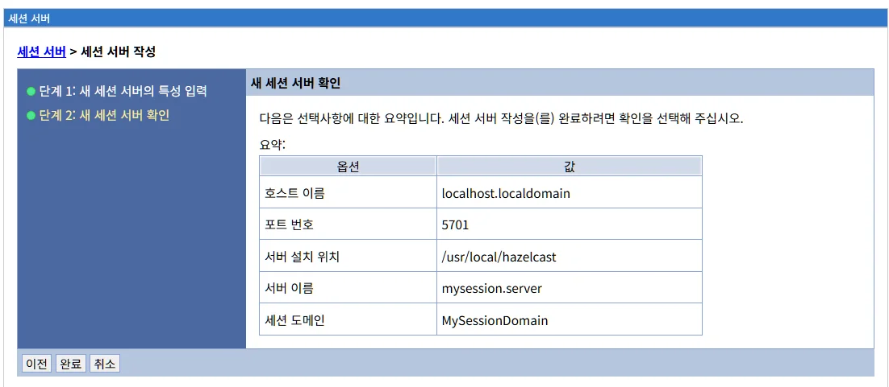

# 세션 서버 관리
세션 서버 관리는 애플리케이션 서버 클러스터 환경에서 HTTP 세션 데이터를 중앙집중식으로 저장하고 관리하는 전용 세션 서버를 관리하는 기능입니다. 세션 서버 생성, 삭제 및 애플리케이션 서버와의 연동 방법을 설명합니다.

## 목차

- [개요](#개요)
- [세션 서버 목록](#세션-서버-목록)
- [세션 서버 생성](#세션-서버-생성)
- [세션 도메인 관리](#세션-도메인-관리)
- [세션 서버 상세 정보](#세션-서버-상세-정보)
- [세션 서버와 애플리케이션 서버 연동](#세션-서버와-애플리케이션-서버-연동)
- [세션 서버 모니터링](#세션-서버-모니터링)
- [세션 서버 고가용성 구성](#세션-서버-고가용성-구성)
- [세션 서버 성능 최적화](#세션-서버-성능-최적화)
- [문제 해결](#문제-해결)
- [다음 단계](#다음-단계)

---
## 개요

세션 서버 메뉴는 LibriX 관리콘솔에서 전용 세션 서버를 관리할 수 있는 기능을 제공합니다. 세션 서버는 애플리케이션 서버 클러스터 환경에서 HTTP 세션 데이터를 중앙집중식으로 저장하고 관리하는 역할을 수행합니다.

### LibriX와 Open Liberty/WebSphere Liberty

LibriX는 Open Liberty와 WebSphere Liberty를 기반으로 하며, Liberty의 JCache Session Persistence 기능을 활용합니다. Liberty에서 세션 관리를 구성하려면 `server.xml` 파일을 직접 편집하고 복잡한 XML 설정을 작성해야 하지만, LibriX는 이러한 작업을 웹 기반 UI로 제공하여 관리를 간소화합니다.

**Liberty의 전통적인 방식:**
```xml
<server>
  <featureManager>
    <feature>sessionCache-1.0</feature>
  </featureManager>
  
  <library id="HazelcastLib">
    <fileset dir="/opt/hazelcast/lib" includes="*.jar"/>
  </library>
  
  <httpSessionCache cacheManagerRef="CacheManager"/>
  
  <cacheManager id="CacheManager">
    <cachingProvider jCacheLibraryRef="HazelcastLib"/>
  </cacheManager>
</server>
```

**LibriX의 접근 방식:**

LibriX는 위와 같은 XML 설정을 수동으로 작성하고 관리하는 불편함을 제거합니다:

- **GUI 기반 구성**: 웹 인터페이스를 통해 세션 도메인과 세션 서버를 생성
- **자동 구성 생성**: 입력된 정보를 바탕으로 자동으로 `server.xml` 및 관련 설정 파일 생성
- **중앙 관리**: 여러 서버의 세션 관리 설정을 한 곳에서 관리
- **시각적 모니터링**: 세션 서버의 상태를 실시간으로 확인
- **검증 기능**: 설정 오류를 사전에 방지하는 유효성 검사

### 세션 서버의 역할

세션 서버는 다음과 같은 주요 기능을 제공합니다:

**세션 데이터 중앙 저장**

여러 애플리케이션 서버가 하나의 세션 서버를 공유하여 세션 데이터를 저장합니다. 이를 통해 클러스터 내의 모든 서버가 동일한 세션 정보에 접근할 수 있습니다.

**장애 조치 (Failover) 지원**

애플리케이션 서버에 장애가 발생하더라도 세션 데이터는 세션 서버에 안전하게 보관되어 있어, 다른 애플리케이션 서버에서 사용자 세션을 계속 유지할 수 있습니다.

**세션 복제 (Session Replication)**

메모리 간 복제 방식으로 세션 데이터를 실시간으로 동기화하여 고가용성을 보장합니다.

**세션 어피니티 (Session Affinity)**

웹서버 플러그인과 연동하여 동일한 사용자의 요청이 항상 같은 세션을 보유한 서버로 라우팅되도록 합니다.

### Liberty JCache Session Persistence

Liberty의 `sessionCache-1.0` 기능은 JCache (JSR 107) 표준을 사용하여 세션 지속성을 제공합니다:

**JCache 기반 아키텍처**

- JCache는 Java 플랫폼의 표준 캐싱 API입니다
- Liberty는 JCache 구현체를 통해 분산 세션 관리를 구현합니다
- Hazelcast, Infinispan, Redis 등 다양한 JCache 제공자 지원

**Liberty의 세션 관리 특징**

- 관계형 데이터베이스 없이 세션 지속성 제공
- 높은 성능의 인메모리 캐싱
- 클러스터 환경에서의 자동 세션 복제
- Peer-to-Peer 또는 Client-Server 모드 지원

**LibriX의 역할**

LibriX는 Liberty의 이러한 기능을 그대로 활용하면서, 설정의 복잡성을 UI로 추상화하여 관리자가 쉽게 세션 관리 환경을 구축할 수 있도록 지원합니다.

## 세션 서버 목록

세션 서버 메뉴를 선택하면 현재 LibriX에 등록된 모든 세션 서버의 목록이 표시됩니다.


### 세션 서버 목록 화면 구성

세션 서버 목록 화면은 다음과 같은 정보를 테이블 형태로 제공합니다:

- **선택**: 체크박스를 사용하여 작업을 수행할 세션 서버를 선택할 수 있습니다.
- **이름**: 세션 서버의 이름입니다. 클릭하면 해당 세션 서버의 상세 정보 페이지로 이동합니다.
- **세션 도메인**: 세션 서버가 속한 세션 도메인의 이름입니다. 세션 도메인은 세션 데이터를 공유하는 서버 그룹을 나타냅니다.
- **호스트 이름**: 세션 서버가 실행되고 있는 호스트의 도메인 이름 또는 IP 주소입니다.
- **상태**: 세션 서버의 현재 실행 상태를 나타냅니다.
  - 녹색 원: 세션 서버가 정상적으로 실행 중입니다.
  - 빨간 원: 세션 서버가 중지된 상태입니다.

화면 상단에는 "작성"과 "삭제" 탭이 제공되며, 화면 하단에는 현재 등록된 세션 서버의 총 개수가 표시됩니다.

### 세션 서버 관리 기능

화면 상단의 탭을 사용하여 세션 서버를 관리할 수 있습니다:

#### 작성

새로운 세션 서버를 LibriX에 등록합니다. 세션 서버는 전용 Liberty 서버로 구성되며, HTTP 세션 데이터를 저장하고 관리하는 역할만을 수행합니다.

세션 서버를 생성하려면:

1. "작성" 탭을 클릭합니다.
2. 세션 서버 생성 마법사가 시작됩니다.
3. 필요한 정보를 입력하여 세션 서버를 생성합니다.

#### 삭제

선택한 세션 서버를 LibriX에서 제거합니다. 이 작업은 관리콘솔에서만 세션 서버를 삭제하며, 실제 서버 파일이나 설정은 삭제되지 않습니다.

삭제 작업을 수행하려면:

1. 목록에서 삭제할 세션 서버의 체크박스를 선택합니다.
2. "삭제" 탭을 클릭합니다.
3. 확인 대화상자가 나타나면 삭제를 확인합니다.

**주의**: 세션 서버를 삭제하기 전에 해당 세션 서버를 사용 중인 애플리케이션 서버가 없는지 확인해야 합니다. 사용 중인 세션 서버를 삭제하면 애플리케이션의 세션 데이터가 손실될 수 있습니다.

## 세션 서버 생성

"작성" 탭을 클릭하면 새로운 세션 서버를 생성하는 프로세스가 시작됩니다. 세션 서버 생성은 2단계로 구성되어 있습니다.

### 단계 1: 새 세션 서버의 특성 입력

첫 번째 단계에서는 세션 서버의 기본 정보와 설정을 입력합니다.


**전제 조건**: 세션 서버를 생성하기 전에 먼저 **세션 도메인**을 생성해야 합니다. 세션 도메인이 없는 경우 "세션 도메인 선택" 드롭다운에서 선택할 도메인이 없거나 오류 메시지가 표시됩니다. 세션 도메인 생성 방법은 [세션 도메인 관리](session-domain.md) 문서를 참조하십시오.

#### 새 세션 서버의 특성 입력

**호스트 선택** (필수)

드롭다운 메뉴에서 세션 서버를 생성할 호스트를 선택합니다. 목록에는 시스템에 정의된 노드들이 표시됩니다 (예: localhost.localdomain).

미리 등록된 노드 목록 중에서 새로운 세션 서버를 작성할 대상 호스트를 선택해야 합니다. 노드가 목록에 없는 경우, 먼저 노드를 등록해야 합니다.

**비관리 노드 추가**

체크박스를 선택하면 LibriX에서 관리하지 않는 노드에 세션 서버를 등록할 수 있습니다. 이 옵션을 선택하면 "비관리 노드 호스트명" 필드가 활성화됩니다.

**비관리 노드 호스트명**

비관리 노드를 추가하는 경우, 해당 노드의 호스트 이름을 직접 입력합니다. 비관리 노드는 LibriX에서 직접 제어할 수 없으며, 세션 서버의 시작/중지 등의 작업은 해당 호스트에서 수동으로 수행해야 합니다.

**세션 서버 포트 정보** (필수)

세션 서버가 JCache 통신에 사용할 포트 번호를 입력합니다 (기본값: 5701).

이 포트는 Hazelcast와 같은 JCache 구현체가 클러스터 멤버 간 통신에 사용하는 포트입니다. 각 세션 서버는 고유한 포트를 사용해야 하며, 다음 사항을 고려해야 합니다:

- **Hazelcast 기본 포트**: Hazelcast는 기본적으로 5701부터 5801까지의 포트 범위를 사용합니다.
- **포트 충돌 방지**: 동일한 호스트에 여러 세션 서버를 구성하는 경우, 각각 다른 포트를 할당해야 합니다.
- **방화벽 설정**: 클러스터 멤버 간 통신을 위해 해당 포트가 방화벽에서 개방되어 있어야 합니다.

**세션 서버 홈 위치**

세션 서버가 설치될 디렉토리의 전체 경로를 입력합니다 (예: /opt/hazelcast).

이 경로는 JCache 구현체(예: Hazelcast)의 라이브러리 파일과 구성 파일이 위치하는 디렉토리입니다. Liberty 서버는 이 경로를 참조하여 JCache 제공자를 로드합니다.

일반적인 구조:
```
/opt/hazelcast/
├── lib/
│   └── hazelcast.jar          # JCache 구현체 라이브러리
└── config/
    └── hazelcast.xml          # Hazelcast 구성 파일 (선택)
```

**서버 이름** (필수)

새로 작성할 세션 서버의 고유한 이름을 입력합니다 (예: mysession.server).

세션 서버 이름은 관리콘솔 내에서 세션 서버를 식별하는 데 사용되므로 의미 있고 구분 가능한 이름을 사용하는 것이 좋습니다.

예시: `SessionServer01`, `ProductionSessionCache`, `HazelcastNode1` 등

**세션 도메인 선택** (필수)

드롭다운 메뉴에서 세션 서버가 속할 세션 도메인을 선택합니다 (예: MySessionDomain).

세션 도메인은 세션 데이터를 공유하는 서버 그룹을 정의합니다. 동일한 세션 도메인에 속한 애플리케이션 서버와 세션 서버는 HTTP 세션 데이터를 공유할 수 있습니다.

**중요**: 세션 도메인이 드롭다운에 표시되지 않는 경우, 먼저 환경 메뉴의 "세션 도메인" 링크에서 세션 도메인을 생성해야 합니다. 세션 도메인 없이는 세션 서버를 생성할 수 없습니다.

#### JCache와 세션 서버

LibriX의 세션 서버는 Open Liberty의 JCache Session Persistence 기능을 기반으로 구현되었습니다. 주요 특징은 다음과 같습니다:

**JCache (JSR 107) 기반**

JCache는 Java 플랫폼에서 분산 캐싱을 표준화하는 인터페이스입니다. Liberty의 `sessionCache-1.0` 기능은 JCache를 사용하여 여러 Liberty 인스턴스 간에 세션 데이터를 공유할 수 있는 공통 캐시를 제공합니다.

**JCache 구현체**

`sessionCache` 기능 자체는 JCache 구현을 포함하지 않으므로, 다음 중 하나를 선택하여 사용해야 합니다:

- **Hazelcast**: 오픈소스 인메모리 데이터 그리드 (가장 많이 테스트됨)
- **Infinispan**: Red Hat의 오픈소스 데이터 그리드
- **Ehcache**: Terracotta의 캐싱 솔루션
- **Redis** (Redisson 사용): Redis를 JCache 제공자로 사용
- **WebSphere eXtreme Scale**: IBM의 엔터프라이즈 캐싱 솔루션

**클러스터 모델**

Liberty JCache 세션 관리는 두 가지 클러스터 모델을 지원합니다:

1. **Peer-to-Peer 모드**: Liberty 서버들이 동일한 클러스터의 일부로 서로 직접 연결됩니다. 모든 서버가 동등한 역할을 수행하며, 각 서버는 세션 데이터의 일부를 저장합니다.

2. **Client-Server 모드**: Liberty 서버가 JCache 클라이언트로 작동하고 전용 JCache 서버에 연결됩니다. 이것이 LibriX 세션 서버 기능이 구현하는 모델입니다.

**Server.xml 구성 예시**

Open Liberty에서 JCache 세션 캐시를 구성하는 일반적인 예시:

```xml
<server>
  <featureManager>
    <feature>sessionCache-1.0</feature>
    <feature>servlet-4.0</feature>
  </featureManager>

  <!-- JCache 구현체 라이브러리 참조 -->
  <library id="JCacheLib">
    <file name="/opt/hazelcast/lib/hazelcast.jar"/>
  </library>

  <!-- HTTP 세션 캐시 구성 -->
  <httpSessionCache cacheManagerRef="CacheManager"/>

  <cacheManager id="CacheManager" 
                uri="file:/opt/hazelcast/config/hazelcast.xml">
    <cachingProvider jCacheLibraryRef="JCacheLib"/>
  </cacheManager>
</server>
```

LibriX는 세션 서버 생성 시 입력된 정보를 바탕으로 이러한 구성을 자동으로 생성합니다.

#### 다음 단계로 이동

모든 필수 필드를 입력한 후:
- **다음**: 2단계로 이동하여 입력한 정보를 최종 확인합니다
- **취소**: 세션 서버 생성 프로세스를 취소하고 세션 서버 목록 화면으로 돌아갑니다

### 단계 2: 새 세션 서버 확인

두 번째 단계에서는 입력한 정보를 최종 확인하고 세션 서버 생성을 완료합니다.



#### 확인 정보

이 단계에서는 1단계에서 입력한 모든 정보가 요약 테이블 형식으로 표시됩니다. 다음 정보들을 최종 확인할 수 있습니다:

| 옵션 | 값 |
|------|------|
| **호스트 이름** | 세션 서버가 생성될 호스트의 도메인 이름 또는 IP 주소 (예: localhost.localdomain) |
| **포트 번호** | JCache 통신에 사용할 포트 번호 (예: 5701) |
| **서버 설치 위치** | JCache 구현체 라이브러리가 위치한 디렉토리 경로 (예: /usr/local/hazelcast) |
| **서버 이름** | 세션 서버의 고유 이름 (예: mysession.server) |
| **세션 도메인** | 세션 서버가 속할 세션 도메인 이름 (예: MySessionDomain) |

화면 상단에는 "다음은 선택사항에 대한 요약입니다. 세션 서버 작성을(를) 완료하려면 확인을 선택해 주십시오."라는 안내 메시지가 표시됩니다.

#### 세션 서버 생성 완료

확인이 끝나면 화면 하단의 버튼을 사용하여 세션 서버 생성을 완료하거나 취소할 수 있습니다:

**이전**

1단계로 돌아가서 입력한 정보를 수정할 수 있습니다. 이미 입력한 값들은 유지됩니다.

**완료**

입력한 정보로 세션 서버를 생성합니다. 완료 버튼을 클릭하면 세션 서버가 생성되고, 변경사항 확인 메시지가 표시됩니다.

**취소**

세션 서버 생성 프로세스를 취소하고 세션 서버 목록 화면으로 돌아갑니다. 입력한 모든 정보는 저장되지 않습니다.

#### 세션 서버 생성 완료 후 변경사항 확인

세션 서버 생성이 완료되면 화면 상단에 변경사항 확인 메시지가 표시됩니다:

**메시지**

"로컬 구성에 변경 사항이 적용되었습니다. 다음을 수행할 수 있습니다."

이 메시지는 세션 서버 구성이 로컬에 저장되었으며, 아직 실제 서버에 반영되지 않았음을 나타냅니다. 다음 두 가지 옵션을 선택할 수 있습니다:

- **저장**: 변경사항을 즉시 서버에 적용합니다.
- **저장하거나 버리기 전 변경사항 검토**: 변경된 내용을 먼저 검토한 후 저장 또는 취소를 결정합니다.

**중요**: "이 변경사항을 적용하려면, 서버를 다시 시작해야 합니다."라는 안내 메시지가 함께 표시될 수 있습니다.

새로 생성된 세션 서버는 세션 서버 목록에 추가되며, 상태 표시등으로 현재 실행 상태를 확인할 수 있습니다.

#### 변경사항 검토

"저장하거나 버리기 전 변경사항 검토" 링크를 클릭하면 변경사항 검토 화면이 표시됩니다.

검토 화면에서는 세션 서버 생성으로 인해 추가되거나 수정된 파일 목록을 확인할 수 있습니다:

**변경된 파일 예시:**
- `/hosts/[호스트명]/servers/[세션서버명]/server.json`: 세션 서버 JSON 구성 파일
- `/hosts/[호스트명]/servers/[세션서버명]/server.xml`: 세션 서버 XML 구성 파일
- `/hosts/[호스트명]/servers/[세션서버명]/jvm.options`: JVM 옵션 파일
- `/environments/session-domains/[도메인명].json`: 세션 도메인 구성 파일

각 파일의 상태는 "추가됨" 또는 "수정됨"으로 표시됩니다.

다음 버튼을 사용하여 변경사항을 처리할 수 있습니다:

- **저장**: 변경사항을 서버에 적용하고 저장합니다.
- **버리기**: 변경사항을 취소하고 이전 상태로 되돌립니다. 새로 생성된 세션 서버가 삭제됩니다.
- **이전**: 세션 서버 목록 화면으로 돌아갑니다. 변경사항은 저장되지 않은 상태로 유지됩니다.

#### 세션 서버 생성 후 다음 단계

세션 서버가 성공적으로 생성되면:

1. **세션 서버 시작**: 세션 서버 목록에서 새로 생성된 세션 서버를 선택하고 "시작" 버튼을 클릭하여 세션 서버를 기동합니다.

2. **JCache 클러스터 확인**: 세션 서버가 시작되면 JCache 구현체(Hazelcast 또는 Redis)가 클러스터를 형성합니다. 동일한 세션 도메인에 속한 다른 세션 서버가 있다면 자동으로 클러스터에 조인됩니다.

3. **애플리케이션 서버 구성**: 애플리케이션 서버의 세션 관리 설정에서 다음을 구성합니다:
   - 세션 도메인을 동일하게 설정 (예: MySessionDomain)
   - 분산 세션 관리 활성화
   - Client-Server 모드 선택
   - 세션 서버 목록 지정

4. **세션 복제 테스트**: 애플리케이션에 접속하여 세션을 생성하고, 다른 애플리케이션 서버에서 동일한 세션에 접근할 수 있는지 확인합니다.

## 세션 도메인 관리

세션 도메인은 세션 서버를 생성하기 전에 먼저 생성되어야 하는 필수 요소입니다. 세션 도메인 생성 및 관리에 대한 자세한 내용은 [세션 도메인 관리](session-domain.md) 문서를 참조하십시오.

## 세션 서버 상세 정보

세션 서버 목록에서 세션 서버 이름을 클릭하면 해당 세션 서버의 상세 정보 페이지로 이동합니다. 상세 페이지에서는 세션 서버의 구성 정보를 조회하고 수정할 수 있습니다. (세션 서버 상세 화면이 제공되면 이 섹션이 추가될 예정입니다.)

## 세션 서버와 애플리케이션 서버 연동

세션 서버를 효과적으로 사용하려면 애플리케이션 서버와 올바르게 연동해야 합니다.

### 세션 복제 구성

애플리케이션 서버에서 세션 서버를 사용하도록 구성하는 방법:

1. 메뉴에서 환경 > 세션 도메인을 클릭합니다.
2. 원하는 세션 도메인을 클릭 합니다.
3. 클라이언트 서버 지정 메뉴를 클릭 합니다.
4. 해당 세션 도메인을 이용할 서버를 선택 합니다.

### 세션 도메인

세션 도메인은 세션 데이터를 공유하는 서버 그룹을 나타냅니다. 동일한 세션 도메인에 속한 애플리케이션 서버와 세션 서버는 세션 데이터를 공유할 수 있습니다.

세션 도메인을 구성할 때 고려사항:

- 동일한 애플리케이션을 실행하는 서버들은 같은 세션 도메인에 속해야 합니다.
- 세션 도메인 이름은 고유해야 합니다.
- 보안 요구사항에 따라 서로 다른 애플리케이션은 별도의 세션 도메인을 사용할 수 있습니다.

### 세션 어피니티 (Session Affinity)

세션 어피니티는 동일한 사용자의 요청이 항상 같은 애플리케이션 서버로 라우팅되도록 하는 메커니즘입니다.

**작동 원리:**

1. 사용자가 처음 접속하면 애플리케이션 서버가 세션 ID를 생성합니다.
2. 세션 ID에는 해당 서버를 식별하는 Clone ID 또는 Partition ID가 추가됩니다.
3. 웹서버 플러그인은 세션 ID의 Clone ID를 읽어 동일한 서버로 요청을 전달합니다.
4. 해당 서버를 사용할 수 없는 경우, 플러그인은 다른 서버로 요청을 전달하고 세션 서버에서 세션 데이터를 가져옵니다.

**주의사항:**

WebSphere의 문서에 따르면, 세션 어피니티는 "최선의 노력(best-effort)" 기반으로 제공됩니다. 다음과 같은 경우 세션 어피니티가 실패할 수 있습니다:

- 클러스터 멤버가 장애에서 복구되는 동안
- 서버 과부하나 긴 처리 시간으로 인해 동일한 세션의 요청이 다른 서버로 전달되는 경우

## 세션 서버 모니터링

세션 서버의 상태를 주기적으로 모니터링하여 다음 사항을 확인해야 합니다:

### 세션 서버 가용성

- 세션 서버가 정상적으로 실행 중인지 확인합니다.
- 세션 서버 로그에서 오류나 경고 메시지를 확인합니다.

### 메모리 사용량

- 세션 데이터로 인한 메모리 사용량을 모니터링합니다.
- 메모리 부족 상황을 방지하기 위해 JVM 힙 크기를 적절히 설정합니다.

### 세션 수

- 저장된 세션의 수를 추적합니다.
- 비정상적으로 많은 세션이 쌓이는 경우 세션 타임아웃 설정을 검토합니다.

### 네트워크 연결

- 애플리케이션 서버와 세션 서버 간의 네트워크 연결 상태를 확인합니다.
- 네트워크 지연이 세션 복제 성능에 영향을 줄 수 있습니다.

## 세션 서버 고가용성 구성

프로덕션 환경에서는 세션 서버의 고가용성을 보장하기 위해 다음 사항을 고려해야 합니다:

### 다중 세션 서버

- 최소 2개 이상의 세션 서버를 구성하여 단일 장애점을 제거합니다.
- 세션 데이터는 여러 세션 서버에 복제되어 저장됩니다.

### 장애 조치 계획

- 세션 서버 장애 시 자동으로 다른 세션 서버로 전환되도록 구성합니다.
- 정기적으로 장애 조치 시나리오를 테스트합니다.

## 세션 서버 성능 최적화

세션 서버의 성능을 최적화하기 위한 권장사항:

### JVM 튜닝

- 세션 데이터의 예상 크기와 수에 따라 적절한 힙 메모리를 할당합니다.
- 가비지 컬렉션 정책을 최적화하여 응답 시간을 개선합니다.

### 세션 타임아웃

- 적절한 세션 타임아웃 값을 설정하여 불필요한 세션이 메모리에 남지 않도록 합니다.
- 일반적으로 30분(1800초)이 권장되지만, 애플리케이션의 특성에 따라 조정합니다.

### 세션 데이터 크기

- 세션에 저장하는 데이터의 크기를 최소화합니다.
- 대용량 데이터는 세션이 아닌 데이터베이스나 캐시에 저장하는 것을 고려합니다.

### 복제 빈도

- 세션 복제 빈도를 조정하여 네트워크 트래픽과 데이터 일관성 사이의 균형을 맞춥니다.
- 실시간 복제는 가장 안전하지만 성능에 영향을 줄 수 있습니다.
- 복제 빈도는 ALL_SESSION_ATTRIBUTES, GET_AND_SET_ATTRIBUTES, ONLY_SET_ATTRIBUTES 입니다

## 문제 해결

### 세션 데이터 손실

**증상:** 사용자가 로그인 상태를 잃거나 장바구니가 비워지는 현상

**원인:**
- 세션 서버가 중지되거나 장애 발생
- 세션 복제가 올바르게 구성되지 않음
- 세션 타임아웃 설정이 너무 짧음

**해결방법:**
- 세션 서버 로그에서 오류 확인
- 세션 복제 구성 검증
- 세션 타임아웃 값 조정
- 다중 세션 서버 구성 확인

### 세션 어피니티 실패

**증상:** 동일한 사용자의 요청이 서로 다른 서버로 전달됨

**원인:**
- 웹서버 플러그인 구성 오류
- 세션 ID 쿠키가 올바르게 전달되지 않음
- 로드 밸런서 설정 문제

**해결방법:**
- plugin-cfg.xml 파일 확인
- 쿠키 설정 검증 (JSESSIONID)
- 로드 밸런서의 세션 어피니티 설정 확인

### 메모리 부족

**증상:** 세션 서버에서 OutOfMemoryError 발생

**원인:**
- 세션 수가 예상보다 많음
- 세션에 저장되는 데이터가 너무 큼
- JVM 힙 크기가 부족함

**해결방법:**
- JVM 힙 크기 증가
- 세션 타임아웃 값 감소
- 세션에 저장되는 데이터 최적화
- 세션 서버 추가 구성

## 다음 단계

- 새로운 세션 서버를 추가하려면 "작성" 탭을 사용하여 세션 서버 생성 프로세스를 시작하십시오.
- 세션 서버의 상세 정보를 보려면 세션 서버 이름을 클릭하십시오.
- 애플리케이션 서버에서 세션 서버를 사용하도록 설정하려면 애플리케이션 서버의 세션 관리 설정을 구성하십시오.
