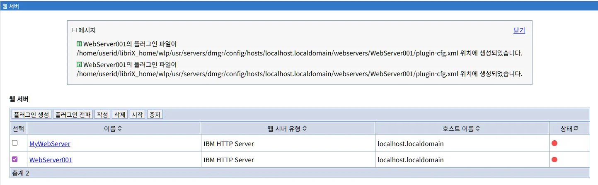
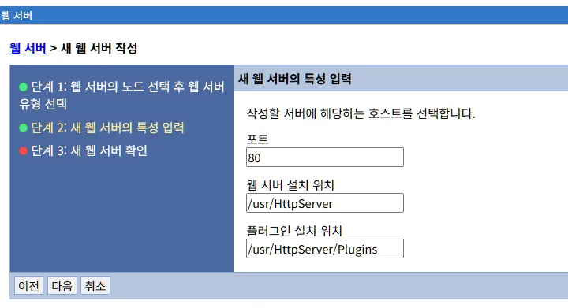
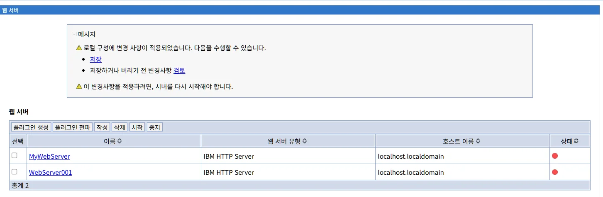
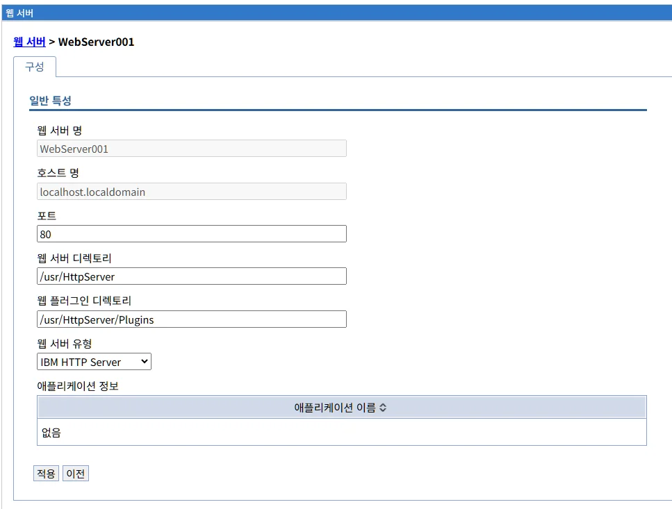

# 웹서버 관리

## 개요

웹서버 메뉴는 LibriX 관리콘솔에 등록된 웹서버들을 중앙에서 관리할 수 있는 기능을 제공합니다. 웹서버는 클라이언트 요청을 받아 애플리케이션 서버로 전달하는 역할을 수행하며, IBM HTTP Server와 같은 웹서버를 관리할 수 있습니다.

웹서버는 애플리케이션 서버 앞단에 위치하여 정적 컨텐츠를 제공하고, 로드 밸런싱, SSL 처리 등의 기능을 담당합니다. LibriX를 통해 웹서버의 시작, 중지, 구성 관리 등의 작업을 수행할 수 있습니다.

## 웹서버 목록

웹서버 메뉴를 선택하면 현재 LibriX에 등록된 모든 웹서버의 목록이 표시됩니다.


### 웹서버 목록 화면 구성

웹서버 목록 화면은 다음과 같은 정보를 테이블 형태로 제공합니다:

- **선택**: 체크박스를 사용하여 작업을 수행할 웹서버를 선택할 수 있습니다.
- **이름**: 웹서버의 이름입니다. 클릭하면 해당 웹서버의 상세 정보 페이지로 이동합니다.
- **웹 서버 유형**: 웹서버의 종류를 표시합니다 (예: IBM HTTP Server).
- **호스트 이름**: 웹서버가 실행되고 있는 호스트의 도메인 이름 또는 IP 주소입니다.
- **상태**: 웹서버의 현재 실행 상태를 나타냅니다.
  - 녹색 원: 웹서버가 정상적으로 실행 중입니다.
  - 빨간 원: 웹서버가 중지된 상태입니다.

화면 하단에는 현재 등록된 웹서버의 총 개수가 표시됩니다.

### 웹서버 관리 기능

화면 상단에는 웹서버를 관리하기 위한 다음과 같은 탭과 버튼들이 제공됩니다:

#### 플러그인 생성

선택한 웹서버의 플러그인 구성 파일을 생성합니다. 웹서버 플러그인은 웹서버와 애플리케이션 서버 간의 통신을 담당하는 모듈입니다.

플러그인 구성 파일(plugin-cfg.xml)은 다음 정보를 포함합니다:
- 애플리케이션 서버의 위치와 포트
- URI 매핑 규칙
- 로드 밸런싱 정책
- 세션 어피니티 설정

플러그인 생성 작업을 수행하려면:

1. 목록에서 플러그인을 생성할 웹서버의 체크박스를 선택합니다.
2. "플러그인 생성" 탭을 클릭합니다.
3. 플러그인 구성 파일이 생성되며, 웹서버가 애플리케이션 서버와 통신할 수 있게 됩니다.

**주의**: 웹서버를 선택하지 않고 "플러그인 생성" 탭을 클릭하면 다음과 같은 오류 메시지가 표시됩니다:


"플러그인 파일을 생성할 웹 서버를 선택하십시오."

이 경우 목록에서 하나 이상의 웹서버를 선택한 후 다시 시도해야 합니다. 여러 웹서버를 동시에 선택하여 일괄 처리할 수도 있습니다.

**플러그인 생성 성공**

플러그인 생성이 성공적으로 완료되면 화면 상단에 다음과 같은 메시지가 표시됩니다:



"[웹서버이름]의 플러그인 파일이 [파일경로] 위치에 생성되었습니다."

예시:
```
WebServer001의 플러그인 파일이
/home/userid/libriX_home/wlp/usr/servers/dmgr/config/hosts/localhost.localdomain/webservers/WebServer001/plugin-cfg.xml 
위치에 생성되었습니다.
```

이 메시지는 plugin-cfg.xml 파일이 생성된 정확한 경로를 보여줍니다. 생성된 플러그인 구성 파일은 다음 단계에서 "플러그인 전파"를 통해 실제 웹서버로 배포되어야 합니다.

여러 웹서버를 선택한 경우, 각 웹서버별로 별도의 성공 메시지가 표시됩니다.

#### 플러그인 전파

생성된 플러그인 구성 파일을 웹서버에 배포합니다. 플러그인 전파는 LibriX에서 생성된 plugin-cfg.xml 파일을 실제 웹서버의 플러그인 디렉토리로 복사하는 프로세스입니다.

**플러그인 전파의 필요성**

플러그인 구성 파일은 다음과 같은 경우에 업데이트되므로, 변경사항을 웹서버에 전파해야 합니다:

- 새로운 애플리케이션이 배포된 경우
- 애플리케이션이 제거되거나 업데이트된 경우
- 애플리케이션 서버가 추가되거나 제거된 경우
- 클러스터 구성이 변경된 경우
- URI 매핑 규칙이 변경된 경우
- 가상 호스트 구성이 변경된 경우

**플러그인 전파 프로세스**

플러그인 전파 작업을 수행하려면:

1. 목록에서 플러그인을 전파할 웹서버의 체크박스를 선택합니다.
2. "플러그인 전파" 탭을 클릭합니다.
3. 업데이트된 플러그인 구성 파일이 웹서버의 플러그인 디렉토리로 전송됩니다.

**플러그인 전파 대상 위치**

플러그인 구성 파일은 웹서버의 플러그인 설치 디렉토리 아래의 특정 웹서버 이름 디렉토리에 전파됩니다:

```
<플러그인 설치 위치>/config/<웹서버 이름>/plugin-cfg.xml
```

예시:
```
/opt/IBM/WebSphere/Plugins/config/WebServer001/plugin-cfg.xml
/usr/HttpServer/Plugins/config/WebServer001/plugin-cfg.xml
```

**관리형 노드와 비관리형 노드**

- **관리형 노드**: LibriX가 직접 제어할 수 있는 노드입니다. 플러그인 전파가 자동으로 수행되며, 웹서버의 시작/중지도 관리콘솔에서 가능합니다.

- **비관리형 노드**: LibriX에서 직접 제어할 수 없는 노드입니다. 이 경우 플러그인 구성 파일을 수동으로 복사하거나, IBM HTTP Server의 관리 프로세스를 통해 전파할 수 있습니다.

**IBM HTTP Server의 특별한 경우**

IBM HTTP Server는 비관리형 노드에 설치된 경우에도 원격 관리가 가능합니다. IHS 관리 서버(admin server)가 실행 중이면, LibriX는 자동으로 플러그인 구성 파일을 전파할 수 있습니다.

**플러그인 전파 확인**

플러그인 전파가 성공적으로 완료되었는지 확인하려면:

1. 웹서버의 플러그인 디렉토리에서 plugin-cfg.xml 파일의 타임스탬프를 확인합니다.
2. 파일 내용을 열어 최신 애플리케이션 정보가 포함되어 있는지 확인합니다.
3. 웹서버 로그에서 플러그인 로딩 메시지를 확인합니다.

**참고**: 대부분의 경우 플러그인 전파 후 웹서버를 재시작할 필요는 없습니다. 웹서버 플러그인은 주기적으로 plugin-cfg.xml 파일의 변경사항을 감지하여 자동으로 다시 로드합니다. 그러나 일부 중요한 구성 변경(예: 새로운 가상 호스트 추가)은 웹서버 재시작이 필요할 수 있습니다.

**자동 플러그인 전파**

LibriX에서는 플러그인 구성 파일이 변경될 때마다 자동으로 웹서버에 전파되도록 설정할 수 있습니다. 이 설정은 각 웹서버의 상세 정보 페이지에서 "자동으로 플러그인 구성 파일 전파" 옵션을 활성화하여 구성할 수 있습니다.

자동 전파를 사용하면 다음과 같은 이점이 있습니다:
- 수동 작업 없이 최신 구성이 항상 유지됩니다
- 애플리케이션 배포 후 즉시 웹서버에서 접근 가능합니다
- 관리자의 실수로 인한 구성 불일치를 방지합니다

#### 작성

새로운 웹서버를 LibriX에 등록합니다. 이미 설치되어 있는 웹서버를 관리콘솔에 추가하여 중앙에서 관리할 수 있도록 합니다.

#### 삭제

선택한 웹서버를 LibriX에서 제거합니다. 이 작업은 관리콘솔에서만 웹서버를 삭제하며, 실제 웹서버 파일이나 설정은 삭제되지 않습니다.

삭제 작업을 수행하려면:

1. 목록에서 삭제할 웹서버의 체크박스를 선택합니다.
2. "삭제" 탭을 클릭합니다.
3. 확인 대화상자가 나타나면 삭제를 확인합니다.

**주의**: 실행 중인 웹서버도 삭제할 수 있으나, 삭제 전에 웹서버를 중지하는 것이 권장됩니다.

#### 시작

선택한 웹서버를 시작합니다. 중지된 상태의 웹서버를 정상적으로 기동시킵니다.

시작 작업을 수행하려면:

1. 목록에서 시작할 웹서버의 체크박스를 선택합니다.
2. "시작" 탭을 클릭합니다.
3. 웹서버가 시작되면 상태 표시등이 녹색으로 변경됩니다.

**참고**: 여러 웹서버를 동시에 선택하여 일괄 시작할 수 있습니다.

#### 중지

선택한 웹서버를 정상적으로 종료합니다. 웹서버는 현재 처리 중인 요청을 완료한 후 종료됩니다.

중지 작업을 수행하려면:

1. 목록에서 중지할 웹서버의 체크박스를 선택합니다.
2. "중지" 탭을 클릭합니다.
3. 웹서버가 종료되면 상태 표시등이 빨간색으로 변경됩니다.

## 웹서버 상태 모니터링

웹서버 목록 화면은 각 웹서버의 현재 상태를 실시간으로 표시합니다. 상태 표시등의 색상을 통해 웹서버의 운영 상태를 한눈에 파악할 수 있습니다.

상태 정보는 주기적으로 갱신되며, 웹서버에 문제가 발생한 경우 상태 표시가 변경됩니다.

## 웹서버와 애플리케이션 서버 연동

웹서버는 웹서버 플러그인을 통해 애플리케이션 서버와 통신합니다. 웹서버 플러그인의 주요 기능은 다음과 같습니다:

### 요청 라우팅

클라이언트로부터 받은 HTTP 요청을 적절한 애플리케이션 서버로 전달합니다. URI 패턴에 따라 정적 컨텐츠는 웹서버에서 직접 처리하고, 동적 컨텐츠는 애플리케이션 서버로 전달합니다.

### 로드 밸런싱

여러 애플리케이션 서버가 구성된 경우, 요청을 각 서버에 분산하여 부하를 균등하게 배분합니다. 다음과 같은 로드 밸런싱 알고리즘을 지원합니다:

- **라운드 로빈**: 요청을 순차적으로 각 서버에 분배합니다.
- **가중치 기반 라운드 로빈**: 서버의 처리 능력에 따라 가중치를 부여하여 분배합니다.
- **랜덤**: 무작위로 서버를 선택합니다.

### 세션 어피니티

사용자 세션을 특정 애플리케이션 서버에 고정시켜, 동일한 사용자의 요청이 항상 같은 서버로 전달되도록 합니다. 이를 통해 세션 상태를 유지하고 성능을 향상시킬 수 있습니다.

### 장애 조치

애플리케이션 서버에 장애가 발생한 경우, 자동으로 정상 작동하는 다른 서버로 요청을 전달합니다. 플러그인은 주기적으로 서버의 상태를 확인하여 장애를 감지합니다.

## 새 웹서버 작성

"작성" 탭을 클릭하면 새로운 웹서버를 LibriX에 등록하는 마법사가 시작됩니다. 웹서버 작성 프로세스는 3단계로 구성되어 있습니다.

### 단계 1: 웹 서버의 노드 선택 후 웹 서버 유형 선택

첫 번째 단계에서는 작성할 웹서버가 실행될 노드를 선택하고, 웹서버의 유형을 지정합니다.


#### 웹 서버의 노드 선택 후 웹 서버 유형 선택

**호스트 선택** (필수)

드롭다운 메뉴에서 웹서버가 실행될 호스트를 선택합니다. 목록에는 시스템에 정의된 노드들이 표시됩니다 (예: localhost.localdomain).

미리 등록된 노드 목록 중에서 새로운 웹서버를 작성할 대상 호스트를 선택해야 합니다. 노드가 목록에 없는 경우, 먼저 노드를 등록해야 합니다.

**비관리 노드 추가**

체크박스를 선택하면 LibriX에서 관리하지 않는 노드에 웹서버를 등록할 수 있습니다. 이 옵션을 선택하면 "비관리 노드 호스트명" 필드가 활성화됩니다.

**비관리 노드 호스트명**

비관리 노드를 추가하는 경우, 해당 노드의 호스트 이름을 직접 입력합니다 (예: unmanaged.host). 

비관리 노드는 LibriX에서 직접 제어할 수 없으며, 웹서버의 시작/중지 등의 작업은 해당 호스트에서 수동으로 수행해야 합니다. 비관리 노드는 주로 DMZ 영역에 위치한 웹서버나 외부에서 관리하는 웹서버를 등록할 때 사용됩니다.

**서버 이름** (필수)

새로 작성할 웹서버의 고유한 이름을 입력합니다 (예: WebServer001). 웹서버 이름은 관리콘솔 내에서 웹서버를 식별하는 데 사용되므로 의미 있고 구분 가능한 이름을 사용하는 것이 좋습니다.

예시: `ProductionWebServer01`, `DevWebServer`, `FrontWebServer` 등

**웹 서버 유형**

드롭다운 메뉴에서 사용할 웹서버의 종류를 선택합니다. 선택 가능한 옵션은 다음과 같습니다:

- **IBM HTTP Server**: IBM에서 제공하는 엔터프라이즈급 웹서버입니다. Apache HTTP Server를 기반으로 하며, 추가적인 관리 기능과 보안 기능을 제공합니다. WebSphere Application Server와의 통합이 우수합니다.

- **Apache WebServer**: 오픈소스 Apache HTTP Server입니다. 표준 Apache 웹서버를 사용하는 경우 이 옵션을 선택합니다.

웹서버 유형에 따라 사용 가능한 기능과 관리 방법이 다를 수 있습니다.

#### 다음 단계로 이동

모든 필수 필드를 입력한 후 화면 하단의 "다음" 버튼을 클릭하여 2단계로 이동합니다. "취소" 버튼을 클릭하면 웹서버 작성 프로세스가 취소되고 웹서버 목록 화면으로 돌아갑니다.

### 단계 2: 새 웹 서버의 특성 입력

두 번째 단계에서는 웹서버의 상세 특성을 입력합니다.



#### 새 웹 서버의 특성 입력

이 단계에서는 웹서버의 포트 번호와 설치 경로를 지정합니다.

**포트**

웹서버가 HTTP 요청을 수신할 포트 번호를 입력합니다 (기본값: 80).

일반적으로 HTTP 기본 포트는 80, HTTPS 기본 포트는 443입니다. 운영 환경에서는 표준 포트를 사용하는 것이 권장되지만, 개발 환경이나 테스트 환경에서는 다른 포트를 사용할 수 있습니다 (예: 8080, 8443 등).

**참고**: 
- 1024 미만의 포트를 사용하려면 관리자(root) 권한이 필요합니다
- 이미 사용 중인 포트를 지정하면 웹서버 시작이 실패할 수 있습니다

**웹 서버 설치 위치**

웹서버가 설치된 루트 디렉토리의 전체 경로를 입력합니다 (예: /usr/HttpServer).

이 경로는 웹서버 실행 파일과 구성 파일이 위치한 디렉토리입니다. IBM HTTP Server의 경우 일반적으로 다음과 같은 경로가 사용됩니다:
- Linux/Unix: `/opt/IBM/HTTPServer`, `/usr/local/HTTPServer`
- Windows: `C:\Program Files\IBM\HTTPServer`

**플러그인 설치 위치**

웹서버 플러그인이 설치된 디렉토리의 전체 경로를 입력합니다 (예: /usr/HttpServer/Plugins).

웹서버 플러그인은 웹서버와 애플리케이션 서버 간의 통신을 담당하는 모듈입니다. 플러그인 디렉토리에는 다음과 같은 파일들이 포함됩니다:
- 플러그인 바이너리 파일 (mod_was_ap*.so 또는 mod_was_ap*.dll)
- 플러그인 구성 파일 (plugin-cfg.xml)
- 플러그인 로그 파일

일반적인 플러그인 설치 경로:
- Linux/Unix: `/opt/IBM/WebSphere/Plugins`, `/usr/local/WebSphere/Plugins`
- Windows: `C:\Program Files\IBM\WebSphere\Plugins`

**중요**: 웹서버 설치 위치와 플러그인 설치 위치는 실제 설치된 경로와 정확히 일치해야 합니다. 경로가 잘못 지정되면 LibriX에서 웹서버를 제어할 수 없습니다.

#### 다음 단계로 이동

모든 필드를 입력한 후:
- **이전**: 1단계로 돌아가서 입력한 정보를 수정합니다
- **다음**: 3단계로 이동하여 입력한 정보를 최종 확인합니다
- **취소**: 웹서버 작성 프로세스를 취소하고 웹서버 목록 화면으로 돌아갑니다

### 단계 3: 새 웹 서버 확인

세 번째 단계에서는 입력한 정보를 최종 확인하고 웹서버 작성을 완료합니다.


#### 새 웹 서버 확인

이 단계에서는 이전 단계들에서 입력한 모든 정보가 요약 테이블 형식으로 표시됩니다. 다음 정보들을 최종 확인할 수 있습니다:

화면 상단에는 "다음은 선택사항에 대한 요약입니다. 새 웹 서버 작성을(를) 완료하려면 확인을 선택해 주십시오."라는 안내 메시지가 표시됩니다.

**요약 정보**

| 항목 | 설명 |
|------|------|
| **호스트 이름** | 웹서버가 실행될 호스트 (예: localhost.localdomain) |
| **서버 이름** | 새로 작성할 웹서버의 고유 이름 (예: WebServer001) |
| **웹 서버 유형** | 선택한 웹서버 종류 (예: IBM HTTP Server) |
| **포트** | 웹서버가 사용할 HTTP 포트 번호 (예: 80) |
| **웹 서버 설치 위치** | 웹서버 설치 루트 디렉토리 (예: /usr/HttpServer) |
| **플러그인 설치 위치** | 웹서버 플러그인 설치 디렉토리 (예: /usr/HttpServer/Plugins) |

#### 웹서버 작성 완료

확인 후 다음 작업을 수행할 수 있습니다:

- **이전**: 이전 단계로 돌아가서 입력한 정보를 수정합니다
- **완료**: 입력한 정보로 웹서버 작성을 완료합니다. 웹서버가 성공적으로 등록되면 웹서버 목록 화면으로 이동하며, 새로 등록된 웹서버가 목록에 표시됩니다
- **취소**: 웹서버 작성 프로세스를 취소하고 웹서버 목록 화면으로 돌아갑니다

"완료" 버튼을 클릭하면 LibriX는 지정된 호스트에 웹서버를 등록하고, 이후 해당 웹서버를 관리콘솔에서 관리할 수 있게 됩니다.

"완료" 버튼을 클릭하면 LibriX는 지정된 호스트에 웹서버를 등록하고, 이후 해당 웹서버를 관리콘솔에서 관리할 수 있게 됩니다.

#### 웹서버 작성 완료 후 변경사항 확인

웹서버 작성이 완료되면 화면 상단에 다음과 같은 메시지 박스가 표시됩니다:



**메시지**

"로컬 구성에 변경 사항이 적용되었습니다. 다음을 수행할 수 있습니다."

이 메시지는 웹서버 구성이 로컬에 저장되었으며, 아직 서버에 반영되지 않았음을 나타냅니다. 다음 두 가지 옵션을 선택할 수 있습니다:

- **저장**: 변경사항을 즉시 서버에 적용합니다.
- **저장하거나 버리기 전 변경사항 검토**: 변경된 내용을 먼저 검토한 후 저장 또는 취소를 결정합니다.

**중요**: "이 변경사항을 적용하려면, 서버를 다시 시작해야 합니다."라는 안내 메시지가 함께 표시될 수 있습니다. 변경사항을 저장한 후에는 웹서버를 시작하거나 재시작해야 새로운 구성이 적용됩니다.

새로 등록된 웹서버는 웹서버 목록에 추가되며, 빨간색 상태 표시등으로 표시됩니다 (아직 시작되지 않은 상태).

**변경사항 검토**

"저장하거나 버리기 전 변경사항 검토" 링크를 클릭하면 변경사항 검토 화면이 표시됩니다.

검토 화면에서는 웹서버 작성으로 인해 추가되거나 수정된 파일 목록을 확인할 수 있습니다. 화면 상단에는 다음과 같은 안내 메시지가 표시됩니다:

"변경사항을 실제 서버에 적용하려면 저장을 클릭하십시오. 변경사항을 추가하려면 계속을, 변경사항을 버리고 다시 구성하려면 버리기를 클릭하십시오."

변경된 파일들이 테이블 형식으로 표시되며, 각 파일의 상태(추가됨/수정됨)를 확인할 수 있습니다.

다음 버튼을 사용하여 변경사항을 처리할 수 있습니다:

- **저장**: 변경사항을 서버에 적용하고 저장합니다.
- **버리기**: 변경사항을 취소하고 이전 상태로 되돌립니다. 새로 등록된 웹서버가 삭제됩니다.
- **이전**: 웹서버 목록 화면으로 돌아갑니다. 변경사항은 저장되지 않은 상태로 유지됩니다.

#### 웹서버 등록 후 작업

웹서버가 성공적으로 등록된 후에는 다음 작업을 수행해야 합니다:

1. **플러그인 구성 파일 생성**: 웹서버 목록에서 등록된 웹서버를 선택하고 "플러그인 생성" 탭을 클릭하여 plugin-cfg.xml 파일을 생성합니다
2. **플러그인 전파**: "플러그인 전파" 탭을 클릭하여 생성된 플러그인 구성 파일을 웹서버에 배포합니다
3. **웹서버 시작**: "시작" 탭을 클릭하여 웹서버를 시작합니다
4. **연동 확인**: 웹 브라우저에서 웹서버 URL에 접속하여 애플리케이션 서버와의 연동이 정상적으로 작동하는지 확인합니다

## 웹서버 상세 정보

웹서버 목록에서 웹서버 이름을 클릭하면 해당 웹서버의 상세 정보 페이지로 이동합니다. 웹서버 상세 페이지에서는 웹서버의 기본 설정을 조회하고 변경할 수 있습니다.



### 구성 탭

웹서버 상세 페이지의 "구성" 탭에서는 웹서버의 기본 속성을 관리할 수 있습니다.

#### 일반 특성

웹서버의 기본 정보와 설정을 확인하고 수정할 수 있습니다:

**웹 서버 명**

웹서버의 이름을 표시하고 수정할 수 있습니다 (예: WebServer001). 웹서버 이름은 관리콘솔 내에서 웹서버를 식별하는 고유한 값입니다.

**호스트 명**

웹서버가 실행되고 있는 호스트의 도메인 이름 또는 IP 주소를 표시합니다 (예: localhost.localdomain).

**포트**

웹서버가 HTTP 요청을 수신하는 포트 번호입니다 (예: 80). 이 값을 변경하면 웹서버 구성 파일도 함께 업데이트해야 합니다.

**웹 서버 디렉토리**

웹서버가 설치된 루트 디렉토리의 전체 경로입니다 (예: /usr/HttpServer). 이 경로에는 웹서버 실행 파일과 구성 파일이 포함되어 있습니다.

**웹 플러그인 디렉토리**

웹서버 플러그인이 설치된 디렉토리의 전체 경로입니다 (예: /usr/HttpServer/Plugins). 플러그인 구성 파일(plugin-cfg.xml)은 이 디렉토리에 배포됩니다.

**웹 서버 유형**

웹서버의 종류를 드롭다운 메뉴에서 선택합니다:
- IBM HTTP Server
- Apache WebServer

웹서버 유형은 웹서버의 제어 방법과 사용 가능한 기능을 결정합니다.

#### 애플리케이션 정보

이 섹션에는 웹서버와 연결된 애플리케이션 서버 정보가 표시됩니다.

**애플리케이션 이름**

웹서버가 요청을 전달하는 애플리케이션 서버들의 목록이 테이블 형태로 표시됩니다. 현재 연결된 애플리케이션 서버가 없는 경우 "없음"으로 표시됩니다.

웹서버가 플러그인을 통해 연동되는 애플리케이션 서버 목록을 확인할 수 있습니다. 이 정보는 플러그인 구성 파일(plugin-cfg.xml)을 기반으로 자동으로 수집됩니다.

#### 설정 변경 저장

화면 하단의 버튼을 사용하여 변경사항을 처리할 수 있습니다:

- **적용**: 변경사항을 저장합니다. 일부 설정 변경은 웹서버 재시작 후에 적용됩니다.
- **이전**: 변경사항을 저장하지 않고 이전 화면으로 돌아갑니다.

### 웹서버 구성 파일 관리

웹서버의 상세 정보에서 설정을 변경한 경우, 실제 웹서버의 구성 파일도 직접 수정해야 할 수 있습니다:

**IBM HTTP Server의 경우**
- 주 구성 파일: `<웹서버 디렉토리>/conf/httpd.conf`
- 플러그인 로드: `LoadModule was_ap24_module <플러그인 디렉토리>/bin/mod_was_ap24_http.so`
- 플러그인 설정: `WebSpherePluginConfig <플러그인 디렉토리>/config/<웹서버이름>/plugin-cfg.xml`

**Apache HTTP Server의 경우**
- 주 구성 파일: `<웹서버 디렉토리>/conf/httpd.conf`
- 플러그인 모듈 로드 및 구성 설정이 필요합니다.

포트나 웹서버 디렉토리 경로를 변경한 경우, LibriX의 설정뿐만 아니라 실제 웹서버의 httpd.conf 파일도 함께 수정해야 합니다.

### 웹서버 로그 확인

웹서버의 동작 상태와 문제를 진단하려면 다음 로그 파일을 확인할 수 있습니다:

- **웹서버 액세스 로그**: `<웹서버 디렉토리>/logs/access_log`
  - 클라이언트 요청 내역을 기록합니다.

- **웹서버 오류 로그**: `<웹서버 디렉토리>/logs/error_log`
  - 웹서버 오류와 경고 메시지를 기록합니다.

- **플러그인 로그**: `<플러그인 디렉토리>/logs/<웹서버이름>/http_plugin.log`
  - 플러그인의 요청 라우팅 및 오류 정보를 기록합니다.
  - 애플리케이션 서버 연결 상태와 장애 조치 정보를 확인할 수 있습니다.

## 다음 단계

- 새로운 웹서버를 추가하려면 "작성" 탭을 사용하여 웹서버 등록 프로세스를 시작하십시오.
- 웹서버의 상세 정보를 보려면 웹서버 이름을 클릭하십시오.
- 플러그인 구성을 업데이트하려면 "플러그인 생성" 후 "플러그인 전파"를 수행하십시오.
