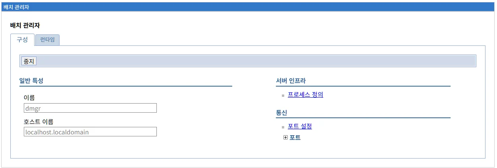
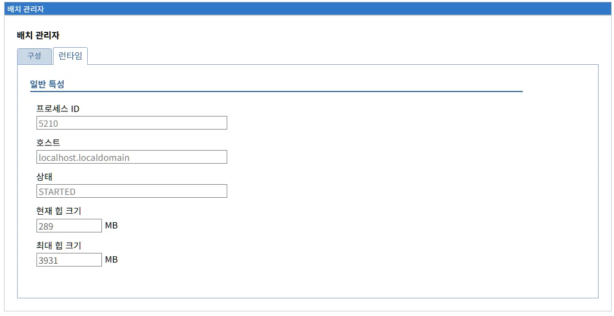
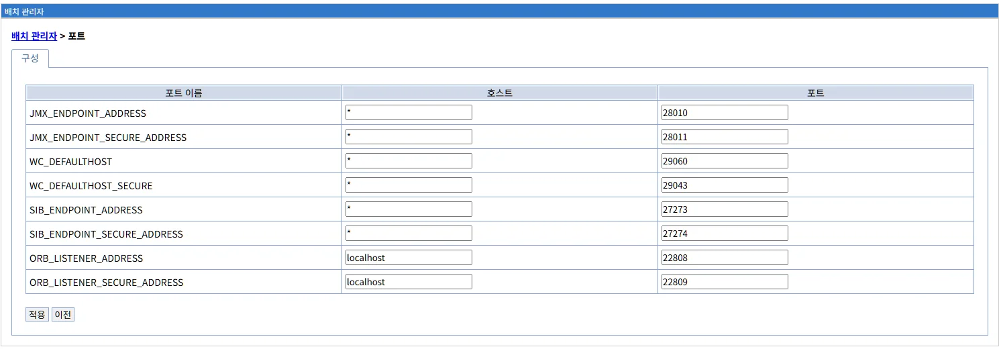

# 배치 관리자 (Deployment Manager)
배치 관리자는 LibriX 환경에서 여러 노드와 애플리케이션 서버를 중앙에서 통합 관리하는 핵심 구성요소입니다. 배치 관리자의 구성, 런타임 관리, 프로세스 정의, 포트 설정 및 운영 방법을 설명합니다.

## 목차

- [개요](#개요)
- [배치 관리자 화면](#배치-관리자-화면)
- [런타임 탭](#런타임-탭)
- [배치 관리자의 역할](#배치-관리자의-역할)
- [프로세스 정의](#프로세스-정의)
- [포트 설정](#포트-설정)
- [배치 관리자 시작 및 중지](#배치-관리자-시작-및-중지)
- [배치 관리자 아키텍처](#배치-관리자-아키텍처)
- [WebSphere ND와의 비교](#websphere-nd와의-비교)
- [문제 해결](#문제-해결)
- [모범 사례](#모범-사례)
- [참고 자료](#참고-자료)
- [요약](#요약)

---

## 개요

배치 관리자(Deployment Manager)는 LibriX의 중앙 관리 서버로, 여러 노드와 애플리케이션 서버를 통합적으로 관리하는 역할을 담당합니다.

**주요 역할:**
- 중앙 집중식 관리 및 제어
- 노드 및 서버 구성 정보 저장
- 애플리케이션 배포 조율
- 클러스터 및 분산 환경 관리
- 보안 및 정책 관리

**WebSphere ND와의 관계:**

WebSphere Network Deployment(ND)의 Deployment Manager 개념을 Liberty 환경에 맞게 재해석한 구현입니다.

**WebSphere ND Deployment Manager:**
```
역할:
- Cell 레벨의 중앙 관리 서버
- 모든 노드 및 서버의 마스터 구성 저장소
- 관리 콘솔 호스팅
- 구성 변경사항 동기화
- 클러스터 관리

아키텍처:
Cell
 └─ Deployment Manager (dmgr)
     ├─ Node 1
     │   ├─ NodeAgent
     │   └─ Server 1, 2, 3...
     ├─ Node 2
     │   ├─ NodeAgent
     │   └─ Server 4, 5, 6...
     └─ ...
```

**LibriX Deployment Manager:**
```
역할:
- Liberty 서버들의 중앙 관리
- 구성 정보 저장 및 배포
- 노드 에이전트와 통신
- 웹 기반 관리 콘솔 제공
- 클러스터 관리

아키텍처:
LibriX 환경
 └─ Deployment Manager (dmgr)
     ├─ 호스트 1
     │   ├─ Node Agent
     │   └─ Liberty Server 1, 2, 3...
     ├─ 호스트 2
     │   ├─ Node Agent
     │   └─ Liberty Server 4, 5, 6...
     └─ ...
```

**주요 차이점:**

| 항목 | WebSphere ND | LibriX |
|------|--------------|---------|
| **구현** | Java EE 전체 스택 | Liberty 경량 런타임 |
| **구성 저장** | XML 파일 시스템 | 데이터베이스 + XML |
| **관리 방식** | wsadmin + 관리 콘솔 | 웹 기반 관리 콘솔 |
| **동기화** | 파일 동기화 | 데이터베이스 기반 |
| **프로토콜** | SOAP | REST/HTTP |

---

## 배치 관리자 화면

### 화면 구성



배치 관리자 화면은 두 개의 탭으로 구성됩니다:

#### 상단 탭

**1. 구성 탭**
- 배치 관리자의 정적 구성 정보를 관리합니다
- 이름, 호스트 이름 등 기본 설정
- 프로세스 정의
- 포트 설정

**2. 런타임 탭**
- 배치 관리자의 실행 상태 및 동적 정보를 표시합니다
- 현재 실행 상태
- 성능 메트릭
- 연결된 노드 및 서버 정보

### 구성 탭

**화면 구성:**

```
배치 관리자

[구성]  [런타임]

[중지]

일반 특성                      서버 인프라

이름                           ■ 프로세스 정의
[dmgr                    ]     
                              통신
호스트 이름                    
[localhost.localdomain   ]     ■ 포트 설정
                              ⊕ 포트
```

#### 좌측: 일반 특성

**1. 이름**

```
이름
[dmgr]
```

배치 관리자의 고유 식별자입니다.

**특징:**
- 읽기 전용 (변경 불가)
- 기본값: `dmgr` (Deployment Manager의 약자)
- 시스템 전체에서 고유해야 함

**명명 규칙:**

WebSphere ND와의 호환성을 위해 일반적으로 다음 패턴을 사용합니다:

```
일반적인 이름:
- dmgr (기본값, 가장 일반적)
- dmgr01 (여러 환경이 있는 경우)
- prodDmgr (프로덕션 환경)
- testDmgr (테스트 환경)
```

**2. 호스트 이름**

```
호스트 이름
[localhost.localdomain]
```

배치 관리자가 실행되는 호스트의 완전한 도메인 이름(FQDN) 또는 IP 주소입니다.

**입력 형식:**

**FQDN (권장):**
```
localhost.localdomain
dmgr.company.com
liberty-dmgr-01.internal.company.com
mgmt-server.datacenter1.company.com
```

**IP 주소:**
```
192.168.1.100
10.0.0.50
172.16.0.10
```

**localhost:**
```
localhost (개발/테스트 환경)
127.0.0.1 (로컬 전용)
```

**중요성:**

호스트 이름은 노드 에이전트와 다른 서버가 배치 관리자에 연결할 때 사용됩니다.

```
노드 에이전트 → dmgr.company.com:9043 → 배치 관리자

잘못된 호스트 이름:
- 노드 에이전트가 배치 관리자를 찾을 수 없음
- 구성 동기화 실패
- 클러스터 관리 불가
```

**설정 가이드:**

| 환경 | 권장 설정 | 예시 |
|------|----------|------|
| **개발** | localhost | localhost, 127.0.0.1 |
| **테스트** | 내부 FQDN | dmgr-test.internal.company.com |
| **프로덕션** | 외부 FQDN | dmgr.company.com |
| **다중 데이터센터** | 위치 포함 FQDN | dmgr-dc1.company.com |

**네트워크 요구사항:**

```
필수 조건:
1. DNS 해석 가능 (또는 /etc/hosts 설정)
2. 방화벽에서 관리 포트 개방 (기본 9043)
3. 모든 노드에서 접근 가능한 네트워크
4. 정적 IP 또는 고정 DNS 항목
```

#### 우측: 서버 인프라

**1. 프로세스 정의**

```
서버 인프라

■ 프로세스 정의
```

배치 관리자의 JVM 설정 및 프로세스 동작 방식을 정의합니다.

**설정 내용:**
- JVM 인수 (힙 크기, GC 옵션)
- 환경 변수
- 클래스패스
- 부트스트랩 옵션

**클릭 시 이동:**
프로세스 정의 상세 화면으로 이동합니다.

**WebSphere ND 대응:**
```
WebSphere ND:
서버 > dmgr > 프로세스 정의 > JVM

LibriX:
시스템 관리 > 배치 관리자 > 프로세스 정의
```

**2. 포트 설정**

```
통신

■ 포트 설정
⊕ 포트
```

배치 관리자가 사용하는 포트를 구성합니다.

**주요 포트:**

| 포트 | 이름 | 용도 |
|------|------|------|
| **9043** | BOOTSTRAP_ADDRESS | 관리 포트 (노드 에이전트 연결) |
| **9060** | WC_adminhost | 관리 콘솔 HTTP |
| **9043** | WC_adminhost_secure | 관리 콘솔 HTTPS |
| **9353** | CELL_DISCOVERY_ADDRESS | Cell 발견 포트 |

**포트 사용 예시:**

```
노드 에이전트 연결:
노드 에이전트 → dmgr.company.com:9043

관리 콘솔 접속:
관리자 → https://dmgr.company.com:9043/ibm/console
```

**클릭 시:**
포트 설정 상세 화면으로 이동하여 개별 포트를 조회하거나 수정할 수 있습니다.

#### 하단 버튼

**[중지] 버튼**

```
[중지]
```

배치 관리자를 중지합니다.

**주의사항:**

```
배치 관리자 중지 시:
✗ 관리 콘솔 접속 불가
✗ 노드 에이전트와 통신 불가
✗ 구성 변경 불가
✗ 애플리케이션 배포 불가

그러나:
✓ 이미 실행 중인 애플리케이션 서버는 계속 실행
✓ 애플리케이션 서비스는 정상 작동
```

**중지 프로세스:**

```
1. 사용자 확인 대화상자
   "배치 관리자를 중지하시겠습니까?"

2. Graceful Shutdown 시작
   - 진행 중인 관리 작업 완료 대기
   - 노드 에이전트 연결 종료
   - 관리 콘솔 세션 정리

3. JVM 종료
   - Liberty 런타임 종료
   - 리소스 해제

4. 상태 업데이트
   - 런타임 탭에서 "중지됨" 상태 표시
```

**재시작 방법:**

배치 관리자를 중지한 후에는 서버 운영체제에서 직접 재시작해야 합니다:

```bash
# Liberty 명령어로 재시작
${wlp.install.dir}/bin/server start dmgr

# 또는 LibriX 시스템 스크립트 사용 (환경에 따라)
/opt/librix/bin/startDmgr.sh
```

---

## 런타임 탭

### 런타임 화면



런타임 탭은 배치 관리자의 현재 실행 상태와 동적 정보를 실시간으로 표시합니다.

**화면 경로:**
```
시스템 관리 > 배치 관리자 > [런타임]
```

**화면 구성:**

```
배치 관리자

[구성]  [런타임]

일반 특성

프로세스 ID
[5210                     ]

호스트
[localhost.localdomain    ]

상태
[STARTED                  ]

현재 힙 크기
[289                ] MB

최대 힙 크기
[3931               ] MB
```

### 표시 필드

런타임 탭은 배치 관리자의 현재 실행 정보를 표시합니다.

#### 1. 프로세스 ID

```
프로세스 ID
[5210]
```

배치 관리자 JVM 프로세스의 운영체제 프로세스 ID입니다.

**용도:**
- 프로세스 모니터링
- 시스템 리소스 추적
- 문제 해결 시 프로세스 식별

**활용 예시:**

**프로세스 확인:**
```bash
# 프로세스 상세 정보
ps -ef | grep 5210

# 프로세스 리소스 사용량
top -p 5210

# 프로세스 상태
ps aux | grep 5210
```

**스레드 덤프 생성:**
```bash
# 스레드 덤프 (문제 분석)
kill -3 5210

# 또는 jstack 사용
jstack 5210 > dmgr-threaddump.txt
```

**힙 덤프 생성:**
```bash
# 힙 덤프 (메모리 분석)
jmap -dump:format=b,file=dmgr-heapdump.hprof 5210
```

#### 2. 호스트

```
호스트
[localhost.localdomain]
```

배치 관리자가 실행 중인 호스트의 이름입니다.

**특징:**
- 구성 탭의 "호스트 이름"과 동일
- 읽기 전용
- FQDN 또는 IP 주소

**확인 방법:**

**시스템에서 확인:**
```bash
# 호스트명 확인
hostname
hostname -f  # FQDN

# 출력:
localhost.localdomain
```

**네트워크 확인:**
```bash
# IP 주소 확인
ip addr show
ifconfig

# DNS 확인
nslookup localhost.localdomain
```

#### 3. 상태

```
상태
[STARTED]
```

배치 관리자의 현재 실행 상태를 표시합니다.

**가능한 상태:**

| 상태 | 의미 | 설명 |
|------|------|------|
| **STARTED** | 실행 중 | 정상 작동, 관리 작업 가능 |
| **STARTING** | 시작 중 | JVM 초기화, 기능 로드 중 |
| **STOPPING** | 중지 중 | Graceful shutdown 진행 |
| **STOPPED** | 중지됨 | 프로세스 종료됨 |

**STARTED 상태의 의미:**

```
배치 관리자가 완전히 시작되어:
✓ 관리 포트 오픈 (9043)
✓ 관리 콘솔 접속 가능
✓ 노드 에이전트 연결 수락
✓ 구성 관리 작업 가능
✓ 애플리케이션 배포 가능
```

**상태 전환:**

```
[STOPPED]
    ↓
서버 시작 명령
    ↓
[STARTING]
    ↓
초기화 완료
    ↓
[STARTED] ← 현재 상태
    ↓
중지 명령
    ↓
[STOPPING]
    ↓
프로세스 종료
    ↓
[STOPPED]
```

**상태 확인:**

**Liberty 명령어:**
```bash
# 서버 상태 확인
${wlp.install.dir}/bin/server status dmgr

# 출력:
Server dmgr is running with process ID 5210.
```

**로그 확인:**
```bash
# messages.log에서 시작 메시지 확인
tail -f ${server.output.dir}/logs/messages.log | grep CWWKF0011I

# 출력:
[2026-01-15 10:30:45.123] CWWKF0011I: The dmgr server is ready to run a smarter planet.
```

#### 4. 현재 힙 크기

```
현재 힙 크기
[289] MB
```

배치 관리자 JVM이 현재 사용 중인 힙 메모리 크기입니다.

**의미:**
- 실제로 할당된 메모리 양
- 최대 힙 크기 이내에서 동적으로 증가/감소
- 현재 작업 부하를 반영

**예시 해석:**

```
현재 힙: 289 MB
최대 힙: 3931 MB

사용률: 289 / 3931 = 7.35%
상태: 정상 (여유 충분)
```

**모니터링 기준:**

| 사용률 | 상태 | 조치 |
|--------|------|------|
| **< 50%** | 정상 | 모니터링 유지 |
| **50-70%** | 주의 | 사용 패턴 관찰 |
| **70-85%** | 경고 | 힙 크기 증가 고려 |
| **> 85%** | 위험 | 즉시 힙 크기 증가 |

**힙 사용량 모니터링:**

```bash
# jstat으로 실시간 모니터링
jstat -gc 5210 1000

# 출력:
 S0C    S1C    S0U    S1U      EC       EU        OC         OU       MC     MU    CCSC   CCSU   YGC     YGCT    FGC    FGCT     GCT
8192.0 8192.0  0.0   0.0   65536.0  20000.0   196608.0   50000.0  40960.0 38000.0 5120.0 4800.0    10    0.150   2      0.100    0.250

# jmap으로 힙 사용량 확인
jmap -heap 5210
```

**힙 사용 패턴:**

```
정상 패턴:
시간 → 힙 사용량 (톱니 모양)
     ↗↘↗↘↗↘
     GC가 주기적으로 메모리 정리

메모리 누수 패턴:
시간 → 힙 사용량 (계속 증가)
     ↗ ↗ ↗ ↗
     GC 후에도 메모리가 감소하지 않음
```

#### 5. 최대 힙 크기

```
최대 힙 크기
[3931] MB
```

배치 관리자 JVM이 사용할 수 있는 최대 힙 메모리 크기입니다.

**의미:**
- JVM 시작 시 `-Xmx` 옵션으로 설정
- 이 값을 초과하면 OutOfMemoryError 발생
- 시스템 물리 메모리와 다른 프로세스를 고려하여 설정

**설정 위치:**

**jvm.options 파일:**
```
${server.config.dir}/jvm.options

내용:
-Xmx3931m
-Xms512m
```

**또는 프로세스 정의:**
```
LibriX 관리 콘솔:
배치 관리자 > 프로세스 정의 > JVM 설정
```

**권장 크기:**

| 환경 | 노드 수 | 권장 최대 힙 |
|------|---------|-------------|
| **소규모** | 1-5 | 1-2 GB |
| **중규모** | 6-20 | 2-4 GB |
| **대규모** | 21-50 | 4-8 GB |
| **초대규모** | 51+ | 8-16 GB |

**힙 크기 변경:**

```bash
# jvm.options 편집
vi ${server.config.dir}/jvm.options

# 최대 힙 변경
-Xmx3931m → -Xmx4096m

# 최소 힙 변경 (선택사항)
-Xms512m → -Xms1024m

# 서버 재시작
${wlp.install.dir}/bin/server restart dmgr
```

**힙 크기 계산:**

```
공식:
최대 힙 = (물리 메모리 - OS 예약 - 다른 프로세스) × 0.7

예시:
서버 메모리: 16GB
OS 예약: 2GB
다른 프로세스: 4GB
→ 사용 가능: 10GB
→ 최대 힙: 10GB × 0.7 = 7GB
```

**메모리 부족 징후:**

```
경고 신호:
1. 힙 사용률이 지속적으로 85% 이상
2. Full GC가 빈번하게 발생
3. GC 시간이 전체 시간의 10% 이상
4. 응답 시간이 느려짐
5. OutOfMemoryError 발생

확인 방법:
- GC 로그 분석
- 힙 덤프 분석 (Eclipse MAT)
- JVM 메트릭 모니터링
```

### 런타임 정보 활용

#### 성능 모니터링

**1. 힙 사용률 추적**

```bash
# 주기적 힙 사용량 기록
while true; do
  date >> heap-usage.log
  jstat -gc 5210 >> heap-usage.log
  sleep 60
done
```

**2. GC 활동 모니터링**

```bash
# GC 로그 활성화 (jvm.options)
-Xverbosegclog:${server.output.dir}/logs/gc.log
-Xgcpolicy:gencon

# GC 로그 분석
tail -f ${server.output.dir}/logs/gc.log
```

**3. 스레드 분석**

```bash
# 스레드 수 확인
jstack 5210 | grep "java.lang.Thread.State" | wc -l

# 스레드 상태 분석
jstack 5210 > thread-dump.txt
```

#### 문제 진단

**1. 응답 없음 (Hang)**

```bash
# 스레드 덤프 수집 (10초 간격으로 3번)
for i in 1 2 3; do
  jstack 5210 > thread-dump-$i.txt
  sleep 10
done

# 분석: BLOCKED 또는 WAITING 상태의 스레드 확인
```

**2. 메모리 누수**

```bash
# 힙 덤프 수집
jmap -dump:format=b,file=heap-$(date +%Y%m%d-%H%M%S).hprof 5210

# Eclipse MAT로 분석
# - Leak Suspects Report
# - Dominator Tree
```

**3. 높은 CPU 사용률**

```bash
# CPU 사용 중인 스레드 식별
top -H -p 5210

# 스레드 ID를 16진수로 변환
printf "%x\n" <thread-id>

# 스레드 덤프에서 해당 스레드 찾기
jstack 5210 | grep -A 20 <hex-thread-id>
```

#### 용량 계획

**메트릭 수집:**

```
일일 모니터링:
- 최대 힙 사용량
- 평균 힙 사용량
- GC 빈도 및 소요 시간
- 스레드 수

주간 분석:
- 사용량 추세
- 피크 타임 패턴
- 성장률
```

**힙 크기 조정 결정:**

```
증가 필요 신호:
- 평균 힙 사용률 > 70%
- 피크 힙 사용률 > 85%
- Full GC 빈도 증가
- GC pause 시간 증가

감소 가능 신호:
- 평균 힙 사용률 < 30%
- 메모리 낭비 (unused heap)
```

### 런타임 vs 구성

**구성 탭:**
- 정적 설정 정보
- 변경 가능 (수정 후 재시작)
- 예: 이름, 호스트 이름

**런타임 탭:**
- 동적 실행 정보
- 읽기 전용
- 예: 프로세스 ID, 현재 힙 크기, 상태

**연관 관계:**

```
구성 탭의 "호스트 이름"
    ↓
런타임 탭의 "호스트" (동일 값)

프로세스 정의의 "-Xmx"
    ↓
런타임 탭의 "최대 힙 크기"

서버 시작/중지 명령
    ↓
런타임 탭의 "상태"
```

---

## 배치 관리자의 역할

### 1. 중앙 구성 저장소

배치 관리자는 전체 LibriX 환경의 마스터 구성 정보를 저장합니다.

**저장 정보:**

**Cell 레벨 구성:**
```
- Cell 이름 및 속성
- 보안 설정
- 전역 공유 라이브러리
- 가상 호스트
- 변수
```

**노드 구성:**
```
각 노드의:
- 노드 이름 및 호스트 정보
- 노드 에이전트 설정
- 서버 목록
```

**서버 구성:**
```
각 애플리케이션 서버의:
- server.xml 구성
- JVM 설정
- 애플리케이션 배포 정보
- 리소스 정의 (JDBC, JMS 등)
```

**구성 저장 위치:**

**WebSphere ND:**
```
${dmgr.profile}/config/
├── cells/
│   └── Cell01/
│       ├── cell.xml
│       ├── nodes/
│       │   ├── Node01/
│       │   │   ├── node.xml
│       │   │   └── servers/
│       │   │       └── server1/
│       │   │           └── server.xml
│       │   └── Node02/
│       └── ...
```

**LibriX:**
```
데이터베이스 (주 저장소)
+ 파일 시스템 (백업)
  ├── cells/
  ├── nodes/
  └── servers/
```

### 2. 구성 동기화

배치 관리자는 구성 변경사항을 각 노드에 전파합니다.

**동기화 프로세스:**

```
1. 관리자가 구성 변경
   예: 새 데이터소스 생성

2. 배치 관리자가 변경사항 저장
   → 마스터 구성 업데이트

3. 노드 에이전트에 알림
   → "새로운 구성이 있습니다"

4. 노드 에이전트가 동기화 요청
   → 변경된 구성 다운로드

5. 노드의 로컬 구성 업데이트
   → server.xml 등 파일 갱신

6. 애플리케이션 서버 재로드
   → 새 구성 적용
```

**동기화 모드:**

**자동 동기화:**
```
설정: 노드 에이전트 > 자동 동기화 활성화

동작:
- 구성 변경 즉시 자동 동기화
- 주기적 동기화 확인 (기본 1분)
```

**수동 동기화:**
```
수행:
- 노드 관리 화면에서 "동기화" 버튼 클릭

장점:
- 변경사항을 검토 후 적용 가능
- 계획된 유지보수 시간에 적용
```

### 3. 클러스터 관리

배치 관리자는 클러스터를 생성하고 멤버를 관리합니다.

**클러스터 작업:**

**클러스터 생성:**
```
1. 클러스터 정의
   이름: WebCluster01
   멤버: server1, server2, server3

2. 배치 관리자가 각 노드에 전파
   → 각 서버가 클러스터 멤버로 인식

3. 클러스터 메시징 구성
   → 멤버 간 통신 설정
```

**클러스터 제어:**
```
배치 관리자를 통한 일괄 작업:
- 클러스터 시작/중지
- 애플리케이션 배포 (모든 멤버)
- 구성 변경 (모든 멤버)
```

### 4. 애플리케이션 배포 조율

배치 관리자는 애플리케이션 배포를 조율합니다.

**배포 프로세스:**

**단일 서버 배포:**
```
1. 관리자가 EAR/WAR 업로드
   → 배치 관리자

2. 배치 관리자가 파일 저장
   → 중앙 저장소

3. 대상 노드로 파일 전송
   → 노드 에이전트 경유

4. 서버의 애플리케이션 디렉토리에 배치
   → ${server.config.dir}/apps/

5. 애플리케이션 시작
   → Liberty가 자동 감지 및 시작
```

**클러스터 배포:**
```
1. 관리자가 클러스터에 배포 지시
   → 배치 관리자

2. 배치 관리자가 멤버 목록 확인
   → WebCluster01: server1, server2, server3

3. 각 멤버가 있는 노드로 배포
   → 노드별로 병렬 처리

4. 모든 멤버에서 애플리케이션 시작
   → 동시 또는 순차 (전략에 따라)
```

### 5. 보안 및 인증

배치 관리자는 보안 설정을 관리합니다.

**보안 기능:**

**사용자 인증:**
```
- 관리 콘솔 로그인
- 사용자 레지스트리 (LDAP, DB)
- 역할 기반 접근 제어 (RBAC)
```

**SSL/TLS:**
```
- 관리 통신 암호화
- 노드 에이전트 연결 보안
- 인증서 관리
```

**J2C 인증:**
```
- 데이터베이스 접속 자격증명
- JMS 연결 자격증명
- 기타 리소스 인증
```

---

## 프로세스 정의

### 프로세스 정의 화면


프로세스 정의는 배치 관리자의 JVM(Java Virtual Machine) 설정 및 프로세스 실행 환경을 구성합니다.

**화면 경로:**
```
시스템 관리 > 배치 관리자 > 프로세스 정의 > JVM(Java Virtual Machine)
```

**브레드크럼:**
```
배치 관리자 > 프로세스 정의 > JVM(Java Virtual Machine)
```

**화면 구성:**

```
배치 관리자 > 프로세스 정의 > JVM(Java Virtual Machine)

[구성]

일반 특성

클래스 경로
[                                    ]

부트클래스 경로
[                                    ]

☐ 상세한 클래스 로딩
☐ 상세한 가비지 콜렉션
☐ 상세한 JNI

초기 힙 크기
[                    ] MB

최대 힙 크기
[                    ] MB

일반 JVM 인수
[                                    ]

☐ JIT 사용 안함

운영 체제 이름
[Linux                              ]

[적용]  [이전]
```

### 입력 필드

프로세스 정의 화면은 JVM의 다양한 설정을 구성합니다.

#### 1. 클래스 경로

```
클래스 경로
[                                    ]
```

JVM이 클래스 파일을 찾을 추가 경로를 지정합니다.

**입력 형식:**

**JAR 파일:**
```
/opt/libs/custom-lib.jar
```

**여러 경로 (구분자: 콜론 또는 세미콜론):**
```
Linux/Unix:
/opt/libs/lib1.jar:/opt/libs/lib2.jar:/opt/classes

Windows:
C:\libs\lib1.jar;C:\libs\lib2.jar;C:\classes
```

**와일드카드:**
```
/opt/libs/*
→ /opt/libs 디렉토리의 모든 JAR 파일
```

**사용 시나리오:**

**시나리오 1: 사용자 정의 라이브러리**
```
상황: 특수한 라이브러리를 시스템 클래스패스에 추가
경로: /opt/custom/libs/special-lib.jar
```

**시나리오 2: JDBC 드라이버 (시스템 레벨)**
```
상황: 모든 애플리케이션에서 사용할 JDBC 드라이버
경로: /opt/jdbc/mysql-connector-java-8.0.28.jar
```

**주의사항:**

```
일반적으로 비워두기를 권장:
- Liberty는 자체 클래스로더 메커니즘 사용
- 공유 라이브러리 기능 사용 권장
- 클래스 경로 오염 방지

사용이 필요한 경우:
- Liberty 런타임 확장
- 특수한 시스템 라이브러리
- JDBC 드라이버 (드라이버 관리자 레벨)
```

#### 2. 부트클래스 경로

```
부트클래스 경로
[                                    ]
```

JVM 부트스트랩 클래스로더의 클래스 경로를 지정합니다.

**부트스트랩 클래스로더:**
```
역할:
- JDK 핵심 클래스 로드
- java.lang.*, java.util.* 등
- 가장 높은 우선순위

클래스 로딩 순서:
1. Bootstrap ClassLoader (최우선)
   └─ rt.jar, jce.jar 등
2. Extension ClassLoader
   └─ ${java.home}/lib/ext/
3. Application ClassLoader
   └─ 클래스 경로
```

**입력 형식:**

**앞에 추가 (prepend):**
```
/p:/opt/custom/boot.jar
→ 기본 부트클래스 경로 앞에 추가
```

**뒤에 추가 (append):**
```
/a:/opt/custom/boot.jar
→ 기본 부트클래스 경로 뒤에 추가
```

**경고:**

```
⚠️ 부트클래스 경로 수정은 매우 위험합니다:

위험 사항:
- JDK 핵심 클래스 재정의 가능
- 예상치 못한 동작 발생
- 보안 취약점 발생 가능
- 디버깅 매우 어려움

권장 사항:
- 대부분의 경우 비워두기
- 절대적으로 필요한 경우만 사용
- 충분한 테스트 후 적용
```

**사용 사례 (드문 경우):**

```
1. JDK 버그 패치
   - 특정 JDK 클래스의 버그 수정
   
2. 보안 프레임워크
   - 시스템 레벨 보안 에이전트
   
3. APM (Application Performance Monitoring)
   - 바이트코드 조작 에이전트
```

#### 3. 상세한 클래스 로딩

```
☐ 상세한 클래스 로딩
```

클래스 로딩 과정을 상세하게 로그에 기록합니다.

**체크 시 효과:**

JVM 인수:
```
-verbose:class
```

**로그 출력 예시:**
```
[Loaded java.lang.Object from /usr/lib/jvm/java-11/lib/modules]
[Loaded java.lang.String from /usr/lib/jvm/java-11/lib/modules]
[Loaded com.ibm.ws.kernel.boot.Launcher from file:/opt/liberty/wlp/lib/ws-launch.jar]
[Loaded com.mycompany.MyClass from file:/opt/myapp/myapp.jar]
```

**사용 시나리오:**

**디버깅:**
```
문제: ClassNotFoundException 발생
활성화: 상세한 클래스 로딩
확인: 어느 클래스로더에서 클래스를 찾지 못했는지 추적
```

**성능 분석:**
```
문제: 시작 시간이 너무 느림
활성화: 상세한 클래스 로딩
확인: 어떤 클래스들이 로드되는지, 순서는?
```

**주의사항:**

```
로그 볼륨:
- 수천 개의 클래스 로딩 메시지
- 로그 파일 크기 급증
- I/O 오버헤드

권장:
- 문제 해결 시에만 활성화
- 프로덕션에서는 비활성화
- 테스트 환경에서만 사용
```

#### 4. 상세한 가비지 콜렉션

```
☐ 상세한 가비지 콜렉션
```

가비지 콜렉션(GC) 활동을 상세하게 로그에 기록합니다.

**체크 시 효과:**

JVM 인수:
```
-verbose:gc
-Xverbosegclog:${server.output.dir}/logs/gc.log
```

**로그 출력 예시:**
```
<af type="nursery" id="1" timestamp="2026-01-15T10:30:45.123" intervalms="100.456">
  <minimum requested_bytes="1048576" />
  <time totalms="2.345" />
  <nursery freebytes="134217728" totalbytes="268435456" percent="50" />
  <tenured freebytes="536870912" totalbytes="1073741824" percent="50" />
</af>
```

**사용 시나리오:**

**메모리 튜닝:**
```
목적: GC 동작 분석, 힙 크기 최적화
활성화: 상세한 가비지 콜렉션
분석:
- GC 빈도
- GC pause 시간
- 힙 사용 패턴
- Full GC 발생 원인
```

**메모리 누수 탐지:**
```
증상: 메모리 사용량이 계속 증가
활성화: 상세한 가비지 콜렉션
확인:
- Old Generation 사용률 증가
- Full GC 후에도 메모리 미회수
```

**성능 문제:**
```
증상: 애플리케이션 응답 느림
활성화: 상세한 가비지 콜렉션
확인:
- GC pause 시간이 긴가?
- GC가 너무 빈번한가?
```

**권장 사항:**

```
프로덕션:
- 항상 활성화 권장
- 오버헤드 매우 낮음 (< 1%)
- 문제 발생 시 즉시 분석 가능

로그 위치:
${server.output.dir}/logs/gc.log

로그 로테이션:
-Xverbosegclog:gc.log,10,10000
→ 10개 파일, 각 10MB
```

#### 5. 상세한 JNI

```
☐ 상세한 JNI
```

JNI(Java Native Interface) 호출을 상세하게 로그에 기록합니다.

**체크 시 효과:**

JVM 인수:
```
-verbose:jni
```

**로그 출력 예시:**
```
[Dynamic-linking native method java.lang.Object.hashCode ... JNI]
[Registering JNI native method java.lang.System.setOut0]
[Dynamic-linking native method com.mycompany.NativeLib.nativeMethod ... JNI]
```

**사용 시나리오:**

**네이티브 라이브러리 문제:**
```
문제: UnsatisfiedLinkError 발생
활성화: 상세한 JNI
확인:
- 어떤 네이티브 메서드가 로드되는가?
- 네이티브 라이브러리 경로는?
- 로드 실패 원인은?
```

**디버깅:**
```
상황: 네이티브 코드 연동 개발
활성화: 상세한 JNI
확인:
- JNI 호출 순서
- 네이티브 메서드 등록
```

**주의사항:**

```
사용 빈도: 매우 드묾
- 대부분의 애플리케이션은 순수 Java
- JNI 사용 시에만 필요

활성화 시기:
- 네이티브 라이브러리 문제 발생 시
- JDBC 드라이버 (네이티브 모드) 문제
- Oracle OCI, DB2 CLI 드라이버 등
```

#### 6. 초기 힙 크기

```
초기 힙 크기
[                    ] MB
```

JVM 시작 시 할당되는 초기 힙 메모리 크기입니다.

**JVM 인수:**
```
-Xms<size>m

예시:
-Xms512m  (512 MB)
-Xms1024m (1 GB)
-Xms2048m (2 GB)
```

**의미:**

```
초기 힙:
- JVM 시작 시 즉시 할당
- 이 크기부터 시작하여 필요 시 증가
- 최대 힙 크기까지 증가 가능
```

**설정 전략:**

**전략 1: 최소 초기 힙 (기본)**
```
초기: 512 MB (또는 비워두기)
최대: 4096 MB

장점:
- 메모리 절약
- 여러 JVM 공존 가능

단점:
- 시작 후 힙 확장 오버헤드
- 초기 성능 저하 가능
```

**전략 2: 초기 = 최대**
```
초기: 4096 MB
최대: 4096 MB

장점:
- 힙 확장 오버헤드 없음
- 일정한 성능
- GC 튜닝 용이

단점:
- 메모리 즉시 할당
- 메모리 낭비 가능
```

**권장 설정:**

| 환경 | 권장 초기 힙 | 권장 최대 힙 |
|------|-------------|-------------|
| **개발** | 512 MB | 1-2 GB |
| **테스트** | 1 GB | 2-4 GB |
| **프로덕션 (소)** | 2 GB | 4 GB |
| **프로덕션 (중)** | 4 GB | 8 GB |
| **프로덕션 (대)** | 초기 = 최대 | 8-16 GB |

**성능 고려사항:**

```
초기 힙이 너무 작으면:
- 시작 직후 힙 확장 빈번
- GC 빈도 증가
- 성능 저하

초기 힙이 너무 크면:
- 메모리 낭비
- 시스템 메모리 부족 위험
- 다른 프로세스 영향

권장:
- 프로덕션: 초기 = 최대 (성능 우선)
- 개발/테스트: 초기 < 최대 (유연성)
```

#### 7. 최대 힙 크기

```
최대 힙 크기
[                    ] MB
```

JVM이 사용할 수 있는 최대 힙 메모리 크기입니다.

**JVM 인수:**
```
-Xmx<size>m

예시:
-Xmx2048m  (2 GB)
-Xmx4096m  (4 GB)
-Xmx8192m  (8 GB)
```

**의미:**

```
최대 힙:
- 이 크기를 초과하면 OutOfMemoryError 발생
- 실제 할당은 OS와 다른 프로세스에 따라 달라짐
- 물리 메모리보다 크게 설정 가능 (swap 사용)
```

**권장 크기 계산:**

**배치 관리자 (Deployment Manager):**

```
기본 공식:
최대 힙 = 기본 크기 + (노드 수 × 추가 크기)

기본 크기: 1 GB
추가 크기: 노드당 100-200 MB

예시:
- 5개 노드: 1GB + (5 × 150MB) = 1.75GB → 2GB
- 10개 노드: 1GB + (10 × 150MB) = 2.5GB → 3GB
- 20개 노드: 1GB + (20 × 150MB) = 4GB → 4GB
- 50개 노드: 1GB + (50 × 150MB) = 8.5GB → 9GB
```

**시스템 메모리 고려:**

```
안전 공식:
최대 힙 ≤ (물리 메모리 - OS 예약 - 다른 프로세스) × 0.75

예시: 16GB 서버
- 물리 메모리: 16 GB
- OS 예약: 2 GB
- 다른 프로세스: 4 GB
- 사용 가능: 10 GB
- 최대 힙: 10GB × 0.75 = 7.5GB → 8GB
```

**설정 예시:**

```xml
<!-- jvm.options -->
-Xms2048m
-Xmx4096m
```

**OutOfMemoryError 방지:**

```
증상:
java.lang.OutOfMemoryError: Java heap space

원인:
1. 최대 힙 크기 부족
2. 메모리 누수
3. 데이터 구조가 너무 큼

해결:
1. 최대 힙 증가
2. 힙 덤프 분석 (메모리 누수 확인)
3. 코드 최적화
```

#### 8. 일반 JVM 인수

```
일반 JVM 인수
[                                    ]
```

추가적인 JVM 옵션을 지정합니다.

**입력 형식:**

**단일 인수:**
```
-Dcom.ibm.ws.logging.trace.specification=*=info
```

**여러 인수 (공백 구분):**
```
-Dcom.ibm.ws.logging.console.log.level=INFO -Djava.net.preferIPv4Stack=true
```

**일반적인 JVM 인수:**

**1. 시스템 속성**
```
-Dkey=value

예시:
-Dcom.ibm.ws.logging.max.file.size=100
-Djava.net.preferIPv4Stack=true
-Duser.timezone=Asia/Seoul
```

**2. GC 정책**
```
-Xgcpolicy:gencon (기본, Generational Concurrent)
-Xgcpolicy:optavgpause (최적 평균 pause)
-Xgcpolicy:optthruput (최적 처리량)
-Xgcpolicy:balanced (균형)
```

**3. GC 로그 옵션**
```
-Xverbosegclog:${server.output.dir}/logs/gc.log
-Xverbosegclog:gc.log,10,10000 (10개 파일, 각 10MB)
```

**4. 스레드 덤프 옵션**
```
-Xdump:java:events=user,file=thread-dump.txt
```

**5. 힙 덤프 옵션**
```
-Xdump:heap:events=systhrow,filter=java/lang/OutOfMemoryError,file=heap-dump.phd
```

**6. 네트워크 옵션**
```
-Djava.net.preferIPv4Stack=true (IPv4 우선)
-Djava.net.preferIPv6Addresses=true (IPv6 우선)
```

**7. 인코딩 설정**
```
-Dfile.encoding=UTF-8
-Dconsole.encoding=UTF-8
```

**배치 관리자 권장 인수:**

```
기본 설정:
-Xgcpolicy:gencon
-Xverbosegclog:${server.output.dir}/logs/gc.log,10,10000
-Dcom.ibm.ws.logging.max.file.size=100
-Dcom.ibm.ws.logging.max.files=10
-Djava.net.preferIPv4Stack=true

성능 튜닝:
-XX:+UseStringDeduplication (문자열 중복 제거)
-XX:MaxMetaspaceSize=512m (메타스페이스 제한)
```

**주의사항:**

```
테스트 필수:
- 프로덕션 적용 전 충분한 테스트
- 잘못된 인수는 시작 실패 유발
- JVM 버전에 따라 지원 옵션 다름

문서 참조:
- IBM JVM: https://www.ibm.com/docs/en/sdk-java-technology
- OpenJDK: https://docs.oracle.com/en/java/javase/11/tools/
```

#### 9. JIT 사용 안함

```
☐ JIT 사용 안함
```

JIT(Just-In-Time) 컴파일러를 비활성화합니다.

**체크 시 효과:**

JVM 인수:
```
-Xint (인터프리터 모드만)
```

**JIT 컴파일러:**

```
역할:
- 바이트코드를 네이티브 코드로 컴파일
- 실행 시간 최적화
- 핫스팟(자주 실행되는 코드) 식별 및 최적화

동작:
1. 초기: 인터프리터 모드로 실행
2. 핫스팟 감지
3. 네이티브 코드로 컴파일
4. 최적화된 코드 실행
```

**JIT 비활성화 시:**

```
장점:
- 컴파일 오버헤드 없음
- 메모리 사용량 감소
- 결정론적 실행 (디버깅 용이)

단점:
- 성능 크게 저하 (10-100배 느림)
- 프로덕션에서 사용 불가

사용 시나리오:
- 디버깅 (정확한 스택 트레이스)
- 문제 격리 (JIT 버그 의심)
- 매우 짧은 실행 시간 (컴파일 오버헤드 회피)
```

**권장 사항:**

```
절대 비활성화하지 마세요 (프로덕션):
- 성능 저하가 너무 심각
- 일반적으로 체크하지 않음

활성화 유지:
- 정상적인 운영에서는 JIT 필수
- 성능 최적화의 핵심
```

#### 10. 운영 체제 이름

```
운영 체제 이름
[Linux                              ]
```

배치 관리자가 실행되는 운영체제를 표시합니다.

**특징:**
- 읽기 전용 (자동 감지)
- 정보 제공 목적

**가능한 값:**
```
Linux
Windows
AIX
Solaris
Mac OS X
```

**용도:**

```
플랫폼 별 설정:
- 경로 구분자 (/ vs \)
- 라이브러리 확장자 (.so vs .dll)
- 스크립트 실행 방식

정보 제공:
- 관리자가 환경 확인
- 문제 해결 시 참고
```

### 하단 버튼

**[적용] 버튼**

변경사항을 저장하고 적용합니다.

**프로세스:**
```
1. 입력 검증
   - 힙 크기 유효성
   - JVM 인수 구문

2. jvm.options 파일 업데이트
   ${server.config.dir}/jvm.options

3. 저장 확인 메시지

4. 재시작 필요 알림
   "변경사항을 적용하려면 서버 재시작이 필요합니다"
```

**[이전] 버튼**

변경사항을 버리고 이전 화면으로 돌아갑니다.

### 프로세스 정의 활용

**개발 환경 설정:**
```
초기 힙: 512 MB
최대 힙: 2048 MB
GC 로그: 활성화
클래스 로딩: 비활성화
```

**프로덕션 환경 설정:**
```
초기 힙: 4096 MB
최대 힙: 4096 MB (초기 = 최대)
GC 로그: 활성화
일반 JVM 인수:
  -Xgcpolicy:gencon
  -Xverbosegclog:gc.log,10,10000
  -Dcom.ibm.ws.logging.max.file.size=100
```

**문제 해결 설정:**
```
클래스 로딩: 활성화 (ClassNotFoundException)
GC 로그: 활성화 (메모리 문제)
JNI: 활성화 (네이티브 라이브러리 문제)
```

---

## 포트 설정

### 포트 설정 화면



포트 설정은 배치 관리자가 사용하는 모든 통신 포트를 구성합니다.

**화면 경로:**
```
시스템 관리 > 배치 관리자 > 포트
```

**브레드크럼:**
```
배치 관리자 > 포트
```

**화면 구성:**

```
배치 관리자 > 포트

[구성]

포트 이름                        호스트                포트

JMX_ENDPOINT_ADDRESS            [*              ]     [28010        ]
JMX_ENDPOINT_SECURE_ADDRESS     [*              ]     [28011        ]
WC_DEFAULTHOST                  [*              ]     [29060        ]
WC_DEFAULTHOST_SECURE           [*              ]     [29043        ]
SIB_ENDPOINT_ADDRESS            [*              ]     [27273        ]
SIB_ENDPOINT_SECURE_ADDRESS     [*              ]     [27274        ]
ORB_LISTENER_ADDRESS            [localhost      ]     [22808        ]
ORB_LISTENER_SECURE_ADDRESS     [localhost      ]     [22809        ]

[적용]  [이전]
```

### 포트 목록

배치 관리자는 다양한 용도로 여러 포트를 사용합니다.

#### 1. JMX_ENDPOINT_ADDRESS

```
포트 이름: JMX_ENDPOINT_ADDRESS
호스트: *
포트: 28010
```

**용도:**
JMX(Java Management Extensions) 연결을 위한 HTTP 포트입니다.

**프로토콜:** HTTP

**사용자:**
- JMX 클라이언트
- 모니터링 도구
- 관리 스크립트

**보안:**
- 암호화되지 않음
- 프로덕션에서는 비활성화 권장
- JMX_ENDPOINT_SECURE_ADDRESS 사용 권장

**server.xml 구성:**
```xml
<httpEndpoint id="defaultHttpEndpoint"
              httpPort="28010"
              httpsPort="28011"
              host="*">
    <tcpOptions soReuseAddr="true"/>
</httpEndpoint>
```

#### 2. JMX_ENDPOINT_SECURE_ADDRESS

```
포트 이름: JMX_ENDPOINT_SECURE_ADDRESS
호스트: *
포트: 28011
```

**용도:**
JMX 연결을 위한 HTTPS 포트입니다.

**프로토콜:** HTTPS (SSL/TLS)

**보안:**
- SSL/TLS 암호화
- 인증서 검증
- 프로덕션 권장

**연결 예시:**
```bash
# JConsole로 연결
jconsole service:jmx:rest://dmgr.company.com:28011/IBMJMXConnectorREST
```

**WebSphere ND 대응:**
```
WebSphere ND: SOAP 포트 (8879)
LibriX: REST over HTTPS (28011)
```

#### 3. WC_DEFAULTHOST

```
포트 이름: WC_DEFAULTHOST
호스트: *
포트: 29060
```

**용도:**
관리 콘솔 및 관리 애플리케이션의 HTTP 포트입니다.

**프로토콜:** HTTP

**접속:**
```
http://dmgr.company.com:29060/ibm/console
```

**보안:**
- 암호화되지 않음
- 프로덕션에서는 비활성화 또는 방화벽 차단 권장
- WC_DEFAULTHOST_SECURE 사용 권장

**WebSphere ND 대응:**
```
WebSphere ND: 9060 (dmgr HTTP)
LibriX: 29060
```

#### 4. WC_DEFAULTHOST_SECURE

```
포트 이름: WC_DEFAULTHOST_SECURE
호스트: *
포트: 29043
```

**용도:**
관리 콘솔 및 관리 애플리케이션의 HTTPS 포트입니다.

**프로토콜:** HTTPS (SSL/TLS)

**접속:**
```
https://dmgr.company.com:29043/ibm/console
```

**보안:**
- SSL/TLS 암호화
- 인증서 검증
- 프로덕션 권장 (유일하게 개방해야 할 포트)

**주요 용도:**
- LibriX 관리 콘솔 접속
- 노드 에이전트 연결
- REST API 호출

**WebSphere ND 대응:**
```
WebSphere ND: 9043 (dmgr HTTPS)
LibriX: 29043
```

#### 5. SIB_ENDPOINT_ADDRESS

```
포트 이름: SIB_ENDPOINT_ADDRESS
호스트: *
포트: 27273
```

**용도:**
SIB(Service Integration Bus) 메시징의 HTTP 엔드포인트입니다.

**프로토콜:** HTTP

**사용 시나리오:**
- JMS 메시징
- 서비스 통합 버스
- 메시지 중개

**참고:**
Liberty에서 SIB는 제한적으로 지원되므로, 일반적으로 사용하지 않습니다.

#### 6. SIB_ENDPOINT_SECURE_ADDRESS

```
포트 이름: SIB_ENDPOINT_SECURE_ADDRESS
호스트: *
포트: 27274
```

**용도:**
SIB 메시징의 HTTPS 엔드포인트입니다.

**프로토콜:** HTTPS (SSL/TLS)

**참고:**
SIB_ENDPOINT_ADDRESS와 동일하게 Liberty에서는 제한적 사용.

#### 7. ORB_LISTENER_ADDRESS

```
포트 이름: ORB_LISTENER_ADDRESS
호스트: localhost
포트: 22808
```

**용도:**
CORBA/IIOP 통신을 위한 포트입니다.

**프로토콜:** IIOP (Internet Inter-ORB Protocol)

**사용 시나리오:**
- EJB 원격 호출
- CORBA 객체 통신
- WebSphere 전통적인 분산 통신

**호스트: localhost**
```
의미: 로컬 연결만 허용
용도: 보안 강화 (외부 접근 차단)
```

**WebSphere ND 대응:**
```
WebSphere ND: BOOTSTRAP_ADDRESS (2809)
Liberty: ORB_LISTENER_ADDRESS (22808)
```

#### 8. ORB_LISTENER_SECURE_ADDRESS

```
포트 이름: ORB_LISTENER_SECURE_ADDRESS
호스트: localhost
포트: 22809
```

**용도:**
CORBA/IIOP SSL 통신을 위한 포트입니다.

**프로토콜:** IIOPS (IIOP over SSL)

**보안:**
- SSL/TLS 암호화
- 인증서 검증

**호스트: localhost**
```
의미: 로컬 연결만 허용
이유: 보안 및 접근 제어
```

### 포트 구성 필드

#### 호스트

```
호스트
[*              ] 또는 [localhost      ]
```

포트가 바인딩될 네트워크 인터페이스를 지정합니다.

**가능한 값:**

**1. * (와일드카드)**
```
의미: 모든 네트워크 인터페이스
바인딩:
- localhost (127.0.0.1)
- 내부 IP (192.168.1.100)
- 외부 IP (203.0.113.100)
- 모든 인터페이스

사용 시기:
- 외부 접근 허용
- 노드 에이전트 연결
- 관리 콘솔 접속
```

**2. localhost**
```
의미: 로컬 인터페이스만
바인딩:
- 127.0.0.1
- ::1 (IPv6)

사용 시기:
- 로컬 전용 서비스
- 보안 강화
- 내부 통신만
```

**3. 특정 IP 주소**
```
192.168.1.100
10.0.0.50

의미: 특정 네트워크 인터페이스만
사용 시기:
- 다중 네트워크 카드
- 네트워크 분리 (내부/외부)
```

**설정 예시:**

| 포트 | 호스트 | 이유 |
|------|--------|------|
| **WC_DEFAULTHOST_SECURE** | * | 외부에서 관리 콘솔 접근 |
| **ORB_LISTENER** | localhost | 로컬 통신만 (보안) |
| **JMX_ENDPOINT** | 192.168.1.100 | 내부 네트워크만 |

#### 포트

```
포트
[28010        ]
```

포트 번호를 지정합니다.

**포트 번호 범위:**
```
1-65535

권장 범위:
- 1-1023: 시스템 예약 (root 권한 필요)
- 1024-49151: 등록된 포트
- 49152-65535: 동적/사설 포트

Liberty 기본 포트: 20000-30000 대역
```

**포트 충돌 방지:**

여러 배치 관리자를 같은 서버에서 실행 시:

```
Dmgr 1:
- WC_DEFAULTHOST_SECURE: 29043

Dmgr 2:
- WC_DEFAULTHOST_SECURE: 29044 (충돌 방지)

Dmgr 3:
- WC_DEFAULTHOST_SECURE: 29045
```

### 포트 변경 가이드

#### 포트 변경이 필요한 경우

**1. 포트 충돌**
```
증상: 서버 시작 실패
로그: Address already in use
원인: 다른 프로세스가 포트 사용 중
해결: 포트 번호 변경
```

**2. 보안 정책**
```
상황: 회사 보안 정책으로 특정 포트만 허용
예: 30000-30100 범위만 사용 가능
해결: 허용된 범위로 포트 변경
```

**3. 방화벽 규칙**
```
상황: 방화벽에서 특정 포트만 개방
예: 9043, 29043만 개방
해결: 개방된 포트로 변경
```

#### 포트 변경 프로세스

**1. 현재 포트 사용 확인**

```bash
# 포트 사용 확인
netstat -an | grep 29043
lsof -i :29043

# 출력:
tcp  0  0  0.0.0.0:29043  0.0.0.0:*  LISTEN  5210/java
```

**2. LibriX에서 포트 변경**

```
LibriX 관리 콘솔:
1. 시스템 관리 > 배치 관리자 > 포트
2. WC_DEFAULTHOST_SECURE 포트 변경: 29043 → 29044
3. [적용] 클릭
4. 배치 관리자 재시작
```

**3. 연동 시스템 업데이트**

```
업데이트 필요:
- 노드 에이전트 구성 (dmgr 연결 URL)
- 관리 스크립트
- 모니터링 도구 설정
- 방화벽 규칙
- 로드 밸런서 설정
```

**4. 재시작 및 확인**

```bash
# 배치 관리자 재시작
${wlp.install.dir}/bin/server restart dmgr

# 새 포트 확인
netstat -an | grep 29044

# 접속 테스트
curl -k https://dmgr.company.com:29044/ibm/console
```

### 방화벽 규칙

**프로덕션 환경 권장 규칙:**

```
허용 포트:
✓ 29043 (WC_DEFAULTHOST_SECURE)
  - 관리 콘솔 접속
  - 노드 에이전트 연결
  - REST API

차단 포트:
✗ 29060 (WC_DEFAULTHOST)
  - HTTP는 보안 위험
✗ 28010 (JMX_ENDPOINT_ADDRESS)
  - 암호화되지 않음
✗ 27273, 27274 (SIB)
  - 일반적으로 사용 안 함
✗ 22808, 22809 (ORB)
  - localhost만 허용
```

**iptables 예시 (Linux):**

```bash
# HTTPS 관리 포트 허용
sudo iptables -A INPUT -p tcp --dport 29043 -j ACCEPT

# HTTP 관리 포트 차단 (선택)
sudo iptables -A INPUT -p tcp --dport 29060 -j DROP

# 설정 저장
sudo iptables-save > /etc/iptables/rules.v4
```

**firewalld 예시 (RHEL/CentOS):**

```bash
# 포트 개방
sudo firewall-cmd --permanent --add-port=29043/tcp

# 리로드
sudo firewall-cmd --reload

# 확인
sudo firewall-cmd --list-ports
```

### 포트 보안 모범 사례

**1. HTTPS만 사용**
```
✓ WC_DEFAULTHOST_SECURE (29043) 사용
✗ WC_DEFAULTHOST (29060) 비활성화

server.xml:
<httpEndpoint id="defaultHttpEndpoint"
              httpPort="-1"
              httpsPort="29043">
```

**2. 필요한 포트만 개방**
```
외부 접근:
- 29043 (관리 콘솔)

내부 전용:
- 28010/28011 (JMX)
- 22808/22809 (ORB)
```

**3. 호스트 제한**
```
공개 서비스: host="*"
내부 서비스: host="localhost" 또는 host="192.168.1.100"
```

**4. SSL/TLS 인증서**
```
프로덕션:
- CA 서명 인증서 사용
- 자체 서명 인증서 사용 금지
- 인증서 정기 갱신
```

### 포트 문제 해결

#### 문제 1: 포트 이미 사용 중

**증상:**
```
서버 시작 실패
로그: Address already in use
```

**확인:**
```bash
# 포트 사용 프로세스 확인
lsof -i :29043
netstat -tulpn | grep 29043

# 출력:
tcp  0  0  0.0.0.0:29043  0.0.0.0:*  LISTEN  1234/java
```

**해결:**
```
방법 1: 기존 프로세스 종료
kill -9 1234

방법 2: 포트 번호 변경
29043 → 29044
```

#### 문제 2: 방화벽 차단

**증상:**
```
노드 에이전트 연결 실패
관리 콘솔 접속 불가
```

**확인:**
```bash
# 원격에서 포트 접근 테스트
telnet dmgr.company.com 29043

# 방화벽 규칙 확인
sudo iptables -L -n
sudo firewall-cmd --list-all
```

**해결:**
```bash
# 포트 개방
sudo firewall-cmd --permanent --add-port=29043/tcp
sudo firewall-cmd --reload
```

#### 문제 3: 잘못된 호스트 바인딩

**증상:**
```
localhost에서는 접근 가능
외부에서 접근 불가
```

**원인:**
```
호스트 설정: localhost
→ 로컬 연결만 허용
```

**해결:**
```
호스트 설정 변경:
localhost → *
```

### 포트 구성 예시

**개발 환경:**
```
WC_DEFAULTHOST: 29060 (활성화, 편의성)
WC_DEFAULTHOST_SECURE: 29043
호스트: localhost (로컬 개발만)
```

**테스트 환경:**
```
WC_DEFAULTHOST: -1 (비활성화)
WC_DEFAULTHOST_SECURE: 29043
호스트: * (팀 접근)
```

**프로덕션 환경:**
```
WC_DEFAULTHOST: -1 (비활성화)
WC_DEFAULTHOST_SECURE: 29043
호스트: * (필요한 네트워크만)
방화벽: 29043만 개방
SSL: CA 서명 인증서
```

**주요 설정 항목:**

**1. JVM 설정**

**힙 크기:**
```
최소 힙: -Xms512m
최대 힙: -Xmx2048m

권장 사이즈:
- 소규모 (1-5 노드): 1-2GB
- 중규모 (6-20 노드): 2-4GB
- 대규모 (21+ 노드): 4-8GB
```

**GC 옵션:**
```
-Xgcpolicy:gencon (기본)
-verbose:gc
-Xverbosegclog:${server.output.dir}/logs/gc.log
```

**2. 환경 변수**

```
JAVA_HOME=/usr/lib/jvm/java-11-openjdk
WLP_USER_DIR=/opt/librix/wlp/usr
LOG_DIR=/var/log/librix
```

**3. 시스템 속성**

```
-Dcom.ibm.ws.management.event.max.pool.size=50
-Dcom.ibm.ws.management.connector.maxPoolSize=100
```

### 포트 구성

배치 관리자의 통신 포트를 설정합니다.

**포트 목록:**

**1. 관리 포트 (BOOTSTRAP_ADDRESS)**

```
포트: 9043 (기본)
용도: 노드 에이전트 및 관리 클라이언트 연결
프로토콜: HTTPS
```

**설정 예시:**
```xml
<server>
    <httpEndpoint id="defaultHttpEndpoint"
                  httpPort="-1"
                  httpsPort="9043"
                  host="*">
        <tcpOptions soReuseAddr="true"/>
    </httpEndpoint>
</server>
```

**2. HTTP/HTTPS 관리 콘솔**

```
HTTP 포트: 9060 (비권장)
HTTPS 포트: 9043
URL: https://dmgr.company.com:9043/ibm/console
```

**3. Cell 발견 포트**

```
포트: 9353 (기본)
용도: 동적 클러스터링, 자동 발견
프로토콜: UDP
```

**포트 변경 시 고려사항:**

```
변경 필요 시:
1. 배치 관리자의 포트 설정 변경
2. 모든 노드 에이전트의 dmgr 연결 정보 업데이트
3. 방화벽 규칙 업데이트
4. 관리 스크립트의 URL 업데이트
```

---

## 배치 관리자 시작 및 중지

### 시작

**Liberty 명령어:**
```bash
# 배치 관리자 시작
${wlp.install.dir}/bin/server start dmgr

# 출력:
Starting server dmgr.
Server dmgr started with process ID 12345.
```

**LibriX 스크립트 (환경에 따라):**
```bash
# LibriX 제공 스크립트
/opt/librix/bin/startDmgr.sh

# 백그라운드 실행
/opt/librix/bin/startDmgr.sh &
```

**시스템 서비스 (systemd):**
```bash
# systemd 서비스로 등록한 경우
sudo systemctl start librix-dmgr

# 부팅 시 자동 시작
sudo systemctl enable librix-dmgr
```

**시작 프로세스:**

```
1. JVM 시작
   - Liberty 런타임 초기화
   - 기능(features) 로드

2. 구성 로드
   - server.xml 읽기
   - 데이터베이스 연결

3. 관리 서비스 시작
   - 관리 포트 오픈 (9043)
   - 관리 콘솔 활성화

4. 노드 에이전트 연결 대기
   - 노드들이 연결 시도

5. 준비 완료
   - 관리 작업 수락 가능
```

**시작 확인:**

```bash
# 프로세스 확인
ps -ef | grep dmgr

# 포트 확인
netstat -an | grep 9043

# Liberty 로그 확인
tail -f ${server.output.dir}/logs/messages.log

# 관리 콘솔 접속
https://dmgr.company.com:9043/ibm/console
```

### 중지

**GUI를 통한 중지:**
```
1. LibriX 관리 콘솔 로그인
2. 시스템 관리 > 배치 관리자
3. [중지] 버튼 클릭
4. 확인
```

**Liberty 명령어:**
```bash
# 정상 종료 (Graceful Shutdown)
${wlp.install.dir}/bin/server stop dmgr

# 강제 종료 (비권장)
${wlp.install.dir}/bin/server stop dmgr --force

# 출력:
Stopping server dmgr.
Server dmgr stopped.
```

**중지 프로세스:**

```
1. 종료 신호 수신
   - 새로운 요청 거부

2. 진행 중인 작업 완료 대기
   - 관리 작업 완료
   - 노드 동기화 완료
   - 타임아웃: 30초

3. 연결 종료
   - 노드 에이전트 연결 종료
   - 관리 세션 종료

4. 리소스 정리
   - 데이터베이스 연결 종료
   - 스레드 풀 종료

5. JVM 종료
```

**중지 후 영향:**

```
배치 관리자 중지 시:
✗ 관리 콘솔 접속 불가
✗ 새로운 배포 불가
✗ 구성 변경 불가
✗ 노드 동기화 불가

영향 없음:
✓ 실행 중인 애플리케이션 서버는 계속 작동
✓ 애플리케이션 서비스 정상 제공
✓ 각 서버는 독립적으로 운영
```

---

## 배치 관리자 아키텍처

### 시스템 구성도

```
┌─────────────────────────────────────────────────────────┐
│                    LibriX Cell                          │
│                                                         │
│  ┌───────────────────────────────────────────────┐    │
│  │        Deployment Manager (dmgr)               │    │
│  │  ┌──────────────────────────────────────┐     │    │
│  │  │  - 관리 콘솔                          │     │    │
│  │  │  - 구성 저장소                        │     │    │
│  │  │  - 동기화 관리자                      │     │    │
│  │  │  - 클러스터 관리자                    │     │    │
│  │  └──────────────────────────────────────┘     │    │
│  │           ↓ 9043 (관리 포트)                   │    │
│  └───────────────────────────────────────────────┘    │
│                      ↓                                 │
│         ┌────────────┼────────────┐                   │
│         ↓            ↓            ↓                   │
│  ┌─────────┐  ┌─────────┐  ┌─────────┐              │
│  │ Host 1  │  │ Host 2  │  │ Host 3  │              │
│  │         │  │         │  │         │              │
│  │ NodeAgent│  │ NodeAgent│  │ NodeAgent│             │
│  │    ↓     │  │    ↓     │  │    ↓     │            │
│  │ Server1  │  │ Server3  │  │ Server5  │            │
│  │ Server2  │  │ Server4  │  │ Server6  │            │
│  └─────────┘  └─────────┘  └─────────┘              │
│                                                         │
└─────────────────────────────────────────────────────────┘
```

### 통신 흐름

**1. 노드 등록:**

```
Host 1
 └─ NodeAgent 시작
      ↓
      1. dmgr.company.com:9043 연결
      ↓
      2. 노드 정보 전송
         - 호스트명
         - 서버 목록
         - 상태 정보
      ↓
      3. Deployment Manager가 등록
      ↓
      4. 초기 구성 동기화
      ↓
      5. 연결 유지 (heartbeat)
```

**2. 구성 변경 동기화:**

```
관리자
 ↓
 [LibriX 관리 콘솔]
 ↓
 "새 데이터소스 생성"
 ↓
Deployment Manager
 ├─ 마스터 구성 업데이트
 └─ 노드들에게 알림
      ↓
NodeAgent (각 노드)
 ├─ "새 구성 감지"
 ├─ 동기화 요청
 ├─ 구성 다운로드
 ├─ 로컬 파일 업데이트
 └─ 서버 재로드 트리거
```

**3. 애플리케이션 배포:**

```
관리자
 ↓
 "myapp.war를 Cluster01에 배포"
 ↓
Deployment Manager
 ├─ EAR/WAR 파일 저장
 ├─ 클러스터 멤버 확인
 │   → server1 (node1)
 │   → server2 (node1)
 │   → server3 (node2)
 └─ 각 노드로 배포
      ↓
NodeAgent (각 노드)
 ├─ 파일 수신
 ├─ 서버 디렉토리로 복사
 └─ 애플리케이션 시작
```

---

## WebSphere ND와의 비교

### 아키텍처 비교

**WebSphere ND Deployment Manager:**

```
특징:
- Java EE 전체 스택
- wsadmin (Jython/Jacl) 스크립팅
- 파일 기반 구성 저장소
- SOAP 프로토콜
- 무거운 런타임

디렉토리 구조:
${dmgr.profile}/
├── bin/
│   └── wsadmin.sh
├── config/
│   ├── cells/
│   ├── templates/
│   └── ...
├── logs/
└── properties/
```

**LibriX Deployment Manager:**

```
특징:
- Liberty 경량 런타임
- 웹 기반 관리 콘솔
- 데이터베이스 + 파일 구성 저장
- REST/HTTP 프로토콜
- 경량 런타임

디렉토리 구조:
${wlp.user.dir}/servers/dmgr/
├── server.xml
├── apps/
├── configDropins/
├── logs/
└── ...
```

### 기능 비교

| 기능 | WebSphere ND | LibriX |
|------|--------------|---------|
| **관리 콘솔** | Java 기반 콘솔 | 웹 기반 콘솔 |
| **스크립팅** | wsadmin (Jython/Jacl) | REST API |
| **구성 저장** | XML 파일 시스템 | DB + XML |
| **동기화** | 파일 동기화 | DB 기반 |
| **프로토콜** | SOAP | REST/HTTP |
| **메모리** | 1-2GB+ | 512MB-1GB |
| **시작 시간** | 1-3분 | 10-30초 |

### 마이그레이션 고려사항

WebSphere ND에서 LibriX로 마이그레이션 시:

**1. 구성 변환**
```
WAS ND cell 구성 → LibriX 환경
- 스크립트를 통한 구성 추출
- LibriX 관리 콘솔로 재생성
```

**2. 관리 스크립트**
```
wsadmin 스크립트 → REST API 호출
- Python으로 재작성
- REST API 사용
```

**3. 보안 설정**
```
WAS 보안 도메인 → Liberty 보안 구성
- 사용자 레지스트리 마이그레이션
- SSL 인증서 가져오기
```

---

## 문제 해결

### 일반적인 문제

#### 문제 1: 배치 관리자 시작 실패

**증상:**
```
서버 시작 명령 후 오류 발생
```

**원인:**
1. 포트 충돌 (9043 이미 사용 중)
2. JVM 메모리 부족
3. 구성 파일 오류

**해결 방법:**

**1. 포트 확인:**
```bash
# 9043 포트 사용 확인
netstat -an | grep 9043
lsof -i :9043

# 충돌 시 프로세스 종료 또는 포트 변경
```

**2. 메모리 확인:**
```bash
# 사용 가능한 메모리 확인
free -h

# JVM 힙 크기 조정
-Xmx1024m → -Xmx2048m
```

**3. 로그 확인:**
```bash
tail -100 ${server.output.dir}/logs/messages.log
```

#### 문제 2: 노드 에이전트 연결 실패

**증상:**
```
노드 에이전트가 배치 관리자에 연결할 수 없음
```

**원인:**
1. 네트워크 연결 문제
2. 호스트 이름 해석 실패
3. 방화벽 차단
4. SSL 인증서 문제

**해결 방법:**

**1. 네트워크 확인:**
```bash
# ping 테스트
ping dmgr.company.com

# telnet으로 포트 확인
telnet dmgr.company.com 9043
```

**2. DNS 확인:**
```bash
# DNS 조회
nslookup dmgr.company.com
host dmgr.company.com

# /etc/hosts 확인
cat /etc/hosts
```

**3. 방화벽 확인:**
```bash
# iptables (Linux)
sudo iptables -L -n

# firewalld
sudo firewall-cmd --list-all
```

#### 문제 3: 구성 동기화 실패

**증상:**
```
노드에서 "동기화 필요" 상태가 지속됨
```

**원인:**
1. 노드 에이전트 중지됨
2. 네트워크 단절
3. 디스크 공간 부족
4. 파일 권한 문제

**해결 방법:**

**1. 노드 에이전트 상태 확인:**
```bash
${wlp.install.dir}/bin/server status nodeagent
```

**2. 수동 동기화:**
```
LibriX 관리 콘솔:
시스템 관리 > 노드 관리 > [동기화] 버튼
```

**3. 디스크 공간 확인:**
```bash
df -h
```

---

## 모범 사례

### 1. 고가용성 구성

**배치 관리자 이중화:**

배치 관리자는 단일 장애점(SPOF)이 될 수 있으므로 고가용성 구성을 권장합니다.

**방법 1: Active/Standby**
```
Primary Dmgr
 └─ 활성 (관리 작업 수행)

Secondary Dmgr  
 └─ 대기 (주기적 백업)

장애 발생 시:
1. Primary 중지 감지
2. Secondary 활성화
3. DNS/로드밸런서 전환
```

**방법 2: 데이터베이스 복제**
```
Primary Dmgr → Primary DB
                   ↓ 복제
Secondary Dmgr → Replica DB

장점: 구성 자동 동기화
```

### 2. 백업 전략

**정기 백업:**
```bash
# 배치 관리자 구성 백업
tar -czf dmgr-backup-$(date +%Y%m%d).tar.gz \
    ${wlp.user.dir}/servers/dmgr/

# 데이터베이스 백업 (LibriX 구성)
mysqldump -u root -p librix_db > librix_backup.sql
```

**백업 스케줄:**
```
일일: 증분 백업
주간: 전체 백업
월간: 아카이브 백업
```

### 3. 모니터링

**헬스 체크:**
```bash
# HTTP 헬스 체크
curl -k https://dmgr.company.com:9043/health

# JVM 메트릭 모니터링
jstat -gcutil $(pgrep -f dmgr) 1000
```

**알람 설정:**
```
모니터링 항목:
- 배치 관리자 프로세스 상태
- JVM 힙 사용률 (>80% 경고)
- 노드 에이전트 연결 수
- 응답 시간
```

### 4. 보안 강화

**SSL/TLS:**
```
권장 사항:
- TLS 1.2 이상 사용
- 강력한 암호화 스위트
- 정기적인 인증서 갱신
```

**접근 제어:**
```
- 관리 콘솔: HTTPS만 허용
- IP 화이트리스트
- 강력한 암호 정책
- 다중 요소 인증 (MFA)
```

---

## 참고 자료

### WebSphere ND 문서
- [Deployment Manager](https://www.ibm.com/docs/en/was-nd/9.0.5?topic=manager-deployment)
- [Cell Configuration](https://www.ibm.com/docs/en/was-nd/9.0.5?topic=topologies-cells)
- [Node Agent](https://www.ibm.com/docs/en/was-nd/9.0.5?topic=agents-node)

### Liberty 문서
- [Liberty Server Configuration](https://openliberty.io/docs/latest/reference/config/server-configuration-overview.html)
- [Liberty Collective](https://www.ibm.com/docs/en/was-liberty/base?topic=liberty-creating-collective)

### 관련 LibriX 문서
- [노드 에이전트 관리](node-agent.md)
- [노드 관리](node-management.md)
- [클러스터 관리](../server/cluster.md)

---

## 요약

배치 관리자(Deployment Manager)는 LibriX의 중앙 관리 서버로, 여러 노드와 서버를 통합 관리합니다.

**주요 역할:**
- 중앙 구성 저장소
- 구성 동기화
- 클러스터 관리
- 애플리케이션 배포 조율
- 보안 및 인증

**화면 구성:**
- **구성 탭**: 정적 설정 (이름, 호스트, 포트)
- **런타임 탭**: 실행 상태 및 동적 정보

**WebSphere ND 대비 장점:**
- 경량 런타임
- 빠른 시작 시간
- 웹 기반 관리
- REST API 지원

배치 관리자를 효과적으로 활용하여 분산 Liberty 환경을 중앙에서 관리하세요!
