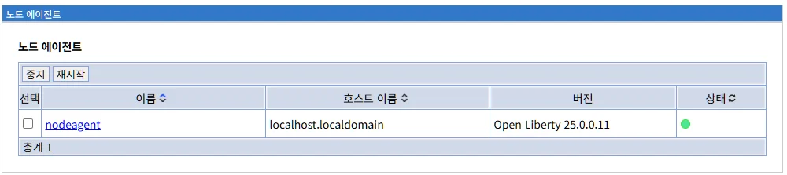

# 노드 에이전트 (Node Agent)

## 개요

노드 에이전트(Node Agent)는 각 노드에서 실행되는 관리 에이전트로, 배치 관리자(Deployment Manager)와 노드 간의 통신을 담당하는 핵심 컴포넌트입니다.

**주요 역할:**
- 배치 관리자와 노드 간 통신 중계
- 구성 동기화 수행
- 서버 생명주기 관리
- 상태 정보 보고
- 관리 명령 실행

**WebSphere ND와의 관계:**

WebSphere Network Deployment(ND)의 NodeAgent 개념을 Liberty 환경에 맞게 재해석한 구현입니다.

**WebSphere ND NodeAgent:**
```
역할:
- Deployment Manager의 대리자
- 노드 레벨 관리 작업 수행
- 파일 동기화 실행
- 서버 프로세스 시작/중지
- 상태 모니터링 및 보고

특징:
- Java 프로세스로 실행
- SOAP 프로토콜 사용
- 지속적인 dmgr 연결 유지
- 파일 기반 구성 동기화
```

**LibriX Node Agent:**
```
역할:
- 배치 관리자의 노드 대리자
- REST/HTTP 기반 통신
- 구성 동기화 실행
- Liberty 서버 관리
- 상태 정보 전송

특징:
- Liberty 서버로 실행
- REST API 사용
- 경량 런타임
- 데이터베이스 + 파일 기반 동기화
```

**Node Agent의 위치:**

```
아키텍처:
LibriX 환경
 └─ Deployment Manager (dmgr)
     └─ 통신 (REST/HTTPS)
         ↓
     Node: localhost.localdomain
     ├─ Node Agent ← 여기!
     │   └─ 관리 기능
     └─ Liberty Servers
         ├─ appServer01
         ├─ appServer02
         └─ webServer01
```

---

## 노드 에이전트 화면

### 메인 화면



노드 에이전트 화면은 등록된 모든 노드의 Node Agent 목록과 상태를 표시합니다.

**화면 경로:**
```
시스템 관리 > 노드 에이전트
```

**화면 구성:**

```
노드 에이전트

[중지]  [재시작]

선택    이름 ◊              호스트 이름 ◊             버전                   상태 ◊

☐       nodeagent          localhost.localdomain     Open Liberty 25.0.0.11    ●

총계 1
```

### 화면 요소

#### 상단 탭

**1. 중지**

```
[중지]
```

선택한 Node Agent를 중지합니다.

**프로세스:**
```
1. Node Agent 선택 (체크박스)
2. [중지] 클릭
3. 확인 다이얼로그
4. Node Agent 중지 실행
5. 상태 업데이트
```

**중지 시 영향:**

```
Node Agent 중지 시:
✗ dmgr와 통신 불가
✗ 구성 동기화 중단
✗ 중앙 관리 불가
✗ 서버 원격 시작/중지 불가

영향 없음:
✓ 이미 실행 중인 서버는 계속 실행
✓ 애플리케이션 서비스 정상 제공
✓ 서버는 독립 모드로 동작
```

**중지 시나리오:**

```
중지가 필요한 경우:
- Node Agent 설정 변경
- 문제 해결 (재시작)
- 유지보수 작업
- 노드 제거 준비

주의사항:
- 프로덕션 환경에서는 신중히 결정
- 동기화 필요 상태가 될 수 있음
- 재시작 후 동기화 확인 필요
```

**2. 재시작**

```
[재시작]
```

선택한 Node Agent를 재시작합니다.

**프로세스:**
```
1. Node Agent 선택
2. [재시작] 클릭
3. 확인 다이얼로그
4. 재시작 실행:
   - Node Agent 중지
   - 잠시 대기 (5초)
   - Node Agent 시작
5. dmgr 재연결
6. 상태 확인
```

**재시작 시나리오:**

```
재시작이 필요한 경우:

1. 구성 변경 적용
   - Node Agent의 JVM 설정 변경
   - 포트 변경
   - 네트워크 설정 변경

2. 문제 해결
   - dmgr 연결 문제
   - 메모리 누수 의심
   - 응답 없음 (Hang)

3. 업데이트 후
   - Liberty 버전 업그레이드
   - 패치 적용

4. 정기 유지보수
   - 로그 정리
   - 리소스 해제
```

**재시작 vs 중지:**

```
재시작:
- 자동으로 다시 시작
- 서비스 중단 최소화 (수십 초)
- 일반적인 유지보수

중지:
- 수동으로 다시 시작 필요
- 장기간 중지 가능
- 특별한 작업 필요 시
```

#### 노드 에이전트 목록 테이블

**테이블 컬럼:**

**1. 선택**
```
☐
```

Node Agent를 선택하기 위한 체크박스입니다.

**용도:**
- Node Agent 중지
- Node Agent 재시작
- 일괄 작업

**2. 이름 ◊**

```
이름 ◊
nodeagent
```

Node Agent의 이름입니다.

**특징:**
- 정렬 가능 (◊ 표시)
- 클릭 시 Node Agent 상세 화면으로 이동
- 일반적으로 "nodeagent" 고정

**명명:**

```
기본 이름:
nodeagent

WebSphere ND:
nodeagent

LibriX:
nodeagent (동일)

변경 가능 여부:
- 기술적으로 가능
- 일반적으로 변경하지 않음
- 표준 명명 유지 권장
```

**Node Agent 이름의 역할:**

```
역할:
1. Liberty 서버 이름
   - ${wlp.user.dir}/servers/nodeagent/
   
2. 프로세스 식별
   - ps -ef | grep nodeagent
   
3. 로그 파일명
   - nodeagent/logs/messages.log
   
4. 관리 명령 대상
   - server start nodeagent
```

**3. 호스트 이름 ◊**

```
호스트 이름 ◊
localhost.localdomain
```

Node Agent가 실행되는 호스트의 이름입니다.

**특징:**
- 정렬 가능
- 노드의 호스트 이름과 동일
- FQDN 또는 IP 주소

**중요성:**

```
역할:
1. Node Agent 위치 식별
   - 어느 호스트에서 실행 중인지

2. dmgr 연결 주소
   - dmgr가 Node Agent에 연결할 때 사용

3. 네트워크 라우팅
   - 방화벽 규칙
   - DNS 해석
```

**호스트 이름 패턴:**

| 환경 | 호스트 이름 예시 |
|------|------------------|
| **개발** | localhost.localdomain, dev-workstation |
| **테스트** | test-node01.company.com |
| **프로덕션** | prod-web01.company.com, app-server-01.dc1.company.com |

**4. 버전**

```
버전
Open Liberty 25.0.0.11
```

Node Agent가 실행 중인 Liberty 버전입니다.

**버전 정보:**

```
Open Liberty 25.0.0.11
│    │       └─ 빌드 번호
│    └─ 버전 (Year.Quarter.Release)
└─ 제품명

형식: YY.Q.R.BB
```

**버전 관리:**

```
중요성:
- dmgr와 동일 버전 권장
- 노드의 모든 서버와 동일 권장
- 버전 불일치 시 문제 발생 가능

확인 사항:
✓ dmgr 버전
✓ Node Agent 버전
✓ 애플리케이션 서버 버전
→ 모두 동일 권장
```

**버전 확인 방법:**

```bash
# Node Agent 버전
${wlp.install.dir}/bin/server version nodeagent

# 또는
${wlp.install.dir}/bin/server version

# 출력:
Product name: Open Liberty
Product version: 25.0.0.11
Product edition: Open
```

**5. 상태 ◊**

```
상태 ◊
●
```

Node Agent의 현재 실행 상태를 표시합니다.

**상태 표시:**

| 표시 | 색상 | 상태 | 의미 |
|------|------|------|------|
| **●** | 녹색 | STARTED | 실행 중, 정상 |
| **●** | 빨간색 | STOPPED | 중지됨 |
| **●** | 노란색 | STARTING | 시작 중 |
| **●** | 회색 | UNKNOWN | 알 수 없음, 연결 안 됨 |

**현재 화면:**
```
● (녹색)
→ Node Agent가 정상 실행 중
→ dmgr와 연결됨
```

**상태별 설명:**

**STARTED (녹색):**
```
의미:
- Node Agent 정상 실행
- dmgr와 연결됨
- 구성 동기화 가능
- 서버 관리 가능

확인:
- dmgr와 통신 정상
- 하트비트 정상
- 관리 작업 수행 가능
```

**STOPPED (빨간색):**
```
의미:
- Node Agent 중지됨
- dmgr와 연결 안 됨
- 관리 작업 불가

원인:
- 수동으로 중지
- 크래시
- 호스트 중지
- 네트워크 단절

조치:
- Node Agent 시작 필요
```

**STARTING (노란색):**
```
의미:
- Node Agent 시작 중
- JVM 초기화 중
- 곧 실행 상태로 전환

대기:
- 일반적으로 10-30초
- 완료 후 STARTED로 변경
```

**UNKNOWN (회색):**
```
의미:
- 상태 확인 불가
- dmgr가 Node Agent 상태를 모름

원인:
- 네트워크 단절
- Node Agent 응답 없음
- 호스트 접근 불가

조치:
- 네트워크 확인
- Node Agent 로그 확인
- 호스트 상태 확인
```

**상태 전환:**

```
정상 시작:
[STOPPED]
    ↓
[STARTING]
    ↓
[STARTED] ← 정상 상태

정상 중지:
[STARTED]
    ↓
[STOPPED]

비정상:
[STARTED]
    ↓
[UNKNOWN] ← 연결 끊김
```

#### 하단 정보

**총계**

```
총계 1
```

등록된 Node Agent의 총 개수를 표시합니다.

**의미:**
- 현재 LibriX에 등록된 노드 수
- 각 노드당 하나의 Node Agent

**노드 수 = Node Agent 수:**

```
예시:
노드 3개 → Node Agent 3개

Node 1: web01.company.com
 └─ Node Agent

Node 2: web02.company.com
 └─ Node Agent

Node 3: app01.company.com
 └─ Node Agent

총계: 3
```

---

## Node Agent의 역할

### 1. 통신 중계자

Node Agent는 dmgr와 노드 간의 모든 통신을 중계합니다.

**통신 흐름:**

```
Deployment Manager
        ↓
    (REST/HTTPS)
        ↓
    Node Agent
        ↓
    (로컬 통신)
        ↓
  Liberty Servers
```

**통신 유형:**

**1. 구성 동기화:**
```
dmgr → Node Agent:
"새로운 구성이 있습니다"

Node Agent:
1. 구성 다운로드
2. 로컬 파일 업데이트
3. 서버에 재로드 신호
```

**2. 상태 보고:**
```
Node Agent → dmgr:
"노드 상태 보고"

내용:
- Node Agent 상태
- 서버 상태 (실행/중지)
- 리소스 사용량
- 동기화 상태
```

**3. 관리 명령:**
```
dmgr → Node Agent:
"서버 시작해주세요"

Node Agent:
1. 명령 수신
2. 대상 서버 확인
3. 서버 시작 실행
4. 결과 보고
```

### 2. 구성 동기화

Node Agent는 구성 동기화의 실행 주체입니다.

**동기화 프로세스:**

```
1. dmgr에서 구성 변경 감지
   예: 새 데이터소스 생성
   ↓
2. Node Agent에 알림
   dmgr → Node Agent: "새 구성 v123"
   ↓
3. Node Agent가 현재 버전 확인
   현재: v122
   최신: v123
   → 동기화 필요
   ↓
4. 구성 다운로드
   Node Agent → dmgr: "v123 구성 요청"
   dmgr → Node Agent: 구성 파일 전송
   ↓
5. 로컬 파일 업데이트
   ${wlp.user.dir}/servers/appServer01/server.xml 수정
   ↓
6. 서버 재로드
   Liberty가 구성 변경 감지 및 자동 재로드
   ↓
7. 완료 보고
   Node Agent → dmgr: "동기화 완료"
```

**자동 vs 수동 동기화:**

**자동 동기화:**
```
조건:
- Node Agent 실행 중
- dmgr와 연결됨
- 자동 동기화 활성화 (기본값)

동작:
- 구성 변경 즉시 자동 동기화
- 주기적 체크 (기본 1분)
- 사용자 개입 불필요

장점:
- 즉시 적용
- 관리 부담 감소
```

**수동 동기화:**
```
조건:
- 자동 동기화 비활성화
- 또는 수동 트리거

동작:
- 관리자가 "동기화 확인" 클릭
- Node Agent가 동기화 수행

장점:
- 제어된 적용
- 계획된 변경
- 검토 후 적용
```

### 3. 서버 생명주기 관리

Node Agent는 노드의 서버들을 관리합니다.

**관리 작업:**

**서버 시작:**
```
dmgr → Node Agent:
"appServer01을 시작하세요"

Node Agent:
1. 서버 존재 확인
2. 시작 명령 실행
   ${wlp.install.dir}/bin/server start appServer01
3. 시작 프로세스 모니터링
4. 결과 보고
   → 성공 또는 실패
```

**서버 중지:**
```
dmgr → Node Agent:
"appServer01을 중지하세요"

Node Agent:
1. 서버 실행 확인
2. Graceful shutdown 실행
3. 중지 완료 대기 (타임아웃 30초)
4. 결과 보고
```

**서버 재시작:**
```
Node Agent:
1. 서버 중지
2. 대기 (5초)
3. 서버 시작
```

**서버 상태 확인:**
```
주기적 상태 확인:
- 실행 중 (STARTED)
- 중지됨 (STOPPED)
- 시작 중 (STARTING)

dmgr에 보고:
- 1분마다 (기본값)
- 상태 변경 시 즉시
```

### 4. 상태 모니터링

Node Agent는 노드와 서버의 상태를 모니터링합니다.

**모니터링 항목:**

**Node Agent 자체:**
```
- JVM 힙 사용량
- CPU 사용률
- 스레드 수
- 네트워크 연결 상태
```

**Liberty 서버:**
```
- 실행 상태
- 포트 사용
- 애플리케이션 상태
- 오류 로그
```

**시스템 리소스:**
```
- 디스크 공간
- 메모리 사용량
- 네트워크 대역폭
```

**모니터링 주기:**

```
하트비트: 30초마다
- Node Agent → dmgr
- "나 살아있어요"

상태 보고: 1분마다
- 서버 상태
- 리소스 사용량

이벤트 기반: 즉시
- 서버 시작/중지
- 오류 발생
- 구성 동기화 완료
```

### 5. 로그 수집

Node Agent는 로그 정보를 수집하여 dmgr에 전달합니다.

**로그 유형:**

**Node Agent 로그:**
```
위치:
${wlp.user.dir}/servers/nodeagent/logs/

파일:
- messages.log (일반 로그)
- trace.log (디버그 로그)
- ffdc/ (First Failure Data Capture)
```

**서버 로그:**
```
각 서버의 로그:
${wlp.user.dir}/servers/appServer01/logs/
- messages.log
- trace.log
- http_access.log
```

**로그 전송:**
```
dmgr 요청 시:
- 특정 로그 파일 전송
- 로그 검색 결과 전송
- 오류 로그 자동 전송
```

---

## Node Agent 구성

### Node Agent 설치 위치

```
Liberty 설치 경로:
/opt/ibm/wlp/

Node Agent 위치:
${wlp.user.dir}/servers/nodeagent/
├── server.xml (주 구성 파일)
├── bootstrap.properties (부트스트랩 설정)
├── jvm.options (JVM 설정)
├── logs/ (로그 디렉토리)
│   ├── messages.log
│   ├── trace.log
│   └── ffdc/
└── workarea/ (작업 디렉토리)
```

### server.xml 구성

Node Agent의 주 구성 파일입니다.

**기본 구성:**

```xml
<server description="Node Agent">
    <!-- 필수 기능 -->
    <featureManager>
        <feature>restConnector-2.0</feature>
        <feature>ssl-1.0</feature>
    </featureManager>
    
    <!-- 관리 포트 -->
    <httpEndpoint id="defaultHttpEndpoint"
                  httpPort="-1"
                  httpsPort="28000"
                  host="*">
        <tcpOptions soReuseAddr="true"/>
    </httpEndpoint>
    
    <!-- dmgr 연결 정보 -->
    <remoteFileAccess>
        <writeDir>${server.config.dir}</writeDir>
    </remoteFileAccess>
    
    <!-- SSL 구성 -->
    <ssl id="defaultSSLConfig"
         keyStoreRef="defaultKeyStore"
         trustStoreRef="defaultTrustStore"/>
         
    <keyStore id="defaultKeyStore"
              location="key.jks"
              password="{xor}Lz4sLChvLj4="/>
              
    <keyStore id="defaultTrustStore"
              location="trust.jks"
              password="{xor}Lz4sLChvLj4="/>
</server>
```

**주요 설정:**

**1. REST Connector:**
```xml
<feature>restConnector-2.0</feature>

역할:
- dmgr와 REST API 통신
- 관리 명령 수신
- 상태 정보 전송
```

**2. 관리 포트:**
```xml
<httpEndpoint httpsPort="28000" host="*">

기본 포트: 28000
호스트: * (모든 인터페이스)
프로토콜: HTTPS만
```

**3. SSL 설정:**
```xml
<ssl id="defaultSSLConfig">

인증서:
- key.jks (서버 인증서)
- trust.jks (신뢰 저장소)

용도:
- dmgr와 안전한 통신
- 상호 인증
```

### bootstrap.properties

부트스트랩 속성 파일입니다.

**파일 위치:**
```
${wlp.user.dir}/servers/nodeagent/bootstrap.properties
```

**주요 속성:**

```properties
# dmgr 연결 정보
dmgr.host=dmgr.company.com
dmgr.port=29043

# 노드 정보
node.name=localhost.localdomain

# 자동 동기화
auto.sync=true

# 동기화 간격 (초)
sync.interval=60

# 로그 설정
com.ibm.ws.logging.max.file.size=100
com.ibm.ws.logging.max.files=10
```

**주요 속성 설명:**

**dmgr.host:**
```
배치 관리자의 호스트 이름
예: dmgr.company.com, 192.168.1.100
```

**dmgr.port:**
```
배치 관리자의 관리 포트
기본값: 29043 (HTTPS)
```

**auto.sync:**
```
자동 동기화 활성화
true: 자동 동기화 (권장)
false: 수동 동기화만
```

**sync.interval:**
```
동기화 확인 간격 (초)
기본값: 60초
범위: 10-3600초
```

### jvm.options

JVM 옵션 파일입니다.

**파일 위치:**
```
${wlp.user.dir}/servers/nodeagent/jvm.options
```

**권장 설정:**

```
# 힙 크기
-Xms256m
-Xmx512m

# GC 로그
-Xgcpolicy:gencon
-Xverbosegclog:${server.output.dir}/logs/gc.log

# 시스템 속성
-Dcom.ibm.ws.logging.console.log.level=INFO
-Djava.net.preferIPv4Stack=true

# 인코딩
-Dfile.encoding=UTF-8
```

**힙 크기 가이드:**

```
Node Agent는 경량:
- 기본: 256-512 MB
- 많은 서버 (10개 이상): 512-1024 MB
- 대규모 환경: 1-2 GB
```

---

## Node Agent 시작 및 중지

### 시작

**Liberty 명령어:**
```bash
# Node Agent 시작
${wlp.install.dir}/bin/server start nodeagent

# 출력:
Starting server nodeagent.
Server nodeagent started with process ID 12345.
```

**시작 프로세스:**

```
1. JVM 시작
   - Liberty 런타임 초기화
   - 기능(features) 로드
   ↓
2. 구성 로드
   - server.xml 읽기
   - bootstrap.properties 적용
   ↓
3. 관리 서비스 시작
   - REST Connector 활성화
   - 관리 포트 오픈 (28000)
   ↓
4. dmgr 연결
   - dmgr.company.com:29043 연결
   - 인증 및 등록
   ↓
5. 초기 동기화
   - 구성 버전 확인
   - 필요 시 동기화 수행
   ↓
6. 준비 완료
   - 하트비트 시작
   - 관리 명령 대기
```

**시작 확인:**

```bash
# 상태 확인
${wlp.install.dir}/bin/server status nodeagent

# 출력:
Server nodeagent is running with process ID 12345.

# 로그 확인
tail -f ${wlp.user.dir}/servers/nodeagent/logs/messages.log

# 성공 메시지:
[INFO] CWWKF0011I: The nodeagent server is ready to run a smarter planet.
[INFO] Connected to deployment manager: dmgr.company.com:29043
```

**자동 시작 설정:**

**systemd 서비스 (Linux):**

```bash
# 서비스 파일 생성
sudo vi /etc/systemd/system/nodeagent.service

# 내용:
[Unit]
Description=Liberty Node Agent
After=network.target

[Service]
Type=forking
User=liberty
ExecStart=/opt/ibm/wlp/bin/server start nodeagent
ExecStop=/opt/ibm/wlp/bin/server stop nodeagent
Restart=on-failure

[Install]
WantedBy=multi-user.target

# 서비스 활성화
sudo systemctl enable nodeagent
sudo systemctl start nodeagent
```

### 중지

**Liberty 명령어:**
```bash
# 정상 종료
${wlp.install.dir}/bin/server stop nodeagent

# 강제 종료 (비권장)
${wlp.install.dir}/bin/server stop nodeagent --force

# 출력:
Stopping server nodeagent.
Server nodeagent stopped.
```

**중지 프로세스:**

```
1. 중지 신호 수신
   - 새로운 관리 명령 거부
   ↓
2. 진행 중인 작업 완료 대기
   - 동기화 완료
   - 관리 명령 완료
   - 타임아웃: 30초
   ↓
3. dmgr 연결 종료
   - dmgr에 중지 알림
   - 연결 정리
   ↓
4. 리소스 정리
   - 포트 해제
   - 스레드 종료
   ↓
5. JVM 종료
```

**중지 시 영향:**

```
Node Agent 중지 시:
✗ dmgr와 통신 불가
✗ 구성 동기화 중단
✗ 중앙에서 서버 관리 불가
✗ 상태 보고 중단

영향 없음:
✓ 실행 중인 서버는 계속 작동
✓ 애플리케이션 서비스 정상
✓ 서버는 독립 모드로 운영
```

### 재시작

**Liberty 명령어:**
```bash
# 재시작
${wlp.install.dir}/bin/server restart nodeagent

# 출력:
Stopping server nodeagent.
Server nodeagent stopped.
Starting server nodeagent.
Server nodeagent started with process ID 12346.
```

**재시작 = 중지 + 시작:**

```
프로세스:
1. Node Agent 중지
2. 잠시 대기 (자동)
3. Node Agent 시작
4. dmgr 재연결
5. 동기화 확인
```

**재시작 필요 시:**

```
언제 재시작하나?

1. 구성 변경 적용
   - JVM 설정 변경
   - 포트 변경
   - SSL 인증서 변경

2. 문제 해결
   - dmgr 연결 문제
   - 메모리 누수
   - 응답 없음

3. 업데이트 후
   - Liberty 버전 업그레이드
   - 패치 적용
```

---

## Node Agent 문제 해결

### 일반적인 문제

#### 문제 1: Node Agent 시작 실패

**증상:**
```
Server nodeagent failed to start.
```

**원인:**
1. 포트 충돌 (28000)
2. 구성 파일 오류
3. JVM 메모리 부족
4. Liberty 설치 문제

**해결 방법:**

**1. 포트 확인:**
```bash
# 28000 포트 사용 확인
netstat -an | grep 28000
lsof -i :28000

# 충돌 시 포트 변경 또는 프로세스 종료
```

**2. 로그 확인:**
```bash
cat ${wlp.user.dir}/servers/nodeagent/logs/messages.log

# 오류 메시지 확인
```

**3. 구성 검증:**
```bash
# server.xml 구문 확인
${wlp.install.dir}/bin/server validate nodeagent
```

**4. JVM 힙 증가:**
```
jvm.options:
-Xms256m → -Xms512m
-Xmx512m → -Xmx1024m
```

#### 문제 2: dmgr 연결 실패

**증상:**
```
로그: Failed to connect to deployment manager
상태: UNKNOWN (회색)
```

**원인:**
1. dmgr 중지됨
2. 네트워크 문제
3. 방화벽 차단
4. 잘못된 dmgr 주소

**해결 방법:**

**1. dmgr 상태 확인:**
```bash
# dmgr 실행 확인
${wlp.install.dir}/bin/server status dmgr
```

**2. 네트워크 테스트:**
```bash
# dmgr 접근 테스트
telnet dmgr.company.com 29043
ping dmgr.company.com

# DNS 확인
nslookup dmgr.company.com
```

**3. 방화벽 확인:**
```bash
# 노드에서 dmgr 포트 접근 가능한지
sudo firewall-cmd --list-all

# 필요 시 포트 개방
sudo firewall-cmd --permanent --add-port=29043/tcp
sudo firewall-cmd --reload
```

**4. 구성 확인:**
```bash
# bootstrap.properties 확인
cat ${wlp.user.dir}/servers/nodeagent/bootstrap.properties

# dmgr 주소가 올바른지 확인
dmgr.host=dmgr.company.com
dmgr.port=29043
```

#### 문제 3: 동기화 실패

**증상:**
```
로그: Configuration synchronization failed
노드 상태: UNSYNC (빨간색)
```

**원인:**
1. 디스크 공간 부족
2. 파일 권한 문제
3. 네트워크 단절
4. 구성 파일 잠금

**해결 방법:**

**1. 디스크 공간 확인:**
```bash
df -h ${wlp.user.dir}

# 부족 시 정리
du -sh ${wlp.user.dir}/servers/*/logs/
# 오래된 로그 삭제
```

**2. 파일 권한 확인:**
```bash
ls -la ${wlp.user.dir}/servers/

# 권한 문제 시 수정
chown -R liberty:liberty ${wlp.user.dir}/servers/
chmod -R 755 ${wlp.user.dir}/servers/
```

**3. 수동 동기화:**
```
LibriX 관리 콘솔:
노드 관리 > 노드 선택 > [동기화 확인]
```

**4. Node Agent 재시작:**
```bash
${wlp.install.dir}/bin/server restart nodeagent
```

#### 문제 4: 메모리 부족

**증상:**
```
java.lang.OutOfMemoryError: Java heap space
Node Agent 크래시
```

**원인:**
힙 크기 부족

**해결:**

```
jvm.options 수정:
-Xms256m → -Xms512m
-Xmx512m → -Xmx1024m

재시작:
${wlp.install.dir}/bin/server restart nodeagent
```

---

## WebSphere ND와의 비교

### 아키텍처 비교

**WebSphere ND NodeAgent:**

```
특징:
- Java 프로세스
- SOAP 프로토콜
- 파일 동기화
- 무거운 런타임
- 메모리: 512MB-1GB

구성:
- profileTemplates
- 복잡한 XML
- wsadmin 스크립팅
```

**LibriX Node Agent:**

```
특징:
- Liberty 서버
- REST/HTTP
- DB + 파일 동기화
- 경량 런타임
- 메모리: 256-512MB

구성:
- server.xml
- 간단한 설정
- 웹 기반 관리
```

### 기능 비교

| 기능 | WebSphere ND | LibriX |
|------|--------------|---------|
| **프로토콜** | SOAP | REST/HTTP |
| **시작 시간** | 1-2분 | 10-30초 |
| **메모리** | 512MB-1GB | 256-512MB |
| **구성** | 복잡 | 단순 |
| **관리** | wsadmin | 웹 콘솔 |
| **동기화** | 파일 기반 | DB + 파일 |

---

## 모범 사례

### 1. 자동 시작 설정

**systemd 서비스 사용:**
```
장점:
- 부팅 시 자동 시작
- 크래시 시 자동 재시작
- 중앙 관리 (systemctl)
```

### 2. 모니터링

**헬스 체크:**
```bash
# Node Agent 상태
${wlp.install.dir}/bin/server status nodeagent

# dmgr 연결 확인
tail -f ${wlp.user.dir}/servers/nodeagent/logs/messages.log | grep "deployment manager"
```

**주기적 확인:**
```
일일:
- Node Agent 실행 상태
- dmgr 연결 상태
- 동기화 상태

주간:
- 로그 검토
- 메모리 사용량
- 오류 패턴
```

### 3. 로그 관리

**로그 로테이션:**
```
bootstrap.properties:
com.ibm.ws.logging.max.file.size=100
com.ibm.ws.logging.max.files=10

결과:
- messages.log (최신)
- messages_20260115.log
- ...
- 10개 파일 유지, 자동 삭제
```

### 4. 보안

**SSL/TLS:**
```
필수:
- dmgr와 HTTPS 통신
- 인증서 검증
- 강력한 암호화

주기:
- 인증서 갱신
- 취약점 점검
```

---

## 참고 자료

### WebSphere ND 문서
- [Node Agent](https://www.ibm.com/docs/en/was-nd/9.0.5?topic=agents-node)
- [Configuration Synchronization](https://www.ibm.com/docs/en/was-nd/9.0.5?topic=synchronization-configuration)

### Liberty 문서
- [Liberty Collective Controller](https://www.ibm.com/docs/en/was-liberty/base?topic=liberty-creating-collective)
- [REST Connector](https://openliberty.io/docs/latest/reference/feature/restConnector-2.0.html)

### 관련 LibriX 문서
- [배치 관리자 관리](deployment-manager.md)
- [노드 관리](node-management.md)
- [클러스터 관리](../server/cluster.md)

---

## 요약

Node Agent는 배치 관리자와 노드 간의 통신을 담당하는 핵심 관리 에이전트입니다.

**주요 역할:**
- dmgr와 노드 간 통신 중계
- 구성 동기화 수행
- 서버 생명주기 관리
- 상태 모니터링 및 보고

**주요 기능:**
- REST/HTTP 기반 통신
- 자동/수동 동기화
- 경량 런타임 (256-512MB)
- 웹 기반 관리

**모범 사례:**
- 자동 시작 설정
- 정기 모니터링
- 로그 관리
- 보안 강화

Node Agent를 안정적으로 운영하여 효과적인 중앙 관리를 실현하세요!
