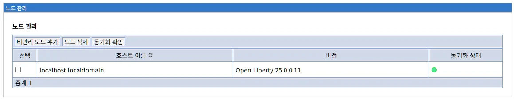
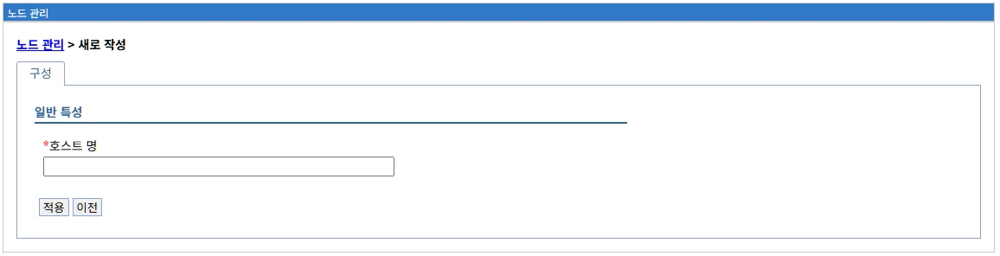

# 노드 관리 (Node Management)

## 개요

노드(Node)는 LibriX 환경에서 하나 이상의 Liberty 서버가 실행되는 논리적 또는 물리적 호스트를 나타냅니다. 노드 관리는 이러한 노드들을 배치 관리자에 등록하고 관리하는 기능입니다.

**주요 역할:**
- 노드 등록 및 관리
- 노드와 배치 관리자 연결
- 노드 상태 모니터링
- 구성 동기화 관리
- 노드별 서버 그룹 관리

**WebSphere ND와의 관계:**

WebSphere Network Deployment(ND)의 Node 개념을 Liberty 환경에 맞게 재해석한 구현입니다.

**WebSphere ND Node:**
```
개념:
- Cell 내의 관리 단위
- 물리적 또는 논리적 호스트
- NodeAgent가 실행되는 위치
- 여러 서버 인스턴스를 포함

구조:
Cell
 └─ Deployment Manager
     ├─ Node01 (Host1)
     │   ├─ NodeAgent
     │   └─ Server01, Server02, Server03
     ├─ Node02 (Host2)
     │   ├─ NodeAgent
     │   └─ Server04, Server05
     └─ ...
```

**LibriX Node:**
```
개념:
- 배치 관리자 관리 단위
- Liberty 서버들의 논리적 그룹
- Node Agent가 관리하는 영역
- 일반적으로 물리적 호스트와 1:1 대응

구조:
LibriX 환경
 └─ Deployment Manager
     ├─ localhost.localdomain (노드)
     │   ├─ Node Agent
     │   └─ appServer01, appServer02
     ├─ web01.company.com (노드)
     │   ├─ Node Agent
     │   └─ webServer01, webServer02
     └─ ...
```

**노드의 특징:**

```
1. 논리적 컨테이너:
   - 여러 Liberty 서버를 포함
   - 서버들의 관리 단위

2. 호스트 기반:
   - 일반적으로 물리적 호스트당 하나의 노드
   - 하나의 호스트에 여러 노드 가능 (드물게)

3. 독립적 관리:
   - 노드별 독립적인 구성
   - 노드별 동기화 제어

4. Node Agent 연결:
   - 각 노드는 Node Agent를 통해 dmgr과 통신
   - Node Agent가 노드의 대리자 역할
```

---

## 노드 관리 화면

### 메인 화면



노드 관리 화면은 등록된 모든 노드의 목록과 상태를 표시합니다.

**화면 경로:**
```
시스템 관리 > 노드 관리
```

**화면 구성:**

```
노드 관리

[비관리 노드 추가]  [노드 삭제]  [동기화 확인]

선택    호스트 이름 ◊              버전                   동기화 상태

☐       localhost.localdomain      Open Liberty 25.0.0.11    SYNC

총계 1
```

### 화면 요소

#### 상단 탭

**1. 비관리 노드 추가**

```
[비관리 노드 추가]
```

"비관리 노드"는 배치 관리자가 직접 생성하지 않은, 독립적으로 존재하던 노드를 의미합니다.

**용도:**
- 기존 Liberty 서버를 LibriX 관리 대상으로 추가
- 수동으로 설치된 서버 통합

**프로세스:**
```
1. 대상 호스트에 Liberty 설치
2. Node Agent 구성
3. "비관리 노드 추가" 클릭
4. 노드 정보 입력
5. 배치 관리자에 등록
```

**"비관리 노드" 용어 설명:**

```
비관리 노드 (Unmanaged Node):
- 배치 관리자가 직접 생성하지 않은 노드
- 독립적으로 존재하던 서버를 추가
- "관리되지 않던" 노드를 관리 대상으로 추가

대조 개념:
관리형 노드 (Managed Node):
- 배치 관리자가 생성한 노드
- 처음부터 LibriX로 관리
```

**WebSphere ND 대응:**
```
WebSphere ND: addNode 명령
wsadmin> addNode host user password

LibriX: "비관리 노드 추가" 버튼
```

**2. 노드 삭제**

```
[노드 삭제]
```

선택한 노드를 배치 관리자에서 제거합니다.

**삭제 프로세스:**
```
1. 노드 선택 (체크박스)
2. [노드 삭제] 클릭
3. 확인 다이얼로그
4. 배치 관리자에서 노드 등록 해제
5. 노드의 서버는 독립 실행 상태로 전환
```

**주의사항:**

```
노드 삭제 시:
✗ 배치 관리자에서 관리 불가
✗ 구성 동기화 중단
✗ 클러스터에서 제외 (소속 서버)
✗ 중앙 관리 불가

영향 없음:
✓ 서버는 계속 실행 (독립 모드)
✓ 애플리케이션 서비스 정상 제공
✓ 로컬 구성 파일은 그대로 유지
```

**삭제 vs 제거:**

```
노드 삭제 (배치 관리자에서):
- 관리 관계만 해제
- 서버 파일은 그대로

완전 제거:
- 노드 삭제 후
- 호스트에서 수동으로 파일 삭제
```

**3. 동기화 확인**

```
[동기화 확인]
```

선택한 노드의 구성 동기화 상태를 확인하고 필요 시 동기화를 수행합니다.

**기능:**
- 노드와 배치 관리자의 구성 비교
- 동기화 필요 여부 확인
- 수동 동기화 실행

**동기화 프로세스:**

```
1. [동기화 확인] 클릭
   ↓
2. 노드의 구성 버전과 dmgr의 마스터 구성 비교
   ↓
3. 결과 표시
   - "동기화됨": 구성 일치
   - "동기화 필요": 구성 불일치
   ↓
4. "동기화 필요" 시 동기화 수행 옵션
   ↓
5. 동기화 실행
   - 마스터 구성 다운로드
   - 노드 로컬 구성 업데이트
   - 서버 재로드
```

**동기화 상태:**

| 상태 | 의미 | 조치 |
|------|------|------|
| **동기화됨** | 구성 일치 | 없음 |
| **동기화 필요** | 구성 불일치 | 동기화 수행 |
| **동기화 실패** | 오류 발생 | 문제 해결 후 재시도 |

**WebSphere ND 대응:**
```
WebSphere ND: syncNode 명령
./syncNode.sh dmgrHost dmgrPort

LibriX: "동기화 확인" 버튼
```

#### 노드 목록 테이블

**테이블 컬럼:**

**1. 선택**
```
☐
```

노드를 선택하기 위한 체크박스입니다.

**용도:**
- 노드 삭제
- 동기화 확인
- 일괄 작업

**2. 호스트 이름 ◊**

```
호스트 이름 ◊
localhost.localdomain
```

노드의 호스트 이름 또는 FQDN입니다.

**특징:**
- 정렬 가능 (◊ 표시)
- 클릭 시 노드 상세 화면으로 이동

**명명 패턴:**

```
개발 환경:
localhost
localhost.localdomain

테스트 환경:
test-node01.company.com
app-test-01.internal.company.com

프로덕션 환경:
prod-web01.company.com
app-prod-01.datacenter1.company.com
```

**호스트 이름 중요성:**

```
역할:
1. 노드 식별자 (고유해야 함)
2. 네트워크 통신 주소
3. 서버 구성의 기준

요구사항:
- DNS 해석 가능
- 모든 노드에서 접근 가능
- 정적 IP 또는 고정 DNS
```

**3. 버전**

```
버전
Open Liberty 25.0.0.11
```

노드에 설치된 Liberty 런타임 버전입니다.

**버전 정보 구성:**

```
Open Liberty 25.0.0.11
│    │       └─ 빌드 번호
│    └─ 버전 번호 (Year.Quarter.Release)
└─ 제품명

버전 형식:
YY.Q.R.BB
- YY: 년도 (25 = 2025)
- Q: 분기 (0 = 첫 릴리스)
- R: 릴리스 (0 = 첫 릴리스)
- BB: 빌드 (11)
```

**버전 관리 중요성:**

```
주의사항:
1. 모든 노드는 동일 버전 권장
2. 버전 불일치 시 문제 발생 가능
3. 업그레이드는 계획적으로

점검 사항:
- dmgr 버전
- 노드 버전
- 서버 버전
→ 모두 동일 권장
```

**버전 확인 방법:**

**Liberty 명령어:**
```bash
# 버전 확인
${wlp.install.dir}/bin/server version

# 출력:
Product name: Open Liberty
Product version: 25.0.0.11
Product edition: Open
```

**server.xml:**
```xml
<!-- 버전 정보는 자동 생성됨 -->
```

**4. 동기화 상태**

```
동기화 상태
SYNC
```

노드의 구성 동기화 상태를 텍스트로 표시합니다.

**상태 표시:**

| 표시 | 색상 | 의미 |
|------|------|------|
| **SYNC** | 녹색 | 동기화됨 - 구성 일치, 정상 |
| **UNSYNC** | 빨간색 | 동기화 안 됨 - 구성 불일치, 동기화 필요 |
| **Unknown** | 회색 | 알 수 없음 - Node Agent 연결 안 됨 또는 상태 확인 불가 |

**현재 화면:**
```
SYNC (녹색)
→ 노드가 배치 관리자와 동기화됨
→ 정상 상태
```

**동기화 메커니즘:**

```
자동 동기화 (Node Agent가 활성화된 경우):
1. 배치 관리자가 구성 변경
   ↓
2. Node Agent에 알림
   ↓
3. Node Agent가 자동으로 동기화
   ↓
4. 상태: SYNC (녹색)

수동 동기화 필요:
1. 구성 변경 후 자동 동기화 안 됨
   ↓
2. 상태: UNSYNC (빨간색)
   ↓
3. "동기화 확인" 클릭하여 수동 동기화
   ↓
4. 상태: SYNC (녹색)

Node Agent 연결 안 됨:
1. Node Agent 중지 또는 네트워크 문제
   ↓
2. 상태: Unknown (회색)
   ↓
3. Node Agent 시작 또는 네트워크 복구
   ↓
4. 상태: SYNC 또는 UNSYNC로 변경
```

**동기화 필요 상황:**

```
SYNC (녹색):
- 노드와 dmgr 구성이 일치
- 정상 상태
- 조치 불필요

UNSYNC (빨간색):
- 노드와 dmgr 구성이 불일치
- 동기화 필요
- "동기화 확인" 버튼으로 동기화 수행

Unknown (회색):
- Node Agent가 중지됨
- 네트워크 연결 끊김
- 상태 확인 불가
- Node Agent 시작 또는 네트워크 확인 필요
```

**동기화가 필요한 경우:**

```
구성 변경 시:
- 새 데이터소스 생성
- JDBC 제공자 추가
- 공유 라이브러리 변경
- 가상호스트 수정
- 애플리케이션 배포/업데이트

확인 방법:
- 동기화 상태 컬럼 확인
- UNSYNC (빨간색) → 동기화 필요
- SYNC (녹색) → 동기화됨
- Unknown (회색) → Node Agent 확인 필요
```

#### 하단 정보

**총계**

```
총계 1
```

등록된 노드의 총 개수를 표시합니다.

**의미:**
- 현재 배치 관리자에 등록된 노드 수
- 필터링 적용 시 필터링된 결과 수

**노드 수 계획:**

```
소규모:
- 1-5개 노드
- 개발/테스트 환경

중규모:
- 6-20개 노드
- 중소 기업 프로덕션

대규모:
- 21-50개 노드
- 대기업 프로덕션

초대규모:
- 51개 이상 노드
- 글로벌 엔터프라이즈
```

---

## 노드의 개념

### 노드란?

노드(Node)는 다음과 같이 정의됩니다:

```
노드 = 호스트 + Node Agent + Liberty 서버들

구성 요소:
1. 물리적 또는 가상 호스트
2. Node Agent (관리 에이전트)
3. 하나 이상의 Liberty 서버
```

### 노드의 역할

**1. 서버 그룹화**

```
노드는 여러 서버를 논리적으로 그룹화:

예시:
Node: web01.company.com
 ├─ webServer01 (웹 서버)
 ├─ webServer02 (웹 서버)
 └─ appServer01 (앱 서버)

목적:
- 관리 단위화
- 자원 공유
- 일관된 구성
```

**2. 관리 단위**

```
노드 단위로 관리 작업 수행:

작업:
- 구성 동기화
- 일괄 시작/중지
- 모니터링
- 로그 수집
```

**3. 배포 대상**

```
애플리케이션 배포 시 노드 지정:

배포 프로세스:
1. 애플리케이션 선택
   ↓
2. 배포 대상 선택
   - 클러스터 (여러 노드)
   - 특정 노드
   - 특정 서버
   ↓
3. 노드별로 배포 실행
```

**4. 장애 격리**

```
노드 단위로 장애 격리:

시나리오:
Node01에서 문제 발생
 → Node01의 서버만 영향
 → Node02, Node03은 정상 운영

장점:
- 부분 장애 허용
- 서비스 연속성
- 점진적 복구
```

### 노드와 호스트

**관계:**

```
일반적인 경우 (1:1):
물리 호스트 1개 = 노드 1개

예시:
서버: web01.company.com
노드: web01.company.com
IP: 192.168.1.100
```

**특수한 경우 (1:N):**

```
하나의 호스트에 여러 노드:

예시:
물리 호스트: bigserver.company.com
 ├─ 노드1: web-node
 ├─ 노드2: app-node
 └─ 노드3: batch-node

이유:
- 논리적 분리
- 환경 분리 (dev, test)
- 자원 분할
```

**권장 사항:**

```
프로덕션:
- 1 호스트 = 1 노드 (권장)
- 간단하고 명확
- 관리 용이

개발/테스트:
- 1 호스트 = 여러 노드 (허용)
- 자원 절약
- 환경 시뮬레이션
```

### 노드와 클러스터

**관계:**

```
클러스터는 여러 노드의 서버들로 구성:

예시:
클러스터: WebCluster
 ├─ Node01 → webServer01
 ├─ Node02 → webServer02
 └─ Node03 → webServer03

특징:
- 노드 경계를 넘어 클러스터 구성
- 고가용성
- 로드 밸런싱
```

**클러스터 배포:**

```
클러스터에 애플리케이션 배포 시:

프로세스:
1. 클러스터 선택 (WebCluster)
   ↓
2. 멤버 서버 확인
   - webServer01 (Node01)
   - webServer02 (Node02)
   - webServer03 (Node03)
   ↓
3. 각 노드로 순차적으로 배포
   - Node01 → webServer01
   - Node02 → webServer02
   - Node03 → webServer03
   ↓
4. 모든 멤버에서 애플리케이션 시작
```

---

## 노드 등록 (비관리 노드 추가)

### 노드 등록 개요

기존에 독립적으로 운영되던 Liberty 서버를 LibriX 배치 관리자의 관리 대상으로 추가하는 프로세스입니다.

**시나리오:**

```
상황:
- 호스트: app01.company.com
- Liberty 서버: 수동으로 설치 및 운영 중
- 요구사항: LibriX로 중앙 관리

목표:
독립 서버 → LibriX 관리 노드
```

### 비관리 노드 추가 화면



"비관리 노드 추가" 버튼을 클릭하면 새로운 노드를 등록하는 화면이 나타납니다.

**화면 경로:**
```
시스템 관리 > 노드 관리 > [비관리 노드 추가]
```

**브레드크럼:**
```
노드 관리 > 새로 작성
```

**화면 구성:**

```
노드 관리 > 새로 작성

[구성]

일반 특성

*호스트 명
[                                      ]

[적용]  [이전]
```

### 입력 필드

#### 호스트 명 (필수)

```
*호스트 명
[                                      ]
```

추가할 노드의 호스트 이름 또는 FQDN(Fully Qualified Domain Name)을 입력합니다.

**입력 형식:**

**FQDN (권장):**
```
app01.company.com
web-server-01.internal.company.com
liberty-node-01.datacenter1.company.com
prod-app-server.company.com
```

**짧은 호스트명:**
```
app01
webserver01
node01
```

**IP 주소:**
```
192.168.1.100
10.0.0.50
172.16.0.10
```

**입력 예시:**

| 환경 | 예시 호스트명 | 설명 |
|------|---------------|------|
| **개발** | localhost.localdomain | 로컬 개발 |
| **테스트** | test-app01.company.com | 테스트 서버 |
| **프로덕션** | prod-web01.company.com | 프로덕션 웹 서버 |
| **다중 DC** | app01.dc1.company.com | 데이터센터1 앱 서버 |

**호스트명 요구사항:**

```
필수 조건:
1. DNS 해석 가능
   - nslookup app01.company.com
   - 정상적인 IP 주소 반환

2. 네트워크 접근 가능
   - 배치 관리자에서 접근 가능
   - ping app01.company.com 성공

3. 고유성
   - 다른 노드와 중복되지 않음
   - Cell 내에서 유일

4. 정적 주소
   - DHCP로 변경되지 않음
   - 고정 IP 또는 고정 DNS
```

**명명 규칙:**

```
권장 패턴:

1. 역할 기반:
   web-server-01
   app-server-01
   batch-server-01

2. 환경-역할-번호:
   prod-web-01
   test-app-01
   dev-batch-01

3. 위치-역할-번호:
   dc1-web-01
   dc2-app-01
   seoul-batch-01

4. FQDN:
   web01.company.com
   app01.internal.company.com
```

**주의사항:**

```
피해야 할 패턴:

✗ localhost
  - 다른 노드와 구분 안 됨
  
✗ server, node, host
  - 너무 일반적
  
✗ 192.168.1.100
  - IP 주소만 사용 (DNS 권장)
  
✗ temp, test, old
  - 임시 이름
```

### 등록 전 준비사항

비관리 노드를 추가하기 전에 대상 호스트에서 다음 준비 작업을 완료해야 합니다.

**1. Liberty 설치**

```
대상 호스트에 Liberty 설치:

설치 경로 예시:
/opt/ibm/wlp

확인 명령:
${wlp.install.dir}/bin/server version

출력:
Product name: Open Liberty
Product version: 25.0.0.11
```

**2. Node Agent 생성**

```
Node Agent 생성:

명령:
${wlp.install.dir}/bin/server create nodeagent

디렉토리 생성:
${wlp.user.dir}/servers/nodeagent/
├── server.xml
├── bootstrap.properties
└── jvm.options
```

**3. Node Agent 구성**

```
server.xml 편집:
${wlp.user.dir}/servers/nodeagent/server.xml

필수 설정:
- 관리 기능 활성화
- 배치 관리자 연결 정보
- 포트 설정
```

**4. 네트워크 연결 확인**

```
확인 사항:

1. 배치 관리자 접근:
   telnet dmgr.company.com 29043
   
2. DNS 해석:
   nslookup app01.company.com
   
3. Ping 테스트:
   ping dmgr.company.com
```

**5. 방화벽 규칙**

```
개방 필요 포트:

노드 → dmgr:
- 29043 (관리 포트)

dmgr → 노드:
- Node Agent 포트 (기본: 28000대)

확인:
sudo firewall-cmd --list-ports
```

### 등록 프로세스

**단계 1: 호스트명 입력**

```
노드 관리 > 새로 작성

호스트 명 입력:
*호스트 명
[app01.company.com]
```

**단계 2: 적용 클릭**

```
[적용] 버튼 클릭

진행 과정:
1. 호스트명 유효성 검사
   - DNS 해석 확인
   - 중복 검사
   
2. 대상 호스트 연결 시도
   - Node Agent 포트 접근
   - 버전 확인
   
3. 노드 등록
   - 배치 관리자에 노드 추가
   - 초기 구성 정보 수집
   
4. 초기 동기화
   - 마스터 구성 전송
   - 로컬 구성 생성
```

**단계 3: 등록 완료**

```
성공 메시지:
"노드가 성공적으로 추가되었습니다."

노드 목록으로 자동 이동:
- 새로운 노드가 목록에 표시
- 동기화 상태: ● (녹색)
```

### 등록 후 확인

**1. 노드 목록 확인**

```
노드 관리 화면:

선택    호스트 이름                버전                   동기화 상태
☐       localhost.localdomain      Open Liberty 25.0.0.11    SYNC
☐       app01.company.com          Open Liberty 25.0.0.11    SYNC

총계 2
```

**2. Node Agent 로그 확인**

```bash
# Node Agent 로그
tail -f ${wlp.user.dir}/servers/nodeagent/logs/messages.log

# 성공 메시지 확인:
[INFO] Connected to deployment manager: dmgr.company.com:29043
[INFO] Initial synchronization completed
```

**3. 배치 관리자 로그 확인**

```bash
# Dmgr 로그
tail -f ${wlp.user.dir}/servers/dmgr/logs/messages.log

# 노드 등록 메시지 확인:
[INFO] Node registered: app01.company.com
[INFO] Initial configuration synchronized
```

**4. 동기화 상태 확인**

```
노드 관리 화면:
- 동기화 상태: SYNC (녹색)
- 버전: 일치 확인
```

### 등록 문제 해결

#### 문제 1: 호스트명 해석 실패

**증상:**
```
오류: "호스트를 찾을 수 없습니다"
```

**원인:**
DNS 해석 실패

**해결:**

```bash
# DNS 확인
nslookup app01.company.com

# 실패 시 /etc/hosts 추가
sudo vi /etc/hosts

# 내용 추가:
192.168.1.100  app01.company.com  app01
```

#### 문제 2: 연결 실패

**증상:**
```
오류: "Node Agent에 연결할 수 없습니다"
```

**원인:**
1. Node Agent 미실행
2. 방화벽 차단
3. 포트 충돌

**해결:**

**Node Agent 시작:**
```bash
${wlp.install.dir}/bin/server start nodeagent
```

**방화벽 확인:**
```bash
# 포트 개방
sudo firewall-cmd --permanent --add-port=28000/tcp
sudo firewall-cmd --reload
```

**연결 테스트:**
```bash
telnet app01.company.com 28000
```

#### 문제 3: 버전 불일치

**증상:**
```
경고: "Liberty 버전이 배치 관리자와 다릅니다"
```

**원인:**
노드와 dmgr의 Liberty 버전 차이

**확인:**

```bash
# Dmgr 버전
${wlp.install.dir}/bin/server version dmgr

# 노드 버전
${wlp.install.dir}/bin/server version nodeagent
```

**해결:**
```
권장: 모든 노드와 dmgr를 동일 버전으로 유지
→ 버전 업그레이드 또는 다운그레이드
```

#### 문제 4: 중복 노드

**증상:**
```
오류: "이미 등록된 노드입니다"
```

**원인:**
같은 호스트명의 노드가 이미 존재

**해결:**

```
1. 기존 노드 확인
   - 노드 관리 목록에서 확인
   
2. 옵션 선택:
   a. 기존 노드 사용
   b. 기존 노드 삭제 후 재등록
   c. 다른 호스트명 사용
```

### 등록 시나리오

#### 시나리오 1: 개발 환경에 노드 추가

```
상황:
- 개발자 로컬 머신
- Liberty 수동 설치
- 테스트용 서버 운영 중

목표:
LibriX로 통합 관리

단계:
1. Node Agent 생성 및 구성
2. 호스트명: dev-workstation.company.com
3. 비관리 노드 추가
4. 초기 동기화
5. 개발 서버 추가 관리
```

#### 시나리오 2: 프로덕션 서버 통합

```
상황:
- 프로덕션 웹 서버 3대
- 독립적으로 운영 중
- 중앙 관리 필요

목표:
LibriX로 클러스터 구성

단계:
1. 각 서버에 Node Agent 구성
   - web01.company.com
   - web02.company.com
   - web03.company.com
   
2. 순차적으로 노드 추가
   - 서비스 중단 최소화
   
3. 클러스터 구성
   - WebCluster 생성
   - 3개 노드의 서버 추가
   
4. 로드 밸런서 연동
```

#### 시나리오 3: 데이터센터 확장

```
상황:
- 신규 데이터센터 오픈
- Liberty 서버 10대 설치
- 기존 LibriX 환경에 통합

목표:
멀티 데이터센터 관리

단계:
1. 네트워크 연결 확인
   - VPN 또는 전용선
   - dmgr 접근 가능
   
2. 명명 규칙 적용
   - dc2-web-01 ~ dc2-web-05
   - dc2-app-01 ~ dc2-app-05
   
3. 일괄 노드 추가
   - 스크립트 활용 가능
   
4. 구성 동기화 확인
```

---

## 노드 삭제

### 삭제 프로세스

**1. 노드 선택**

```
노드 관리 화면:
☑ localhost.localdomain 선택
```

**2. 노드 삭제 클릭**

```
[노드 삭제] 버튼 클릭
```

**3. 확인 다이얼로그**

```
경고:
"선택한 노드를 삭제하시겠습니까?
노드의 서버는 독립 실행 상태로 전환됩니다."

[확인]  [취소]
```

**4. 삭제 실행**

```
프로세스:
1. Node Agent 연결 해제
2. 배치 관리자에서 노드 정보 삭제
3. 클러스터 멤버십 제거 (해당 서버)
4. 완료
```

### 삭제 후 상태

**배치 관리자:**
```
노드 목록에서 제거됨
관리 불가 상태
```

**노드 (호스트):**
```
Node Agent: 실행 중 (dmgr 연결 안 됨)
Liberty 서버: 실행 중 (독립 모드)
구성 파일: 그대로 유지
```

**복원 방법:**
```
"비관리 노드 추가"로 재등록 가능
```

---

## 구성 동기화

### 동기화 개념

구성 동기화는 배치 관리자의 마스터 구성을 노드의 로컬 구성과 일치시키는 프로세스입니다.

**마스터 구성:**
```
위치: 배치 관리자 (dmgr)
내용: Cell, 노드, 서버의 전체 구성
형식: XML + 데이터베이스
```

**로컬 구성:**
```
위치: 각 노드
내용: 해당 노드와 서버의 구성
형식: XML 파일 (server.xml 등)
```

**동기화 필요성:**

```
시나리오:
1. 관리자가 dmgr에서 데이터소스 생성
   ↓
2. dmgr의 마스터 구성 업데이트
   ↓
3. 노드의 로컬 구성은 구버전
   ↓
4. 동기화 필요 상태
   ↓
5. 동기화 수행
   ↓
6. 노드의 server.xml 업데이트
   ↓
7. 서버 재로드 → 새 데이터소스 사용 가능
```

### 자동 동기화

**Node Agent 역할:**

```
Node Agent가 활성화되어 있으면:

1. dmgr의 구성 변경 감지
   ↓
2. 자동으로 동기화 시작
   ↓
3. 로컬 구성 업데이트
   ↓
4. 서버에 재로드 신호
   ↓
5. 완료 (● 녹색 유지)
```

**주기적 체크:**

```
Node Agent는 주기적으로 dmgr와 통신:

간격: 1분 (기본값)
확인: 구성 버전 비교
동작: 불일치 시 자동 동기화
```

### 수동 동기화

**필요한 경우:**

```
상황:
- Node Agent 일시 중단
- 네트워크 단절
- 자동 동기화 비활성화
- 수동 제어 필요
```

**수행 방법:**

```
1. 노드 관리 화면
   ↓
2. 노드 선택
   ↓
3. [동기화 확인] 클릭
   ↓
4. 상태 확인
   - "동기화됨" → 작업 없음
   - "동기화 필요" → 동기화 수행
   ↓
5. 동기화 실행
   ↓
6. 완료 확인
```

### 동기화 문제 해결

#### 문제 1: 동기화 실패

**증상:**
```
동기화 상태: UNSYNC (빨간색)
오류 메시지: "동기화 실패"
```

**원인:**
1. Node Agent 중지됨
2. 네트워크 연결 끊김
3. 디스크 공간 부족
4. 파일 권한 문제

**해결:**

**Node Agent 확인:**
```bash
${wlp.install.dir}/bin/server status nodeagent

# 중지되어 있으면 시작
${wlp.install.dir}/bin/server start nodeagent
```

**네트워크 확인:**
```bash
# dmgr 연결 테스트
telnet dmgr.company.com 29043
ping dmgr.company.com
```

**디스크 공간:**
```bash
df -h ${wlp.user.dir}
```

**파일 권한:**
```bash
ls -la ${wlp.user.dir}/servers/
# 필요 시 권한 수정
chmod -R 755 ${wlp.user.dir}/servers/
```

#### 문제 2: Unknown 상태

**증상:**
```
동기화 상태: Unknown (회색)
```

**원인:**
1. Node Agent가 실행되지 않음
2. dmgr와 노드 간 네트워크 단절
3. 방화벽 차단
4. Node Agent 구성 오류

**해결:**

**1. Node Agent 상태 확인:**
```bash
# Node Agent 상태
${wlp.install.dir}/bin/server status nodeagent

# 중지되어 있으면:
Server nodeagent is not running.

# 시작
${wlp.install.dir}/bin/server start nodeagent
```

**2. 네트워크 연결 확인:**
```bash
# dmgr 접근 테스트
telnet dmgr.company.com 29043

# 실패 시:
telnet: Unable to connect to remote host: Connection refused
```

**3. 방화벽 확인:**
```bash
# 노드에서 dmgr로 접근 가능한지 확인
sudo firewall-cmd --list-all

# 필요 시 포트 개방
sudo firewall-cmd --permanent --add-port=29043/tcp
sudo firewall-cmd --reload
```

**4. Node Agent 로그 확인:**
```bash
tail -f ${wlp.user.dir}/servers/nodeagent/logs/messages.log

# 연결 오류 확인:
[ERROR] Failed to connect to deployment manager
```

**5. dmgr 연결 정보 확인:**
```bash
# bootstrap.properties 확인
cat ${wlp.user.dir}/servers/nodeagent/bootstrap.properties

# dmgr 주소가 올바른지 확인
dmgr.host=dmgr.company.com
dmgr.port=29043
```

#### 문제 3: 동기화 느림

**증상:**
```
동기화 시간이 매우 오래 걸림 (5분 이상)
```

**원인:**
1. 네트워크 대역폭 부족
2. 파일 크기가 큼 (대용량 애플리케이션)
3. dmgr 부하 높음

**해결:**

**네트워크 확인:**
```bash
# 대역폭 테스트
iperf3 -c dmgr.company.com
```

**파일 크기 확인:**
```bash
du -sh ${wlp.user.dir}/servers/*/apps/
```

**dmgr 모니터링:**
```bash
# CPU, 메모리 확인
top
```

---

## 노드 상세 화면

(추가 화면 캡처 필요: 노드 이름 클릭 시 나오는 상세 화면)

노드 목록에서 노드 이름(예: localhost.localdomain)을 클릭하면 노드 상세 화면으로 이동합니다.

**예상 화면 구성:**

```
노드: localhost.localdomain

[구성]  [런타임]

일반 특성
- 노드 이름
- 호스트 이름
- Liberty 버전
- Node Agent 포트

서버 목록
- 서버1 이름, 상태
- 서버2 이름, 상태

동기화 정보
- 마지막 동기화 시간
- 동기화 상태
```

---

## WebSphere ND와의 비교

### 아키텍처 비교

**WebSphere ND Node:**

```
구조:
Cell → Deployment Manager → Node → NodeAgent → Servers

관리:
- Cell 레벨 구성
- 파일 기반 동기화
- SOAP 프로토콜
```

**LibriX Node:**

```
구조:
LibriX 환경 → Deployment Manager → Node → Node Agent → Servers

관리:
- 데이터베이스 + 파일 기반
- REST/HTTP 프로토콜
- 웹 기반 관리
```

### 기능 비교

| 기능 | WebSphere ND | LibriX |
|------|--------------|---------|
| **노드 추가** | addNode 명령 | "바라미 노드 추가" |
| **동기화** | syncNode 명령 | "동기화 확인" 버튼 |
| **관리 도구** | wsadmin | 웹 관리 콘솔 |
| **프로토콜** | SOAP | REST/HTTP |
| **구성 저장** | XML 파일 | DB + XML |

### 마이그레이션

WebSphere ND에서 LibriX로 마이그레이션 시:

**노드 재생성:**
```
1. WAS ND 노드 정보 추출
2. LibriX에서 노드 생성
3. 서버 구성 이전
4. 애플리케이션 재배포
```

**주의사항:**
```
- 노드 이름 매핑
- 포트 번호 조정
- 구성 변환 필요
- 철저한 테스트
```

---

## 모범 사례

### 1. 노드 명명 규칙

**일관된 명명:**

```
패턴 1: 호스트명 사용
web01.company.com

패턴 2: 역할 + 순번
web-node-01
app-node-01

패턴 3: 환경 + 역할 + 순번
prod-web-node-01
test-app-node-01
```

### 2. 노드 구성 계획

**물리적 분리:**

```
권장:
- 웹 서버 노드
- 애플리케이션 서버 노드
- 배치 서버 노드
- 분리된 호스트

장점:
- 자원 격리
- 장애 격리
- 성능 최적화
```

### 3. 동기화 모니터링

**정기 확인:**

```
일일:
- 동기화 상태 확인
- ● (녹색) 확인

주간:
- Node Agent 로그 검토
- 동기화 이력 확인
```

### 4. 백업 전략

**노드 구성 백업:**

```bash
# 노드 디렉토리 전체 백업
tar -czf node-backup-$(date +%Y%m%d).tar.gz \
    ${wlp.user.dir}/servers/
```

---

## 참고 자료

### WebSphere ND 문서
- [Node Management](https://www.ibm.com/docs/en/was-nd/9.0.5?topic=servers-managing-nodes)
- [Node Agent](https://www.ibm.com/docs/en/was-nd/9.0.5?topic=agents-node)
- [Configuration Synchronization](https://www.ibm.com/docs/en/was-nd/9.0.5?topic=synchronization-configuration)

### Liberty 문서
- [Liberty Collective](https://www.ibm.com/docs/en/was-liberty/base?topic=liberty-creating-collective)
- [Server Configuration](https://openliberty.io/docs/latest/reference/config/server-configuration-overview.html)

### 관련 LibriX 문서
- [배치 관리자 관리](deployment-manager.md)
- [노드 에이전트 관리](node-agent.md)
- [클러스터 관리](../server/cluster.md)

---

## 요약

노드 관리는 Liberty 서버들의 논리적 그룹인 노드를 배치 관리자에서 관리하는 기능입니다.

**주요 기능:**
- 노드 등록 (바라미 노드 추가)
- 노드 삭제
- 구성 동기화
- 노드 상태 모니터링

**핵심 개념:**
- 노드 = 호스트 + Node Agent + 서버들
- 관리 단위화
- 중앙 집중식 구성 관리
- 자동/수동 동기화

**WebSphere ND 대비:**
- 경량 런타임
- 웹 기반 관리
- REST/HTTP 프로토콜
- 간편한 노드 관리

노드 관리를 효과적으로 활용하여 분산 Liberty 환경을 체계적으로 관리하세요!
