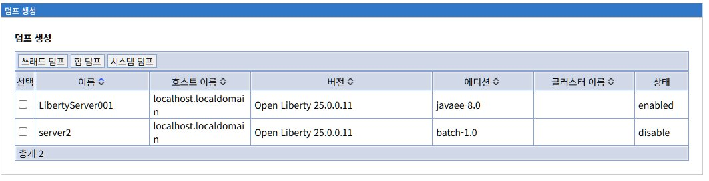
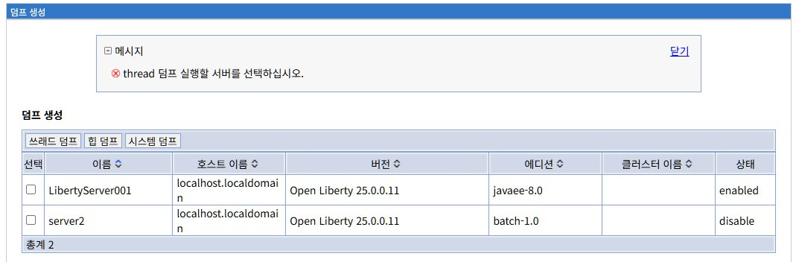
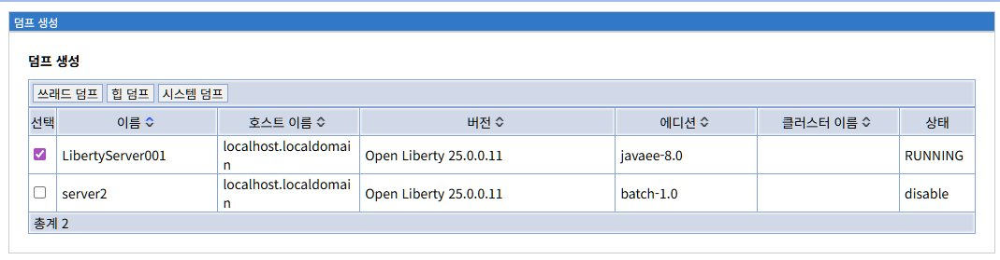
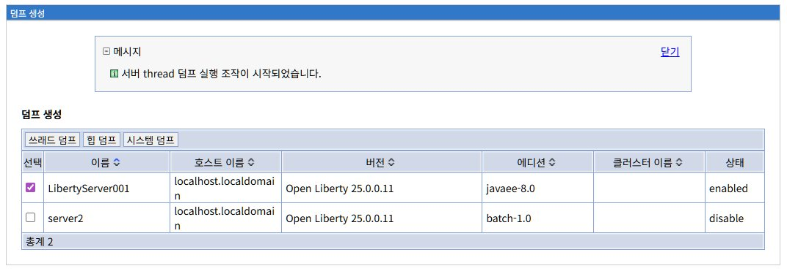
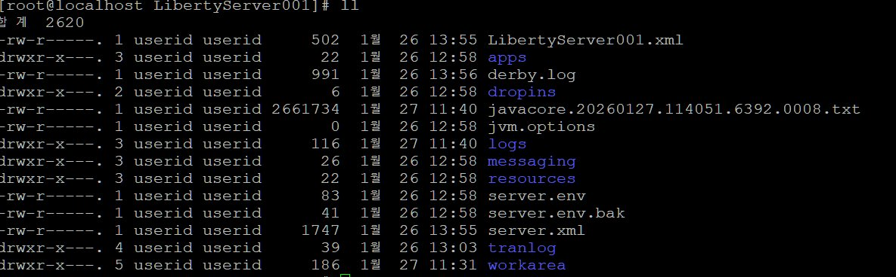
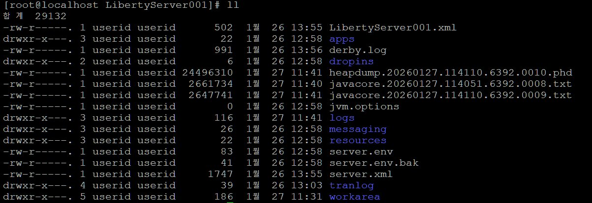
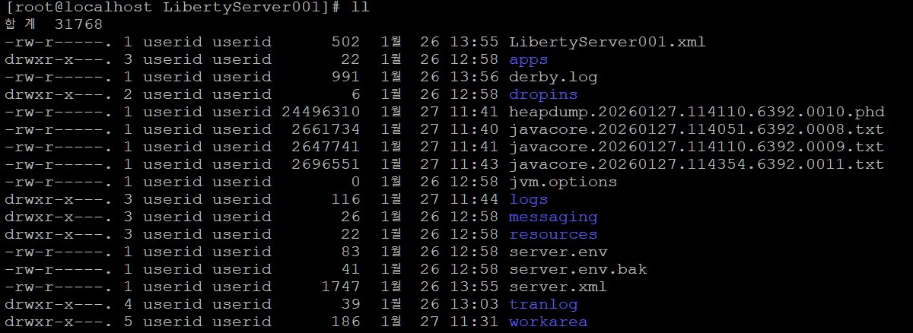

# 덤프생성

Liberty 서버의 문제를 진단하기 위해 스레드 덤프, 힙 덤프, 시스템 덤프를 생성하는 방법을 설명합니다.

## 목차

- [덤프생성 개요](#덤프생성-개요)
- [덤프 유형](#덤프-유형)
- [스레드 덤프](#스레드-덤프)
- [힙 덤프](#힙-덤프)
- [시스템 덤프](#시스템-덤프)
- [덤프 분석 도구](#덤프-분석-도구)
- [실전 문제 해결](#실전-문제-해결)

---

## 덤프생성 개요

### 덤프란?

덤프(Dump)는 특정 시점의 JVM 또는 시스템 상태를 파일로 저장한 것입니다. 문제 진단과 성능 분석에 필수적인 도구입니다.

**화면 경로:**
```
문제 분석 > 덤프생성
```

### LibriX 덤프 생성 시스템

LibriX는 Liberty의 `server dump` 명령을 웹 UI로 제공하여, 복잡한 명령줄 없이 클릭만으로 덤프를 생성할 수 있습니다.

**지원하는 덤프 유형:**
- **스레드 덤프**: 모든 스레드의 상태와 스택 트레이스
- **힙 덤프**: 힙 메모리의 모든 객체
- **시스템 덤프**: JVM과 프로세스의 전체 메모리

### 덤프생성 메인 화면



**화면 구성:**

**3개 탭**:
- **스레드 덤프**: 스레드 상태 및 데드락 분석
- **힙 덤프**: 메모리 누수 및 객체 분석
- **시스템 덤프**: JVM 크래시 및 네이티브 메모리 분석

**서버 목록 테이블**:

| 컬럼 | 설명 |
|------|------|
| **선택** | 체크박스로 서버 선택 (단일 선택) |
| **이름** | 서버명 (예: LibertyServer001, server2) |
| **호스트 이름** | 서버가 실행 중인 호스트 |
| **버전** | Liberty 버전 (예: Open Liberty 25.0.0.11) |
| **에디션** | Liberty 프로파일 (javaee-8.0, batch-1.0 등) |
| **클러스터 이름** | 소속 클러스터 (없으면 빈칸) |
| **상태** | enabled / disable |

**서버 상태**:
- **enabled**: 서버 실행 중 (덤프 생성 가능)
- **disable**: 서버 중지됨 (덤프 생성 불가)
- **RUNNING**: 덤프 생성 진행 중

**예시 데이터**:
```
이름                | 호스트 이름              | 버전                    | 에디션        | 클러스터 | 상태
LibertyServer001   | localhost.localdomain   | Open Liberty 25.0.0.11 | javaee-8.0   |          | enabled
server2            | localhost.localdomain   | Open Liberty 25.0.0.11 | batch-1.0    |          | disable
```

---

## 덤프 유형

### 덤프 유형 비교

| 덤프 유형 | 파일 크기 | 생성 시간 | 주요 용도 |
|----------|----------|----------|----------|
| **스레드 덤프** | ~3 MB | 1-2초 | 응답 없음, 데드락, 높은 CPU |
| **힙 덤프** | 힙 크기의 30-50% | 5-30초 | 메모리 누수, OutOfMemoryError |
| **시스템 덤프** | 프로세스 크기 | 10-60초 | JVM 크래시, 네이티브 메모리 문제 |

### 덤프 파일 저장 위치

모든 덤프 파일은 서버 디렉토리에 저장됩니다:

```
${wlp.user.dir}/servers/{serverName}/

예시:
/wlp/usr/servers/LibertyServer001/javacore.20260127.114051.6392.0008.txt
/wlp/usr/servers/LibertyServer001/heapdump.20260127.114110.6392.0010.phd
```

### 파일명 규칙

**스레드 덤프**:
```
javacore.{날짜}.{시간}.{프로세스ID}.{시퀀스}.txt

예시:
javacore.20260127.114051.6392.0008.txt
         YYYYMMDD HHMMSS  PID  SEQ
```

**힙 덤프**:
```
heapdump.{날짜}.{시간}.{프로세스ID}.{시퀀스}.phd

예시:
heapdump.20260127.114110.6392.0010.phd
         YYYYMMDD HHMMSS  PID  SEQ
```

---

## 스레드 덤프

### 스레드 덤프 개요

스레드 덤프(Thread Dump)는 특정 시점에 JVM 내 모든 스레드의 상태와 스택 트레이스를 담은 텍스트 파일입니다.

**생성 파일**:
```
javacore.{timestamp}.txt  (약 2-3 MB)
```

**포함 정보**:
- 모든 스레드의 스택 트레이스
- 스레드 상태 (RUNNABLE, BLOCKED, WAITING, TIMED_WAITING)
- 스레드 이름, ID, 우선순위
- 잠금(Lock) 정보 및 데드락 탐지
- JVM 정보 (힙 사용량, GC 통계)

### 스레드 덤프 생성

**프로세스:**

1. **서버 선택**:
   - 상태가 "enabled"인 서버 선택
   - 하나의 서버만 선택 가능

2. **스레드 덤프 탭 클릭**:
   - 서버를 선택하지 않으면 오류 메시지 표시



**오류 메시지**:
```
⊗ thread 덤프 실행할 서버를 선택하십시오.
```

3. **덤프 생성 진행**:
   - 서버 상태가 "RUNNING"으로 변경
   - JVM에 SIGQUIT 신호 전송
   - 스레드 덤프 파일 생성



4. **덤프 생성 완료**:
   - 서버 상태가 "enabled"로 복귀
   - 성공 메시지 표시



**성공 메시지**:
```
✓ 서버 thread 덤프 실행 조치이 시작되었습니다.
```

**상태 변화**:
```
enabled → RUNNING (1-2초) → enabled
```

### 생성된 스레드 덤프 파일



**서버 디렉토리**:
```bash
[root@localhost LibertyServer001]# ll
합 계 2620
-rw-r-----. 1 userid userid 2661734  1월 27 11:40 javacore.20260127.114051.6392.0008.txt
```

**파일 크기**: 약 2.6 MB (2,661,734 bytes)

### 스레드 덤프 사용 시나리오

#### 1. 응답 없음 (Hang) 문제

**증상**:
- 애플리케이션이 멈춤
- 사용자 요청에 응답하지 않음
- 타임아웃 발생

**진단 방법**:

1. **10초 간격으로 스레드 덤프 3회 수집**:
```
14:01:00 - 첫 번째 스레드 덤프
14:01:10 - 두 번째 스레드 덤프
14:01:20 - 세 번째 스레드 덤프
```

2. **BLOCKED 상태 스레드 확인**:
```
"WebContainer : 10" - BLOCKED
  waiting to lock <0x12345678> (a java.lang.Object)
  owned by "WebContainer : 5"
```

3. **데드락(Deadlock) 탐지**:
```
Found one Java-level deadlock:
=============================
"Thread-1":
  waiting to lock monitor 0x00007f8b1c004e20 (object 0x87654321)
  which is held by "Thread-2"
"Thread-2":
  waiting to lock monitor 0x00007f8b1c004d90 (object 0x12345678)
  which is held by "Thread-1"
```

4. **해결책**:
```
데드락 발견 → 코드 수정
- synchronized 블록 순서 통일
- Lock timeout 설정
- 잠금 범위 최소화
```

#### 2. 높은 CPU 사용률

**증상**:
- CPU 사용률 80-100%
- 서버 응답 느림

**진단 방법**:

1. **높은 CPU 스레드 식별**:
```bash
# PID 6392인 프로세스의 스레드별 CPU 사용률 확인
top -H -p 6392

  PID USER      PR  NI    VIRT    RES  %CPU %MEM     TIME+ COMMAND
 6450 userid    20   0 4234556 512340  95.0  6.4  15:23.45 java
 6451 userid    20   0 4234556 512340   2.3  6.4   0:45.12 java
```

2. **스레드 ID를 16진수로 변환**:
```bash
# 6450을 16진수로 변환
printf "%x\n" 6450
192a
```

3. **스레드 덤프에서 해당 스레드 검색**:
```
"pool-1-thread-5" nid=0x192a RUNNABLE
  at com.example.service.InfiniteLoop.process(InfiniteLoop.java:42)
  at com.example.service.DataProcessor.run(DataProcessor.java:28)
```

4. **해결책**:
```
InfiniteLoop.java:42에서 무한 루프 발견
→ 종료 조건 추가
→ 알고리즘 최적화
```

#### 3. 스레드 풀 고갈

**증상**:
- 새 요청이 처리되지 않음
- 요청 대기 시간 증가
- Connection timeout

**진단 방법**:

1. **WebContainer 스레드 상태 확인**:
```
모든 WebContainer 스레드:
"WebContainer : 1" - WAITING
  at java.net.SocketInputStream.socketRead0(Native Method)
  at com.mysql.jdbc.MysqlIO.readFully(MysqlIO.java:2529)

"WebContainer : 2" - WAITING
  at java.net.SocketInputStream.socketRead0(Native Method)
  at com.mysql.jdbc.MysqlIO.readFully(MysqlIO.java:2529)

... (50개 스레드 모두 동일)
```

2. **원인 파악**:
```
모든 스레드가 DB I/O 대기
→ 슬로우 쿼리 또는 DB 응답 지연
```

3. **해결책**:
```
1. DB 슬로우 쿼리 로그 확인
2. 인덱스 추가
3. 쿼리 최적화
4. DB 연결 타임아웃 설정:
   <dataSource>
     <connectionManager connectionTimeout="30s"/>
   </dataSource>
```

### Liberty server.xml 구성

**스레드 풀 설정**:

```xml
<?xml version="1.0" encoding="UTF-8"?>
<server description="Liberty Server">

    <!-- 스레드 풀 구성 -->
    <executor 
        name="DefaultExecutor"
        maxThreads="100"         <!-- 최대 스레드 수 -->
        minThreads="20"          <!-- 최소 스레드 수 -->
        coreThreads="50"         <!-- 코어 스레드 수 -->
        keepAlive="60s"          <!-- 유휴 스레드 타임아웃 -->
        stealPolicy="STRICT" />  <!-- 작업 분배 정책 -->

</server>
```

### 스레드 덤프 분석 도구

#### 1. IBM Thread and Monitor Dump Analyzer (TMDA)

**다운로드**:
```
https://www.ibm.com/support/pages/ibm-thread-and-monitor-dump-analyzer-java-tmda
```

**기능**:
- 데드락 자동 탐지
- 스레드 상태 시각화
- 여러 덤프 비교 분석
- CPU 사용 스레드 하이라이트

**사용법**:
```
1. TMDA 실행
2. File > Open Thread Dumps
3. javacore 파일 선택
4. Analysis 탭에서 데드락/블록 확인
```

#### 2. FastThread (온라인)

**웹사이트**:
```
https://fastthread.io/
```

**기능**:
- 웹 기반 무료 분석
- 데드락, CPU, 중복 스레드 탐지
- 시각적 리포트
- 권장 사항 제공

**사용법**:
```
1. https://fastthread.io/ 접속
2. Upload 버튼 클릭
3. javacore.txt 파일 업로드
4. 분석 결과 확인
```

#### 3. jstack (명령줄)

**사용법**:
```bash
# 실행 중인 JVM의 스레드 덤프 생성
jstack -l {pid} > thread_dump.txt

# 여러 번 수집
for i in 1 2 3; do
  jstack -l 6392 > thread_dump_$i.txt
  sleep 10
done
```

---

## 힙 덤프

### 힙 덤프 개요

힙 덤프(Heap Dump)는 특정 시점에 JVM 힙 메모리에 있는 모든 객체와 참조 관계를 담은 바이너리 파일입니다.

**생성 파일**:
```
heapdump.{timestamp}.phd      (약 24-100 MB, 힙 크기에 따라 다름)
javacore.{timestamp}.txt      (약 2-3 MB, 자동 생성)
```

**포함 정보**:
- 모든 Java 객체 (클래스, 배열, 프리미티브 래퍼)
- 객체 참조 관계 (어떤 객체가 어떤 객체를 참조)
- 객체 크기 (Shallow Heap, Retained Heap)
- GC Root 정보
- 클래스 로더 계층

### 힙 덤프 생성

**프로세스:**

1. **힙 덤프 탭 선택**
2. **서버 선택** (enabled 상태)
3. **힙 덤프 버튼 클릭**
4. **상태 변화**: enabled → RUNNING → enabled
5. **완료 메시지 확인**

**생성 시간**:
- 힙 크기에 비례 (1 GB당 약 10-30초)
- Stop-the-World 발생 (애플리케이션 일시 정지)

### 생성된 힙 덤프 파일



**서버 디렉토리**:
```bash
[root@localhost LibertyServer001]# ll
합 계 29132
-rw-r-----. 1 userid userid 24496310  1월 27 11:41 heapdump.20260127.114110.6392.0010.phd
-rw-r-----. 1 userid userid  2661734  1월 27 11:40 javacore.20260127.114051.6392.0008.txt
-rw-r-----. 1 userid userid  2647741  1월 27 11:41 javacore.20260127.114110.6392.0009.txt
```

**2개 파일 생성**:

1. **heapdump.20260127.114110.6392.0010.phd** (24 MB)
   - PHD (Portable Heap Dump) 형식
   - IBM J9 JVM 형식
   - Eclipse MAT로 분석 가능

2. **javacore.20260127.114110.6392.0009.txt** (2.6 MB)
   - 힙 덤프 생성 시 자동 생성되는 스레드 덤프
   - 덤프 생성 시점의 스레드 상태

### 힙 덤프 사용 시나리오

#### 1. 메모리 누수 (Memory Leak)

**증상**:
- 힙 사용량이 시간이 지남에 따라 계속 증가
- GC 후에도 메모리가 회수되지 않음
- 결국 OutOfMemoryError 발생

**진단 방법**:

**1단계: 힙 덤프 2회 수집 (5분 간격)**
```
14:00:00 - 첫 번째 힙 덤프 (힙 사용량 60%)
14:05:00 - 두 번째 힙 덤프 (힙 사용량 75%)
```

**2단계: Eclipse MAT로 비교 분석**
```
File > Open Heap Dump > heapdump1.phd
File > Open Heap Dump > heapdump2.phd

Compare Basket 기능 사용:
- 두 덤프 간 증가한 객체 확인
- 누수 의심 객체 식별
```

**3단계: Leak Suspects Report 확인**
```
MAT이 자동으로 생성하는 리포트:

Leak Suspect 1:
--------------
HashMap instance @ 0x12345678
  Retained Heap: 800 MB (80% of total)
  Contains: 200,000 Customer objects

Analysis:
- CustomerCache가 무한정 증가
- 캐시 제거 정책 없음
```

**4단계: Dominator Tree 분석**
```
Dominator Tree에서 큰 객체 확인:

HashMap (800 MB)
└─ Entry[] (795 MB)
   └─ Customer (400 KB each × 200,000)
      ├─ String name (20 KB)
      ├─ List<Order> orders (300 KB)
      └─ byte[] photo (80 KB)
```

**5단계: 해결책**
```java
// 문제 코드
private static Map<String, Customer> cache = new HashMap<>();

public void addCustomer(Customer customer) {
    cache.put(customer.getId(), customer);
    // 제거 로직 없음 → 메모리 누수!
}

// 해결 코드
private static Map<String, Customer> cache = 
    Collections.synchronizedMap(
        new LinkedHashMap<String, Customer>(1000, 0.75f, true) {
            protected boolean removeEldestEntry(Map.Entry eldest) {
                return size() > 1000;  // 최대 1000개로 제한
            }
        }
    );
```

#### 2. OutOfMemoryError: Java heap space

**증상**:
```
java.lang.OutOfMemoryError: Java heap space
```

**진단 방법**:

**1단계: 오류 발생 시 자동 힙 덤프 수집**
```
JVM 옵션 추가:
-XX:+HeapDumpOnOutOfMemoryError
-XX:HeapDumpPath=/dumps/
```

**2단계: Eclipse MAT 분석**
```
Histogram 확인:
- 클래스별 인스턴스 수
- 클래스별 메모리 사용량

결과 예시:
Class Name                | Objects    | Shallow Heap | Retained Heap
byte[]                    | 5,000      | 600 MB       | 600 MB
String                    | 50,000     | 100 MB       | 150 MB
Customer                  | 10,000     | 50 MB        | 200 MB
```

**3단계: 큰 객체 확인**
```
OQL (Object Query Language) 사용:

SELECT * FROM byte[]
WHERE length > 1000000

결과:
- 대용량 파일을 메모리에 로드하는 코드 발견
- 파일 크기: 10 MB × 60개 = 600 MB
```

**4단계: 해결책**
```java
// 문제 코드
byte[] fileContent = Files.readAllBytes(Paths.get(filePath));
// 전체 파일을 메모리에 로드 → OOM!

// 해결 코드
try (InputStream is = Files.newInputStream(Paths.get(filePath));
     OutputStream os = ...) {
    byte[] buffer = new byte[8192];
    int bytesRead;
    while ((bytesRead = is.read(buffer)) != -1) {
        os.write(buffer, 0, bytesRead);
    }
}
// 스트리밍 처리로 메모리 사용 최소화
```

#### 3. 메모리 사용량 최적화

**목적**:
- 불필요한 메모리 사용 줄이기
- 힙 크기 최적화
- GC 부담 감소

**진단 방법**:

**1단계: 정상 운영 중 힙 덤프 수집**
```
피크 시간대(14:00)에 수집
```

**2단계: Retained Heap 상위 객체 확인**
```
Dominator Tree:

Object                           | Retained Heap
SessionManager                   | 500 MB (50%)
└─ HashMap<String, HttpSession>  | 495 MB
   └─ 10,000 HttpSession         | 495 MB
      └─ ShoppingCart            | 400 MB
         └─ List<Product>        | 350 MB
```

**3단계: 분석**
```
세션당 평균 크기: 50 KB
10,000 세션 × 50 KB = 500 MB

세션 타임아웃: 60분 (너무 김)
```

**4단계: 최적화**
```xml
<!-- server.xml -->
<httpSession 
    cookieHttpOnly="true"
    cookieSecure="true"
    invalidateOnUnauthorizedSessionRequestException="true"
    sessionTimeout="30m" />  <!-- 60분 → 30분 -->

결과:
- 예상 세션 수: 5,000개로 감소
- 메모리 사용: 500 MB → 250 MB
```

### Eclipse MAT (Memory Analyzer Tool)

Eclipse MAT는 힙 덤프 분석의 사실상 표준 도구입니다.

**다운로드**:
```
https://www.eclipse.org/mat/
```

**주요 기능**:

#### 1. Leak Suspects Report

자동으로 메모리 누수 의심 객체를 탐지합니다.

```
리포트 내용:
- Problem Suspect 1: HashMap이 전체 힙의 80% 차지
- Problem Suspect 2: ThreadLocal 미정리로 ClassLoader 누수
```

#### 2. Dominator Tree

메모리를 가장 많이 차지하는 객체를 트리 형태로 표시합니다.

```
개념:
- Shallow Heap: 객체 자체의 크기
- Retained Heap: 객체가 참조하는 모든 객체의 크기 합계

Dominator Tree:
HashMap @ 0x12345 (800 MB Retained)
└─ Entry[] (795 MB)
   └─ Customer (400 KB × 2000)
```

#### 3. Histogram

클래스별 인스턴스 수와 메모리 사용량을 표시합니다.

```
Class Name              | Objects  | Shallow Heap
java.lang.String        | 500,000  | 40 MB
byte[]                  | 5,000    | 600 MB
com.example.Customer    | 10,000   | 50 MB
```

#### 4. OQL (Object Query Language)

SQL과 유사한 쿼리 언어로 객체를 검색합니다.

```sql
-- 100 KB 이상의 String 찾기
SELECT * FROM java.lang.String s 
WHERE s.@retainedHeapSize > 102400

-- 특정 필드값을 가진 객체 찾기
SELECT * FROM com.example.Customer c
WHERE c.name.toString().startsWith("John")

-- 배열 크기가 큰 객체 찾기
SELECT * FROM byte[] b
WHERE b.@length > 1000000
```

### Liberty JVM 옵션

**힙 덤프 자동 생성**:

```
jvm.options:
-XX:+HeapDumpOnOutOfMemoryError
-XX:HeapDumpPath=/dumps/
-XX:+UseCompressedOops
-XX:+UseCompressedClassPointers
```

**힙 크기 설정**:
```
-Xms2048m  # 초기 힙 크기
-Xmx2048m  # 최대 힙 크기 (초기와 동일 권장)
```

---

## 시스템 덤프

### 시스템 덤프 개요

시스템 덤프(System Dump)는 JVM과 프로세스의 전체 메모리를 담은 파일입니다. 힙 메모리뿐만 아니라 네이티브 메모리, JVM 내부 구조까지 포함합니다.

**생성 파일**:
```
javacore.{timestamp}.txt      (약 2-3 MB)
core.{pid}                    (OS 설정 필요, 수 GB)
```

### 시스템 덤프 생성

**프로세스:**

1. **시스템 덤프 탭 선택**
2. **서버 선택** (enabled 상태)
3. **시스템 덤프 버튼 클릭**
4. **상태 변화**: enabled → RUNNING → enabled
5. **완료 메시지 확인**

### 생성된 시스템 덤프 파일



**서버 디렉토리**:
```bash
[root@localhost LibertyServer001]# ll
합 계 31768
-rw-r-----. 1 userid userid 24496310  1월 27 11:41 heapdump.20260127.114110.6392.0010.phd
-rw-r-----. 1 userid userid  2661734  1월 27 11:40 javacore.20260127.114051.6392.0008.txt
-rw-r-----. 1 userid userid  2647741  1월 27 11:41 javacore.20260127.114110.6392.0009.txt
-rw-r-----. 1 userid userid  2650551  1월 27 11:43 javacore.20260127.114354.6392.0011.txt
```

**생성 파일**:
```
javacore.20260127.114354.6392.0011.txt  (2.6 MB)
```

### 시스템 덤프 파일 형식 차이

**Liberty 공식 문서 vs 실제 생성**:

| 환경 | 예상 파일 | 실제 생성 | 이유 |
|------|----------|---------|------|
| **IBM J9 JVM** | core.{timestamp}.dmp | core.{timestamp}.dmp | J9 전용 |
| **OpenJDK/HotSpot** | core.{pid} | javacore.txt만 생성 | OS 설정 필요 |
| **Liberty (Linux)** | core.{timestamp}.dmp | javacore.txt | 안전한 기본값 |

**OpenJDK에서 core 파일이 생성되지 않는 이유**:

**1. ulimit 설정**:
```bash
# 현재 설정 확인
ulimit -c
# 출력: 0 (core 덤프 비활성화)

# core 덤프 활성화
ulimit -c unlimited

# /etc/security/limits.conf에 영구 설정
userid soft core unlimited
userid hard core unlimited
```

**2. core 파일 경로 설정**:
```bash
# 현재 경로 확인
cat /proc/sys/kernel/core_pattern
# 출력: core

# 사용자 정의 경로 설정
echo "/cores/core.%e.%p.%t" > /proc/sys/kernel/core_pattern
# %e: 실행 파일명
# %p: PID
# %t: 타임스탬프
```

**3. Liberty의 안전한 기본 동작**:
```
Liberty는 범용성과 안전성을 위해:
- 모든 JVM에서 동작하는 javacore만 생성
- 전체 프로세스 메모리 덤프는 OS 설정에 의존
- 프로덕션 환경에서 예기치 않은 대용량 파일 생성 방지
```

### 시스템 덤프 사용 시나리오

#### 1. JVM 크래시 (Crash)

**증상**:
```
Liberty 서버가 갑자기 종료
로그에 SIGSEGV, SIGBUS 등의 신호
```

**진단 방법**:

**1단계: hs_err 로그 확인**
```bash
# 서버 디렉토리에서 확인
cd /wlp/usr/servers/LibertyServer001/
ls -lt hs_err_pid*.log

hs_err_pid6392.log 내용:
#
# A fatal error has been detected by the Java Runtime Environment:
#
#  SIGSEGV (0xb) at pc=0x00007f8b2c3a7f3b0, pid=6392, tid=0x00007f8b1c004700
#
# JRE version: OpenJDK Runtime Environment (25.0-b70) (build 1.8.0_292-b10)
# Java VM: OpenJDK 64-Bit Server VM (25.292-b10 mixed mode linux-amd64 )
# Problematic frame:
# C  [libc.so.6+0x7f3b0]  memcpy+0x30
```

**2단계: 크래시 원인 파악**
```
Problematic frame이 네이티브 라이브러리:
→ JNI 코드 또는 네이티브 드라이버 문제

Problematic frame이 JVM 내부:
→ JVM 버그 (매우 드묾)
```

**3단계: 해결책**
```
1. 네이티브 라이브러리 업데이트
   - JDBC 드라이버 최신 버전으로 교체
   - OpenSSL, 압축 라이브러리 등 확인

2. JVM 옵션 조정
   - -XX:-UseCompressedOops (압축 포인터 비활성화)
   - -XX:+UnlockDiagnosticVMOptions

3. JVM 업그레이드
   - OpenJDK 패치 버전 적용
```

#### 2. 네이티브 메모리 누수

**증상**:
- RSS (Resident Set Size)가 계속 증가
- 힙 사용량은 정상이지만 프로세스 메모리는 증가
- 결국 OS 메모리 고갈

**진단 방법**:

**1단계: 프로세스 메모리 확인**
```bash
# PID 6392의 메모리 맵 확인
pmap -x 6392 | tail

Address          Kbytes   RSS   Dirty Mode   Mapping
...
total kB        4234556  2048340  1234560  -

힙: 1 GB
네이티브 메모리: 1 GB (비정상적으로 큼!)
```

**2단계: 네이티브 메모리 추적**
```
JVM 옵션 추가:
-XX:NativeMemoryTracking=detail

실행:
jcmd {pid} VM.native_memory summary

결과:
-                 Thread (reserved=2048MB, committed=2048MB)
                            (thread #2048)
                            (stack: reserved=2048MB, committed=2048MB)
```

**3단계: 원인 파악**
```
가능한 원인:
1. DirectByteBuffer 누수
2. JNI GlobalRef 미해제
3. 스레드 누수
4. 네이티브 라이브러리 버그
```

**4단계: 해결책**
```java
// DirectByteBuffer 누수 예시
// 문제 코드
ByteBuffer buffer = ByteBuffer.allocateDirect(10 * 1024 * 1024);
// 명시적 해제 없음 → 네이티브 메모리 누수

// 해결 코드
try {
    ByteBuffer buffer = ByteBuffer.allocateDirect(10 * 1024 * 1024);
    // 사용
} finally {
    // DirectByteBuffer는 GC에 의존하므로
    // 더 이상 참조하지 않도록 null 할당
    buffer = null;
    System.gc();  // Full GC 유도 (권장하지 않음)
}

// 더 나은 방법: HeapByteBuffer 사용 또는 메모리 풀 사용
```

#### 3. JNI (Java Native Interface) 문제

**증상**:
```
java.lang.UnsatisfiedLinkError: 
  no ocijdbc19 in java.library.path
```

**진단 방법**:

**1단계: 로드된 네이티브 라이브러리 확인**
```bash
# 프로세스가 로드한 공유 라이브러리 확인
lsof -p 6392 | grep .so

java  6392 userid  mem  REG  /usr/lib64/libc.so.6
java  6392 userid  mem  REG  /opt/oracle/lib/libocijdbc19.so
```

**2단계: java.library.path 확인**
```
javacore.txt 파일에서:
1CIJAVAARGS  -Djava.library.path=/opt/oracle/lib:/usr/lib64

또는 JVM 옵션:
-Djava.library.path=/opt/oracle/lib
```

**3단계: 해결책**
```xml
<!-- server.xml -->
<jvmEntries>
    <jvmOptions>-Djava.library.path=/opt/oracle/lib</jvmOptions>
</jvmEntries>

<!-- 또는 환경 변수 -->
LD_LIBRARY_PATH=/opt/oracle/lib
export LD_LIBRARY_PATH
```

### 시스템 덤프 분석 도구

#### jdmpview (IBM JVM 전용)

```bash
# IBM J9 JVM core 파일 분석
jdmpview -core core.20260127.114354.6392.dmp

> info thread
> info class
> info system
```

#### gdb (GNU Debugger)

```bash
# OpenJDK core 파일 분석
gdb /usr/bin/java core.6392

(gdb) thread apply all bt  # 모든 스레드 백트레이스
(gdb) info threads         # 스레드 목록
(gdb) frame 0              # 특정 프레임 확인
```

---

## 덤프 분석 도구

### 도구 비교

| 도구 | 덤프 유형 | 비용 | 장점 | 단점 |
|------|----------|------|------|------|
| **Eclipse MAT** | 힙 | 무료 | 강력한 분석, Leak 자동 탐지 | 학습 곡선 |
| **FastThread** | 스레드 | 무료 | 웹 기반, 쉬움 | 고급 기능 부족 |
| **IBM TMDA** | 스레드 | 무료 | IBM JVM 최적화 | IBM JVM 전용 |
| **VisualVM** | 스레드/힙 | 무료 | 통합 도구 | 대용량 덤프 느림 |
| **JProfiler** | 모든 유형 | 유료 | 프로파일링 + 덤프 분석 | 비쌈 |

### 권장 조합

**무료 오픈소스**:
```
스레드 덤프: FastThread (https://fastthread.io/)
힙 덤프: Eclipse MAT
시스템 덤프: gdb + jdmpview
```

**상용 도구**:
```
전체: JProfiler 또는 YourKit
APM 연동: New Relic, Dynatrace, AppDynamics
```

---

## 실전 문제 해결

### 시나리오 1: 애플리케이션 응답 느림

**증상**:
```
- 사용자 요청 응답 시간: 10-30초
- 일부 요청은 타임아웃
- CPU: 80%
- 힙: 90%
```

**진단 단계**:

**1단계: 초기 모니터링**
```
LibriX 모니터링 대시보드 확인:
- CPU: 80% (높음)
- 힙 사용: 90% (매우 높음)
- 액티브 스레드: 48/50 (거의 고갈)
- 액티브 DB 연결: 45/50 (거의 고갈)
```

**2단계: 스레드 덤프 수집**
```
10초 간격으로 3회 수집:

분석 결과:
- 45개 스레드가 DB I/O 대기
- 패턴: 모든 스레드가 동일한 쿼리 실행 중
```

**3단계: 데이터베이스 확인**
```
DB 슬로우 쿼리 로그:

SELECT * FROM orders o
LEFT JOIN order_items oi ON o.id = oi.order_id
LEFT JOIN products p ON oi.product_id = p.id
WHERE o.customer_id = ?
AND o.order_date >= '2025-01-01'

실행 시간: 25초
실행 계획: Full Table Scan (orders 테이블: 1000만 행)
```

**4단계: 힙 덤프 수집**
```
Eclipse MAT 분석:

Dominator Tree:
- LRUCache: 800 MB (80%)
  └─ 100만 개 ProductInfo 객체

결론: 캐시가 과도하게 큼
```

**5단계: 해결책 적용**
```
1. DB 인덱스 추가:
   CREATE INDEX idx_orders_customer_date 
   ON orders(customer_id, order_date);

2. 캐시 크기 제한:
   cacheSize = 10000;  // 100만 → 1만 개

3. 쿼리 최적화:
   - 필요한 컬럼만 SELECT
   - 페이징 추가 (LIMIT, OFFSET)
```

**6단계: 결과 확인**
```
개선 후:
- 쿼리 시간: 25초 → 0.5초
- CPU: 80% → 30%
- 힙: 90% → 60%
- 응답 시간: 10-30초 → 500ms

성공!
```

### 시나리오 2: OutOfMemoryError 발생

**증상**:
```
java.lang.OutOfMemoryError: Java heap space
서버가 자동 재시작됨
```

**진단 단계**:

**1단계: JVM 옵션 설정**
```
jvm.options 추가:
-XX:+HeapDumpOnOutOfMemoryError
-XX:HeapDumpPath=/dumps/
```

**2단계: 오류 재발 대기 및 힙 덤프 자동 수집**
```
오류 발생 시 자동으로 생성됨:
/dumps/java_pid6392.hprof
```

**3단계: Eclipse MAT 분석**
```
Leak Suspects Report:

Problem Suspect 1:
------------------
The class "com.example.service.FileProcessor" 
occupies 1.2 GB (85%) of the heap.

Details:
- byte[] 배열 60개
- 각 배열 20 MB
- 총 1.2 GB
```

**4단계: 코드 확인**
```java
// 문제 코드
public class FileProcessor {
    private List<byte[]> fileBuffers = new ArrayList<>();
    
    public void processFile(String filePath) {
        byte[] content = Files.readAllBytes(Paths.get(filePath));
        fileBuffers.add(content);  // 누적만 하고 제거 안함!
        // ... 처리
    }
}
```

**5단계: 해결책**
```java
// 해결 코드
public void processFile(String filePath) {
    try (InputStream is = Files.newInputStream(Paths.get(filePath))) {
        byte[] buffer = new byte[8192];
        int bytesRead;
        while ((bytesRead = is.read(buffer)) != -1) {
            processChunk(buffer, bytesRead);
            // 스트리밍 처리, 메모리에 전체 파일 로드 안함
        }
    }
}
```

**6단계: 결과**
```
개선 후:
- 힙 사용량: 1.8 GB → 0.5 GB
- OutOfMemoryError: 해결
- 파일 처리 속도: 더 빨라짐
```

---

## 덤프 생성 모범 사례

### 1. 프로덕션 환경

**주의사항**:
```
✓ 스레드 덤프: 안전 (1-2초, 영향 미미)
⚠️ 힙 덤프: 주의 (10-30초, Stop-the-World)
⚠️ 시스템 덤프: 매우 주의 (수 GB, 성능 영향 큼)
```

**권장 사항**:
```
1. 스레드 덤프:
   - 업무 시간 중에도 수집 가능
   - 10초 간격으로 3-5회 수집

2. 힙 덤프:
   - 가능하면 업무 시간 외 수집
   - 또는 트래픽이 낮은 시간대
   - 사전에 디스크 공간 확보

3. 시스템 덤프:
   - 긴급 상황(크래시)에만 사용
   - 평소에는 수집 안함
```

### 2. 디스크 공간 관리

**필요 공간**:
```
스레드 덤프: 3 MB
힙 덤프: 힙 크기의 30-50%
시스템 덤프: 프로세스 크기 (수 GB)
```

**정리 정책**:
```bash
# 오래된 덤프 파일 자동 삭제 (7일 이상)
find /wlp/usr/servers/*/javacore*.txt -mtime +7 -delete
find /wlp/usr/servers/*/heapdump*.phd -mtime +7 -delete
```

### 3. 백업 및 보관

**중요 덤프 보관**:
```bash
# 덤프 파일 압축 및 백업
cd /wlp/usr/servers/LibertyServer001/
tar -czf dumps_20260127.tar.gz javacore*.txt heapdump*.phd
mv dumps_20260127.tar.gz /backup/dumps/
```

### 4. 자동화

**정기적 스레드 덤프 수집**:
```bash
#!/bin/bash
# collect_thread_dumps.sh

SERVER_NAME="LibertyServer001"
SERVER_DIR="/wlp/usr/servers/${SERVER_NAME}"

for i in 1 2 3; do
  echo "Collecting thread dump ${i}/3..."
  ${WLP_HOME}/bin/server javadump ${SERVER_NAME}
  sleep 10
done

echo "Thread dumps collected in ${SERVER_DIR}"
ls -lh ${SERVER_DIR}/javacore*.txt | tail -3
```

**cron 설정**:
```cron
# 매일 새벽 3시에 스레드 덤프 수집
0 3 * * * /scripts/collect_thread_dumps.sh
```

---

## Liberty 공식 명령어

### server dump 명령어

LibriX의 덤프 생성 기능은 내부적으로 Liberty의 `server dump` 명령을 사용합니다.

**명령어 형식**:
```bash
${wlp.install.dir}/bin/server dump {serverName} [옵션]
```

**옵션**:

| 옵션 | 설명 | 생성 파일 |
|------|------|----------|
| `--include=thread` | 스레드 덤프만 | javacore.txt |
| `--include=heap` | 힙 덤프만 | heapdump.phd + javacore.txt |
| `--include=system` | 시스템 덤프만 | javacore.txt + core (OS 설정 필요) |
| 옵션 없음 | 전체 덤프 | 모든 유형 |

**예시**:
```bash
# 스레드 덤프만
server dump LibertyServer001 --include=thread

# 힙 덤프만
server dump LibertyServer001 --include=heap

# 전체 덤프
server dump LibertyServer001
```

### javadump 명령어

스레드 덤프만 빠르게 생성:

```bash
server javadump LibertyServer001
```

---

## WebSphere ND와의 비교

| 기능 | WebSphere ND | LibriX |
|------|--------------|--------|
| **덤프 생성 방법** | ISC 관리 콘솔 → 문제 판별 → 덤프 수집 | LibriX 콘솔 → 문제 분석 → 덤프생성 |
| **덤프 유형** | Java Core, Heap, System | 스레드, 힙, 시스템 |
| **자동 수집** | First Failure Data Capture (FFDC) | JVM 옵션으로 설정 |
| **힙 덤프 형식** | PHD (IBM J9) | PHD (IBM J9) 또는 HPROF (OpenJDK) |
| **다운로드** | 관리 콘솔에서 직접 다운로드 | 서버 접속하여 파일 다운로드 |
| **자동 분석** | IBM Support Assistant | 수동 (Eclipse MAT 등) |

**주요 차이점**:

1. **FFDC (First Failure Data Capture)**:
   - WebSphere ND: 오류 발생 시 자동으로 덤프 및 로그 수집
   - Liberty/LibriX: JVM 옵션으로 설정 필요

2. **덤프 다운로드**:
   - WebSphere ND: 관리 콘솔에서 바로 다운로드
   - LibriX: 서버에 SSH 접속하여 파일 복사

3. **파일 형식**:
   - IBM J9 JVM: PHD 형식 (동일)
   - OpenJDK: HPROF 형식 (Liberty만)

---

## 요약

### 덤프 생성 프로세스

```
1. LibriX 관리 콘솔 접속
2. 문제 분석 > 덤프생성 메뉴
3. 덤프 유형 선택 (스레드/힙/시스템)
4. 서버 선택 (enabled 상태)
5. 덤프 생성 버튼 클릭
6. 상태 확인: enabled → RUNNING → enabled
7. 서버 디렉토리에서 덤프 파일 확인
8. 분석 도구로 덤프 파일 분석
```

### 덤프 유형 선택 가이드

| 문제 증상 | 권장 덤프 | 분석 도구 |
|----------|----------|----------|
| **응답 없음** | 스레드 덤프 | FastThread, IBM TMDA |
| **높은 CPU** | 스레드 덤프 | FastThread |
| **메모리 누수** | 힙 덤프 | Eclipse MAT |
| **OutOfMemoryError** | 힙 덤프 | Eclipse MAT |
| **JVM 크래시** | 시스템 덤프 | gdb, jdmpview |
| **네이티브 메모리 누수** | 시스템 덤프 | NMT, pmap |

### 다음 단계

- 정기적인 스레드 덤프 수집으로 트렌드 분석
- 힙 덤프로 메모리 사용 패턴 파악
- 문제 발생 시 신속한 덤프 수집 및 분석
- 분석 결과를 바탕으로 성능 최적화
